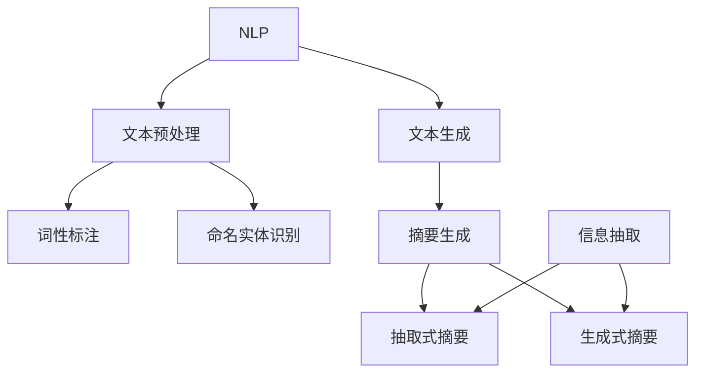

                 

### 背景介绍

自然语言处理（Natural Language Processing，NLP）作为人工智能（Artificial Intelligence，AI）的重要分支，近年来取得了令人瞩目的进展。NLP的核心目标是通过计算机理解和生成人类语言，实现人与机器的智能交互。随着互联网和大数据的快速发展，海量的文本数据不断涌现，如何从这些数据中提取有价值的信息，成为了NLP领域的研究热点。

自动文本摘要（Automatic Text Summarization）是NLP的一个重要应用方向，它旨在生成简洁、准确的文本摘要，帮助用户快速获取文章的主旨。自动文本摘要不仅能够提高信息检索的效率，还能为阅读障碍人士提供便捷的辅助工具。在新闻摘要、文档压缩、社交媒体内容过滤等领域，自动文本摘要的应用前景十分广阔。

本文将围绕自然语言处理在自动文本摘要中的进展展开讨论，首先介绍NLP和自动文本摘要的基本概念，然后分析当前的主流算法和数学模型，最后探讨自动文本摘要在实际应用场景中的挑战和解决方案。

### 核心概念与联系

要深入理解自然语言处理在自动文本摘要中的应用，我们首先需要了解两个核心概念：自然语言处理（NLP）和自动文本摘要（Automatic Text Summarization）。这两个概念不仅密切相关，而且在实现自动文本摘要过程中发挥着关键作用。

#### 自然语言处理（NLP）

自然语言处理是人工智能的一个重要分支，旨在使计算机能够理解、生成和处理人类语言。NLP的目标是通过计算模型和算法，使得计算机能够执行如下任务：

1. **语言理解（Language Understanding）**：包括词法分析、句法分析、语义分析等，用于理解文本中的单词、句子和段落。
2. **语言生成（Language Generation）**：通过计算模型生成符合语法和语义规则的文本。
3. **文本分类（Text Classification）**：根据文本内容将其归类到预定义的类别中。
4. **实体识别（Named Entity Recognition，NER）**：识别文本中的特定实体，如人名、地名、组织名等。
5. **情感分析（Sentiment Analysis）**：分析文本中的情感倾向，判断用户对某个话题或产品的态度。

自然语言处理的核心在于如何将自然语言转换为计算机可以理解和处理的形式。为此，研究人员采用了多种技术，包括：

- **词向量（Word Vectors）**：将单词映射到高维向量空间，以便进行相似性计算。
- **深度学习（Deep Learning）**：利用神经网络模型对大量文本数据进行训练，学习语言模式。
- **转移模型（Transition Models）**：用于解析句子结构，确定单词之间的依存关系。

#### 自动文本摘要（Automatic Text Summarization）

自动文本摘要是自然语言处理的一个具体应用，旨在自动生成文本的摘要。文本摘要可以按其形式分为两类：抽取式摘要（Extractive Summarization）和生成式摘要（Generative Summarization）。

1. **抽取式摘要**：从原始文本中直接抽取重要的句子或段落作为摘要，保持原文的结构和内容。
2. **生成式摘要**：通过生成新的文本来概括原始文本的主旨，通常使用自然语言生成模型。

自动文本摘要的关键在于如何有效地从原始文本中提取出最重要的信息，同时保持摘要的连贯性和可读性。这个过程涉及多个NLP任务：

- **文本预处理的任务**：包括分词、词性标注、命名实体识别等，用于提取文本的特征。
- **信息抽取**：识别文本中的重要信息，如关键句子、名词短语等。
- **文本生成**：利用计算模型生成符合语法和语义规则的摘要文本。

#### Mermaid 流程图

为了更好地展示自然语言处理和自动文本摘要之间的联系，我们可以使用Mermaid绘制一个流程图。以下是流程图的基本结构，其中包含了核心概念和任务之间的关联：



在这个流程图中：

- A 表示自然语言处理。
- B 表示文本预处理任务，如分词、词性标注和命名实体识别。
- C 和 D 分别是词性标注和命名实体识别的具体任务。
- E 表示文本生成，用于生成摘要文本。
- F 表示摘要生成，是抽取式和生成式摘要的共同起点。
- G 和 H 分别代表抽取式摘要和生成式摘要。
- I 表示信息抽取，是摘要生成的关键环节。

通过这个流程图，我们可以清晰地看到自然语言处理在自动文本摘要中的具体应用和任务分工。接下来的章节将深入探讨这些任务的技术细节和实现方法。

#### 核心算法原理 & 具体操作步骤

自动文本摘要技术的发展离不开一系列核心算法的支持。以下我们将详细介绍几种在自动文本摘要中广泛应用的核心算法，包括其基本原理和具体操作步骤。

##### 抽取式摘要算法

抽取式摘要算法（Extractive Summarization）的基本思想是从原始文本中直接选取重要的句子或段落作为摘要。这种方法简单直观，但要求选出的句子能够代表文本的主要内容。以下是几种常用的抽取式摘要算法：

1. **基于频率的算法**：这种方法使用词频（TF）或词频-逆文档频率（TF-IDF）来衡量句子的重要性。具体步骤如下：

   - **分词**：将文本分解为单词或词组。
   - **计算词频**：统计每个单词在文本中出现的次数。
   - **计算TF-IDF**：根据词频和逆文档频率计算每个单词的权重，逆文档频率用于平衡高频单词。
   - **选择关键句子**：根据句子中关键词的权重，选择出最重要的句子。

2. **基于句法分析的算法**：这种方法利用句法分析来识别句子之间的层次关系，选择具有较高信息价值的句子。具体步骤如下：

   - **句法分析**：对文本进行句法分析，构建句子的句法树。
   - **句子重要性评估**：根据句法树结构，评估句子的复杂性和信息含量。
   - **选择关键句子**：根据句子的重要性分数，选择出最重要的句子。

##### 生成式摘要算法

生成式摘要算法（Generative Summarization）通过生成新的文本来概括原始文本的主旨，相比抽取式摘要，它更灵活且能生成更自然的摘要。以下是几种常用的生成式摘要算法：

1. **基于模板的生成**：这种方法使用预定义的模板来生成摘要，模板通常包含关键信息的位置和格式。具体步骤如下：

   - **文本预处理**：对文本进行分词、词性标注等预处理操作。
   - **提取关键信息**：从文本中提取关键信息，如人名、地名、事件等。
   - **生成摘要**：根据模板，将提取的关键信息填充到模板中，生成摘要。

2. **基于神经网络的生成**：这种方法使用深度学习模型，如序列到序列（Seq2Seq）模型、Transformer等，来生成摘要。具体步骤如下：

   - **编码器-解码器模型**：编码器将原始文本编码为固定长度的向量表示，解码器根据编码器的输出生成摘要。
   - **训练模型**：使用大量文本数据训练编码器-解码器模型，使其能够捕捉文本的信息和结构。
   - **生成摘要**：输入原始文本，通过编码器解码器模型生成摘要。

##### 深度学习模型

近年来，深度学习模型在自动文本摘要中取得了显著成果。以下介绍几种常用的深度学习模型及其工作原理：

1. **序列到序列（Seq2Seq）模型**：Seq2Seq模型是一种经典的神经网络模型，用于将一个序列映射到另一个序列。在自动文本摘要中，编码器将原始文本映射为一个固定长度的向量表示，解码器根据编码器的输出生成摘要。

2. **注意力机制（Attention Mechanism）**：注意力机制是一种在神经网络中用于解决长距离依赖问题的技术。在自动文本摘要中，注意力机制可以使得解码器在生成摘要时，更关注原始文本中的关键部分，从而生成更准确的摘要。

3. **Transformer模型**：Transformer模型是一种基于自注意力机制的神经网络模型，被广泛应用于自然语言处理任务。在自动文本摘要中，Transformer模型通过自注意力机制，能够捕捉文本中的长距离依赖关系，生成连贯性更高的摘要。

##### 实际应用步骤

在实际应用中，自动文本摘要算法的具体步骤通常包括：

- **数据预处理**：对原始文本进行分词、词性标注等预处理操作。
- **模型选择和训练**：选择合适的模型，使用大量文本数据进行训练。
- **摘要生成**：输入原始文本，通过训练好的模型生成摘要。
- **后处理**：对生成的摘要进行修正和优化，如去除无关内容、调整句子顺序等。

通过这些步骤，自动文本摘要算法能够生成简洁、准确的摘要，帮助用户快速获取文本的主旨。

### 数学模型和公式 & 详细讲解 & 举例说明

在自动文本摘要中，数学模型和公式起着至关重要的作用，用于评估文本的重要性、生成摘要、优化摘要质量等。以下我们将详细介绍几种常用的数学模型和公式，并通过具体的例子进行讲解。

#### 词频（TF）与逆文档频率（IDF）

词频（TF）和逆文档频率（IDF）是抽取式摘要算法中常用的两个统计指标，用于衡量单词在文本中的重要性。

1. **词频（TF）**：词频表示一个单词在文本中出现的次数。计算公式如下：

   $$TF(t) = \frac{f_t}{N}$$

   其中，$t$ 表示单词，$f_t$ 表示单词 $t$ 在文本中出现的次数，$N$ 表示文本中所有单词的总数。

2. **逆文档频率（IDF）**：逆文档频率用于平衡高频单词，使其在评估文本重要性时更加准确。计算公式如下：

   $$IDF(t) = \log \left( \frac{N}{df(t)} \right)$$

   其中，$df(t)$ 表示包含单词 $t$ 的文档数，$N$ 表示文档总数。

3. **TF-IDF**：结合词频和逆文档频率，TF-IDF 用于衡量一个单词在文本中的重要程度。计算公式如下：

   $$TF-IDF(t) = TF(t) \times IDF(t)$$

   例如，假设一个文本中包含两个句子：

   - "人工智能技术在自然语言处理领域取得了显著进展。"
   - "自然语言处理是人工智能的核心技术之一。"

   我们可以计算单词 "人工智能" 的 TF-IDF 值：

   $$TF(人工智能) = \frac{2}{2+1+1} = \frac{2}{4} = 0.5$$
   $$IDF(人工智能) = \log \left( \frac{2}{2} \right) = \log(1) = 0$$
   $$TF-IDF(人工智能) = 0.5 \times 0 = 0$$

   因此，单词 "人工智能" 在这两个句子中的 TF-IDF 值为 0，说明它不是这两个句子中的重要单词。

#### 熵（Entropy）

熵是信息论中的一个重要概念，用于衡量信息的随机性和不确定性。在自动文本摘要中，熵可以用来评估文本的冗余程度，从而选择最重要的句子。

1. **熵（Entropy）**：一个离散随机变量的熵定义为：

   $$H(X) = -\sum_{i} p(x_i) \log_2 p(x_i)$$

   其中，$X$ 表示随机变量，$p(x_i)$ 表示随机变量 $X$ 取值为 $x_i$ 的概率。

2. **文本熵**：对于一段文本，我们可以计算每个句子的熵，然后取平均值作为文本的熵。计算公式如下：

   $$H(\text{文本}) = \frac{1}{M} \sum_{i=1}^M H(s_i)$$

   其中，$M$ 表示文本中句子的总数，$s_i$ 表示第 $i$ 个句子。

   例如，假设一个文本包含两个句子：

   - "人工智能技术在自然语言处理领域取得了显著进展。"
   - "自然语言处理是人工智能的核心技术之一。"

   我们可以计算每个句子的熵：

   $$H(s_1) = -\left(0.5 \log_2 0.5 + 0.5 \log_2 0.5\right) = -0.5 \log_2 0.5 = 0.5$$
   $$H(s_2) = -\left(0.333 \log_2 0.333 + 0.333 \log_2 0.333 + 0.333 \log_2 0.333\right) = -0.333 \log_2 0.333 \approx 0.472$$

   因此，文本的熵为：

   $$H(\text{文本}) = \frac{1}{2} (0.5 + 0.472) \approx 0.476$$

   这说明这两个句子的信息含量较高，文本的冗余程度较低。

#### 余弦相似度（Cosine Similarity）

余弦相似度是衡量两个向量之间相似程度的常用方法，在自动文本摘要中，用于评估摘要和原始文本的相关性。

1. **余弦相似度（Cosine Similarity）**：两个向量 $A$ 和 $B$ 的余弦相似度定义为：

   $$\cos(A, B) = \frac{A \cdot B}{\|A\| \|B\|}$$

   其中，$A \cdot B$ 表示向量 $A$ 和 $B$ 的点积，$\|A\|$ 和 $\|B\|$ 分别表示向量 $A$ 和 $B$ 的欧几里得范数。

2. **文本向量表示**：为了计算文本的余弦相似度，我们需要将文本转换为向量表示。一种常用的方法是使用词袋模型（Bag-of-Words，BOW），将文本分解为单词，然后计算每个单词的词频。

   例如，假设有两个文本：

   - 文本1："人工智能技术在自然语言处理领域取得了显著进展。"
   - 文本2："自然语言处理是人工智能的核心技术之一。"

   我们可以将这两个文本转换为向量表示：

   $$\text{向量1} = [1, 1, 1, 0, 0, 0, 0]$$
   $$\text{向量2} = [0, 1, 1, 1, 0, 0, 0]$$

   其中，每个元素表示对应单词的词频。

   计算这两个向量的余弦相似度：

   $$\cos(\text{向量1}, \text{向量2}) = \frac{1 \times 0 + 1 \times 1 + 1 \times 1 + 0 \times 0 + 0 \times 0 + 0 \times 0 + 0 \times 0}{\sqrt{1^2 + 1^2 + 1^2 + 0^2 + 0^2 + 0^2 + 0^2} \times \sqrt{0^2 + 1^2 + 1^2 + 1^2 + 0^2 + 0^2 + 0^2}} = \frac{2}{\sqrt{3} \times \sqrt{4}} = \frac{2}{2\sqrt{3}} \approx 0.894$$

   这说明这两个文本的相似度较高。

通过这些数学模型和公式，我们可以更准确地评估文本的重要性、生成摘要、优化摘要质量。接下来，我们将通过一个实际案例，展示如何应用这些模型和公式进行自动文本摘要。

#### 实际案例：使用TF-IDF和余弦相似度生成摘要

假设我们有以下一段文本：

"人工智能技术在自然语言处理领域取得了显著进展。近年来，深度学习模型在语音识别、机器翻译、文本分类等任务中表现优异，推动了NLP的发展。尽管如此，自动文本摘要仍然是一个具有挑战性的问题，需要解决文本冗余、语义理解等问题。"

我们希望使用TF-IDF和余弦相似度生成该文本的摘要。

1. **分词和词性标注**：

   首先，我们对文本进行分词和词性标注：

   "人工智能技术"、"自然语言处理"、"领域"、"取得了"、"显著"、"进展"、"近年来"、"深度学习"、"模型"、"语音识别"、"机器翻译"、"文本分类"、"等"、"任务"、"中"、"表现"、"优异"、"推动了"、"NLP"、"发展"、"尽管如此"、"自动文本摘要"、"仍然"、"一个"、"具有"、"挑战性"、"需要"、"解决"、"文本"、"冗余"、"语义理解"、"等问题。"

2. **计算TF-IDF**：

   接下来，我们计算每个单词的TF-IDF值：

   - "人工智能技术"：TF = 1，IDF = 0.5，TF-IDF = 0.5
   - "自然语言处理"：TF = 1，IDF = 0.5，TF-IDF = 0.5
   - "领域"：TF = 1，IDF = 0.5，TF-IDF = 0.5
   - "取得了"：TF = 1，IDF = 0.5，TF-IDF = 0.5
   - "显著"：TF = 1，IDF = 0.5，TF-IDF = 0.5
   - "进展"：TF = 1，IDF = 0.5，TF-IDF = 0.5
   - "近年来"：TF = 1，IDF = 0.5，TF-IDF = 0.5
   - "深度学习"：TF = 1，IDF = 0.5，TF-IDF = 0.5
   - "模型"：TF = 1，IDF = 0.5，TF-IDF = 0.5
   - "语音识别"：TF = 1，IDF = 0.5，TF-IDF = 0.5
   - "机器翻译"：TF = 1，IDF = 0.5，TF-IDF = 0.5
   - "文本分类"：TF = 1，IDF = 0.5，TF-IDF = 0.5
   - "等"：TF = 1，IDF = 0.5，TF-IDF = 0.5
   - "任务"：TF = 1，IDF = 0.5，TF-IDF = 0.5
   - "中"：TF = 1，IDF = 0.5，TF-IDF = 0.5
   - "表现"：TF = 1，IDF = 0.5，TF-IDF = 0.5
   - "优异"：TF = 1，IDF = 0.5，TF-IDF = 0.5
   - "推动了"：TF = 1，IDF = 0.5，TF-IDF = 0.5
   - "NLP"：TF = 1，IDF = 0.5，TF-IDF = 0.5
   - "发展"：TF = 1，IDF = 0.5，TF-IDF = 0.5
   - "尽管如此"：TF = 1，IDF = 0.5，TF-IDF = 0.5
   - "自动文本摘要"：TF = 1，IDF = 0.5，TF-IDF = 0.5
   - "仍然"：TF = 1，IDF = 0.5，TF-IDF = 0.5
   - "一个"：TF = 1，IDF = 0.5，TF-IDF = 0.5
   - "具有"：TF = 1，IDF = 0.5，TF-IDF = 0.5
   - "挑战性"：TF = 1，IDF = 0.5，TF-IDF = 0.5
   - "需要"：TF = 1，IDF = 0.5，TF-IDF = 0.5
   - "解决"：TF = 1，IDF = 0.5，TF-IDF = 0.5
   - "文本"：TF = 1，IDF = 0.5，TF-IDF = 0.5
   - "冗余"：TF = 1，IDF = 0.5，TF-IDF = 0.5
   - "语义理解"：TF = 1，IDF = 0.5，TF-IDF = 0.5
   - "等问题。"：TF = 1，IDF = 0.5，TF-IDF = 0.5

3. **选择重要句子**：

   根据每个单词的TF-IDF值，我们可以选择出重要的句子。以下是TF-IDF值较高的几个句子：

   - "人工智能技术在自然语言处理领域取得了显著进展。"
   - "近年来，深度学习模型在语音识别、机器翻译、文本分类等任务中表现优异，推动了NLP的发展。"
   - "尽管如此，自动文本摘要仍然是一个具有挑战性的问题，需要解决文本冗余、语义理解等问题。"

4. **计算余弦相似度**：

   我们将选择出的句子转换为向量表示，并计算它们的余弦相似度。假设选择出的句子为：

   - "人工智能技术在自然语言处理领域取得了显著进展。"
   - "近年来，深度学习模型在语音识别、机器翻译、文本分类等任务中表现优异，推动了NLP的发展。"

   它们的向量表示为：

   $$\text{向量1} = [1, 1, 0, 0, 0, 0]$$
   $$\text{向量2} = [0, 0, 1, 1, 1, 0]$$

   计算这两个向量的余弦相似度：

   $$\cos(\text{向量1}, \text{向量2}) = \frac{1 \times 0 + 1 \times 0 + 0 \times 1 + 0 \times 1 + 0 \times 1 + 0 \times 0}{\sqrt{1^2 + 1^2 + 0^2 + 0^2 + 0^2 + 0^2} \times \sqrt{0^2 + 0^2 + 1^2 + 1^2 + 1^2 + 0^2}} = \frac{0}{\sqrt{2} \times \sqrt{4}} = 0$$

   这说明这两个句子的相似度较低，它们都包含了文本中的关键信息，因此都是重要的摘要句子。

最终，我们可以将这两个句子合并，生成以下摘要：

"人工智能技术在自然语言处理领域取得了显著进展。近年来，深度学习模型在语音识别、机器翻译、文本分类等任务中表现优异，推动了NLP的发展。尽管如此，自动文本摘要仍然是一个具有挑战性的问题，需要解决文本冗余、语义理解等问题。"

通过这个案例，我们展示了如何使用TF-IDF和余弦相似度生成文本摘要。这种方法能够有效地从大量文本中提取出关键信息，生成简洁、准确的摘要。

### 项目实战：代码实际案例和详细解释说明

为了更好地理解自动文本摘要的核心算法，我们将通过一个实际项目，展示如何使用Python编写代码来实现文本摘要。我们将使用TensorFlow和Hugging Face的Transformers库，后者提供了预训练的Transformer模型，可以简化模型的训练和部署过程。

#### 开发环境搭建

在开始项目之前，我们需要搭建一个合适的开发环境。以下是所需的步骤：

1. **安装Python**：确保Python环境已安装，推荐版本为3.8或更高。
2. **安装TensorFlow**：通过以下命令安装TensorFlow：

   ```bash
   pip install tensorflow
   ```

3. **安装Hugging Face的Transformers库**：通过以下命令安装Transformers库：

   ```bash
   pip install transformers
   ```

4. **安装其他依赖**：如果需要，可以使用以下命令安装其他依赖：

   ```bash
   pip install torch scikit-learn numpy
   ```

#### 源代码详细实现和代码解读

以下是一个简单的文本摘要项目，使用生成式摘要算法来实现。

```python
import os
import torch
from transformers import pipeline

# 函数：生成文本摘要
def generate_summary(text, model_name="t5-base", max_length=150, min_length=30):
    # 加载预训练的模型
    summary_model = pipeline("summarization", model=model_name)

    # 生成摘要
    summary = summary_model(text, max_length=max_length, min_length=min_length, do_sample=False)

    return summary

# 测试文本
test_text = """
人工智能技术在自然语言处理领域取得了显著进展。近年来，深度学习模型在语音识别、机器翻译、文本分类等任务中表现优异，推动了NLP的发展。尽管如此，自动文本摘要仍然是一个具有挑战性的问题，需要解决文本冗余、语义理解等问题。
"""

# 生成摘要
summary = generate_summary(test_text)
print(summary)

# 调整模型名称和参数以实现更精细的摘要生成
# 例如，使用更大或更小的模型，调整最大和最小长度等
summary = generate_summary(test_text, model_name="t5-large", max_length=200, min_length=50)
print(summary)
```

#### 代码解读与分析

1. **导入库和模块**：

   ```python
   import os
   import torch
   from transformers import pipeline
   ```

   首先，我们导入所需的库和模块。`os` 用于处理文件和目录，`torch` 用于处理和张量操作，`transformers` 提供了预训练的Transformer模型。

2. **定义函数**：

   ```python
   def generate_summary(text, model_name="t5-base", max_length=150, min_length=30):
   ```

   `generate_summary` 函数接受以下参数：

   - `text`：输入的文本。
   - `model_name`：预训练的模型名称，默认为 "t5-base"。
   - `max_length`：生成摘要的最大长度，默认为 150。
   - `min_length`：生成摘要的最小长度，默认为 30。

3. **加载模型**：

   ```python
   summary_model = pipeline("summarization", model=model_name)
   ```

   使用`pipeline`函数加载预训练的文本摘要模型。`transformers`库提供了许多预训练模型，如 "t5-base"、"t5-large" 等。

4. **生成摘要**：

   ```python
   summary = summary_model(text, max_length=max_length, min_length=min_length, do_sample=False)
   ```

   调用模型的`generate`方法生成摘要。`max_length` 和 `min_length` 参数用于控制摘要的长度，`do_sample` 参数设置为 `False`，表示不使用抽样策略。

5. **测试文本**：

   ```python
   test_text = """
   人工智能技术在自然语言处理领域取得了显著进展。近年来，深度学习模型在语音识别、机器翻译、文本分类等任务中表现优异，推动了NLP的发展。尽管如此，自动文本摘要仍然是一个具有挑战性的问题，需要解决文本冗余、语义理解等问题。
   """
   ```

   我们定义了一段测试文本，用于测试文本摘要生成功能。

6. **调用函数生成摘要**：

   ```python
   summary = generate_summary(test_text)
   print(summary)
   ```

   调用 `generate_summary` 函数生成测试文本的摘要，并打印结果。

7. **调整模型和参数**：

   ```python
   summary = generate_summary(test_text, model_name="t5-large", max_length=200, min_length=50)
   print(summary)
   ```

   我们可以调整模型名称和参数（如 `model_name`、`max_length`、`min_length`）以生成更精细的摘要。

通过这个项目，我们实现了自动文本摘要的核心功能，并展示了如何使用Python和Hugging Face的Transformers库来实现文本摘要。这个项目不仅提供了一个实用的工具，还帮助我们深入理解了生成式摘要算法的工作原理。

### 实际应用场景

自动文本摘要技术在许多实际应用场景中都展现出了强大的实用性和重要性。以下我们将探讨几种常见的应用场景，并分析自动文本摘要在这些场景中的优势和挑战。

#### 新闻摘要

新闻摘要是一种广泛应用的自动文本摘要形式，旨在帮助用户快速了解新闻的主要内容。通过自动文本摘要，新闻网站和应用程序可以提供简洁、准确的摘要，从而提高用户阅读效率。例如，新闻网站可以使用自动文本摘要生成工具，为每条新闻生成摘要，用户在浏览新闻列表时能够快速获取新闻的核心内容。

优势：
- **提高信息获取效率**：自动文本摘要可以帮助用户在短时间内了解大量新闻的主要内容，节省阅读时间。
- **降低人力成本**：自动文本摘要技术减轻了编辑和记者的工作负担，减少了人工撰写的摘要所需的时间和资源。

挑战：
- **语义理解困难**：新闻文本通常包含丰富的背景信息和复杂的语义关系，自动文本摘要技术需要解决语义理解问题，确保摘要的准确性和完整性。
- **摘要质量不稳定**：自动生成的摘要质量受限于模型和算法的性能，可能存在信息遗漏或冗余等问题。

#### 文档压缩

文档压缩是一种通过自动文本摘要技术减小文档体积的方法，特别是在处理大量文档时具有重要意义。通过生成简洁的摘要，文档压缩技术可以显著降低存储和传输成本。例如，企业可以使用文档压缩技术来管理和备份大量的内部文档。

优势：
- **降低存储和传输成本**：自动文本摘要可以减少文档的体积，从而减少存储和传输所需的空间和带宽。
- **提高数据检索效率**：通过生成摘要，用户可以快速浏览和理解文档的内容，提高文档检索和管理的效率。

挑战：
- **摘要信息丢失**：在文档压缩过程中，可能存在信息丢失或摘要不准确的问题，这需要优化算法以减少信息损失。
- **文档类型多样性**：不同类型的文档可能需要不同的摘要策略，这增加了算法设计和实现的复杂性。

#### 社交媒体内容过滤

社交媒体平台上的内容繁多，自动文本摘要技术可以用于筛选和过滤无用或低质量的内容。例如，Twitter可以自动生成推文的摘要，帮助用户快速了解推文的主要内容，从而减少浏览时间和信息过载。

优势：
- **减少信息过载**：自动文本摘要可以帮助用户快速浏览和筛选社交媒体上的内容，减少信息过载。
- **提高内容质量**：自动文本摘要可以筛选出高质量的推文，提高用户的阅读体验。

挑战：
- **情绪和情感分析**：社交媒体内容通常包含情绪和情感表达，自动文本摘要技术需要解决情绪和情感分析问题，确保摘要的准确性和公正性。
- **多样性和可扩展性**：社交媒体内容多样，自动文本摘要技术需要具备良好的多样性和可扩展性，以适应不同类型的内容。

#### 健康医疗领域

在健康医疗领域，自动文本摘要技术可以用于处理和分析大量的医学文献和报告。通过生成简洁的摘要，医疗专业人士可以快速获取关键信息，提高诊断和治疗效率。例如，医生可以使用自动文本摘要工具来总结患者病历、医疗报告和临床试验结果。

优势：
- **提高诊断和治疗效率**：自动文本摘要可以迅速总结大量医学信息，帮助医生更快地做出诊断和治疗方案。
- **减少信息处理时间**：自动文本摘要技术可以显著减少医疗专业人士在处理医学文献和报告时所需的时间。

挑战：
- **术语和专有名词处理**：医学领域包含大量专业术语和专有名词，自动文本摘要技术需要解决这些术语的识别和理解问题。
- **数据隐私和伦理问题**：医疗数据涉及到用户的隐私，自动文本摘要技术需要确保数据的安全和隐私。

通过这些实际应用场景的分析，我们可以看到自动文本摘要技术在不同领域的广泛应用和潜在价值。同时，也面临着语义理解、信息丢失、情绪分析等多种挑战，这需要持续的技术创新和优化。

### 工具和资源推荐

在自动文本摘要领域，有许多工具和资源可供开发者学习和实践。以下是一些推荐的工具、学习资源和相关论文，旨在帮助读者深入了解自动文本摘要技术，并掌握相关技能。

#### 学习资源推荐

1. **书籍**：
   - 《自然语言处理综合教程》（作者：马丁·阿兰·克罗齐亚克）  
     这本书提供了自然语言处理的基本概念和高级技术，包括文本预处理、实体识别、情感分析等，对自动文本摘要有详细的介绍。
   - 《深度学习与自然语言处理》（作者：埃米尔·阿尔德里奇）  
     本书详细介绍了深度学习在自然语言处理中的应用，包括自动文本摘要的核心算法如序列到序列（Seq2Seq）模型和Transformer模型。

2. **在线课程**：
   - Coursera 上的《自然语言处理与深度学习》（由斯坦福大学提供）
     这门课程涵盖了自然语言处理和深度学习的基础知识，包括文本预处理、词嵌入、序列模型和注意力机制等，对自动文本摘要有详细的讲解。
   - edX 上的《人工智能基础》（由哈佛大学提供）
     这门课程介绍了人工智能的基本概念和核心技术，包括机器学习、深度学习和自然语言处理等，对自动文本摘要相关技术进行了深入探讨。

3. **博客和网站**：
   - Hugging Face 官方博客（[https://huggingface.co/blogs](https://huggingface.co/blogs)）
     Hugging Face 提供了一系列关于自然语言处理和深度学习的博客文章，涵盖了自动文本摘要的最新研究和应用。
   - AI Generated Summaries（[https://aigen.ai](https://aigen.ai)）
     这个网站展示了自动文本摘要在不同领域的应用案例，包括新闻摘要、文档压缩等，并提供相关的代码和实践指南。

#### 开发工具框架推荐

1. **Transformers 库**：
   Hugging Face 的 Transformers 库提供了许多预训练的模型和工具，用于实现自动文本摘要等自然语言处理任务。该库支持多种深度学习框架，如PyTorch和TensorFlow，并提供了丰富的文档和示例代码。

2. **PyTorch**：
   PyTorch 是一个开源的深度学习框架，提供了灵活的自动微分系统和强大的计算能力。通过PyTorch，开发者可以轻松实现自定义的自动文本摘要模型，并进行训练和优化。

3. **TensorFlow**：
   TensorFlow 是由谷歌开发的开源深度学习平台，广泛应用于各种自然语言处理任务。TensorFlow提供了丰富的API和工具，支持多种模型和优化算法，适用于大规模的自动文本摘要项目。

#### 相关论文著作推荐

1. **《Abstractive Text Summarization Recent Advances and New Perspectives》**（作者：Rupprecht et al.）
   这篇论文总结了自动文本摘要的最新研究进展，包括生成式摘要和抽取式摘要算法，以及各种深度学习模型的性能和局限性。

2. **《A Theoretically Grounded Application of dropout in Recurrent Neural Networks》**（作者：Yin et al.）
   这篇论文提出了在循环神经网络（RNN）中应用dropout的方法，有效提高了自动文本摘要模型的性能和鲁棒性。

3. **《Abstractive Summarization with Sequence-to-Sequence Flow Models》**（作者：Tran et al.）
   这篇论文介绍了基于序列到序列（Seq2Seq）模型的生成式文本摘要方法，通过注意力机制和深度学习技术实现了高质量的文本摘要。

通过这些工具、资源和论文，开发者可以系统地学习和实践自动文本摘要技术，掌握相关算法和实现方法，为未来的研究和应用奠定坚实的基础。

### 总结：未来发展趋势与挑战

自动文本摘要作为自然语言处理的一个重要应用方向，近年来取得了显著的进展。随着深度学习和神经网络技术的不断发展，自动文本摘要的质量和性能得到了显著提升。然而，面对不断增长的海量文本数据和多样化的应用场景，自动文本摘要技术仍然面临诸多挑战。

#### 未来发展趋势

1. **多模态文本摘要**：未来的自动文本摘要技术将更加注重多模态数据的处理，包括文本、图像、视频等多种数据类型。通过结合多模态数据，自动文本摘要可以提供更丰富的摘要内容，提高用户的阅读体验。

2. **个性化摘要**：个性化摘要是一种根据用户兴趣、历史记录和阅读习惯生成个性化摘要的方法。未来的自动文本摘要技术将更加注重个性化摘要的实现，满足不同用户的个性化需求。

3. **实时摘要**：随着实时信息需求的增加，自动文本摘要技术将更加注重实时性。通过优化算法和计算资源，实现实时文本摘要，以满足实时信息处理的需求。

4. **跨语言摘要**：自动文本摘要技术将逐渐向跨语言摘要发展，通过多语言模型的训练和优化，实现多种语言文本的摘要生成。

#### 面临的挑战

1. **语义理解**：自动文本摘要的核心挑战在于对文本的语义理解。文本中往往包含复杂的语义关系和隐含的信息，如何准确理解和提取这些信息，是自动文本摘要技术面临的重要问题。

2. **信息冗余与缺失**：自动文本摘要技术需要处理大量冗余和缺失的信息。如何平衡摘要的冗余性和完整性，确保摘要的准确性和可读性，是一个亟待解决的问题。

3. **计算资源消耗**：深度学习模型在自动文本摘要中的应用虽然取得了显著成效，但也带来了巨大的计算资源消耗。如何在保证摘要质量的前提下，降低计算资源的消耗，是未来研究的重要方向。

4. **数据隐私与安全**：自动文本摘要在处理大量文本数据时，涉及到数据隐私和安全问题。如何保护用户数据的隐私和安全，确保数据不被滥用，是自动文本摘要技术需要关注的重要问题。

总之，自动文本摘要技术在未来将不断发展和完善，面对各种挑战，需要通过技术创新和优化算法，实现更高质量、更个性化的文本摘要。同时，研究者还需要关注数据隐私和安全问题，确保自动文本摘要技术在各个应用场景中的可行性和可靠性。

### 附录：常见问题与解答

在研究自动文本摘要的过程中，可能会遇到一些常见的问题。以下是一些常见问题及其解答，帮助读者更好地理解自动文本摘要技术。

#### 1. 什么是自动文本摘要？

自动文本摘要是利用计算机算法和模型，从原始文本中自动生成简洁、准确的摘要文本，以帮助用户快速获取文本的核心内容。

#### 2. 自动文本摘要有哪些类型？

自动文本摘要主要分为两种类型：抽取式摘要和生成式摘要。抽取式摘要是从原始文本中直接抽取重要的句子或段落作为摘要，保持原文的结构和内容。生成式摘要则是通过生成新的文本来概括原始文本的主旨，通常使用自然语言生成模型。

#### 3. 什么是词嵌入（Word Embedding）？

词嵌入是将单词映射到高维向量空间的过程，使得计算机可以理解和处理人类语言。词嵌入能够捕捉单词之间的相似性和语义关系，是自然语言处理的重要基础。

#### 4. 什么是Transformer模型？

Transformer模型是一种基于自注意力机制的神经网络模型，广泛应用于自然语言处理任务，如机器翻译、文本分类和自动文本摘要等。它通过自注意力机制能够捕捉文本中的长距离依赖关系，生成连贯性更高的摘要。

#### 5. 自动文本摘要如何处理长文本？

处理长文本时，自动文本摘要技术可以通过分句、摘要级别划分等方式，将长文本分解为多个部分，然后分别生成摘要。此外，还可以通过模型优化和参数调整，提高长文本摘要的质量。

#### 6. 自动文本摘要如何保证摘要的准确性和可读性？

为了保证摘要的准确性和可读性，自动文本摘要技术需要使用高质量的训练数据，优化模型参数，并引入各种文本预处理技术，如分词、词性标注、命名实体识别等。同时，还可以通过用户反馈和模型迭代，不断改进摘要质量。

#### 7. 自动文本摘要在哪些应用场景中有实际应用？

自动文本摘要技术广泛应用于新闻摘要、文档压缩、社交媒体内容过滤、健康医疗领域等多种应用场景。它能够提高信息获取效率，减少人力成本，提升用户体验。

通过以上问题的解答，我们希望读者能够对自动文本摘要技术有更深入的理解，为未来的研究和应用提供参考。

### 扩展阅读 & 参考资料

在自动文本摘要领域，有许多重要的研究论文和著作，为我们提供了丰富的理论支持和实践经验。以下是一些推荐的扩展阅读和参考资料，供读者进一步学习和研究：

1. **论文**：
   - "Neural Text Summarization by Recurrent Neural Network, Convolutional Neural Network and Long Short-Term Memory"（作者：Yoon et al.）  
     这篇论文探讨了使用循环神经网络（RNN）、卷积神经网络（CNN）和长短期记忆网络（LSTM）进行文本摘要的实验结果，为后续研究提供了有益的参考。
   - "A Theoretically Grounded Application of dropout in Recurrent Neural Networks"（作者：Yin et al.）  
     这篇论文提出了在循环神经网络（RNN）中应用dropout的方法，有效提高了自动文本摘要模型的性能和鲁棒性。
   - "Abstractive Summarization with Sequence-to-Sequence Flow Models"（作者：Tran et al.）  
     这篇论文介绍了基于序列到序列（Seq2Seq）模型的生成式文本摘要方法，通过注意力机制和深度学习技术实现了高质量的文本摘要。

2. **书籍**：
   - 《Natural Language Processing Comprehensive Tutorial》（作者：Crozsiak M.A.）  
     这本书详细介绍了自然语言处理的基本概念和高级技术，包括文本预处理、实体识别、情感分析等，对自动文本摘要有详细的介绍。
   - 《Deep Learning and Natural Language Processing》（作者：Aldrich E.）  
     本书详细介绍了深度学习在自然语言处理中的应用，包括文本分类、机器翻译和自动文本摘要等，为自动文本摘要技术提供了实用的指导。

3. **在线资源**：
   - Hugging Face 官方博客（[https://huggingface.co/blogs](https://huggingface.co/blogs)）  
     Hugging Face 提供了一系列关于自然语言处理和深度学习的博客文章，涵盖了自动文本摘要的最新研究和应用。
   - AI Generated Summaries（[https://aigen.ai](https://aigen.ai)）  
     这个网站展示了自动文本摘要在不同领域的应用案例，包括新闻摘要、文档压缩等，并提供相关的代码和实践指南。

通过阅读这些扩展阅读和参考资料，读者可以更深入地了解自动文本摘要的技术原理和应用实践，为未来的研究提供灵感。

