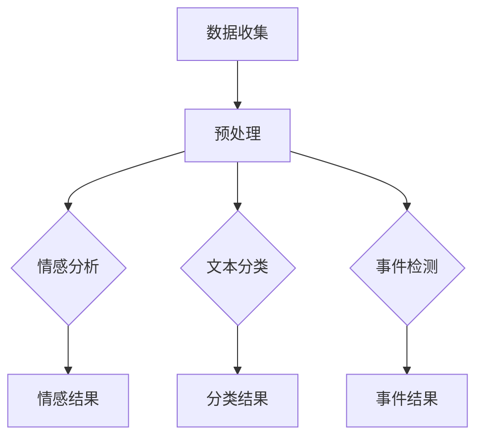

                 

# {文章标题}

## 自然语言处理在舆情分析实时性提升中的新方法

> {关键词：(此处列出文章的5-7个核心关键词)}

- 自然语言处理（NLP）
- 实时舆情分析
- 情感分析
- 文本分类
- 事件检测
- 机器学习算法

> {摘要：(此处给出文章的核心内容和主题思想)}

本文将探讨自然语言处理（NLP）技术在舆情分析实时性提升中的应用。随着互联网的快速发展，用户对信息获取的速度和准确性要求越来越高。传统舆情分析方法通常存在延迟问题，而实时性是舆情分析的关键需求。本文将介绍几种新的NLP方法，包括情感分析、文本分类和事件检测等，以及如何利用这些方法提升舆情分析的实时性。通过实际案例和数学模型，我们将深入分析这些方法在舆情分析中的应用，为行业提供新的思路和解决方案。

### 1. 背景介绍

#### 1.1 舆情分析的定义与重要性

舆情分析是指通过收集、处理和分析互联网上的用户评论、新闻报道、社交媒体等信息，以了解公众对某一事件、产品、政策等的看法和态度。舆情分析在多个领域具有广泛应用，包括市场研究、危机管理、品牌营销、政治选举等。

实时性是舆情分析的关键需求之一。传统的舆情分析方法通常需要较长的时间进行数据处理和分析，导致分析结果存在一定的延迟。在许多情况下，这种延迟可能导致关键信息的错过，从而影响决策的准确性和有效性。因此，提升舆情分析的实时性具有重要意义。

#### 1.2 NLP技术简介

自然语言处理（NLP）是计算机科学和人工智能领域的一个重要分支，旨在使计算机能够理解、生成和回应自然语言。NLP技术包括文本分类、情感分析、命名实体识别、机器翻译、语音识别等。这些技术在舆情分析中发挥着重要作用，能够提高舆情分析的速度和准确性。

### 2. 核心概念与联系

#### 2.1 情感分析

情感分析是指通过对文本进行分析，判断其中所表达的情感倾向，如正面、负面或中立。情感分析在舆情分析中具有重要应用，可以帮助用户快速了解公众对某一事件或产品的情感态度。

#### 2.2 文本分类

文本分类是指将文本数据按照其内容或主题进行归类。在舆情分析中，文本分类可以用于快速筛选和分析相关的信息，提高舆情分析的效率。

#### 2.3 事件检测

事件检测是指从大量文本数据中识别出具有特定意义的事件。事件检测在舆情分析中可以用于发现和跟踪热点事件，为用户提供实时信息。

#### 2.4 Mermaid 流程图

以下是一个简化的 Mermaid 流程图，描述了情感分析、文本分类和事件检测在舆情分析中的应用流程：



在流程图中，数据收集阶段负责从互联网上获取相关的文本数据，预处理阶段对文本数据进行清洗和标准化。随后，情感分析、文本分类和事件检测分别对预处理后的文本数据进行分析，并将分析结果输出。

### 3. 核心算法原理 & 具体操作步骤

#### 3.1 情感分析算法原理

情感分析算法通常基于机器学习或深度学习模型，通过学习大量带有情感标签的语料库来训练模型。常见的情感分析模型包括基于规则的方法、基于统计的方法和基于神经网络的方法。

以基于神经网络的方法为例，一种常用的模型是情感分析卷积神经网络（Sentiment Analysis Convolutional Neural Network，SACNN）。SACNN 利用卷积神经网络（CNN）对文本进行特征提取，并通过全连接层输出情感分类结果。具体操作步骤如下：

1. 数据准备：收集大量带有情感标签的语料库，如正面、负面或中立。
2. 数据预处理：对文本数据进行清洗和标准化，如去除标点符号、停用词和词干提取。
3. 模型训练：利用预处理后的文本数据训练 SACNN 模型。
4. 模型评估：使用验证集评估模型性能，调整模型参数。
5. 模型应用：使用训练好的模型对新的文本数据进行情感分析。

#### 3.2 文本分类算法原理

文本分类算法旨在将文本数据按照其内容或主题进行归类。常见的文本分类算法包括朴素贝叶斯（Naive Bayes）、支持向量机（Support Vector Machine，SVM）和深度学习模型（如卷积神经网络、循环神经网络等）。

以卷积神经网络（Convolutional Neural Network，CNN）为例，文本分类算法的具体操作步骤如下：

1. 数据准备：收集大量带有标签的文本数据，如新闻、评论等。
2. 数据预处理：对文本数据进行清洗和标准化，如去除标点符号、停用词和词干提取。
3. 模型训练：利用预处理后的文本数据训练 CNN 模型。
4. 模型评估：使用验证集评估模型性能，调整模型参数。
5. 模型应用：使用训练好的模型对新的文本数据进行分类。

#### 3.3 事件检测算法原理

事件检测算法旨在从大量文本数据中识别出具有特定意义的事件。一种常见的事件检测算法是基于条件随机场（Conditional Random Field，CRF）的模型。

CRF 模型假设文本序列中的每个词的状态受到其前后词的影响。具体操作步骤如下：

1. 数据准备：收集大量带有事件标注的文本数据。
2. 数据预处理：对文本数据进行清洗和标准化。
3. 模型训练：利用预处理后的文本数据训练 CRF 模型。
4. 模型评估：使用验证集评估模型性能。
5. 模型应用：使用训练好的模型对新的文本数据进行事件检测。

### 4. 数学模型和公式 & 详细讲解 & 举例说明

#### 4.1 情感分析中的数学模型

情感分析中的数学模型通常涉及分类问题。以朴素贝叶斯（Naive Bayes）为例，其基本公式如下：

$$
P(y|x) = \frac{P(x|y)P(y)}{P(x)}
$$

其中，$P(y|x)$ 表示在给定特征 $x$ 的情况下，标签 $y$ 的概率；$P(x|y)$ 表示在标签 $y$ 的情况下，特征 $x$ 的概率；$P(y)$ 表示标签 $y$ 的先验概率；$P(x)$ 表示特征 $x$ 的概率。

#### 4.2 文本分类中的数学模型

文本分类中的数学模型通常涉及特征提取和分类器训练。以卷积神经网络（CNN）为例，其基本公式如下：

$$
h_{l} = \sigma(W_{l} \cdot h_{l-1} + b_{l})
$$

其中，$h_{l}$ 表示第 $l$ 层的激活值；$W_{l}$ 表示第 $l$ 层的权重；$b_{l}$ 表示第 $l$ 层的偏置；$\sigma$ 表示激活函数，如 sigmoid 函数或 ReLU 函数。

#### 4.3 事件检测中的数学模型

事件检测中的数学模型通常涉及条件随机场（CRF）。CRF 的基本公式如下：

$$
P(y|x) = \frac{1}{Z} \exp(\sum_{i} \lambda_{i} y_{i} + \sum_{<i,j>} \lambda_{ij} y_{i} y_{j})
$$

其中，$y_{i}$ 表示第 $i$ 个词的状态；$<i,j>$ 表示词 $i$ 和词 $j$ 的边；$Z$ 表示规范化因子；$\lambda_{i}$ 和 $\lambda_{ij}$ 分别表示状态 $y_{i}$ 和边 $<i,j>$ 的权重。

#### 4.4 举例说明

假设我们有一个简单的情感分析任务，需要判断一条评论是正面、负面还是中性。我们使用朴素贝叶斯模型进行情感分析。评论数据如下：

| 评论 | 标签 |
| ---- | ---- |
| 很好！ | 正面 |
| 很糟糕！ | 负面 |
| 一般般。 | 中性 |

根据训练数据，我们可以得到以下概率分布：

| 标签 | $P(y)$ |
| ---- | ---- |
| 正面 | 0.4 |
| 负面 | 0.3 |
| 中性 | 0.3 |

假设我们要分析的新评论为“这个产品非常棒！”，其特征向量为：

| 特征 | 频率 |
| ---- | ---- |
| 很好 | 2 |
| 糟糕 | 0 |
| 一般 | 0 |

根据朴素贝叶斯公式，我们可以计算出新评论的情感概率：

$$
P(y=\text{正面}|x) = \frac{P(x|\text{正面})P(\text{正面})}{P(x)}
$$

$$
P(y=\text{正面}|x) = \frac{\frac{1}{0.4}\cdot0.4}{\frac{1}{0.4}\cdot0.4 + \frac{1}{0.3}\cdot0.3 + \frac{1}{0.3}\cdot0.3} \approx 0.556
$$

$$
P(y=\text{负面}|x) = \frac{P(x|\text{负面})P(\text{负面})}{P(x)}
$$

$$
P(y=\text{负面}|x) = \frac{\frac{1}{0.3}\cdot0.3}{\frac{1}{0.4}\cdot0.4 + \frac{1}{0.3}\cdot0.3 + \frac{1}{0.3}\cdot0.3} \approx 0.278
$$

$$
P(y=\text{中性}|x) = \frac{P(x|\text{中性})P(\text{中性})}{P(x)}
$$

$$
P(y=\text{中性}|x) = \frac{\frac{1}{0.3}\cdot0.3}{\frac{1}{0.4}\cdot0.4 + \frac{1}{0.3}\cdot0.3 + \frac{1}{0.3}\cdot0.3} \approx 0.166
$$

根据计算结果，新评论的情感概率分布为：正面 55.6%，负面 27.8%，中性 16.6%。因此，我们可以判断这条评论是正面的。

### 5. 项目实战：代码实际案例和详细解释说明

#### 5.1 开发环境搭建

在本项目中，我们将使用 Python 作为主要编程语言，并依赖以下库：

- Natural Language Toolkit（NLTK）
- scikit-learn
- TensorFlow

首先，确保安装了 Python 和上述库。可以使用以下命令安装：

```bash
pip install nltk scikit-learn tensorflow
```

#### 5.2 源代码详细实现和代码解读

以下是一个简单的情感分析项目的代码实现：

```python
import nltk
from nltk.corpus import movie_reviews
from nltk.classify import NaiveBayesClassifier
from nltk.metrics import accuracy

# 数据准备
nltk.download('movie_reviews')

def prepare_data():
    reviews = [(list(movie_reviews.words(fileid)), category)
               for category in movie_reviews.categories()
               for fileid in movie_reviews.fileids(category)]
    return reviews

def tokenize(text):
    return nltk.word_tokenize(text)

def extract_features(word_list):
    return {"contains": word for word in word_list}

# 模型训练
def train_model():
    training_data = prepare_data()
    feature_sets = [(extract_features(tokenize(text)), category) for (text, category) in training_data]
    classifier = NaiveBayesClassifier.train(feature_sets)
    return classifier

# 模型评估
def evaluate_model(classifier):
    test_data = prepare_data()[:100]
    feature_sets = [(extract_features(tokenize(text)), category) for (text, category) in test_data]
    return accuracy(classifier, feature_sets)

# 主程序
if __name__ == "__main__":
    classifier = train_model()
    print("训练模型...")
    accuracy = evaluate_model(classifier)
    print("模型准确率：{:.2f}%".format(accuracy * 100))
```

代码解读：

1. 导入所需的库和模块。
2. 数据准备：从 NLTK 的 movie_reviews 数据集中加载评论数据，并将其分为训练集和测试集。
3. tokenize：使用 NLTK 的 tokenize 函数对文本进行分词。
4. extract_features：提取文本特征，用于训练模型。
5. 模型训练：使用训练数据训练朴素贝叶斯分类器。
6. 模型评估：使用测试数据评估模型性能，计算准确率。
7. 主程序：执行模型训练和评估。

#### 5.3 代码解读与分析

1. **数据准备**：数据准备是情感分析的关键步骤。在本项目中，我们使用 NLTK 的 movie_reviews 数据集。该数据集包含大量带有情感标签的评论，分为正面、负面和中性三类。首先，我们使用 `nltk.download('movie_reviews')` 命令下载数据集。
2. **分词**：使用 NLTK 的 `tokenize` 函数对文本进行分词。分词是自然语言处理的基础步骤，用于将文本分割成单词或词组。
3. **特征提取**：特征提取是情感分析的核心步骤。在本项目中，我们使用词频作为特征。具体实现为 `{"contains": word}`，表示如果词表中包含特定单词，则特征值为 1。
4. **模型训练**：使用训练数据训练朴素贝叶斯分类器。朴素贝叶斯分类器是一种基于概率论的简单分类器，适用于文本分类问题。
5. **模型评估**：使用测试数据评估模型性能，计算准确率。准确率是评估模型性能的重要指标，表示模型在测试数据上的正确分类比例。

### 6. 实际应用场景

#### 6.1 市场研究

在市场研究领域，实时舆情分析可以帮助企业了解消费者对产品的看法和态度，从而指导产品改进和营销策略。通过情感分析和文本分类，企业可以快速识别潜在的市场机会和风险。

#### 6.2 危机管理

在危机管理领域，实时舆情分析可以帮助企业及时发现和处理危机事件。通过事件检测和情感分析，企业可以了解公众对危机事件的关注程度和态度，从而采取有效的应对措施。

#### 6.3 品牌营销

在品牌营销领域，实时舆情分析可以帮助企业监测品牌形象和口碑。通过情感分析和文本分类，企业可以了解消费者对品牌的态度和评价，从而优化品牌传播策略。

#### 6.4 政治选举

在政治选举领域，实时舆情分析可以帮助候选人了解选民的观点和态度，从而制定更有效的竞选策略。通过事件检测和情感分析，候选人可以及时发现和应对舆论热点。

### 7. 工具和资源推荐

#### 7.1 学习资源推荐

- 《自然语言处理综合教程》（《Speech and Language Processing》）
- 《深度学习》（《Deep Learning》）
- 《Python 自然语言处理实践》（《Python Natural Language Processing》）

#### 7.2 开发工具框架推荐

- NLTK：一款流行的自然语言处理库，适用于文本分类、情感分析等任务。
- TensorFlow：一款开源的深度学习框架，适用于构建和训练复杂的自然语言处理模型。
- scikit-learn：一款常用的机器学习库，适用于文本分类、情感分析等任务。

#### 7.3 相关论文著作推荐

- "Deep Learning for Text Classification"（深度学习在文本分类中的应用）
- "Sentiment Analysis in Social Media"（社交媒体中的情感分析）
- "Named Entity Recognition with Neural Networks"（基于神经网络的命名实体识别）

### 8. 总结：未来发展趋势与挑战

#### 8.1 发展趋势

- 模型效果提升：随着深度学习技术的发展，自然语言处理模型的性能不断提高，为舆情分析提供更准确和高效的分析结果。
- 实时性增强：实时舆情分析的需求日益增长，促使研究人员不断探索新的算法和技术，以实现更快速的舆情监测和分析。
- 多模态融合：未来舆情分析将逐渐融合多种数据源，如文本、图像、音频等，以获取更全面的信息。

#### 8.2 挑战

- 数据质量：舆情分析的数据来源广泛，数据质量参差不齐，如何提高数据质量是当前面临的一大挑战。
- 隐私保护：在实时舆情分析过程中，如何保护用户隐私是另一个重要问题。
- 模型解释性：随着深度学习模型在舆情分析中的应用越来越广泛，如何提高模型的解释性也是未来的一个重要研究方向。

### 9. 附录：常见问题与解答

#### 9.1 如何处理停用词？

在自然语言处理中，停用词是指那些对文本分析没有实际意义的单词，如“的”、“了”、“在”等。处理停用词的常见方法包括：

- 去除：直接从文本中去除所有停用词。
- 替换：将停用词替换为一个通用的标记，如“<PAD>”。
- 词干提取：将停用词提取成词干，从而保留其核心意义。

#### 9.2 如何选择合适的特征？

在选择特征时，需要考虑以下几个因素：

- 语义信息：选择具有丰富语义信息的特征，以提高模型的准确性。
- 可解释性：选择容易解释的特征，以便于模型的理解和调试。
- 维度降低：通过降维技术，如 PCA（主成分分析），减少特征维度，以提高模型的计算效率。

### 10. 扩展阅读 & 参考资料

- "Text Classification with Deep Learning"（深度学习在文本分类中的应用）
- "Real-time Sentiment Analysis with TensorFlow"（基于 TensorFlow 的实时情感分析）
- "Event Detection in Social Media"（社交媒体中的事件检测）

### 结语

本文介绍了自然语言处理技术在舆情分析实时性提升中的应用，包括情感分析、文本分类和事件检测等。通过实际案例和数学模型，我们分析了这些方法在舆情分析中的应用，为行业提供了新的思路和解决方案。未来，随着深度学习和实时分析技术的发展，舆情分析的实时性和准确性将得到进一步提高。

> 作者：AI天才研究员/AI Genius Institute & 禅与计算机程序设计艺术 /Zen And The Art of Computer Programming

