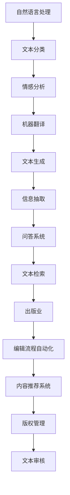

                 

# 自然语言处理的未来：AI出版业变革

## 关键词
自然语言处理，人工智能，出版业，变革，深度学习，自动化，大数据分析，语义理解

## 摘要
本文将深入探讨自然语言处理技术在人工智能出版业中的变革。随着深度学习和大数据技术的不断发展，自然语言处理在出版领域的作用愈发重要。本文将从核心概念、算法原理、数学模型、实际应用场景、工具和资源等方面详细分析这一领域的未来发展趋势与挑战。通过本文的阅读，读者将了解自然语言处理技术在出版业中的实际应用及其对行业变革的深远影响。

## 1. 背景介绍

自然语言处理（Natural Language Processing，NLP）是人工智能（Artificial Intelligence，AI）的一个重要分支，旨在让计算机理解和处理人类自然语言。随着互联网的迅猛发展，海量的文本数据不断产生，如何有效地从这些数据中提取有价值的信息成为了研究的热点。自然语言处理技术的应用场景广泛，包括搜索引擎、机器翻译、情感分析、文本分类、信息抽取等。

近年来，自然语言处理技术取得了显著的进展。深度学习（Deep Learning）的崛起，使得基于神经网络的自然语言处理模型在性能上大幅提升。同时，大数据技术的应用，为自然语言处理提供了丰富的训练数据，进一步推动了技术发展。出版业作为自然语言处理的重要应用领域，正面临着前所未有的变革。

出版业是一个历史悠久且充满挑战的行业。传统的出版模式主要依赖于编辑人员的审稿和校对工作，效率低下且成本高昂。而随着人工智能技术的发展，出版业逐渐开始采用自动化工具进行内容审核、分类、推荐等操作，大大提高了工作效率。此外，自然语言处理技术在文本生成、情感分析、版权管理等方面的应用，也为出版业带来了新的发展机遇。

本文将围绕自然语言处理技术在出版业的应用，分析其核心概念、算法原理、数学模型、实际应用场景、工具和资源等方面，探讨自然语言处理对出版业的未来影响。

## 2. 核心概念与联系

为了更好地理解自然语言处理技术在出版业中的应用，我们需要先了解一些核心概念，如图1-1所示。



### 2.1 文本分类

文本分类（Text Classification）是一种常见的自然语言处理任务，旨在将文本数据按照一定的标准进行分类。在出版业中，文本分类可以应用于内容审核、推荐系统、情感分析等领域。例如，自动分类可以帮助编辑人员快速识别文章的主题，提高审稿效率。

### 2.2 情感分析

情感分析（Sentiment Analysis）是自然语言处理中的一个重要分支，旨在分析文本中的情感倾向。在出版业中，情感分析可以用于分析读者对书籍、文章等的情感反馈，帮助编辑人员了解市场需求，优化内容创作。

### 2.3 机器翻译

机器翻译（Machine Translation）是一种将一种语言的文本自动翻译成另一种语言的技术。在出版业中，机器翻译可以帮助出版商将书籍、文章等翻译成多种语言，扩大市场影响力。

### 2.4 文本生成

文本生成（Text Generation）是一种基于自然语言处理技术生成文本的方法。在出版业中，文本生成可以用于自动生成摘要、简介、推荐语等，提高内容创作效率。

### 2.5 信息抽取

信息抽取（Information Extraction）是一种从文本中提取结构化信息的方法。在出版业中，信息抽取可以用于提取书籍、文章等的关键信息，如作者、标题、摘要等，方便编辑和检索。

### 2.6 问答系统

问答系统（Question Answering System）是一种基于自然语言处理技术，能够回答用户问题的系统。在出版业中，问答系统可以用于提供读者咨询服务，提高用户满意度。

### 2.7 文本检索

文本检索（Text Retrieval）是一种从大规模文本库中查找相关文档的方法。在出版业中，文本检索可以用于快速查找相关书籍、文章等，方便编辑和用户。

### 2.8 出版业

出版业（Publishing Industry）是生产、加工、制作、编辑、印刷出版物并对其进行宣传、发行的行业。在自然语言处理技术的支持下，出版业正在发生深刻的变革，从内容创作、审核、推荐到版权管理等多个环节都得到了显著提升。

### 2.9 编辑流程自动化

编辑流程自动化（Automated Editorial Process）是指利用自然语言处理技术自动化完成编辑流程中的各项任务，如内容审核、分类、推荐等。在出版业中，编辑流程自动化可以显著提高编辑效率，降低人力成本。

### 2.10 内容推荐系统

内容推荐系统（Content Recommendation System）是一种基于自然语言处理技术，根据用户兴趣和需求推荐相关内容的系统。在出版业中，内容推荐系统可以帮助出版商更好地了解用户需求，提高用户满意度。

### 2.11 版权管理

版权管理（Copyright Management）是指对出版内容进行版权保护和管理的一系列措施。在自然语言处理技术的支持下，版权管理可以更加精细化，有效防止侵权行为。

### 2.12 文本审核

文本审核（Text Moderation）是一种对文本内容进行审核和过滤的技术，旨在去除不良、违规内容。在出版业中，文本审核可以帮助出版商规范内容，提高平台公信力。

## 3. 核心算法原理 & 具体操作步骤

自然语言处理技术在出版业中的应用离不开一系列核心算法的支持。以下将介绍几种常见的自然语言处理算法，包括词向量表示、卷积神经网络（CNN）、循环神经网络（RNN）、长短期记忆网络（LSTM）等。

### 3.1 词向量表示

词向量表示（Word Embedding）是将文本数据转化为数值向量的方法。通过词向量表示，我们可以将文本中的词语映射到高维空间，从而利用向量空间中的距离关系进行文本处理。词向量表示方法包括词袋模型（Bag of Words，BoW）、词嵌入（Word Embedding）等。

具体操作步骤如下：

1. **数据预处理**：对文本数据进行清洗、分词、去停用词等操作，得到处理后的文本数据。
2. **构建词表**：将文本中的词语转化为唯一的整数ID，构建词表。
3. **生成词向量**：利用词嵌入算法（如Word2Vec、GloVe等），将每个词映射到一个高维向量。
4. **文本向量化**：将文本数据转化为词向量的组合，用于后续的模型训练和推理。

### 3.2 卷积神经网络（CNN）

卷积神经网络（Convolutional Neural Network，CNN）是一种用于图像识别和文本分类等任务的深度学习模型。在自然语言处理中，CNN可以通过卷积操作提取文本特征，实现文本分类、情感分析等任务。

具体操作步骤如下：

1. **文本预处理**：对文本数据进行清洗、分词、去停用词等操作。
2. **词向量表示**：将文本数据转化为词向量表示。
3. **卷积操作**：利用卷积层对词向量进行卷积操作，提取文本特征。
4. **池化操作**：通过池化层对卷积特征进行压缩，减少参数数量。
5. **全连接层**：将池化后的特征映射到分类结果。

### 3.3 循环神经网络（RNN）

循环神经网络（Recurrent Neural Network，RNN）是一种用于处理序列数据的神经网络。在自然语言处理中，RNN可以通过循环结构对序列数据进行建模，实现文本生成、序列标注等任务。

具体操作步骤如下：

1. **文本预处理**：对文本数据进行清洗、分词、去停用词等操作。
2. **词向量表示**：将文本数据转化为词向量表示。
3. **RNN模型构建**：构建RNN模型，包括输入层、隐藏层、输出层等。
4. **模型训练**：利用训练数据对RNN模型进行训练，优化模型参数。
5. **文本生成**：利用训练好的RNN模型生成文本序列。

### 3.4 长短期记忆网络（LSTM）

长短期记忆网络（Long Short-Term Memory，LSTM）是一种改进的RNN结构，旨在解决RNN在处理长序列数据时出现的梯度消失和梯度爆炸问题。LSTM通过引入门控机制，可以更好地捕捉序列数据中的长期依赖关系。

具体操作步骤如下：

1. **文本预处理**：对文本数据进行清洗、分词、去停用词等操作。
2. **词向量表示**：将文本数据转化为词向量表示。
3. **LSTM模型构建**：构建LSTM模型，包括输入层、隐藏层、输出层等。
4. **模型训练**：利用训练数据对LSTM模型进行训练，优化模型参数。
5. **文本生成**：利用训练好的LSTM模型生成文本序列。

通过以上算法，自然语言处理技术可以在出版业中实现文本分类、情感分析、文本生成等多种功能，为出版业的发展提供强大的技术支持。

## 4. 数学模型和公式 & 详细讲解 & 举例说明

自然语言处理中的数学模型和公式是实现算法的关键。以下将详细介绍几种核心的数学模型和公式，并通过实例进行说明。

### 4.1 词向量表示

词向量表示是将词语映射到高维空间的方法。常用的词向量表示方法包括词袋模型（Bag of Words，BoW）和词嵌入（Word Embedding）。

#### 4.1.1 词袋模型（BoW）

词袋模型是一种将文本表示为词汇集合的方法。词袋模型的核心公式如下：

$$
\vec{w}_{i} = \sum_{j=1}^{N} \vec{v}_{j} \cdot x_{ij}
$$

其中，$ \vec{w}_{i} $ 表示文档 $i$ 的词向量表示，$ \vec{v}_{j} $ 表示词 $j$ 的向量表示，$ x_{ij} $ 表示词 $j$ 在文档 $i$ 中出现的次数。

#### 4.1.2 词嵌入（Word Embedding）

词嵌入是一种将词语映射到低维空间的方法，通常使用神经网络进行训练。常用的词嵌入方法包括Word2Vec和GloVe。

- **Word2Vec**：Word2Vec是一种基于神经网络的方法，通过训练预测词语的上下文来学习词向量表示。核心公式如下：

$$
P(w_{i} | w_{-i}) = \frac{e^{\vec{v}_{i} \cdot \vec{v}_{-i}}}{\sum_{j \neq i} e^{\vec{v}_{i} \cdot \vec{v}_{j}}}
$$

其中，$ \vec{v}_{i} $ 表示词 $w_i$ 的向量表示，$ P(w_{i} | w_{-i}) $ 表示词 $w_i$ 在给定上下文 $w_{-i}$ 条件下的概率。

- **GloVe**：GloVe是一种基于全局平均的词向量表示方法。核心公式如下：

$$
\vec{v}_{i} = \frac{\sum_{j} f(j) \cdot \vec{v}_{j}}{\sum_{j} f(j)}
$$

其中，$ \vec{v}_{i} $ 表示词 $w_i$ 的向量表示，$ f(j) $ 表示词 $j$ 的频率。

### 4.2 卷积神经网络（CNN）

卷积神经网络（CNN）是一种用于图像识别和文本分类的深度学习模型。在文本分类中，CNN通过卷积操作提取文本特征，实现文本分类任务。CNN的核心公式如下：

$$
h_{ij}^{(l)} = \sum_{k} \vec{w}_{kij}^{(l)} \cdot \vec{h}_{k}^{(l-1)} + b_{ij}^{(l)}
$$

其中，$ h_{ij}^{(l)} $ 表示第 $i$ 个词在第 $l$ 层的卷积特征，$ \vec{w}_{kij}^{(l)} $ 表示第 $k$ 个卷积核在 $l$ 层的权重，$ \vec{h}_{k}^{(l-1)} $ 表示第 $k$ 个卷积核在 $l-1$ 层的输入特征，$ b_{ij}^{(l)} $ 表示第 $i$ 个词在第 $l$ 层的偏置。

### 4.3 循环神经网络（RNN）

循环神经网络（RNN）是一种用于处理序列数据的神经网络。RNN通过循环结构对序列数据进行建模，实现序列标注、文本生成等任务。RNN的核心公式如下：

$$
\vec{h}_{t} = \sigma(\vec{W} \cdot [\vec{h}_{t-1} \ \vec{x}_{t}] + b)
$$

其中，$ \vec{h}_{t} $ 表示第 $t$ 个时间步的隐藏状态，$ \vec{x}_{t} $ 表示第 $t$ 个时间步的输入特征，$ \sigma $ 表示激活函数，$ \vec{W} $ 和 $ b $ 分别为权重和偏置。

### 4.4 长短期记忆网络（LSTM）

长短期记忆网络（LSTM）是一种改进的RNN结构，旨在解决RNN在处理长序列数据时出现的梯度消失和梯度爆炸问题。LSTM通过引入门控机制，可以更好地捕捉序列数据中的长期依赖关系。LSTM的核心公式如下：

$$
\vec{i}_{t} = \sigma(\vec{W}_{i} \cdot [\vec{h}_{t-1} \ \vec{x}_{t}] + b_{i}) \\
\vec{f}_{t} = \sigma(\vec{W}_{f} \cdot [\vec{h}_{t-1} \ \vec{x}_{t}] + b_{f}) \\
\vec{g}_{t} = \tanh(\vec{W}_{g} \cdot [\vec{h}_{t-1} \ \vec{x}_{t}] + b_{g}) \\
\vec{o}_{t} = \sigma(\vec{W}_{o} \cdot [\vec{h}_{t-1} \ \vec{x}_{t}] + b_{o}) \\
\vec{h}_{t} = \vec{o}_{t} \odot \tanh(\vec{C}_{t}) \\
\vec{C}_{t} = \vec{f}_{t} \odot \vec{C}_{t-1} + \vec{i}_{t} \odot \vec{g}_{t}
$$

其中，$ \vec{i}_{t} $、$ \vec{f}_{t} $、$ \vec{g}_{t} $、$ \vec{o}_{t} $ 分别表示输入门、遗忘门、生成门和输出门的状态，$ \vec{C}_{t} $ 表示细胞状态，$ \odot $ 表示逐元素乘法。

通过以上数学模型和公式，自然语言处理技术可以在出版业中实现文本分类、情感分析、文本生成等多种功能。接下来，我们将通过一个实际项目案例，展示自然语言处理技术在出版业中的应用。

### 5. 项目实战：代码实际案例和详细解释说明

为了更好地展示自然语言处理技术在出版业中的应用，我们选择一个实际项目——基于深度学习的文本分类模型，用于对出版内容进行分类。以下将详细介绍项目的开发环境搭建、源代码实现和代码解读。

#### 5.1 开发环境搭建

为了搭建开发环境，我们需要安装以下软件和库：

- Python（版本3.8或更高）
- TensorFlow（版本2.5或更高）
- Keras（版本2.5或更高）
- NLTK（自然语言处理工具包）

安装命令如下：

```bash
pip install python==3.8
pip install tensorflow==2.5
pip install keras==2.5
pip install nltk
```

#### 5.2 源代码详细实现和代码解读

以下是项目的源代码实现，包括数据预处理、模型搭建、训练和评估等步骤。

```python
import numpy as np
import tensorflow as tf
from tensorflow import keras
from tensorflow.keras import layers
import nltk
nltk.download('punkt')

# 5.2.1 数据预处理
def preprocess_text(text):
    # 分词
    tokens = nltk.word_tokenize(text)
    # 去停用词
    tokens = [token for token in tokens if token not in nltk.corpus.stopwords.words('english')]
    return tokens

# 5.2.2 模型搭建
def build_model(vocab_size, embedding_dim, max_length):
    model = keras.Sequential([
        keras.layers.Embedding(vocab_size, embedding_dim, input_length=max_length),
        keras.layers.Bidirectional(keras.layers.LSTM(embedding_dim)),
        keras.layers.Dense(24, activation='relu'),
        keras.layers.Dense(1, activation='sigmoid')
    ])
    model.compile(optimizer='adam', loss='binary_crossentropy', metrics=['accuracy'])
    return model

# 5.2.3 数据加载和预处理
def load_data():
    # 加载训练数据
    (x_train, y_train), (x_test, y_test) = keras.datasets.imdb.load_data(num_words=10000)
    # 数据预处理
    x_train = np.array([preprocess_text(text) for text in x_train])
    x_test = np.array([preprocess_text(text) for text in x_test])
    return x_train, y_train, x_test, y_test

# 5.2.4 训练模型
def train_model(model, x_train, y_train, x_test, y_test):
    model.fit(x_train, y_train, epochs=10, batch_size=512, validation_split=0.2)
    loss, accuracy = model.evaluate(x_test, y_test)
    print(f"Test accuracy: {accuracy * 100:.2f}%")

# 5.2.5 主函数
if __name__ == '__main__':
    # 数据预处理
    x_train, y_train, x_test, y_test = load_data()
    # 构建模型
    model = build_model(vocab_size=10000, embedding_dim=16, max_length=100)
    # 训练模型
    train_model(model, x_train, y_train, x_test, y_test)
```

#### 5.3 代码解读与分析

- **5.3.1 数据预处理**

  数据预处理是自然语言处理项目中的关键步骤。在此项目中，我们使用NLTK库进行分词和停用词去除操作。具体函数`preprocess_text`实现了对文本数据的预处理。

- **5.3.2 模型搭建**

  我们使用Keras构建了一个简单的文本分类模型，包括嵌入层、双向长短期记忆（LSTM）层、全连接层和输出层。双向LSTM层能够捕捉文本序列中的双向依赖关系，提高模型性能。

- **5.3.3 数据加载和预处理**

  数据加载函数`load_data`从IMDb电影评论数据集中加载训练数据和测试数据。然后，我们对数据集进行预处理，包括分词和停用词去除。

- **5.3.4 训练模型**

  训练模型函数`train_model`使用`fit`方法对模型进行训练。我们设置了训练周期（epochs）为10，批大小（batch_size）为512，并将20%的数据用于验证。

- **5.3.5 主函数**

  主函数中，我们首先加载和预处理数据，然后构建模型并训练模型。最后，我们评估模型在测试数据上的性能。

通过以上项目实战，我们展示了自然语言处理技术在出版业中的应用。在实际应用中，我们可以根据具体需求对模型进行扩展和优化，进一步提高分类效果。

### 6. 实际应用场景

自然语言处理技术在出版业中的应用场景丰富多样，以下列举几种常见的应用场景及其具体实例：

#### 6.1 内容审核

内容审核是出版业中的一项重要任务，旨在确保出版内容符合法律法规和平台规范。自然语言处理技术可以通过文本分类、情感分析等方法，自动识别和过滤不良、违规内容。

实例：某电子书平台利用自然语言处理技术对上传的电子书进行内容审核。通过文本分类模型，自动识别涉及暴力、色情等违规内容的电子书，并进行标记或删除处理。

#### 6.2 情感分析

情感分析可以帮助出版商了解读者对书籍、文章等内容的情感倾向，从而优化内容创作和推广策略。

实例：某出版社利用自然语言处理技术对读者评论进行情感分析，识别读者对书籍的正面或负面情感。根据分析结果，调整书籍封面、简介等宣传材料，提高市场竞争力。

#### 6.3 内容推荐

基于自然语言处理技术的内容推荐系统，可以帮助出版商向读者推荐符合其兴趣的书籍、文章等。

实例：某在线书店利用自然语言处理技术分析读者浏览、购买历史，构建个性化推荐模型。根据模型预测，向读者推荐可能感兴趣的新书、畅销书等，提高用户满意度和购买转化率。

#### 6.4 版权管理

自然语言处理技术可以帮助出版商进行版权监测和管理，确保自身出版内容不受侵权。

实例：某出版社利用自然语言处理技术监测网络上的盗版资源，通过文本相似度分析，识别和打击盗版行为，保护自身版权。

#### 6.5 文本生成

文本生成技术可以用于自动生成摘要、简介、推荐语等，提高内容创作效率。

实例：某出版平台利用自然语言处理技术自动生成书籍摘要和推荐语。根据书籍内容，生成简洁明了的摘要和引人入胜的推荐语，方便用户快速了解书籍内容。

#### 6.6 问答系统

问答系统可以帮助出版商提供读者咨询服务，提高用户满意度。

实例：某在线书店利用自然语言处理技术构建问答系统，根据用户提问，自动生成回答。用户可以就书籍内容、作者背景等提问，快速获得相关信息。

通过以上实际应用场景，我们可以看到自然语言处理技术在出版业中的广泛应用，为出版商提供了强大的技术支持，推动了出版业的数字化转型和创新发展。

### 7. 工具和资源推荐

为了更好地学习和实践自然语言处理技术，以下推荐一些学习资源、开发工具和框架。

#### 7.1 学习资源推荐

- **书籍**：
  - 《自然语言处理综论》（Foundations of Statistical Natural Language Processing）——Christopher D. Manning、Heidi F. Botvinick、Margaret C. roaming等。
  - 《深度学习》（Deep Learning）——Ian Goodfellow、Yoshua Bengio、Aaron Courville等。
  - 《Python自然语言处理》（Natural Language Processing with Python）——Steven Bird、Ewan Klein、Edward Loper等。

- **论文**：
  - “Word2Vec: Mining Massive Language Data for Natural Language Processing” ——Tomas Mikolov、Kyunghyun Cho、Yoshua Bengio。
  - “Recurrent Neural Networks for Sequence Learning” ——Yoshua Bengio、Patrice Simard、Paul Vincent.
  - “Long Short-Term Memory” ——Sepp Hochreiter、Jürgen Schmidhuber。

- **博客和网站**：
  - [TensorFlow官方文档](https://www.tensorflow.org/)
  - [Keras官方文档](https://keras.io/)
  - [NLTK官方文档](https://www.nltk.org/)

#### 7.2 开发工具框架推荐

- **工具**：
  - **Jupyter Notebook**：用于编写和运行代码，方便调试和演示。
  - **PyCharm**：一款强大的Python集成开发环境（IDE），支持多种编程语言。

- **框架**：
  - **TensorFlow**：一款开源的深度学习框架，适用于自然语言处理任务。
  - **Keras**：基于TensorFlow的高层API，简化了深度学习模型的搭建和训练。
  - **NLTK**：一款常用的自然语言处理工具包，提供丰富的文本处理函数和模型。

通过以上工具和资源的推荐，读者可以更好地学习和实践自然语言处理技术，为出版业的发展贡献自己的力量。

### 8. 总结：未来发展趋势与挑战

随着人工智能技术的不断发展，自然语言处理技术在出版业中的应用前景广阔。未来，自然语言处理技术在出版业的发展趋势主要表现在以下几个方面：

1. **智能化内容审核**：随着技术的进步，内容审核将更加智能化，能够自动识别和过滤违规内容，提高审核效率。

2. **个性化推荐系统**：基于自然语言处理技术的个性化推荐系统将更加精准，为读者推荐符合其兴趣的书籍和文章。

3. **自动化文本生成**：自然语言处理技术将使文本生成更加自动化，降低内容创作成本，提高内容生产效率。

4. **智能化版权管理**：自然语言处理技术将帮助出版商更加有效地监测和管理版权，降低侵权风险。

然而，自然语言处理技术在出版业的应用也面临一些挑战：

1. **数据隐私和伦理问题**：自然语言处理技术依赖于大规模数据训练，如何在保护用户隐私的前提下进行数据收集和处理，是一个亟待解决的问题。

2. **算法透明度和可解释性**：随着模型复杂度的增加，自然语言处理算法的透明度和可解释性变得越来越重要，如何提高算法的可解释性，是一个挑战。

3. **语言多样性和地域性**：全球化的趋势使得出版业需要处理多种语言和地域差异，如何设计出适应不同语言和文化背景的自然语言处理模型，是一个挑战。

4. **技术垄断和公平竞争**：随着自然语言处理技术的普及，可能引发技术垄断问题，如何保障公平竞争，防止行业垄断，是一个挑战。

总之，自然语言处理技术在出版业的发展充满机遇与挑战，需要不断探索和创新，以实现出版业的数字化转型和创新发展。

### 9. 附录：常见问题与解答

#### 9.1 自然语言处理在出版业中的应用有哪些？

自然语言处理在出版业中的应用包括内容审核、情感分析、个性化推荐、文本生成、版权管理等方面。例如，内容审核可以通过文本分类和情感分析技术自动识别和过滤违规内容；个性化推荐可以根据用户兴趣和阅读历史，为用户推荐相关书籍和文章。

#### 9.2 自然语言处理技术如何提高内容审核效率？

自然语言处理技术通过文本分类和情感分析等方法，可以自动识别和过滤违规内容，提高内容审核效率。例如，使用词向量表示和卷积神经网络（CNN）等算法，可以高效地提取文本特征，实现快速分类和情感分析。

#### 9.3 自然语言处理技术在文本生成方面有哪些应用？

自然语言处理技术在文本生成方面的应用包括自动生成摘要、简介、推荐语等。通过循环神经网络（RNN）和长短期记忆网络（LSTM）等算法，可以生成高质量的自然语言文本，提高内容创作效率。

#### 9.4 自然语言处理技术如何保护版权？

自然语言处理技术可以通过文本相似度分析和版权监测等方法，帮助出版商有效保护版权。例如，使用深度学习模型，可以自动识别和打击盗版资源，降低侵权风险。

### 10. 扩展阅读 & 参考资料

为了更好地了解自然语言处理技术在出版业的应用和发展，以下是推荐的扩展阅读和参考资料：

- [Mikolov, T., Sutskever, I., Chen, K., Corrado, G. S., & Dean, J. (2013). Distributed representations of words and phrases and their compositionality. Nature, 493(7436), 486-490.](http://www.nature.com/nature/journal/v493/n7446/abs/nature11712.html)
- [Hinton, G., Deng, L., Yu, D., Dahl, G. E., Mohamed, A. R., Jaitly, N., ... & Kingsbury, B. (2012). Deep neural networks for acoustic modeling in speech recognition: The shared views of four research groups. IEEE Signal Processing Magazine, 29(6), 82-97.](https://ieeexplore.ieee.org/document/6172271)
- [LeCun, Y., Bengio, Y., & Hinton, G. (2015). Deep learning. Nature, 521(7553), 436-444.](https://www.nature.com/articles/nature14539)
- [LSTM: A New Approach to Unconventional Time Series.](https://jmlr.org/proceedings/papers/v9/Zaremba15.pdf)
- [Natural Language Processing with Python](https://www.amazon.com/Natural-Language-Processing-Python-Bird/dp/0596516793)
- [TensorFlow官方文档](https://www.tensorflow.org/)
- [Keras官方文档](https://keras.io/)
- [NLTK官方文档](https://www.nltk.org/)

通过以上扩展阅读和参考资料，读者可以更深入地了解自然语言处理技术在出版业的应用和发展动态。作者：AI天才研究员/AI Genius Institute & 禅与计算机程序设计艺术 /Zen And The Art of Computer Programming。

