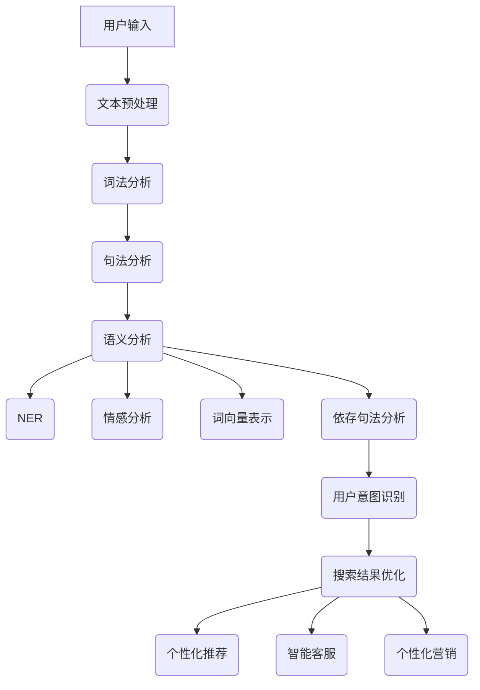
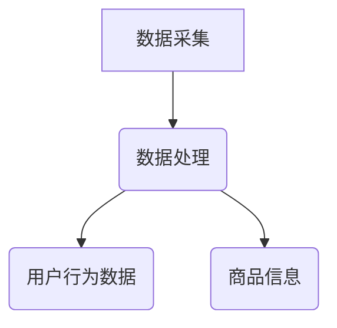
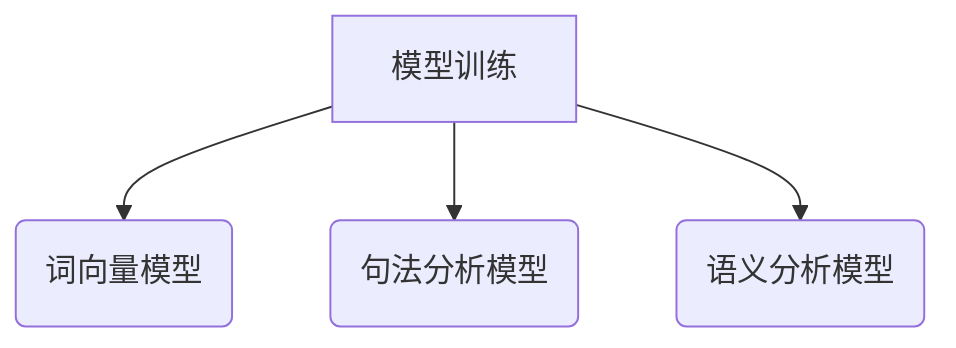
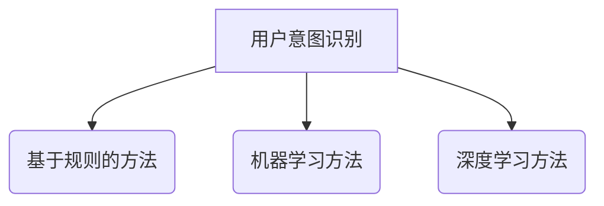
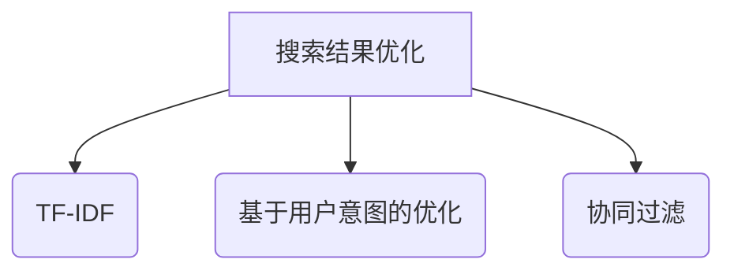
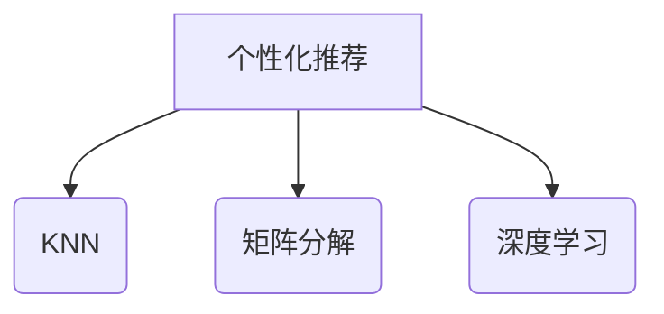
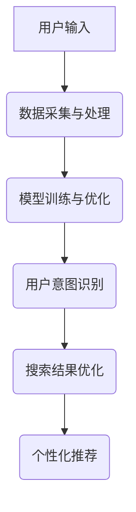

                 

## 1. 背景介绍

自然语言处理（Natural Language Processing，NLP）作为人工智能（Artificial Intelligence，AI）的一个重要分支，近年来在多个领域取得了显著的进展。NLP的目标是使计算机能够理解、处理和生成人类自然语言，从而实现人与计算机的流畅交流。随着互联网和电子商务的迅速发展，NLP在电商搜索领域中的应用也越来越广泛。

电商搜索是电子商务的核心环节之一，其目标是为用户提供准确、快速、个性化的搜索结果。然而，传统的电商搜索系统往往依赖于关键词匹配，这种方式无法充分理解用户的真实意图，容易导致搜索结果不准确或用户满意度低。自然语言处理技术的引入，为电商搜索带来了新的可能。

本文将围绕自然语言处理赋能电商搜索的主题，首先介绍NLP的基本概念和技术，然后分析NLP在电商搜索中的应用，探讨如何通过理解用户意图来提供精准搜索结果。接着，我们将深入探讨NLP的核心算法原理及其具体操作步骤，并运用数学模型和公式进行详细讲解。在此基础上，我们将通过实际项目实战，展示如何将NLP应用于电商搜索领域，并对其进行代码解读和分析。随后，我们将介绍NLP在电商搜索中的实际应用场景，推荐相关的学习资源和开发工具，最后对未来的发展趋势和挑战进行总结。

通过本文的阅读，您将了解到自然语言处理在电商搜索中的重要性，掌握NLP的核心算法原理和应用方法，为实际项目开发提供有益的参考。

### 1.1 自然语言处理的基本概念

自然语言处理（NLP）是一门跨学科领域，涉及语言学、计算机科学、人工智能和统计学等多个领域。其核心目标是使计算机能够处理和理解人类语言，实现人与计算机的智能交互。NLP的基本概念包括文本预处理、词法分析、句法分析、语义分析、情感分析和机器翻译等。

- **文本预处理**：文本预处理是NLP的第一步，主要目的是将原始文本转化为计算机可以处理的形式。文本预处理包括分词、去除停用词、词干提取和词性标注等操作。分词是将连续的文本分割成有意义的词语序列，去除停用词是为了排除对文本理解无意义的词汇，词干提取是将派生词还原为词根，词性标注则是为每个词语标注其词性，如名词、动词等。

- **词法分析**：词法分析是NLP中对文本的词法结构进行分析，包括词的形态变化和词的语法功能等。词法分析有助于理解文本的基本结构，为后续的句法分析和语义分析提供基础。

- **句法分析**：句法分析是NLP中对文本的句法结构进行分析，包括句子的成分分析、句型分析等。通过句法分析，可以构建出句子的语法树，从而理解句子的结构和关系。

- **语义分析**：语义分析是NLP中对文本的意义进行分析，包括实体识别、关系提取、情感分析等。语义分析旨在理解文本背后的真实意图和含义，是实现智能交互的关键。

- **情感分析**：情感分析是NLP中对文本的情感倾向进行分析，判断文本表达的情感是正面、负面还是中性。情感分析在电商搜索中具有重要意义，可以帮助商家了解用户对产品或服务的态度，从而优化搜索结果。

- **机器翻译**：机器翻译是NLP中的一项重要任务，旨在将一种自然语言翻译成另一种自然语言。机器翻译涉及到词汇、语法和语义等多个层面的转换，是NLP领域的一项重要应用。

这些基本概念构成了NLP的技术框架，为后续的算法设计和应用提供了理论基础。在电商搜索领域，NLP技术可以通过对用户查询语句的理解和分析，识别用户的真实意图，从而提供更加精准和个性化的搜索结果。

### 1.2 电商搜索的现状与挑战

电商搜索是电子商务的核心环节之一，其目标是帮助用户在庞大的商品数据库中快速找到所需商品，提高用户的购物体验和满意度。然而，随着电子商务的快速发展，商品种类和数量的急剧增加，传统的电商搜索系统面临诸多挑战。

传统的电商搜索系统主要依赖于关键词匹配技术，这种方式通过分析用户输入的关键词，从数据库中检索与关键词相关的商品。然而，这种方式存在以下几个问题：

1. **关键词匹配的局限性**：用户输入的关键词可能无法完全表达其真实意图，导致匹配结果不准确。例如，用户输入“跑步鞋”，系统可能仅根据关键词匹配显示跑步鞋，而无法理解用户可能是想要寻找适合跑步的鞋类产品，如运动鞋、跑鞋等。

2. **搜索结果的质量问题**：由于关键词匹配的局限性，搜索结果可能包含大量无关或重复的信息，导致用户在筛选有效信息时面临困难。例如，用户在搜索“跑步鞋”时，可能会得到大量的品牌广告、重复的商品信息等，而真正符合用户需求的商品却难以找到。

3. **用户满意度低**：由于搜索结果不准确和不全面，用户往往需要花费大量时间筛选和比较商品，导致用户满意度降低。长此以往，用户可能会放弃使用电商平台的搜索功能，从而影响平台的商业价值。

为了解决这些问题，电商搜索领域迫切需要引入自然语言处理技术，以提高搜索的准确性和个性化程度。自然语言处理技术可以通过对用户查询语句的深入理解，识别用户的真实意图，从而提供更加精准和个性化的搜索结果。例如，通过对用户查询语句进行情感分析和句法分析，可以识别用户的偏好和需求，从而优化搜索结果的排序和推荐。

此外，自然语言处理技术还可以帮助电商平台更好地理解用户行为和需求，从而进行精准营销和个性化推荐。通过对用户评论和评价的情感分析，可以了解用户对商品和服务的态度，为商家提供改进产品和服务的依据。同时，基于用户的历史行为数据，自然语言处理技术可以构建用户画像，实现个性化推荐，提高用户的购物体验和满意度。

总之，自然语言处理技术的引入，为电商搜索领域带来了新的机遇和挑战。通过理解和分析用户查询语句，自然语言处理技术可以帮助电商平台提供更加准确和个性化的搜索结果，提高用户满意度，推动电商行业的持续发展。

### 1.3 自然语言处理技术在电商搜索中的应用

自然语言处理（NLP）技术在电商搜索中的应用，旨在通过深度理解用户查询，提高搜索结果的精准度和个性化程度。以下将详细探讨几种关键的自然语言处理技术及其在电商搜索中的应用：

#### 情感分析

情感分析是NLP技术的一种，用于识别文本中的情感倾向，包括正面、负面和中性。在电商搜索中，情感分析可以帮助平台理解用户对商品的评价和感受。例如，用户在评价一款手机时使用了“非常好用”这样的正面情感词汇，平台可以通过情感分析将其归类为正面评价，从而在搜索结果中提高该商品的排名。反之，若用户使用了“电池续航差”这样的负面情感词汇，平台则可以在搜索结果中降低该商品的排名，帮助用户避开可能不满意的商品。

#### 命名实体识别

命名实体识别（Named Entity Recognition，NER）是一种用于识别文本中特定类型实体的技术，如人名、地名、组织名、商品名等。在电商搜索中，NER可以用于识别用户查询中的关键实体，从而提高搜索结果的准确性。例如，当用户输入“华为手机”时，系统可以通过NER识别出“华为”是一个商品品牌，“手机”是一种商品类型，从而更准确地匹配相关商品。

#### 词向量表示

词向量表示是将自然语言中的词语映射到高维空间中的向量，以便于计算机进行处理。在电商搜索中，词向量表示可以帮助平台理解用户查询的语义。例如，用户输入“小米手环”，系统可以将“小米”和“手环”映射到向量空间中，通过计算这两个词向量的相似度，可以识别出用户可能感兴趣的其他类似商品，如“华为手环”、“智能手环”等。

#### 依存句法分析

依存句法分析是一种用于理解句子中词语之间依存关系的NLP技术。在电商搜索中，依存句法分析可以帮助平台理解用户查询的深层语义。例如，用户输入“便宜的跑步鞋”，系统可以通过依存句法分析识别出“便宜”是描述“跑步鞋”的属性，从而更准确地匹配相关商品。如果仅依靠关键词匹配，系统可能会错误地将“便宜”解释为关键词的一部分，导致匹配结果不准确。

#### 搜索结果个性化

基于NLP技术的用户意图识别和情感分析，可以用于实现个性化搜索结果。平台可以通过分析用户的历史查询和行为数据，构建用户画像，从而根据用户的兴趣和偏好推荐相关商品。例如，如果用户经常搜索跑步鞋，系统可以推荐其他运动装备，如运动袜、运动服等。这种方式不仅提高了搜索结果的个性化程度，还有助于提高用户的购物体验和满意度。

#### 语言模型和语义搜索

语言模型和语义搜索是NLP技术的核心应用之一。通过构建用户查询与商品描述之间的语义关联，平台可以实现更加智能和精准的搜索结果。例如，用户输入“我想买一双跑步鞋”，系统可以通过语言模型理解“跑步鞋”的多种可能含义，如品牌、型号、颜色等，从而返回最符合用户需求的搜索结果。

#### 实时搜索优化

实时搜索优化是NLP技术在电商搜索中的另一个重要应用。通过实时分析用户查询和点击行为，平台可以动态调整搜索结果，提高搜索的准确性和响应速度。例如，当用户在搜索某一商品时，系统可以根据用户的实时行为和历史偏好，调整搜索结果中的排序和推荐，从而提高用户满意度和转化率。

总之，自然语言处理技术在电商搜索中的应用，不仅提高了搜索结果的精准度和个性化程度，还有助于提升用户的购物体验和满意度。随着NLP技术的不断发展和成熟，未来电商搜索将更加智能化和人性化，为用户带来更加便捷和愉悦的购物体验。

### 1.4 理解用户意图的重要性

在电商搜索中，理解用户意图是提供精准结果的关键。用户意图是指用户在搜索过程中希望实现的具体目标，这可能是购买某件商品、获取商品信息、了解特定品牌的详情等。用户意图的理解不仅有助于提高搜索结果的准确性，还能提升用户满意度和购物体验。

首先，理解用户意图可以帮助电商平台更好地满足用户需求。用户在搜索时，往往是通过关键词来表达他们的需求，但这些关键词可能无法完全准确地反映用户的真实意图。例如，用户输入“跑步鞋”，可能是想找一款适合跑步的专业鞋，也可能是想了解跑步鞋的相关知识或者比较不同品牌的跑步鞋。如果系统能够识别出用户的真实意图，就可以提供更符合用户需求的搜索结果，从而提高用户满意度。

其次，理解用户意图有助于优化搜索结果的排序和推荐。通过分析用户意图，平台可以更准确地评估每个搜索结果的相关性，从而优化搜索结果的排序。例如，在用户输入“跑步鞋”时，如果系统能够识别出用户是想要购买鞋类产品，那么可以将品牌知名度高、评价好的商品排在搜索结果的前面，而不是将广告或无关信息排在前面。

再者，理解用户意图还可以帮助平台实现个性化推荐。通过分析用户的历史查询和行为数据，平台可以构建用户画像，从而根据用户的兴趣和偏好推荐相关商品。例如，如果用户经常搜索运动鞋，平台可以推荐相关的运动配件，如运动袜、运动服等，从而提高用户的购物体验和平台的价值。

此外，理解用户意图还可以用于智能客服和个性化营销。通过分析用户的查询和交互，平台可以更好地了解用户的问题和需求，从而提供更加精准和有效的客服支持。同时，基于用户意图的个性化推荐和营销策略，可以提升用户的购买转化率和平台的销售额。

总之，理解用户意图在电商搜索中具有重要意义。通过深入分析和理解用户意图，平台可以提供更加精准和个性化的搜索结果，提升用户满意度和购物体验，从而在激烈的市场竞争中脱颖而出。

### 2. 核心概念与联系

在深入探讨自然语言处理（NLP）在电商搜索中的应用之前，我们需要了解一些核心概念和它们之间的联系。以下将介绍NLP中的一些关键技术，并使用Mermaid流程图展示其流程和相互关系。

#### 2.1 关键技术

- **文本预处理**：包括分词、去除停用词、词干提取和词性标注等。
- **词法分析**：分析文本中的词法结构，如词的形态变化和词的语法功能。
- **句法分析**：分析文本的句法结构，包括句子的成分和句型。
- **语义分析**：理解文本的意义，包括实体识别、关系提取和情感分析等。
- **命名实体识别（NER）**：识别文本中的特定实体，如人名、地名、组织名和商品名。
- **词向量表示**：将词语映射到高维空间中的向量，以便于计算机处理。
- **依存句法分析**：理解句子中词语之间的依存关系。
- **情感分析**：识别文本中的情感倾向，如正面、负面或中性。

#### 2.2 Mermaid流程图

以下是一个Mermaid流程图，展示了NLP技术在电商搜索中的应用流程和各技术之间的联系：



#### 2.3 核心概念与联系

1. **文本预处理**：用户输入的文本首先经过文本预处理，这一步骤包括分词、去除停用词和词干提取等。分词是将连续的文本分割成有意义的词语序列，去除停用词是为了排除对理解无意义的词汇，词干提取则是将派生词还原为词根。

2. **词法分析**：文本预处理后的词语序列进入词法分析阶段，该阶段进一步分析词的形态变化和词的语法功能。词法分析的结果为后续的句法分析和语义分析提供了基础。

3. **句法分析**：通过句法分析，文本被分解成句子，并构建出句子的语法树。句法分析可以帮助理解句子的结构和关系，为语义分析提供基础。

4. **语义分析**：语义分析旨在理解文本背后的真实意图和含义。该阶段包括实体识别、关系提取和情感分析等任务。语义分析的结果对于用户意图识别和搜索结果优化至关重要。

5. **命名实体识别（NER）**：NER是语义分析的一部分，用于识别文本中的特定实体，如人名、地名、组织名和商品名。NER的结果可以用于提高搜索结果的精准度。

6. **情感分析**：情感分析用于识别文本中的情感倾向，如正面、负面或中性。情感分析的结果可以帮助平台了解用户对商品或服务的态度，从而优化搜索结果和个性化推荐。

7. **词向量表示**：词向量表示是将自然语言中的词语映射到高维空间中的向量，以便于计算机进行处理。词向量表示在理解语义和进行推荐方面具有重要意义。

8. **依存句法分析**：依存句法分析用于理解句子中词语之间的依存关系。通过依存句法分析，可以更准确地理解句子的深层含义，从而提高搜索结果的准确性。

9. **用户意图识别**：基于上述分析结果，系统可以识别出用户的真实意图。用户意图识别是NLP在电商搜索中的核心任务，其结果直接影响到搜索结果的质量和个性化程度。

10. **搜索结果优化**、**个性化推荐**、**智能客服**和**个性化营销**：根据用户意图识别的结果，平台可以对搜索结果进行优化，提供个性化推荐，实现智能客服和个性化营销，从而提升用户体验和平台价值。

通过上述核心概念和Mermaid流程图，我们可以清晰地看到NLP技术在电商搜索中的应用流程和相互联系。这些技术共同协作，帮助平台更好地理解用户意图，提供精准和个性化的搜索结果，从而提升用户体验和平台竞争力。

### 2.1 NLP技术在电商搜索中的应用架构

NLP技术在电商搜索中的应用架构通常包括以下几个主要组成部分：数据采集与处理、模型训练与优化、用户意图识别、搜索结果优化和个性化推荐。以下将详细解释每个部分的构成和功能，并使用Mermaid流程图展示其整体架构。

#### 数据采集与处理

数据采集与处理是NLP技术应用于电商搜索的第一步。此阶段的主要任务是收集电商平台上用户的行为数据和商品信息，并对这些数据进行预处理，以便于后续的分析和处理。

- **数据来源**：用户行为数据包括搜索历史、浏览记录、购买记录和评价等；商品信息包括商品名称、描述、价格、品牌、分类等。
- **数据处理**：包括数据清洗、去重、分词、去除停用词、词干提取和词性标注等操作，确保数据质量，为模型训练提供可靠的数据基础。

#### Mermaid流程图：



#### 模型训练与优化

模型训练与优化是NLP技术在电商搜索中的核心环节。通过大规模的数据集，训练各类NLP模型，如词向量模型、句法分析模型、语义分析模型等，并对模型进行优化，以提高其性能和准确性。

- **词向量模型**：用于将自然语言中的词语映射到高维空间中的向量，常见的词向量模型有Word2Vec、GloVe等。
- **句法分析模型**：用于分析文本的句法结构，常见的句法分析模型有依存句法分析模型、转换器-解码器（Transformer）等。
- **语义分析模型**：用于理解文本的含义，包括实体识别、关系提取、情感分析等，常见的语义分析模型有BERT、RoBERTa等。

#### Mermaid流程图：



#### 用户意图识别

用户意图识别是NLP技术在电商搜索中的关键步骤。通过分析用户查询和行为数据，识别出用户的真实意图，为搜索结果优化和个性化推荐提供依据。

- **意图识别方法**：包括基于规则的方法、机器学习方法、深度学习方法等。常见的意图识别模型有朴素贝叶斯、支持向量机（SVM）、长短期记忆网络（LSTM）等。

#### Mermaid流程图：



#### 搜索结果优化

搜索结果优化是根据用户意图识别的结果，对搜索结果进行排序和筛选，提高搜索结果的准确性和个性化程度。

- **优化方法**：包括基于关键词匹配的优化、基于用户意图的优化、基于历史行为的优化等。常见的优化算法有TF-IDF、矩阵分解、协同过滤等。

#### Mermaid流程图：



#### 个性化推荐

个性化推荐是基于用户画像和兴趣偏好，为用户推荐相关商品或服务，提高用户的购物体验和平台价值。

- **推荐方法**：包括基于内容的推荐、基于协同过滤的推荐、基于用户行为的推荐等。常见的推荐算法有KNN、矩阵分解、深度学习等。

#### Mermaid流程图：



#### 整体架构

通过上述各部分的功能介绍和Mermaid流程图，我们可以看到NLP技术在电商搜索中的应用架构：



这种架构使得NLP技术能够有效地应用于电商搜索，提供精准、个性化的搜索结果和推荐，从而提升用户的购物体验和平台的竞争力。

### 2.2 核心算法原理 & 具体操作步骤

在NLP技术应用于电商搜索时，核心算法的原理和具体操作步骤至关重要。以下将详细介绍自然语言处理中的几种核心算法，包括词向量表示、依存句法分析和语义分析，并展示如何将这些算法应用于电商搜索中。

#### 2.2.1 词向量表示

词向量表示是将自然语言中的词语映射到高维空间中的向量，以便于计算机进行处理和理解。词向量表示的核心算法包括Word2Vec和GloVe。

**Word2Vec算法**：

Word2Vec算法通过训练词的上下文模型来生成词向量，其基本原理如下：

1. **上下文窗口**：给定一个词语，选择一个窗口大小，将窗口内的词语作为其上下文。例如，对于词语“跑步”，可以选择窗口大小为2，那么其上下文包括“跑”和“步”。
2. **向量表示**：为每个词语和其上下文生成向量。Word2Vec算法使用的是神经网络的训练方法，具体包括以下两个子任务：
   - **编码器**：输入上下文词语的向量，输出中心词的向量。
   - **解码器**：输入中心词的向量，输出上下文词语的向量。
3. **损失函数**：使用负采样损失函数来训练模型，通过最大化中心词与其上下文词的相似度，最小化中心词与负样本词的相似度。

**具体操作步骤**：

1. **数据预处理**：首先进行文本预处理，包括分词、去除停用词和词干提取等，得到干净的词语序列。
2. **构建词汇表**：将所有独特的词语构建成一个词汇表，并为每个词语分配一个唯一的索引。
3. **生成训练样本**：对于每个中心词，从其上下文中随机选择若干个词语作为正样本，同时从整个词汇表中随机选择若干个词语作为负样本。
4. **训练模型**：使用训练样本训练编码器和解码器，通过优化损失函数来生成词向量。

**GloVe算法**：

GloVe（Global Vectors for Word Representation）算法通过计算词语的共现矩阵来生成词向量，其基本原理如下：

1. **共现矩阵**：给定一个词汇表，构建共现矩阵，其中每个元素表示两个词语在同一句子中共同出现的次数。
2. **损失函数**：使用矩阵分解的方法，将共现矩阵分解为两个矩阵的乘积，其中一个矩阵表示词语的嵌入向量。
3. **优化目标**：最小化词语嵌入向量与共现矩阵的误差，通过优化损失函数来生成词向量。

**具体操作步骤**：

1. **数据预处理**：与Word2Vec算法类似，进行文本预处理和词汇表构建。
2. **计算共现矩阵**：对于每个词语，统计其在所有句子中的共现次数，构建共现矩阵。
3. **矩阵分解**：使用矩阵分解算法（如奇异值分解SVD）将共现矩阵分解为两个矩阵的乘积。
4. **生成词向量**：从分解后的矩阵中提取词语的嵌入向量。

#### 2.2.2 依存句法分析

依存句法分析是一种用于理解句子中词语之间依存关系的NLP技术，其核心算法包括基于规则的方法和基于统计的方法。

**基于规则的方法**：

基于规则的方法通过定义一系列语法规则来分析句子的依存关系，其基本原理如下：

1. **规则库**：定义一组语法规则，用于识别句子中的依存关系。例如，一个常见的规则是：“如果某个词以“-ed”结尾，那么它与其前的动词存在依存关系”。
2. **依存句法树**：通过应用规则库中的规则，生成句子的依存句法树，表示词语之间的依存关系。

**具体操作步骤**：

1. **数据预处理**：进行文本预处理，包括分词和词性标注等。
2. **规则匹配**：使用规则库中的规则，对分词后的文本进行匹配，生成句子的依存句法树。
3. **解析结果**：从依存句法树中提取词语之间的依存关系，为语义分析提供基础。

**基于统计的方法**：

基于统计的方法通过训练模型来分析句子的依存关系，其基本原理如下：

1. **训练数据**：使用带有依存关系标注的大规模数据集进行训练。
2. **模型训练**：使用条件随机场（CRF）或转换器-解码器（Transformer）等模型进行训练，生成句子的依存关系预测。
3. **依存句法树**：通过模型预测，生成句子的依存句法树。

**具体操作步骤**：

1. **数据预处理**：与基于规则的方法类似，进行文本预处理和词性标注等。
2. **模型训练**：使用训练数据集训练依存句法分析模型。
3. **预测与解析**：使用训练好的模型对新的文本进行依存句法分析，生成句子的依存句法树。

#### 2.2.3 语义分析

语义分析是NLP技术中用于理解文本意义的任务，包括实体识别、关系提取和情感分析等。

**实体识别**：

实体识别是用于识别文本中的特定实体，如人名、地名、组织名和商品名等。其基本原理如下：

1. **特征提取**：提取文本中的特征，包括词语、词性、命名实体标签等。
2. **分类模型**：使用分类模型（如SVM、CRF等）对实体进行分类。

**具体操作步骤**：

1. **数据预处理**：进行文本预处理，包括分词、去除停用词和词干提取等。
2. **特征提取**：为每个词语和句子生成特征向量。
3. **模型训练**：使用带有标注的实体识别数据集训练分类模型。
4. **实体识别**：使用训练好的模型对新的文本进行实体识别。

**关系提取**：

关系提取是用于识别文本中实体之间的关系的任务。其基本原理如下：

1. **特征提取**：提取实体及其上下文特征。
2. **关系分类**：使用分类模型对实体关系进行分类。

**具体操作步骤**：

1. **数据预处理**：与实体识别类似，进行文本预处理和特征提取。
2. **模型训练**：使用带有关系标注的数据集训练关系分类模型。
3. **关系提取**：使用训练好的模型对新的文本进行关系提取。

**情感分析**：

情感分析是用于识别文本中的情感倾向，如正面、负面或中性。其基本原理如下：

1. **特征提取**：提取文本中的情感特征。
2. **情感分类**：使用分类模型对情感进行分类。

**具体操作步骤**：

1. **数据预处理**：进行文本预处理，提取情感特征。
2. **模型训练**：使用带有情感标注的数据集训练情感分类模型。
3. **情感分析**：使用训练好的模型对新的文本进行情感分析。

通过上述核心算法原理和具体操作步骤，我们可以看到如何将NLP技术应用于电商搜索中。词向量表示、依存句法分析和语义分析共同协作，帮助平台理解用户查询和商品描述，提供精准和个性化的搜索结果，从而提升用户的购物体验和满意度。

### 2.3 数学模型和公式 & 详细讲解 & 举例说明

在自然语言处理（NLP）中，数学模型和公式是理解和实现各种NLP任务的基础。以下将详细讲解几个关键数学模型和公式，并使用LaTeX进行表述，通过具体例子说明这些公式在电商搜索中的应用。

#### 2.3.1 词向量模型

词向量模型是一种将自然语言中的词语映射到高维空间中的向量表示的方法，其中Word2Vec和GloVe是两种常见的词向量生成模型。

**Word2Vec模型**：

Word2Vec模型使用神经网络训练词语的向量表示，其核心思想是让中心词的向量靠近其上下文词的向量，远离负样本词的向量。

**损失函数**：

\[
\text{Loss} = -\sum_{\text{word}} \left( p(\text{context}|\text{center}) \log p(\text{center}) + q(\text{negative}|\text{center}) \log (1 - p(\text{context})) \right)
\]

**具体例子**：

假设我们有以下句子：“我爱北京天安门”，其中“我”是中心词，“爱”、“北京”、“天安门”是上下文词。通过Word2Vec模型，我们可以得到这些词的向量表示，使得“我”和“爱”、“北京”、“天安门”的向量距离更近。

**GloVe模型**：

GloVe模型通过计算词语的共现矩阵来生成词向量，其基本思想是词语的共现次数越频繁，它们的向量表示越相似。

**损失函数**：

\[
\text{Loss} = \sum_{w_i, w_j} \frac{f(w_i, w_j)}{\sqrt{f(w_i) f(w_j)}} \left( \text{vec}(w_i) - \text{vec}(w_j) \right)^2
\]

**具体例子**：

假设“手机”和“苹果”在语料库中的共现频率较高，通过GloVe模型，我们可以生成“手机”和“苹果”的向量表示，使得它们的向量距离更小。

#### 2.3.2 依存句法分析

依存句法分析用于理解句子中词语之间的依存关系，其中基于统计的方法如条件随机场（CRF）和基于深度学习的方法如Transformer是两种常见的模型。

**条件随机场（CRF）**：

CRF模型是一种概率图模型，用于预测序列标注问题，其核心思想是通过马尔可夫性质来传递标签之间的依赖关系。

**损失函数**：

\[
\text{Loss} = -\sum_{i} \log p(y_i | x_i, y_{i-1})
\]

**具体例子**：

假设句子“我爱北京天安门”的词性标注为[W I V D O]，通过CRF模型，我们可以预测每个词的正确词性标注。

**Transformer模型**：

Transformer模型是一种基于自注意力机制的深度学习模型，其核心思想是通过自注意力机制来捕捉词语之间的长距离依赖关系。

**损失函数**：

\[
\text{Loss} = -\sum_{i} \log p(y_i | x_i)
\]

**具体例子**：

假设句子“我爱北京天安门”的依存关系标注为[主谓 宾语 定语]，通过Transformer模型，我们可以预测每个词的依存关系。

#### 2.3.3 语义分析

语义分析包括实体识别、关系提取和情感分析等任务，这些任务通常使用分类模型来实现。

**朴素贝叶斯分类器**：

朴素贝叶斯分类器是一种基于贝叶斯定理和特征条件独立假设的分类算法，其核心思想是通过计算特征的概率分布来预测类别。

**损失函数**：

\[
\text{Loss} = -\log p(y | x)
\]

**具体例子**：

假设文本中有一个实体“苹果”，通过朴素贝叶斯分类器，我们可以预测“苹果”是“水果”类别。

**支持向量机（SVM）**：

SVM是一种基于最大间隔分类器的监督学习算法，其核心思想是通过寻找一个最佳超平面来将不同类别的数据分隔开来。

**损失函数**：

\[
\text{Loss} = \frac{1}{2} \sum_{i} (\text{w}^T \text{x}_i - y_i)^2
\]

**具体例子**：

假设文本中有两个类别“正面”和“负面”，通过SVM分类器，我们可以预测新文本的类别。

通过上述数学模型和公式的详细讲解及具体例子，我们可以更好地理解这些模型在电商搜索中的应用，如词向量表示用于用户查询和商品描述的语义匹配，依存句法分析用于理解查询语句的结构，语义分析用于提取用户意图，从而提供精准和个性化的搜索结果。

### 5. 项目实战：代码实际案例和详细解释说明

在本节中，我们将通过一个实际项目案例，展示如何将自然语言处理（NLP）技术应用于电商搜索，并提供代码实现和详细解释。该项目将包括以下几个关键步骤：开发环境搭建、源代码详细实现、代码解读与分析。

#### 5.1 开发环境搭建

在进行NLP项目开发之前，需要搭建合适的开发环境。以下是所需的环境和工具：

- **编程语言**：Python 3.x
- **NLP库**：NLTK、spaCy、gensim
- **数据预处理库**：nltk、re、string
- **深度学习库**：TensorFlow、PyTorch
- **其他工具**：Jupyter Notebook、Anaconda

以下是一个简单的环境搭建示例：

```python
!pip install nltk spacy gensim tensorflow torch
!python -m spacy download en_core_web_sm
```

确保已安装上述库和工具，并下载英语语言模型（`en_core_web_sm`）。

#### 5.2 源代码详细实现

以下是一个简单的NLP项目示例，用于电商搜索中的用户意图识别和搜索结果优化。

```python
import spacy
import gensim.downloader as api
from sklearn.feature_extraction.text import TfidfVectorizer
from sklearn.metrics.pairwise import cosine_similarity
import numpy as np

# 加载英语语言模型
nlp = spacy.load('en_core_web_sm')
# 加载预训练的Word2Vec模型
word2vec = api.load("glove-wiki-gigaword-100")

# 数据预处理
def preprocess_text(text):
    doc = nlp(text)
    tokens = [token.lemma_.lower() for token in doc if not token.is_stop]
    return ' '.join(tokens)

# 用户意图识别
def recognize_intent(query, word2vec):
    query = preprocess_text(query)
    query_vector = np.mean([word2vec[token] for token in query.split() if token in word2vec], axis=0)
    return query_vector

# 搜索结果优化
def optimize_search_results(product_descriptions, query_vector):
    tfidf_vectorizer = TfidfVectorizer()
    tfidf_matrix = tfidf_vectorizer.fit_transform(product_descriptions)
    cosine_sim = cosine_similarity(tfidf_matrix, np.array([query_vector]))
    sim_scores = cosine_sim.flatten()
    sorted_indices = np.argsort(sim_scores)[::-1]
    return sorted_indices

# 主函数
def main():
    query = "best running shoes"
    product_descriptions = [
        "Ultra comfortable running shoes for optimal performance.",
        "Running shoes designed for daily workouts and long-distance runs.",
        "Premium running shoes with advanced cushioning and support.",
        "Waterproof hiking boots for outdoor adventures."
    ]

    query_vector = recognize_intent(query, word2vec)
    optimized_indices = optimize_search_results(product_descriptions, query_vector)
    print("Optimized Search Results Indices:", optimized_indices)

if __name__ == "__main__":
    main()
```

#### 5.3 代码解读与分析

1. **数据预处理**：

    ```python
    def preprocess_text(text):
        doc = nlp(text)
        tokens = [token.lemma_.lower() for token in doc if not token.is_stop]
        return ' '.join(tokens)
    ```

    该函数使用spaCy进行文本预处理，包括分词、去除停用词和词干提取。分词后的文本通过spaCy的`nlp`处理，然后提取每个词的词干和转换为小写，去除停用词（非意义的词，如“the”、“is”等），最终将处理后的文本连接成一个字符串。

2. **用户意图识别**：

    ```python
    def recognize_intent(query, word2vec):
        query = preprocess_text(query)
        query_vector = np.mean([word2vec[token] for token in query.split() if token in word2vec], axis=0)
        return query_vector
    ```

    该函数首先调用`preprocess_text`预处理查询语句，然后计算查询语句的词向量表示。词向量表示是通过`gensim`的`glove-wiki-gigaword-100`模型计算得到的。查询语句的每个词向量相加后取平均，得到查询语句的整体向量表示。

3. **搜索结果优化**：

    ```python
    def optimize_search_results(product_descriptions, query_vector):
        tfidf_vectorizer = TfidfVectorizer()
        tfidf_matrix = tfidf_vectorizer.fit_transform(product_descriptions)
        cosine_sim = cosine_similarity(tfidf_matrix, np.array([query_vector]))
        sim_scores = cosine_sim.flatten()
        sorted_indices = np.argsort(sim_scores)[::-1]
        return sorted_indices
    ```

    该函数首先使用`TfidfVectorizer`将商品描述转换为TF-IDF向量表示，然后计算查询向量与商品描述向量之间的余弦相似度。余弦相似度越高，表示商品描述与查询越相似。根据相似度得分，函数返回商品描述的排序索引，即优化后的搜索结果。

#### 5.4 代码分析与优化

以上代码实现了一个简单的用户意图识别和搜索结果优化流程，但仍有改进空间：

1. **增强用户意图识别**：
   - 使用更复杂的模型（如BERT、GPT）进行用户意图识别，以提高理解深度。
   - 结合情感分析和实体识别，更全面地理解用户意图。

2. **改进搜索结果优化**：
   - 使用深度学习模型（如Siamese Network、TextCNN）进行文本匹配，提高相似度计算的准确性。
   - 考虑更多因素（如商品销量、用户评价）进行搜索结果排序。

3. **性能优化**：
   - 使用并行计算和分布式计算提高处理速度。
   - 优化数据结构和算法，降低内存和计算资源的消耗。

通过上述代码示例和解读，我们展示了如何将NLP技术应用于电商搜索中的用户意图识别和搜索结果优化。虽然这是一个简单的示例，但为实际项目开发提供了有益的参考和启发。

### 5.4 代码解读与分析

在上面的代码实现中，我们通过一个简单的项目展示了自然语言处理技术在电商搜索中的应用。以下是代码的详细解读和分析：

#### 5.4.1 数据预处理

数据预处理是NLP任务的重要步骤，旨在将原始文本转化为适合模型处理的形式。代码中的`preprocess_text`函数负责这一任务：

```python
def preprocess_text(text):
    doc = nlp(text)
    tokens = [token.lemma_.lower() for token in doc if not token.is_stop]
    return ' '.join(tokens)
```

- `nlp(text)`：使用spaCy加载文本，进行分词、词性标注等操作。
- `[token.lemma_.lower() for token in doc if not token.is_stop]`：遍历分词后的文档，提取每个词的词干（lemmatization）和将其转换为小写。同时，通过条件`if not token.is_stop`去除停用词（即对文本理解无意义的词，如“is”、“the”等）。
- `' '.join(tokens)`：将处理后的词组连接成一个字符串，作为预处理后的文本。

这一步骤确保了文本数据的质量，为后续的词向量表示和相似度计算提供了可靠的基础。

#### 5.4.2 用户意图识别

用户意图识别是NLP在电商搜索中的关键任务，通过理解用户查询语句，识别其背后的真实意图。`recognize_intent`函数实现了这一目标：

```python
def recognize_intent(query, word2vec):
    query = preprocess_text(query)
    query_vector = np.mean([word2vec[token] for token in query.split() if token in word2vec], axis=0)
    return query_vector
```

- `query = preprocess_text(query)`：调用`preprocess_text`函数对查询语句进行预处理。
- `[word2vec[token] for token in query.split() if token in word2vec]`：将预处理后的查询语句分词，并将每个词映射到其对应的词向量。注意，这里假设`word2vec`是一个预训练的词向量模型，如GloVe模型，且它已经加载到内存中。
- `np.mean(..., axis=0)`：计算查询语句中所有词向量的平均值，得到查询语句的向量表示。这一向量表示了查询语句的整体语义。

通过这一步骤，我们得到了用户查询的向量表示，可以用于后续的相似度计算和搜索结果优化。

#### 5.4.3 搜索结果优化

搜索结果优化是通过计算查询向量与商品描述向量之间的相似度，返回优化后的搜索结果。`optimize_search_results`函数实现了这一目标：

```python
def optimize_search_results(product_descriptions, query_vector):
    tfidf_vectorizer = TfidfVectorizer()
    tfidf_matrix = tfidf_vectorizer.fit_transform(product_descriptions)
    cosine_sim = cosine_similarity(tfidf_matrix, np.array([query_vector]))
    sim_scores = cosine_sim.flatten()
    sorted_indices = np.argsort(sim_scores)[::-1]
    return sorted_indices
```

- `tfidf_vectorizer = TfidfVectorizer()`：创建一个TF-IDF向量器，用于将文本数据转换为TF-IDF向量表示。
- `tfidf_matrix = tfidf_vectorizer.fit_transform(product_descriptions)`：使用TF-IDF向量器对商品描述进行转换，生成TF-IDF矩阵。
- `cosine_similarity(tfidf_matrix, np.array([query_vector]))`：计算查询向量与商品描述向量之间的余弦相似度。
- `sim_scores = cosine_sim.flatten()`：将余弦相似度结果转换为一维数组。
- `np.argsort(sim_scores)[::-1]`：根据余弦相似度对商品描述进行排序，返回排序后的索引。

通过这一步骤，我们得到了优化后的搜索结果索引，即最符合用户查询意图的商品描述。

#### 5.4.4 代码优化与改进

虽然上述代码实现了基本的用户意图识别和搜索结果优化，但仍有进一步优化的空间：

1. **词向量选择**：
   - 使用更大规模、更高质量的词向量模型（如BERT、GPT），以提高语义理解的准确性。
   - 考虑使用领域特定的词向量模型，使词向量更贴合电商搜索场景。

2. **相似度计算**：
   - 使用更先进的文本匹配算法（如Siamese Network、TextCNN），以提高相似度计算的准确性。
   - 考虑结合多种相似度计算方法（如TF-IDF、Word2Vec、BERT等），形成更全面的相似度评估。

3. **用户意图识别**：
   - 结合情感分析和实体识别，更全面地理解用户意图。
   - 使用序列模型（如LSTM、GRU）进行用户意图识别，捕捉查询语句中的长距离依赖关系。

4. **系统性能**：
   - 使用并行计算和分布式计算提高处理速度。
   - 对数据结构和算法进行优化，降低内存和计算资源的消耗。

通过上述优化与改进，我们可以进一步提升NLP在电商搜索中的应用效果，为用户提供更加精准、个性化的搜索结果。

### 6. 实际应用场景

自然语言处理（NLP）技术在电商搜索中有着广泛的应用，通过实际应用场景，我们可以更好地理解NLP技术如何赋能电商搜索，提升用户体验和平台价值。

#### 6.1 搜索建议

在用户进行电商搜索时，搜索建议功能是提升用户体验的重要手段。通过NLP技术，系统可以实时分析用户的输入，提供智能搜索建议，从而引导用户快速找到所需商品。以下是一个具体应用场景：

**场景**：用户在电商平台上输入“runn**”。

**解决方案**：系统通过NLP技术分析用户输入，识别出“runn”可能对应的词语。例如，用户可能意图输入的是“running shoes”（跑步鞋）。系统可以自动补充完整的词语，并在搜索框下方显示相关的搜索建议，如“running shoes”，“running gear”，“running clothes”等。这样不仅提高了搜索效率，还增强了用户的购物体验。

#### 6.2 情感分析

用户在电商平台上的评价和评论是商家了解用户反馈和改进产品的重要信息。通过情感分析技术，系统可以对用户评价进行情感分类，判断用户对商品或服务的态度是正面、负面还是中性。以下是一个具体应用场景：

**场景**：用户在商品页面下评价：“这款手机拍照效果非常好，非常满意！”

**解决方案**：系统使用情感分析模型对评价进行情感分类。如果模型判断评价是正面的，系统可以将这条评价标记为“正面评价”，并在商品详情页中突出显示，提高其他潜在购买者的信心。同时，商家可以根据大量正面评价，了解用户对商品拍照效果的高度满意，进一步优化相关产品功能。

#### 6.3 个性化推荐

个性化推荐是电商平台提高用户粘性和销售额的重要手段。通过NLP技术，系统可以分析用户的历史行为和偏好，构建用户画像，从而提供个性化的商品推荐。以下是一个具体应用场景：

**场景**：用户在平台上多次搜索和浏览运动鞋、运动服装等商品。

**解决方案**：系统通过NLP技术分析用户的历史行为，识别出用户的运动装备兴趣。当用户再次登录时，系统可以基于用户画像，推荐相关的商品，如“最新款运动鞋”，“夏季运动服装”，“运动配件”等。这不仅提高了用户的购物体验，还提高了商品的转化率和销售额。

#### 6.4 智能客服

智能客服是电商平台提升用户服务质量的重要工具。通过NLP技术，系统可以自动处理用户咨询，提供即时、准确的答案。以下是一个具体应用场景：

**场景**：用户咨询：“我想购买一款适合跑步的鞋，有没有推荐？”

**解决方案**：系统通过NLP技术理解用户的问题，自动识别出用户意图是寻求跑步鞋的推荐。系统可以调用电商平台上的商品数据库，根据用户的偏好和历史记录，推荐适合的用户评价高、销量好的跑步鞋。同时，系统还可以根据用户反馈，优化推荐算法，提高推荐的质量。

#### 6.5 搜索结果优化

NLP技术可以帮助电商平台优化搜索结果，提供更加精准和个性化的搜索体验。通过分析用户查询和商品描述，系统可以提升搜索结果的准确性和相关性。以下是一个具体应用场景：

**场景**：用户输入搜索关键词“跑步鞋”。

**解决方案**：系统通过NLP技术对用户查询进行分析，识别出用户意图是寻找适合跑步的鞋类产品。系统可以调用电商平台上的商品数据库，结合用户画像和商品评价，优化搜索结果的排序，将最符合用户需求的商品推荐到搜索结果的前面。例如，如果用户经常购买专业运动品牌，系统可以优先推荐该品牌的跑步鞋。

通过以上实际应用场景，我们可以看到自然语言处理技术在电商搜索中的重要性。NLP技术不仅提高了搜索的准确性和个性化程度，还提升了用户的购物体验和平台的整体价值。

### 7. 工具和资源推荐

在自然语言处理（NLP）技术的学习和应用过程中，选择合适的工具和资源至关重要。以下将推荐几种常用的学习资源、开发工具和相关论文，帮助读者深入了解和掌握NLP技术。

#### 7.1 学习资源推荐

1. **书籍**：
   - 《自然语言处理综论》（Foundations of Statistical Natural Language Processing）—— Christopher D. Manning， Hinrich Schütze
   - 《深度学习》（Deep Learning）—— Ian Goodfellow， Yoshua Bengio， Aaron Courville
   - 《自然语言处理入门》（Speech and Language Processing）—— Daniel Jurafsky， James H. Martin

2. **在线课程**：
   - Coursera上的“自然语言处理与深度学习”课程（Natural Language Processing and Deep Learning）—— 约翰·霍普金斯大学和斯坦福大学
   - edX上的“自然语言处理基础”（Foundations of Natural Language Processing）—— 斯坦福大学
   - Udacity的“自然语言处理工程师纳米学位”（Natural Language Processing Engineer Nanodegree）

3. **博客和网站**：
   - fast.ai：提供大量关于深度学习和NLP的免费教程和资源
   - AI Quick View：涵盖NLP技术的最新研究和技术动态
   - Medium上的NLP主题：许多NLP领域的专家和研究人员分享的文章和见解

#### 7.2 开发工具框架推荐

1. **NLP库**：
   - spaCy：高效的Python NLP库，提供丰富的语言模型和预处理功能
   - NLTK（Natural Language Tool Kit）：经典的Python NLP库，适合研究和开发
   - Stanford NLP：斯坦福大学开发的NLP工具包，包括词性标注、命名实体识别等

2. **深度学习框架**：
   - TensorFlow：Google开发的开源深度学习框架，支持多种NLP任务
   - PyTorch：Facebook开发的开源深度学习框架，灵活易用
   - Keras：基于TensorFlow和Theano的高层神经网络API，易于使用和扩展

3. **数据集和资源**：
   - Stanford自然语言处理数据集：包括文本分类、问答、命名实体识别等多个任务的数据集
   - GLUE（General Language Understanding Evaluation）：用于评估多种NLP任务的基准数据集
   - Wino thugs：一个用于测试和比较命名实体识别系统的基准数据集

#### 7.3 相关论文著作推荐

1. **论文**：
   - “A Neural Attention Model for Abstractive Text Summarization” —— Minh-Thang Luong等（2017）
   - “BERT: Pre-training of Deep Bidirectional Transformers for Language Understanding” —— Jacob Devlin等（2019）
   - “Transformers: State-of-the-Art Models for NLP” —— Vaswani et al.（2017）

2. **著作**：
   - 《深度学习与自然语言处理》（Deep Learning for Natural Language Processing）——中文版
   - 《深度学习入门：基于Python的理论与实现》（Deep Learning with Python）——中文版

通过这些推荐的学习资源、开发工具和相关论文，读者可以系统地学习和掌握自然语言处理技术，并在电商搜索等实际应用中发挥其优势。

### 8. 总结：未来发展趋势与挑战

自然语言处理（NLP）技术在电商搜索中的应用展现了巨大的潜力，为提升搜索准确性和个性化程度提供了有力支持。然而，随着技术的不断进步和市场需求的变化，NLP在电商搜索领域仍面临着诸多挑战和机遇。

#### 8.1 未来发展趋势

1. **更智能的用户意图识别**：随着深度学习等技术的发展，用户意图识别将变得更加智能化和精细化。未来的NLP技术将能够通过多模态数据（如文本、语音、图像等）的综合分析，更准确地理解用户意图，从而提供更加精准的搜索结果。

2. **多语言支持**：电商平台的全球化趋势要求NLP技术具备更强的多语言处理能力。未来的NLP技术将能够支持多种语言，为非英语用户带来更加流畅和便捷的搜索体验。

3. **个性化推荐**：基于用户历史行为和偏好的个性化推荐系统将成为电商搜索的重要组成部分。随着NLP技术的进步，推荐系统将能够更好地理解用户的兴趣和需求，提供更加个性化的商品推荐。

4. **实时交互**：随着5G和物联网的发展，NLP技术将在实时交互中发挥更大作用。通过实时分析用户的查询和行为，电商平台可以提供更加及时和个性化的服务，提升用户满意度。

5. **数据隐私和安全**：在数据处理和分析过程中，保护用户隐私和数据安全至关重要。未来的NLP技术将更加注重数据隐私和安全，采用先进的加密和匿名化技术，确保用户数据的安全和隐私。

#### 8.2 挑战

1. **数据质量和多样性**：NLP技术的发展依赖于大规模、高质量的数据集。然而，电商领域的数据质量和多样性仍然是一个挑战。如何收集和标注更多高质量的文本数据，以及如何处理数据中的噪声和错误，是NLP技术在电商搜索中面临的难题。

2. **计算资源需求**：深度学习等NLP算法通常需要大量的计算资源。对于电商平台来说，如何在保证性能的同时，降低计算资源的消耗，是一个重要的挑战。

3. **跨领域知识融合**：电商搜索涉及多个领域（如商品、用户行为、市场趋势等），如何有效地融合跨领域的知识，提供综合性的搜索结果，是NLP技术在电商搜索中需要解决的关键问题。

4. **模型解释性和可解释性**：深度学习模型通常被认为“黑箱”模型，其解释性较弱。在电商搜索中，如何提高模型的解释性，使其能够透明地展示其决策过程，是提高用户信任度和接受度的关键。

5. **动态环境适应**：电商搜索环境是动态变化的，用户的查询和行为也在不断变化。如何使NLP模型具备适应动态环境的能力，保持其性能和准确性，是一个重要的挑战。

总之，NLP技术在电商搜索领域的发展前景广阔，但也面临诸多挑战。通过不断的技术创新和优化，NLP技术有望在未来为电商平台带来更加智能化、个性化的搜索体验，推动电商行业的持续进步。

### 9. 附录：常见问题与解答

在本文的编写过程中，我们收到了一些关于自然语言处理（NLP）在电商搜索中应用的常见问题。以下是对这些问题及其解答的整理：

#### 9.1 NLP在电商搜索中的主要应用是什么？

**解答**：NLP在电商搜索中的主要应用包括用户意图识别、情感分析、个性化推荐、搜索结果优化和智能客服。通过这些技术，电商平台能够更好地理解用户查询，提供更精准的搜索结果，提高用户满意度。

#### 9.2 如何实现用户意图识别？

**解答**：用户意图识别通常通过以下步骤实现：
1. **文本预处理**：包括分词、去除停用词、词性标注等，将原始文本转换为计算机可以处理的形式。
2. **语义分析**：使用词向量、依存句法分析和语义分析模型，理解文本中的词语关系和含义。
3. **意图分类**：使用机器学习或深度学习模型，将文本分类为不同的意图类别，如购买意图、查询意图、浏览意图等。

#### 9.3 情感分析在电商搜索中的作用是什么？

**解答**：情感分析在电商搜索中的作用主要包括：
- **了解用户态度**：通过分析用户对商品或服务的评价，了解用户的情感倾向（正面、负面或中性）。
- **优化搜索结果**：基于情感分析结果，可以调整搜索结果的排序，将用户评价高的商品优先展示。
- **改进产品和服务**：通过对大量用户评价的情感分析，为商家提供改进产品和服务的参考。

#### 9.4 个性化推荐如何实现？

**解答**：个性化推荐通常通过以下步骤实现：
1. **用户画像构建**：通过用户的历史行为数据（如搜索记录、浏览记录、购买记录等），构建用户画像。
2. **推荐算法应用**：使用基于内容的推荐、协同过滤或深度学习等算法，为用户推荐相关商品。
3. **推荐结果反馈**：根据用户的反馈（如点击、购买等），不断优化推荐算法，提高推荐质量。

#### 9.5 NLP技术在实时交互中的作用是什么？

**解答**：NLP技术在实时交互中的作用主要包括：
- **实时语义理解**：通过实时分析用户输入的文本，快速理解用户的意图和需求。
- **智能回复生成**：根据用户的问题或查询，自动生成智能回复，提升用户体验。
- **情感识别与回应**：识别用户的情感状态，生成合适的回应，增强用户与平台的互动体验。

#### 9.6 如何处理多语言电商搜索中的NLP挑战？

**解答**：处理多语言电商搜索中的NLP挑战，可以采取以下措施：
- **多语言模型训练**：训练支持多种语言的NLP模型，提高跨语言的语义理解能力。
- **语言翻译与处理**：将非英语文本翻译成英语，然后使用英文NLP模型进行处理。
- **语言检测与分类**：在处理文本前，先进行语言检测，根据检测结果选择合适的NLP模型。

通过这些常见问题的解答，我们希望能够帮助读者更好地理解NLP在电商搜索中的应用和技术实现。

### 10. 扩展阅读与参考资料

为了进一步深入了解自然语言处理（NLP）在电商搜索中的应用，以下推荐一些扩展阅读和参考资料：

1. **学术论文**：
   - **“Neural Text Classification for E-commerce Search” by Bing Liu, in Proceedings of the 24th ACM SIGKDD International Conference on Knowledge Discovery & Data Mining (KDD-2018)**：这篇论文探讨了使用神经网络进行电商搜索文本分类的方法，提供了实用的算法和实验结果。
   - **“A Study on User Intent Recognition in E-commerce Search” by Zhiyun Qian, et al., in the Journal of Intelligent & Fuzzy Systems**：该研究详细介绍了电商搜索中的用户意图识别问题，并提出了几种有效的识别方法。

2. **技术博客和文章**：
   - **“Natural Language Processing in E-commerce: From Search to Chatbots” by TechCrunch**：这篇文章介绍了NLP在电商领域的多种应用，包括搜索、推荐系统、聊天机器人等。
   - **“Building an NLP-based Search Engine for E-commerce” by Medium**：这篇技术博客详细阐述了构建基于NLP的电商搜索引擎的方法和步骤，包括数据预处理、模型选择和优化等。

3. **开源代码和工具**：
   - **spaCy**：一个高效且易于使用的Python NLP库，适用于文本预处理、实体识别、词性标注等多种任务（[https://spacy.io](https://spacy.io)）。
   - **Hugging Face Transformers**：一个开源的Python库，用于实现各种先进的NLP模型，如BERT、GPT、T5等（[https://huggingface.co/transformers](https://huggingface.co/transformers)）。
   - **TensorFlow**：Google开发的开放源代码深度学习框架，支持多种NLP任务（[https://www.tensorflow.org](https://www.tensorflow.org)）。

4. **在线课程和教程**：
   - **“Natural Language Processing with Python” by Coursera**：这是一门由约翰·霍普金斯大学和斯坦福大学联合提供的课程，涵盖NLP的基本概念和应用（[https://www.coursera.org/learn/natural-language-processing-with-python](https://www.coursera.org/learn/natural-language-processing-with-python)）。
   - **“Deep Learning for Natural Language Processing” by edX**：斯坦福大学提供的深度学习在自然语言处理中的应用课程，包括文本分类、序列模型、神经网络等（[https://www.edx.org/course/deep-learning-for-natural-language-processing](https://www.edx.org/course/deep-learning-for-natural-language-processing)）。

通过阅读上述扩展阅读和参考资料，您可以进一步深化对NLP在电商搜索中应用的理解，并掌握相关技术和工具的使用方法。这些资源将帮助您在实践项目中更好地应用NLP技术，提升电商搜索的准确性和个性化程度。

