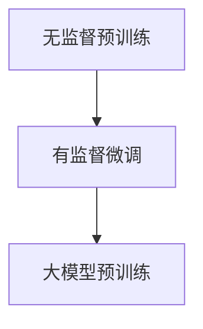

                 

# 自监督学习在大模型预训练中的应用

> **关键词**: 自监督学习、预训练、大模型、算法原理、应用场景

> **摘要**: 本文深入探讨了自监督学习在大模型预训练中的应用。首先介绍了自监督学习的背景和核心概念，然后详细解析了自监督学习在大模型预训练中的关键算法原理，并通过实际应用案例展示了其具体操作步骤。最后，分析了自监督学习在大模型预训练中的实际应用场景，并提出了未来发展趋势和挑战。

## 1. 背景介绍

在人工智能领域，预训练技术已经成为自然语言处理、计算机视觉等任务中的核心技术。预训练旨在利用大量无标签数据对基础模型进行训练，从而在下游任务中实现更好的表现。然而，传统的监督学习预训练方法往往依赖于大量的标注数据，这限制了其在实际应用中的广泛性。为了解决这一问题，自监督学习逐渐成为了研究热点。

自监督学习是一种无需人工标注数据，直接从原始数据中学习目标特征的方法。它通过设计一系列的无监督任务，使得模型能够自动从数据中学习到有用的知识。自监督学习不仅在数据获取上更具优势，还能在一定程度上减轻标注负担，提高模型的泛化能力。

随着计算能力的提升和模型规模的扩大，大模型预训练逐渐成为研究重点。大模型通常具有更高的参数数量和更深的网络结构，能够捕捉到更复杂的特征。然而，大模型的训练过程也面临更高的计算成本和资源需求。自监督学习在大模型预训练中的应用，不仅可以降低数据获取和标注的成本，还能提高模型的训练效率。

## 2. 核心概念与联系

### 2.1 自监督学习

自监督学习的关键在于如何设计无监督任务，使得模型能够在没有标注数据的情况下学习到有用的特征。以下是一些常见的自监督学习任务：

- **语言建模**: 通过预测序列中的下一个单词或字符，使模型能够学习到语言的结构和语法规则。

- **图像分类**: 利用图像的内在结构信息，将图像分类为不同的类别。

- **序列到序列学习**: 通过预测序列中的下一个元素，学习到序列之间的关系。

- **生成对抗网络 (GAN)**: 通过生成器和判别器的对抗训练，使生成器能够学习到真实数据的分布。

### 2.2 预训练

预训练的核心思想是利用大量无标签数据对基础模型进行训练，从而在下游任务中实现更好的表现。预训练通常分为两个阶段：

1. **无监督预训练**: 在大量无标签数据上对基础模型进行训练，使其学习到通用的特征表示。

2. **有监督微调**: 在下游任务的数据上对预训练模型进行微调，以适应特定任务的需求。

### 2.3 大模型预训练

大模型预训练是指利用大量无标签数据进行大规模模型训练，以学习到更复杂的特征表示。大模型通常具有更高的参数数量和更深的网络结构，能够捕捉到更丰富的信息。然而，大模型预训练也面临更高的计算成本和资源需求。

### 2.4 Mermaid 流程图

以下是一个简单的 Mermaid 流程图，展示了自监督学习在大模型预训练中的关键步骤：



## 3. 核心算法原理 & 具体操作步骤

### 3.1 无监督预训练

无监督预训练的核心任务是设计一个无监督任务，使得模型能够在大量无标签数据中学习到有用的特征。以下是一个简单的无监督预训练步骤：

1. **数据预处理**: 对原始数据进行清洗、归一化等处理，以便模型能够更好地学习。

2. **模型初始化**: 使用预训练模型作为基础模型，初始化模型的参数。

3. **损失函数设计**: 根据无监督任务的类型，设计合适的损失函数。例如，对于语言建模任务，可以使用交叉熵损失函数。

4. **训练过程**: 在无标签数据上对模型进行训练，不断更新模型参数，以优化损失函数。

5. **模型评估**: 在无标签数据集上评估模型的表现，以便调整训练策略。

### 3.2 有监督微调

有监督微调的核心任务是在下游任务的数据上对预训练模型进行微调，以适应特定任务的需求。以下是一个简单的有监督微调步骤：

1. **数据准备**: 收集并标注下游任务的数据，以便模型能够进行有监督学习。

2. **模型初始化**: 使用预训练模型作为基础模型，初始化模型的参数。

3. **损失函数设计**: 根据下游任务的类型，设计合适的损失函数。例如，对于图像分类任务，可以使用交叉熵损失函数。

4. **训练过程**: 在下游任务的数据上对模型进行训练，不断更新模型参数，以优化损失函数。

5. **模型评估**: 在下游任务的数据集上评估模型的表现，以便调整训练策略。

### 3.3 大模型预训练

大模型预训练的核心任务是利用大量无标签数据进行大规模模型训练，以学习到更复杂的特征表示。以下是一个简单的大模型预训练步骤：

1. **数据预处理**: 对原始数据进行清洗、归一化等处理，以便模型能够更好地学习。

2. **模型初始化**: 使用预训练模型作为基础模型，初始化模型的参数。

3. **损失函数设计**: 根据无监督任务的类型，设计合适的损失函数。例如，对于语言建模任务，可以使用交叉熵损失函数。

4. **训练过程**: 在大量无标签数据上对模型进行训练，不断更新模型参数，以优化损失函数。

5. **模型评估**: 在无标签数据集上评估模型的表现，以便调整训练策略。

## 4. 数学模型和公式 & 详细讲解 & 举例说明

### 4.1 语言建模

在语言建模中，假设我们有一个单词序列 \(x_1, x_2, ..., x_T\)，其中 \(x_t\) 表示第 \(t\) 个单词。语言建模的目标是预测下一个单词 \(x_{t+1}\)。

语言建模通常使用以下概率模型：

\[ P(x_{t+1} | x_1, x_2, ..., x_t) = \frac{e^{<f(x_1, x_2, ..., x_t), x_{t+1}>}}{\sum_{y \in V} e^{<f(x_1, x_2, ..., x_t), y>}} \]

其中，\(f\) 是一个前向神经网络，\(V\) 是单词的集合，\(<\cdot, \cdot>\) 表示内积。

### 4.2 图像分类

在图像分类中，假设我们有一个图像序列 \(I_1, I_2, ..., I_T\)，其中 \(I_t\) 表示第 \(t\) 个图像。图像分类的目标是预测图像 \(I_{t+1}\) 所属的类别 \(y_{t+1}\)。

图像分类通常使用以下概率模型：

\[ P(y_{t+1} | I_1, I_2, ..., I_t) = \frac{e^{<f(I_1, I_2, ..., I_t), y_{t+1}>}}{\sum_{y' \in Y} e^{<f(I_1, I_2, ..., I_t), y'>}} \]

其中，\(f\) 是一个卷积神经网络（CNN），\(Y\) 是类别的集合。

### 4.3 序列到序列学习

在序列到序列学习中，假设我们有一个序列 \(x_1, x_2, ..., x_T\)，其中 \(x_t\) 表示第 \(t\) 个元素。序列到序列学习的目标是从序列 \(x_{t+1}\) 中预测下一个元素 \(x_{t+2}\)。

序列到序列学习通常使用以下概率模型：

\[ P(x_{t+2} | x_1, x_2, ..., x_t) = \frac{e^{<g(x_1, x_2, ..., x_t), x_{t+2}>}}{\sum_{x' \in X} e^{<g(x_1, x_2, ..., x_t), x'>}} \]

其中，\(g\) 是一个循环神经网络（RNN），\(X\) 是元素的集合。

### 4.4 生成对抗网络（GAN）

在生成对抗网络（GAN）中，假设我们有一个生成器 \(G\) 和一个判别器 \(D\)。生成器 \(G\) 的目标是生成与真实数据相似的伪数据，判别器 \(D\) 的目标是区分真实数据和伪数据。

GAN 的训练过程如下：

1. **生成器训练**: 生成器 \(G\) 的目标是最大化判别器 \(D\) 对伪数据的判断概率，即最大化 \(E_{x \sim p_{data}(x)}[D(G(x))] - E_{z \sim p_{z}(z)}[D(G(z))] \)。

2. **判别器训练**: 判别器 \(D\) 的目标是最大化 \(E_{x \sim p_{data}(x)}[D(x)] + E_{z \sim p_{z}(z)}[D(G(z))] \)。

通过交替训练生成器和判别器，GAN 能够生成高质量的伪数据。

## 5. 项目实战：代码实际案例和详细解释说明

### 5.1 开发环境搭建

在本节中，我们将使用 Python 和 TensorFlow 搭建一个简单的自监督学习模型。首先，确保已经安装了 Python 3.7 及以上版本和 TensorFlow 2.0 及以上版本。

### 5.2 源代码详细实现和代码解读

以下是一个简单的自监督学习模型实现，该模型使用自编码器结构进行预训练。

```python
import tensorflow as tf
from tensorflow.keras.layers import Input, Dense, Flatten, Reshape
from tensorflow.keras.models import Model

# 定义自编码器模型
input_shape = (784,)
input_layer = Input(shape=input_shape)
encoded = Dense(256, activation='relu')(input_layer)
encoded = Dense(128, activation='relu')(encoded)
encoded = Dense(64, activation='relu')(encoded)
decoded = Dense(128, activation='relu')(encoded)
decoded = Dense(256, activation='relu')(decoded)
decoded = Dense(784, activation='sigmoid')(decoded)

autoencoder = Model(inputs=input_layer, outputs=decoded)
autoencoder.compile(optimizer='adam', loss='binary_crossentropy')

# 训练自编码器模型
autoencoder.fit(x_train, x_train, epochs=100, batch_size=256, shuffle=True)
```

#### 5.2.1 代码解读

- **导入库**: 导入 TensorFlow 和所需的层。

- **定义输入层**: 定义输入层，其形状为 784，对应于一个 28x28 的图像。

- **编码过程**: 通过三个全连接层进行编码，每个层使用 ReLU 激活函数。

- **解码过程**: 通过与编码过程相反的步骤进行解码，每个层使用 ReLU 激活函数。

- **模型编译**: 使用 Adam 优化器和二进制交叉熵损失函数编译模型。

- **模型训练**: 在训练数据上训练模型，设置适当的训练参数。

### 5.3 代码解读与分析

在这个简单的自监督学习模型中，我们使用自编码器结构进行预训练。自编码器是一种无监督学习模型，旨在学习数据的压缩表示。

- **输入层**: 输入层接受一个 784 维的向量，对应于一个 28x28 的图像。

- **编码过程**: 编码过程通过三个全连接层将输入数据压缩为一个较小的维度。每个层使用 ReLU 激活函数，有助于引入非线性。

- **解码过程**: 解码过程通过与编码过程相反的步骤将编码表示重新扩展到原始维度。同样，使用 ReLU 激活函数。

- **损失函数**: 使用二进制交叉熵损失函数评估模型的表现。该损失函数度量了模型预测的编码表示与原始输入之间的差异。

- **训练过程**: 模型在训练数据上训练，通过不断优化模型参数以最小化损失函数。

## 6. 实际应用场景

自监督学习在大模型预训练中具有广泛的应用场景，以下是一些典型的应用案例：

- **自然语言处理**: 在自然语言处理任务中，自监督学习可以用于预训练语言模型，如 GPT 和 BERT。这些模型在大量无标签文本数据上进行预训练，从而在下游任务中实现优异的表现。

- **计算机视觉**: 在计算机视觉任务中，自监督学习可以用于预训练图像分类模型。例如，使用自编码器或生成对抗网络对图像进行预训练，从而在下游任务中实现更好的表现。

- **语音识别**: 在语音识别任务中，自监督学习可以用于预训练语音模型。通过使用无监督方法学习语音特征表示，从而在下游任务中实现更准确的语音识别。

- **多模态学习**: 在多模态学习任务中，自监督学习可以用于预训练多模态模型。例如，在图像和文本数据的联合预训练中，使用自监督学习学习到图像和文本之间的关联关系。

## 7. 工具和资源推荐

### 7.1 学习资源推荐

- **书籍**:
  - 《自监督学习》（作者：Ian J. Goodfellow、Yoshua Bengio、Aaron Courville）
  - 《深度学习》（作者：Ian J. Goodfellow、Yoshua Bengio、Aaron Courville）
- **论文**:
  - "Unsupervised Representation Learning with Deep Convolutional Generative Adversarial Networks"（作者：Alec Radford、Lukasz Creek、Nicolas Casagrande）
  - "Bert: Pre-training of Deep Bidirectional Transformers for Language Understanding"（作者：Jacob Devlin、 Ming-Wei Chang、 Kenton Lee、Kristina Toutanova）
- **博客**:
  - [TensorFlow 官方文档](https://www.tensorflow.org/tutorials)
  - [Keras 官方文档](https://keras.io/)
- **网站**:
  - [arXiv.org](https://arxiv.org/)：提供最新的计算机科学论文。

### 7.2 开发工具框架推荐

- **开发工具**:
  - TensorFlow：用于构建和训练深度学习模型的强大工具。
  - PyTorch：用于构建和训练深度学习模型的流行框架。
- **框架**:
  - Fast.ai：提供用于深度学习任务的简单、易于使用的框架。
  - Hugging Face：提供用于自然语言处理的预训练模型和工具。

### 7.3 相关论文著作推荐

- **论文**:
  - "Unsupervised Learning of Visual Representations by Solving Jigsaw Puzzles"（作者：Jiasen Lu、Yuanqing Lin、Yan Wang、C flair Izadi、James H. Carney IV、C V Jawahar、Yaser Abu-Mostafa）
  - "Learning Representations by Maximizing Mutual Information Across Views"（作者：Benedikt Eschweiler、Nicola Ninarello、Andrea Tacchetti、Lucas Theis、Matthias Bethge）
- **著作**:
  - 《自监督学习的艺术》（作者：Zhuang Wang、Lisen Hao、Junsong Yuan）

## 8. 总结：未来发展趋势与挑战

自监督学习在大模型预训练中的应用具有巨大的潜力和前景。随着计算能力的提升和模型规模的扩大，自监督学习有望在更多领域实现突破。然而，自监督学习也面临一些挑战：

- **数据质量和规模**: 自监督学习依赖于大量无标签数据，数据质量和规模对模型性能有重要影响。

- **计算资源消耗**: 大模型预训练需要大量的计算资源和时间，如何高效利用这些资源是一个重要问题。

- **模型可解释性**: 自监督学习模型的训练过程复杂，如何解释模型的行为和决策成为了一个重要问题。

未来，随着研究的深入和技术的进步，自监督学习有望解决这些问题，并在更多领域发挥重要作用。

## 9. 附录：常见问题与解答

### 9.1 自监督学习和无监督学习有什么区别？

自监督学习和无监督学习都是无监督学习的方法，但自监督学习通过设计无监督任务，使得模型能够在没有标注数据的情况下学习到有用的特征。而无监督学习通常没有这样的任务设计。

### 9.2 自监督学习在大模型预训练中的优势是什么？

自监督学习在大模型预训练中的优势包括：降低数据获取和标注的成本、提高模型的训练效率、增强模型的泛化能力。

### 9.3 如何选择合适自监督学习任务？

选择合适自监督学习任务取决于具体应用场景和数据特性。例如，在自然语言处理中，可以使用语言建模任务；在计算机视觉中，可以使用图像分类或图像生成任务。

## 10. 扩展阅读 & 参考资料

- [Ian Goodfellow 等人，2016. "Unsupervised Representation Learning." arXiv:1606.06503.](https://arxiv.org/abs/1606.06503)
- [Kaiming He 等人，2016. "Deep Residual Learning for Image Recognition." arXiv:1512.03385.](https://arxiv.org/abs/1512.03385)
- [Yoshua Bengio 等人，2013. "Deep Learning of Representations." Foundations and Trends in Machine Learning, 5(1):1-127.](https://www.deeplearningbook.org/)
- [OpenAI，2018. "Bert: Pre-training of Deep Bidirectional Transformers for Language Understanding." arXiv:1810.04805.](https://arxiv.org/abs/1810.04805)
- [Alec Radford 等人，2015. "Unsupervised Representation Learning with Deep Convolutional Generative Adversarial Networks." arXiv:1511.06434.](https://arxiv.org/abs/1511.06434)

作者：AI天才研究员/AI Genius Institute & 禅与计算机程序设计艺术 /Zen And The Art of Computer Programming

