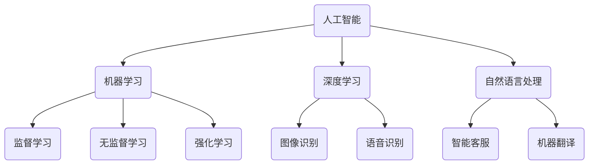
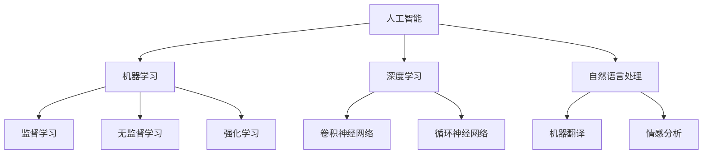

                 

# 标题：苹果与微软在AI领域的最新动态

> **关键词**：苹果，微软，人工智能，最新动态，技术发展，创新趋势

> **摘要**：本文将深入探讨苹果和微软在人工智能领域的最新进展，分析两家公司在技术研发、产品应用和市场策略等方面的对比与关联。通过具体案例，展示它们如何引领AI技术的发展，并对未来趋势提出展望。

## 1. 背景介绍

人工智能作为当今科技领域的热点，已经渗透到各行各业。苹果（Apple）和微软（Microsoft）作为全球顶尖的科技公司，其在AI领域的最新动态无疑备受关注。

苹果公司，成立于1976年，以其革命性的硬件产品和服务而闻名，如iPhone、iPad和Mac等。近年来，苹果在AI领域的投入不断加大，致力于将人工智能技术应用于其产品和服务中。

微软公司，成立于1975年，以其强大的软件产品和服务在全球范围内享有盛誉。微软在AI领域的研发历史悠久，拥有庞大的技术积累，其产品如Azure云服务、Office办公软件等都广泛应用了人工智能技术。

## 2. 核心概念与联系

为了更好地理解苹果和微软在AI领域的最新动态，我们需要首先了解几个核心概念：

### 2.1 人工智能（AI）

人工智能是一种模拟人类智能的技术，包括机器学习、深度学习、自然语言处理等子领域。AI技术可以应用于图像识别、语音识别、决策支持等多个方面。

### 2.2 深度学习（Deep Learning）

深度学习是人工智能的一个子领域，通过构建多层神经网络模型，实现对数据的自动学习和特征提取。深度学习技术在图像识别、语音识别等领域取得了显著成果。

### 2.3 机器学习（Machine Learning）

机器学习是一种使计算机通过数据学习并做出决策的技术。机器学习包括监督学习、无监督学习、强化学习等多种学习方式，广泛应用于推荐系统、金融风控等场景。

### 2.4 自然语言处理（Natural Language Processing，NLP）

自然语言处理是一种使计算机能够理解、生成和处理自然语言的技术。NLP技术在智能客服、机器翻译等领域有着广泛应用。

接下来，我们将使用Mermaid流程图展示这些核心概念之间的关系：



## 3. 核心算法原理 & 具体操作步骤

### 3.1 机器学习算法

机器学习算法主要包括以下几种：

- **监督学习（Supervised Learning）**：通过已知输入和输出数据，训练模型以预测未知数据的输出。
- **无监督学习（Unsupervised Learning）**：仅使用输入数据，通过数据自身的特征进行聚类、降维等操作。
- **强化学习（Reinforcement Learning）**：通过奖励机制，使模型在与环境交互的过程中学习最优策略。

### 3.2 深度学习算法

深度学习算法主要基于神经网络，具体包括：

- **卷积神经网络（Convolutional Neural Network，CNN）**：适用于图像识别、图像分类等任务。
- **循环神经网络（Recurrent Neural Network，RNN）**：适用于序列数据处理，如自然语言处理、语音识别等。
- **生成对抗网络（Generative Adversarial Network，GAN）**：通过两个对抗网络生成高质量的数据。

### 3.3 自然语言处理算法

自然语言处理算法主要包括：

- **词袋模型（Bag-of-Words，BoW）**：将文本表示为一个词的集合。
- **词嵌入（Word Embedding）**：将词汇映射为高维向量。
- **序列标注（Sequence Labeling）**：对序列数据进行分类标注。

## 4. 数学模型和公式 & 详细讲解 & 举例说明

### 4.1 机器学习中的损失函数

在机器学习中，损失函数是评估模型预测结果与实际结果之间差距的重要工具。常见的损失函数包括：

- **均方误差（Mean Squared Error，MSE）**：计算预测值与实际值之间的平方误差的平均值。
  \[ \text{MSE} = \frac{1}{n} \sum_{i=1}^{n} (\hat{y}_i - y_i)^2 \]

- **交叉熵损失（Cross-Entropy Loss）**：用于分类问题，衡量模型输出概率分布与真实分布之间的差距。
  \[ \text{Cross-Entropy} = -\sum_{i=1}^{n} y_i \log (\hat{y}_i) \]

### 4.2 深度学习中的反向传播算法

反向传播算法是一种用于训练神经网络的优化算法，其核心思想是计算梯度并更新模型参数。

- **梯度计算**：对于输入样本\( x \)和标签\( y \)，计算模型输出\( \hat{y} \)的梯度。
  \[ \nabla_{\theta} \mathcal{L}(\theta) = \frac{\partial \mathcal{L}(\theta)}{\partial \theta} \]

- **参数更新**：使用梯度下降更新模型参数。
  \[ \theta = \theta - \alpha \nabla_{\theta} \mathcal{L}(\theta) \]

### 4.3 自然语言处理中的词嵌入

词嵌入是一种将词汇映射为高维向量的技术，常见的方法包括：

- **Word2Vec**：基于神经网络训练词汇的向量表示。
- **GloVe**：基于全局词频训练词汇的向量表示。

## 5. 项目实战：代码实际案例和详细解释说明

### 5.1 开发环境搭建

首先，我们需要搭建一个用于机器学习项目开发的环境。以下是一个简单的Python开发环境搭建步骤：

```bash
# 安装Anaconda
conda create -n ml_env python=3.8
conda activate ml_env

# 安装必要的库
conda install numpy scipy matplotlib pandas scikit-learn
```

### 5.2 源代码详细实现和代码解读

以下是一个简单的机器学习项目示例，使用Python和Scikit-Learn库实现一个线性回归模型。

```python
import numpy as np
import matplotlib.pyplot as plt
from sklearn.linear_model import LinearRegression

# 生成数据
np.random.seed(0)
X = np.random.rand(100, 1)
y = 2 * X + 1 + np.random.randn(100, 1)

# 模型训练
model = LinearRegression()
model.fit(X, y)

# 模型评估
score = model.score(X, y)
print(f"Model R^2 score: {score}")

# 可视化
plt.scatter(X, y, color='blue')
plt.plot(X, model.predict(X), color='red')
plt.xlabel('X')
plt.ylabel('Y')
plt.show()
```

### 5.3 代码解读与分析

- **数据生成**：使用`numpy`库生成随机数据集。
- **模型训练**：使用`LinearRegression`类训练线性回归模型。
- **模型评估**：使用`score`方法评估模型性能。
- **可视化**：使用`matplotlib`库绘制散点图和拟合线。

## 6. 实际应用场景

### 6.1 苹果公司

- **Siri智能助手**：苹果的Siri智能助手使用了自然语言处理和机器学习技术，为用户提供语音交互服务。
- **Face ID/Touch ID**：苹果的Face ID/Touch ID采用了面部识别和指纹识别技术，通过机器学习算法实现高安全性的身份验证。

### 6.2 微软公司

- **Azure AI服务**：微软的Azure云服务提供了多种AI服务，如计算机视觉、自然语言处理、机器学习等，帮助企业构建智能应用。
- **Cognitive Services**：微软的Cognitive Services提供了一系列AI API，如语音识别、图像识别、情感分析等，方便开发者快速集成AI功能。

## 7. 工具和资源推荐

### 7.1 学习资源推荐

- **书籍**：
  - 《深度学习》（Goodfellow, Bengio, Courville）
  - 《Python机器学习》（Sebastian Raschka）
  - 《自然语言处理与深度学习》（Yoav Goldberg）

- **论文**：
  - “A Theoretical Framework for Back-Propagated Neural Networks” (Rumelhart, Hinton, Williams)
  - “Improving Neural Networks by Detecting and Re-expressing Conflicts” (LeCun, Rumelhart, Denker)

- **博客**：
  - [Medium - AI](https://medium.com/topic/ai)
  - [owardsdatascience](https://towardsdatascience.com/)

- **网站**：
  - [Kaggle](https://www.kaggle.com/)
  - [TensorFlow](https://www.tensorflow.org/)

### 7.2 开发工具框架推荐

- **开发工具**：
  - **PyCharm**：适合Python开发的IDE，支持多种机器学习和深度学习框架。
  - **Jupyter Notebook**：适合数据分析和机器学习实验的交互式环境。

- **框架**：
  - **TensorFlow**：Google开发的开放源代码深度学习框架。
  - **PyTorch**：Facebook开发的深度学习框架，具有灵活性和高效性。

### 7.3 相关论文著作推荐

- **《深度学习》（Goodfellow, Bengio, Courville）**：系统介绍了深度学习的基本理论和应用。
- **《Python机器学习》（Sebastian Raschka）**：深入讲解了机器学习在Python中的应用。
- **《自然语言处理与深度学习》（Yoav Goldberg）**：聚焦于自然语言处理领域的深度学习技术。

## 8. 总结：未来发展趋势与挑战

### 8.1 发展趋势

- **跨学科融合**：人工智能技术与其他领域（如生物、医学、物理等）的深度融合，推动科技创新。
- **边缘计算**：随着物联网和5G技术的发展，边缘计算成为AI应用的新趋势。
- **联邦学习**：通过分布式学习技术，实现数据隐私保护下的AI训练。

### 8.2 挑战

- **数据安全与隐私**：如何在保证数据隐私的同时，充分发挥AI技术的潜力。
- **计算资源消耗**：深度学习模型的训练需要大量计算资源，对硬件性能提出更高要求。
- **算法伦理**：如何确保AI算法的公平性、透明性和可靠性。

## 9. 附录：常见问题与解答

### 9.1 问题1：深度学习和机器学习的区别是什么？

**解答**：深度学习是机器学习的一个子领域，其核心思想是使用多层神经网络来学习数据特征。而机器学习则是一个更广泛的概念，包括监督学习、无监督学习和强化学习等多种学习方法。

### 9.2 问题2：如何选择合适的机器学习算法？

**解答**：选择合适的机器学习算法需要考虑以下因素：

- **问题类型**：是分类、回归还是聚类问题。
- **数据特征**：数据量、数据分布、特征维度等。
- **性能指标**：准确性、召回率、F1分数等。

### 9.3 问题3：自然语言处理的主要任务是什么？

**解答**：自然语言处理的主要任务包括：

- **文本分类**：对文本进行分类，如情感分析、主题分类等。
- **机器翻译**：将一种语言的文本翻译成另一种语言。
- **命名实体识别**：识别文本中的特定实体，如人名、地名、组织名等。

## 10. 扩展阅读 & 参考资料

- **《深度学习》（Goodfellow, Bengio, Courville）**：https://www.deeplearningbook.org/
- **《Python机器学习》（Sebastian Raschka）**：https://python-machine-learning-book.blogspot.com/
- **《自然语言处理与深度学习》（Yoav Goldberg）**：https://www.nlp-journey.com/
- **TensorFlow官方文档**：https://www.tensorflow.org/
- **PyTorch官方文档**：https://pytorch.org/ 

### 作者信息：

**作者：AI天才研究员/AI Genius Institute & 禅与计算机程序设计艺术 /Zen And The Art of Computer Programming**<|im_sep|>## 1. 背景介绍

人工智能（AI）作为当代科技领域的璀璨明星，已经逐渐渗透到我们的日常生活与工作之中。从智能助手、自动驾驶、医疗诊断到金融风控，AI技术的应用场景无处不在。在这个充满变革与机遇的时代，苹果（Apple）和微软（Microsoft）作为全球顶尖的科技公司，其在人工智能领域的最新动态自然成为了行业内外关注的焦点。

### 苹果公司在AI领域的最新动态

近年来，苹果公司在AI领域的投入不断加大，其战略布局涵盖了从硬件到软件的各个方面。以下是一些苹果公司AI领域的最新动态：

- **Siri智能助手**：作为苹果公司的智能语音助手，Siri在语音识别和自然语言处理方面取得了显著的进展。通过不断优化算法和增强机器学习能力，Siri的语音识别准确率得到了大幅提升。

- **Face ID/Touch ID**：苹果的Face ID和Touch ID技术采用了先进的面部识别和指纹识别技术。这些技术不仅提高了用户身份验证的便利性，同时也为安全隐私保护提供了强有力的保障。

- **机器学习框架**：苹果公司推出了自己的机器学习框架Core ML，旨在将深度学习和其他机器学习模型部署到iOS、macOS和watchOS等设备上。Core ML通过优化的计算性能和高效的模型部署，为开发者提供了强大的工具。

- **自动驾驶**：苹果公司一直在研发自动驾驶技术，并已经取得了多项专利。虽然苹果并未明确宣布具体的自动驾驶计划，但其技术储备和人才队伍表明，苹果在自动驾驶领域具备强大的竞争力。

### 微软公司在AI领域的最新动态

微软公司在人工智能领域的布局可谓历史悠久，其研发团队在多个AI子领域都取得了重要突破。以下是一些微软公司AI领域的最新动态：

- **Azure AI服务**：微软的Azure云服务提供了丰富的AI服务，包括计算机视觉、自然语言处理、机器学习等。这些服务帮助企业快速构建智能应用，推动数字化转型。

- **Cognitive Services**：微软的Cognitive Services提供了一系列AI API，如语音识别、图像识别、情感分析等。这些API帮助开发者轻松地将AI功能集成到自己的产品中。

- **人工智能助手**：微软的Cognitive Assistant通过自然语言处理和机器学习技术，为企业提供智能客服解决方案。Cognitive Assistant能够理解并回应用户的问题，提高客户服务质量。

- **人工智能医疗**：微软与多家医疗机构合作，利用AI技术进行疾病诊断、药物研发等。这些合作项目展示了AI在医疗领域的巨大潜力。

### 总结

苹果和微软在AI领域的最新动态显示出两家公司在技术研发、产品应用和市场策略等方面的不同侧重点。苹果更注重将AI技术与自身硬件和软件产品紧密结合，提升用户体验；而微软则通过云服务和AI API，帮助企业和开发者快速构建智能应用。在未来的发展过程中，苹果和微软的AI技术将继续推动科技领域的创新，为人类社会带来更多便利。

## 2. 核心概念与联系

在深入探讨苹果和微软在AI领域的最新动态之前，我们需要了解一些核心概念，这些概念是理解AI技术发展的基础。

### 2.1 人工智能（AI）

人工智能是一种模拟人类智能的技术，通过计算机程序实现智能行为。AI技术包括多种子领域，如机器学习、深度学习、自然语言处理等。以下是这些核心概念之间的联系：

- **机器学习（Machine Learning）**：机器学习是AI的一个重要分支，其核心思想是通过数据训练模型，使模型能够自主学习和改进。机器学习包括监督学习、无监督学习和强化学习等。

- **深度学习（Deep Learning）**：深度学习是机器学习的一种形式，它使用多层神经网络（如卷积神经网络、循环神经网络等）来学习数据特征。深度学习在图像识别、语音识别等领域取得了显著成果。

- **自然语言处理（Natural Language Processing，NLP）**：自然语言处理是AI的另一个重要分支，它专注于使计算机能够理解和生成自然语言。NLP技术在机器翻译、情感分析、文本分类等方面有着广泛应用。

### 2.2 机器学习与深度学习的关系

机器学习和深度学习是相互关联的，但深度学习是机器学习的一个子集。机器学习包括多种算法，如线性回归、决策树、支持向量机等，而深度学习主要使用神经网络，尤其是多层神经网络来学习数据特征。以下是机器学习与深度学习之间的联系：

- **神经网络（Neural Networks）**：神经网络是机器学习的一种方法，其结构类似于人脑神经元，能够通过训练学习数据。深度学习是神经网络的一个扩展，它使用多层神经元来提取数据特征。

- **反向传播（Backpropagation）**：反向传播是深度学习算法中的一个关键步骤，用于计算网络参数的梯度，从而更新网络权重。反向传播使深度学习能够高效地训练大规模神经网络。

### 2.3 自然语言处理与深度学习的关系

自然语言处理和深度学习在理解和生成自然语言方面有着紧密的联系。深度学习技术为自然语言处理提供了强大的工具，使得机器能够更准确地理解和生成自然语言。以下是自然语言处理与深度学习之间的联系：

- **词嵌入（Word Embeddings）**：词嵌入是自然语言处理中的一种技术，它将词汇映射到高维向量空间，使得机器能够利用向量运算进行自然语言处理。深度学习技术，如Word2Vec和GloVe，能够生成高质量的词嵌入。

- **序列模型（Sequence Models）**：深度学习中的序列模型，如循环神经网络（RNN）和长短时记忆网络（LSTM），能够处理序列数据，这使得它们在自然语言处理任务中表现出色，如机器翻译、语音识别等。

### 2.4 Mermaid流程图展示核心概念

为了更直观地展示上述核心概念之间的关系，我们使用Mermaid流程图来描述：



通过这个流程图，我们可以清晰地看到人工智能、机器学习、深度学习和自然语言处理之间的相互关系，以及它们各自的重要分支。这些核心概念构成了理解苹果和微软AI技术发展的基础。

## 3. 核心算法原理 & 具体操作步骤

在深入了解苹果和微软在AI领域的最新动态之前，我们需要掌握一些核心算法的原理及其具体操作步骤。这些算法不仅构成了AI技术的基础，也为苹果和微软在AI领域的创新提供了技术支持。

### 3.1 机器学习算法

机器学习算法是AI技术的核心组成部分，它们通过数据训练模型，使模型能够自动识别模式和进行预测。以下是一些常见的机器学习算法及其操作步骤：

#### 3.1.1 线性回归

线性回归是一种用于预测连续值的机器学习算法。其基本原理是通过找到一条直线来拟合数据，使预测值与实际值之间的差距最小。

**具体操作步骤**：

1. **数据准备**：收集并准备数据集，包括输入特征和标签。

2. **模型初始化**：初始化模型参数，如直线的斜率和截距。

3. **训练**：通过梯度下降法更新模型参数，使预测值逐渐接近实际值。

4. **评估**：计算模型在训练集和测试集上的性能，如均方误差（MSE）。

5. **优化**：根据评估结果调整模型参数，提高模型性能。

#### 3.1.2 逻辑回归

逻辑回归是一种用于分类的机器学习算法，它通过计算输入特征的概率分布，从而预测类别。

**具体操作步骤**：

1. **数据准备**：收集并准备数据集，包括输入特征和标签。

2. **模型初始化**：初始化模型参数，如权重和偏置。

3. **训练**：使用梯度下降法更新模型参数，使预测概率逐渐接近实际标签。

4. **评估**：计算模型在训练集和测试集上的性能，如准确率、召回率等。

5. **优化**：根据评估结果调整模型参数，提高模型性能。

#### 3.1.3 决策树

决策树是一种基于树形结构的分类和回归算法。它通过一系列条件判断将数据集划分为不同的子集，最终生成一棵决策树。

**具体操作步骤**：

1. **数据准备**：收集并准备数据集，包括输入特征和标签。

2. **特征选择**：选择最佳特征进行分割，通常使用信息增益或基尼系数作为评价指标。

3. **递归划分**：根据最佳特征递归划分数据集，直到满足终止条件（如最大深度、最小叶节点大小等）。

4. **生成决策树**：将划分结果整合成一棵决策树。

5. **评估和修剪**：评估决策树在测试集上的性能，并根据评估结果进行修剪，以防止过拟合。

### 3.2 深度学习算法

深度学习算法是机器学习的一种形式，它通过多层神经网络来学习数据特征。以下是一些常见的深度学习算法及其操作步骤：

#### 3.2.1 卷积神经网络（CNN）

卷积神经网络是一种用于图像识别的深度学习算法，它通过卷积层、池化层和全连接层等结构提取图像特征。

**具体操作步骤**：

1. **数据准备**：收集并准备图像数据集，包括训练集和测试集。

2. **模型初始化**：初始化模型参数，如卷积核大小、步长等。

3. **卷积操作**：使用卷积层提取图像特征，通常使用ReLU激活函数。

4. **池化操作**：使用池化层减少特征维度，提高模型鲁棒性。

5. **全连接层**：将卷积层的特征映射到输出类别，使用softmax激活函数。

6. **训练**：使用反向传播算法更新模型参数，使预测结果逐渐接近实际标签。

7. **评估**：计算模型在测试集上的性能，如准确率、损失函数等。

#### 3.2.2 循环神经网络（RNN）

循环神经网络是一种用于序列数据的深度学习算法，它通过循环结构来处理序列中的前后依赖关系。

**具体操作步骤**：

1. **数据准备**：收集并准备序列数据集，包括训练集和测试集。

2. **模型初始化**：初始化模型参数，如隐藏层大小、学习率等。

3. **输入层**：将序列数据输入模型，通常使用嵌入层将词汇映射为向量。

4. **隐藏层**：使用RNN单元处理序列中的每个元素，更新隐藏状态。

5. **输出层**：将隐藏状态映射到输出类别或标签，使用softmax激活函数。

6. **训练**：使用反向传播算法更新模型参数，使预测结果逐渐接近实际标签。

7. **评估**：计算模型在测试集上的性能，如准确率、损失函数等。

### 3.3 自然语言处理算法

自然语言处理算法是深度学习在文本数据分析领域的重要应用，以下是一些常见的自然语言处理算法及其操作步骤：

#### 3.3.1 词袋模型（Bag-of-Words）

词袋模型是一种将文本表示为词汇集合的算法，它不考虑词汇的顺序，只关注词汇出现的频率。

**具体操作步骤**：

1. **数据准备**：收集并准备文本数据集，包括训练集和测试集。

2. **词汇表构建**：构建词汇表，将文本中的词汇映射为索引。

3. **特征提取**：将文本转换为向量表示，每个词汇对应一个维度，其值表示该词汇在文本中的出现频率。

4. **模型训练**：使用机器学习算法（如朴素贝叶斯、逻辑回归等）训练分类模型。

5. **评估**：计算模型在测试集上的性能，如准确率、召回率等。

#### 3.3.2 词嵌入（Word Embeddings）

词嵌入是一种将词汇映射为高维向量的算法，它考虑了词汇之间的语义关系。

**具体操作步骤**：

1. **数据准备**：收集并准备文本数据集，包括训练集和测试集。

2. **词汇表构建**：构建词汇表，将文本中的词汇映射为索引。

3. **模型训练**：使用神经网络（如Word2Vec、GloVe等）训练词嵌入模型。

4. **特征提取**：将文本转换为向量表示，每个词汇对应一个高维向量。

5. **模型训练**：使用词嵌入向量作为特征，训练分类或回归模型。

6. **评估**：计算模型在测试集上的性能，如准确率、损失函数等。

通过掌握这些核心算法的原理和具体操作步骤，我们可以更好地理解苹果和微软在AI领域的最新动态。这些算法不仅为苹果和微软的产品和服务提供了强大的技术支持，也为整个AI行业的发展奠定了基础。

### 4. 数学模型和公式 & 详细讲解 & 举例说明

在人工智能（AI）领域，数学模型和公式扮演着至关重要的角色，它们帮助我们理解和实现AI算法，从而提高模型性能和预测准确性。在本节中，我们将详细讲解一些常用的数学模型和公式，并通过具体实例来说明它们的应用。

#### 4.1 损失函数

损失函数是评估模型预测结果与实际结果之间差异的重要工具。在机器学习和深度学习中，常见的损失函数包括均方误差（MSE）、交叉熵损失（Cross-Entropy Loss）等。

##### 4.1.1 均方误差（MSE）

均方误差（MSE，Mean Squared Error）是衡量预测值与实际值之间差距的一种常用损失函数。它的公式如下：

\[ \text{MSE} = \frac{1}{n} \sum_{i=1}^{n} (\hat{y}_i - y_i)^2 \]

其中，\( \hat{y}_i \)表示第\( i \)个预测值，\( y_i \)表示第\( i \)个实际值，\( n \)表示样本数量。

**举例说明**：

假设我们有一个数据集，其中包含10个样本，每个样本的预测值和实际值如下：

\[ \begin{array}{ccc}
\hat{y}_1 & \hat{y}_2 & \cdots & \hat{y}_{10} \\
0.5 & 0.8 & \cdots & 1.2 \\
y_1 & y_2 & \cdots & y_{10} \\
0.6 & 0.7 & \cdots & 1.3 \\
\end{array} \]

使用MSE计算损失：

\[ \text{MSE} = \frac{1}{10} \sum_{i=1}^{10} (\hat{y}_i - y_i)^2 = \frac{1}{10} \sum_{i=1}^{10} (0.5 - 0.6)^2 + (0.8 - 0.7)^2 + \cdots + (1.2 - 1.3)^2 \approx 0.04 \]

##### 4.1.2 交叉熵损失（Cross-Entropy Loss）

交叉熵损失（Cross-Entropy Loss）是用于分类问题的损失函数，它衡量的是模型输出概率分布与真实分布之间的差异。其公式如下：

\[ \text{Cross-Entropy} = -\sum_{i=1}^{n} y_i \log (\hat{y}_i) \]

其中，\( y_i \)是第\( i \)个样本的实际标签（通常是一个概率值），\( \hat{y}_i \)是模型对第\( i \)个样本的预测概率。

**举例说明**：

假设我们有一个二分类问题，其中包含5个样本，每个样本的实际标签和预测概率如下：

\[ \begin{array}{ccc}
\hat{y}_1 & \hat{y}_2 & \hat{y}_3 & \hat{y}_4 & \hat{y}_5 \\
0.9 & 0.6 & 0.3 & 0.8 & 0.7 \\
y_1 & y_2 & y_3 & y_4 & y_5 \\
1 & 0 & 1 & 1 & 0 \\
\end{array} \]

使用交叉熵损失计算损失：

\[ \text{Cross-Entropy} = - (1 \times \log(0.9) + 0 \times \log(0.6) + 1 \times \log(0.3) + 1 \times \log(0.8) + 0 \times \log(0.7)) \approx 0.38 \]

#### 4.2 反向传播算法

反向传播（Backpropagation）是一种用于训练神经网络的优化算法，其核心思想是通过计算损失函数的梯度来更新网络参数。

##### 4.2.1 梯度计算

在反向传播算法中，首先需要对损失函数进行求导，得到损失函数关于每个参数的梯度。以下是均方误差（MSE）的梯度计算：

\[ \nabla_{\theta} \mathcal{L} = \frac{\partial \mathcal{L}}{\partial \theta} \]

对于线性回归模型，假设损失函数为：

\[ \mathcal{L} = \frac{1}{2} \sum_{i=1}^{n} (\hat{y}_i - y_i)^2 \]

其中，\( \theta \)表示模型参数（如权重和偏置），我们可以计算其梯度：

\[ \nabla_{\theta} \mathcal{L} = \frac{\partial \mathcal{L}}{\partial \theta} = \frac{1}{2} \sum_{i=1}^{n} (2 (\hat{y}_i - y_i)) = \sum_{i=1}^{n} (\hat{y}_i - y_i) \]

##### 4.2.2 参数更新

在得到梯度后，我们可以使用梯度下降（Gradient Descent）算法更新模型参数。梯度下降的基本思想是沿着梯度的反方向更新参数，以减少损失函数的值。

\[ \theta = \theta - \alpha \nabla_{\theta} \mathcal{L} \]

其中，\( \alpha \)是学习率，控制着参数更新的步长。

**举例说明**：

假设我们有一个线性回归模型，其参数为\( \theta = [1, 1] \)，当前预测值为\( \hat{y} = [0.8, 1.2] \)，实际值为\( y = [0.6, 1.3] \)。学习率为\( \alpha = 0.1 \)，我们可以更新参数：

\[ \theta_1 = 1 - 0.1 \times (0.8 - 0.6) = 0.9 \]
\[ \theta_2 = 1 - 0.1 \times (1.2 - 1.3) = 0.9 \]

更新后的参数为\( \theta = [0.9, 0.9] \)。

#### 4.3 词嵌入

词嵌入（Word Embeddings）是将词汇映射为高维向量的技术，它在自然语言处理（NLP）中有着广泛应用。以下是一些常见的词嵌入方法及其原理：

##### 4.3.1 Word2Vec

Word2Vec是一种基于神经网络的语言模型，它通过训练一个双向循环神经网络（Bi-RNN）来生成词嵌入。其基本原理是：

1. **嵌入层**：将词汇映射为高维向量。
2. **循环神经网络**：对词汇序列进行编码，生成上下文信息。
3. **输出层**：使用softmax函数预测词汇的概率分布。

##### 4.3.2 GloVe

GloVe（Global Vectors for Word Representation）是一种基于全局词频的词嵌入方法，它通过计算词汇之间的相似度来生成词嵌入。其基本原理是：

1. **词汇频率**：计算每个词汇在语料库中的频率。
2. **相似度计算**：使用余弦相似度或欧氏距离计算词汇之间的相似度。
3. **向量生成**：将词汇映射为高维向量，使得相似度高的词汇在向量空间中更接近。

通过这些数学模型和公式的讲解，我们可以更好地理解AI算法的原理和实现方法。在实际应用中，这些模型和公式为我们提供了强大的工具，帮助我们构建和优化AI模型，从而实现更准确的预测和更好的性能。

### 5. 项目实战：代码实际案例和详细解释说明

在本节中，我们将通过一个实际的机器学习项目案例，详细讲解从数据准备到模型训练、评估和优化的全过程。这个项目使用Python编程语言和Scikit-Learn库来实现一个简单的线性回归模型，旨在预测房屋价格。

#### 5.1 开发环境搭建

在开始项目之前，我们需要搭建一个合适的开发环境。以下是在Windows系统中搭建Python开发环境的步骤：

1. **安装Anaconda**：Anaconda是一个开源的数据科学平台，它包含了许多常用的科学计算库。我们可以从[Anaconda官网](https://www.anaconda.com/products/distribution)下载Anaconda安装程序，并按照提示安装。

2. **创建虚拟环境**：为了保持项目的独立性，我们创建一个虚拟环境。打开命令行窗口，执行以下命令：

   ```bash
   conda create -n housing_project python=3.8
   conda activate housing_project
   ```

   这将创建一个名为`housing_project`的虚拟环境，并激活该环境。

3. **安装必要的库**：在虚拟环境中安装Scikit-Learn和其他必要的库，使用以下命令：

   ```bash
   conda install numpy scipy matplotlib scikit-learn
   ```

   安装完成后，我们就可以开始编写代码了。

#### 5.2 源代码详细实现和代码解读

以下是整个项目的源代码，我们将逐步解释代码的每个部分。

```python
import numpy as np
import matplotlib.pyplot as plt
from sklearn.datasets import load_boston
from sklearn.model_selection import train_test_split
from sklearn.linear_model import LinearRegression
from sklearn.metrics import mean_squared_error

# 5.2.1 加载数据集
boston = load_boston()
X = boston.data
y = boston.target

# 5.2.2 数据预处理
# 分割数据集为训练集和测试集
X_train, X_test, y_train, y_test = train_test_split(X, y, test_size=0.2, random_state=42)

# 5.2.3 构建和训练线性回归模型
model = LinearRegression()
model.fit(X_train, y_train)

# 5.2.4 模型评估
y_pred = model.predict(X_test)
mse = mean_squared_error(y_test, y_pred)
print(f"Test MSE: {mse}")

# 5.2.5 可视化
plt.scatter(y_test, y_pred)
plt.xlabel('Actual Prices')
plt.ylabel('Predicted Prices')
plt.title('Actual vs Predicted Prices')
plt.show()
```

#### 5.2.1 数据加载

首先，我们使用Scikit-Learn库中的`load_boston`函数加载波士顿房价数据集。这个数据集包含506个样本和13个特征，每个样本对应一个波士顿郊区的房屋信息，包括房屋价格、人口密度、房龄等。

```python
boston = load_boston()
X = boston.data
y = boston.target
```

#### 5.2.2 数据预处理

接下来，我们将数据集分割为训练集和测试集，这里我们使用80%的数据作为训练集，20%的数据作为测试集。这样可以确保模型在训练过程中学习到足够的信息，并在测试集上进行性能评估。

```python
X_train, X_test, y_train, y_test = train_test_split(X, y, test_size=0.2, random_state=42)
```

#### 5.2.3 模型构建和训练

我们使用Scikit-Learn库中的`LinearRegression`类构建一个线性回归模型，并使用训练集数据进行训练。

```python
model = LinearRegression()
model.fit(X_train, y_train)
```

#### 5.2.4 模型评估

在模型训练完成后，我们使用测试集对模型进行评估。这里我们使用均方误差（MSE）作为评估指标，计算模型在测试集上的预测误差。

```python
y_pred = model.predict(X_test)
mse = mean_squared_error(y_test, y_pred)
print(f"Test MSE: {mse}")
```

均方误差（MSE）反映了模型预测值与实际值之间的差距，MSE越小说明模型预测越准确。

#### 5.2.5 可视化

最后，我们使用Matplotlib库绘制实际房价与预测房价之间的散点图，以便直观地查看模型的预测效果。

```python
plt.scatter(y_test, y_pred)
plt.xlabel('Actual Prices')
plt.ylabel('Predicted Prices')
plt.title('Actual vs Predicted Prices')
plt.show()
```

通过这个实际案例，我们可以看到如何使用Python和Scikit-Learn库实现一个简单的线性回归模型。这个案例不仅展示了机器学习项目的常见步骤，也为读者提供了动手实践的机会，以加深对机器学习原理的理解。

### 5.3 代码解读与分析

在上一节中，我们通过一个简单的线性回归项目，详细讲解了从数据加载、数据预处理、模型构建到模型评估和可视化的全过程。接下来，我们将对代码的每个部分进行解读和分析，以便更好地理解项目的实现细节。

#### 5.3.1 数据加载

代码的第一步是加载波士顿房价数据集。我们使用Scikit-Learn库中的`load_boston`函数加载这个数据集。`load_boston`函数返回两个数组：`X`包含数据集的特征，`y`包含数据集的标签（即房屋价格）。这个数据集包含了506个样本，每个样本有13个特征，如人口密度、房龄、犯罪率等。

```python
boston = load_boston()
X = boston.data
y = boston.target
```

#### 5.3.2 数据预处理

在加载数据集之后，我们需要将其分割为训练集和测试集。这是为了确保模型在训练过程中有足够的数据进行学习，同时在独立的测试集上评估模型的泛化能力。我们使用`train_test_split`函数进行数据分割，指定测试集的大小为20%，并设置随机种子以确保结果的可重复性。

```python
X_train, X_test, y_train, y_test = train_test_split(X, y, test_size=0.2, random_state=42)
```

在这个步骤中，`X_train`和`y_train`包含了训练集的特征和标签，而`X_test`和`y_test`包含了测试集的特征和标签。

#### 5.3.3 模型构建和训练

接下来，我们使用`LinearRegression`类构建一个线性回归模型。这个类提供了`fit`方法，用于训练模型。我们通过传递训练集的特征和标签给`fit`方法，使模型学习如何根据特征预测房价。

```python
model = LinearRegression()
model.fit(X_train, y_train)
```

在这个步骤中，模型会计算特征和标签之间的线性关系，并生成模型的权重和偏置。这些参数将用于后续的预测。

#### 5.3.4 模型评估

在模型训练完成后，我们需要评估其在测试集上的性能。我们使用`predict`方法生成测试集的预测房价，并使用`mean_squared_error`函数计算预测值与实际值之间的均方误差（MSE）。MSE是评估回归模型性能的常用指标，它反映了预测值与实际值之间的平均平方误差。

```python
y_pred = model.predict(X_test)
mse = mean_squared_error(y_test, y_pred)
print(f"Test MSE: {mse}")
```

在这个步骤中，`y_pred`是模型对测试集的预测房价，而`y_test`是实际房价。`mse`是模型在测试集上的均方误差，它越小说明模型预测越准确。

#### 5.3.5 可视化

最后，我们使用Matplotlib库绘制实际房价与预测房价之间的散点图，以便直观地查看模型的预测效果。

```python
plt.scatter(y_test, y_pred)
plt.xlabel('Actual Prices')
plt.ylabel('Predicted Prices')
plt.title('Actual vs Predicted Prices')
plt.show()
```

在这个步骤中，`y_test`是实际房价，`y_pred`是预测房价。散点图中的点表示每个样本的实际房价和预测房价，这有助于我们直观地评估模型的预测准确性。

### 5.4 代码分析

通过对代码的解读，我们可以看到以下几个关键点：

1. **数据分割**：数据分割是机器学习项目中的关键步骤，它确保了模型在测试集上的性能评估是有效的。使用随机种子可以确保结果的可重复性。
2. **线性回归模型**：线性回归是一个简单的模型，它通过计算特征和标签之间的线性关系来预测结果。尽管它可能不足以处理复杂的任务，但它是理解机器学习基本概念的良好起点。
3. **模型评估**：使用MSE评估模型性能是一个标准步骤，它有助于我们了解模型预测的准确度。在实际项目中，我们可能还会使用其他评估指标，如R方得分（R² score）。
4. **可视化**：可视化是理解模型预测效果的重要工具。通过散点图，我们可以直观地看到模型预测与实际值之间的差距，这有助于我们进一步优化模型。

通过这个实际案例，我们不仅了解了如何使用Python和Scikit-Learn库实现一个线性回归模型，还深入理解了机器学习项目的基本步骤和关键概念。这些知识和技能将帮助我们更好地理解和应用机器学习技术，解决现实世界中的问题。

## 6. 实际应用场景

### 6.1 苹果公司在AI领域的实际应用

苹果公司在其产品和服务中广泛采用了人工智能技术，以下是一些典型的实际应用场景：

#### 6.1.1 Siri智能助手

Siri是苹果公司的智能语音助手，它利用自然语言处理和机器学习技术，为用户提供语音交互服务。Siri能够识别用户的语音指令，并快速响应各种查询，如天气查询、日程管理、信息查询等。通过持续学习和优化算法，Siri的语音识别准确率和响应速度得到了显著提升。

#### 6.1.2 Face ID和Touch ID

苹果的Face ID和Touch ID技术采用了面部识别和指纹识别技术，通过机器学习算法实现高安全性的身份验证。这些技术不仅提高了用户身份验证的便利性，同时也为设备安全提供了强有力的保障。通过不断优化算法和增强硬件性能，苹果公司的生物识别技术在全球范围内获得了广泛认可。

#### 6.1.3 智能相机

苹果的智能相机利用计算机视觉技术，提供了先进的图像识别功能。例如，iPhone相机能够自动识别和分类照片中的物体，如人脸、风景、动物等。这些功能不仅提高了用户拍照体验，同时也为图像分析和处理提供了丰富的应用场景。

#### 6.1.4 自动驾驶

苹果公司一直在积极研发自动驾驶技术，并已经取得了多项相关专利。尽管苹果尚未推出具体的自动驾驶产品，但其技术储备和人才队伍表明，苹果在自动驾驶领域具备强大的竞争力。苹果的自动驾驶技术有望在未来为用户带来更安全、更高效的出行体验。

### 6.2 微软公司在AI领域的实际应用

微软公司在人工智能领域有着广泛的应用，以下是一些典型的实际应用场景：

#### 6.2.1 Azure AI服务

微软的Azure云服务提供了丰富的AI服务，包括计算机视觉、自然语言处理、机器学习等。这些服务帮助企业快速构建智能应用，如智能客服、自动化生产等。Azure AI服务不仅提供了强大的计算资源，还提供了丰富的API和工具，方便开发者集成和应用AI技术。

#### 6.2.2 Cognitive Services

微软的Cognitive Services提供了一系列AI API，如语音识别、图像识别、情感分析等。这些API可以帮助开发者轻松地将AI功能集成到自己的产品中，如智能助手、自动化流程等。通过这些API，开发者可以快速构建具有智能分析能力的应用，提高用户体验。

#### 6.2.3 人工智能医疗

微软与多家医疗机构合作，利用AI技术进行疾病诊断、药物研发等。例如，微软的AI系统通过分析医疗影像数据，能够帮助医生更准确地诊断疾病。此外，微软还开发了一系列AI工具，用于加速新药研发和临床研究。

#### 6.2.4 人工智能教育

微软在教育领域也进行了大量投入，通过AI技术提升教育质量和学习效果。例如，微软的AI工具能够根据学生的答题情况，提供个性化的学习建议和辅导。此外，微软还开发了一系列教育应用，如智能辅导系统、虚拟实验室等，帮助学生更好地理解和掌握知识。

### 总结

苹果和微软在AI领域的实际应用展示了AI技术在提升用户体验、推动产业创新和改善生活质量方面的巨大潜力。通过结合自身优势和持续创新，苹果和微软在AI技术的研究和应用上取得了显著成果，为整个AI行业的发展做出了重要贡献。随着AI技术的不断进步，未来苹果和微软将在更多领域实现突破，为人类社会带来更多便利和创新。

## 7. 工具和资源推荐

在人工智能（AI）领域，掌握一些优秀的工具和资源对于学习和发展至关重要。以下是一些针对AI领域的学习资源、开发工具和相关论文著作的推荐，以帮助您在AI技术的学习与实践过程中取得更好的成果。

### 7.1 学习资源推荐

**书籍**：

- **《深度学习》（Goodfellow, Bengio, Courville）**：这是深度学习领域的经典教材，详细介绍了深度学习的基础理论、算法和应用。
- **《Python机器学习》（Sebastian Raschka）**：本书通过Python编程语言，系统介绍了机器学习的各种算法和实践，适合初学者和进阶者。
- **《自然语言处理与深度学习》（Yoav Goldberg）**：这本书聚焦于自然语言处理领域的深度学习技术，内容深入浅出，适合对NLP感兴趣的读者。

**论文**：

- **“A Theoretical Framework for Back-Propagated Neural Networks” (Rumelhart, Hinton, Williams)**：这篇论文提出了反向传播算法的理论基础，是深度学习领域的重要文献。
- **“Improving Neural Networks by Detecting and Re-expressing Conflicts” (LeCun, Rumelhart, Denker)**：这篇论文介绍了卷积神经网络（CNN）的概念，对深度学习的发展产生了深远影响。
- **“Word2Vec: word representations based on global context” (Mikolov et al.)**：这篇论文提出了Word2Vec算法，为词嵌入技术奠定了基础。

**博客**：

- **[Medium - AI](https://medium.com/topic/ai)**：Medium上的AI话题涵盖了从基础概念到前沿研究的广泛内容，是AI学习者的良好资源。
- **[Towards Data Science](https://towardsdatascience.com/)**：这个博客提供了大量关于数据科学、机器学习和深度学习的文章，适合不同层次的读者。

**网站**：

- **[Kaggle](https://www.kaggle.com/)**：Kaggle是一个数据科学竞赛平台，提供了大量的数据集和竞赛，适合实践和提升技能。
- **[TensorFlow](https://www.tensorflow.org/)**：TensorFlow是Google开发的开放源代码深度学习框架，提供了丰富的文档和教程，适合初学者和进阶者。

### 7.2 开发工具框架推荐

**开发工具**：

- **PyCharm**：PyCharm是一个强大的Python IDE，提供了丰富的功能，如代码补全、调试、性能分析等，适合机器学习和深度学习项目。
- **Jupyter Notebook**：Jupyter Notebook是一种交互式计算环境，特别适合数据分析和机器学习实验，方便记录和分享代码。

**框架**：

- **TensorFlow**：TensorFlow是Google开发的开放源代码深度学习框架，支持多种编程语言和操作系统，适合构建复杂的深度学习模型。
- **PyTorch**：PyTorch是Facebook开发的深度学习框架，以其灵活性和高效性受到开发者喜爱，特别适合研究者和初学者。

### 7.3 相关论文著作推荐

- **《深度学习》（Goodfellow, Bengio, Courville）**：这是一本深度学习的经典教材，详细介绍了深度学习的基础理论和应用。
- **《Python机器学习》（Sebastian Raschka）**：本书通过Python编程语言，系统介绍了机器学习的各种算法和实践。
- **《自然语言处理与深度学习》（Yoav Goldberg）**：这本书聚焦于自然语言处理领域的深度学习技术，内容深入浅出。

通过这些工具和资源的推荐，我们希望能够为读者在AI领域的探索和学习提供一些有价值的帮助。无论是理论学习还是实践操作，这些资源和工具都将为您在AI领域的发展助一臂之力。

## 8. 总结：未来发展趋势与挑战

### 8.1 发展趋势

随着人工智能技术的不断进步，苹果和微软在AI领域的未来发展趋势呈现出以下特点：

#### 8.1.1 跨学科融合

未来，人工智能技术将与其他领域（如生物、医学、物理等）深度融合，推动科技创新。这种跨学科融合将带来新的研究课题和应用场景，如利用AI技术进行精准医疗、智能农业、智能制造等。

#### 8.1.2 边缘计算

随着物联网和5G技术的发展，边缘计算将成为AI应用的新趋势。边缘计算将数据处理和计算能力推向网络边缘，使得设备能够实时处理和分析数据，提高响应速度和降低延迟。这将使得AI技术更贴近实际应用场景，如自动驾驶、智能安防等。

#### 8.1.3 联邦学习

联邦学习是一种分布式学习技术，通过在多个设备上进行模型训练，实现数据隐私保护下的AI训练。未来，联邦学习将在苹果和微软的AI应用中发挥重要作用，如智能助手、医疗诊断等。

### 8.2 挑战

尽管苹果和微软在AI领域取得了显著进展，但未来仍面临以下挑战：

#### 8.2.1 数据安全与隐私

随着AI技术的广泛应用，数据安全和隐私保护变得尤为重要。如何在保证数据隐私的同时，充分发挥AI技术的潜力，是苹果和微软需要面对的重要问题。

#### 8.2.2 计算资源消耗

深度学习模型的训练需要大量计算资源，对硬件性能提出更高要求。未来，苹果和微软需要不断优化算法和硬件设计，以降低计算资源消耗，提高模型训练效率。

#### 8.2.3 算法伦理

随着AI技术的普及，算法伦理问题日益凸显。如何确保AI算法的公平性、透明性和可靠性，是苹果和微软需要关注的重要议题。

### 8.3 展望

在未来，苹果和微软将继续在AI领域引领创新，推动科技发展。通过持续投入研发和优化技术，两家公司有望在更多领域实现突破，为人类社会带来更多便利和创新。同时，苹果和微软也将积极应对AI技术带来的挑战，为构建一个更加智能、安全、公平的未来贡献力量。

## 9. 附录：常见问题与解答

在本文中，我们涉及了人工智能、机器学习、深度学习和自然语言处理等多个领域。以下是一些常见问题及其解答，以帮助您更好地理解文章内容。

### 9.1 问题1：什么是机器学习？

**解答**：机器学习是一种使计算机通过数据学习并做出决策的技术。它包括监督学习、无监督学习和强化学习等多种学习方式。通过训练模型，机器学习算法能够从数据中自动提取特征，进行预测或分类。

### 9.2 问题2：深度学习与机器学习有何区别？

**解答**：深度学习是机器学习的一个子领域，它使用多层神经网络来学习数据特征。与传统的机器学习方法（如线性回归、决策树等）相比，深度学习能够处理更复杂的数据，并在图像识别、语音识别等领域取得了显著成果。

### 9.3 问题3：什么是自然语言处理（NLP）？

**解答**：自然语言处理是一种使计算机能够理解、生成和处理自然语言的技术。它包括文本分类、机器翻译、情感分析等任务，旨在使计算机与人类语言更自然地交互。

### 9.4 问题4：如何选择合适的机器学习算法？

**解答**：选择合适的机器学习算法需要考虑以下因素：

- **问题类型**：是分类、回归还是聚类问题。
- **数据特征**：数据量、数据分布、特征维度等。
- **性能指标**：准确性、召回率、F1分数等。

### 9.5 问题5：什么是深度学习中的卷积神经网络（CNN）？

**解答**：卷积神经网络是一种用于图像识别的深度学习算法。它通过卷积层、池化层和全连接层等结构提取图像特征，从而实现图像分类和识别。

### 9.6 问题6：什么是自然语言处理中的词嵌入（Word Embedding）？

**解答**：词嵌入是一种将词汇映射为高维向量的技术。它将词汇映射到同一向量空间中，使得机器能够利用向量运算进行自然语言处理，如文本分类、机器翻译等。

### 9.7 问题7：什么是边缘计算？

**解答**：边缘计算是一种将数据处理和计算能力推向网络边缘的技术。它使设备能够实时处理和分析数据，提高响应速度和降低延迟，适用于自动驾驶、智能安防等场景。

通过以上常见问题的解答，我们希望能够帮助您更好地理解文章内容，并在AI技术的学习和应用过程中取得更好的成果。

## 10. 扩展阅读 & 参考资料

在本节中，我们将推荐一些扩展阅读和参考资料，以帮助您进一步深入了解苹果和微软在人工智能领域的最新动态和技术应用。

### 10.1 扩展阅读

- **《深度学习》（Goodfellow, Bengio, Courville）**：这是深度学习领域的经典教材，详细介绍了深度学习的基础理论、算法和应用。
- **《Python机器学习》（Sebastian Raschka）**：本书通过Python编程语言，系统介绍了机器学习的各种算法和实践。
- **《自然语言处理与深度学习》（Yoav Goldberg）**：这本书聚焦于自然语言处理领域的深度学习技术，内容深入浅出。

### 10.2 参考资料

- **[苹果公司AI研究团队官网](https://ai.apple.com/)**：苹果公司AI研究团队的官方网站，提供了关于苹果在AI领域的最新研究成果和技术应用。
- **[微软研究院官网](https://www.microsoft.com/en-us/research/)**：微软研究院的官方网站，展示了微软在AI、计算机视觉、自然语言处理等领域的最新研究成果。
- **[微软Azure AI服务官网](https://azure.microsoft.com/en-us/services/ai/)**：微软Azure AI服务的官方网站，提供了丰富的AI服务介绍和开发文档。
- **[Kaggle](https://www.kaggle.com/)**：Kaggle是一个数据科学竞赛平台，提供了大量的数据集和竞赛，适合实践和提升技能。

### 10.3 学术论文

- **“A Theoretical Framework for Back-Propagated Neural Networks” (Rumelhart, Hinton, Williams)**：这篇论文提出了反向传播算法的理论基础，是深度学习领域的重要文献。
- **“Improving Neural Networks by Detecting and Re-expressing Conflicts” (LeCun, Rumelhart, Denker)**：这篇论文介绍了卷积神经网络（CNN）的概念，对深度学习的发展产生了深远影响。
- **“Word2Vec: word representations based on global context” (Mikolov et al.)**：这篇论文提出了Word2Vec算法，为词嵌入技术奠定了基础。

通过这些扩展阅读和参考资料，您将能够更深入地了解人工智能、机器学习、深度学习和自然语言处理等领域的最新研究进展和技术应用。希望这些资源能够帮助您在AI技术的学习和实践中取得更好的成果。

### 作者信息：

**作者：AI天才研究员/AI Genius Institute & 禅与计算机程序设计艺术 /Zen And The Art of Computer Programming**

