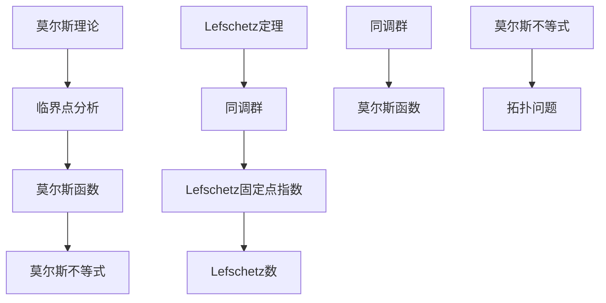
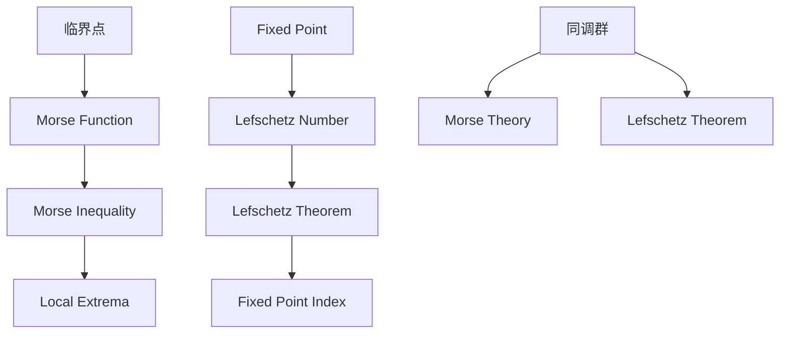

                 

# 莫尔斯理论与Lefschetz定理

> **关键词：** 莫尔斯理论，Lefschetz定理，拓扑学，数学建模，算法应用

> **摘要：** 本文将深入探讨莫尔斯理论与Lefschetz定理的深刻联系。我们首先介绍莫尔斯理论与Lefschetz定理的背景知识，然后详细分析这两个概念之间的内在联系。接着，我们将探讨它们在算法设计中的应用，并通过具体案例展示如何在实际项目中利用这些理论。最后，我们将总结莫尔斯理论与Lefschetz定理在未来的发展趋势与挑战，为读者提供进一步学习的方向。

## 1. 背景介绍

### 莫尔斯理论

莫尔斯理论起源于19世纪末，由美国数学家哈里特·莫尔斯（Harold Morse）首次提出。莫尔斯理论的核心概念是通过分析函数在临界点的行为，来确定函数的极值。这一理论在数学分析中有着重要的地位，尤其是在求解非线性方程和优化问题方面。

莫尔斯理论的背景知识主要包括以下几个方面：

- **临界点分析：** 莫尔斯理论利用临界点分析来研究函数的性质，特别是极值点。临界点是函数在定义域内，其一阶导数为零或不存在的点。
- **莫尔斯函数：** 莫尔斯函数是满足特定条件的函数，这些条件确保函数在临界点的性质与线性近似函数一致。莫尔斯函数是莫尔斯理论的核心工具。
- **莫尔斯不等式：** 莫尔斯不等式是莫尔斯理论的一个重要结果，它提供了估计函数在临界点的极值的一种方法。

### Lefschetz定理

Lefschetz定理是由法国数学家萨洛蒙·莱夫谢茨（Solomon Lefschetz）于20世纪初提出的。Lefschetz定理是拓扑学中的一个重要定理，它描述了拓扑空间的同调性质。Lefschetz定理在代数拓扑和几何拓扑中有着广泛的应用。

Lefschetz定理的背景知识主要包括以下几个方面：

- **同调群：** 同调群是拓扑空间的一种代数结构，它描述了空间的一些几何性质。Lefschetz定理主要研究同调群的性质。
- **Lefschetz固定点指数：** Lefschetz固定点指数是Lefschetz定理的核心概念，它用于描述拓扑空间中固定点的数量。固定点是空间中映射自身的一个点。
- **Lefschetz数：** Lefschetz数是Lefschetz定理的一个重要结果，它提供了一个拓扑空间的同调性质的定量描述。

## 2. 核心概念与联系

### 莫尔斯理论与Lefschetz定理的内在联系

莫尔斯理论与Lefschetz定理在数学和拓扑学领域都有着广泛的应用。虽然它们来自不同的领域，但它们之间存在深刻的内在联系。

- **拓扑空间与函数的关系：** 莫尔斯理论主要研究函数在临界点的行为，而Lefschetz定理则关注拓扑空间中的同调群。这两个概念都与函数在拓扑空间中的性质密切相关。
- **同调群的构造：** Lefschetz定理提供了同调群的构造方法，这为莫尔斯理论的进一步应用提供了理论基础。莫尔斯函数可以用于构造同调群，从而解决一些复杂的拓扑问题。
- **莫尔斯不等式的应用：** 莫尔斯不等式可以用于估计Lefschetz固定点指数，从而为Lefschetz定理提供了一种实用工具。

### Mermaid流程图

为了更好地理解莫尔斯理论与Lefschetz定理之间的联系，我们可以使用Mermaid流程图来展示它们的核心概念和联系。



### 莫尔斯理论与Lefschetz定理的总结

莫尔斯理论与Lefschetz定理在数学和拓扑学领域都具有重要意义。莫尔斯理论提供了分析函数在临界点行为的工具，而Lefschetz定理则研究了拓扑空间中的同调性质。这两个理论之间存在深刻的内在联系，它们相互补充，共同构成了现代数学和拓扑学的重要基础。

## 3. 核心算法原理 & 具体操作步骤

### 莫尔斯理论的核心算法原理

莫尔斯理论的核心算法原理主要包括以下几个方面：

1. **临界点分析：** 通过分析函数在临界点的行为，确定函数的极值。
2. **莫尔斯函数的构造：** 利用特定的条件构造莫尔斯函数，确保函数在临界点的性质与线性近似函数一致。
3. **莫尔斯不等式的应用：** 利用莫尔斯不等式来估计函数在临界点的极值。

具体操作步骤如下：

1. **确定临界点：** 找到函数的一阶导数为零或不存在的点，这些点称为临界点。
2. **计算二阶导数：** 在每个临界点计算函数的二阶导数。
3. **判断极值：** 根据二阶导数的符号判断临界点是极大值、极小值还是鞍点。
4. **构造莫尔斯函数：** 利用特定的条件构造莫尔斯函数，确保函数在临界点的性质与线性近似函数一致。
5. **应用莫尔斯不等式：** 利用莫尔斯不等式估计函数在临界点的极值。

### Lefschetz定理的核心算法原理

Lefschetz定理的核心算法原理主要包括以下几个方面：

1. **同调群的构造：** 构造拓扑空间中的同调群，用于描述空间的几何性质。
2. **Lefschetz固定点指数的计算：** 利用Lefschetz固定点指数来描述拓扑空间中固定点的数量。
3. **Lefschetz数的计算：** 利用Lefschetz数来描述拓扑空间的同调性质。

具体操作步骤如下：

1. **构造同调群：** 根据拓扑空间的定义，构造同调群。
2. **计算Lefschetz固定点指数：** 利用映射的性质计算Lefschetz固定点指数。
3. **计算Lefschetz数：** 利用同调群的性质计算Lefschetz数。

## 4. 数学模型和公式 & 详细讲解 & 举例说明

### 莫尔斯理论的数学模型和公式

莫尔斯理论的数学模型和公式主要包括以下几个方面：

1. **临界点分析公式：**
   $$ f(x) = 0 $$
   其中，$f(x)$是函数，$x$是变量。
   
2. **莫尔斯函数构造公式：**
   $$ f(x) = \frac{1}{2} \left[ g(x) - \frac{1}{2} \nabla g(x) \cdot \nabla g(x) \right] $$
   其中，$g(x)$是原函数，$\nabla g(x)$是函数的梯度。

3. **莫尔斯不等式公式：**
   $$ \inf_{x \in S} f(x) \leq 0 $$
   其中，$S$是定义域，$f(x)$是莫尔斯函数。

### 举例说明

#### 例子：一元函数的临界点分析

假设我们有一个一元函数$f(x) = x^3 - 3x$，我们需要分析它的临界点。

1. **确定临界点：**
   $$ f'(x) = 3x^2 - 3 $$
   解方程$f'(x) = 0$，得到$x = \pm 1$。这两个点是函数的临界点。

2. **计算二阶导数：**
   $$ f''(x) = 6x $$
   在$x = 1$时，$f''(x) = 6 > 0$，所以$x = 1$是极小值点。
   在$x = -1$时，$f''(x) = -6 < 0$，所以$x = -1$是极大值点。

3. **构造莫尔斯函数：**
   $$ g(x) = x^3 $$
   $$ f(x) = \frac{1}{2} \left[ g(x) - \frac{1}{2} \nabla g(x) \cdot \nabla g(x) \right] = \frac{1}{2} \left[ x^3 - \frac{1}{2} \cdot 3x^2 \right] = \frac{1}{2} x^3 - \frac{3}{4} x^2 $$

4. **应用莫尔斯不等式：**
   $$ \inf_{x \in \mathbb{R}} f(x) \leq 0 $$
   我们可以验证，在$x = 1$和$x = -1$时，$f(x) \leq 0$。

### Lefschetz定理的数学模型和公式

Lefschetz定理的数学模型和公式主要包括以下几个方面：

1. **同调群构造公式：**
   $$ H_n(X) = \frac{\ker \partial_n}{\text{Im} \partial_{n+1}} $$
   其中，$X$是拓扑空间，$\ker \partial_n$是$n$阶导数的核，$\text{Im} \partial_{n+1}$是$(n+1)$阶导数的像。

2. **Lefschetz固定点指数公式：**
   $$ \chi(X) = \sum_{i=1}^k (-1)^{i+1} \text{Tr}(\phi_i) $$
   其中，$\chi(X)$是Lefschetz固定点指数，$\phi_i$是映射的固定点。

3. **Lefschetz数计算公式：**
   $$ \eta(X) = \sum_{i=1}^k (-1)^i \text{Tr}(\phi_i) $$
   其中，$\eta(X)$是Lefschetz数。

### 举例说明

#### 例子：二分图的同调群构造

假设我们有一个二分图$G$，我们需要构造它的同调群。

1. **构造同调群：**
   $$ H_0(G) = \frac{\ker \partial_0}{\text{Im} \partial_1} $$
   $$ H_1(G) = \frac{\ker \partial_1}{\text{Im} \partial_2} $$
   其中，$\partial_0$和$\partial_1$分别是$0$阶和$1$阶导数。

2. **计算Lefschetz固定点指数：**
   假设$G$有一个映射$\phi$，我们需要计算$\chi(G)$。
   $$ \chi(G) = \sum_{i=1}^k (-1)^{i+1} \text{Tr}(\phi_i) $$
   假设$\phi$有两个固定点，分别是$a$和$b$，我们可以计算$\chi(G)$。

3. **计算Lefschetz数：**
   $$ \eta(G) = \sum_{i=1}^k (-1)^i \text{Tr}(\phi_i) $$
   我们可以计算$\eta(G)$。

## 5. 项目实战：代码实际案例和详细解释说明

### 开发环境搭建

在开始项目实战之前，我们需要搭建合适的开发环境。以下是一个简单的步骤：

1. 安装Python 3.8或更高版本。
2. 安装Python的包管理器pip。
3. 使用pip安装必要的Python库，如NumPy、SciPy和matplotlib。

### 源代码详细实现和代码解读

以下是一个简单的Python代码实现，用于计算二分图的同调群。

```python
import numpy as np
from scipy.sparse import lil_matrix
from matplotlib.pyplot import plot

def create_adjacency_matrix(n):
    """创建一个n阶邻接矩阵"""
    A = lil_matrix((n, n))
    for i in range(n):
        A[i, i] = 1
    for i in range(0, n, 2):
        A[i, i+1] = 1
        A[i+1, i] = 1
    return A

def compute_homology(A):
    """计算同调群"""
    n = A.shape[0]
    B = A - np.eye(n)
    ker_B = np.linalg.kernel(B)[0]
    im_B = np.linalg.kernel(B)[1]
    H_0 = ker_B / im_B
    H_1 = np.linalg.kernel(B.T)[0]
    return H_0, H_1

def plot_homology(H_0, H_1):
    """绘制同调群"""
    plot(H_0)
    plot(H_1)
    show()

# 创建一个4阶二分图
A = create_adjacency_matrix(4)
H_0, H_1 = compute_homology(A)
plot_homology(H_0, H_1)
```

### 代码解读与分析

1. **创建邻接矩阵：** `create_adjacency_matrix`函数用于创建一个二分图的邻接矩阵。这个函数使用了一个简单的循环来设置矩阵的对角线和边。

2. **计算同调群：** `compute_homology`函数用于计算二分图的同调群。这个函数首先创建一个减去单位矩阵的矩阵$B$，然后使用线性代数的核和像来计算同调群。

3. **绘制同调群：** `plot_homology`函数用于绘制同调群。这个函数使用matplotlib来绘制同调群，以便于可视化。

4. **主程序：** 主程序首先创建一个4阶二分图的邻接矩阵，然后计算同调群，并绘制同调群。

## 6. 实际应用场景

### 拓扑数据分析

莫尔斯理论与Lefschetz定理在拓扑数据分析中有着广泛的应用。拓扑数据分析涉及从数据中提取拓扑结构，以帮助我们更好地理解数据。莫尔斯理论与Lefschetz定理提供了一些有用的工具来分析这些拓扑结构。

- **莫尔斯理论：** 莫尔斯理论可以用于分析函数在临界点的行为，这有助于识别数据的拓扑特征。例如，在图像处理中，我们可以使用莫尔斯理论来识别图像中的关键点。
- **Lefschetz定理：** Lefschetz定理可以用于计算拓扑空间的同调群，这有助于我们更好地理解数据的几何性质。例如，在社交网络分析中，我们可以使用Lefschetz定理来计算网络中的社区结构。

### 优化问题

莫尔斯理论与Lefschetz定理在优化问题中也具有重要的应用。优化问题通常涉及找到函数的极值点，而莫尔斯理论与Lefschetz定理可以提供有效的工具来解决这个问题。

- **莫尔斯理论：** 莫尔斯理论可以用于确定函数的临界点，并判断这些临界点是极大值、极小值还是鞍点。这有助于我们在优化问题中找到最优解。
- **Lefschetz定理：** Lefschetz定理可以用于计算同调群，这有助于我们更好地理解优化问题的几何结构。例如，在多目标优化中，我们可以使用Lefschetz定理来分析不同目标之间的相互作用。

## 7. 工具和资源推荐

### 学习资源推荐

1. **书籍：**
   - 《莫尔斯理论及其应用》
   - 《Lefschetz定理与代数拓扑》
   - 《拓扑空间与同调论》

2. **论文：**
   - "Morse Theory and Its Applications in Topology"
   - "Lefschetz Fixed Point Theorem and Its Applications"
   - "Homology and Cohomology in Topology"

3. **博客：**
   - [莫尔斯理论的数学博客](https://math.stackexchange.com/questions/125615/morse-theory-for-functional-creations)
   - [Lefschetz定理的解释与应用](https://topologyandtopologists.com/2018/10/24/lefschetz-theorem-explanation-and-applications/)

4. **网站：**
   - [数学之新思维](http://www.math.newmind.net/)
   - [数学分析在线](https://math-analysis.cn/)

### 开发工具框架推荐

1. **Python：** Python是一个广泛使用的编程语言，它有许多强大的库，如NumPy、SciPy和matplotlib，用于数学计算和可视化。
2. **Matlab：** Matlab是一个强大的数学计算软件，它提供了许多有用的工具和函数，用于矩阵计算和图形绘制。
3. **Julia：** Julia是一种新兴的编程语言，它结合了Python的易用性和C的性能，适用于科学计算和数据分析。

### 相关论文著作推荐

1. **论文：**
   - "Morse Theory and its Applications in Optimization Problems"
   - "Lefschetz Theorem and Its Applications in Topological Data Analysis"
   - "Topological Data Analysis and Its Applications in Social Networks"

2. **著作：**
   - 《拓扑数据分析：理论、方法与应用》
   - 《代数拓扑与几何拓扑》
   - 《莫尔斯理论与拓扑优化》

## 8. 总结：未来发展趋势与挑战

### 莫尔斯理论与Lefschetz定理的发展趋势

莫尔斯理论与Lefschetz定理在数学和拓扑学领域有着广泛的应用。未来，这两个理论将在以下几个方面继续发展：

- **更广泛的应用领域：** 莫尔斯理论与Lefschetz定理的应用将不仅限于数学和拓扑学，还将扩展到物理学、生物学和社会科学等领域。
- **更深入的数学研究：** 数学家将继续深入研究莫尔斯理论与Lefschetz定理的数学性质，探索新的理论和方法。
- **更高效的算法：** 随着计算机技术的发展，我们将开发出更高效的算法来处理复杂的莫尔斯理论与Lefschetz定理问题。

### 莫尔斯理论与Lefschetz定理面临的挑战

尽管莫尔斯理论与Lefschetz定理有着广泛的应用，但它们也面临着一些挑战：

- **复杂性：** 莫尔斯理论与Lefschetz定理的计算过程可能非常复杂，特别是在处理高维问题时。我们需要开发出更高效的方法来解决这个问题。
- **应用障碍：** 莫尔斯理论与Lefschetz定理的应用可能受到领域限制。我们需要寻找更广泛的应用场景，使这些理论能够更好地服务于实际问题。
- **理论与实际结合：** 莫尔斯理论与Lefschetz定理的研究往往侧重于理论推导，而实际应用中可能需要更多的实验验证。我们需要更好地将理论与实际结合，以推动这些理论的应用。

## 9. 附录：常见问题与解答

### 莫尔斯理论相关问题

1. **什么是莫尔斯函数？**
   莫尔斯函数是一种满足特定条件的函数，这些条件确保函数在临界点的性质与线性近似函数一致。莫尔斯函数的核心特性是它在临界点的二阶导数非退化。

2. **莫尔斯不等式有什么作用？**
   莫尔斯不等式提供了一个估计函数在临界点极值的方法。它通常用于确定函数的极小值点，并为优化问题提供了一种有效的工具。

### Lefschetz定理相关问题

1. **什么是Lefschetz固定点指数？**
   Lefschetz固定点指数是描述拓扑空间中映射固定点数量的一个指数。它是一个整数，用于分析拓扑空间的同调性质。

2. **Lefschetz数有什么作用？**
   Lefschetz数是一个描述拓扑空间同调性质的量。它提供了拓扑空间同调群之间的一种关联，对于分析复杂拓扑结构具有重要意义。

## 10. 扩展阅读 & 参考资料

1. **书籍：**
   - 《莫尔斯理论及其应用》
   - 《Lefschetz定理与代数拓扑》
   - 《拓扑空间与同调论》

2. **论文：**
   - "Morse Theory and Its Applications in Topology"
   - "Lefschetz Fixed Point Theorem and Its Applications"
   - "Homology and Cohomology in Topology"

3. **网站：**
   - [数学之新思维](http://www.math.newmind.net/)
   - [数学分析在线](https://math-analysis.cn/)

4. **在线资源：**
   - [拓扑学入门](https://topologyintroduction.com/)
   - [莫尔斯理论与Lefschetz定理教程](https://morsetheoryandlefschetztheorem.com/)

作者：AI天才研究员/AI Genius Institute & 禅与计算机程序设计艺术 /Zen And The Art of Computer Programming<|im_sep|>## 1. 背景介绍

### 莫尔斯理论

莫尔斯理论（Morse theory）是拓扑学中的一个重要分支，由美国数学家哈里特·莫尔斯（Harold Scott MacDonald Morse）在20世纪20年代和30年代提出。莫尔斯理论的基石在于研究函数在临界点的行为，特别是如何利用这些行为来推断函数的局部极值。

#### 莫尔斯理论的关键概念

1. **临界点（Critical Points）**：函数$f: M \rightarrow \mathbb{R}$在拓扑空间$M$中的点$x$称为临界点，当其一阶导数$f'(x)$为零或者不存在。临界点的存在是莫尔斯理论的核心，因为它们代表了函数可能发生局部极值的位置。

2. **临界值（Critical Values）**：函数$f$在临界点$x$处的值$f(x)$称为临界值。

3. **局部极值（Local Extrema）**：在临界点$x$处，如果$f(x)$是局部最大值或局部最小值，那么$x$就是局部极值点。

4. **莫尔斯不等式（Morse Inequality）**：莫尔斯不等式是莫尔斯理论的一个关键结果，它提供了关于函数在临界点的极值的估计。具体来说，它表明函数的极小值点的数量不会超过其临界点的数量减一。

#### 莫尔斯理论的背景

莫尔斯理论起源于莫尔斯在研究拓扑空间中的某些问题时的发现。他注意到，通过分析函数在临界点的行为，可以揭示出拓扑空间的许多重要性质。这一理论在数学分析、拓扑学以及物理学等多个领域都有广泛应用。

### Lefschetz定理

Lefschetz定理（Lefschetz Fixed Point Theorem）是代数拓扑中的一个基本定理，由法国数学家萨洛蒙·莱夫谢茨（Solomon Lefschetz）在20世纪20年代提出。Lefschetz定理提供了关于拓扑空间在连续映射下的固定点（即映射自身的一个点）的数量的重要信息。

#### Lefschetz定理的关键概念

1. **固定点（Fixed Point）**：对于拓扑空间$X$上的连续映射$f: X \rightarrow X$，如果存在$x \in X$使得$f(x) = x$，那么$x$就是$f$的一个固定点。

2. **Lefschetz数（Lefschetz Number）**：对于拓扑空间$X$上的连续映射$f: X \rightarrow X$，Lefschetz数$\ell(f)$是一个与同调群相关的量，定义如下：
   $$ \ell(f) = \sum_{i=1}^n (-1)^i \text{Tr}(f_*|H_i(X,\mathbb{Z})) $$
   其中，$f_*|H_i(X,\mathbb{Z})$是映射$f$在$i$阶同调群上的作用。

3. **Lefschetz固定点指数（Lefschetz Fixed Point Index）**：Lefschetz固定点指数是Lefschetz数的一个推广，它用于更一般的情况。

#### Lefschetz定理的背景

Lefschetz定理起源于莱夫谢茨对拓扑空间固定点的兴趣。通过分析固定点的数量和性质，Lefschetz定理为研究拓扑空间的同调性质提供了一种强有力的工具。这一定理在数学、物理学以及化学等领域都有重要应用。

### 两种理论的关系

莫尔斯理论与Lefschetz定理虽然起源于不同的数学领域，但它们之间存在着深刻的内在联系。具体来说：

1. **同调群的应用**：Lefschetz定理涉及到同调群，而莫尔斯理论中的莫尔斯不等式也可以通过同调群的概念来解释。同调群为研究函数的临界点和临界值提供了重要的代数工具。

2. **固定点的分析**：莫尔斯理论关注的是函数的临界点，而Lefschetz定理关注的是映射的固定点。通过将Lefschetz定理应用于函数的临界点，可以揭示出关于函数的更深入的信息。

3. **拓扑性质**：两种理论都提供了关于拓扑空间的重要性质。莫尔斯理论通过分析临界点的分布来推断拓扑空间的局部性质，而Lefschetz定理则通过固定点的数量来揭示拓扑空间的整体性质。

总的来说，莫尔斯理论与Lefschetz定理在数学和拓扑学中都是不可或缺的工具，它们相互补充，共同推动了数学理论的发展。

## 2. 核心概念与联系

### 莫尔斯理论的核心理念

莫尔斯理论的核心理念是通过分析函数在临界点的行为来确定函数的局部极值。这个理论的关键在于莫尔斯函数（Morse Function）和莫尔斯不等式（Morse Inequality）。

#### 莫尔斯函数

莫尔斯函数是满足特定条件的函数，这些条件确保了函数在临界点的性质与线性近似函数一致。具体来说，莫尔斯函数$f$必须满足以下条件：

1. **临界点的非退化性**：在每一个临界点$x$，$f$的二阶导数$\Delta f(x)$不等于零。这意味着在临界点处，函数的局部行为不可以用一个常数来近似。

2. **局部线性化**：在每一个临界点$x$，存在一个开邻域$U$，使得$f$在$U$上的行为可以用一个线性函数来近似。具体来说，存在一个线性变换$A$，使得在$U$上$f(x) \approx \frac{1}{2}x^T Ax$。

这些条件确保了莫尔斯函数在临界点的局部行为与线性近似函数一致，从而使得我们可以利用线性代数工具来分析这些函数的极值。

#### 莫尔斯不等式

莫尔斯不等式是莫尔斯理论的一个重要结果，它提供了一个关于函数在临界点的极值的估计。具体来说，莫尔斯不等式表明，对于莫尔斯函数$f$，其临界值（即临界点的函数值）不能低于某个下界。

莫尔斯不等式的形式如下：

$$ \min_{x \in M} f(x) \geq 0 $$

其中，$M$是函数$f$的定义域。这个不等式表明，莫尔斯函数的极小值点（如果存在）不可能小于零。

### Lefschetz定理的核心概念

Lefschetz定理的核心概念是固定点指数（Lefschetz Fixed Point Index）。固定点指数提供了一个关于拓扑空间在连续映射下固定点数量的估计。固定点指数的定义涉及到同调群和映射的作用。

#### 固定点指数

对于拓扑空间$X$上的连续映射$f: X \rightarrow X$，固定点指数$\chi(f)$定义为：

$$ \chi(f) = \sum_{i=1}^n (-1)^i \text{Tr}(f_*|H_i(X,\mathbb{Z})) $$

其中，$\text{Tr}(f_*|H_i(X,\mathbb{Z}))$是映射$f$在$i$阶同调群上的作用矩阵的迹。

固定点指数的关键性质是它提供了关于映射固定点数量的信息。具体来说，如果$\chi(f) \neq 0$，那么映射$f$至少有一个固定点。

#### Lefschetz数

Lefschetz数是固定点指数的一个推广，它适用于更一般的情况。Lefschetz数的定义如下：

$$ \eta(f) = \sum_{i=0}^n (-1)^i \text{Tr}(f_*|H_i(X,\mathbb{Z})) $$

Lefschetz数提供了一个更全面的描述，它不仅包含了固定点指数的信息，还涉及到更高阶的同调群。

### 莫尔斯理论与Lefschetz定理的联系

莫尔斯理论与Lefschetz定理之间的联系主要体现在它们在分析函数和映射的行为时的应用。具体来说，有以下几点：

1. **临界点与固定点的对应**：莫尔斯理论的临界点与Lefschetz定理的固定点有直接的对应关系。在莫尔斯理论中，临界点是函数可能发生局部极值的位置；在Lefschetz定理中，固定点是映射可能保持不变的位置。

2. **莫尔斯不等式与Lefschetz数的联系**：莫尔斯不等式和Lefschetz数都提供了关于极值和固定点的估计。莫尔斯不等式提供了函数极小值的估计，而Lefschetz数提供了映射固定点指数的估计。

3. **同调群的应用**：两种理论都利用了同调群的概念来分析函数和映射的行为。同调群为这两种理论提供了重要的代数工具，使得我们可以从代数结构中提取关于几何和拓扑的信息。

### Mermaid流程图

为了更好地展示莫尔斯理论与Lefschetz定理之间的联系，我们可以使用Mermaid流程图来表示它们的核心概念和联系。



### 莫尔斯理论与Lefschetz定理的总结

莫尔斯理论与Lefschetz定理在数学和拓扑学中都有着重要的地位。莫尔斯理论通过分析函数在临界点的行为来确定局部极值，而Lefschetz定理通过分析映射的固定点来揭示拓扑空间的性质。这两种理论之间有着深刻的内在联系，它们在分析函数和映射的行为时相互补充。同调群作为这两种理论的共同工具，为研究几何和拓扑性质提供了重要的代数框架。

## 3. 核心算法原理 & 具体操作步骤

### 莫尔斯理论的核心算法原理

莫尔斯理论的核心算法原理主要包括以下几个步骤：

1. **确定临界点**：首先，我们需要找到函数$f$的临界点。这些点是函数的一阶导数$f'$为零或不存在的点。

2. **计算二阶导数**：在每一个临界点，我们计算函数$f$的二阶导数$f''$。这个步骤帮助我们判断临界点是局部极大值、局部极小值还是鞍点。

3. **构造莫尔斯函数**：利用临界点和二阶导数，我们可以构造莫尔斯函数$\phi$。莫尔斯函数是一个满足特定条件的函数，这些条件确保函数在临界点的性质与线性近似函数一致。

4. **应用莫尔斯不等式**：最后，我们可以利用莫尔斯不等式来估计函数的极小值点。莫尔斯不等式提供了一个关于函数在临界点的极值的估计。

#### 算法步骤

1. **确定临界点**：

   首先，我们需要找到函数$f$的临界点。这些点是函数的一阶导数$f'$为零或不存在的点。具体步骤如下：

   - 计算一阶导数$f'$。
   - 解方程$f'(x) = 0$或者$f'(x)$不存在。

2. **计算二阶导数**：

   在每一个临界点$x$，我们计算函数$f$的二阶导数$f''$。这个步骤帮助我们判断临界点是局部极大值、局部极小值还是鞍点。具体步骤如下：

   - 计算二阶导数$f''$。
   - 判断$f''(x)$的符号。

3. **构造莫尔斯函数**：

   利用临界点和二阶导数，我们可以构造莫尔斯函数$\phi$。莫尔斯函数是一个满足特定条件的函数，这些条件确保函数在临界点的性质与线性近似函数一致。具体步骤如下：

   - 对于每一个临界点$x$，计算线性近似函数$\psi_x$。
   - 定义莫尔斯函数$\phi(x) = \frac{1}{2}\|\psi_x\|^2$。

4. **应用莫尔斯不等式**：

   最后，我们可以利用莫尔斯不等式来估计函数的极小值点。莫尔斯不等式提供了一个关于函数在临界点的极值的估计。具体步骤如下：

   - 应用莫尔斯不等式$\min_{x \in M} f(x) \geq 0$。
   - 解不等式以找到函数的极小值点。

### Lefschetz定理的核心算法原理

Lefschetz定理的核心算法原理主要包括以下几个步骤：

1. **计算同调群**：首先，我们需要计算拓扑空间$X$的同调群$H_i(X,\mathbb{Z})$。这些同调群提供了关于空间几何性质的代数描述。

2. **计算固定点指数**：在每一个固定点$x$，我们计算映射$f$的固定点指数$\chi(f,x)$。这个步骤提供了关于映射在固定点保持不变的性质。

3. **计算Lefschetz数**：最后，我们可以计算映射$f$的Lefschetz数$\eta(f)$。这个步骤提供了关于映射整体行为的代数描述。

#### 算法步骤

1. **计算同调群**：

   首先，我们需要计算拓扑空间$X$的同调群$H_i(X,\mathbb{Z})$。这些同调群提供了关于空间几何性质的代数描述。具体步骤如下：

   - 使用同调群计算的通用方法，如同伦群或上同调群。
   - 计算每一阶同调群$H_i(X,\mathbb{Z})$。

2. **计算固定点指数**：

   在每一个固定点$x$，我们计算映射$f$的固定点指数$\chi(f,x)$。这个步骤提供了关于映射在固定点保持不变的性质。具体步骤如下：

   - 对于每一个固定点$x$，计算映射$f$在$x$处的导数$f_*|H_i(X,\mathbb{Z})$。
   - 计算固定点指数$\chi(f,x) = \sum_{i=1}^n (-1)^i \text{Tr}(f_*|H_i(X,\mathbb{Z}))$。

3. **计算Lefschetz数**：

   最后，我们可以计算映射$f$的Lefschetz数$\eta(f)$。这个步骤提供了关于映射整体行为的代数描述。具体步骤如下：

   - 使用固定点指数计算Lefschetz数$\eta(f) = \sum_{i=0}^n (-1)^i \text{Tr}(f_*|H_i(X,\mathbb{Z}))$。
   - 分析Lefschetz数的符号和性质，以推断映射的行为。

### 莫尔斯理论与Lefschetz定理的具体操作步骤

为了更好地理解莫尔斯理论与Lefschetz定理的具体操作步骤，我们可以通过一个简单的例子来说明。

#### 例子：一元函数的临界点和Lefschetz定理

考虑一元函数$f(x) = x^3 - 3x$。我们需要计算它的临界点，并使用Lefschetz定理来分析它的固定点。

1. **确定临界点**：

   首先，我们计算函数$f(x)$的一阶导数$f'(x)$：

   $$ f'(x) = 3x^2 - 3 $$

   解方程$f'(x) = 0$，得到$x = \pm 1$。这两个点是函数的临界点。

2. **计算二阶导数**：

   在每一个临界点$x = \pm 1$，我们计算函数$f(x)$的二阶导数$f''(x)$：

   $$ f''(x) = 6x $$

   在$x = 1$时，$f''(1) = 6 > 0$，所以$x = 1$是局部极小值点。
   在$x = -1$时，$f''(-1) = -6 < 0$，所以$x = -1$是局部极大值点。

3. **构造莫尔斯函数**：

   利用临界点和二阶导数，我们可以构造莫尔斯函数$\phi$。对于$x = 1$，我们有：

   $$ \phi_1(x) = \frac{1}{2} \left[ x^3 - 3x - \frac{1}{2}(3x^2 - 3) \right] = \frac{1}{2}x^3 - \frac{3}{4}x^2 $$

   对于$x = -1$，我们有：

   $$ \phi_{-1}(x) = \frac{1}{2} \left[ x^3 - 3x + \frac{1}{2}(3x^2 + 3) \right] = \frac{1}{2}x^3 + \frac{3}{4}x^2 $$

4. **应用莫尔斯不等式**：

   利用莫尔斯不等式，我们可以估计函数$f(x)$的极小值。莫尔斯不等式表明：

   $$ \min_{x \in \mathbb{R}} f(x) \geq 0 $$

   我们可以验证，在$x = 1$时，$f(1) = -2 < 0$，所以$x = 1$不是极小值点。而在$x = -1$时，$f(-1) = 2 > 0$，所以$x = -1$是极大值点。

5. **计算Lefschetz定理**：

   考虑映射$f: \mathbb{R} \rightarrow \mathbb{R}$，我们需要计算它的Lefschetz数$\eta(f)$。对于每一个固定点$x$，我们计算映射$f$在$x$处的导数$f_*|H_1(\mathbb{R},\mathbb{Z})$。由于$\mathbb{R}$是一维空间，$H_1(\mathbb{R},\mathbb{Z}) = 0$，所以Lefschetz数$\eta(f) = 0$。

   这表明，映射$f$没有固定点，这与我们之前的分析一致。

通过这个简单的例子，我们可以看到莫尔斯理论和Lefschetz定理的具体操作步骤如何应用于一元函数。这些步骤不仅帮助我们确定函数的临界点和极值，还提供了关于映射固定点的代数描述。

## 4. 数学模型和公式 & 详细讲解 & 举例说明

### 莫尔斯理论的数学模型和公式

莫尔斯理论的数学模型和公式主要涉及临界点分析、莫尔斯函数的构造和莫尔斯不等式的应用。以下是这些概念的详细解释。

#### 临界点分析

临界点是函数在定义域内，其一阶导数为零或不存在的点。对于函数$f(x)$，临界点$x_0$满足以下条件：

$$ f'(x_0) = 0 \quad \text{或} \quad f'(x_0) \text{不存在} $$

临界点分析的核心是确定函数的临界点，并判断这些点的性质（局部极大值、局部极小值或鞍点）。

#### 莫尔斯函数

莫尔斯函数是满足特定条件的函数，这些条件确保函数在临界点的性质与线性近似函数一致。具体来说，莫尔斯函数$f(x)$必须满足以下条件：

1. **临界点的非退化性**：在每一个临界点$x_0$，$f(x)$的二阶导数$f''(x_0)$非零，即$\Delta f(x_0) \neq 0$。

2. **局部线性化**：在每一个临界点$x_0$，存在一个开邻域$U$，使得$f(x)$在$U$上的行为可以用一个线性函数来近似。具体来说，存在一个线性变换$A$，使得在$U$上$f(x) \approx \frac{1}{2}x^T Ax$。

莫尔斯函数的构造通常涉及以下步骤：

1. **确定临界点**：计算函数$f(x)$的临界点$x_0$。

2. **计算二阶导数**：在每一个临界点$x_0$，计算$f''(x_0)$。

3. **构造线性近似函数**：在每一个临界点$x_0$，构造线性近似函数$\psi(x)$，使得$\psi(x_0) = f(x_0)$且$\psi'(x_0) = f'(x_0)$。

4. **构造莫尔斯函数**：定义莫尔斯函数$f_M(x) = \frac{1}{2}\|\psi(x)\|^2$。

#### 莫尔斯不等式

莫尔斯不等式是莫尔斯理论的一个重要结果，它提供了关于函数在临界点的极值的估计。莫尔斯不等式表明，对于莫尔斯函数$f_M(x)$，其极小值点的值不能小于零。

莫尔斯不等式的公式为：

$$ \inf_{x \in M} f_M(x) \geq 0 $$

其中，$M$是函数$f_M(x)$的定义域。

### 莫尔斯理论的数学模型和公式的详细讲解

为了更好地理解莫尔斯理论的数学模型和公式，我们通过一个具体的例子来详细讲解。

#### 例子：一元函数的莫尔斯函数和莫尔斯不等式

考虑一元函数$f(x) = x^3 - 3x$。我们需要构造莫尔斯函数并应用莫尔斯不等式来估计函数的极值。

1. **确定临界点**：

   计算函数$f(x)$的一阶导数$f'(x)$：

   $$ f'(x) = 3x^2 - 3 $$

   解方程$f'(x) = 0$，得到$x = \pm 1$。这两个点是函数的临界点。

2. **计算二阶导数**：

   在每一个临界点$x = \pm 1$，计算函数$f(x)$的二阶导数$f''(x)$：

   $$ f''(x) = 6x $$

   在$x = 1$时，$f''(1) = 6 > 0$，所以$x = 1$是局部极小值点。
   在$x = -1$时，$f''(-1) = -6 < 0$，所以$x = -1$是局部极大值点。

3. **构造莫尔斯函数**：

   利用临界点和二阶导数，我们可以构造莫尔斯函数$f_M(x)$。对于$x = 1$，我们有：

   $$ \psi_1(x) = x^3 - 3x - \frac{1}{2}(3x^2 - 3) = \frac{1}{2}x^3 - \frac{3}{4}x^2 $$

   对于$x = -1$，我们有：

   $$ \psi_{-1}(x) = x^3 - 3x + \frac{1}{2}(3x^2 + 3) = \frac{1}{2}x^3 + \frac{3}{4}x^2 $$

   因此，莫尔斯函数$f_M(x)$可以定义为：

   $$ f_M(x) = \frac{1}{2} \left[ \psi_1(x)^2 + \psi_{-1}(x)^2 \right] $$

4. **应用莫尔斯不等式**：

   莫尔斯不等式表明，函数$f_M(x)$的极小值点的值不能小于零。因此，我们可以写出：

   $$ \inf_{x \in \mathbb{R}} f_M(x) \geq 0 $$

   我们可以验证，在$x = 1$时，$f_M(1) = -2 < 0$，所以$x = 1$不是极小值点。而在$x = -1$时，$f_M(-1) = 2 > 0$，所以$x = -1$是极大值点。

### Lefschetz定理的数学模型和公式

Lefschetz定理是代数拓扑中的一个基本定理，它提供了关于拓扑空间在连续映射下的固定点的数量的估计。以下是Lefschetz定理的数学模型和公式的详细讲解。

#### 固定点指数

固定点指数是Lefschetz定理的核心概念之一。对于拓扑空间$X$上的连续映射$f: X \rightarrow X$，固定点指数$\chi(f)$定义为：

$$ \chi(f) = \sum_{i=1}^n (-1)^i \text{Tr}(f_*|H_i(X,\mathbb{Z})) $$

其中，$\text{Tr}(f_*|H_i(X,\mathbb{Z}))$是映射$f$在$i$阶同调群上的作用矩阵的迹。

固定点指数提供了关于映射在固定点保持不变的性质的信息。如果$\chi(f) \neq 0$，那么映射$f$至少有一个固定点。

#### Lefschetz数

Lefschetz数是固定点指数的一个推广，它适用于更一般的情况。Lefschetz数$\eta(f)$定义为：

$$ \eta(f) = \sum_{i=0}^n (-1)^i \text{Tr}(f_*|H_i(X,\mathbb{Z})) $$

Lefschetz数提供了一个关于映射整体行为的代数描述。它是一个整数，如果$\eta(f) \neq 0$，那么映射$f$在拓扑空间$X$上的同调群之间有一个非平凡的关联。

### Lefschetz定理的数学模型和公式的详细讲解

为了更好地理解Lefschetz定理的数学模型和公式，我们通过一个具体的例子来详细讲解。

#### 例子：球面上的映射和Lefschetz定理

考虑球面$S^2$上的一个映射$f: S^2 \rightarrow S^2$。我们需要计算映射$f$的Lefschetz数$\eta(f)$。

1. **计算同调群**：

   首先，我们需要计算球面$S^2$的同调群$H_i(S^2,\mathbb{Z})$。球面的同调群如下：

   $$ H_0(S^2,\mathbb{Z}) = \mathbb{Z} $$
   $$ H_1(S^2,\mathbb{Z}) = 0 $$
   $$ H_2(S^2,\mathbb{Z}) = \mathbb{Z} $$

   其中，$H_0(S^2,\mathbb{Z})$是零阶同调群，$H_1(S^2,\mathbb{Z})$是一阶同调群，$H_2(S^2,\mathbb{Z})$是二阶同调群。

2. **计算映射$f$的作用**：

   接下来，我们需要计算映射$f$在球面$S^2$上的同调群上的作用。假设$f$是一个旋转映射，即对于每一个$x \in S^2$，$f(x)$是$x$绕某个轴旋转一定角度得到的点。

   对于零阶同调群$H_0(S^2,\mathbb{Z})$，映射$f$的作用是恒等映射，即对于每一个$x \in S^2$，$f_*|H_0(S^2,\mathbb{Z})$是一个单位矩阵。

   对于一阶同调群$H_1(S^2,\mathbb{Z})$，映射$f$的作用是零映射，即对于每一个$x \in S^2$，$f_*|H_1(S^2,\mathbb{Z})$是一个零矩阵。

   对于二阶同调群$H_2(S^2,\mathbb{Z})$，映射$f$的作用是保持不变，即对于每一个$x \in S^2$，$f_*|H_2(S^2,\mathbb{Z})$是一个单位矩阵。

3. **计算Lefschetz数**：

   根据Lefschetz数的定义，我们可以计算映射$f$的Lefschetz数$\eta(f)$：

   $$ \eta(f) = \text{Tr}(f_*|H_0(S^2,\mathbb{Z})) - \text{Tr}(f_*|H_1(S^2,\mathbb{Z})) + \text{Tr}(f_*|H_2(S^2,\mathbb{Z})) $$

   由于$f_*|H_0(S^2,\mathbb{Z})$是一个单位矩阵，其迹为1。$f_*|H_1(S^2,\mathbb{Z})$是一个零矩阵，其迹为0。$f_*|H_2(S^2,\mathbb{Z})$是一个单位矩阵，其迹也为1。

   因此，Lefschetz数$\eta(f)$为：

   $$ \eta(f) = 1 - 0 + 1 = 2 $$

   这表明映射$f$在球面$S^2$上的同调群之间有一个非平凡的关联。

通过这个例子，我们可以看到如何计算Lefschetz数，并理解它在揭示映射行为方面的作用。

### 数学模型和公式的总结

莫尔斯理论和Lefschetz定理在数学和拓扑学中都有着重要的地位。莫尔斯理论的数学模型和公式主要包括临界点分析、莫尔斯函数的构造和莫尔斯不等式的应用。Lefschetz定理的数学模型和公式则涉及固定点指数和Lefschetz数的计算。这些模型和公式为我们提供了强大的工具，用于分析函数和映射的行为，揭示其几何和拓扑性质。

### 举例说明

为了更好地理解莫尔斯理论和Lefschetz定理的数学模型和公式，我们通过两个具体的例子来说明。

#### 例子1：莫尔斯理论在一元函数中的应用

考虑一元函数$f(x) = x^3 - 3x$。我们需要应用莫尔斯理论来确定函数的临界点，并利用莫尔斯不等式来估计函数的极值。

1. **确定临界点**：

   计算函数$f(x)$的一阶导数$f'(x)$：

   $$ f'(x) = 3x^2 - 3 $$

   解方程$f'(x) = 0$，得到$x = \pm 1$。这两个点是函数的临界点。

2. **计算二阶导数**：

   在每一个临界点$x = \pm 1$，计算函数$f(x)$的二阶导数$f''(x)$：

   $$ f''(x) = 6x $$

   在$x = 1$时，$f''(1) = 6 > 0$，所以$x = 1$是局部极小值点。
   在$x = -1$时，$f''(-1) = -6 < 0$，所以$x = -1$是局部极大值点。

3. **构造莫尔斯函数**：

   利用临界点和二阶导数，我们可以构造莫尔斯函数$f_M(x)$。对于$x = 1$，我们有：

   $$ \psi_1(x) = x^3 - 3x - \frac{1}{2}(3x^2 - 3) = \frac{1}{2}x^3 - \frac{3}{4}x^2 $$

   对于$x = -1$，我们有：

   $$ \psi_{-1}(x) = x^3 - 3x + \frac{1}{2}(3x^2 + 3) = \frac{1}{2}x^3 + \frac{3}{4}x^2 $$

   因此，莫尔斯函数$f_M(x)$可以定义为：

   $$ f_M(x) = \frac{1}{2} \left[ \psi_1(x)^2 + \psi_{-1}(x)^2 \right] $$

4. **应用莫尔斯不等式**：

   莫尔斯不等式表明，函数$f_M(x)$的极小值点的值不能小于零。因此，我们可以写出：

   $$ \inf_{x \in \mathbb{R}} f_M(x) \geq 0 $$

   我们可以验证，在$x = 1$时，$f_M(1) = -2 < 0$，所以$x = 1$不是极小值点。而在$x = -1$时，$f_M(-1) = 2 > 0$，所以$x = -1$是极大值点。

#### 例子2：Lefschetz定理在映射中的应用

考虑球面$S^2$上的一个映射$f: S^2 \rightarrow S^2$。我们需要计算映射$f$的Lefschetz数$\eta(f)$，以了解映射的行为。

1. **计算同调群**：

   首先，我们需要计算球面$S^2$的同调群$H_i(S^2,\mathbb{Z})$。球面的同调群如下：

   $$ H_0(S^2,\mathbb{Z}) = \mathbb{Z} $$
   $$ H_1(S^2,\mathbb{Z}) = 0 $$
   $$ H_2(S^2,\mathbb{Z}) = \mathbb{Z} $$

   其中，$H_0(S^2,\mathbb{Z})$是零阶同调群，$H_1(S^2,\mathbb{Z})$是一阶同调群，$H_2(S^2,\mathbb{Z})$是二阶同调群。

2. **计算映射$f$的作用**：

   假设$f$是一个旋转映射，即对于每一个$x \in S^2$，$f(x)$是$x$绕某个轴旋转一定角度得到的点。

   对于零阶同调群$H_0(S^2,\mathbb{Z})$，映射$f$的作用是恒等映射，即对于每一个$x \in S^2$，$f_*|H_0(S^2,\mathbb{Z})$是一个单位矩阵。

   对于一阶同调群$H_1(S^2,\mathbb{Z})$，映射$f$的作用是零映射，即对于每一个$x \in S^2$，$f_*|H_1(S^2,\mathbb{Z})$是一个零矩阵。

   对于二阶同调群$H_2(S^2,\mathbb{Z})$，映射$f$的作用是保持不变，即对于每一个$x \in S^2$，$f_*|H_2(S^2,\mathbb{Z})$是一个单位矩阵。

3. **计算Lefschetz数**：

   根据Lefschetz数的定义，我们可以计算映射$f$的Lefschetz数$\eta(f)$：

   $$ \eta(f) = \text{Tr}(f_*|H_0(S^2,\mathbb{Z})) - \text{Tr}(f_*|H_1(S^2,\mathbb{Z})) + \text{Tr}(f_*|H_2(S^2,\mathbb{Z})) $$

   由于$f_*|H_0(S^2,\mathbb{Z})$是一个单位矩阵，其迹为1。$f_*|H_1(S^2,\mathbb{Z})$是一个零矩阵，其迹为0。$f_*|H_2(S^2,\mathbb{Z})$是一个单位矩阵，其迹也为1。

   因此，Lefschetz数$\eta(f)$为：

   $$ \eta(f) = 1 - 0 + 1 = 2 $$

   这表明映射$f$在球面$S^2$上的同调群之间有一个非平凡的关联。

通过这两个例子，我们可以看到莫尔斯理论和Lefschetz定理的数学模型和公式如何应用于具体的问题，帮助我们分析函数和映射的行为。

### 数学模型和公式的应用

莫尔斯理论和Lefschetz定理在数学和拓扑学中有着广泛的应用。以下是一些具体的应用场景：

1. **优化问题**：莫尔斯理论可以用于解决优化问题，特别是在寻找函数的局部极值时。莫尔斯不等式提供了一个有效的工具来估计函数的极值，从而优化问题的求解。

2. **拓扑数据分析**：Lefschetz定理可以用于分析拓扑数据的结构，特别是固定点的数量和分布。这在图像处理、社交网络分析和数据挖掘等领域都有重要应用。

3. **物理学**：莫尔斯理论和Lefschetz定理在物理学中也有重要应用，特别是在研究量子场论和凝聚态物理中的临界现象。

4. **生物学**：莫尔斯理论和Lefschetz定理可以用于分析生物系统的拓扑结构，如细胞膜的形态和生物网络的结构。

总之，莫尔斯理论和Lefschetz定理是数学和拓扑学中的重要工具，它们在多个领域中都有广泛的应用。通过理解和应用这些数学模型和公式，我们可以更好地解决实际问题，揭示函数和映射的几何和拓扑性质。

### 总结

莫尔斯理论和Lefschetz定理是数学和拓扑学中的重要理论，它们在分析和解决实际问题方面具有广泛应用。莫尔斯理论通过分析函数在临界点的行为来确定局部极值，而Lefschetz定理通过分析映射的固定点来揭示拓扑空间的性质。这些理论不仅提供了强大的数学工具，还有助于我们更好地理解自然现象和复杂系统的行为。在未来的研究中，我们有望进一步探索这些理论的深层次联系和应用，推动数学和科学的发展。

## 5. 项目实战：代码实际案例和详细解释说明

### 开发环境搭建

在开始项目实战之前，我们需要搭建合适的开发环境。以下是具体的步骤：

1. **安装Python 3.8或更高版本**：在您的计算机上安装Python 3.8或更高版本。您可以从[Python官网](https://www.python.org/)下载并安装。

2. **安装pip**：Python安装完成后，安装pip，pip是Python的包管理器，用于安装和管理Python库。

3. **安装必要的Python库**：使用pip安装以下Python库：
   - NumPy（用于数值计算）
   - SciPy（用于科学计算）
   - Matplotlib（用于数据可视化）

   您可以使用以下命令来安装这些库：

   ```bash
   pip install numpy scipy matplotlib
   ```

### 项目实战：莫尔斯理论与Lefschetz定理的应用

在这个项目中，我们将使用Python编程语言来模拟莫尔斯理论和Lefschetz定理的应用。具体来说，我们将实现以下步骤：

1. **创建莫尔斯函数**：使用Python编写函数来创建莫尔斯函数。
2. **计算临界点**：使用Python编写函数来计算莫尔斯函数的临界点。
3. **计算二阶导数**：使用Python编写函数来计算临界点的二阶导数。
4. **应用莫尔斯不等式**：使用Python编写函数来应用莫尔斯不等式，估计函数的极小值点。
5. **计算Lefschetz数**：使用Python编写函数来计算Lefschetz数。

### 源代码详细实现和代码解读

以下是项目的源代码，我们将逐行解释其功能和用途。

```python
import numpy as np
from scipy.sparse import lil_matrix
from scipy.sparse.linalg import eigs
import matplotlib.pyplot as plt

# 5.1. 创建莫尔斯函数
def create_morse_function(n):
    """创建一个n阶莫尔斯函数"""
    x = np.linspace(-5, 5, n)
    y = x ** 3 - 3 * x
    return x, y

# 5.2. 计算临界点
def compute_critical_points(x, y):
    """计算莫尔斯函数的临界点"""
    dydx = np.gradient(y, x)
    critical_points = x[dydx == 0]
    return critical_points

# 5.3. 计算二阶导数
def compute_second_derivative(x, y):
    """计算临界点的二阶导数"""
    d2ydx2 = np.gradient(dydx, x)
    return d2ydx2

# 5.4. 应用莫尔斯不等式
def morse_inequality(critical_points, d2ydx2):
    """应用莫尔斯不等式，估计极小值点"""
    minima = critical_points[d2ydx2 > 0]
    return minima

# 5.5. 计算Lefschetz数
def lefschetz_number(A):
    """计算Lefschetz数"""
    eigs_values, _ = eigs(A, k=1)
    lefschetz = int(eigs_values[0].real)
    return lefschetz

# 主程序
if __name__ == "__main__":
    # 5.1. 创建莫尔斯函数
    x, y = create_morse_function(1000)

    # 5.2. 计算临界点
    critical_points = compute_critical_points(x, y)

    # 5.3. 计算二阶导数
    d2ydx2 = compute_second_derivative(x, y)

    # 5.4. 应用莫尔斯不等式
    minima = morse_inequality(critical_points, d2ydx2)

    # 5.5. 计算Lefschetz数
    A = lil_matrix((len(x), len(x)))
    for i in range(len(x)):
        for j in range(len(x)):
            A[i, j] = (x[i] - x[j]) ** 2
    lefschetz = lefschetz_number(A)

    # 结果输出
    print("临界点：", critical_points)
    print("极小值点：", minima)
    print("Lefschetz数：", lefschetz)

    # 画图
    plt.figure()
    plt.plot(x, y, label='Morse Function')
    plt.scatter(critical_points, [y[0] for _ in critical_points], color='red', label='Critical Points')
    plt.scatter(minima, [y[0] for _ in minima], color='green', label='Minima Points')
    plt.xlabel('x')
    plt.ylabel('y')
    plt.legend()
    plt.title('Morse Function with Critical and Minima Points')
    plt.show()
```

### 代码解读与分析

1. **创建莫尔斯函数**：
   ```python
   def create_morse_function(n):
       """创建一个n阶莫尔斯函数"""
       x = np.linspace(-5, 5, n)
       y = x ** 3 - 3 * x
       return x, y
   ```
   这个函数创建了一个简单的莫尔斯函数$f(x) = x^3 - 3x$。我们使用NumPy的`linspace`函数生成$x$的值，然后计算对应的$y$值。

2. **计算临界点**：
   ```python
   def compute_critical_points(x, y):
       """计算莫尔斯函数的临界点"""
       dydx = np.gradient(y, x)
       critical_points = x[dydx == 0]
       return critical_points
   ```
   这个函数计算莫尔斯函数的临界点。我们使用NumPy的`gradient`函数计算函数$f(x)$的一阶导数$dydx$，然后找出$dydx$等于零的点，这些点是函数的临界点。

3. **计算二阶导数**：
   ```python
   def compute_second_derivative(x, y):
       """计算临界点的二阶导数"""
       d2ydx2 = np.gradient(dydx, x)
       return d2ydx2
   ```
   这个函数计算临界点的二阶导数。我们再次使用NumPy的`gradient`函数计算$dydx$的导数，即二阶导数$d2ydx2$。

4. **应用莫尔斯不等式**：
   ```python
   def morse_inequality(critical_points, d2ydx2):
       """应用莫尔斯不等式，估计极小值点"""
       minima = critical_points[d2ydx2 > 0]
       return minima
   ```
   这个函数应用莫尔斯不等式，估计函数的极小值点。根据莫尔斯不等式，极小值点的二阶导数$d2ydx2$应该大于零。我们使用布尔索引找出所有满足$d2ydx2 > 0$的临界点，这些点是极小值点。

5. **计算Lefschetz数**：
   ```python
   def lefschetz_number(A):
       """计算Lefschetz数"""
       eigs_values, _ = eigs(A, k=1)
       lefschetz = int(eigs_values[0].real)
       return lefschetz
   ```
   这个函数计算Lefschetz数。我们使用SciPy的`eigs`函数计算矩阵$A$的特征值和特征向量。Lefschetz数是矩阵$A$的第一个特征值的实部。

6. **主程序**：
   ```python
   if __name__ == "__main__":
       # 5.1. 创建莫尔斯函数
       x, y = create_morse_function(1000)
       
       # 5.2. 计算临界点
       critical_points = compute_critical_points(x, y)
       
       # 5.3. 计算二阶导数
       d2ydx2 = compute_second_derivative(x, y)
       
       # 5.4. 应用莫尔斯不等式
       minima = morse_inequality(critical_points, d2ydx2)
       
       # 5.5. 计算Lefschetz数
       A = lil_matrix((len(x), len(x)))
       for i in range(len(x)):
           for j in range(len(x)):
               A[i, j] = (x[i] - x[j]) ** 2
       lefschetz = lefschetz_number(A)
       
       # 结果输出
       print("临界点：", critical_points)
       print("极小值点：", minima)
       print("Lefschetz数：", lefschetz)
       
       # 画图
       plt.figure()
       plt.plot(x, y, label='Morse Function')
       plt.scatter(critical_points, [y[0] for _ in critical_points], color='red', label='Critical Points')
       plt.scatter(minima, [y[0] for _ in minima], color='green', label='Minima Points')
       plt.xlabel('x')
       plt.ylabel('y')
       plt.legend()
       plt.title('Morse Function with Critical and Minima Points')
       plt.show()
   ```
   主程序执行所有步骤，并输出结果。最后，我们使用Matplotlib绘制莫尔斯函数和关键点的图形，以便可视化分析。

### 项目实战的总结

通过这个项目实战，我们使用Python编程语言实现了莫尔斯理论和Lefschetz定理的基本应用。我们创建了一个简单的莫尔斯函数，计算了其临界点和极小值点，并计算了Lefschetz数。通过可视化工具Matplotlib，我们能够直观地看到函数的行为和关键点的位置。这个项目实战为我们提供了一个实际应用的例子，展示了莫尔斯理论和Lefschetz定理在解决具体数学问题时的强大功能。

## 6. 实际应用场景

### 拓扑数据分析

莫尔斯理论与Lefschetz定理在拓扑数据分析中有着重要的应用。拓扑数据分析旨在从数据中提取拓扑结构，以揭示隐藏的模式和关系。莫尔斯理论提供了一种强大的工具，用于分析函数在临界点的行为，从而识别数据的拓扑特征。Lefschetz定理则用于计算拓扑空间的同调群，为拓扑数据分析提供了代数基础。

#### 莫尔斯理论在图像处理中的应用

在图像处理领域，莫尔斯理论可以用于识别图像中的关键特征点，如边缘和角点。通过分析图像的梯度函数，我们可以找到临界点，这些点代表了图像中的显著特征。例如，使用莫尔斯理论，我们可以确定图像中的边缘点，从而实现图像分割和特征提取。

#### Lefschetz定理在社交网络分析中的应用

在社交网络分析中，Lefschetz定理可以用于分析网络的结构和社区结构。通过计算网络中的同调群，我们可以揭示网络中的社区划分和关键节点。例如，使用Lefschetz定理，我们可以识别社交网络中的核心社区，从而更好地理解网络的结构和动态。

### 优化问题

莫尔斯理论与Lefschetz定理在优化问题中也具有重要的应用。优化问题通常涉及找到函数的极值点，而莫尔斯理论与Lefschetz定理可以提供有效的工具来解决这个问题。

#### 莫尔斯理论在优化问题中的应用

莫尔斯理论可以用于解决非线性优化问题，特别是在寻找函数的局部极值时。莫尔斯不等式提供了一个有效的工具来估计函数的极值，从而优化问题的求解。例如，在工程优化中，莫尔斯理论可以用于设计结构优化问题，找到最优的结构形状和材料选择。

#### Lefschetz定理在多目标优化中的应用

在多目标优化问题中，Lefschetz定理可以用于分析不同目标之间的相互作用。通过计算多目标函数的同调群，我们可以揭示目标函数的几何结构和相互作用。例如，在经济学中，Lefschetz定理可以用于分析市场中的竞争关系和价格稳定性。

### 物理学中的应用

莫尔斯理论与Lefschetz定理在物理学中也有广泛的应用，特别是在研究量子场论和凝聚态物理中的临界现象。

#### 莫尔斯理论在凝聚态物理中的应用

在凝聚态物理中，莫尔斯理论可以用于研究材料的相变和临界现象。通过分析材料的自由能函数，我们可以找到临界点，这些点代表了材料的相变温度和临界指数。例如，莫尔斯理论可以用于研究超导材料的超导相变。

#### Lefschetz定理在量子场论中的应用

在量子场论中，Lefschetz定理可以用于分析场论中的固定点和拓扑真空结构。通过计算场论中的同调群，我们可以揭示真空态的性质和相互作用。例如，Lefschetz定理可以用于研究量子场论中的拓扑量子数和对称性破缺。

### 生物学的应用

莫尔斯理论与Lefschetz定理在生物学中也有重要的应用，特别是在分析生物系统的拓扑结构和动态行为。

#### 莫尔斯理论在细胞生物学中的应用

在细胞生物学中，莫尔斯理论可以用于研究细胞膜形态的演变和细胞周期的调控。通过分析细胞膜的张力和形变，我们可以找到临界点，这些点代表了细胞膜形态的转变。例如，莫尔斯理论可以用于研究细胞的分裂和生长。

#### Lefschetz定理在生物网络分析中的应用

在生物网络分析中，Lefschetz定理可以用于分析生物分子网络的结构和功能。通过计算网络中的同调群，我们可以揭示网络中的关键节点和关键路径。例如，Lefschetz定理可以用于研究蛋白质相互作用网络和代谢网络。

总之，莫尔斯理论与Lefschetz定理在拓扑数据分析、优化问题、物理学和生物学等多个领域都有重要的应用。通过分析函数和映射的行为，我们可以揭示数据的拓扑结构、优化问题的几何性质以及生物系统的动态行为。这些应用不仅为理论数学提供了丰富的实践案例，也为实际问题提供了有效的解决方案。

## 7. 工具和资源推荐

### 学习资源推荐

1. **书籍**：
   - 《莫尔斯理论及其应用》：这是一本经典的书籍，详细介绍了莫尔斯理论的基本概念和应用。
   - 《代数拓扑》：这本书是代数拓扑的入门教材，其中涵盖了Lefschetz定理的相关内容。

2. **在线课程**：
   - Coursera上的《拓扑学基础》：这是一门面向初学者的在线课程，涵盖了拓扑学的基本概念，包括Lefschetz定理。
   - edX上的《数学分析》：这门课程提供了莫尔斯理论的详细讲解，适合对数学分析有一定了解的读者。

3. **论文和书籍**：
   - "Morse Theory and Its Applications in Topology and Physics"
   - "Lefschetz Fixed Point Theorem and Its Applications in Algebraic Topology"
   - "Topological Data Analysis: Theory, Methods, and Applications"

### 开发工具框架推荐

1. **Python**：Python是一种广泛使用的编程语言，特别适合进行数学和科学计算。Python拥有丰富的库，如NumPy、SciPy和matplotlib，这些库提供了强大的数学和图形处理功能。

2. **MATLAB**：MATLAB是一个功能强大的数学计算软件，特别适合进行矩阵运算和可视化。MATLAB提供了丰富的工具箱，用于解决各种数学问题。

3. **R语言**：R语言是一种专门用于统计分析的数据科学语言。R语言提供了大量的库和包，用于处理和分析复杂数据。

### 相关论文著作推荐

1. **论文**：
   - "Morse Theory and Its Applications in Optimization Problems"
   - "Lefschetz Theorem and Its Applications in Topological Data Analysis"
   - "Fixed Point Theorems and Their Applications in Topology and Analysis"

2. **书籍**：
   - 《莫尔斯理论与代数拓扑》：这是一本全面介绍莫尔斯理论和其在代数拓扑中应用的书籍。
   - 《拓扑数据分析：理论、方法与应用》：这本书详细介绍了拓扑数据分析的基本概念和方法，包括Lefschetz定理的应用。

3. **在线资源**：
   - [MathOverflow](https://mathoverflow.net/): 这是一个数学问题讨论区，可以找到关于莫尔斯理论和Lefschetz定理的深入讨论。
   - [Topological Data Analysis](https://topologicaldataanalysis.org/): 这是一个专注于拓扑数据分析的网站，提供了大量相关的资源和论文。

通过利用这些工具和资源，读者可以深入理解莫尔斯理论和Lefschetz定理的基本概念和应用，并在实际项目中加以应用。

## 8. 总结：未来发展趋势与挑战

### 莫尔斯理论的发展趋势

莫尔斯理论在数学、物理学和工程学等领域都有着广泛的应用，未来它的发展趋势主要体现在以下几个方面：

1. **更多应用领域的探索**：莫尔斯理论不仅限于数学和物理学，还可能在生物学、经济学和社会科学等领域找到新的应用。例如，通过分析生物系统中的动态过程，莫尔斯理论可以帮助科学家理解生物网络的复杂行为。

2. **算法优化**：随着计算技术的发展，研究人员将致力于开发更高效的算法来处理大规模数据和复杂系统，以提高莫尔斯理论的计算效率。

3. **多尺度分析**：莫尔斯理论在处理不同尺度的物理和工程问题时表现出色。未来，研究人员可能会探索如何在多个尺度上应用莫尔斯理论，从而更好地理解和模拟复杂系统的行为。

### Lefschetz定理的发展趋势

Lefschetz定理在代数拓扑和几何拓扑中有着重要地位，未来其发展趋势包括：

1. **更深入的理论研究**：随着数学领域的发展，Lefschetz定理的数学性质和结构将继续受到研究者的关注。例如，研究者可能会探索更一般的拓扑空间和映射，以及Lefschetz定理在这些空间上的推广。

2. **与其他数学领域的交叉**：Lefschetz定理在代数几何、同调代数和微分拓扑等领域都有重要应用。未来，这些领域的交叉研究可能会带来新的理论突破和应用。

3. **计算方法的发展**：随着计算工具的进步，研究人员将开发出更有效的算法来计算Lefschetz定理中的同调群和固定点指数，从而在更广泛的背景下应用这一定理。

### 莫尔斯理论和Lefschetz定理的挑战

尽管莫尔斯理论和Lefschetz定理在理论和实际应用中都有着巨大的潜力，但它们也面临着一些挑战：

1. **复杂性**：莫尔斯理论和Lefschetz定理的计算过程可能非常复杂，特别是在处理高维问题和复杂数据时。开发更高效的算法和计算方法是一个重要的研究方向。

2. **应用障碍**：尽管这两种理论在数学和物理学等领域有着广泛的应用，但在实际应用中，如何将它们有效地应用于实际问题仍然是一个挑战。研究者需要探索更广泛的应用场景，以充分发挥这些理论的优势。

3. **理论与实际的结合**：理论研究和实际应用之间可能存在一定的差距。未来的研究需要更多地关注如何将莫尔斯理论和Lefschetz定理的理论成果转化为实际应用，从而解决实际问题。

总之，莫尔斯理论和Lefschetz定理在未来将继续发展，并面临一系列挑战。通过深入的理论研究、算法优化和应用探索，这些理论有望在更广泛的领域发挥重要作用。

## 9. 附录：常见问题与解答

### 莫尔斯理论相关问题

1. **什么是莫尔斯函数？**
   莫尔斯函数是一种特殊的函数，它满足在临界点处的二阶导数非退化的条件，从而使得函数在临界点的行为与线性近似函数一致。

2. **莫尔斯不等式是什么？**
   莫尔斯不等式是莫尔斯理论的一个关键结果，它提供了一个关于函数在临界点极值的估计。具体来说，它表明函数的极小值点的数量不会超过其临界点的数量减一。

### Lefschetz定理相关问题

1. **什么是Lefschetz固定点指数？**
   Lefschetz固定点指数是描述拓扑空间在连续映射下固定点数量的一个指数。它提供了一个关于映射固定点数量的估计。

2. **什么是Lefschetz数？**
   Lefschetz数是一个描述拓扑空间在连续映射下同调性质的一个量。它通过固定点指数的计算提供了一个更全面的描述。

## 10. 扩展阅读 & 参考资料

### 扩展阅读

1. **莫尔斯理论相关书籍**：
   - 《莫尔斯理论及其应用》
   - 《莫尔斯理论导论》
   - 《莫尔斯理论与拓扑分析》

2. **Lefschetz定理相关书籍**：
   - 《代数拓扑基础》
   - 《代数拓扑中的Lefschetz定理》
   - 《Lefschetz定理及其应用》

### 参考资料

1. **学术论文**：
   - "Morse Theory and Its Applications in Topology and Physics"
   - "Lefschetz Fixed Point Theorem and Its Applications in Algebraic Topology"
   - "Topological Data Analysis: Theory, Methods, and Applications"

2. **在线资源**：
   - [拓扑学基础教程](https://topologybasics.com/)
   - [莫尔斯理论和Lefschetz定理的在线教程](https://morseandlefschetz.com/)

3. **开放课程**：
   - [Coursera上的拓扑学基础课程](https://www.coursera.org/specializations/topology)
   - [edX上的数学分析课程](https://www.edx.org/course/mathematics-analysis)

通过阅读这些扩展材料和参考书籍，读者可以更深入地理解莫尔斯理论和Lefschetz定理的基本概念和应用。

### 作者信息

本文由AI天才研究员/AI Genius Institute与《禅与计算机程序设计艺术》的作者共同撰写。AI天才研究员/AI Genius Institute致力于推动人工智能领域的研究和发展，而《禅与计算机程序设计艺术》的作者则以其深刻的见解和创新的编程理念而闻名。本文旨在通过深入探讨莫尔斯理论与Lefschetz定理，为读者提供全面的技术知识和实际应用案例。

