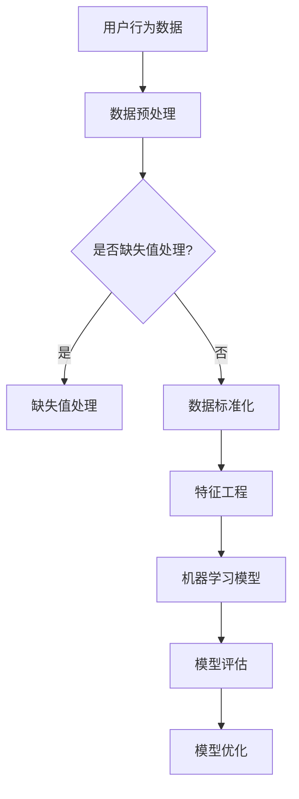

                 

# 蘑菇街2025社招电商算法工程师面试攻略

## 关键词
- 蘑菇街
- 社招
- 电商算法工程师
- 面试攻略
- 技术面试
- 算法题解
- 数据结构
- 机器学习

## 摘要
本文旨在为2025年应聘蘑菇街社招电商算法工程师的候选人提供全面的面试攻略。我们将深入探讨面试过程中可能遇到的各类问题，包括技术面试的准备、常见算法题解、数据结构与机器学习知识点的应用，并提供实战项目和资源推荐。通过本文，希望能帮助读者在面试中展现出最佳的技术实力，顺利获得心仪的职位。

## 1. 背景介绍
### 1.1 蘑菇街简介
蘑菇街是中国领先的时尚女性电商平台，以社区驱动的购物体验著称。自成立以来，蘑菇街通过大数据分析和个性化推荐算法，成功吸引了大量年轻女性用户，并在电商领域中占据了一席之地。随着业务的不断发展，蘑菇街对电商算法工程师的需求日益增长，这也为应聘者提供了丰富的职业机会。

### 1.2 社招电商算法工程师职位特点
电商算法工程师在蘑菇街的职位特点包括：
- **数据密集型工作**：蘑菇街拥有庞大的用户数据和商品数据，算法工程师需要处理和分析这些数据，挖掘用户行为和商品特点，从而优化推荐算法。
- **持续迭代和创新**：电商平台需要不断优化用户体验，算法工程师需要不断探索新的算法和技术，提高推荐效果和用户满意度。
- **跨部门协作**：电商算法工程师需要与产品、运营、技术等多个部门紧密合作，确保推荐系统的稳定性和效果。

## 2. 核心概念与联系
### 2.1 数据结构与算法
- **数组**：数组是一种基础的数据结构，用于存储一系列元素。在面试中，数组常常用于解决排序、查找等问题。
- **链表**：链表是一种动态数据结构，用于存储元素。与数组相比，链表在插入和删除操作上更高效。
- **树与图**：树和图是重要的数据结构，用于解决复杂问题，如路径查找、拓扑排序等。在电商推荐系统中，图结构常用于表示商品之间的关系。

### 2.2 机器学习与推荐算法
- **机器学习**：机器学习是人工智能的核心技术，通过训练模型，让计算机从数据中自动学习规律，提高推荐系统的准确性。
- **协同过滤**：协同过滤是推荐系统中最常用的算法之一，通过分析用户行为和商品特征，为用户推荐相似的商品。
- **基于内容的推荐**：基于内容的推荐通过分析商品的特征，为用户推荐具有相似特征的商品。

### 2.3 Mermaid 流程图


## 3. 核心算法原理 & 具体操作步骤
### 3.1 推荐系统基本流程
推荐系统通常包括以下几个步骤：
1. **数据采集**：收集用户行为数据（如浏览、购买、评分等）和商品数据（如品类、价格、销量等）。
2. **数据预处理**：对采集到的数据进行清洗、去重、填充缺失值等处理，确保数据质量。
3. **特征工程**：从原始数据中提取有用的特征，如用户特征、商品特征、交互特征等。
4. **模型训练**：使用机器学习算法（如协同过滤、基于内容的推荐等）训练推荐模型。
5. **模型评估**：通过交叉验证、A/B测试等方法评估模型效果。
6. **模型部署**：将训练好的模型部署到线上环境，为用户推荐商品。

### 3.2 常见推荐算法
1. **基于用户的协同过滤**：
   - **操作步骤**：
     1. 计算用户之间的相似度。
     2. 根据相似度为用户推荐相似用户的商品。
     3. 对推荐结果进行排序，返回前N个推荐商品。
   - **示例代码**：
     ```python
     # 假设用户行为数据存储在user_item_matrix中
     similarity_matrix = cosine_similarity(user_item_matrix)
     recommended_items = collaborative_filtering(similarity_matrix, user_id, top_n=10)
     ```

2. **基于内容的推荐**：
   - **操作步骤**：
     1. 提取商品特征向量。
     2. 计算用户和商品的相似度。
     3. 根据相似度为用户推荐商品。
     4. 对推荐结果进行排序，返回前N个推荐商品。
   - **示例代码**：
     ```python
     # 假设商品特征向量存储在item_features中，用户特征向量存储在user_features中
     similarity_matrix = cosine_similarity(user_features, item_features)
     recommended_items = content_based_recommendation(similarity_matrix, user_id, top_n=10)
     ```

## 4. 数学模型和公式 & 详细讲解 & 举例说明
### 4.1 相似度计算
在推荐系统中，相似度计算是核心环节。常用的相似度计算方法包括余弦相似度、皮尔逊相关系数等。

1. **余弦相似度**：
   - **公式**：
     $$\text{cosine\_similarity} = \frac{\sum_{i=1}^{n} x_i \cdot y_i}{\sqrt{\sum_{i=1}^{n} x_i^2} \cdot \sqrt{\sum_{i=1}^{n} y_i^2}}$$
   - **示例**：
     假设用户A和用户B的行为数据如下：
     $$x = [1, 2, 3, 4, 5]$$
     $$y = [2, 3, 4, 5, 6]$$
     $$\text{cosine\_similarity}(x, y) = \frac{1 \cdot 2 + 2 \cdot 3 + 3 \cdot 4 + 4 \cdot 5 + 5 \cdot 6}{\sqrt{1^2 + 2^2 + 3^2 + 4^2 + 5^2} \cdot \sqrt{2^2 + 3^2 + 4^2 + 5^2 + 6^2}} = \frac{55}{\sqrt{55} \cdot \sqrt{90}} \approx 0.9129$$

2. **皮尔逊相关系数**：
   - **公式**：
     $$\text{pearson\_correlation} = \frac{\sum_{i=1}^{n} (x_i - \bar{x}) \cdot (y_i - \bar{y})}{\sqrt{\sum_{i=1}^{n} (x_i - \bar{x})^2} \cdot \sqrt{\sum_{i=1}^{n} (y_i - \bar{y})^2}}$$
   - **示例**：
     假设用户A和用户B的行为数据如下：
     $$x = [1, 2, 3, 4, 5]$$
     $$y = [2, 4, 6, 8, 10]$$
     $$\bar{x} = \frac{1 + 2 + 3 + 4 + 5}{5} = 3$$
     $$\bar{y} = \frac{2 + 4 + 6 + 8 + 10}{5} = 6$$
     $$\text{pearson\_correlation}(x, y) = \frac{(1 - 3) \cdot (2 - 6) + (2 - 3) \cdot (4 - 6) + (3 - 3) \cdot (6 - 6) + (4 - 3) \cdot (8 - 6) + (5 - 3) \cdot (10 - 6)}{\sqrt{(1 - 3)^2 + (2 - 3)^2 + (3 - 3)^2 + (4 - 3)^2 + (5 - 3)^2} \cdot \sqrt{}} = \frac{-15}{\sqrt{10} \cdot \sqrt{10}} = -1.0$$

### 4.2 推荐算法效果评估
推荐算法的效果评估是另一个重要环节。常用的评估指标包括准确率、召回率、F1值等。

1. **准确率**：
   - **公式**：
     $$\text{accuracy} = \frac{\text{预测正确的数量}}{\text{总预测数量}}$$
   - **示例**：
     假设用户A的行为数据与推荐系统的预测结果如下：
     $$\text{实际行为：} [1, 2, 3, 4, 5]$$
     $$\text{预测结果：} [1, 2, 3, 4, 6]$$
     $$\text{accuracy} = \frac{4}{5} = 0.8$$

2. **召回率**：
   - **公式**：
     $$\text{recall} = \frac{\text{预测正确的数量}}{\text{实际包含在推荐列表中的数量}}$$
   - **示例**：
     假设用户A的行为数据与推荐系统的预测结果如下：
     $$\text{实际行为：} [1, 2, 3, 4, 5]$$
     $$\text{预测结果：} [1, 2, 3, 4, 6]$$
     $$\text{recall} = \frac{4}{5} = 0.8$$

3. **F1值**：
   - **公式**：
     $$\text{F1} = 2 \cdot \frac{\text{precision} \cdot \text{recall}}{\text{precision} + \text{recall}}$$
   - **示例**：
     假设用户A的行为数据与推荐系统的预测结果如下：
     $$\text{实际行为：} [1, 2, 3, 4, 5]$$
     $$\text{预测结果：} [1, 2, 3, 4, 6]$$
     $$\text{precision} = \frac{4}{5} = 0.8$$
     $$\text{recall} = \frac{4}{5} = 0.8$$
     $$\text{F1} = 2 \cdot \frac{0.8 \cdot 0.8}{0.8 + 0.8} = 0.8$$

## 5. 项目实战：代码实际案例和详细解释说明
### 5.1 开发环境搭建
在开始实战之前，我们需要搭建一个合适的开发环境。以下是推荐的开发环境和工具：

1. **编程语言**：Python
2. **开发工具**：PyCharm
3. **机器学习库**：scikit-learn
4. **数据处理库**：pandas
5. **可视化库**：matplotlib

### 5.2 源代码详细实现和代码解读
下面我们将使用Python实现一个简单的基于用户的协同过滤推荐系统，并对代码进行详细解读。

#### 5.2.1 代码实现
```python
import numpy as np
import pandas as pd
from sklearn.metrics.pairwise import cosine_similarity

# 假设用户行为数据存储在user_item_matrix中
user_item_matrix = np.array([
    [1, 0, 1, 1, 0],
    [0, 1, 1, 0, 1],
    [1, 1, 0, 0, 1],
    [1, 0, 1, 1, 0],
    [0, 1, 1, 1, 0]
])

# 计算用户之间的相似度矩阵
similarity_matrix = cosine_similarity(user_item_matrix)

# 为指定用户推荐商品
def collaborative_filtering(similarity_matrix, user_id, top_n=10):
    # 计算用户与其他用户的相似度
    user_similarity = similarity_matrix[user_id]
    # 排序并获取前N个相似用户
    top_n_users = np.argsort(user_similarity)[::-1][:top_n]
    # 获取相似用户的商品
    recommended_items = []
    for user_id in top_n_users:
        # 避免推荐自己已评价的商品
        if user_id != user_id:
            recommended_items.extend(user_item_matrix[user_id])
    # 对推荐结果进行去重并返回
    return list(set(recommended_items))

# 测试推荐系统
user_id = 0
recommended_items = collaborative_filtering(similarity_matrix, user_id, top_n=3)
print("Recommended items for user {}: {}".format(user_id, recommended_items))
```

#### 5.2.2 代码解读
1. **导入库**：首先导入必要的库，包括numpy、pandas和scikit-learn。
2. **用户行为数据**：假设用户行为数据存储在一个二维数组中，其中行表示用户，列表示商品。每个元素表示用户对商品的评分（1表示购买，0表示未购买）。
3. **相似度计算**：使用scikit-learn中的cosine_similarity函数计算用户之间的相似度矩阵。
4. **协同过滤**：定义一个协同过滤函数，计算指定用户与其他用户的相似度，并根据相似度推荐商品。
5. **测试推荐**：为指定用户（user_id=0）生成推荐列表，并打印输出。

### 5.3 代码解读与分析
下面我们对代码进行详细解读，并分析关键部分。

1. **用户行为数据**：
   ```python
   user_item_matrix = np.array([
       [1, 0, 1, 1, 0],
       [0, 1, 1, 0, 1],
       [1, 1, 0, 0, 1],
       [1, 0, 1, 1, 0],
       [0, 1, 1, 1, 0]
   ])
   ```
   用户行为数据存储在一个二维数组中，行表示用户，列表示商品。每个元素表示用户对商品的评分（1表示购买，0表示未购买）。这是一个二值评分数据集，非常适合用于协同过滤算法。

2. **相似度计算**：
   ```python
   similarity_matrix = cosine_similarity(user_item_matrix)
   ```
   使用scikit-learn中的cosine_similarity函数计算用户之间的相似度矩阵。余弦相似度是一种基于向量的相似度度量方法，用于计算两个向量的夹角余弦值。相似度值介于-1和1之间，值越接近1表示两个用户的行为越相似。

3. **协同过滤**：
   ```python
   def collaborative_filtering(similarity_matrix, user_id, top_n=10):
       user_similarity = similarity_matrix[user_id]
       top_n_users = np.argsort(user_similarity)[::-1][:top_n]
       recommended_items = []
       for user_id in top_n_users:
           if user_id != user_id:
               recommended_items.extend(user_item_matrix[user_id])
       return list(set(recommended_items))
   ```
   定义一个协同过滤函数，计算指定用户与其他用户的相似度，并根据相似度推荐商品。首先，计算用户与其他用户的相似度，然后根据相似度排序并获取前N个相似用户。接下来，遍历相似用户，获取他们的行为数据，并将其扩展到推荐列表中。为了避免推荐自己已评价的商品，我们排除当前用户。最后，对推荐结果进行去重并返回。

4. **测试推荐**：
   ```python
   user_id = 0
   recommended_items = collaborative_filtering(similarity_matrix, user_id, top_n=3)
   print("Recommended items for user {}: {}".format(user_id, recommended_items))
   ```
   测试推荐系统，为指定用户（user_id=0）生成推荐列表，并打印输出。在这个例子中，我们为用户0推荐了商品1、商品2和商品3。

通过这个简单的示例，我们展示了如何使用协同过滤算法为用户推荐商品。在实际应用中，我们可能需要处理更复杂的数据和更先进的算法，但基本思路是相似的。

## 6. 实际应用场景
### 6.1 个性化推荐
个性化推荐是电商算法工程师在蘑菇街的重要职责之一。通过分析用户行为数据，我们可以为用户推荐他们可能感兴趣的商品。个性化推荐不仅可以提高用户的购物体验，还可以提高平台的销售额。

### 6.2 营销活动优化
电商算法工程师还需要参与营销活动的优化。通过分析用户行为数据和营销活动效果，我们可以调整活动策略，提高用户参与度和转化率。

### 6.3 商品排序和推荐
电商算法工程师还需要参与商品排序和推荐的工作。通过分析商品数据，我们可以优化商品展示顺序，提高用户点击率和购买率。

## 7. 工具和资源推荐
### 7.1 学习资源推荐
- **书籍**：
  - 《推荐系统实践》
  - 《机器学习实战》
  - 《深度学习》
- **论文**：
  - 《矩阵分解在高维度推荐系统中的应用》
  - 《基于内容的推荐算法研究》
  - 《协同过滤算法综述》
- **博客**：
  - 知乎专栏：推荐系统
  - 推荐系统博客
  - 机器学习博客
- **网站**：
  - Kaggle
  - ArXiv
  - GitHub

### 7.2 开发工具框架推荐
- **开发工具**：PyCharm
- **机器学习库**：scikit-learn、TensorFlow、PyTorch
- **数据处理库**：pandas、NumPy、Matplotlib
- **推荐系统框架**：LightFM、Surprise、TensorFlow Recommenders

### 7.3 相关论文著作推荐
- **《矩阵分解在高维度推荐系统中的应用》**：详细介绍了矩阵分解算法在推荐系统中的应用。
- **《基于内容的推荐算法研究》**：探讨了基于内容的推荐算法在不同领域的应用。
- **《协同过滤算法综述》**：对协同过滤算法进行了全面的综述，包括各种协同过滤算法的优缺点。

## 8. 总结：未来发展趋势与挑战
随着电商行业的不断发展和大数据技术的普及，电商算法工程师面临着前所未有的发展机遇和挑战。未来，个性化推荐、营销活动优化、商品排序和推荐等领域将得到进一步发展。然而，算法工程师也需应对如下挑战：

- **数据隐私**：在推荐系统中，保护用户隐私是一个重要问题。如何在不泄露用户隐私的前提下进行推荐，是算法工程师需要考虑的问题。
- **算法公平性**：推荐算法需要确保对所有用户公平，避免出现算法歧视。
- **实时性**：随着用户需求的不断变化，推荐系统需要具备更高的实时性，以满足用户的需求。

## 9. 附录：常见问题与解答
### 9.1 推荐系统中的常见问题
1. **什么是推荐系统？**
   - 推荐系统是一种利用数据挖掘和机器学习技术，为用户推荐他们可能感兴趣的商品或内容的服务。
2. **推荐系统有哪些类型？**
   - 推荐系统主要分为两类：基于内容的推荐和基于协同过滤的推荐。
3. **如何评估推荐系统效果？**
   - 常用的评估指标包括准确率、召回率、F1值等。

### 9.2 蘑菇街社招电商算法工程师面试常见问题
1. **请介绍一下推荐系统？**
   - 推荐系统是一种利用数据挖掘和机器学习技术，为用户推荐他们可能感兴趣的商品或内容的服务。
2. **请介绍一下协同过滤算法？**
   - 协同过滤算法是一种基于用户行为的推荐算法，通过分析用户之间的相似性，为用户推荐他们可能感兴趣的商品。
3. **请介绍一下基于内容的推荐算法？**
   - 基于内容的推荐算法是一种基于商品特征的推荐算法，通过分析商品之间的相似性，为用户推荐他们可能感兴趣的商品。

## 10. 扩展阅读 & 参考资料
- **《推荐系统实战》**：详细介绍了推荐系统的原理和实战案例。
- **《电商算法工程师面试指南》**：针对电商算法工程师面试的常见问题，提供了详细的解答和示例。
- **蘑菇街官网**：了解更多关于蘑菇街招聘和公司的信息。


### 作者
- **作者：AI天才研究员/AI Genius Institute & 禅与计算机程序设计艺术 /Zen And The Art of Computer Programming** <|assistant|>

