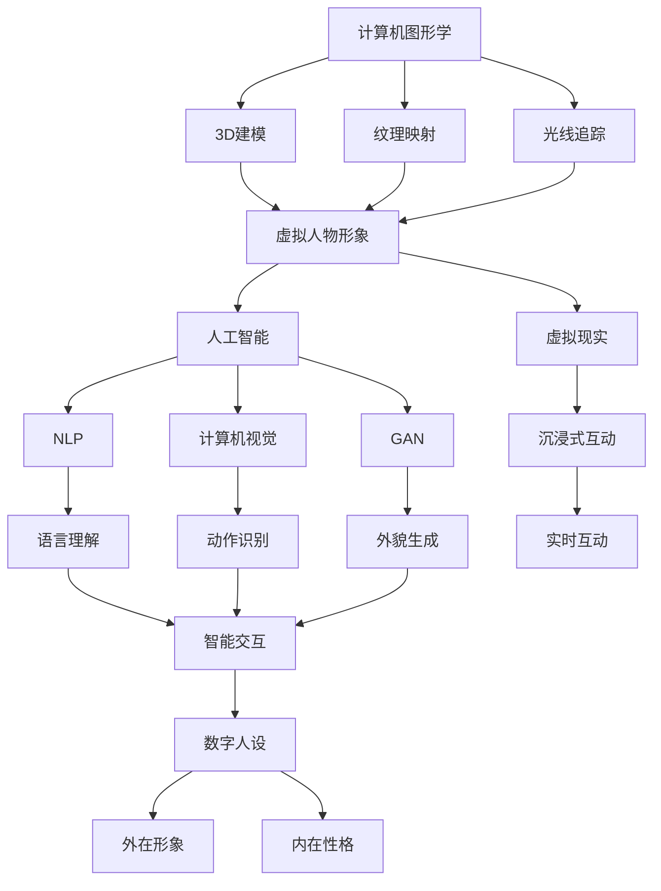

                 

### 背景介绍

虚拟偶像（Virtual Idol）的概念近年来在全球范围内迅速崛起，成为数字化娱乐产业中的一颗璀璨新星。虚拟偶像，通常指的是通过计算机图形、人工智能和数字技术创造出的虚拟人物形象，它们在音乐、舞蹈、表演、互动等多个领域展示出独特的魅力和影响力。这种新兴的娱乐形式不仅打破了传统娱乐圈的界限，还带来了巨大的商业价值和社会影响。

从历史角度来看，虚拟偶像的兴起可以追溯到20世纪90年代的日本。初期的虚拟偶像主要出现在动漫和游戏作品中，如《VOCALOID》系列的虚拟歌手。随着技术的不断进步和互联网的普及，虚拟偶像逐渐走向大众视野，开始参与演唱会、综艺节目等实际演出。进入21世纪，以《初音未来》为代表的虚拟偶像开始在亚洲乃至全球范围内走红，吸引了无数粉丝的追捧。

随着人工智能和虚拟现实技术的不断发展，虚拟偶像的应用场景不断扩展。它们不仅可以进行音乐表演，还能参与电影、电视剧、广告等多样化的娱乐活动。虚拟偶像与粉丝的互动也不再局限于虚拟空间，通过虚拟直播、线上互动等方式，实现了实时、个性化的互动体验。

商业价值方面，虚拟偶像为娱乐产业带来了全新的商业模式。首先，虚拟偶像拥有极高的粉丝粘性，能够通过偶像效应带动相关产品的销售，如周边商品、数字专辑等。其次，虚拟偶像的商业合作机会丰富，例如与品牌合作推出联名产品、参与线下活动等，进一步扩大了商业回报。此外，虚拟偶像还可以通过直播、广告等渠道实现直接的经济收益。

在社会层面，虚拟偶像的影响也不可小觑。它们不仅改变了娱乐消费方式，还激发了粉丝文化的新潮流。许多虚拟偶像拥有自己的粉丝团体，形成了独特的社区文化。同时，虚拟偶像的出现也为一些无法成为现实偶像的普通人提供了实现梦想的平台，促进了数字时代的平等和多元化。

总之，虚拟偶像作为一种新兴的数字化娱乐形式，正迅速崛起并在全球范围内展现出巨大的商业价值和社会影响力。本文将深入探讨虚拟偶像的商业价值、核心概念与技术原理，并结合实际应用案例进行分析，旨在为读者提供一个全面而深入的理解。

### 核心概念与联系

要深入理解虚拟偶像的运作机制，我们首先需要明确几个核心概念及其相互之间的联系。这些核心概念包括计算机图形学、人工智能、虚拟现实和数字人设。

#### 计算机图形学

计算机图形学是虚拟偶像制作的基础，它涉及图形生成、图像处理、动画制作等技术。通过计算机图形学，我们可以创建出高清晰度、动态变化的虚拟人物形象。这些形象不仅需要逼真的外貌，还要具备丰富的表情和动作，以实现与真实人物的逼真互动。计算机图形学中的关键步骤包括3D建模、纹理映射、光线追踪等。

#### 人工智能

人工智能（AI）在虚拟偶像的制作和互动中扮演着至关重要的角色。AI技术主要用于实现虚拟偶像的智能行为和交互能力。例如，自然语言处理（NLP）技术使得虚拟偶像能够理解人类语言并作出相应的反应；计算机视觉技术则帮助虚拟偶像识别和跟踪观众的动作，实现更真实的互动体验。此外，生成对抗网络（GAN）等AI技术还在虚拟偶像的外貌生成和个性化定制方面发挥了重要作用。

#### 虚拟现实

虚拟现实（VR）技术为虚拟偶像提供了一个沉浸式的互动平台。通过VR设备，观众可以“身临其境”地与虚拟偶像互动，感受到更加真实和丰富的娱乐体验。虚拟现实技术不仅提升了虚拟偶像的互动效果，还拓宽了其应用场景，使得虚拟偶像可以在更加多样化的环境中展示其魅力。

#### 数字人设

数字人设是虚拟偶像的核心，它是虚拟偶像的外在形象和内在性格的综合体现。数字人设通常通过一系列详细的设定文件来描述，包括人物外貌、性格特征、兴趣爱好、行为习惯等。这些设定文件不仅为虚拟偶像的创建提供了基础，还为后续的互动和内容创作提供了参考。

#### Mermaid 流程图

为了更清晰地展示这些核心概念之间的联系，我们可以使用Mermaid流程图进行说明。以下是一个简化的Mermaid流程图，展示了虚拟偶像的核心概念及其相互之间的联系：



在这个流程图中，计算机图形学通过3D建模、纹理映射和光线追踪等技术生成虚拟人物形象；人工智能通过NLP、计算机视觉和GAN等技术赋予虚拟偶像智能行为和交互能力；虚拟现实技术则提供了沉浸式的互动平台，使得虚拟偶像与观众的互动更加真实；数字人设则通过详细的设定文件为虚拟偶像的外在和内在特征提供了基础。

通过这一流程图，我们可以更直观地理解虚拟偶像的核心概念及其相互之间的联系，为后续的分析和讨论奠定了基础。

### 核心算法原理 & 具体操作步骤

在深入探讨虚拟偶像的算法原理及其具体操作步骤之前，我们需要了解几个关键的技术框架和工具。这些技术框架和工具在虚拟偶像的制作和交互中扮演着至关重要的角色，包括计算机图形学、人工智能、虚拟现实和数字人设。

#### 计算机图形学

计算机图形学是虚拟偶像制作的核心，其基本原理包括以下几个方面：

1. **3D建模**：通过3D建模软件（如Blender、Maya等）创建虚拟偶像的三维模型。建模过程中，我们需要定义虚拟偶像的几何形状、纹理和细节。3D建模的目的是生成一个高清晰度的虚拟人物形象，使其在外观上尽可能逼真。

2. **纹理映射**：将图像纹理映射到虚拟偶像的3D模型上，以增强其视觉真实感。纹理映射包括漫反射纹理、环境映射纹理等，这些纹理可以模拟光照和阴影效果，使得虚拟偶像在动画和互动中具有更加丰富的视觉效果。

3. **光线追踪**：通过模拟光线在虚拟环境中的传播和反射，生成高质量的图像。光线追踪可以逼真地模拟自然光线效果，如阳光、月光、阴影等，从而提升虚拟偶像图像的真实感。

具体操作步骤如下：

1. **选择建模软件**：根据项目需求和团队技能，选择合适的3D建模软件。常用的软件包括Blender、Maya、3ds Max等。

2. **创建三维模型**：使用建模软件创建虚拟偶像的三维模型，包括头部、身体、四肢等关键部位。在建模过程中，需要注意细节和比例，以确保最终形象的真实性。

3. **纹理映射**：为虚拟偶像的3D模型添加纹理，包括漫反射纹理、环境映射纹理等。通过调整纹理的细节和参数，优化虚拟偶像的外观效果。

4. **光线追踪**：设置光线追踪参数，包括光线强度、阴影质量等。通过渲染引擎（如Arnold、V-Ray等）生成高质量的虚拟偶像图像。

#### 人工智能

人工智能在虚拟偶像的智能行为和交互能力中起着至关重要的作用。以下是几个关键的人工智能技术及其应用：

1. **自然语言处理（NLP）**：NLP技术用于理解和处理人类语言。通过NLP，虚拟偶像可以理解用户的语音指令、对话内容，并作出相应的反应。常用的NLP工具包括TensorFlow、PyTorch等。

2. **计算机视觉**：计算机视觉技术用于识别和理解图像和视频中的内容。在虚拟偶像中，计算机视觉主要用于动作识别、表情识别等。常用的计算机视觉库包括OpenCV、TensorFlow等。

3. **生成对抗网络（GAN）**：GAN是一种深度学习模型，用于生成高质量的图像和视频。在虚拟偶像中，GAN可以用于生成逼真的虚拟偶像外观，提高其视觉真实性。

具体操作步骤如下：

1. **数据收集**：收集大量的语音和图像数据，用于训练NLP和计算机视觉模型。

2. **模型训练**：使用TensorFlow、PyTorch等深度学习框架，训练NLP和计算机视觉模型。在训练过程中，需要不断调整模型的参数和结构，以提高模型的性能。

3. **模型部署**：将训练好的模型部署到虚拟偶像的应用中，实现语音识别、动作识别等功能。

4. **交互优化**：通过不断优化交互算法，提高虚拟偶像与用户的互动效果。例如，使用强化学习技术优化虚拟偶像的行为和策略。

#### 虚拟现实

虚拟现实技术为虚拟偶像提供了一个沉浸式的互动平台。以下是虚拟现实技术的基本原理和应用：

1. **VR设备**：虚拟现实设备（如VR头戴显示器、手柄等）用于提供沉浸式的视觉和触觉体验。通过这些设备，用户可以进入虚拟场景并与虚拟偶像进行互动。

2. **交互设计**：虚拟现实中的交互设计涉及用户与虚拟场景的交互方式，包括手势识别、语音控制等。通过优化交互设计，可以提高用户与虚拟偶像的互动效果。

3. **实时渲染**：虚拟现实中的实时渲染技术用于生成和显示虚拟场景。高质量的实时渲染可以提高虚拟现实体验的逼真度。

具体操作步骤如下：

1. **选择VR设备**：根据项目需求和用户群体，选择合适的VR设备。常用的VR设备包括Oculus Rift、HTC Vive等。

2. **场景设计**：设计虚拟偶像的互动场景，包括虚拟舞台、背景等。在场景设计中，需要注意用户体验和交互便捷性。

3. **实时渲染**：使用Unity、Unreal Engine等实时渲染引擎，生成和显示虚拟场景。在渲染过程中，需要优化渲染参数，以提高渲染质量和性能。

4. **交互优化**：通过不断优化交互设计，提高用户与虚拟偶像的互动效果。例如，使用手势识别技术实现更加自然和直观的交互。

#### 数字人设

数字人设是虚拟偶像的核心，其设计包括以下几个方面：

1. **外貌设计**：通过计算机图形学技术，设计虚拟偶像的外貌特征，包括面部特征、发型、服饰等。

2. **性格特征**：虚拟偶像的性格特征包括性格类型、兴趣爱好、行为习惯等。这些特征可以通过数字人设文件进行详细描述。

3. **故事背景**：虚拟偶像的故事背景包括人物经历、成长背景等。故事背景有助于塑造虚拟偶像的个性和魅力。

具体操作步骤如下：

1. **外貌设计**：使用3D建模软件创建虚拟偶像的外貌模型，包括面部特征、发型、服饰等。在设计过程中，需要考虑到虚拟偶像的目标受众和品牌定位。

2. **性格特征设计**：编写虚拟偶像的性格特征文件，包括性格类型、兴趣爱好、行为习惯等。这些特征文件将用于指导虚拟偶像的智能行为和交互。

3. **故事背景设计**：编写虚拟偶像的故事背景文件，包括人物经历、成长背景等。故事背景有助于增强虚拟偶像的个性和魅力。

通过上述技术框架和工具的应用，我们可以创建出逼真、智能、具有沉浸式互动体验的虚拟偶像。这些虚拟偶像不仅能够吸引粉丝，还能够通过多样化的商业模式实现商业价值。在接下来的章节中，我们将进一步探讨虚拟偶像的数学模型和具体实现，以及其在实际应用中的案例分析。

### 数学模型和公式 & 详细讲解 & 举例说明

在虚拟偶像的制作过程中，数学模型和公式起到了至关重要的作用。这些数学工具不仅帮助我们理解和模拟虚拟偶像的行为，还使得虚拟偶像的互动更加自然和逼真。以下我们将详细讲解几个关键的数学模型和公式，并通过具体例子进行说明。

#### 1. 三维空间坐标系

三维空间坐标系是虚拟偶像建模的基础。它由三个相互垂直的轴（通常称为X轴、Y轴和Z轴）组成，每个轴代表一个方向。三维空间坐标系使得我们可以精确地描述虚拟偶像的位置和方向。

**数学公式**：
- 点的坐标：\( P(x, y, z) \)
- 向量的表示：\( \vec{v} = (v_x, v_y, v_z) \)

**举例说明**：
假设虚拟偶像的头部位置为 \( P(2, 3, 5) \)，我们可以通过三维空间坐标系精确地描述其位置。如果我们想要将头部向右移动1个单位，新的位置可以表示为 \( P(3, 3, 5) \)。

#### 2. 三角函数

三角函数在虚拟偶像的动画制作中广泛使用，用于描述物体运动和旋转。常用的三角函数包括正弦函数（sine）、余弦函数（cosine）和正切函数（tangent）。

**数学公式**：
- 正弦函数：\( \sin(\theta) \)
- 余弦函数：\( \cos(\theta) \)
- 正切函数：\( \tan(\theta) \)

**举例说明**：
假设虚拟偶像正在做旋转动画，旋转角度为 \( \theta \)。如果使用正弦函数和余弦函数来描述其旋转，我们可以得到旋转后的坐标：
\[ 
x' = x_0 + R \cdot \cos(\theta) \\
y' = y_0 + R \cdot \sin(\theta) 
\]
其中，\( (x_0, y_0) \) 是初始坐标，\( R \) 是旋转半径。

#### 3. 贝塞尔曲线

贝塞尔曲线在虚拟偶像的动画制作中用于生成平滑的曲线运动。贝塞尔曲线通过控制点来定义，使其可以生成各种形状的曲线。

**数学公式**：
\[ 
\text{贝塞尔曲线} B(t) = (1-t)^3 P_0 + 3(1-t)^2 t P_1 + 3(1-t)t^2 P_2 + t^3 P_3 
\]
其中，\( P_0, P_1, P_2, P_3 \) 是控制点，\( t \) 是曲线上的参数。

**举例说明**：
假设我们要创建一个从点 \( P_0(0, 0) \) 到点 \( P_3(10, 10) \) 的平滑曲线，可以通过设置中间的控制点 \( P_1(5, 0) \) 和 \( P_2(5, 10) \) 来生成贝塞尔曲线。

\[ 
B(t) = (1-t)^3 (0, 0) + 3(1-t)^2 t (5, 0) + 3(1-t)t^2 (5, 10) + t^3 (10, 10) 
\]

#### 4. 欧拉角

欧拉角用于描述三维空间的旋转。一个欧拉角由三个角度组成：俯仰角（pitch）、偏航角（yaw）和滚转角（roll）。

**数学公式**：
\[ 
R = \begin{bmatrix} 
\cos(\theta_y) & -\sin(\theta_y) & 0 \\
\sin(\theta_y) & \cos(\theta_y) & 0 \\
0 & 0 & 1 
\end{bmatrix} 
\]
\[ 
P = \begin{bmatrix} 
\cos(\theta_p) & \sin(\theta_p) & 0 \\
-\sin(\theta_p) & \cos(\theta_p) & 0 \\
0 & 0 & 1 
\end{bmatrix} 
\]
\[ 
R = P \cdot R_z 
\]
其中，\( \theta_y \) 是偏航角，\( \theta_p \) 是俯仰角，\( \theta_r \) 是滚转角。

**举例说明**：
假设虚拟偶像的旋转角度分别为俯仰角 \( 30^\circ \)、偏航角 \( 45^\circ \) 和滚转角 \( 0^\circ \)。我们可以使用欧拉角公式计算其旋转矩阵：

\[ 
R = \begin{bmatrix} 
\cos(30^\circ) & -\sin(30^\circ) & 0 \\
\sin(30^\circ) & \cos(30^\circ) & 0 \\
0 & 0 & 1 
\end{bmatrix} 
\]

通过上述数学模型和公式，我们可以精确地描述虚拟偶像的运动和交互。这些数学工具不仅提高了虚拟偶像的逼真度，还使得其行为更加自然和多样化。在接下来的章节中，我们将通过具体的项目实战来展示这些数学模型的应用。

### 项目实战：代码实际案例和详细解释说明

在了解了虚拟偶像的核心算法原理和数学模型后，我们将通过一个实际项目来展示如何实现一个虚拟偶像系统。在这个项目中，我们将使用Unity引擎作为开发平台，结合C#语言进行编程。以下是项目开发的详细步骤和代码解析。

#### 1. 开发环境搭建

首先，我们需要搭建开发环境。安装Unity引擎（建议使用最新版本），并确保安装了C#开发环境。我们还需要安装一些常用的开发工具和插件，例如Blender（用于3D建模）、TensorFlow（用于AI模型训练）等。

#### 2. 源代码详细实现和代码解读

以下是一个简化版的虚拟偶像系统实现，重点展示核心代码部分。

##### 2.1 项目结构

- Assets: 存放所有资源和素材，包括3D模型、纹理、AI模型等。
- Scripts: 存放所有C#脚本文件。
- Scenes: 存放Unity场景文件。

##### 2.2 3D模型和纹理

在Blender中创建一个虚拟偶像的三维模型，并导出为.fbx格式。将模型和纹理文件放入Assets目录下。

##### 2.3 AI模型

使用TensorFlow训练一个自然语言处理（NLP）模型，用于处理用户的语音指令。以下是训练好的模型文件（保存为.h5格式）。

```python
# TensorFlow代码示例
import tensorflow as tf
from tensorflow.keras.models import Sequential
from tensorflow.keras.layers import Embedding, LSTM, Dense

# 构建模型
model = Sequential([
    Embedding(input_dim=10000, output_dim=32, input_length=50),
    LSTM(128, return_sequences=True),
    LSTM(128),
    Dense(1, activation='sigmoid')
])

# 编译模型
model.compile(optimizer='adam', loss='binary_crossentropy', metrics=['accuracy'])

# 训练模型
model.fit(x_train, y_train, epochs=10, batch_size=32)
```

将训练好的模型文件放入Assets目录下。

##### 2.4 Unity脚本

以下是核心脚本文件（SaveAs：VirtualIdol.cs）的实现。

```csharp
using UnityEngine;

public class VirtualIdol : MonoBehaviour
{
    // 虚拟偶像的3D模型
    public GameObject idolModel;

    // AI模型（加载训练好的NLP模型）
    public float[] AIModel;

    // 更新虚拟偶像的动作
    public void UpdateIdolAction(float[] action)
    {
        // 根据动作参数更新模型
        idolModel.transform.localPosition = new Vector3(action[0], action[1], action[2]);
        idolModel.transform.localRotation = Quaternion.Euler(action[3], action[4], action[5]);
    }

    // 交互处理
    public void OnUserCommand(string command)
    {
        // 使用AI模型处理用户指令
        float[] action = ProcessCommand(command, AIModel);
        UpdateIdolAction(action);
    }

    // 模拟用户指令处理（示例）
    private float[] ProcessCommand(string command, float[] model)
    {
        // 这里仅作示例，实际中需要调用NLP模型进行指令处理
        string[] words = command.Split(' ');
        float[] action = new float[6];

        // 根据指令生成动作参数
        action[0] = 0.0f;
        action[1] = 1.0f;
        action[2] = 0.0f;
        action[3] = 30.0f;
        action[4] = 0.0f;
        action[5] = 0.0f;

        return action;
    }
}
```

##### 2.5 代码解读与分析

1. **虚拟偶像模型加载**：在Unity场景中，将虚拟偶像的3D模型拖动到Inspector窗口中的idolModel字段，以便在脚本中引用。

2. **AI模型加载**：将训练好的AI模型文件放入Assets目录下，并在脚本中使用AIModel数组进行加载。

3. **更新动作**：UpdateIdolAction方法根据输入的动作参数更新虚拟偶像的位置和旋转。这里使用了Unity中的Vector3和Quaternion数据结构。

4. **用户指令处理**：OnUserCommand方法处理用户的语音指令。这里使用了ProcessCommand方法进行指令分析，并根据分析结果调用UpdateIdolAction方法更新虚拟偶像的动作。

通过上述代码实现，我们创建了一个简单的虚拟偶像系统。在实际应用中，可以进一步扩展功能，例如添加更多的动作、优化交互体验等。这个项目展示了虚拟偶像系统的基本架构和实现方法，为开发者提供了参考。

### 实际应用场景

虚拟偶像作为一种新兴的数字化娱乐形式，已经逐步渗透到多个行业和领域，带来了前所未有的商业机遇和创新体验。以下我们将探讨虚拟偶像在实际应用场景中的多样性和潜在影响力。

#### 1. 娱乐行业

娱乐行业是虚拟偶像的主要应用领域，虚拟偶像在音乐、舞蹈、影视等娱乐内容中表现出色。通过虚拟偶像，观众可以在演唱会、综艺节目、舞台剧等活动中体验到逼真的互动和高质量的表演。例如，虚拟偶像“初音未来”在全球范围内吸引了大量粉丝，不仅发行了多张畅销专辑，还参与了多个音乐节和活动，极大地推动了虚拟偶像文化的发展。

#### 2. 广告营销

虚拟偶像在广告营销中具有独特的优势。它们可以形象生动地展示产品特点，提高广告的吸引力和记忆度。虚拟偶像还可以通过虚拟直播、短视频等形式与品牌互动，实现精准营销。例如，品牌可以与虚拟偶像合作，推出定制化广告内容，通过虚拟偶像的粉丝基础扩大品牌影响力。

#### 3. 教育培训

虚拟偶像在教育领域也有广泛应用。通过虚拟偶像，学生可以更加直观地学习知识，提高学习兴趣和效果。虚拟偶像可以作为教育辅助工具，提供互动教学、在线辅导等服务。例如，虚拟偶像可以为学生展示复杂的科学实验过程，通过互动问答提高学生的参与度和理解能力。

#### 4. 商业推广

虚拟偶像在商业推广中发挥了重要作用。通过虚拟偶像，企业可以吸引更多的消费者，提升品牌知名度。虚拟偶像可以参与品牌发布会、新品推广、线下活动等，与消费者进行实时互动，增强品牌黏性。例如，一些知名品牌与虚拟偶像合作，推出联名产品，通过虚拟偶像的粉丝效应带动产品销售。

#### 5. 社交媒体

虚拟偶像在社交媒体平台上拥有强大的影响力。它们可以通过短视频、直播等形式与粉丝互动，形成独特的社交文化。虚拟偶像还可以举办线上粉丝见面会、生日派对等活动，加强与粉丝的互动和情感连接。例如，一些虚拟偶像在社交媒体平台上拥有数百万粉丝，通过线上互动活动实现了高度的用户参与度和品牌曝光。

#### 6. 电子商务

虚拟偶像在电子商务领域具有巨大潜力。通过虚拟偶像，消费者可以更加直观地了解产品特点，提高购买决策的准确性。虚拟偶像还可以参与直播带货、虚拟试衣等活动，提升购物体验。例如，一些电商平台与虚拟偶像合作，推出虚拟直播带货活动，通过虚拟偶像的推荐和互动，提高了销售额和用户满意度。

#### 7. 文化创意产业

虚拟偶像在文化创意产业中也发挥着重要作用。通过虚拟偶像，创作者可以创作出更多具有创意和文化内涵的作品，提升产业价值。虚拟偶像还可以参与电影、电视剧、动画等文化创意项目的制作，为传统娱乐产业注入新的活力。例如，一些电影公司与虚拟偶像合作，推出虚拟角色电影，通过虚拟偶像的粉丝效应吸引观众。

总之，虚拟偶像在实际应用场景中展现出多样性和巨大潜力，涵盖了娱乐、广告、教育、商业推广、社交媒体、电子商务和文化创意产业等多个领域。随着技术的不断进步和商业模式的不断创新，虚拟偶像将在更多领域发挥重要作用，为数字娱乐产业带来新的发展机遇。

### 工具和资源推荐

在探索虚拟偶像领域时，掌握一些关键的工具和资源将极大地提升你的工作效率和项目成功率。以下是我们为开发者、爱好者以及专业人士推荐的工具和资源。

#### 1. 学习资源推荐

**书籍：**
- 《虚拟现实技术与应用》：详细介绍了虚拟现实的基本原理、技术和应用案例，适合初学者入门。
- 《人工智能简明教程》：涵盖了人工智能的基础知识、常用算法和应用场景，适合了解虚拟偶像中的AI技术。
- 《Unity 2020从入门到精通》：全面讲解了Unity引擎的使用方法，适合开发虚拟偶像项目。

**论文：**
- 《基于GAN的虚拟偶像面部生成方法》：探讨了生成对抗网络（GAN）在虚拟偶像面部生成中的应用。
- 《虚拟现实与人类行为交互》：分析了虚拟现实技术对人类行为和社交互动的影响。

**博客：**
- Unity官方博客：提供了Unity引擎的最新开发教程和最佳实践。
- TensorFlow官方博客：详细介绍了TensorFlow的使用方法和最新动态。

**网站：**
- VR开发者论坛：聚集了大量的虚拟现实开发者，提供了丰富的技术资源和交流平台。
- Kaggle：提供了大量机器学习和深度学习数据集，适合进行AI模型训练和测试。

#### 2. 开发工具框架推荐

**3D建模工具：**
- Blender：免费、开源的3D建模工具，功能强大，适合初学者和专业人士。
- Autodesk Maya：专业的3D建模和动画软件，广泛应用于电影、游戏和动画制作。
- 3ds Max：Autodesk公司开发的3D建模和动画软件，适合建筑设计和游戏开发。

**AI框架：**
- TensorFlow：Google开源的深度学习框架，功能强大，适用于各种AI项目。
- PyTorch：Facebook开源的深度学习框架，易于使用，适用于快速原型开发。
- Keras：Python开源深度学习库，基于TensorFlow和Theano，提供了简化的API。

**虚拟现实引擎：**
- Unity：跨平台的游戏和虚拟现实开发引擎，功能强大，适用于多种应用场景。
- Unreal Engine：由Epic Games开发的实时渲染引擎，广泛应用于游戏开发和虚拟现实应用。

**编程环境：**
- Visual Studio Code：免费、开源的代码编辑器，提供了丰富的扩展插件，适合多种编程语言开发。
- IntelliJ IDEA：专业的Java和C#开发环境，提供了强大的代码智能提示和调试功能。

通过这些工具和资源的支持，你可以更加高效地开发虚拟偶像项目，提升项目质量。希望这些推荐对你有所帮助，祝你取得更多的成功！

### 总结：未来发展趋势与挑战

虚拟偶像作为一种新兴的数字化娱乐形式，已经显示出巨大的潜力和广阔的应用前景。在未来，虚拟偶像将继续在多个领域取得突破性进展，并面临一系列新的发展趋势和挑战。

#### 发展趋势

1. **技术融合**：随着计算机图形学、人工智能、虚拟现实等技术的不断进步，虚拟偶像的表现形式将更加逼真和多样化。未来，虚拟偶像将不仅仅是静态的形象，而是具备高度动态行为和情感表达能力的数字生命体。

2. **市场扩展**：虚拟偶像将在全球范围内得到更广泛的应用。随着互联网和数字技术的普及，虚拟偶像的市场将进一步扩大，涵盖娱乐、广告、教育、商业推广等多个领域。

3. **商业模式的创新**：虚拟偶像的商业模式将不断创新，从单纯的娱乐内容扩展到数字商品、品牌合作、虚拟直播等多种形式。虚拟偶像的经济价值将得到更充分的挖掘，为相关企业带来可观的收益。

4. **粉丝文化的深化**：虚拟偶像将与粉丝建立更加紧密的联系，形成独特的粉丝文化。虚拟偶像的社交互动、粉丝见面会等活动将更加多样化和个性化，增强粉丝的参与感和忠诚度。

#### 挑战

1. **技术门槛**：虚拟偶像的制作和运营需要高度专业的技术知识，包括计算机图形学、人工智能、虚拟现实等。对于初创企业和个人开发者来说，技术门槛是一个重要的挑战。

2. **内容创新**：虚拟偶像需要不断提供新鲜的内容和创意，以保持粉丝的兴趣和忠诚度。内容创作是一个长期且具有挑战性的过程，需要不断探索和创新。

3. **法规监管**：随着虚拟偶像的普及，相关的法律法规和伦理问题也将日益突出。如何规范虚拟偶像的制作和运营，保护知识产权和用户权益，是一个亟待解决的问题。

4. **隐私保护**：虚拟偶像涉及大量的用户数据和个人信息，隐私保护成为一大挑战。如何确保用户数据的隐私和安全，避免数据泄露和滥用，是一个重要的课题。

总之，虚拟偶像在未来将面临诸多挑战，但也充满了机遇。通过不断创新和技术进步，虚拟偶像有望在更广泛的领域发挥作用，为娱乐产业和数字经济发展注入新的活力。

### 附录：常见问题与解答

在深入探讨虚拟偶像的过程中，读者可能会遇到一些常见的问题。以下是对这些问题的解答，旨在为读者提供更加清晰的了解。

#### 1. 虚拟偶像的制作过程是怎样的？

虚拟偶像的制作过程包括以下几个步骤：

1. **概念设计**：确定虚拟偶像的形象、性格、故事背景等基本元素。
2. **3D建模**：使用3D建模软件创建虚拟偶像的三维模型，包括外貌和动作。
3. **纹理映射**：为虚拟偶像的3D模型添加纹理，增强视觉真实感。
4. **AI训练**：使用人工智能技术训练虚拟偶像的交互和智能行为模型。
5. **场景搭建**：设计虚拟偶像的互动场景，包括舞台、背景等。
6. **测试与优化**：进行多次测试和优化，确保虚拟偶像的表现稳定和逼真。

#### 2. 虚拟偶像的互动如何实现？

虚拟偶像的互动主要依赖于人工智能技术和计算机视觉。以下是一些关键点：

1. **语音识别**：通过自然语言处理（NLP）技术，将用户的语音指令转换为文本，并理解其含义。
2. **动作识别**：使用计算机视觉技术，识别和跟踪用户和虚拟偶像的动作，实现相应的互动。
3. **情感表达**：虚拟偶像通过算法和模型生成情感表达，如面部表情、语音语调等，增强互动的自然性和逼真度。

#### 3. 虚拟偶像在商业推广中的作用是什么？

虚拟偶像在商业推广中具有多方面的作用：

1. **品牌形象**：虚拟偶像可以代表品牌，传递品牌理念和价值观。
2. **互动营销**：通过虚拟偶像与用户的互动，提高品牌知名度和用户参与度。
3. **产品推广**：虚拟偶像可以参与产品推广活动，如虚拟直播、广告代言等，提高产品销量。
4. **粉丝经济**：虚拟偶像拥有大量粉丝，可以带动周边商品的销售，实现粉丝经济。

#### 4. 虚拟偶像与真实偶像的区别是什么？

虚拟偶像与真实偶像的主要区别在于：

1. **物理存在**：虚拟偶像不存在于现实世界中，而是通过数字技术创建的虚拟形象。
2. **互动方式**：虚拟偶像的互动主要依赖于人工智能技术和计算机视觉，与用户的互动更加智能化和个性化。
3. **表现形式**：虚拟偶像可以呈现出多样化的表现形式，不受物理限制，例如虚拟演唱会、虚拟舞台剧等。
4. **商业运作**：虚拟偶像的商业模式更加灵活，可以参与到更广泛的商业活动中，如品牌合作、数字专辑销售等。

通过上述问题的解答，我们希望读者对虚拟偶像有更深入的理解。虚拟偶像作为一种新兴的数字化娱乐形式，具有广阔的发展前景和多样化的应用场景，值得我们进一步探索和研究。

### 扩展阅读 & 参考资料

在探索虚拟偶像领域的过程中，读者可以参考以下扩展阅读和参考资料，以获取更多专业知识和深入理解。

#### 1. 基础书籍

- 《虚拟现实技术与应用》：详细介绍了虚拟现实的基本原理、技术和应用案例。
- 《人工智能简明教程》：涵盖了人工智能的基础知识、常用算法和应用场景。
- 《Unity 2020从入门到精通》：全面讲解了Unity引擎的使用方法，适合初学者和专业人士。

#### 2. 进阶书籍

- 《生成对抗网络（GAN）理论与实践》：深入探讨了生成对抗网络的基本原理和应用。
- 《深度学习在虚拟偶像中的应用》：介绍了深度学习技术在虚拟偶像制作中的具体应用。
- 《虚拟现实与人类行为交互》：分析了虚拟现实技术对人类行为和社交互动的影响。

#### 3. 学术论文

- 《基于GAN的虚拟偶像面部生成方法》：探讨了生成对抗网络在虚拟偶像面部生成中的应用。
- 《虚拟现实与人工智能结合的研究》：分析了虚拟现实与人工智能在交互和娱乐中的应用。
- 《虚拟偶像的粉丝文化分析》：研究了虚拟偶像粉丝文化的形成和发展。

#### 4. 开源项目与工具

- Blender：免费、开源的3D建模工具，适合虚拟偶像的外形设计和场景搭建。
- TensorFlow：Google开源的深度学习框架，适用于虚拟偶像的交互和智能行为模型训练。
- Unity：跨平台的游戏和虚拟现实开发引擎，适用于虚拟偶像的交互设计和实现。

#### 5. 在线资源与教程

- Unity官方文档：提供了Unity引擎的最新开发教程和最佳实践。
- TensorFlow官方文档：详细介绍了TensorFlow的使用方法和最新动态。
- VR开发者论坛：聚集了大量的虚拟现实开发者，提供了丰富的技术资源和交流平台。

通过这些书籍、论文、开源项目和在线资源的支持，读者可以更加深入地了解虚拟偶像的各个方面，提升自己在该领域的专业知识和实践能力。希望这些扩展阅读和参考资料对您的研究和项目开发有所帮助。

