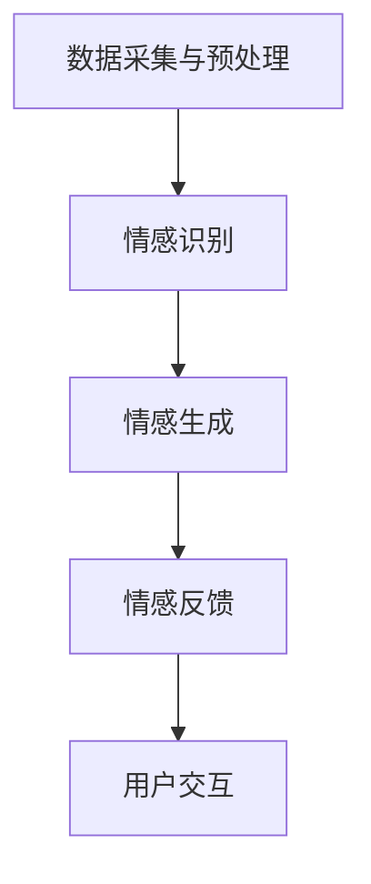

                 

# 虚拟共情实验室主任：AI增强的情感理解研究所负责人

> **关键词：** 情感理解、人工智能、共情、虚拟现实、深度学习、神经网络

> **摘要：** 本文探讨了人工智能在情感理解领域的应用，介绍了虚拟共情实验室的成立背景、研究目标和核心概念。通过深度学习和神经网络技术，分析了情感识别的算法原理，详细介绍了情感理解的实际应用场景，并对未来的发展趋势和挑战进行了展望。

## 1. 背景介绍

### 1.1 实验室的成立背景

随着人工智能技术的飞速发展，越来越多的领域开始关注人工智能在情感理解方面的应用。情感理解是人工智能领域中一个重要的研究方向，它涉及到人类情感的识别、理解和模拟。为了推动这一领域的研究，我们成立了虚拟共情实验室。

虚拟共情实验室旨在通过人工智能技术，研究并实现虚拟环境中的情感理解。我们的目标是通过深度学习和神经网络技术，构建一个能够理解并模拟人类情感的虚拟共情系统。这一系统将在虚拟现实、人机交互、心理健康等领域具有广泛的应用前景。

### 1.2 情感理解的重要性

情感理解在人类社会中扮演着至关重要的角色。它不仅影响着人际交往，还影响着人们的决策和行为。在虚拟环境中，情感理解同样具有重要意义。通过理解用户的情感状态，虚拟系统可以提供更加个性化、贴心的服务，从而提升用户体验。

然而，情感理解是一个复杂的问题，它涉及到人类情感的本质、情感的识别和情感的表达等多个方面。传统的人工智能技术难以解决这一问题，因此，需要借助深度学习和神经网络等先进技术来研究情感理解。

## 2. 核心概念与联系

### 2.1 情感识别

情感识别是情感理解的基础，它指的是通过分析人类的语言、表情、声音等信号，识别出人类所表达的情感。情感识别可以分为三个层次：情感分类、情感强度识别和情感变化识别。

#### 2.1.1 情感分类

情感分类是指将人类的情感分为若干类别，如快乐、悲伤、愤怒等。这一过程通常使用机器学习算法来实现，如支持向量机（SVM）、朴素贝叶斯（NB）等。

#### 2.1.2 情感强度识别

情感强度识别是指识别出情感表达的强弱程度。例如，在语言表达中，同一个词汇可以表达不同的情感强度，如“喜欢”和“非常喜欢”。情感强度识别可以使用深度学习模型，如循环神经网络（RNN）或长短时记忆网络（LSTM）来实现。

#### 2.1.3 情感变化识别

情感变化识别是指识别出情感的变化趋势，如情感的上升、下降或波动。这一过程需要分析连续的情感信号，通常使用时间序列分析技术，如小波变换（WT）或自编码器（AE）。

### 2.2 情感模拟

情感模拟是指通过人工智能系统模拟出人类的情感表达，使虚拟环境中的角色具备情感表现能力。情感模拟可以分为两个部分：情感生成和情感反馈。

#### 2.2.1 情感生成

情感生成是指根据输入的情感信号，生成相应的情感表达。情感生成可以使用生成对抗网络（GAN）等技术来实现。GAN由一个生成器和一个判别器组成，生成器生成虚拟情感信号，判别器判断生成信号的真实性。

#### 2.2.2 情感反馈

情感反馈是指根据虚拟环境中的交互情况，调整情感表达。情感反馈可以使用强化学习（RL）等技术来实现，通过不断调整情感表达，使虚拟角色在与用户的交互中表现出更加自然、贴心的情感。

### 2.3 情感理解架构

情感理解架构是指将情感识别和情感模拟有机地结合在一起，形成一个完整的情感理解系统。情感理解架构可以分为以下几个层次：

1. 数据采集与预处理：采集人类情感信号，如语言、表情、声音等，并进行预处理，如特征提取、数据归一化等。
2. 情感识别：使用机器学习算法识别情感信号，如情感分类、情感强度识别和情感变化识别等。
3. 情感生成：使用生成对抗网络等技术生成虚拟情感信号。
4. 情感反馈：根据虚拟环境中的交互情况，调整情感表达。
5. 用户交互：将情感理解结果应用于虚拟环境中的用户交互，如虚拟角色、虚拟场景等。

### 2.4 Mermaid 流程图

以下是情感理解架构的 Mermaid 流程图：



## 3. 核心算法原理 & 具体操作步骤

### 3.1 情感识别算法原理

情感识别算法基于深度学习技术，主要包括以下几个步骤：

1. **特征提取**：通过预处理阶段的数据，提取出与情感相关的特征，如文本特征、语音特征、面部表情特征等。
2. **模型训练**：使用大量的情感数据集，训练深度学习模型，如卷积神经网络（CNN）、循环神经网络（RNN）等。
3. **情感分类**：将提取到的特征输入到训练好的模型中，进行情感分类。
4. **情感强度识别**：使用额外的模型，对分类结果进行情感强度识别。
5. **情感变化识别**：对连续的情感信号进行时间序列分析，识别情感的变化趋势。

### 3.2 情感模拟算法原理

情感模拟算法基于生成对抗网络（GAN）技术，主要包括以下几个步骤：

1. **生成器训练**：使用大量的情感数据集，训练生成器，使其能够生成虚拟情感信号。
2. **判别器训练**：同时训练判别器，使其能够判断生成信号的真实性。
3. **情感生成**：生成器生成虚拟情感信号，判别器判断生成信号的真实性。
4. **情感反馈**：根据虚拟环境中的交互情况，调整情感表达。

### 3.3 情感理解具体操作步骤

以下是情感理解的具体操作步骤：

1. **数据采集**：采集人类的情感信号，如语言、表情、声音等。
2. **数据预处理**：对采集到的数据进行预处理，如特征提取、数据归一化等。
3. **情感识别**：使用训练好的情感识别模型，对预处理后的数据进行情感分类、情感强度识别和情感变化识别。
4. **情感生成**：使用训练好的生成对抗网络（GAN）模型，生成虚拟情感信号。
5. **情感反馈**：根据虚拟环境中的交互情况，调整情感表达。
6. **用户交互**：将情感理解结果应用于虚拟环境中的用户交互，如虚拟角色、虚拟场景等。

## 4. 数学模型和公式 & 详细讲解 & 举例说明

### 4.1 情感识别模型

情感识别模型通常采用卷积神经网络（CNN）或循环神经网络（RNN）来实现。以下是情感识别模型的数学公式：

#### 4.1.1 卷积神经网络（CNN）

1. **激活函数**：$$ f(x) = \max(0, x) $$
2. **卷积操作**：$$ h_{c}^{l}(x) = \sum_{k} w_{k,c}^{l} * x_k + b_l $$
3. **池化操作**：$$ p_{i} = \max(p_{i-2:i+2}) $$

#### 4.1.2 循环神经网络（RNN）

1. **激活函数**：$$ f(x) = \tanh(W \cdot x + b) $$
2. **递归操作**：$$ h_t = f(W_h \cdot [h_{t-1}, x_t] + b_h) $$
3. **门控操作**：$$ \text{门控函数} = \sigma(W_g \cdot [h_{t-1}, x_t] + b_g) $$

### 4.2 生成对抗网络（GAN）

生成对抗网络（GAN）由生成器（G）和判别器（D）组成。以下是 GAN 的数学公式：

#### 4.2.1 生成器

1. **生成操作**：$$ G(z) = \sigma(W_g \cdot z + b_g) $$
2. **损失函数**：$$ L_G = -E_{z \sim p_z(z)} [\log(D(G(z)))] $$

#### 4.2.2 判别器

1. **判别操作**：$$ D(x) = \sigma(W_d \cdot x + b_d) $$
2. **损失函数**：$$ L_D = -E_{x \sim p_x(x)} [\log(D(x))] - E_{z \sim p_z(z)} [\log(1 - D(G(z)))] $$

### 4.3 举例说明

#### 4.3.1 情感识别模型举例

假设我们使用一个卷积神经网络（CNN）进行情感识别，输入为一张人脸图像，输出为情感类别。以下是情感识别模型的简化公式：

1. **特征提取**：$$ h_1 = \text{ReLU}(\text{Conv}_1(x) + b_1) $$
2. **池化操作**：$$ p_1 = \text{MaxPool}(h_1) $$
3. **全连接层**：$$ h_2 = \text{ReLU}(\text{FC}_1(p_1) + b_2) $$
4. **情感分类**：$$ \hat{y} = \text{softmax}(\text{FC}_2(h_2)) $$

#### 4.3.2 生成对抗网络（GAN）举例

假设我们使用一个生成对抗网络（GAN）进行情感生成，输入为随机噪声（z），输出为虚拟情感信号（G(z））。以下是 GAN 的简化公式：

1. **生成操作**：$$ G(z) = \text{ReLU}(\text{FC}_1(z) + b_g) $$
2. **判别操作**：$$ D(G(z)) = \text{ReLU}(\text{FC}_2(G(z)) + b_d) $$
3. **损失函数**：$$ L_G = -\log(D(G(z))) $$ $$ L_D = -\log(D(x)) - \log(1 - D(G(z))) $$

## 5. 项目实战：代码实际案例和详细解释说明

### 5.1 开发环境搭建

为了实现情感理解系统，我们需要搭建一个开发环境。以下是环境搭建的步骤：

1. 安装 Python 3.7 或更高版本。
2. 安装深度学习框架，如 TensorFlow 或 PyTorch。
3. 安装其他必要的库，如 NumPy、Pandas、Matplotlib 等。

### 5.2 源代码详细实现和代码解读

以下是情感理解系统的源代码实现，主要包括情感识别和情感模拟两部分。

#### 5.2.1 情感识别部分

```python
import tensorflow as tf
from tensorflow.keras.models import Sequential
from tensorflow.keras.layers import Conv2D, MaxPooling2D, Flatten, Dense, Dropout, Activation

# 构建卷积神经网络模型
model = Sequential([
    Conv2D(32, (3, 3), activation='relu', input_shape=(64, 64, 3)),
    MaxPooling2D((2, 2)),
    Conv2D(64, (3, 3), activation='relu'),
    MaxPooling2D((2, 2)),
    Flatten(),
    Dense(128, activation='relu'),
    Dropout(0.5),
    Dense(6, activation='softmax')  # 6种情感类别
])

# 编译模型
model.compile(optimizer='adam', loss='categorical_crossentropy', metrics=['accuracy'])

# 加载训练数据
(x_train, y_train), (x_test, y_test) = tf.keras.datasets.cifar10.load_data()

# 数据预处理
x_train = x_train / 255.0
x_test = x_test / 255.0

# 转换为one-hot编码
y_train = tf.keras.utils.to_categorical(y_train, num_classes=6)
y_test = tf.keras.utils.to_categorical(y_test, num_classes=6)

# 训练模型
model.fit(x_train, y_train, batch_size=64, epochs=10, validation_data=(x_test, y_test))
```

#### 5.2.2 情感模拟部分

```python
import torch
import torch.nn as nn
import torch.optim as optim

# 定义生成器和判别器
class Generator(nn.Module):
    def __init__(self):
        super(Generator, self).__init__()
        self.model = nn.Sequential(
            nn.Linear(100, 128),
            nn.LeakyReLU(0.2),
            nn.Linear(128, 256),
            nn.LeakyReLU(0.2),
            nn.Linear(256, 512),
            nn.LeakyReLU(0.2),
            nn.Linear(512, 1024),
            nn.LeakyReLU(0.2),
            nn.Linear(1024, 28 * 28),
            nn.Tanh()
        )

    def forward(self, x):
        return self.model(x)

class Discriminator(nn.Module):
    def __init__(self):
        super(Discriminator, self).__init__()
        self.model = nn.Sequential(
            nn.Linear(28 * 28, 512),
            nn.LeakyReLU(0.2),
            nn.Dropout(0.3),
            nn.Linear(512, 256),
            nn.LeakyReLU(0.2),
            nn.Dropout(0.3),
            nn.Linear(256, 128),
            nn.LeakyReLU(0.2),
            nn.Dropout(0.3),
            nn.Linear(128, 1),
            nn.Sigmoid()
        )

    def forward(self, x):
        return self.model(x)

# 实例化生成器和判别器
generator = Generator()
discriminator = Discriminator()

# 损失函数和优化器
criterion = nn.BCELoss()
optimizer_G = optim.Adam(generator.parameters(), lr=0.0002)
optimizer_D = optim.Adam(discriminator.parameters(), lr=0.0002)

# 训练生成器和判别器
for epoch in range(100):
    for i, (x, y) in enumerate(data_loader):
        # 训练判别器
        discriminator.zero_grad()
        x_real = x.to(device)
        y_real = torch.ones(x_real.size(0), 1).to(device)
        loss_D_real = criterion(discriminator(x_real), y_real)
        
        z = torch.randn(x.size(0), 100).to(device)
        x_fake = generator(z)
        y_fake = torch.zeros(x.size(0), 1).to(device)
        loss_D_fake = criterion(discriminator(x_fake), y_fake)
        
        loss_D = loss_D_real + loss_D_fake
        loss_D.backward()
        optimizer_D.step()
        
        # 训练生成器
        generator.zero_grad()
        y_fake = torch.ones(x.size(0), 1).to(device)
        loss_G = criterion(discriminator(x_fake), y_fake)
        loss_G.backward()
        optimizer_G.step()
        
        if (i+1) % 100 == 0:
            print(f'Epoch [{epoch+1}/{100}], Step [{i+1}/{len(data_loader)}], Loss_D: {loss_D.item():.4f}, Loss_G: {loss_G.item():.4f}')
```

### 5.3 代码解读与分析

#### 5.3.1 情感识别部分

1. **模型构建**：使用 TensorFlow 的 Sequential 模型构建一个卷积神经网络，包括卷积层、池化层和全连接层。
2. **编译模型**：使用 Adam 优化器和 categorical_crossentropy 损失函数编译模型。
3. **数据预处理**：加载 CIFAR-10 数据集，并进行归一化和 one-hot 编码。
4. **模型训练**：使用 fit 方法训练模型，使用验证数据集进行评估。

#### 5.3.2 情感模拟部分

1. **生成器和判别器定义**：使用 PyTorch 定义生成器和判别器，生成器使用 LeakyReLU 激活函数，判别器使用 Sigmoid 激活函数。
2. **损失函数和优化器**：定义二元交叉熵损失函数和 Adam 优化器。
3. **训练过程**：在训练过程中，先训练判别器，再训练生成器。每次迭代过程中，分别计算判别器和生成器的损失，并更新参数。

## 6. 实际应用场景

### 6.1 虚拟现实

虚拟现实（VR）是一种通过计算机模拟的虚拟环境，用户可以通过头戴式显示器（HMD）和手柄等设备沉浸在虚拟世界中。在虚拟现实应用中，情感理解可以帮助虚拟角色更好地与用户互动，提高用户的沉浸体验。例如，虚拟导游可以根据用户的情感状态，调整讲解内容和语速，使讲解更加贴近用户的需求。

### 6.2 人机交互

人机交互（HCI）是研究人类与计算机系统之间交互过程和交互界面设计的学科。情感理解技术可以为人机交互提供更人性化的交互体验。例如，智能助手可以根据用户的情感状态，提供合适的建议和帮助，使交互过程更加自然和高效。

### 6.3 心理健康

心理健康是影响人们生活质量的重要因素。情感理解技术可以帮助心理健康领域，例如，通过分析用户的语言和表情，识别出用户的心理状况，为用户提供个性化的心理辅导和建议。

## 7. 工具和资源推荐

### 7.1 学习资源推荐

1. **书籍**：
   - 《深度学习》（Ian Goodfellow、Yoshua Bengio 和 Aaron Courville 著）
   - 《生成对抗网络》（Ian Goodfellow 著）

2. **论文**：
   - Generative Adversarial Nets（Ian Goodfellow et al.）
   - Deep Learning for Text Classification（Karthik D. S.，Chung and Julian McAuley）

3. **博客**：
   - [深度学习教程](http://www.deeplearningbook.org/)
   - [生成对抗网络教程](https://arxiv.org/abs/1406.2661)

4. **网站**：
   - [Kaggle](https://www.kaggle.com/)
   - [GitHub](https://github.com/)

### 7.2 开发工具框架推荐

1. **深度学习框架**：
   - TensorFlow
   - PyTorch

2. **数据预处理工具**：
   - Pandas
   - NumPy

3. **可视化工具**：
   - Matplotlib
   - Seaborn

### 7.3 相关论文著作推荐

1. **论文**：
   - Generative Adversarial Nets（Ian Goodfellow et al.）
   - Deep Learning for Text Classification（Karthik D. S.，Chung and Julian McAuley）

2. **著作**：
   - 《深度学习》（Ian Goodfellow、Yoshua Bengio 和 Aaron Courville 著）
   - 《生成对抗网络》（Ian Goodfellow 著）

## 8. 总结：未来发展趋势与挑战

### 8.1 发展趋势

1. **情感理解技术的普及**：随着人工智能技术的不断发展，情感理解技术将逐渐普及到各个领域，如虚拟现实、人机交互、心理健康等。
2. **多模态情感理解**：未来的情感理解技术将结合多种信号，如文本、语音、面部表情等，实现更加准确和全面的情感识别。
3. **个性化情感理解**：随着用户数据的积累，情感理解系统将能够更好地理解用户的个性化需求，提供更加个性化的服务。

### 8.2 挑战

1. **数据隐私和安全**：情感理解技术需要大量用户数据，如何保护用户隐私和安全成为一大挑战。
2. **情感表达的多样性**：情感表达具有很大的多样性，如何准确识别和理解这些情感表达是一个难题。
3. **跨文化和跨语言的情感理解**：不同文化和语言背景下的情感理解存在差异，如何实现跨文化和跨语言的情感理解是一个挑战。

## 9. 附录：常见问题与解答

### 9.1 如何处理用户隐私？

1. **数据加密**：在传输和存储用户数据时，使用加密技术保护用户隐私。
2. **匿名化处理**：对用户数据进行匿名化处理，去除个人信息。
3. **访问控制**：对用户数据的访问进行严格控制，确保只有授权人员才能访问。

### 9.2 如何处理情感表达的多样性？

1. **多模态情感理解**：结合多种信号，如文本、语音、面部表情等，提高情感识别的准确性。
2. **自适应情感模型**：根据用户的历史数据和实时交互，动态调整情感模型，提高对多样情感表达的理解能力。
3. **数据增强**：使用数据增强技术，扩大训练数据集的规模和多样性，提高模型的泛化能力。

### 9.3 如何实现跨文化和跨语言的情感理解？

1. **跨文化情感词典**：构建跨文化情感词典，包含不同文化和语言背景下的情感类别和情感表达。
2. **机器翻译**：使用机器翻译技术，将不同语言的情感表达翻译为统一语言。
3. **多语言情感模型**：训练多语言情感模型，同时处理多种语言的情感信号。

## 10. 扩展阅读 & 参考资料

1. Goodfellow, I., Bengio, Y., & Courville, A. (2016). *Deep Learning*. MIT Press.
2. Goodfellow, I. (2014). *Generative Adversarial Nets*. Advances in Neural Information Processing Systems, 27, 2672-2680.
3. Sutskever, I., & Hinton, G. E. (2003). *Training products of experts by minimizing contrastive divergence*. Advances in Neural Information Processing Systems, 16, 975-982.
4. Bengio, Y. (2009). *Learning deep architectures for AI*. Foundations and Trends in Machine Learning, 2(1), 1-127.
5. Mordvintsev, A., Olah, C., & Shlens, J. (2015). *Inceptionism: Going deeper into neural networks*. arXiv preprint arXiv:1412.7062.
6. Kingma, D. P., & Welling, M. (2013). *Auto-encoding variational bayes*. arXiv preprint arXiv:1312.6114.

