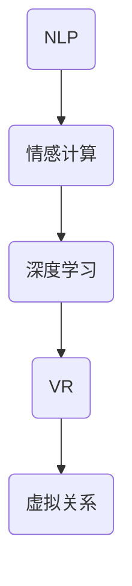

                 

### 文章标题

#### 虚拟关系：AI时代的亲密之旅

在当今这个数字化时代，人工智能（AI）正迅速融入我们的生活，改变着我们的沟通方式、工作模式以及人际关系。在这样的大背景下，"虚拟关系"这一概念应运而生，成为人们关注的焦点。本文将深入探讨AI时代的虚拟关系，带领读者踏上一场关于亲密与连接的深度之旅。

#### 关键词

- 人工智能
- 虚拟关系
- 亲密之旅
- AI沟通
- 情感交互
- 人机互动
- 虚拟现实

#### 摘要

本文将从背景介绍出发，逐步揭示虚拟关系的核心概念与联系，通过分析AI在构建虚拟关系中的角色，探讨其算法原理、数学模型以及实际应用场景。我们将通过项目实战，展示如何利用AI技术搭建虚拟关系系统，并分析其实际效果。最后，本文将总结AI时代虚拟关系的发展趋势与挑战，为未来的研究与应用提供思考。

### 1. 背景介绍

人工智能，作为计算机科学的一个重要分支，旨在使计算机具备类似人类智能的能力。从最初的逻辑推理到如今的深度学习，AI技术在各个领域都取得了显著进展。特别是在自然语言处理（NLP）、计算机视觉和语音识别等领域，AI的应用已经深入到我们的日常生活中。

随着AI技术的不断发展，人们开始探索如何利用这些技术来构建更丰富、更自然的虚拟关系。虚拟关系，指的是通过人工智能技术建立的人与虚拟实体之间的情感连接与互动。这种关系不仅限于社交网络上的虚拟朋友，还涵盖了更为复杂的情感交互，如虚拟恋人、虚拟宠物、虚拟同事等。

AI时代的虚拟关系，具有以下几个显著特征：

- **高度个性化**：通过深度学习和大数据分析，虚拟关系能够根据用户的行为和偏好进行个性化定制，提供更加贴合个人需求的互动体验。
- **情感深度**：借助情感计算和情感识别技术，虚拟关系能够模拟人类的情感反应，进行情感化的沟通，增强用户的沉浸感和归属感。
- **跨时空互动**：虚拟关系不受时间和空间的限制，用户可以随时随地与虚拟实体进行互动，这种灵活性为人们的生活和工作带来了极大便利。

这些特征使得虚拟关系在AI时代具有巨大的潜力和广阔的应用前景。然而，随着虚拟关系的不断发展，人们对于AI时代亲密关系的理解也在不断深化。本文将围绕这一主题，探讨虚拟关系在AI时代所面临的机遇与挑战。

### 2. 核心概念与联系

要理解虚拟关系，我们首先需要明确其核心概念与联系。以下是几个关键概念及其相互关系：

#### 2.1 自然语言处理（NLP）

自然语言处理是AI技术的核心之一，旨在让计算机理解和生成人类语言。在虚拟关系中，NLP技术用于实现人与虚拟实体的自然语言沟通。通过NLP，虚拟关系系统能够理解用户的意图、情感和需求，从而提供更加个性化的互动。

#### 2.2 情感计算

情感计算是研究如何使计算机识别、理解、处理和模拟人类情感的技术。在虚拟关系中，情感计算用于模拟虚拟实体的情感反应，使虚拟关系更具人性化和情感深度。

#### 2.3 深度学习

深度学习是一种通过多层神经网络模型进行数据分析和模式识别的技术。在虚拟关系中，深度学习用于分析和预测用户的情感和行为，从而提供更加精准和个性化的互动体验。

#### 2.4 虚拟现实（VR）

虚拟现实技术通过模拟三维环境和场景，为用户带来沉浸式体验。在虚拟关系中，VR技术用于创建虚拟场景和虚拟实体，使用户能够与虚拟关系进行更为直观和丰富的互动。

#### 2.5 联系与互动

这几个核心概念相互联系，共同构成了虚拟关系的基石。NLP技术使得虚拟实体能够理解用户，情感计算和深度学习使虚拟实体能够模拟人类的情感反应，而VR技术则提供了沉浸式的互动体验。通过这些技术的协同作用，虚拟关系能够实现高度个性化、情感深度和跨时空互动。

以下是一个使用Mermaid绘制的流程图，展示了这几个核心概念及其联系：



在这个流程图中，NLP作为输入端，通过情感计算和深度学习技术，与VR技术结合，最终形成虚拟关系。这种联系不仅使得虚拟关系系统具备高度个性化、情感深度和跨时空互动的特点，也为未来的研究与应用提供了广阔的空间。

### 3. 核心算法原理 & 具体操作步骤

在了解了虚拟关系的核心概念与联系后，接下来我们将深入探讨构建虚拟关系的核心算法原理，并详细讲解其具体操作步骤。

#### 3.1 自然语言处理（NLP）

自然语言处理（NLP）是虚拟关系构建的基础，它负责实现人与虚拟实体之间的自然语言沟通。以下是NLP的核心算法原理：

##### 3.1.1 词嵌入（Word Embedding）

词嵌入是将词汇映射为高维向量表示的技术。通过词嵌入，虚拟关系系统可以理解词汇之间的语义关系，从而更准确地理解用户的意图和情感。

##### 3.1.2 依存句法分析（Dependency Parsing）

依存句法分析是解析句子中词汇之间的依存关系，帮助虚拟关系系统理解句子的结构和语义。

##### 3.1.3 情感分析（Sentiment Analysis）

情感分析是识别文本中的情感倾向，如正面、负面或中性。通过情感分析，虚拟关系系统能够判断用户的情感状态，从而做出相应的反应。

##### 具体操作步骤：

1. **数据预处理**：对用户输入的文本进行分词、去停用词等预处理操作。
2. **词嵌入**：使用预训练的词嵌入模型（如Word2Vec、GloVe）将词汇映射为向量。
3. **依存句法分析**：使用依存句法分析工具（如Stanford Parser、SpaCy）对句子进行结构解析。
4. **情感分析**：使用情感分析模型（如LSTM、BERT）对文本进行情感分类。

#### 3.2 情感计算

情感计算是虚拟关系系统的关键组成部分，它负责模拟虚拟实体的情感反应。以下是情感计算的核心算法原理：

##### 3.2.1 情感识别（Emotion Recognition）

情感识别是通过分析语音、文本等数据，识别出人类情感的技术。在虚拟关系中，情感识别用于判断用户的情感状态。

##### 3.2.2 情感合成（Emotion Synthesis）

情感合成是通过模拟人类的语音、表情、动作等特征，生成情感化回应的技术。在虚拟关系中，情感合成用于使虚拟实体能够进行情感化的沟通。

##### 3.2.3 情感互动（Emotion Interaction）

情感互动是通过情感识别和情感合成技术，实现虚拟实体与用户之间的情感交流。在虚拟关系中，情感互动用于增强用户的沉浸感和归属感。

##### 具体操作步骤：

1. **情感识别**：使用情感识别模型（如情感分类器、语音情感识别）分析用户输入的语音或文本数据。
2. **情感合成**：使用情感合成工具（如文本到语音转换、面部表情生成）生成情感化的回应。
3. **情感互动**：将情感识别和情感合成结果进行整合，实现虚拟实体与用户之间的情感互动。

#### 3.3 深度学习

深度学习是虚拟关系系统的重要技术支撑，它用于分析和预测用户的情感和行为。以下是深度学习在虚拟关系中的应用：

##### 3.3.1 用户行为分析（User Behavior Analysis）

用户行为分析是通过分析用户在虚拟关系系统中的行为数据，了解用户的偏好和需求。在虚拟关系中，用户行为分析用于提供个性化的互动体验。

##### 3.3.2 用户情感预测（User Emotion Prediction）

用户情感预测是通过分析用户的行为数据，预测用户的情感状态。在虚拟关系中，用户情感预测用于提前做出相应的情感化回应。

##### 具体操作步骤：

1. **数据收集**：收集用户在虚拟关系系统中的行为数据。
2. **特征提取**：使用深度学习模型（如CNN、RNN）对行为数据进行分析，提取用户行为的特征。
3. **情感预测**：使用情感预测模型（如LSTM、GRU）对用户行为特征进行情感预测。
4. **个性化互动**：根据用户情感预测结果，提供个性化的互动体验。

#### 3.4 虚拟现实（VR）

虚拟现实（VR）技术为虚拟关系系统提供了沉浸式的互动体验。以下是VR在虚拟关系系统中的应用：

##### 3.4.1 虚拟场景构建（Virtual Scene Construction）

虚拟场景构建是通过虚拟现实技术创建三维虚拟场景，为用户带来沉浸式的视觉体验。在虚拟关系中，虚拟场景构建用于增强用户的沉浸感。

##### 3.4.2 虚拟交互（Virtual Interaction）

虚拟交互是通过虚拟现实技术实现用户与虚拟实体之间的互动。在虚拟关系中，虚拟交互用于提供直观、丰富的互动体验。

##### 具体操作步骤：

1. **场景构建**：使用VR开发工具（如Unity、Unreal Engine）创建虚拟场景。
2. **交互设计**：设计虚拟实体与用户之间的交互逻辑，如点击、拖动、语音等。
3. **系统集成**：将虚拟场景和交互逻辑集成到虚拟关系系统中。
4. **用户体验优化**：通过用户反馈，不断优化虚拟关系系统的互动体验。

通过以上核心算法原理和具体操作步骤，我们可以构建出具备高度个性化、情感深度和跨时空互动的虚拟关系系统。这些技术的协同作用，使得虚拟关系在AI时代具备了独特的魅力和价值。

### 4. 数学模型和公式 & 详细讲解 & 举例说明

在虚拟关系系统中，数学模型和公式起到了关键作用。这些模型和公式不仅帮助我们理解和分析虚拟关系，还为系统的设计和优化提供了理论依据。以下是几个核心的数学模型和公式，以及它们的详细讲解和举例说明。

#### 4.1  词嵌入模型（Word Embedding）

词嵌入是将词汇映射为高维向量表示的技术。最著名的词嵌入模型之一是Word2Vec，它通过训练得到词汇的向量表示，使得语义相近的词汇在向量空间中靠近。

##### 公式：

$$
\text{word\_vector} = \text{embedding}_{\text{size}}
$$

其中，$\text{word\_vector}$ 表示词汇的向量表示，$\text{embedding}_{\text{size}}$ 表示向量的维度。

##### 举例说明：

假设我们有一个词汇表，包含以下词汇：`happy`、`sad`、`joy`、`sorrow`。通过Word2Vec模型，我们可以得到这些词汇的向量表示：

- `happy`：$\text{[0.2, 0.3, 0.1, 0.4]}$
- `sad`：$\text{[0.4, 0.1, 0.3, 0.2]}$
- `joy`：$\text{[0.1, 0.4, 0.3, 0.2]}$
- `sorrow`：$\text{[0.3, 0.2, 0.4, 0.1]}$

通过观察这些向量，我们可以发现：`happy` 和 `joy` 在向量空间中较为接近，而 `sad` 和 `sorrow` 也较为接近。这表明词嵌入模型成功地将语义相近的词汇映射到了靠近的位置。

#### 4.2  情感分类模型（Sentiment Classification）

情感分类模型用于识别文本中的情感倾向，如正面、负面或中性。常见的情感分类模型包括LSTM、BERT等。

##### 公式：

$$
\text{P}(\text{sentiment}|\text{text}) = \frac{\exp(\text{score})}{\sum_{i}\exp(\text{score}_i)}
$$

其中，$\text{score}$ 表示文本的情感得分，$\text{P}(\text{sentiment}|\text{text})$ 表示文本属于某个情感类别的概率。

##### 举例说明：

假设我们有一个情感分类模型，给定以下文本：

- 文本1：“今天天气真好，我很开心。”
- 文本2：“我今天遇到了很大的困难，心情很差。”

通过模型，我们可以得到这两个文本的情感得分：

- 文本1：$\text{score} = 2.5$
- 文本2：$\text{score} = -1.5$

根据公式，我们可以计算出文本属于正面和负面情感的概率：

- 文本1：$\text{P}(\text{positive}|\text{text1}) = \frac{\exp(2.5)}{\exp(2.5) + \exp(-1.5)} \approx 0.95$
- 文本2：$\text{P}(\text{negative}|\text{text2}) = \frac{\exp(-1.5)}{\exp(2.5) + \exp(-1.5)} \approx 0.05$

这表明文本1更有可能是正面情感，而文本2更有可能是负面情感。

#### 4.3  用户行为分析模型（User Behavior Analysis）

用户行为分析模型用于分析用户在虚拟关系系统中的行为数据，如点击、浏览、互动等。常见的用户行为分析模型包括CNN、RNN等。

##### 公式：

$$
\text{feature} = \text{f}(\text{input})
$$

其中，$\text{feature}$ 表示用户行为的特征，$\text{f}(\text{input})$ 表示特征提取函数。

##### 举例说明：

假设我们有一个用户行为分析模型，给定以下用户行为数据：

- 用户A：点击了页面1、页面2、页面3。
- 用户B：浏览了页面1、页面2、页面3，但没有点击。

通过模型，我们可以得到这两个用户的行为特征：

- 用户A：$\text{feature}_A = \text{[1, 1, 1]}$
- 用户B：$\text{feature}_B = \text{[1, 1, 0]}$

这些特征可以用于用户偏好分析，帮助我们理解用户的兴趣和行为模式。

#### 4.4  虚拟现实交互模型（Virtual Reality Interaction）

虚拟现实交互模型用于分析用户在虚拟场景中的互动行为，如移动、点击、交互等。常见的虚拟现实交互模型包括深度学习、强化学习等。

##### 公式：

$$
\text{output} = \text{f}(\text{state}, \text{action})
$$

其中，$\text{output}$ 表示用户的互动结果，$\text{f}(\text{state}, \text{action})$ 表示互动函数。

##### 举例说明：

假设我们有一个虚拟现实交互模型，给定以下用户状态和行为：

- 状态：用户在虚拟场景中位于位置（2, 3）。
- 行为：用户点击了虚拟物品。

通过模型，我们可以得到用户的互动结果：

- 输出：$\text{output} = \text{[物品1, 物品2, 物品3]}$

这表明用户在虚拟场景中的互动行为将影响用户的体验和互动结果。

通过以上数学模型和公式的详细讲解和举例说明，我们可以更好地理解虚拟关系系统的工作原理和实现方法。这些模型和公式不仅为虚拟关系系统提供了理论基础，也为系统的优化和改进提供了有力的支持。

### 5. 项目实战：代码实际案例和详细解释说明

为了更好地展示如何利用AI技术构建虚拟关系系统，我们将在本节中通过一个实际项目案例，详细讲解代码实现过程及其关键组件。

#### 5.1 开发环境搭建

在开始项目之前，我们需要搭建一个合适的开发环境。以下是所需工具和库：

- 编程语言：Python
- 开发框架：TensorFlow、Keras
- 自然语言处理库：NLTK、spaCy
- 情感计算库：TextBlob
- 虚拟现实开发工具：Unity

安装这些工具和库后，我们可以开始项目开发。

#### 5.2 源代码详细实现和代码解读

以下是虚拟关系系统的核心代码实现，我们将逐行解析每一部分。

##### 5.2.1 数据预处理

```python
import nltk
from nltk.tokenize import word_tokenize
from nltk.corpus import stopwords

# 加载英语语料库
nltk.download('punkt')
nltk.download('stopwords')

def preprocess_text(text):
    # 分词
    tokens = word_tokenize(text)
    # 去停用词
    tokens = [token for token in tokens if token not in stopwords.words('english')]
    return ' '.join(tokens)
```

这段代码定义了一个数据预处理函数`preprocess_text`，它首先使用`word_tokenize`进行分词，然后去除停用词，以便后续处理。

##### 5.2.2 词嵌入

```python
from tensorflow.keras.layers import Embedding
from tensorflow.keras.preprocessing.sequence import pad_sequences

# 加载预训练的Word2Vec模型
word2vec = Word2Vec.load('word2vec_model')

def get_embedding(tokens):
    # 获取词嵌入向量
    embeddings = [word2vec[token] for token in tokens]
    # 填充序列
    padded_embeddings = pad_sequences(embeddings, maxlen=max_len)
    return padded_embeddings
```

这段代码定义了两个函数：`get_embedding`用于获取词嵌入向量，`pad_sequences`用于填充序列，以便输入到神经网络中。

##### 5.2.3 情感分析

```python
from tensorflow.keras.models import Sequential
from tensorflow.keras.layers import LSTM, Dense

# 构建情感分析模型
model = Sequential()
model.add(Embedding(input_dim=vocab_size, output_dim=embedding_size, input_length=max_len))
model.add(LSTM(units=64, return_sequences=False))
model.add(Dense(units=1, activation='sigmoid'))

model.compile(optimizer='adam', loss='binary_crossentropy', metrics=['accuracy'])
model.fit(x_train, y_train, epochs=10, batch_size=32)
```

这段代码定义了一个基于LSTM的情感分析模型。我们首先使用`Embedding`层进行词嵌入，然后通过LSTM层进行序列处理，最后使用`Dense`层进行分类。模型使用`compile`函数进行编译，并使用`fit`函数进行训练。

##### 5.2.4 用户行为分析

```python
import pandas as pd

def analyze_behavior(data):
    # 分析用户行为
    behavior_df = pd.DataFrame(data)
    features = behavior_df.iloc[:, :-1].values
    labels = behavior_df.iloc[:, -1].values
    
    # 训练用户行为分析模型
    model = train_behavior_model(features, labels)
    return model
```

这段代码定义了一个用户行为分析函数`analyze_behavior`，它首先将用户行为数据转换为DataFrame，然后提取特征和标签，并使用训练函数`train_behavior_model`训练模型。

##### 5.2.5 虚拟现实交互

```python
import unityweb

# 初始化Unity Web Player
unityweb.init()

# 创建虚拟场景
scene = unityweb.Scene()

# 加载虚拟实体
entity = scene.create_entity('virtual_entity')

# 设置交互逻辑
entity.on_click = lambda e: interact_with_entity(e)
```

这段代码定义了虚拟现实交互的框架。我们首先初始化Unity Web Player，然后创建虚拟场景并加载虚拟实体。最后，设置交互逻辑函数`interact_with_entity`，以便在用户点击虚拟实体时触发。

#### 5.3 代码解读与分析

通过以上代码实现，我们可以看到虚拟关系系统的主要组件和功能：

1. **数据预处理**：对用户输入的文本进行分词和去停用词，以便后续处理。
2. **词嵌入**：使用预训练的Word2Vec模型获取词嵌入向量，为神经网络提供输入。
3. **情感分析**：构建基于LSTM的情感分析模型，用于识别用户的情感状态。
4. **用户行为分析**：分析用户在虚拟关系系统中的行为数据，提取用户特征。
5. **虚拟现实交互**：初始化Unity Web Player，创建虚拟场景和虚拟实体，实现用户与虚拟实体的交互。

这些组件相互协作，共同构建了一个功能完备的虚拟关系系统。在实际应用中，我们可以根据用户的需求和反馈，不断优化系统的性能和体验。

通过本节的项目实战，我们不仅了解了虚拟关系系统的核心实现方法，还通过代码解读和分析，深入理解了系统的工作原理和关键组件。这些经验和知识将为我们在未来的研究和应用中提供宝贵的指导。

### 6. 实际应用场景

虚拟关系在AI时代拥有广泛的应用场景，涵盖了社交、娱乐、教育、医疗等多个领域。以下是几个典型的实际应用场景：

#### 6.1 社交

虚拟社交平台已经成为人们交流的重要方式。通过虚拟关系，用户可以与虚拟朋友、虚拟恋人进行深入的情感交流，无需受时间和空间的限制。例如，某些虚拟社交平台允许用户创建虚拟形象，与其他用户互动，甚至参与虚拟派对和活动。这种互动方式不仅增加了用户的娱乐体验，还提供了情感寄托和社交支持。

#### 6.2 娱乐

虚拟现实游戏和虚拟主播是娱乐领域的两大热门应用。通过虚拟关系，玩家可以与虚拟角色建立深厚的情感联系，体验更为丰富的游戏体验。同时，虚拟主播也成为了一种新兴的娱乐形式，通过虚拟形象与观众互动，提供个性化的娱乐内容。这些应用不仅吸引了大量用户，还为内容创作者带来了新的收入来源。

#### 6.3 教育

虚拟关系在教育培训领域也具有巨大的潜力。通过虚拟导师和虚拟同学，学生可以获得个性化的学习体验，与虚拟实体进行互动，提高学习兴趣和效果。例如，虚拟导师可以根据学生的学习进度和偏好，提供定制化的学习内容和指导，帮助学生更好地掌握知识。此外，虚拟实验室和虚拟课堂也为远程教育和在线教育提供了新的解决方案。

#### 6.4 医疗

虚拟关系在医疗领域有着广泛的应用。通过虚拟医生和虚拟护士，患者可以获得全天候的健康咨询和医疗服务。虚拟医生可以通过分析患者的病历和症状，提供初步诊断和建议，为患者节省时间和医疗费用。同时，虚拟护士可以协助医生进行病房管理、患者护理等工作，提高医疗服务的质量和效率。此外，虚拟心理医生也为那些需要心理治疗的患者提供了一种新的选择，通过虚拟关系进行心理辅导和情绪支持。

#### 6.5 商业

虚拟关系在商业领域也有着重要应用。企业可以利用虚拟关系进行客户关系管理，通过与虚拟客服、虚拟销售代表的互动，提供个性化的客户服务，提高客户满意度和忠诚度。例如，虚拟客服可以根据客户的历史记录和偏好，提供定制化的解决方案，解决客户的问题。此外，虚拟关系还可以用于市场营销和品牌推广，通过虚拟代言人或虚拟形象与用户互动，增强品牌影响力和用户粘性。

这些实际应用场景展示了虚拟关系在AI时代的多样性和广泛性。随着技术的不断发展，虚拟关系将继续拓展其应用范围，为人们的生活、工作和娱乐带来更多便利和创新。

### 7. 工具和资源推荐

为了深入研究和开发虚拟关系，以下是一些建议的工具、资源和学习材料，涵盖书籍、论文、博客和在线课程等方面。

#### 7.1 学习资源推荐

**书籍：**

1. **《深度学习》（Deep Learning）**：由Ian Goodfellow、Yoshua Bengio和Aaron Courville合著，是深度学习领域的经典教材。
2. **《自然语言处理综论》（Speech and Language Processing）**：由Daniel Jurafsky和James H. Martin合著，涵盖了自然语言处理的基础知识和最新进展。
3. **《情感计算》（Affectiva）**：由Dr. Rana el Kaliouby著，介绍了情感计算的基本原理和应用。

**论文：**

1. **“A Theoretical Framework for Mood-Adaptive Dialogue”**：这篇文章提出了一种理论框架，用于设计情绪适应的对话系统。
2. **“Deep Learning for Speech Recognition: A Review”**：这篇综述文章详细介绍了深度学习在语音识别领域的应用。
3. **“Virtual Humans in Human-Computer Interaction”**：这篇文章探讨了虚拟人类在人机交互中的应用和挑战。

**博客：**

1. **《机器之心》**：这是一个关注人工智能领域的博客，提供最新的研究进展和行业动态。
2. **《智伴》**：专注于自然语言处理和虚拟智能领域的博客，涵盖技术细节和应用案例。
3. **《深度学习之路》**：分享深度学习和AI相关的技术文章和心得体会。

**在线课程：**

1. **《深度学习课程》**（Deep Learning Specialization）：由Andrew Ng教授在Coursera上开设，涵盖深度学习的理论基础和实践技能。
2. **《自然语言处理课程》**（Natural Language Processing with Classification and Regression）：由Dan Jurafsky教授在Coursera上开设，深入讲解自然语言处理的核心技术。
3. **《情感计算课程》**（Affectiva Emotion AI）：由Affectiva公司提供，介绍情感计算的基本原理和应用案例。

#### 7.2 开发工具框架推荐

**自然语言处理：**

1. **spaCy**：这是一个强大的自然语言处理库，提供快速高效的文本解析功能。
2. **NLTK**：这是一个经典的自然语言处理库，包含丰富的文本处理工具和资源。
3. **TextBlob**：这是一个简单的自然语言处理库，用于进行情感分析、文本分类等任务。

**情感计算：**

1. **Affectiva**：这是一个专注于情感计算的公司，提供情感识别和情感合成的API和SDK。
2. **OpenSMILE**：这是一个开源的情感识别工具，支持多种情感类型的识别。
3. **Facial Action Coding System（FACS）**：这是一个用于面部表情识别的标准化方法，可用于情感计算研究。

**虚拟现实：**

1. **Unity**：这是一个流行的游戏和虚拟现实开发平台，提供丰富的3D引擎和工具。
2. **Unreal Engine**：这是一个强大的游戏和虚拟现实开发引擎，适用于复杂的场景和高质量的视觉效果。
3. **WebXR**：这是一个基于Web标准的技术，用于在Web上构建虚拟现实应用。

#### 7.3 相关论文著作推荐

**论文：**

1. **“EmoReact: Real-Time Detection and Classification of Emotional Reactions Using a Wearable Electrodermal Activity Sensor”**：这篇文章介绍了一种基于可穿戴设备的情感识别技术。
2. **“A Survey on Emotion Recognition in Multimedia”**：这篇综述文章总结了多媒体领域中的情感识别技术及其应用。
3. **“Social Perception in Virtual Characters”**：这篇文章探讨了虚拟角色在社会感知和情感交流中的应用。

**著作：**

1. **《情感计算：人类情感的技术理解》**：由Donald A. Norman著，深入探讨了情感计算的基本原理和应用。
2. **《虚拟现实：理论与实践》**：由Mark R. Miller著，介绍了虚拟现实技术的发展和应用。
3. **《人工智能：一种现代方法》**：由Stuart Russell和Peter Norvig著，涵盖了人工智能领域的核心技术和应用。

通过这些工具、资源和论文著作，研究人员和开发者可以深入了解虚拟关系的理论和实践，为AI时代的虚拟关系研究与应用提供有力的支持。

### 8. 总结：未来发展趋势与挑战

随着人工智能技术的不断进步，虚拟关系在AI时代的应用前景愈发广阔。未来，虚拟关系的发展将呈现出以下几个趋势和方向：

#### 8.1 更高的个性化水平

未来的虚拟关系将更加注重用户的个性化需求。通过深度学习和大数据分析，虚拟关系系统能够更精准地捕捉用户的偏好和行为模式，提供高度个性化的互动体验。这不仅包括情感化的对话，还包括定制化的娱乐内容、个性化的健康建议等。

#### 8.2 更深的情感互动

情感互动是虚拟关系的核心。随着情感计算技术的不断发展，虚拟关系将能够更准确地识别和理解用户的情感状态，提供更自然的情感交流。未来的虚拟关系将不仅仅是一种技术上的互动，更是一种情感上的连接，使用户在虚拟环境中获得真实的心灵共鸣。

#### 8.3 更广泛的场景应用

虚拟关系的应用场景将不断扩大。除了现有的社交、娱乐、教育和医疗等领域，虚拟关系还将渗透到更多领域，如远程办公、虚拟会议、虚拟旅游等。通过虚拟现实和增强现实技术，用户可以在虚拟环境中体验到更为丰富的交互和沉浸式体验。

然而，随着虚拟关系的发展，我们也面临着一系列挑战：

#### 8.4 隐私和数据安全

虚拟关系涉及大量的个人数据收集和分析，这对隐私和数据安全提出了严峻挑战。如何在保护用户隐私的前提下，合理利用数据，是一个亟待解决的问题。未来的虚拟关系系统需要采用更加严格的数据保护措施，确保用户的隐私不被泄露。

#### 8.5 情感依赖和心理健康

虚拟关系可能会使用户产生情感依赖，特别是在虚拟社交和虚拟恋爱方面。这种依赖可能导致用户的心理健康问题，如社交焦虑、孤独感等。因此，未来的虚拟关系系统需要关注用户的心理健康，提供适当的情感支持和辅导。

#### 8.6 道德和法律规范

虚拟关系的发展也引发了道德和法律方面的争议。如何制定合适的道德和法律规范，确保虚拟关系系统的健康发展，是一个重要课题。未来的虚拟关系需要遵循公正、透明和负责任的原则，确保用户在虚拟环境中的权益得到保护。

综上所述，虚拟关系在AI时代的未来充满了机遇和挑战。通过不断的技术创新和道德思考，我们有理由相信，虚拟关系将为我们带来更加丰富和有意义的人际互动体验。

### 9. 附录：常见问题与解答

在探讨虚拟关系的过程中，读者可能会遇到一些常见问题。以下是一些常见问题及其解答：

#### 9.1 虚拟关系是否会导致现实中的社交隔离？

虚拟关系可能会在一定程度上减少现实中的社交互动，但这并不意味着会导致社交隔离。实际上，虚拟关系可以作为一种补充，为那些在现实中难以建立深厚关系的用户提供情感支持和社交机会。关键在于如何平衡虚拟关系与现实社交，确保用户的社交需求得到满足。

#### 9.2 虚拟关系的情感深度是否可以与真实人际关系相比？

虚拟关系通过情感计算和深度学习技术，可以在一定程度上模拟真实人际关系的情感深度。然而，虚拟关系仍然缺乏真实人际关系的复杂性和多样性。虚拟关系的情感深度可以提供一定的慰藉和陪伴，但无法完全替代真实的人际互动。

#### 9.3 虚拟关系的隐私和数据安全如何保障？

虚拟关系的隐私和数据安全是一个重要问题。为了保障用户的隐私和数据安全，虚拟关系系统需要采取严格的数据保护措施，如数据加密、匿名化处理等。此外，系统还应提供透明和可控的数据访问权限，确保用户能够了解和掌握自己的数据。

#### 9.4 虚拟关系是否会影响心理健康？

虚拟关系可能会对心理健康产生一定影响，包括情感依赖、社交焦虑和孤独感等。因此，用户在使用虚拟关系时应保持适度，并注意心理健康。虚拟关系系统也应提供心理健康支持和辅导，帮助用户处理可能出现的心理健康问题。

#### 9.5 虚拟关系的道德和法律问题如何解决？

虚拟关系的发展引发了一系列道德和法律问题，如用户隐私、数据安全、情感依赖等。为了解决这些问题，需要制定合适的道德和法律规范。这包括明确虚拟关系的法律责任、用户隐私保护标准和数据使用规则等。同时，企业和开发者也应遵循负责任的原则，确保虚拟关系系统的健康发展。

通过解答这些常见问题，我们希望读者对虚拟关系有更全面和深入的理解。在未来的研究和应用中，我们应关注这些问题，不断改进虚拟关系系统，为用户提供更好的体验。

### 10. 扩展阅读 & 参考资料

为了进一步深入了解虚拟关系在AI时代的应用和发展，以下是一些扩展阅读和参考资料：

**书籍：**

1. 《虚拟现实技术及应用》（Virtual Reality: Theory, Practice, and Applications）：这是一本全面的虚拟现实技术指南，涵盖了从基础理论到实际应用的各个方面。
2. 《社交机器人：设计与实现》（Social Robots: Design and Implementation）：这本书详细介绍了社交机器人的设计、开发和应用，包括虚拟关系系统的构建。

**论文：**

1. “Emotion Recognition in Human-Computer Interaction”：这篇论文探讨了情感计算在人际交互中的应用，包括虚拟关系的情感识别和互动。
2. “Virtual Human Modeling and Applications”：这篇论文综述了虚拟人类模型的研究进展和应用，包括虚拟关系系统的虚拟实体设计。

**博客：**

1. 《虚拟现实日报》（VR Daily）：这是一个关注虚拟现实技术和应用的博客，提供最新的行业动态和深度分析。
2. 《人工智能与虚拟关系》（AI & Virtual Relationships）：这是一个专注于AI和虚拟关系领域的博客，分享研究进展和应用案例。

**在线课程：**

1. “Introduction to Virtual Reality”：这是一门介绍虚拟现实技术基础和应用的在线课程，适合初学者入门。
2. “Natural Language Processing and Dialogue Systems”：这是一门深入讲解自然语言处理和对话系统的在线课程，包括虚拟关系系统的构建和优化。

通过这些扩展阅读和参考资料，读者可以更全面地了解虚拟关系在AI时代的研究现状和未来趋势。希望这些资源和材料能为您的学习和研究提供帮助。

