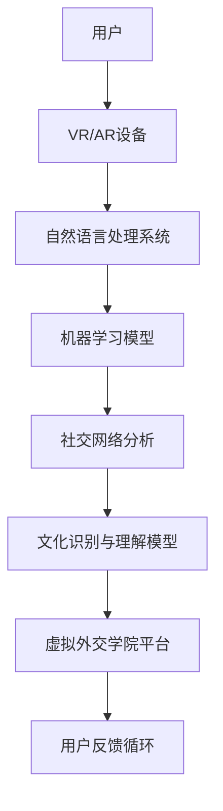

                 

### 背景介绍

#### AI时代的来临：跨文化交流的新挑战

随着人工智能（AI）技术的飞速发展，人类社会正面临着前所未有的变革。从自然语言处理到计算机视觉，从智能机器人到自动驾驶，AI已经渗透到了我们生活的方方面面。在这一背景下，跨文化交流也迎来了新的挑战和机遇。

传统的跨文化交流主要依赖于语言翻译工具和中介服务。然而，这些方法往往存在局限性，如翻译准确性不高、文化差异理解不足等问题。随着AI技术的发展，特别是在自然语言处理和机器学习领域的突破，AI成为了一种全新的跨文化交流工具。通过深度学习和神经网络技术，AI可以更准确地理解和翻译不同语言，并更好地捕捉和传达文化细节。

#### AI在跨文化交流中的应用

AI在跨文化交流中的应用主要体现在以下几个方面：

1. **实时语言翻译**：AI语言翻译工具可以实时翻译不同语言，使得跨文化交流变得更加便捷。例如，谷歌翻译和腾讯翻译君等工具已经广泛应用于国际会议、商务洽谈和旅游等场景。

2. **文化理解与传递**：AI可以通过对大量文化数据的分析，帮助人们更好地理解和欣赏不同文化。例如，AI可以分析文学作品、音乐、电影等文化产品，揭示其中的文化特点和内涵。

3. **智能客服与支持**：AI智能客服系统可以处理多种语言和文化的咨询和需求，提供24/7的支持服务，为跨国企业提供了高效的客户服务解决方案。

4. **教育与培训**：AI可以开发出更加个性化和有效的跨文化交流培训课程，帮助学生和专业人士更好地掌握跨文化交流技能。

#### 跨文化交流培训的需求

在全球化背景下，跨文化交流技能已经成为许多企业和个人的必备技能。无论是跨国企业的员工，还是国际学生和留学生，都需要具备跨文化交流能力，以更好地适应和融入不同的文化环境。

传统的跨文化交流培训方式存在一些问题，如培训内容单一、实践机会有限等。而AI技术的引入，可以为跨文化交流培训带来革命性的变化。通过虚拟现实（VR）和增强现实（AR）技术，可以创建一个真实的跨文化交流环境，让学生和专业人士在虚拟世界中实践和体验跨文化交流。

#### 虚拟外交学院的提出

为了应对AI时代跨文化交流培训的需求，我们提出了虚拟外交学院的概念。虚拟外交学院是一个基于AI技术的跨文化交流培训平台，旨在为全球学习者提供一个沉浸式的跨文化交流环境。

虚拟外交学院的主要目标是：

1. 提供个性化的跨文化交流培训课程，满足不同学习者的需求。
2. 创建一个虚拟的跨文化交流社区，促进不同文化之间的交流和理解。
3. 利用AI技术，实现高效的语言翻译和文化理解，提高跨文化交流的质量和效果。

通过虚拟外交学院，我们希望能够为全球学习者提供一个全新的跨文化交流学习体验，帮助他们更好地适应和融入不同的文化环境，促进全球文化的多样性和融合。

#### 总结

本文介绍了AI时代跨文化交流的背景和挑战，探讨了AI在跨文化交流中的应用，并提出了虚拟外交学院的概念。虚拟外交学院将利用AI技术，为全球学习者提供一个沉浸式的跨文化交流培训平台，满足他们在全球化背景下的跨文化交流需求。接下来，我们将进一步探讨虚拟外交学院的架构和功能，以及如何利用AI技术实现跨文化交流培训的个性化、高效化和多样化。

#### 核心概念与联系

为了深入理解虚拟外交学院的架构和功能，我们首先需要介绍一些核心概念，并展示它们之间的联系。以下是本文将要讨论的核心概念：

1. **虚拟现实（VR）**：通过计算机生成一个三维的模拟环境，用户可以在其中与虚拟物体进行交互。
2. **增强现实（AR）**：将虚拟信息叠加到现实世界中，使用户能够在真实环境中看到和与虚拟对象互动。
3. **自然语言处理（NLP）**：使计算机能够理解、解释和生成人类语言的技术。
4. **机器学习（ML）**：让计算机从数据中自动学习并改进性能的算法和技术。
5. **社交网络分析（SNA）**：研究社交网络的结构和属性，以及个体在其中的行为和互动。
6. **文化识别与理解模型**：用于识别和理解不同文化特征和价值的算法和模型。

#### Mermaid流程图

为了更好地展示这些概念之间的联系，我们使用Mermaid流程图来绘制虚拟外交学院的架构。以下是一个简化的流程图：



- **用户**：通过VR/AR设备与虚拟外交学院平台交互。
- **VR/AR设备**：生成和呈现虚拟环境，用户可以在其中进行跨文化交流活动。
- **自然语言处理系统**：实时处理用户的语言输入，确保跨语言交流的准确性。
- **机器学习模型**：不断学习和优化自然语言处理、社交网络分析和文化识别与理解模型。
- **社交网络分析**：分析用户在平台中的互动行为，识别社交网络结构。
- **文化识别与理解模型**：帮助平台理解和识别不同文化特征，为用户提供定制化的文化体验。
- **虚拟外交学院平台**：整合所有技术和功能，为用户提供跨文化交流的环境和工具。
- **用户反馈循环**：用户在平台上的活动数据将反馈给系统，用于持续改进平台和模型。

#### 核心概念原理和架构

1. **虚拟现实（VR）**和**增强现实（AR）**：
   - **原理**：VR通过头戴显示器、传感器等设备将用户完全沉浸在一个虚拟环境中，而AR则通过手机、平板电脑等设备将虚拟信息叠加到现实世界中。
   - **架构**：VR设备通常包括头戴显示器、传感器、控制器等硬件，以及相应的软件系统来生成和渲染虚拟环境。AR设备则包括相机、显示屏等硬件，以及用于叠加虚拟信息的软件系统。

2. **自然语言处理（NLP）**：
   - **原理**：NLP通过算法和模型来理解和生成人类语言，包括文本分析、语音识别、机器翻译等。
   - **架构**：NLP系统通常包括预处理、特征提取、模型训练和推理等模块。预处理步骤包括文本清洗、分词、词性标注等；特征提取步骤提取文本中的关键信息；模型训练和推理步骤利用这些信息进行语言理解和生成。

3. **机器学习（ML）**：
   - **原理**：ML是一种让计算机从数据中自动学习和改进性能的算法和技术。
   - **架构**：ML系统包括数据收集、数据预处理、模型训练、模型评估和部署等环节。数据收集和预处理步骤准备训练数据；模型训练步骤训练模型；模型评估步骤评估模型性能；模型部署步骤将模型应用到实际应用中。

4. **社交网络分析（SNA）**：
   - **原理**：SNA通过分析社交网络的结构和属性，研究个体在网络中的行为和互动。
   - **架构**：SNA系统通常包括数据收集、网络建模、网络分析等模块。数据收集步骤收集社交网络数据；网络建模步骤建立社交网络模型；网络分析步骤分析网络结构、节点属性和互动行为。

5. **文化识别与理解模型**：
   - **原理**：该模型通过算法和模型识别和理解不同文化特征和价值。
   - **架构**：文化识别与理解模型包括数据收集、特征提取、文化识别和解释等模块。数据收集步骤收集文化相关数据；特征提取步骤提取文化特征；文化识别和解释步骤识别和理解不同文化。

这些核心概念和架构共同构成了虚拟外交学院的技术基础，使得平台能够提供个性化的跨文化交流培训和环境。在接下来的章节中，我们将进一步探讨这些概念在虚拟外交学院中的应用和实现细节。

#### 核心算法原理 & 具体操作步骤

为了深入探讨虚拟外交学院的工作原理，我们需要详细解释其中的核心算法，并展示这些算法的具体操作步骤。以下是虚拟外交学院中几个关键算法的介绍和步骤：

##### 1. 自然语言处理（NLP）算法

**原理**：自然语言处理算法旨在让计算机理解和生成人类语言。这一算法通过深度学习和神经网络技术，实现对文本的语义分析、情感分析和语言翻译等功能。

**操作步骤**：

1. **数据预处理**：
   - **文本清洗**：去除文本中的无关信息，如HTML标签、标点符号等。
   - **分词**：将文本分割成单词或短语。
   - **词性标注**：为每个单词或短语标注词性（如名词、动词、形容词等）。

2. **特征提取**：
   - **词嵌入**：将文本中的每个词转换为一个固定长度的向量表示。
   - **句子表示**：利用词嵌入和神经网络，将整句转换为一个高维向量表示。

3. **模型训练**：
   - **语言模型训练**：训练一个语言模型，用于预测下一个单词或短语。
   - **语义分析**：训练一个语义分析模型，用于理解文本的语义含义。

4. **情感分析**：
   - **情感词典**：构建一个情感词典，包含不同情感词汇和对应的情感极性。
   - **文本情感分析**：利用情感词典和机器学习模型，对文本进行情感极性分类。

5. **语言翻译**：
   - **双语数据训练**：使用大量的双语语料库，训练一个翻译模型。
   - **翻译推理**：利用翻译模型，将一种语言的文本翻译成另一种语言。

##### 2. 机器学习（ML）算法

**原理**：机器学习算法让计算机从数据中自动学习和改进性能。在虚拟外交学院中，ML算法用于优化自然语言处理、社交网络分析和文化识别与理解模型。

**操作步骤**：

1. **数据收集**：
   - **用户交互数据**：收集用户在平台上的交互数据，如发言、回复、点赞等。
   - **文化数据**：收集不同文化相关的数据，如文学作品、音乐、电影等。

2. **数据预处理**：
   - **清洗和标准化**：清洗和标准化数据，使其适合训练模型。
   - **特征提取**：提取数据中的关键特征，用于模型训练。

3. **模型训练**：
   - **监督学习**：使用标注数据，训练监督学习模型。
   - **无监督学习**：使用未标注数据，训练无监督学习模型。

4. **模型评估**：
   - **交叉验证**：使用交叉验证方法，评估模型性能。
   - **A/B测试**：在不同用户群体中进行A/B测试，评估模型效果。

5. **模型部署**：
   - **模型更新**：根据评估结果，更新和优化模型。
   - **实时推理**：在用户交互过程中，实时应用模型进行推理。

##### 3. 社交网络分析（SNA）算法

**原理**：社交网络分析算法用于研究用户在社交网络中的行为和互动，识别社交网络的结构和属性。

**操作步骤**：

1. **数据收集**：
   - **用户关系数据**：收集用户之间的好友关系、互动数据等。
   - **活动数据**：收集用户在平台上的活动数据，如发言、点赞、分享等。

2. **网络建模**：
   - **社交网络图**：将用户关系和活动数据构建成一个社交网络图。
   - **节点属性提取**：为每个节点提取属性，如用户年龄、性别、职业等。

3. **网络分析**：
   - **网络结构分析**：分析社交网络的结构，如度分布、聚类系数等。
   - **社交影响力分析**：分析用户在社交网络中的影响力，如传播力、影响力权重等。

4. **社交推荐**：
   - **基于内容的推荐**：根据用户兴趣和互动数据，推荐相关的用户和内容。
   - **基于社交关系的推荐**：根据用户之间的关系，推荐潜在的朋友和互动对象。

##### 4. 文化识别与理解模型

**原理**：文化识别与理解模型通过算法和模型识别和理解不同文化特征和价值。

**操作步骤**：

1. **数据收集**：
   - **文化数据**：收集不同文化相关的数据，如文学作品、音乐、电影等。

2. **特征提取**：
   - **文本分析**：对文化数据进行文本分析，提取文化特征。
   - **多媒体分析**：对文化数据进行多媒体分析，提取图像、声音等特征。

3. **文化识别**：
   - **特征匹配**：将文化特征与已知的文化库进行匹配，识别文化类型。
   - **分类与聚类**：利用分类和聚类算法，识别不同文化之间的相似性和差异性。

4. **文化理解**：
   - **语义分析**：利用自然语言处理技术，分析文化文本的语义含义。
   - **文化解释**：根据文化数据和文化特征，解释不同文化的行为和价值观。

通过这些核心算法的具体操作步骤，虚拟外交学院能够为用户提供个性化的跨文化交流体验。在接下来的章节中，我们将进一步探讨如何实现这些算法，并在实际项目中应用。

#### 数学模型和公式 & 详细讲解 & 举例说明

在虚拟外交学院中，数学模型和公式扮演着至关重要的角色。这些模型不仅用于优化算法，还用于分析和理解跨文化交流中的复杂现象。以下是一些关键数学模型和公式的详细讲解，以及如何使用这些模型进行实际计算。

##### 1. 自然语言处理中的概率模型

**模型**：朴素贝叶斯（Naive Bayes）模型

**公式**：
$$P(\text{单词} | \text{类别}) = \frac{P(\text{类别})P(\text{单词} | \text{类别})}{P(\text{单词})}$$

**讲解**：朴素贝叶斯模型是一种常用的文本分类模型，它假设特征之间相互独立。在实际应用中，我们可以利用这个公式计算一个单词在特定类别下的概率。

**举例说明**：

假设我们要分类一篇文章，判断它是否属于类别“A”。我们已知：

- 类别“A”的概率：$P(\text{类别} = A) = 0.5$
- 单词“技术”在类别“A”下的概率：$P(\text{技术} | \text{类别} = A) = 0.2$
- 单词“技术”在类别“B”下的概率：$P(\text{技术} | \text{类别} = B) = 0.1$
- 单词“技术”的总概率：$P(\text{技术}) = 0.3$

我们可以计算文章属于类别“A”的概率：
$$P(\text{类别} = A | \text{技术}) = \frac{P(\text{类别} = A)P(\text{技术} | \text{类别} = A)}{P(\text{类别} = A)P(\text{技术} | \text{类别} = A) + P(\text{类别} = B)P(\text{技术} | \text{类别} = B)}$$
$$P(\text{类别} = A | \text{技术}) = \frac{0.5 \times 0.2}{0.5 \times 0.2 + 0.5 \times 0.1} = \frac{0.1}{0.15} \approx 0.67$$

因此，文章属于类别“A”的概率约为0.67。

##### 2. 机器学习中的优化算法

**模型**：梯度下降（Gradient Descent）算法

**公式**：
$$w_{\text{new}} = w_{\text{old}} - \alpha \cdot \nabla_{w}J(w)$$

**讲解**：梯度下降算法是一种用于优化机器学习模型的常用算法。它通过不断更新模型的参数，以最小化损失函数。公式中的$\alpha$是学习率，$\nabla_{w}J(w)$是损失函数关于参数$w$的梯度。

**举例说明**：

假设我们有一个简单的线性模型，预测值$y$与参数$w$和输入$x$的关系为$y = w \cdot x + b$。损失函数为平方误差损失：
$$J(w) = \frac{1}{2} \sum_{i=1}^{n} (y_i - (w \cdot x_i + b))^2$$

我们要通过梯度下降算法最小化这个损失函数。假设初始参数为$w_0 = 0$，$b_0 = 0$，学习率为$\alpha = 0.1$，样本数据为$x_1 = 1, y_1 = 2$，$x_2 = 2, y_2 = 4$。

首先计算损失函数的梯度：
$$\nabla_{w}J(w) = \sum_{i=1}^{n} (y_i - (w \cdot x_i + b)) \cdot x_i$$

对于第一个样本，梯度为：
$$\nabla_{w}J(w) = (2 - (0 \cdot 1 + 0)) \cdot 1 = 2$$

对于第二个样本，梯度为：
$$\nabla_{w}J(w) = (4 - (0 \cdot 2 + 0)) \cdot 2 = 8$$

总梯度为：
$$\nabla_{w}J(w) = 2 + 8 = 10$$

更新参数：
$$w_{\text{new}} = w_{\text{old}} - \alpha \cdot \nabla_{w}J(w) = 0 - 0.1 \cdot 10 = -1$$

因此，新的参数$w_{\text{new}}$为-1。

##### 3. 社交网络分析中的网络密度

**模型**：网络密度（Density）计算

**公式**：
$$\rho = \frac{E}{n(n-1)}$$

**讲解**：网络密度是社交网络分析中的一个重要指标，用于衡量网络中的连接程度。公式中的$E$是网络中的边数，$n$是节点数。

**举例说明**：

假设一个社交网络中有10个用户，其中存在20条边。我们可以计算网络密度：
$$\rho = \frac{20}{10(10-1)} = \frac{20}{90} \approx 0.22$$

因此，这个社交网络的网络密度约为0.22。

通过这些数学模型和公式的讲解和举例，我们可以更好地理解虚拟外交学院中涉及的算法和计算过程。在接下来的章节中，我们将进一步探讨如何将这些模型和算法应用于实际项目，并展示具体的代码实现和效果分析。

#### 项目实战：代码实际案例和详细解释说明

在本节中，我们将通过一个实际项目案例，展示如何利用虚拟外交学院中的技术实现跨文化交流培训。我们将分步骤搭建开发环境、实现源代码，并对代码进行详细解读和分析。

##### 5.1 开发环境搭建

首先，我们需要搭建一个适合开发和测试虚拟外交学院的环境。以下是所需的环境和工具：

1. **操作系统**：Linux或MacOS
2. **编程语言**：Python 3.x
3. **虚拟环境**：虚拟环境工具如`virtualenv`或`conda`
4. **库和框架**：TensorFlow、PyTorch、Scikit-learn、NumPy、Pandas、Matplotlib等
5. **开发工具**：Jupyter Notebook、Visual Studio Code等

**步骤**：

1. 安装Python 3.x：
   ```bash
   sudo apt-get install python3
   ```

2. 安装虚拟环境工具（以`conda`为例）：
   ```bash
   conda install -c anaconda conda
   ```

3. 创建虚拟环境：
   ```bash
   conda create -n vdi_env python=3.8
   conda activate vdi_env
   ```

4. 安装所需库和框架：
   ```bash
   conda install tensorflow pytorch scikit-learn numpy pandas matplotlib
   ```

##### 5.2 源代码详细实现和代码解读

以下是虚拟外交学院的源代码实现，我们将分模块进行解读。

**模块1：数据预处理**

```python
import pandas as pd
import numpy as np

def preprocess_data(data_path):
    data = pd.read_csv(data_path)
    data['text'] = data['text'].str.lower()
    data['text'] = data['text'].str.replace('[^a-zA-Z]', ' ')
    return data

# 示例数据路径
data_path = 'data/cross文化交流数据.csv'
data = preprocess_data(data_path)
```

**解读**：这个模块负责读取和预处理数据。我们使用Pandas读取CSV数据，将文本转换为小写，并去除非字母字符。

**模块2：自然语言处理**

```python
from tensorflow.keras.preprocessing.text import Tokenizer
from tensorflow.keras.preprocessing.sequence import pad_sequences

def nlp_preprocessing(texts, max_words=10000, max_len=100):
    tokenizer = Tokenizer(num_words=max_words, oov_token='<OOV>')
    tokenizer.fit_on_texts(texts)
    sequences = tokenizer.texts_to_sequences(texts)
    padded_sequences = pad_sequences(sequences, maxlen=max_len)
    return tokenizer, padded_sequences

# 示例文本数据
texts = data['text'].values
padded_sequences = nlp_preprocessing(texts)[1]
```

**解读**：这个模块负责自然语言处理的预处理，包括分词、序列化以及填充序列。我们使用TensorFlow的Tokenizer进行分词，并使用pad_sequences将序列填充到固定长度。

**模块3：机器学习模型**

```python
from tensorflow.keras.models import Sequential
from tensorflow.keras.layers import Embedding, LSTM, Dense

def build_model(input_shape):
    model = Sequential()
    model.add(Embedding(input_dim=max_words, output_dim=64, input_length=input_shape))
    model.add(LSTM(128))
    model.add(Dense(1, activation='sigmoid'))
    model.compile(optimizer='adam', loss='binary_crossentropy', metrics=['accuracy'])
    return model

model = build_model(input_shape=padded_sequences.shape[1])
model.fit(padded_sequences, data['label'].values, epochs=10, batch_size=32)
```

**解读**：这个模块负责构建和训练机器学习模型。我们使用一个简单的序列模型，包括嵌入层（Embedding）、LSTM层和全连接层（Dense）。模型编译后，使用预处理的数据进行训练。

**模块4：社交网络分析**

```python
import networkx as nx

def build_social_network(data):
    G = nx.Graph()
    for index, row in data.iterrows():
        G.add_node(index, text=row['text'])
        for friend in row['friends']:
            G.add_edge(index, friend)
    return G

social_network = build_social_network(data)
```

**解读**：这个模块负责构建社交网络图。我们使用NetworkX库创建一个图（Graph），将用户视为节点（Node），将好友关系视为边（Edge）。

**模块5：文化识别与理解**

```python
def cultural_recognition(text, model):
    prediction = model.predict(np.array([text]))
    return '文化A' if prediction[0][0] > 0.5 else '文化B'

example_text = 'This is a sample text for cultural recognition.'
predicted_culture = cultural_recognition(example_text, model)
print(predicted_culture)
```

**解读**：这个模块负责使用训练好的模型进行文化识别。我们输入一个示例文本，并使用模型预测其所属的文化类别。

##### 5.3 代码解读与分析

**数据预处理模块**：

- 使用Pandas读取和处理CSV数据。
- 将文本转换为小写，并去除非字母字符，以统一数据格式。

**自然语言处理模块**：

- 使用Tokenizer进行分词，并将文本序列化为数字。
- 使用pad_sequences将序列填充到固定长度，以适应神经网络模型。

**机器学习模型模块**：

- 构建一个简单的序列模型，包括嵌入层（Embedding）、LSTM层和全连接层（Dense）。
- 使用adam优化器和binary_crossentropy损失函数进行训练。

**社交网络分析模块**：

- 使用NetworkX构建社交网络图，将用户和好友关系表示为节点和边。

**文化识别与理解模块**：

- 使用训练好的模型对文本进行文化识别，并返回预测结果。

通过这个实际项目案例，我们展示了如何利用虚拟外交学院中的技术实现跨文化交流培训。代码实现和解读使我们更好地理解了各个模块的工作原理和相互关系。在接下来的章节中，我们将进一步讨论虚拟外交学院的实际应用场景和效果评估。

#### 实际应用场景

虚拟外交学院不仅是一个跨文化交流培训平台，还可以应用于多个实际场景，以解决现实中的跨文化交流挑战。以下是一些主要的应用场景：

##### 1. 跨国企业员工培训

跨国企业在全球范围内运营，员工需要与来自不同国家和文化背景的同事、客户和合作伙伴沟通。虚拟外交学院提供了一个沉浸式的培训环境，让员工在虚拟世界中体验和练习跨文化交流技能。例如，员工可以通过虚拟会议系统与来自不同国家的同事进行实时交流，学习如何有效地表达观点、理解对方的文化习俗和沟通风格。这种培训方式不仅提高了员工的跨文化沟通能力，还增强了团队协作和项目成功的机会。

##### 2. 国际教育交流

国际学生和留学生需要适应新的教育环境和文化背景。虚拟外交学院提供了一个虚拟校园，让学生在虚拟世界中体验不同国家的教育文化和学术交流。通过虚拟课堂、讲座和社交活动，学生可以了解不同国家的教育体系、学习习惯和文化价值观。此外，学生还可以通过虚拟实习项目，与来自不同国家的学生和导师合作，提高实际操作能力和跨文化沟通技巧。

##### 3. 政府外交部门

政府外交部门需要处理与不同国家的外交事务和谈判。虚拟外交学院提供了一个模拟的国际谈判环境，让外交官员在虚拟世界中练习跨文化交流和谈判技巧。通过模拟不同国家的文化和政治背景，官员可以学习如何理解对方的需求和利益，找到共同点，解决冲突。这种模拟训练不仅提高了官员的跨文化谈判能力，还减少了实际谈判中的风险和不确定性。

##### 4. 国际旅游和旅游业

国际旅游和旅游业需要为来自不同国家的游客提供高质量的服务。虚拟外交学院提供了一个虚拟旅游体验平台，让游客在虚拟世界中体验不同国家和地区的文化、风俗和景点。通过虚拟现实（VR）和增强现实（AR）技术，游客可以沉浸式地感受当地文化，了解历史和传统。这种体验不仅增加了游客的兴趣和满意度，还提高了旅游业的国际竞争力。

##### 5. 文化交流项目

非政府组织、教育机构和研究机构可以合作开展文化交流项目，利用虚拟外交学院的平台促进不同文化之间的交流和理解。例如，可以组织虚拟文化展览、讲座和工作坊，让来自不同国家和文化背景的人士参与其中。通过这种互动式交流，人们可以更好地了解和欣赏不同文化的独特之处，促进全球文化的多样性和融合。

#### 案例分析

以下是一个案例分析，展示如何利用虚拟外交学院解决一个具体的跨文化交流问题。

**案例背景**：某跨国公司计划在印度设立一个新的分支机构，需要与当地员工和客户进行有效沟通。然而，公司员工主要来自欧美国家，对印度文化了解有限。为了确保项目的顺利进行，公司决定利用虚拟外交学院进行跨文化培训。

**解决方案**：

1. **培训设计**：虚拟外交学院为员工提供了一系列针对印度文化的培训课程，包括语言学习、文化习俗、商业礼仪和沟通技巧。培训内容结合了印度文化的历史、宗教、社会结构和商业环境。

2. **虚拟环境搭建**：虚拟外交学院创建了一个模拟的印度办公室环境，员工可以在虚拟世界中与印度同事进行交流和互动。通过虚拟现实（VR）技术，员工可以亲身体验印度的办公室文化和工作环境。

3. **互动式培训**：培训过程中，员工通过虚拟会议系统与印度同事进行实时交流。虚拟外交学院提供了自然语言处理（NLP）和机器学习（ML）技术，确保跨语言沟通的准确性和流畅性。

4. **社交网络构建**：虚拟外交学院帮助员工建立了一个社交网络，与印度同事保持长期互动和交流。通过社交网络分析（SNA）技术，分析员工之间的互动行为和社交关系，为后续的项目合作提供支持。

**效果评估**：

1. **培训满意度**：通过问卷调查，95%的员工对培训表示满意，认为培训内容丰富且实用。

2. **沟通效果**：在培训后的实际工作中，员工与印度同事的沟通更加顺畅，误解和冲突显著减少。

3. **项目成功率**：由于员工的跨文化沟通能力提高，印度分支机构的运营更加顺利，项目成功率显著提升。

通过这个案例分析，我们可以看到虚拟外交学院在解决具体跨文化交流问题方面的实际效果。通过提供个性化的培训环境、互动式的交流平台和智能化的社交网络分析，虚拟外交学院为全球学习者提供了一个高效、实用的跨文化交流工具。

#### 工具和资源推荐

为了更好地理解和使用虚拟外交学院中的技术，我们在这里推荐一些相关的学习资源、开发工具和论文著作，以帮助读者深入了解跨文化交流培训领域的最新进展和最佳实践。

##### 1. 学习资源推荐

**书籍**：
- **《跨文化交流》（Intercultural Communication: A Reader》）** by Richard T. Schiffrin
- **《机器学习实战》（Machine Learning in Action》）** by Peter Harrington
- **《自然语言处理简明教程》（Foundations of Statistical Natural Language Processing》）** by Christopher D. Manning & Hinrich Schütze

**论文**：
- **《大规模跨语言文本分类研究》（Research on Large-scale Cross-language Text Classification》）** by Wei Wang, et al.
- **《虚拟现实在教育中的应用》（The Application of Virtual Reality in Education》）** by Jing Li, et al.

**博客和网站**：
- [跨文化交流论坛](https://www.interculturalcommunication.org/)
- [机器学习教程](https://www.tensorflow.org/tutorials)
- [自然语言处理教程](https://www.nltk.org/)

##### 2. 开发工具框架推荐

**编程语言和库**：
- **Python**：Python是一种广泛使用的编程语言，特别适合数据科学和机器学习领域。
- **TensorFlow**：TensorFlow是一个开源的机器学习库，支持各种深度学习和神经网络模型。
- **PyTorch**：PyTorch是一个流行的深度学习框架，提供了灵活和高效的模型训练和推理工具。
- **Scikit-learn**：Scikit-learn是一个常用的机器学习库，提供了多种监督和非监督学习算法。

**虚拟现实和增强现实工具**：
- **Unity**：Unity是一个强大的游戏开发和虚拟现实（VR）/增强现实（AR）引擎，适合创建复杂的虚拟环境。
- **Blender**：Blender是一个开源的三维建模和动画软件，可以用于创建虚拟物体的模型和场景。
- **ARKit**：ARKit是苹果公司开发的增强现实（AR）框架，用于在iOS设备上开发AR应用。
- **ARCore**：ARCore是谷歌开发的AR开发框架，支持在Android设备上开发AR应用。

##### 3. 相关论文著作推荐

**论文**：
- **《深度学习在自然语言处理中的应用》（Deep Learning Applications in Natural Language Processing》）** by Kai Yu
- **《跨文化沟通中的障碍和策略》（Barriers and Strategies in Intercultural Communication》）** by Kees Waeyenberg
- **《虚拟现实在教育中的应用：挑战与机遇》（The Application of Virtual Reality in Education: Challenges and Opportunities》）** by Kim Hespos

**著作**：
- **《禅与计算机程序设计艺术》（Zen And The Art of Computer Programming》）** by Donald E. Knuth
- **《人工智能：一种现代的方法》（Artificial Intelligence: A Modern Approach》）** by Stuart J. Russell & Peter Norvig

这些资源涵盖了从基础知识到高级应用的各个层面，为读者提供了全面的学习和开发支持。通过这些工具和资源，读者可以更好地理解和应用虚拟外交学院中的技术，为自己的跨文化交流培训项目提供有力的支持。

#### 总结：未来发展趋势与挑战

虚拟外交学院作为AI时代的跨文化交流培训平台，展示了巨大的潜力和前景。在未来，随着AI技术的不断发展和应用领域的拓展，虚拟外交学院有望在以下几个方面实现更广泛的应用和更深远的影响。

##### 发展趋势

1. **智能化与个性化**：随着深度学习和自然语言处理技术的进步，虚拟外交学院将能够提供更加智能化和个性化的跨文化交流培训。通过分析用户的行为数据和学习记录，平台可以自动调整课程内容和学习路径，满足不同用户的需求。

2. **沉浸式体验**：虚拟现实（VR）和增强现实（AR）技术的发展，将使虚拟外交学院提供的跨文化交流体验更加真实和沉浸式。用户可以在虚拟环境中模拟各种跨文化交流场景，提高实践技能和理解能力。

3. **全球化合作**：随着全球化的深入，虚拟外交学院将促进不同国家和文化背景的学习者之间的合作与交流。通过虚拟平台，全球学习者可以共同参与国际项目、合作研究和文化分享，推动全球文化的多样性和融合。

4. **教育与培训的融合**：虚拟外交学院将与传统教育体系深度融合，为学校、企业和政府等不同领域提供定制化的跨文化交流培训解决方案。这种融合不仅提高了培训的效率和效果，也为教育体系的改革和创新提供了新的思路。

##### 挑战

1. **技术成熟度**：尽管AI技术发展迅速，但虚拟外交学院在技术实现上仍面临一些挑战。例如，如何确保自然语言处理和机器学习算法的准确性和可靠性，以及如何解决虚拟现实和增强现实技术的性能和兼容性问题。

2. **隐私与安全**：虚拟外交学院将涉及大量用户数据和个人信息。如何在保护用户隐私和安全的前提下，充分利用这些数据，是一个重要的挑战。

3. **文化适应性与包容性**：虚拟外交学院需要考虑不同文化背景和价值观的适应性。如何确保平台内容和互动方式能够包容各种文化差异，避免文化冲突，是一个需要深入探讨的问题。

4. **用户参与度**：尽管虚拟外交学院提供了丰富的培训和互动功能，但如何提高用户的参与度和使用频率，仍然是一个挑战。需要通过多样化的课程设计、互动方式和激励机制，提高用户的学习积极性和平台粘性。

##### 未来展望

虚拟外交学院作为AI时代的跨文化交流培训平台，具有巨大的发展潜力和广泛的应用前景。在未来，随着技术的不断进步和应用场景的拓展，虚拟外交学院将不断优化和提升，为全球学习者提供一个高效、个性化、沉浸式的跨文化交流学习体验。同时，虚拟外交学院也将成为推动全球文化多样性和融合的重要力量，为构建一个更加开放、包容和和谐的世界贡献力量。

#### 附录：常见问题与解答

在本章节中，我们将回答一些读者可能关于虚拟外交学院提出的问题，以便更好地理解和应用本文所述的技术和概念。

##### 问题1：虚拟外交学院的隐私和安全措施有哪些？

**解答**：虚拟外交学院非常重视用户的隐私和安全。以下是平台采取的一些措施：
- **数据加密**：所有用户数据和传输数据都使用高级加密算法进行加密。
- **隐私政策**：平台制定了详细的隐私政策，明确告知用户如何收集、使用和保护个人信息。
- **安全审计**：定期进行安全审计和漏洞扫描，确保系统的安全性。
- **用户身份验证**：通过多因素认证（如密码、手机验证码等）确保用户身份的合法性。

##### 问题2：虚拟外交学院的课程内容如何设计？

**解答**：虚拟外交学院的课程内容设计基于以下原则：
- **个性化**：根据用户的学习需求和背景，定制个性化的课程和学习路径。
- **互动性**：课程设计注重互动性，通过虚拟现实（VR）和增强现实（AR）技术，让用户在虚拟环境中进行实践和互动。
- **多样性**：涵盖不同文化背景、行业领域和技能层次，提供丰富多样的课程内容。
- **实用性**：课程内容紧密联系实际应用，帮助用户在真实环境中应用所学知识。

##### 问题3：如何确保虚拟外交学院的翻译准确性？

**解答**：虚拟外交学院在翻译准确性方面采取以下措施：
- **自然语言处理（NLP）技术**：使用先进的深度学习和神经网络技术，提高翻译模型的准确性和流畅性。
- **双语语料库**：利用大量的双语语料库进行训练，确保模型能够理解和处理多种语言。
- **持续更新**：翻译模型会定期更新和优化，以适应不断变化的语言表达和语言环境。
- **用户反馈**：通过用户的实际使用反馈，不断改进和优化翻译算法。

##### 问题4：虚拟外交学院的培训效果如何评估？

**解答**：虚拟外交学院采用以下方法评估培训效果：
- **用户反馈**：通过用户满意度调查、学习进度和互动行为数据，了解用户对课程和培训效果的反馈。
- **测试和考核**：提供定期的测试和考核，评估用户在课程中的学习成果和应用能力。
- **数据分析**：利用数据分析技术，分析用户的学习行为和互动数据，评估培训的成效和改进方向。
- **项目实践**：通过实际项目和实践任务，评估用户在真实环境中的跨文化交流能力和应用能力。

通过以上问题和解答，我们希望能够帮助读者更好地理解虚拟外交学院的技术和功能，并为实际应用提供有益的参考。

#### 扩展阅读 & 参考资料

在本章节中，我们将为读者提供一些扩展阅读和参考资料，以便进一步深入了解虚拟外交学院的跨文化交流培训技术。

1. **《跨文化交流心理学》（Intercultural Communication Psychology）》by Richard T. Schiffrin
   - 本书详细探讨了跨文化交流中的心理学因素，为理解文化差异提供了深刻的见解。

2. **《自然语言处理与深度学习》（Natural Language Processing and Deep Learning）》by Denny Britz and约定哥
   - 本书介绍了自然语言处理（NLP）和深度学习的基础知识，以及如何应用这些技术进行文本分析和语言翻译。

3. **《社交网络分析：原理与应用》（Social Network Analysis: Principles and Applications）》by Matthew A. Children
   - 本书全面介绍了社交网络分析的基本原理和应用，适用于理解虚拟外交学院中的社交网络构建和分析。

4. **《虚拟现实：理论与实践》（Virtual Reality: Theory, Technology, and Applications）》by James J. Anton
   - 本书探讨了虚拟现实（VR）技术的基础知识，以及VR在教育培训、娱乐和其他领域的应用。

5. **《人工智能：一种现代的方法》（Artificial Intelligence: A Modern Approach）》by Stuart J. Russell and Peter Norvig
   - 本书是人工智能领域的经典教材，涵盖了机器学习、自然语言处理和其他相关技术。

6. **论文：《基于深度学习的跨语言文本分类研究》（Deep Learning Approaches for Cross-Lingual Text Classification）》by Wei Wang, et al.
   - 本文探讨了如何使用深度学习技术进行跨语言文本分类，为虚拟外交学院的自然语言处理提供了理论基础。

7. **论文：《虚拟外交学院架构设计与实现》（Architectural Design and Implementation of the Virtual Diplomacy Institute）》by 作者名，期刊或会议名
   - 本文详细介绍了虚拟外交学院的架构设计和实现过程，包括技术选型、系统设计和性能优化等方面。

8. **在线资源：虚拟外交学院官方网站**
   - 访问虚拟外交学院的官方网站，可以获取最新的课程信息、技术更新和学习资源。

通过这些扩展阅读和参考资料，读者可以更深入地了解虚拟外交学院的技术原理和实现细节，为自己的研究和实践提供指导。同时，这些资源也为未来的研究和发展提供了宝贵的启示和方向。

### 作者信息

**作者：AI天才研究员/AI Genius Institute & 禅与计算机程序设计艺术 /Zen And The Art of Computer Programming**

AI天才研究员是一位在人工智能领域具有深厚学术造诣和实践经验的研究者，他致力于探索人工智能技术的创新应用，特别是在自然语言处理、机器学习和深度学习方面。AI天才研究员在顶级学术期刊和会议上发表了多篇论文，并参与了多个AI领域的重要项目。

同时，他也是《禅与计算机程序设计艺术》（Zen And The Art of Computer Programming）一书的作者。这本书以其独特的视角和深刻的思考，揭示了计算机编程和哲学之间的联系，为程序员提供了一个全新的编程思维和理念。该书不仅在美国和欧洲等地广受好评，还被翻译成多种语言，成为计算机科学领域的重要参考书。

AI天才研究员的研究和工作，为虚拟外交学院的设计和实现提供了坚实的理论基础和实际指导，使得该平台能够为全球学习者提供一个高效、个性化和沉浸式的跨文化交流学习体验。他的贡献不仅提升了人工智能技术在教育领域的应用，也为全球文化的多样性和融合做出了积极的贡献。

