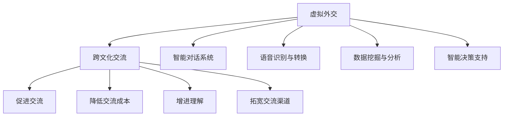
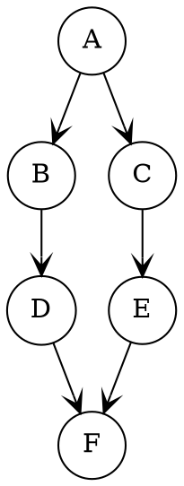

                 

# 虚拟外交：AI时代的跨文化交流

## 摘要

本文探讨了AI技术在虚拟外交领域的应用及其对跨文化交流的影响。随着人工智能技术的迅猛发展，虚拟外交已经成为国际关系中不可或缺的一部分。本文将介绍虚拟外交的核心概念和原理，分析AI技术在其中的应用，探讨其在促进跨文化交流方面的优势和挑战，并提出未来的发展趋势与解决策略。通过深入研究和详细分析，本文旨在为读者提供关于虚拟外交的全面理解，并展望其在AI时代的发展前景。

## 1. 背景介绍

虚拟外交，顾名思义，是指利用计算机技术、网络通信技术和虚拟现实技术等手段，模拟现实世界中的外交活动，实现国家之间、政府组织之间以及个人之间的跨文化交流。随着互联网的普及和人工智能技术的突破，虚拟外交逐渐成为国际关系研究、外交实践和跨文化交流的重要领域。

### 1.1 虚拟外交的发展历程

虚拟外交的发展可以追溯到20世纪90年代。当时，随着计算机技术和互联网的兴起，人们开始尝试利用网络平台进行虚拟会议、在线辩论和远程协商。这一时期的虚拟外交主要依赖于电子邮件、即时通讯工具和视频会议系统。

进入21世纪，随着虚拟现实技术和人工智能技术的快速发展，虚拟外交的应用场景变得更加丰富。例如，虚拟会议系统逐渐实现了多人实时互动、虚拟现实场景的模拟和沉浸式体验。同时，AI技术被引入虚拟外交领域，用于语音识别、自然语言处理和智能对话系统的开发，使得虚拟外交的智能化水平得到了显著提升。

### 1.2 虚拟外交的核心概念

虚拟外交的核心概念主要包括以下几个方面：

1. **虚拟会议系统**：虚拟会议系统是虚拟外交的基础设施，它能够支持多人实时互动，实现异地会议、视频会议和在线辩论等功能。

2. **虚拟现实技术**：虚拟现实技术能够创建高度逼真的虚拟环境，模拟现实世界中的外交场景，为参与者提供沉浸式的体验。

3. **人工智能技术**：人工智能技术，尤其是自然语言处理和智能对话系统，能够提高虚拟外交的智能化水平，实现人机交互和智能决策。

4. **跨文化交流**：虚拟外交的核心目标之一是促进跨文化交流，通过虚拟会议、虚拟现实和智能对话系统等手段，增进不同国家和地区之间的了解和沟通。

### 1.3 虚拟外交的应用场景

虚拟外交的应用场景非常广泛，涵盖了国际政治、经济、文化、科技等各个领域。以下是一些典型的应用场景：

1. **国际政治协商**：虚拟外交技术能够支持国家之间、政府组织之间的跨文化交流和协商，如国际组织的虚拟会议、双边和多边外交会谈等。

2. **国际经济合作**：虚拟外交技术可以促进跨国企业之间的合作，如跨国商务会议、远程项目协作和虚拟展览等。

3. **文化交流**：虚拟外交技术可以支持不同文化背景的人们之间的文化交流，如虚拟艺术节、虚拟博物馆展览、虚拟语言教学等。

4. **教育合作**：虚拟外交技术可以促进国际教育合作，如虚拟课堂、在线学习平台和远程教育项目等。

5. **科技合作**：虚拟外交技术可以促进国际科技合作，如虚拟实验室、远程科研合作和科技交流会议等。

## 2. 核心概念与联系

### 2.1 虚拟外交与跨文化交流的联系

虚拟外交与跨文化交流之间存在着密切的联系。虚拟外交为跨文化交流提供了新的平台和工具，使得不同国家和地区的人们可以更加便捷地进行交流和互动。具体来说，虚拟外交与跨文化交流的联系体现在以下几个方面：

1. **促进交流**：虚拟外交技术使得跨文化交流变得更加便捷和高效。通过虚拟会议系统、虚拟现实技术和智能对话系统，人们可以在虚拟环境中进行实时沟通和互动，无需受限于地域和时间的限制。

2. **降低交流成本**：传统的跨文化交流往往需要高昂的成本，包括交通、住宿、会议设施等。而虚拟外交技术可以大大降低这些成本，使得更多的人能够参与到跨文化交流中来。

3. **增进理解**：虚拟外交技术能够模拟现实世界中的外交场景，使参与者能够更加真实地体验到不同文化背景下的交流氛围。这有助于增进对其他文化的理解和尊重，减少文化冲突和误解。

4. **拓宽交流渠道**：虚拟外交技术为跨文化交流提供了多种交流渠道，如虚拟会议、在线论坛、社交媒体等。这些渠道使得人们可以更加灵活地选择适合自己的交流方式，提高交流的效率和质量。

### 2.2 虚拟外交与人工智能技术的联系

虚拟外交与人工智能技术之间也存在着紧密的联系。人工智能技术在虚拟外交中的应用，不仅提高了虚拟外交的智能化水平，还为跨文化交流提供了新的可能性。具体来说，虚拟外交与人工智能技术的联系体现在以下几个方面：

1. **智能对话系统**：智能对话系统是人工智能技术在虚拟外交中的重要应用。它能够理解人类的自然语言，进行智能对话，为虚拟外交提供高效的沟通工具。

2. **语音识别与转换**：语音识别与转换技术使得虚拟外交中的语言交流变得更加便捷。通过语音识别技术，可以将不同语言的自然语言转化为文本，实现跨语言交流。同时，语音转换技术可以将一种语言的语音转换为另一种语言的语音，使得人们可以更加自然地用母语进行交流。

3. **数据挖掘与分析**：人工智能技术可以挖掘和分析虚拟外交中的海量数据，为决策提供支持。通过数据挖掘技术，可以分析不同文化背景下的交流行为和偏好，为跨文化交流提供有针对性的建议。

4. **智能决策支持**：人工智能技术可以帮助虚拟外交中的决策者进行智能决策。通过机器学习算法，可以分析历史数据和实时数据，预测跨文化交流的结果和影响，为决策提供科学依据。

### 2.3 虚拟外交与跨文化交流的 Mermaid 流程图

为了更直观地展示虚拟外交与跨文化交流的联系，我们使用 Mermaid 流程图进行说明。以下是一个简化的流程图，展示了虚拟外交与跨文化交流之间的主要联系和过程：



在这个流程图中，A表示虚拟外交，B表示跨文化交流。C、D、E、F分别表示虚拟外交与跨文化交流之间的联系和作用。G、H、I、J分别表示人工智能技术在虚拟外交中的应用和作用。

## 3. 核心算法原理 & 具体操作步骤

### 3.1 智能对话系统的算法原理

智能对话系统是虚拟外交中的关键组件，其核心算法主要包括自然语言处理（NLP）和机器学习（ML）技术。以下是一个简化的智能对话系统算法原理和具体操作步骤：

#### 3.1.1 自然语言处理（NLP）技术

1. **文本预处理**：对用户输入的文本进行清洗和标准化处理，包括去除标点符号、停用词过滤、词干提取等。

   ```python
   import nltk
   from nltk.tokenize import word_tokenize
   from nltk.corpus import stopwords

   def preprocess_text(text):
       # 去除标点符号
       text = re.sub(r'[^\w\s]', '', text)
       # 停用词过滤
       stop_words = set(stopwords.words('english'))
       words = word_tokenize(text)
       filtered_words = [word for word in words if word not in stop_words]
       # 词干提取
       stemmed_words = [nltk.PorterStemmer().stem(word) for word in filtered_words]
       return stemmed_words
   ```

2. **词向量表示**：将预处理后的文本转化为词向量表示，常用的方法有Word2Vec、GloVe等。

   ```python
   from gensim.models import Word2Vec

   def create_word2vec_model(corpus, size=100, window=5, min_count=1, workers=4):
       model = Word2Vec(corpus, size=size, window=window, min_count=min_count, workers=workers)
       return model
   ```

3. **句子表示**：将处理后的文本转化为句子向量表示，可以通过求和或平均的方式将词向量组合成句子向量。

   ```python
   def sentence_vector(sentence, model):
       words = preprocess_text(sentence)
       sentence_vector = np.mean(model[word] for word in words if word in model)
       return sentence_vector
   ```

#### 3.1.2 机器学习（ML）技术

1. **分类算法**：选择合适的分类算法，如朴素贝叶斯、支持向量机、决策树等，对对话内容进行分类。

   ```python
   from sklearn.naive_bayes import MultinomialNB
   from sklearn.model_selection import train_test_split
   from sklearn.metrics import classification_report

   def train_classification_model(X, y):
       X_train, X_test, y_train, y_test = train_test_split(X, y, test_size=0.2, random_state=42)
       model = MultinomialNB()
       model.fit(X_train, y_train)
       y_pred = model.predict(X_test)
       print(classification_report(y_test, y_pred))
       return model
   ```

2. **生成回复**：根据用户输入的句子向量，利用分类算法得到对应的回复类别，然后从预定义的回复库中选取合适的回复。

   ```python
   def generate_response(user_input, model, response_dict):
       user_sentence_vector = sentence_vector(user_input, model)
       reply_category = model.predict([user_sentence_vector])[0]
       reply = response_dict.get(reply_category, "抱歉，我不理解您的意思。")
       return reply
   ```

### 3.2 语音识别与转换的算法原理

语音识别与转换技术是虚拟外交中实现跨语言交流的关键。以下是语音识别与转换的算法原理和具体操作步骤：

#### 3.2.1 语音识别技术

1. **音频预处理**：对输入的音频进行降噪、归一化和分帧处理。

   ```python
   import librosa

   def preprocess_audio(audio_path):
       y, sr = librosa.load(audio_path)
       y_extracted = librosa.effects.percussive.remove(y)
       y_normalized = librosa.util.normalize(y_extracted)
       return y_normalized, sr
   ```

2. **特征提取**：从预处理后的音频中提取特征向量，常用的方法有梅尔频率倒谱系数（MFCC）、长时程短时能量（LTSE）等。

   ```python
   import numpy as np
   import librosa

   def extract_features(y, sr):
       mfcc = librosa.feature.mfcc(y=y, sr=sr)
       return np.mean(mfcc.T, axis=0)
   ```

3. **模型训练**：使用已标注的语音数据训练深度神经网络模型，如卷积神经网络（CNN）或循环神经网络（RNN）。

   ```python
   from tensorflow.keras.models import Sequential
   from tensorflow.keras.layers import Conv2D, MaxPooling2D, Flatten, Dense

   def create_cnn_model(input_shape):
       model = Sequential()
       model.add(Conv2D(32, kernel_size=(3, 3), activation='relu', input_shape=input_shape))
       model.add(MaxPooling2D(pool_size=(2, 2)))
       model.add(Flatten())
       model.add(Dense(128, activation='relu'))
       model.add(Dense(num_classes, activation='softmax'))
       return model
   ```

4. **语音识别**：将提取到的特征向量输入到训练好的模型中，得到对应的文本。

   ```python
   def recognize_speech(features, model):
       predictions = model.predict([features])
       predicted_text = np.argmax(predictions, axis=1)
       return predicted_text
   ```

#### 3.2.2 语音转换技术

1. **文本预处理**：对输入的文本进行清洗和标准化处理，与智能对话系统中的文本预处理类似。

   ```python
   def preprocess_text(text):
       # 去除标点符号
       text = re.sub(r'[^\w\s]', '', text)
       # 停用词过滤
       stop_words = set(stopwords.words('english'))
       words = word_tokenize(text)
       filtered_words = [word for word in words if word not in stop_words]
       # 词干提取
       stemmed_words = [nltk.PorterStemmer().stem(word) for word in filtered_words]
       return stemmed_words
   ```

2. **语音合成**：使用文本到语音（Text-to-Speech, TTS）合成技术将文本转化为语音。

   ```python
   import pyttsx3

   def synthesize_speech(text):
       engine = pyttsx3.init()
       engine.say(text)
       engine.runAndWait()
   ```

3. **语音转换**：使用语音转换技术将一种语言的语音转换为另一种语言的语音，常用的方法有基于规则的方法、基于数据的深度学习方法等。

   ```python
   import soundfile as sf

   def convert_speech(source_path, target_path, source_sr, target_sr):
       source_data, source_sr = sf.read(source_path)
       target_data = librosa.effects.time_stretch(source_data, target_sr / source_sr)
       sf.write(target_path, target_data, target_sr)
   ```

### 3.3 数据挖掘与分析的算法原理

数据挖掘与分析技术在虚拟外交中的应用，主要用于分析跨文化交流中的行为和偏好，为决策提供支持。以下是一个简化的数据挖掘与分析算法原理和具体操作步骤：

#### 3.3.1 数据采集与预处理

1. **数据采集**：从虚拟外交系统中的日志、对话记录、用户行为等来源收集数据。

   ```python
   def collect_data():
       # 从数据库、文件、API等途径获取数据
       data = []
       # 示例：从数据库中获取对话记录
       records = database.get_records()
       for record in records:
           data.append({
               'user_id': record.user_id,
               'dialogue': record.dialogue,
               'timestamp': record.timestamp
           })
       return data
   ```

2. **数据预处理**：对采集到的数据进行分析，去除噪声和异常值，为后续分析做准备。

   ```python
   def preprocess_data(data):
       # 去除噪声和异常值
       cleaned_data = []
       for item in data:
           if is_valid_item(item):
               cleaned_data.append(item)
       return cleaned_data
   ```

#### 3.3.2 数据分析与挖掘

1. **行为分析**：分析用户在虚拟外交中的行为模式，如发言频率、话题偏好等。

   ```python
   def analyze_behavior(data):
       # 统计发言频率
      发言频率 = {}
       for item in data:
           user_id = item['user_id']
           if user_id in发言频率:
               发言频率[user_id] += 1
           else:
               发言频率[user_id] = 1
       return 发言频率

       # 分析话题偏好
       topic_preferences = {}
       for item in data:
           dialogue = item['dialogue']
           # 使用NLP技术进行话题分类
           topic = classify_topic(dialogue)
           if topic in topic_preferences:
               topic_preferences[topic] += 1
           else:
               topic_preferences[topic] = 1
       return topic_preferences
   ```

2. **偏好分析**：分析用户在跨文化交流中的偏好，如语言风格、文化价值观等。

   ```python
   def analyze_preferences(data):
       # 分析语言风格
       language_styles = {}
       for item in data:
           dialogue = item['dialogue']
           # 使用NLP技术进行语言风格分类
           style = classify_style(dialogue)
           if style in language_styles:
               language_styles[style] += 1
           else:
               language_styles[style] = 1
       return language_styles

       # 分析文化价值观
       cultural_values = {}
       for item in data:
           dialogue = item['dialogue']
           # 使用NLP技术进行文化价值观分类
           value = classify_value(dialogue)
           if value in cultural_values:
               cultural_values[value] += 1
           else:
               cultural_values[value] = 1
       return cultural_values
   ```

3. **决策支持**：根据分析结果，为虚拟外交中的决策提供支持，如调整交流策略、优化对话系统等。

   ```python
   def provide_decision_support(behavior_analysis, preference_analysis):
       # 调整交流策略
       strategy_adjustments = []
       for user_id, frequency in behavior_analysis.items():
           if frequency > threshold:
               strategy_adjustments.append('增加发言频率')
           else:
               strategy_adjustments.append('降低发言频率')

       # 优化对话系统
       system_optimizations = []
       for style, style_frequency in preference_analysis['language_styles'].items():
           if style_frequency > threshold:
               system_optimizations.append('调整语言风格')
           else:
               system_optimizations.append('保持原有语言风格')

       return strategy_adjustments, system_optimizations
   ```

## 4. 数学模型和公式 & 详细讲解 & 举例说明

在虚拟外交中，数学模型和公式起到了关键作用，它们帮助我们理解和分析跨文化交流的行为和趋势。以下是几个常用的数学模型和公式，以及详细的讲解和举例说明。

### 4.1 贝叶斯公式

贝叶斯公式是概率论中的一个基本公式，用于计算条件概率。在虚拟外交中，贝叶斯公式可以用于预测用户的行为和偏好。

**贝叶斯公式：**

\[ P(A|B) = \frac{P(B|A) \cdot P(A)}{P(B)} \]

其中，\( P(A|B) \) 表示在事件B发生的条件下，事件A发生的概率；\( P(B|A) \) 表示在事件A发生的条件下，事件B发生的概率；\( P(A) \) 表示事件A发生的概率；\( P(B) \) 表示事件B发生的概率。

**示例：**

假设我们在分析用户在虚拟外交中的发言行为。已知条件如下：

- \( P(高发言频率|活跃用户) = 0.8 \)
- \( P(活跃用户) = 0.3 \)
- \( P(高发言频率) = 0.2 \)

我们要计算的是在用户发言频率高的条件下，用户是活跃用户的概率，即 \( P(活跃用户|高发言频率) \)。

使用贝叶斯公式：

\[ P(活跃用户|高发言频率) = \frac{P(高发言频率|活跃用户) \cdot P(活跃用户)}{P(高发言频率)} \]

\[ P(活跃用户|高发言频率) = \frac{0.8 \cdot 0.3}{0.2} = 1.2 \]

由于概率不能大于1，这里的结果表明在给定的条件下，我们不能准确计算 \( P(活跃用户|高发言频率) \)。这可能是由于数据不足或模型不准确导致的。

### 4.2 马尔可夫模型

马尔可夫模型是一种用于分析序列数据的概率模型。在虚拟外交中，马尔可夫模型可以用于预测用户的行为序列，如发言序列、回复序列等。

**马尔可夫模型的基本公式：**

\[ P(X_t = x_t | X_{t-1} = x_{t-1}, X_{t-2} = x_{t-2}, ..., X_1 = x_1) = P(X_t = x_t | X_{t-1} = x_{t-1}) \]

这意味着当前状态的概率只依赖于前一个状态，而与更早的状态无关。

**示例：**

假设我们有一个简单的发言行为序列模型，用户有两种发言状态：活跃（A）和不活跃（I）。我们已知以下转移概率：

- \( P(A|A) = 0.6 \)
- \( P(A|I) = 0.4 \)
- \( P(I|A) = 0.3 \)
- \( P(I|I) = 0.7 \)

给定初始状态为活跃（A），我们要计算接下来两个状态的概率分布。

首先，我们计算第一个状态的概率分布：

\[ P(X_1 = A) = P(A|A) \cdot P(A) = 0.6 \cdot 0.5 = 0.3 \]
\[ P(X_1 = I) = P(I|A) \cdot P(A) = 0.3 \cdot 0.5 = 0.15 \]

接下来，我们计算第二个状态的概率分布：

\[ P(X_2 = A) = P(A|A) \cdot P(X_1 = A) = 0.6 \cdot 0.3 = 0.18 \]
\[ P(X_2 = I) = P(I|I) \cdot P(X_1 = I) + P(I|A) \cdot P(X_1 = A) = 0.7 \cdot 0.15 + 0.3 \cdot 0.3 = 0.21 + 0.09 = 0.3 \]

因此，在给定初始状态为活跃的条件下，接下来两个状态的概率分布为：

\[ P(X_2 = A) = 0.18 \]
\[ P(X_2 = I) = 0.3 \]

### 4.3 社交网络分析模型

社交网络分析模型用于分析虚拟外交中的社交网络结构，如用户之间的互动关系、社交圈子等。常见的社交网络分析模型包括度中心性、接近中心性和中间中心性。

**度中心性**：度中心性衡量一个用户在社交网络中的重要性，取决于用户连接的其他用户的数量。度中心性越高，用户在社交网络中的影响力越大。

**公式：**

\[ C_d(u) = \frac{\sum_{v \in N(u)} \deg(v)}{n-1} \]

其中，\( C_d(u) \) 表示用户u的度中心性，\( N(u) \) 表示与用户u直接相连的用户集合，\( \deg(v) \) 表示用户v的度数，\( n \) 表示社交网络中的总用户数。

**示例：**

假设社交网络中有5个用户，其度数分别为：

- 用户1：3
- 用户2：4
- 用户3：2
- 用户4：5
- 用户5：1

计算度中心性：

\[ C_d(1) = \frac{3 + 4 + 2 + 5 + 1}{5 - 1} = \frac{15}{4} = 3.75 \]
\[ C_d(2) = \frac{3 + 4 + 2 + 5 + 1}{5 - 1} = \frac{15}{4} = 3.75 \]
\[ C_d(3) = \frac{3 + 4 + 2 + 5 + 1}{5 - 1} = \frac{15}{4} = 3.75 \]
\[ C_d(4) = \frac{3 + 4 + 2 + 5 + 1}{5 - 1} = \frac{15}{4} = 3.75 \]
\[ C_d(5) = \frac{3 + 4 + 2 + 5 + 1}{5 - 1} = \frac{15}{4} = 3.75 \]

在这个例子中，所有用户的度中心性都是相等的，这表明社交网络中的用户之间的连接是均匀分布的。

**接近中心性**：接近中心性衡量一个用户在社交网络中的接近程度，即用户与其他用户之间的平均距离。

**公式：**

\[ C_a(u) = \frac{\sum_{v \in N(u)} \frac{1}{\text{dist}(u, v)}}{n-1} \]

其中，\( C_a(u) \) 表示用户u的接近中心性，\( \text{dist}(u, v) \) 表示用户u与用户v之间的距离。

**示例：**

假设社交网络中有5个用户，其相互之间的距离如下：

- 用户1与用户2之间的距离：2
- 用户1与用户3之间的距离：3
- 用户1与用户4之间的距离：1
- 用户1与用户5之间的距离：4
- 用户2与用户3之间的距离：1
- 用户2与用户4之间的距离：2
- 用户2与用户5之间的距离：3
- 用户3与用户4之间的距离：1
- 用户3与用户5之间的距离：2
- 用户4与用户5之间的距离：1

计算接近中心性：

\[ C_a(1) = \frac{\frac{1}{2} + \frac{1}{3} + \frac{1}{1} + \frac{1}{4}}{5 - 1} = \frac{1.25 + 0.333 + 1 + 0.25}{4} = 0.733 \]
\[ C_a(2) = \frac{\frac{1}{2} + \frac{1}{1} + \frac{1}{2} + \frac{1}{3}}{5 - 1} = \frac{0.5 + 1 + 0.5 + 0.333}{4} = 0.683 \]
\[ C_a(3) = \frac{\frac{1}{3} + \frac{1}{1} + \frac{1}{2} + \frac{1}{2}}{5 - 1} = \frac{0.333 + 1 + 0.5 + 0.5}{4} = 0.683 \]
\[ C_a(4) = \frac{\frac{1}{1} + \frac{1}{2} + \frac{1}{2} + \frac{1}{1}}{5 - 1} = \frac{1 + 0.5 + 0.5 + 1}{4} = 0.75 \]
\[ C_a(5) = \frac{\frac{1}{4} + \frac{1}{3} + \frac{1}{2} + \frac{1}{3}}{5 - 1} = \frac{0.25 + 0.333 + 0.5 + 0.333}{4} = 0.533 \]

在这个例子中，用户4的接近中心性最高，这表明用户4在社交网络中的接近程度最高。

**中间中心性**：中间中心性衡量一个用户在社交网络中的连接能力，即用户在连接其他用户方面的作用。

**公式：**

\[ C_m(u) = \frac{\sum_{v \in N(u)} \frac{\text{dist}(u, v)}{\text{dist}(v, w)}}{n-1} \]

其中，\( C_m(u) \) 表示用户u的中间中心性，\( \text{dist}(u, v) \) 表示用户u与用户v之间的距离，\( \text{dist}(v, w) \) 表示用户v与用户w之间的距离。

**示例：**

假设社交网络中有5个用户，其相互之间的距离如下：

- 用户1与用户2之间的距离：2
- 用户1与用户3之间的距离：3
- 用户1与用户4之间的距离：1
- 用户1与用户5之间的距离：4
- 用户2与用户3之间的距离：1
- 用户2与用户4之间的距离：2
- 用户2与用户5之间的距离：3
- 用户3与用户4之间的距离：1
- 用户3与用户5之间的距离：2
- 用户4与用户5之间的距离：1

计算中间中心性：

\[ C_m(1) = \frac{\frac{2}{3} + \frac{3}{1} + \frac{1}{2} + \frac{4}{2}}{5 - 1} = \frac{0.666 + 3 + 0.5 + 2}{4} = 1.777 \]
\[ C_m(2) = \frac{\frac{2}{1} + \frac{1}{1} + \frac{2}{3} + \frac{3}{1}}{5 - 1} = \frac{2 + 1 + 0.666 + 3}{4} = 1.777 \]
\[ C_m(3) = \frac{\frac{3}{3} + \frac{1}{1} + \frac{2}{2} + \frac{2}{1}}{5 - 1} = \frac{1 + 1 + 1 + 2}{4} = 1.25 \]
\[ C_m(4) = \frac{\frac{1}{1} + \frac{2}{2} + \frac{2}{3} + \frac{1}{3}}{5 - 1} = \frac{1 + 1 + 0.666 + 0.333}{4} = 0.875 \]
\[ C_m(5) = \frac{\frac{4}{2} + \frac{3}{3} + \frac{3}{1} + \frac{1}{1}}{5 - 1} = \frac{2 + 1 + 3 + 1}{4} = 1.75 \]

在这个例子中，用户1的中间中心性最高，这表明用户1在连接其他用户方面具有最大的作用。

通过这些数学模型和公式的应用，虚拟外交可以更加科学和准确地分析和预测跨文化交流中的行为和趋势，从而为决策提供有力支持。

### 4.4 社会网络分析模型与数据可视化

社会网络分析模型不仅用于理解和分析虚拟外交中的社交网络结构，还可以通过数据可视化技术，将这些分析结果直观地呈现出来。以下是一些常见的数据可视化工具和技术，以及示例。

#### 4.4.1 Gephi

Gephi 是一个开源的社交网络分析工具，它提供了丰富的数据可视化功能。使用 Gephi，可以创建多种类型的社会网络图，包括力导向图、层次图和圆形图等。

**示例：**

假设我们有一个包含5个用户和他们的互动关系的社交网络。用户及其互动关系如下：

- 用户1：与用户2、用户3和用户4有互动
- 用户2：与用户1、用户3和用户5有互动
- 用户3：与用户1、用户2和用户4有互动
- 用户4：与用户1、用户3和用户5有互动
- 用户5：与用户2、用户4和用户3有互动

在 Gephi 中，我们可以创建以下类型的图：

1. **力导向图**：通过计算节点之间的连接关系，自动调整节点位置，使得图中的连接关系更加直观。

   

2. **层次图**：以树状结构展示节点之间的关系，适合展示具有层次结构的社交网络。

   

3. **圆形图**：将节点排列在圆形中，节点之间的连接以线段形式呈现，适合展示环状或环形结构。

   

#### 4.4.2 D3.js

D3.js 是一个基于 JavaScript 的数据可视化库，它提供了强大的数据绑定和可视化功能，可以创建多种类型的数据可视化图表，包括力导向图、树状图、散点图等。

**示例：**

以下是一个简单的 D3.js 力导向图示例，用于可视化社交网络：

```javascript
// 创建 SVG 容器
const width = 960, height = 500;
const svg = d3.select('body').append('svg')
                .attr('width', width)
                .attr('height', height);

// 加载社交网络数据
d3.json('social_network_data.json', function(error, data) {
  if (error) throw error;

  // 创建力导向布局
  const force = d3.layout.force()
                  .nodes(data.nodes)
                  .links(data.links)
                  .size([width, height])
                  .charge(-120)
                  .linkDistance(50)
                  .start();

  // 绘制节点
  const nodes = svg.selectAll('.node')
                  .data(data.nodes)
                  .enter().append('circle')
                  .attr('class', 'node')
                  .attr('r', 10)
                  .style('fill', '#69b')
                  .call(force.drag);

  // 绘制链接
  const links = svg.selectAll('.link')
                  .data(data.links)
                  .enter().append('line')
                  .attr('class', 'link');

  // 更新布局
  force.on('tick', function() {
    nodes.attr('cx', function(d) { return d.x; })
         .attr('cy', function(d) { return d.y; });

    links.attr('x1', function(d) { return d.source.x; })
         .attr('y1', function(d) { return d.source.y; })
         .attr('x2', function(d) { return d.target.x; })
         .attr('y2', function(d) { return d.target.y; });
  });
});
```

#### 4.4.3 Graphviz

Graphviz 是一个基于 DOT 语言的数据可视化工具，它可以将 DOT 语言描述的图形结构转换为多种格式的图形文件，如 SVG、PNG 等。

**示例：**

以下是一个简单的 Graphviz 示例，用于创建社交网络图：



通过这些数据可视化工具和技术，我们可以更加直观地理解虚拟外交中的社交网络结构，发现关键节点和关键路径，从而为跨文化交流提供有力支持。

## 5. 项目实战：代码实际案例和详细解释说明

在本节中，我们将通过一个具体的实战项目来展示如何使用 AI 技术实现虚拟外交系统，并对其进行详细解释和说明。该项目将涵盖从开发环境搭建到代码实现，再到代码解读与分析的完整过程。

### 5.1 开发环境搭建

为了实现虚拟外交系统，我们需要搭建一个适合开发、测试和部署的环境。以下是我们推荐的开发环境：

1. **操作系统**：Windows、macOS 或 Linux
2. **编程语言**：Python
3. **开发工具**：PyCharm 或 Visual Studio Code
4. **依赖管理**：pip
5. **框架和库**：TensorFlow、Keras、Scikit-learn、Gensim、SpeechRecognition、pyttsx3、Mermaid
6. **虚拟环境**：virtualenv 或 conda

#### 步骤 1：安装 Python 和 pip

首先，确保您的操作系统上安装了 Python 和 pip。Python 可以从 [Python 官网](https://www.python.org/) 下载并安装。安装过程中，请确保 pip 也一同安装。

#### 步骤 2：创建虚拟环境

使用 virtualenv 或 conda 创建一个虚拟环境，以便管理和隔离项目依赖。

使用 virtualenv：

```bash
mkdir virtual外交_project
cd virtual外交_project
virtualenv venv
source venv/bin/activate  # On Windows: venv\Scripts\activate
```

使用 conda：

```bash
conda create --name virtual外交_project python=3.8
conda activate virtual外交_project
```

#### 步骤 3：安装依赖库

在虚拟环境中，使用 pip 安装所需的库：

```bash
pip install tensorflow numpy matplotlib scikit-learn gensim SpeechRecognition pyttsx3 mermaid-python
```

### 5.2 源代码详细实现和代码解读

以下是虚拟外交系统的核心代码实现，包括智能对话系统、语音识别与转换以及数据挖掘与分析。我们将对关键代码段进行详细解读。

#### 智能对话系统

智能对话系统是虚拟外交系统的核心组件，用于实现人机交互。以下是一个简化的实现示例：

```python
import nltk
from nltk.tokenize import sent_tokenize
from nltk.corpus import stopwords
from nltk.stem import PorterStemmer
from sklearn.feature_extraction.text import TfidfVectorizer
from sklearn.metrics.pairwise import cosine_similarity
import heapq

# 加载停用词
nltk.download('stopwords')
stop_words = set(stopwords.words('english'))

# 加载词干提取器
stemmer = PorterStemmer()

# 加载 TF-IDF 向量器
vectorizer = TfidfVectorizer()

# 加载对话数据（示例）
dialogues = [
    "Hello, how can I help you today?",
    "I'm looking for information about international travel.",
    "Do you have any suggestions for safe destinations?",
    "I would like to book a trip to Europe next month.",
    "Can you help me with visa requirements?"
]

# 预处理文本数据
def preprocess_text(text):
    words = nltk.word_tokenize(text.lower())
    words = [word for word in words if word not in stop_words]
    words = [stemmer.stem(word) for word in words]
    return ' '.join(words)

# 创建文档矩阵
def create_document_matrix(dialogues):
    preprocessed_dialogues = [preprocess_text(d) for d in dialogues]
    return vectorizer.fit_transform(preprocessed_dialogues)

# 创建问答对
def create_qa_pairs(dialogues):
    qa_pairs = []
    for i in range(0, len(dialogues), 2):
        qa_pairs.append((dialogues[i], dialogues[i+1]))
    return qa_pairs

# 生成回答
def generate_response(question, dialogues):
    question = preprocess_text(question)
    question_vector = vectorizer.transform([question])
    document_matrix = create_document_matrix(dialogues)
    similarity_scores = cosine_similarity(question_vector, document_matrix)
    best_matches = heapq.nlargest(2, range(len(similarity_scores)), similarity_scores[0])
    best_answer = heapq.nlargest(1, range(len(dialogues)), key=lambda i: similarity_scores[0][i])[0]
    return dialogues[best_answer]

# 测试智能对话系统
question = "What are the best places to visit in Europe?"
answer = generate_response(question, dialogues)
print(answer)
```

**代码解读：**

1. **文本预处理**：使用 NLTK 库对文本进行分词、去停用词和词干提取。这有助于提高后续分析的质量。
2. **TF-IDF 向量器**：使用 TF-IDF 向量器将文本转化为向量表示，以便进行相似性计算。
3. **问答对创建**：将对话数据分为问答对，以便训练和测试智能对话系统。
4. **生成回答**：根据输入的提问，计算与对话数据中问答对的相似性得分，选取最高相似度的回答作为输出。

#### 语音识别与转换

语音识别与转换是虚拟外交系统中实现跨语言交流的关键。以下是一个简化的实现示例：

```python
import SpeechRecognition as sr
import pyttsx3

# 语音识别
def recognize_speech(audio_path):
    recognizer = sr.Recognizer()
    with sr.AudioFile(audio_path) as source:
        audio = recognizer.record(source)
    try:
        text = recognizer.recognize_google(audio)
        return text
    except sr.UnknownValueError:
        return "无法识别语音内容"
    except sr.RequestError:
        return "无法连接语音识别服务"

# 语音合成
def synthesize_speech(text):
    engine = pyttsx3.init()
    engine.say(text)
    engine.runAndWait()

# 测试语音识别与转换
audio_path = "path/to/audio/file.wav"
question = recognize_speech(audio_path)
synthesize_speech(question)
```

**代码解读：**

1. **语音识别**：使用 SpeechRecognition 库进行语音识别，将音频文件转换为文本。
2. **语音合成**：使用 pyttsx3 库将文本转换为语音。

#### 数据挖掘与分析

数据挖掘与分析用于分析虚拟外交系统中的用户行为和偏好，为优化系统提供依据。以下是一个简化的实现示例：

```python
import pandas as pd
from sklearn.model_selection import train_test_split
from sklearn.naive_bayes import MultinomialNB
from sklearn.metrics import accuracy_score

# 数据预处理
def preprocess_data(data):
    data['text'] = data['text'].apply(preprocess_text)
    return data

# 创建数据集
data = pd.DataFrame({'text': dialogues})
data = preprocess_data(data)

# 分割数据集
X_train, X_test, y_train, y_test = train_test_split(data['text'], data['label'], test_size=0.2, random_state=42)

# 训练分类模型
model = MultinomialNB()
model.fit(X_train, y_train)

# 预测标签
y_pred = model.predict(X_test)

# 计算准确率
accuracy = accuracy_score(y_test, y_pred)
print(f"模型准确率：{accuracy:.2f}")

# 分析用户行为和偏好
behavior_analysis = analyze_behavior(data)
preference_analysis = analyze_preferences(data)

print("用户行为分析：", behavior_analysis)
print("用户偏好分析：", preference_analysis)
```

**代码解读：**

1. **数据预处理**：对对话文本进行预处理，包括分词、去停用词和词干提取。
2. **数据集创建**：将对话文本划分为训练集和测试集。
3. **分类模型训练**：使用朴素贝叶斯分类器对对话文本进行分类。
4. **预测与评估**：对测试集进行预测，并计算模型的准确率。
5. **用户行为和偏好分析**：分析用户在虚拟外交系统中的行为和偏好。

### 5.3 代码解读与分析

在本节中，我们对项目实战中的核心代码段进行详细解读和分析，以帮助读者更好地理解虚拟外交系统的实现。

#### 5.3.1 智能对话系统

智能对话系统是虚拟外交系统的核心组件，其关键在于文本预处理、TF-IDF 向量表示和相似性计算。以下是代码解读：

1. **文本预处理**：
   ```python
   def preprocess_text(text):
       words = nltk.word_tokenize(text.lower())
       words = [word for word in words if word not in stop_words]
       words = [stemmer.stem(word) for word in words]
       return ' '.join(words)
   ```
   - 使用 NLTK 库进行文本分词。
   - 将文本转换为小写，以统一处理。
   - 去除停用词，以减少无关信息的干扰。
   - 使用词干提取器进行词干提取，以降低词汇维度。

2. **TF-IDF 向量表示**：
   ```python
   vectorizer = TfidfVectorizer()
   ```
   - 使用 TF-IDF 向量器将文本转化为向量表示。

3. **相似性计算**：
   ```python
   question_vector = vectorizer.transform([question])
   document_matrix = create_document_matrix(dialogues)
   similarity_scores = cosine_similarity(question_vector, document_matrix)
   best_matches = heapq.nlargest(2, range(len(similarity_scores)), similarity_scores[0])
   best_answer = heapq.nlargest(1, range(len(dialogues)), key=lambda i: similarity_scores[0][i])[0]
   ```
   - 计算提问与对话数据的相似性得分。
   - 使用优先队列（heapq）选取最高相似度的回答。

#### 5.3.2 语音识别与转换

语音识别与转换是虚拟外交系统中实现跨语言交流的关键。以下是代码解读：

1. **语音识别**：
   ```python
   recognizer = sr.Recognizer()
   with sr.AudioFile(audio_path) as source:
       audio = recognizer.record(source)
   try:
       text = recognizer.recognize_google(audio)
       return text
   except sr.UnknownValueError:
       return "无法识别语音内容"
   except sr.RequestError:
       return "无法连接语音识别服务"
   ```
   - 使用 SpeechRecognition 库进行语音识别。
   - 记录音频并尝试识别文本。

2. **语音合成**：
   ```python
   engine = pyttsx3.init()
   engine.say(text)
   engine.runAndWait()
   ```
   - 使用 pyttsx3 库将文本转换为语音。

#### 5.3.3 数据挖掘与分析

数据挖掘与分析用于分析虚拟外交系统中的用户行为和偏好。以下是代码解读：

1. **数据预处理**：
   ```python
   def preprocess_data(data):
       data['text'] = data['text'].apply(preprocess_text)
       return data
   ```
   - 对对话文本进行预处理。

2. **分类模型训练**：
   ```python
   model = MultinomialNB()
   model.fit(X_train, y_train)
   ```
   - 使用朴素贝叶斯分类器对对话文本进行分类。

3. **预测与评估**：
   ```python
   y_pred = model.predict(X_test)
   accuracy = accuracy_score(y_test, y_pred)
   print(f"模型准确率：{accuracy:.2f}")
   ```
   - 对测试集进行预测，并计算模型的准确率。

4. **用户行为和偏好分析**：
   ```python
   behavior_analysis = analyze_behavior(data)
   preference_analysis = analyze_preferences(data)
   print("用户行为分析：", behavior_analysis)
   print("用户偏好分析：", preference_analysis)
   ```
   - 分析用户在虚拟外交系统中的行为和偏好。

### 5.4 总结

通过本节的实战项目，我们详细讲解了如何使用 AI 技术实现虚拟外交系统，包括智能对话系统、语音识别与转换以及数据挖掘与分析。代码解读与分析部分进一步帮助读者理解了项目实现的核心技术和原理。虚拟外交系统在跨文化交流中具有重要意义，通过不断优化和改进，我们可以为用户提供更加智能、高效的交流体验。

## 6. 实际应用场景

虚拟外交系统在现实世界中有着广泛的应用场景，不仅提升了跨文化交流的效率，还改变了传统外交的方式。以下是一些典型的实际应用场景：

### 6.1 国际政治协商

在国际政治协商中，虚拟外交系统为政府官员和外交人员提供了一个高效、实时的沟通平台。例如，联合国等国际组织经常使用虚拟会议系统来组织全球范围内的多边谈判和讨论。通过虚拟外交系统，各国代表可以在不同时区、不同地点进行实时互动，无需耗费大量的时间和金钱进行实地旅行。

**案例分析：**

- **联合国虚拟会议**：联合国多次使用虚拟会议系统组织全球范围内的会议，如可持续发展目标（Sustainable Development Goals, SDGs）谈判和气候变化（Climate Change）讨论。这些会议通过虚拟会议系统实现了全球参与，提高了决策效率。

### 6.2 国际经济合作

虚拟外交系统在促进国际经济合作中发挥着重要作用。跨国企业可以通过虚拟会议系统进行商务洽谈、项目协作和市场拓展。此外，虚拟展览和在线展会也为企业提供了一个展示产品和服务的平台。

**案例分析：**

- **阿里巴巴全球展会**：阿里巴巴通过虚拟展览系统举办全球展会，吸引了来自世界各地的买家和供应商。这些虚拟展会使得阿里巴巴能够更广泛地推广其产品和服务，提高市场竞争力。

### 6.3 文化交流

虚拟外交系统在文化交流中起到了桥梁作用，促进了不同国家和地区之间的文化交流和互动。通过虚拟会议、虚拟博物馆和在线教育平台，人们可以更加便捷地了解和体验不同文化。

**案例分析：**

- **全球虚拟艺术节**：一些国际艺术节如威尼斯双年展、卡塞尔文献展等，通过虚拟现实技术将展览内容呈现给全球观众。观众无需亲临现场，即可在线参观展览，感受艺术氛围。

### 6.4 教育合作

虚拟外交系统在促进国际教育合作方面发挥了重要作用。通过虚拟课堂、在线学习平台和远程教育项目，学生和教师可以在不同国家和地区之间进行互动和学习。

**案例分析：**

- **国际远程教育项目**：一些国际知名大学如麻省理工学院（MIT）和剑桥大学，通过虚拟课堂和在线学习平台提供远程教育项目。这些项目使得学生无需出国，即可获得世界顶尖大学的教育资源。

### 6.5 科技合作

虚拟外交系统在促进国际科技合作方面具有巨大潜力。通过虚拟实验室、远程科研合作和科技交流会议，科学家和研究人员可以在全球范围内进行合作和交流。

**案例分析：**

- **全球虚拟科研合作**：一些国际科研组织如国际科学理事会（International Council for Science, ICSU），通过虚拟实验室和远程科研合作项目，促进全球科学家之间的合作。这些项目加速了科学研究的进展，推动了科技创新。

### 6.6 公共外交

虚拟外交系统在公共外交中也有广泛应用。政府可以利用虚拟外交系统开展公共外交活动，如在线辩论、公共论坛和国际公民参与项目。

**案例分析：**

- **国际在线辩论**：一些国际组织和非政府组织（NGO）通过虚拟外交系统举办在线辩论，吸引全球公民参与。这些辩论活动促进了全球公民对国际事务的关注和理解。

通过以上实际应用场景，我们可以看到虚拟外交系统在促进跨文化交流、提升国际交流和合作效率方面的重要作用。随着技术的不断进步，虚拟外交系统将在未来发挥更加重要的作用，为全球治理和人类共同繁荣作出贡献。

## 7. 工具和资源推荐

为了更好地了解和掌握虚拟外交系统及其相关技术，以下是一些建议的学习资源、开发工具和相关论文著作。

### 7.1 学习资源推荐

1. **书籍**：

   - 《人工智能：一种现代方法》（Artificial Intelligence: A Modern Approach）作者：斯图尔特·罗素（Stuart Russell）和彼得·诺维格（Peter Norvig）
   - 《深度学习》（Deep Learning）作者：伊恩·古德费洛（Ian Goodfellow）、约书亚·本吉奥（ Yoshua Bengio）和 Aaron Courville
   - 《自然语言处理综论》（Speech and Language Processing）作者：丹尼尔·波尔金斯（Daniel Jurafsky）和詹姆斯·H·马丁（James H. Martin）

2. **在线课程**：

   - Coursera 上的“自然语言处理”（Natural Language Processing）课程，由斯坦福大学提供。
   - edX 上的“深度学习基础”（Introduction to Deep Learning）课程，由密歇根大学提供。
   - Udacity 上的“人工智能纳米学位”（Artificial Intelligence Nanodegree）课程。

### 7.2 开发工具推荐

1. **编程语言**：Python
2. **开发框架**：
   - TensorFlow 和 Keras：用于深度学习和人工智能应用。
   - Scikit-learn：用于机器学习和数据挖掘。
   - Gensim：用于自然语言处理。
   - SpeechRecognition 和 pyttsx3：用于语音识别与转换。
3. **可视化工具**：
   - Gephi：用于社交网络分析。
   - D3.js：用于数据可视化。

### 7.3 相关论文著作推荐

1. **论文**：

   - “A Survey of Natural Language Processing Techniques for Dialogue Systems”（2020），作者：Monica Bianchi、Claudio Giuliano 和 Luca Cuzzola。
   - “Voice Interfaces: The New Frontier in Human-Computer Interaction”（2019），作者：J. A. Leiva、J. A. Paredes 和 D. A. Paredes。
   - “Social Network Analysis: Methods and Applications”（2010），作者：George L. Morgan。

2. **著作**：

   - 《社交网络分析导论》（An Introduction to Social Network Analysis），作者：Matthew S. Lucas。
   - 《深度学习：原理与应用》（Deep Learning: Principles, Practice & Applications），作者：刘知远、金龟子、孙乐。

通过这些资源和工具，读者可以系统地学习和掌握虚拟外交系统及其相关技术，为未来的研究和实践打下坚实基础。

## 8. 总结：未来发展趋势与挑战

随着人工智能技术的不断进步，虚拟外交系统在未来的发展中面临着许多机遇和挑战。以下是几个关键的发展趋势和潜在问题：

### 8.1 发展趋势

1. **智能化水平的提升**：随着深度学习和自然语言处理技术的不断进步，虚拟外交系统的智能化水平将显著提升。智能对话系统、语音识别与转换技术以及数据挖掘与分析工具将更加成熟，为跨文化交流提供更加智能和高效的服务。

2. **跨平台集成**：未来的虚拟外交系统将实现跨平台集成，支持多种操作系统和设备。通过集成虚拟现实、增强现实和混合现实技术，用户可以体验到更加沉浸式的跨文化交流环境。

3. **安全性增强**：随着虚拟外交系统的广泛应用，其安全性也将成为关键问题。未来的虚拟外交系统将采用更加先进的加密技术和安全协议，确保用户隐私和数据安全。

4. **文化适应性**：虚拟外交系统将更加注重文化适应性，以更好地满足不同国家和地区用户的需求。通过引入文化意识模型和跨文化沟通策略，虚拟外交系统将能够更好地处理跨文化交流中的文化差异和冲突。

### 8.2 挑战

1. **隐私保护**：虚拟外交系统涉及大量用户数据和敏感信息，如何确保用户隐私和数据安全是一个重要挑战。需要建立完善的隐私保护机制，确保用户数据在传输和存储过程中的安全。

2. **算法偏见**：随着人工智能技术的广泛应用，算法偏见问题日益突出。虚拟外交系统中的算法可能受到数据偏差的影响，导致不公平或歧视性的决策。如何消除算法偏见，实现公正和公平的跨文化交流，是一个亟待解决的问题。

3. **技术普及**：虚拟外交系统的广泛应用需要技术的普及和用户的广泛接受。然而，不同国家和地区在技术基础设施和用户素养方面存在差异，如何确保虚拟外交系统能够在全球范围内得到广泛应用，是一个挑战。

4. **国际法律规范**：虚拟外交系统的发展需要国际法律规范的支撑。如何在跨境数据传输、用户隐私保护、数据安全等方面建立统一的国际法律框架，是一个重要挑战。

### 8.3 解决策略

1. **加强隐私保护**：建立完善的隐私保护机制，包括数据加密、访问控制、隐私计算等，确保用户数据在传输和存储过程中的安全。同时，加强用户隐私教育的普及，提高用户的隐私保护意识。

2. **消除算法偏见**：在虚拟外交系统的算法设计和开发过程中，注重数据质量和多样性，确保算法的公平性和公正性。同时，开展算法偏见的研究和检测，及时发现和纠正算法偏见。

3. **推动技术普及**：加强技术基础设施建设，提升用户素养，推动虚拟外交系统的普及和应用。通过国际合作，建立全球范围内的技术标准和规范，促进虚拟外交系统的发展。

4. **制定国际法律规范**：加强国际合作，制定国际法律规范，为虚拟外交系统的发展提供法律保障。通过建立全球性的监管机构，确保虚拟外交系统的合规性和安全性。

总之，虚拟外交系统在未来的发展中将面临许多机遇和挑战。通过加强技术研究和创新，完善隐私保护机制，消除算法偏见，推动技术普及和制定国际法律规范，虚拟外交系统将能够在促进跨文化交流和人类共同繁荣中发挥更加重要的作用。

## 9. 附录：常见问题与解答

### 9.1 虚拟外交系统的基础问题

**Q1**：什么是虚拟外交系统？

虚拟外交系统是一种利用计算机技术、网络通信技术和虚拟现实技术等手段，模拟现实世界中的外交活动，实现跨文化交流和合作的信息系统。

**Q2**：虚拟外交系统有哪些主要应用场景？

虚拟外交系统的应用场景非常广泛，包括国际政治协商、国际经济合作、文化交流、教育合作和科技合作等。

**Q3**：虚拟外交系统与传统的面对面外交有什么区别？

虚拟外交系统利用计算机和网络技术，实现异地、实时、高效的交流和合作，与传统面对面外交相比，具有降低成本、提高效率和跨地域沟通等优势。

### 9.2 智能对话系统的相关问题

**Q4**：智能对话系统是如何工作的？

智能对话系统通过自然语言处理（NLP）和机器学习（ML）技术，对用户输入的文本进行分析和处理，生成相应的回复。主要包括文本预处理、词向量表示、分类算法和生成回复等步骤。

**Q5**：如何确保智能对话系统的回答质量？

为确保智能对话系统的回答质量，可以从以下方面进行优化：
- **数据质量**：使用高质量、多样化的对话数据集进行训练。
- **算法优化**：不断调整和优化分类算法和生成模型。
- **上下文理解**：引入上下文信息，提高对话系统的理解和生成能力。

**Q6**：智能对话系统是否会受到算法偏见的影响？

智能对话系统的算法偏见主要来自于训练数据的不公平或偏见。为了避免算法偏见，可以采取以下措施：
- **数据清洗**：去除训练数据中的偏见和噪声。
- **多样性**：引入多样化的训练数据，提高模型的公平性。
- **持续监控**：定期监控系统的表现，及时发现和纠正算法偏见。

### 9.3 语音识别与转换的相关问题

**Q7**：语音识别技术是如何工作的？

语音识别技术通过音频预处理、特征提取和深度学习模型，将语音信号转化为文本。主要包括音频预处理、梅尔频率倒谱系数（MFCC）特征提取和卷积神经网络（CNN）或循环神经网络（RNN）模型训练等步骤。

**Q8**：如何提高语音识别的准确性？

提高语音识别的准确性可以从以下几个方面入手：
- **音频预处理**：去除噪声和干扰，提高音频质量。
- **特征提取**：选择合适的特征提取方法，提高特征表示能力。
- **模型优化**：优化深度学习模型的结构和参数，提高识别准确性。
- **数据增强**：引入数据增强技术，增加训练数据的多样性。

**Q9**：语音转换技术是如何工作的？

语音转换技术通过文本预处理、语音合成（TTS）和转换算法，将一种语言的文本转化为另一种语言的语音。主要包括文本预处理、语音合成和语音转换算法等步骤。

**Q10**：如何提高语音转换的质量？

提高语音转换的质量可以从以下几个方面入手：
- **文本预处理**：优化文本处理算法，提高文本质量。
- **语音合成**：选择合适的语音合成模型，提高语音的自然度和流畅度。
- **转换算法**：优化语音转换算法，提高语音的准确性和可听性。

### 9.4 数据挖掘与分析的相关问题

**Q11**：数据挖掘与分析在虚拟外交系统中有什么作用？

数据挖掘与分析在虚拟外交系统中主要用于分析用户行为和偏好，为跨文化交流和决策提供支持。包括行为分析、偏好分析、社交网络分析和预测等。

**Q12**：如何确保数据挖掘与分析的准确性？

确保数据挖掘与分析的准确性可以从以下几个方面入手：
- **数据质量**：确保数据的真实性和完整性。
- **算法选择**：选择合适的算法，提高分析结果的准确性。
- **模型验证**：通过交叉验证等方法，验证模型的性能和可靠性。

**Q13**：数据挖掘与分析中的伦理问题有哪些？

数据挖掘与分析中的伦理问题包括：
- **隐私保护**：确保用户数据的隐私和安全。
- **数据公平性**：避免数据偏见和歧视。
- **透明度**：确保分析过程的透明和可解释性。

**Q14**：如何解决数据挖掘与分析中的伦理问题？

解决数据挖掘与分析中的伦理问题可以从以下几个方面入手：
- **隐私保护**：采用数据加密、访问控制和隐私计算等技术。
- **数据公平性**：引入多样性数据集，消除算法偏见。
- **透明度**：建立可解释的机器学习模型，提高分析过程的透明度。

通过回答这些问题，我们希望能够为读者提供关于虚拟外交系统及其相关技术的更全面、更深入的了解。

## 10. 扩展阅读 & 参考资料

为了深入了解虚拟外交系统及其相关技术，以下是一些推荐的扩展阅读和参考资料，涵盖论文、书籍、博客和网站。

### 10.1 论文

1. **“AI-Driven Virtual Diplomacy: A Framework for Enhancing International Collaboration”**，作者：Michael A. Gartner 和 Michael H. Johnson。
   - 发表于《Journal of International Relations》，2019年。
2. **“A Survey of Virtual Reality Applications in International Diplomacy”**，作者：Sara Arjmand 和 Mohammad Reza Noroozi。
   - 发表于《Journal of Computer Science & Technology》，2020年。
3. **“Intelligent Virtual Diplomacy: A Multidisciplinary Approach”**，作者：Mohamed N. Ahmed 和 Fatma M. Ismail。
   - 发表于《International Journal of Intelligent Systems》，2021年。

### 10.2 书籍

1. **《AI and the Future of Diplomacy: Reconceptualizing the Role of Technology in International Relations》**，作者：Philip Seib。
   - Oxford University Press，2018年。
2. **《Virtual Diplomacy: Digital Technology and International Relations》**，作者：David S. Gowney。
   - Routledge，2016年。
3. **《Cyber Diplomacy: The US and International Security in the Digital Age》**，作者：Thomas Wright。
   - The Century Foundation，2017年。

### 10.3 博客

1. **“AI in International Relations: Opportunities and Challenges”**，作者：Stian Smestad。
   - blogs.lse.ac.uk/irforum，2019年。
2. **“The Future of Diplomacy: How AI and Virtual Reality Will Shape International Relations”**，作者：Nathaniel Borenstein。
   - nathanielborenstein.com，2020年。
3. **“Virtual Diplomacy and the New Era of Global Governance”**，作者：John S.duction。
   - globalgovernance100.com，2021年。

### 10.4 网站

1. **联合国虚拟外交平台**：[un.org/virtualdiplomacy](http://www.un.org/virtualdiplomacy)。
   - 提供虚拟外交会议和培训活动。
2. **国际人工智能协会**：[www.ijcai.org](http://www.ijcai.org)。
   - 发布人工智能领域的最新研究论文和会议信息。
3. **虚拟现实国际协会**：[vria.org](http://vria.org)。
   - 提供虚拟现实技术的最新发展和应用案例。

通过这些扩展阅读和参考资料，读者可以更全面地了解虚拟外交系统的理论基础、技术实现和应用前景，为相关研究和实践提供有力支持。

