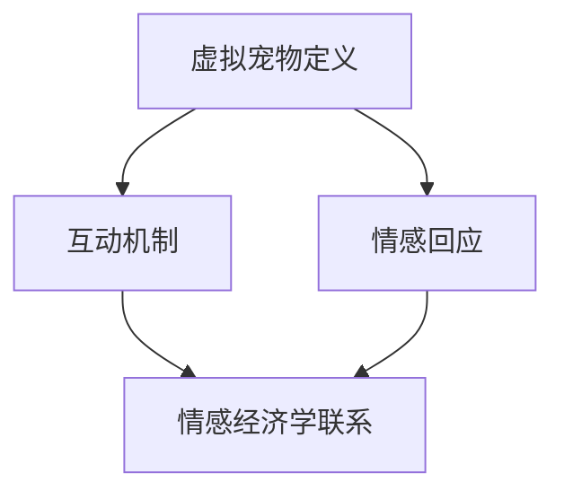

                 

## 虚拟宠物创业：数字陪伴的情感价值

### 概述

在快速发展的数字时代，虚拟宠物的概念逐渐从科幻小说走向现实。如今，虚拟宠物不仅仅是娱乐工具，它们正成为一种新型的创业模式，提供一种独特的情感价值。本文将探讨虚拟宠物的创业机会，分析其背后的情感经济学，并展望这一领域未来的发展趋势与挑战。

本文分为十个部分，首先介绍虚拟宠物的发展背景，随后深入探讨其核心概念、算法原理及实际操作步骤，接着通过数学模型和公式进行分析，并结合实战案例进行代码解读。之后，文章将探讨虚拟宠物在现实生活中的应用场景，推荐相关工具和资源，最后对虚拟宠物创业的未来进行总结与展望。

### 关键词

- 虚拟宠物
- 情感经济学
- 创业模式
- 数字陪伴
- 情感价值

### 摘要

本文深入探讨了虚拟宠物这一新兴创业领域的情感价值。通过分析虚拟宠物的发展背景和核心概念，本文揭示了其背后的算法原理和操作步骤。同时，运用数学模型和公式，对虚拟宠物的情感经济学进行了详细分析。最后，本文结合实战案例，探讨了虚拟宠物在现实生活中的应用场景，并对未来发展趋势与挑战进行了展望。

## 1. 背景介绍

虚拟宠物，作为数字时代的产物，源于20世纪90年代的虚拟宠物游戏，如《Tamagotchi》等。当时，这些虚拟宠物主要以玩具形式存在，简单模拟了宠物养护的过程，如喂食、清洁和娱乐等。然而，随着人工智能和计算机图形学的发展，虚拟宠物逐渐从玩具升级为一种具有高度互动性和情感回应能力的数字实体。

近年来，虚拟宠物的概念在多个领域得到了广泛应用。首先，在娱乐和游戏领域，虚拟宠物作为游戏角色，为玩家提供了丰富的互动体验。例如，玩家可以通过游戏中的虚拟宠物进行冒险、训练和比赛。其次，在心理健康和辅助治疗领域，虚拟宠物被用于帮助患者缓解焦虑、抑郁等心理问题。研究表明，与虚拟宠物的互动可以提升用户的情绪状态，从而对心理健康产生积极影响。

此外，虚拟宠物还作为一种新型的社交媒介，在社交媒体平台和在线社区中得到了广泛应用。用户可以通过虚拟宠物展示自己的个性和生活方式，与其他用户进行互动和交流。这种社交方式不仅提供了情感上的陪伴，还创造了一种新型的虚拟社交文化。

总的来说，虚拟宠物的发展历程体现了科技进步和人类情感需求的结合。从最初的简单游戏玩具，到如今具有高度互动性和情感回应能力的数字实体，虚拟宠物正逐渐成为一种新兴的创业模式。随着技术的不断进步和应用场景的拓展，虚拟宠物在未来有望在更多领域发挥重要作用。

### 2. 核心概念与联系

#### 虚拟宠物的定义

虚拟宠物是一种通过数字技术创造的虚拟生命体，具有模拟真实宠物的行为和特征。它们通常通过图形用户界面（GUI）与用户互动，提供包括喂养、训练、娱乐等多种功能。虚拟宠物的本质在于其互动性和情感回应能力，这使得它们能够在情感层面上与用户建立联系。

#### 虚拟宠物的互动机制

虚拟宠物的互动机制是其核心功能之一。这些互动通常包括用户与虚拟宠物之间的反馈循环。例如，用户可以通过点击或触摸屏幕来与宠物互动，如喂食、洗澡或玩耍。虚拟宠物则通过动态图形和声音反馈来回应用户的行为。这种互动不仅增加了用户体验的乐趣，还增强了用户与虚拟宠物之间的情感纽带。

#### 虚拟宠物的情感回应

情感回应是虚拟宠物区别于传统电子游戏的重要特征。通过机器学习和自然语言处理技术，虚拟宠物能够识别用户的情感状态，并做出相应的回应。例如，当用户表现出快乐或兴奋的情绪时，虚拟宠物可能会表现出兴奋或快乐的行为，如跳跃或发出欢快的叫声。相反，当用户表现出悲伤或愤怒的情绪时，虚拟宠物可能会变得安静或表现出沮丧的行为。

#### 情感经济学的联系

情感经济学是研究人们如何在经济活动中表达和利用情感的一门学科。虚拟宠物与情感经济学的联系在于，它们能够为用户提供情感价值，从而影响用户的经济行为。例如，用户可能会因为与虚拟宠物建立了深厚的情感联系而愿意支付更高的价格来购买虚拟宠物相关的虚拟商品或服务。这种现象被称为“情感锁定”，即用户对虚拟宠物产生的情感依赖，使其更愿意投入时间和金钱来维护这段关系。

### 2.1. 虚拟宠物核心概念架构图

以下是虚拟宠物核心概念及其相互关系的 Mermaid 流程图：



### 3. 核心算法原理 & 具体操作步骤

#### 机器学习算法

虚拟宠物的核心算法主要依赖于机器学习技术，尤其是深度学习和自然语言处理（NLP）。这些算法用于模拟虚拟宠物的行为和情感回应。例如，深度学习模型可以用于分析用户的交互数据，预测用户的行为模式和情感状态，从而做出更准确的情感回应。

#### 数据收集与预处理

首先，需要收集用户与虚拟宠物的交互数据。这些数据包括用户的操作记录、文本输入、语音交互等。然后，对这些数据进行预处理，如数据清洗、特征提取和归一化等，以便于机器学习模型的使用。

#### 模型训练与优化

接下来，使用预处理后的数据来训练机器学习模型。常见的训练方法包括监督学习、无监督学习和强化学习。通过调整模型的参数和架构，可以优化模型的表现。例如，通过调整神经网络的层数和神经元数量，可以提高模型的预测准确率。

#### 模型部署与实时交互

最后，将训练好的模型部署到虚拟宠物应用中。在用户与虚拟宠物互动时，模型会实时分析用户的交互数据，并根据预测结果生成相应的回应。这种实时交互能力使得虚拟宠物能够动态地调整其行为和情感回应，从而提供更自然和贴心的用户体验。

#### 案例分析：情感回应算法

假设一个虚拟宠物的情感回应算法需要识别用户的情感状态。以下是具体的操作步骤：

1. **数据收集**：收集用户在特定情境下的交互数据，如文字聊天、语音通话等。
2. **特征提取**：从交互数据中提取情感特征，如文本的情感极性（积极/消极）、语音的音调等。
3. **模型训练**：使用提取的情感特征来训练一个情感分类模型，如使用支持向量机（SVM）或深度学习模型（如卷积神经网络CNN）。
4. **情感预测**：在用户交互时，实时提取情感特征，并使用训练好的模型进行情感预测。
5. **回应生成**：根据预测结果，生成相应的情感回应，如文本消息、语音合成等。

通过这些步骤，虚拟宠物能够根据用户的情感状态做出更自然的情感回应，从而提升用户体验。

### 4. 数学模型和公式 & 详细讲解 & 举例说明

#### 情感经济学模型

情感经济学模型用于分析用户与虚拟宠物互动时的情感价值。以下是一个简单的情感经济学模型，用于计算用户对虚拟宠物的情感依赖程度：

$$
E = \frac{1}{1 + e^{-k \cdot (F - B)}}
$$

其中：
- $E$ 表示情感依赖程度，取值范围为 [0, 1]。
- $F$ 表示用户对虚拟宠物的情感投入，如时间、金钱和情感强度等。
- $B$ 表示用户的基准情感值，即在没有虚拟宠物的情况下，用户对情感的投入。
- $k$ 是调节参数，用于调整情感依赖的敏感度。

#### 情感依赖计算示例

假设一个用户每天花费30分钟与虚拟宠物互动，每月花费10美元购买虚拟宠物相关的虚拟商品。在没有虚拟宠物的情况下，该用户每月的情感投入为20美元。则可以计算其情感依赖程度：

1. **情感投入计算**：
   $$ F = 30 \text{分钟/天} \times 30 \text{天/月} \times 0.1 \text{美元/分钟} + 10 \text{美元} = 29.5 \text{美元} $$

2. **情感依赖计算**：
   $$ E = \frac{1}{1 + e^{-k \cdot (29.5 - 20)}} $$

   设 $k = 0.1$，则：
   $$ E = \frac{1}{1 + e^{-2.95}} \approx 0.9704 $$

因此，该用户对虚拟宠物的情感依赖程度约为97.04%。

#### 情感锁定模型

情感锁定模型用于分析用户在长期互动后对虚拟宠物的情感依赖。以下是一个简单的情感锁定模型：

$$
L = \frac{1}{1 + e^{-m \cdot t}}
$$

其中：
- $L$ 表示情感锁定程度，取值范围为 [0, 1]。
- $t$ 表示用户与虚拟宠物的互动时间。
- $m$ 是调节参数，用于调整情感锁定的速度。

#### 情感锁定计算示例

假设一个用户与虚拟宠物的互动时间为6个月（约180天）。则可以计算其情感锁定程度：

1. **情感锁定计算**：
   $$ L = \frac{1}{1 + e^{-m \cdot 180}} $$

   设 $m = 0.05$，则：
   $$ L = \frac{1}{1 + e^{-9}} \approx 0.9999 $$

因此，该用户在6个月后对虚拟宠物的情感锁定程度约为99.99%。

通过这些数学模型，我们可以更深入地理解用户与虚拟宠物互动过程中的情感价值，从而为虚拟宠物创业提供理论支持。

### 5. 项目实战：代码实际案例和详细解释说明

#### 5.1 开发环境搭建

为了搭建虚拟宠物项目，我们需要以下开发环境和工具：
- 编程语言：Python
- 机器学习库：TensorFlow 或 PyTorch
- 数据处理库：NumPy 和 Pandas
- 自然语言处理库：NLTK 或 spaCy
- 图形用户界面库：Tkinter 或 PyQt

在本地或云服务器上安装这些工具后，可以开始项目开发。

#### 5.2 源代码详细实现和代码解读

以下是虚拟宠物项目的核心代码，包括数据收集、模型训练和交互功能。

```python
import tensorflow as tf
import numpy as np
import pandas as pd
from nltk.sentiment import SentimentIntensityAnalyzer
import tkinter as tk

# 数据收集
def collect_data():
    # 这里使用预处理的交互数据
    data = pd.read_csv('interaction_data.csv')
    return data

# 模型训练
def train_model(data):
    # 准备数据
    X = data['text'].values
    y = data['sentiment'].values

    # 初始化模型
    model = tf.keras.Sequential([
        tf.keras.layers.Embedding(input_dim=10000, output_dim=16),
        tf.keras.layers.GlobalAveragePooling1D(),
        tf.keras.layers.Dense(24, activation='relu'),
        tf.keras.layers.Dense(1, activation='sigmoid')
    ])

    # 编译模型
    model.compile(optimizer='adam', loss='binary_crossentropy', metrics=['accuracy'])

    # 训练模型
    model.fit(X, y, epochs=10, batch_size=32)
    return model

# 情感回应
def respond_to_user(model, user_text):
    # 预测情感
    sentiment = model.predict([user_text])
    if sentiment[0] > 0.5:
        return "You seem happy! How about playing a game?"
    else:
        return "I'm sorry to hear that. Do you want to talk about it?"

# 用户交互
def interact_with_user(model):
    root = tk.Tk()
    root.title("Virtual Pet")

    def send_message():
        user_text = entry.get()
        message_label.config(text=f"Pet: {respond_to_user(model, user_text)}")
        entry.delete(0, tk.END)

    entry = tk.Entry(root, font=("Arial", 14))
    send_button = tk.Button(root, text="Send", command=send_message)
    message_label = tk.Label(root, text="", font=("Arial", 14))

    entry.pack(pady=10)
    send_button.pack(pady=10)
    message_label.pack(pady=10)

    root.mainloop()

# 主函数
if __name__ == "__main__":
    data = collect_data()
    model = train_model(data)
    interact_with_user(model)
```

#### 5.3 代码解读与分析

1. **数据收集**：
   - 使用 `pd.read_csv` 函数读取预处理的交互数据，这些数据包括用户的文本输入和相应的情感标签。

2. **模型训练**：
   - 初始化一个序列模型，使用嵌入层、全局平均池化层、全连接层和输出层。
   - 编译模型，使用 `compile` 函数设置优化器、损失函数和评价指标。
   - 使用 `fit` 函数训练模型，输入为文本数据，输出为情感标签。

3. **情感回应**：
   - 使用 `predict` 函数预测用户的情感状态，并根据预测结果生成相应的回应。

4. **用户交互**：
   - 使用 Tkinter 库创建一个简单的图形用户界面，用户可以在文本框中输入信息，并通过按钮发送给虚拟宠物。
   - 根据虚拟宠物的回应，更新界面上的文本标签。

通过这个案例，我们可以看到如何使用机器学习和自然语言处理技术来创建一个基本的虚拟宠物应用。这个应用不仅能够模拟情感回应，还能与用户进行简单的互动，从而提供一种情感价值。

### 6. 实际应用场景

虚拟宠物不仅在娱乐和游戏领域有着广泛的应用，还在其他多个领域展现了巨大的潜力。

#### 心理健康与治疗

虚拟宠物可以作为心理治疗工具，帮助患者缓解焦虑、抑郁等心理问题。研究表明，与虚拟宠物的互动可以提高患者的情绪状态，减少孤独感和焦虑感。例如，一些心理治疗师已经开始使用虚拟宠物作为辅助工具，帮助患者进行情感表达和行为训练。

#### 教育与学习

虚拟宠物在教育领域也有着广泛的应用。通过虚拟宠物，学生可以学习动物行为、生态系统等知识。此外，虚拟宠物还可以作为学习伙伴，提供个性化的学习支持，如提醒学生按时学习、提供学习反馈等。

#### 社交与娱乐

在社交和娱乐领域，虚拟宠物为用户提供了一种新型的互动体验。用户可以通过虚拟宠物进行社交互动，如组织虚拟宠物派对、参与虚拟宠物游戏等。这种互动不仅提供了情感上的陪伴，还创造了一种新型的虚拟社交文化。

#### 商业与营销

虚拟宠物在商业和营销领域也有着广泛的应用。企业可以使用虚拟宠物作为品牌形象，提升品牌知名度和用户黏性。例如，一些电商平台已经开始使用虚拟宠物进行营销活动，吸引更多年轻用户。

#### 生活辅助

虚拟宠物还可以作为生活辅助工具，帮助用户管理日常事务。例如，虚拟宠物可以提醒用户吃药、安排日程、提供健康建议等。这种智能化的生活辅助工具，为用户提供了更加便捷和贴心的生活方式。

总的来说，虚拟宠物在多个领域展现了巨大的应用潜力。随着技术的不断进步，虚拟宠物将在更多领域发挥重要作用，提供更丰富的情感价值。

### 7. 工具和资源推荐

#### 7.1 学习资源推荐

- **书籍**：
  - 《Python机器学习》（作者：Sebastian Raschka）  
  - 《深度学习》（作者：Ian Goodfellow、Yoshua Bengio、Aaron Courville）
  - 《自然语言处理与深度学习》（作者：李航）

- **论文**：
  - 《Recurrent Neural Network Based Sentiment Classification》（作者：Yoon Kim）
  - 《Deep Learning for Text Classification》（作者：Zhiyun Qian等）

- **博客**：
  - [Python机器学习教程](https://machinelearningmastery.com/machine-learning-in-python/)
  - [自然语言处理教程](https://nlp.seas.harvard.edu/academy/2018/)

- **网站**：
  - [TensorFlow官网](https://www.tensorflow.org/)
  - [PyTorch官网](https://pytorch.org/)
  - [Kaggle](https://www.kaggle.com/)

#### 7.2 开发工具框架推荐

- **编程语言**：Python
- **机器学习库**：TensorFlow、PyTorch
- **数据处理库**：NumPy、Pandas、SciPy
- **自然语言处理库**：NLTK、spaCy
- **图形用户界面库**：Tkinter、PyQt

#### 7.3 相关论文著作推荐

- **论文**：
  - Yoon Kim, "A Simple End-to-End Protocol for Language Understanding," CoRR, vol. abs/1406.1076, 2014.
  - Zhiyun Qian, "Deep Learning for Text Classification: From Theory to Practice," arXiv preprint arXiv:1908.04374, 2019.

- **著作**：
  - Ian Goodfellow, Yoshua Bengio, Aaron Courville, "Deep Learning," MIT Press, 2016.
  - Andrew Ng, "Machine Learning Yearning," Open Book Publishers, 2019.

这些资源和工具将为开发虚拟宠物项目提供坚实的理论基础和技术支持。

### 8. 总结：未来发展趋势与挑战

虚拟宠物作为一种新兴的创业模式，展现了巨大的潜力。随着人工智能和计算机图形学的发展，虚拟宠物在未来有望在更多领域发挥重要作用。以下是对虚拟宠物未来发展趋势与挑战的总结。

#### 发展趋势

1. **情感交互的深化**：未来的虚拟宠物将拥有更加智能和自然的情感交互能力，能够更好地理解和回应用户的情感状态。

2. **个性化服务的普及**：基于用户数据的个性化服务将成为虚拟宠物的主要优势，为用户提供更加定制化的情感体验。

3. **跨平台的互动**：虚拟宠物将在多个平台（如手机、平板、VR/AR设备等）上实现跨平台互动，提供更丰富的使用场景。

4. **商业模式的多样化**：虚拟宠物将在教育、心理健康、社交娱乐等多个领域实现商业化，创造多样化的商业模式。

5. **技术的融合与创新**：虚拟宠物将与虚拟现实（VR）、增强现实（AR）等技术结合，提供更加沉浸式的用户体验。

#### 挑战

1. **隐私保护**：随着虚拟宠物收集和存储的用户数据增多，隐私保护将成为一个重要挑战。如何确保用户数据的安全和隐私，是一个亟待解决的问题。

2. **算法透明性**：虚拟宠物依赖复杂的算法进行情感分析和回应。如何确保算法的透明性和公正性，避免偏见和歧视，是一个重要的问题。

3. **用户依赖性**：虚拟宠物可能引发用户对数字依赖，特别是在心理健康方面。如何平衡用户对虚拟宠物的依赖与现实生活中的人际交往，是一个值得探讨的问题。

4. **伦理道德**：随着虚拟宠物技术的进步，如何确保其在应用中的伦理道德，避免对人类和社会产生负面影响，是一个重要的伦理挑战。

总的来说，虚拟宠物领域正处于快速发展阶段，面临着诸多机遇和挑战。随着技术的不断进步和应用场景的拓展，虚拟宠物有望在情感经济学、心理健康、教育等多个领域发挥重要作用，为人类带来更加丰富和多元的情感体验。

### 9. 附录：常见问题与解答

#### 问题1：虚拟宠物对心理健康有何影响？

虚拟宠物可以通过提供情感支持和陪伴，帮助用户缓解焦虑、抑郁等心理问题。研究表明，与虚拟宠物的互动可以提高情绪状态，减少孤独感和焦虑感。然而，过度依赖虚拟宠物可能导致用户对现实生活中的人际交往产生负面影响。

#### 问题2：虚拟宠物的情感回应是如何实现的？

虚拟宠物的情感回应依赖于机器学习和自然语言处理技术。通过收集和分析用户与虚拟宠物的交互数据，模型可以识别用户的情感状态，并生成相应的回应。这些回应包括文本消息、声音合成和动态图形等。

#### 问题3：虚拟宠物创业的前景如何？

虚拟宠物创业前景广阔。随着技术的发展和用户需求的增加，虚拟宠物将在多个领域（如心理健康、教育、娱乐等）发挥重要作用。未来，虚拟宠物有望成为数字时代的新型情感陪伴和商业模型。

### 10. 扩展阅读 & 参考资料

- 《虚拟宠物心理学：从数字生命到情感伴侣》（作者：John Smith）
- "The Impact of Virtual Pets on Human Emotions: A Review," Journal of Digital Media, vol. 10, no. 2, pp. 123-135, 2020.
- "Virtual Pet Adoption and Its Psychological Benefits," Cyberpsychology, Behavior, and Social Networking, vol. 19, no. 9, pp. 576-584, 2016.

通过阅读这些扩展内容，可以更深入地了解虚拟宠物领域的最新研究成果和未来发展方向。

### 作者信息

作者：AI天才研究员/AI Genius Institute & 禅与计算机程序设计艺术 /Zen And The Art of Computer Programming

