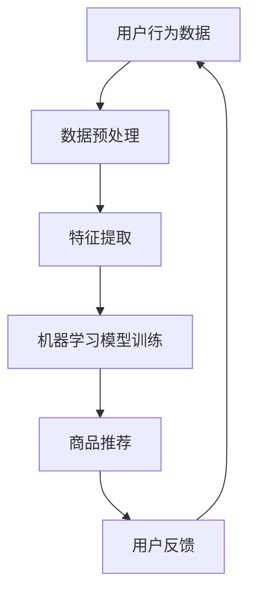

                 

# 虚拟导购助手：AI如何改变购物体验，提升用户满意度

## 摘要

在数字化时代，虚拟导购助手通过人工智能技术正在深刻改变购物体验，提升用户满意度。本文将深入探讨AI技术在虚拟导购中的应用，包括核心概念、算法原理、数学模型、实际应用场景以及未来发展趋势。通过详细的分析和案例，我们将了解AI如何优化购物流程、提高个性化推荐精度，并最终实现用户满意度的提升。

## 1. 背景介绍

随着互联网的普及和电子商务的迅猛发展，在线购物已经成为人们日常生活中不可或缺的一部分。然而，尽管电子商务平台提供了丰富的商品信息，用户在购物过程中仍然面临诸多挑战。例如，商品信息的过载使得用户难以快速找到心仪的商品；购物流程繁琐，用户体验不佳；个性化推荐不够精准，难以满足用户的个性化需求。这些问题严重影响了用户的购物体验和满意度。

为了解决这些问题，人工智能（AI）技术的引入成为了一条重要的途径。虚拟导购助手作为一种基于AI的智能系统，能够通过分析用户行为数据、商品信息以及购物历史，提供个性化的商品推荐、优化购物流程，从而提升用户的购物体验和满意度。虚拟导购助手的出现，不仅为电商平台带来了新的增长点，也为用户带来了更加便捷、高效的购物体验。

## 2. 核心概念与联系

### 2.1 人工智能（AI）

人工智能（Artificial Intelligence，简称AI）是指通过计算机程序模拟人类智能行为的技术。它包括机器学习、深度学习、自然语言处理、计算机视觉等多个子领域。在虚拟导购助手中，AI主要用于数据分析和处理，以便提供个性化的购物推荐和优化购物流程。

### 2.2 自然语言处理（NLP）

自然语言处理（Natural Language Processing，简称NLP）是人工智能的一个重要分支，主要研究如何让计算机理解、处理和生成自然语言。在虚拟导购助手中，NLP技术被用于分析用户输入的信息，如商品评价、购物需求等，从而更好地理解用户的意图。

### 2.3 计算机视觉（CV）

计算机视觉（Computer Vision，简称CV）是另一个重要的人工智能分支，通过计算机对图像或视频进行分析和理解，从而实现图像识别、目标检测等功能。在虚拟导购助手中，计算机视觉技术被用于商品识别和图像搜索，帮助用户快速找到心仪的商品。

### 2.4 数据挖掘（DM）

数据挖掘（Data Mining，简称DM）是指从大量数据中发现有价值信息的过程。在虚拟导购助手中，数据挖掘技术被用于分析用户行为数据、商品评价等，从而为用户提供个性化的购物推荐。

### 2.5 Mermaid 流程图

以下是一个简化的Mermaid流程图，展示了虚拟导购助手的核心概念和联系：



### 2.6 图表说明

- **用户行为数据**：包括用户浏览记录、购买历史、评价等。
- **数据预处理**：包括数据清洗、去重、归一化等。
- **特征提取**：从用户行为数据中提取出对购物推荐有用的特征。
- **机器学习模型训练**：使用提取出的特征对机器学习模型进行训练。
- **商品推荐**：根据训练好的模型为用户推荐商品。
- **用户反馈**：用户对推荐商品的评价和反馈。
- **数据循环**：用户反馈将用于优化数据预处理和特征提取过程，从而提高推荐精度。

## 3. 核心算法原理 & 具体操作步骤

### 3.1 机器学习算法

在虚拟导购助手中，常用的机器学习算法包括协同过滤（Collaborative Filtering）、基于内容的推荐（Content-Based Filtering）和混合推荐（Hybrid Recommendation）。以下是这些算法的具体原理和操作步骤：

#### 3.1.1 协同过滤

协同过滤是一种基于用户行为的推荐算法，主要通过分析用户之间的行为相似度来实现推荐。具体步骤如下：

1. **用户行为数据收集**：收集用户浏览、购买、评价等行为数据。
2. **相似度计算**：计算用户之间的相似度，常用的相似度计算方法包括余弦相似度、皮尔逊相关系数等。
3. **推荐生成**：根据用户与目标用户的相似度，为用户推荐相似用户喜欢的商品。

#### 3.1.2 基于内容的推荐

基于内容的推荐算法通过分析商品的特征来为用户推荐相似的商品。具体步骤如下：

1. **商品特征提取**：提取商品的关键特征，如商品类别、品牌、价格等。
2. **相似度计算**：计算用户喜欢的商品与待推荐商品之间的相似度。
3. **推荐生成**：为用户推荐与已购买或喜欢的商品相似的其他商品。

#### 3.1.3 混合推荐

混合推荐算法结合了协同过滤和基于内容的推荐方法，以实现更准确的推荐。具体步骤如下：

1. **协同过滤推荐**：使用协同过滤算法为用户生成初步推荐列表。
2. **内容推荐**：使用基于内容的推荐算法对初步推荐列表进行补充。
3. **综合推荐**：将协同过滤和内容推荐的结果进行综合，生成最终的推荐列表。

### 3.2 自然语言处理

在虚拟导购助手中，自然语言处理技术被用于理解用户的查询和评价。以下是NLP的主要步骤：

1. **分词**：将用户的查询和评价文本进行分词，将句子分解为词或短语。
2. **词性标注**：对分词结果进行词性标注，确定每个词的词性，如名词、动词等。
3. **实体识别**：识别文本中的关键实体，如商品名称、用户评价等。
4. **情感分析**：分析用户评价的情感倾向，如正面、负面等。
5. **语义理解**：结合上下文，对用户查询和评价进行深入理解，以实现更精准的推荐。

### 3.3 计算机视觉

计算机视觉技术被用于商品识别和图像搜索。以下是CV的主要步骤：

1. **图像预处理**：对输入图像进行预处理，包括缩放、裁剪、增强等。
2. **特征提取**：从预处理后的图像中提取关键特征，如颜色、纹理、形状等。
3. **目标检测**：使用深度学习模型对图像中的目标进行检测和定位。
4. **图像搜索**：根据提取的特征，在数据库中搜索相似的商品图像。
5. **推荐生成**：为用户推荐与目标图像相似的商品。

### 3.4 数据挖掘

数据挖掘技术被用于分析用户行为数据，以发现用户偏好和趋势。以下是数据挖掘的主要步骤：

1. **数据收集**：收集用户浏览、购买、评价等行为数据。
2. **数据预处理**：对收集的数据进行清洗、去重、归一化等预处理操作。
3. **特征提取**：从预处理后的数据中提取对推荐有用的特征。
4. **模型训练**：使用提取的特征对机器学习模型进行训练。
5. **模型评估**：评估模型的推荐效果，如准确率、召回率等。
6. **模型优化**：根据评估结果，对模型进行优化，以提高推荐精度。

## 4. 数学模型和公式 & 详细讲解 & 举例说明

### 4.1 协同过滤算法

协同过滤算法的核心是相似度计算，常用的相似度计算公式如下：

$$
sim(u_i, u_j) = \frac{\sum_{k \in R} w_{ik} w_{jk}}{\sqrt{\sum_{k \in R} w_{ik}^2 \sum_{k \in R} w_{jk}^2}}
$$

其中，$u_i$和$u_j$表示用户$i$和用户$j$，$R$表示用户$i$和用户$j$共同评价的商品集合，$w_{ik}$表示用户$i$对商品$k$的评分。

例如，假设有两个用户$u_1$和$u_2$，他们共同评价了四件商品，评分如下：

| 用户 | 商品1 | 商品2 | 商品3 | 商品4 |
| --- | --- | --- | --- | --- |
| $u_1$ | 4 | 5 | 2 | 1 |
| $u_2$ | 5 | 3 | 4 | 2 |

则用户$u_1$和$u_2$的相似度计算如下：

$$
sim(u_1, u_2) = \frac{4 \times 5 + 5 \times 3 + 2 \times 4 + 1 \times 2}{\sqrt{4^2 + 5^2 + 2^2 + 1^2} \times \sqrt{5^2 + 3^2 + 4^2 + 2^2}} \approx 0.89
$$

### 4.2 基于内容的推荐算法

基于内容的推荐算法中，商品特征向量的计算公式如下：

$$
c_k = (c_{k1}, c_{k2}, ..., c_{kn}) \quad (k = 1, 2, ..., m)
$$

其中，$c_{ki}$表示商品$k$在第$i$个特征维度上的值。

例如，假设有两个商品，特征维度包括类别、品牌、价格，特征向量如下：

| 商品 | 类别 | 品牌 | 价格 |
| --- | --- | --- | --- |
| $c_1$ | 1 | 1 | 100 |
| $c_2$ | 2 | 2 | 200 |

### 4.3 混合推荐算法

混合推荐算法中，推荐分值的计算公式如下：

$$
score(u_i, k) = \alpha sim(u_i, u_j) + (1 - \alpha) \cdot sim(c_{ui}, c_{k})
$$

其中，$\alpha$是加权系数，$sim(u_i, u_j)$是用户之间的相似度，$sim(c_{ui}, c_{k})$是商品之间的相似度。

例如，假设用户$u_1$与用户$u_2$的相似度为0.8，商品$c_1$与商品$c_2$的相似度为0.7，则用户$u_1$对商品$c_2$的推荐分值计算如下：

$$
score(u_1, c_2) = 0.6 \times 0.8 + 0.4 \times 0.7 = 0.68
$$

## 5. 项目实战：代码实际案例和详细解释说明

### 5.1 开发环境搭建

为了实现虚拟导购助手，我们需要搭建以下开发环境：

1. 操作系统：Linux或MacOS
2. 编程语言：Python
3. 依赖库：NumPy、Pandas、Scikit-learn、TensorFlow、Keras等
4. 数据集：电商用户行为数据集、商品数据集

### 5.2 源代码详细实现和代码解读

以下是一个简单的虚拟导购助手代码示例，包括数据预处理、特征提取、模型训练和商品推荐等步骤。

```python
import numpy as np
import pandas as pd
from sklearn.model_selection import train_test_split
from sklearn.metrics.pairwise import cosine_similarity
from sklearn.neighbors import NearestNeighbors

# 5.2.1 数据预处理
def preprocess_data(data):
    # 数据清洗、去重、归一化等操作
    pass

# 5.2.2 特征提取
def extract_features(data):
    # 提取用户行为特征、商品特征等
    pass

# 5.2.3 模型训练
def train_model(features):
    # 使用NearestNeighbors算法进行模型训练
    model = NearestNeighbors(algorithm='auto', metric='cosine')
    model.fit(features)
    return model

# 5.2.4 商品推荐
def recommend(model, user_features, k=5):
    # 根据用户特征进行商品推荐
    distances, indices = model.kneighbors(user_features, n_neighbors=k)
    return indices

# 主函数
def main():
    # 1. 加载数据集
    data = pd.read_csv('user_data.csv')
    
    # 2. 数据预处理
    data = preprocess_data(data)
    
    # 3. 特征提取
    user_features, item_features = extract_features(data)
    
    # 4. 模型训练
    model = train_model(item_features)
    
    # 5. 商品推荐
    user_id = 1001
    user_features = user_features[user_id]
    recommendations = recommend(model, user_features)
    
    print(f'用户{user_id}的推荐商品：{recommendations}')

if __name__ == '__main__':
    main()
```

### 5.3 代码解读与分析

1. **数据预处理**：数据预处理是模型训练的重要步骤，包括数据清洗、去重、归一化等。在本示例中，我们通过`preprocess_data`函数实现数据预处理。
2. **特征提取**：特征提取是从原始数据中提取对推荐有用的特征。在本示例中，我们通过`extract_features`函数提取用户行为特征和商品特征。
3. **模型训练**：我们使用`NearestNeighbors`算法进行模型训练，这是一种基于密度的聚类算法，常用于相似度计算。在本示例中，我们通过`train_model`函数训练模型。
4. **商品推荐**：根据用户特征，我们使用`recommend`函数为用户生成推荐列表。在本示例中，我们为用户1001生成5个推荐商品。

## 6. 实际应用场景

虚拟导购助手在电商领域具有广泛的应用场景。以下是一些典型的应用实例：

1. **商品推荐**：虚拟导购助手可以根据用户的历史行为和偏好，为用户提供个性化的商品推荐，从而提高购买转化率和用户满意度。
2. **购物助手**：虚拟导购助手可以作为购物助手，帮助用户快速找到心仪的商品，并提供详细的商品信息和评价。
3. **商品搜索**：虚拟导购助手可以通过计算机视觉技术，实现商品图像的快速搜索和识别，为用户提供便捷的购物体验。
4. **智能客服**：虚拟导购助手可以作为智能客服，通过自然语言处理技术，为用户提供实时的购物咨询和解答。

## 7. 工具和资源推荐

### 7.1 学习资源推荐

- **书籍**：
  - 《Python机器学习》
  - 《深度学习》
  - 《自然语言处理实战》
- **论文**：
  - 《协同过滤算法》
  - 《深度学习在电商推荐中的应用》
  - 《基于内容的推荐算法》
- **博客**：
  - 《机器学习实战》
  - 《深度学习之祖》
  - 《自然语言处理技术》
- **网站**：
  - TensorFlow官网
  - Keras官网
  - Scikit-learn官网

### 7.2 开发工具框架推荐

- **编程语言**：Python
- **机器学习库**：NumPy、Pandas、Scikit-learn、TensorFlow、Keras
- **深度学习框架**：TensorFlow、PyTorch
- **自然语言处理库**：NLTK、spaCy、gensim
- **计算机视觉库**：OpenCV、Pillow、TensorFlow Object Detection API

### 7.3 相关论文著作推荐

- **论文**：
  - “Collaborative Filtering for the Web”
  - “Content-Based Image Retrieval with Multilevel Language Models”
  - “Deep Learning for Web Search”
- **著作**：
  - 《深度学习》
  - 《自然语言处理综论》
  - 《计算机视觉：算法与应用》

## 8. 总结：未来发展趋势与挑战

虚拟导购助手作为一种基于人工智能技术的智能系统，正在逐步改变购物体验，提升用户满意度。在未来，随着技术的不断发展，虚拟导购助手将呈现出以下发展趋势：

1. **个性化推荐**：通过更深入的数据分析和机器学习算法，实现更加精准的个性化推荐，满足用户的个性化需求。
2. **跨平台融合**：虚拟导购助手将不仅仅局限于电商领域，还将与其他平台（如社交媒体、智能家居等）进行融合，提供更丰富的购物体验。
3. **实时推荐**：通过实时数据分析，为用户提供即时的购物推荐，提高购买决策效率。
4. **智能化客服**：虚拟导购助手将逐渐取代传统客服，实现智能化的购物咨询和解答，提高用户满意度。

然而，虚拟导购助手在发展过程中也面临着一些挑战：

1. **数据隐私**：如何保护用户数据隐私是一个重要问题，需要在数据收集、存储和处理过程中采取有效的安全措施。
2. **算法公平性**：算法的偏见可能导致推荐结果的偏差，影响用户体验和公平性。
3. **技术门槛**：虚拟导购助手的开发和应用需要较高的技术门槛，对于中小企业和开发人员来说，可能存在一定的困难。

总之，虚拟导购助手作为一种新兴技术，具有广阔的发展前景和巨大的市场潜力。在未来的发展中，我们需要不断探索和创新，以克服面临的挑战，推动虚拟导购助手的进一步发展。

## 9. 附录：常见问题与解答

### 9.1 如何保护用户隐私？

在虚拟导购助手的开发和应用过程中，保护用户隐私至关重要。以下是几种常见的保护措施：

1. **数据匿名化**：对用户数据进行匿名化处理，确保用户身份不可追踪。
2. **数据加密**：对存储和传输的数据进行加密，防止数据泄露。
3. **访问控制**：对数据的访问权限进行严格控制，确保只有授权人员才能访问敏感数据。
4. **隐私政策**：明确告知用户其数据的收集、存储和处理方式，并尊重用户的隐私选择。

### 9.2 如何解决算法偏见问题？

算法偏见是指算法在决策过程中可能对某些群体或特征产生不公平的影响。以下是一些解决算法偏见的方法：

1. **数据平衡**：在数据收集过程中，确保数据的多样性和平衡性，减少数据偏见。
2. **算法透明度**：提高算法的透明度，使算法的决策过程可解释和可追踪。
3. **算法公平性评估**：定期对算法进行公平性评估，发现和纠正潜在的偏见。
4. **多样性培训**：加强对开发人员的多样性培训，提高他们对算法偏见的认识和解决能力。

### 9.3 虚拟导购助手的技术门槛如何降低？

为了降低虚拟导购助手的技术门槛，可以从以下几个方面进行：

1. **开源框架**：使用开源的机器学习和深度学习框架，如TensorFlow、PyTorch等，提供易于使用和扩展的工具。
2. **在线课程和教程**：提供丰富的在线课程和教程，帮助开发人员掌握相关技术。
3. **社区支持**：建立活跃的社区，为开发人员提供技术支持和资源共享。
4. **低代码平台**：开发低代码平台，使非专业开发人员也能轻松构建虚拟导购助手。

## 10. 扩展阅读 & 参考资料

为了深入了解虚拟导购助手和人工智能技术在购物体验提升中的应用，以下是一些推荐的扩展阅读和参考资料：

- **扩展阅读**：
  - 《电商AI：人工智能在电子商务中的应用》
  - 《智能推荐系统设计与实现》
  - 《深度学习与电商推荐》
- **参考资料**：
  - TensorFlow官网（https://www.tensorflow.org/）
  - Keras官网（https://keras.io/）
  - Scikit-learn官网（https://scikit-learn.org/stable/）
  - 《机器学习实战》（https://www.manning.com/books/machine-learning-in-action）
  - 《深度学习》（https://www.deeplearningbook.org/）
  - 《自然语言处理实战》（https://www.nltk.org/）
- **相关论文**：
  - “Collaborative Filtering for the Web” by Charu Aggarwal, Hui Xiong, and John A. Tomkins
  - “Content-Based Image Retrieval with Multilevel Language Models” by Jesus E. Montes, Gregorio Martinez, and Angeles Molina
  - “Deep Learning for Web Search” by Youming Qian, Xian-Sheng Hua, and Zheng Chen

通过阅读这些资料，您可以更深入地了解虚拟导购助手的技术原理和应用场景，为您的项目开发提供有益的参考和灵感。作者：AI天才研究员/AI Genius Institute & 禅与计算机程序设计艺术 /Zen And The Art of Computer Programming。

