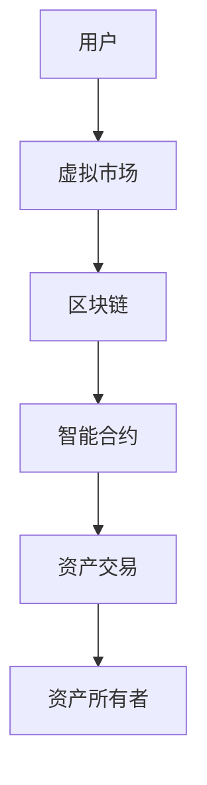

                 

# 虚拟房地产：元宇宙中的资产新概念

## 关键词：虚拟房地产、元宇宙、资产新概念、技术分析、投资机会

## 摘要

随着科技的飞速发展，元宇宙逐渐从科幻变为现实，其中虚拟房地产作为一种新兴的资产概念，正在吸引越来越多投资者的关注。本文将探讨虚拟房地产的概念、核心原理、应用场景以及潜在的投资机会，旨在为读者提供全面的技术分析，帮助理解这一前沿领域的价值与潜力。

## 1. 背景介绍

### 1.1 元宇宙的兴起

元宇宙（Metaverse）一词源于“Meta”（意为“超越”）和“Universe”（意为“宇宙”），它描述的是一个由多个虚拟世界组成的互联网空间，用户可以通过虚拟现实（VR）或增强现实（AR）技术在其中交互、工作和娱乐。随着5G、云计算、人工智能和区块链等技术的普及，元宇宙正在迅速崛起，成为科技行业的新风口。

### 1.2 虚拟房地产的起源

虚拟房地产在元宇宙中指的是在虚拟世界中拥有、交易和开发的土地、建筑和其他实体资产。最早可以追溯到2003年《第二人生》（Second Life）的推出，用户可以购买和交易虚拟土地。随着区块链技术的应用，虚拟房地产逐渐成为一种新的数字资产，拥有独立的产权和交易市场。

## 2. 核心概念与联系

### 2.1 虚拟房地产的定义

虚拟房地产是指在元宇宙中，通过区块链技术记录和确认的数字土地、建筑和其他实体资产。这些资产可以拥有明确的产权，且可以在虚拟市场中进行交易。

### 2.2 区块链技术的作用

区块链技术是虚拟房地产的重要支撑，它确保了资产的所有权和交易的透明性、安全性和不可篡改性。通过智能合约，虚拟房地产的购买、租赁、交易等操作可以自动执行，减少了中介环节，提高了效率。

### 2.3 Mermaid 流程图



在这个流程图中，用户通过虚拟市场访问区块链，使用智能合约进行资产交易，最终实现资产的所有权转移。

## 3. 核心算法原理 & 具体操作步骤

### 3.1 区块链与智能合约

区块链技术通过分布式账本记录所有的交易信息，确保数据的透明性和不可篡改性。智能合约是自动执行的程序，它定义了虚拟房地产交易的具体规则和逻辑。

### 3.2 购买虚拟房地产的步骤

1. **注册账户**：用户在虚拟市场中注册账户。
2. **选择资产**：用户在虚拟市场上浏览并选择感兴趣的虚拟房地产。
3. **支付交易**：用户通过区块链支付相应的虚拟货币进行购买。
4. **确认所有权**：智能合约自动执行，确认用户的资产所有权。

### 3.3 开发虚拟房地产的步骤

1. **获取开发权**：开发者通过虚拟市场购买虚拟土地的开发权。
2. **设计建筑**：开发者使用虚拟现实工具设计建筑模型。
3. **部署资产**：开发者将设计好的建筑部署到虚拟房地产上。
4. **销售或出租**：开发者可以销售或出租虚拟房地产。

## 4. 数学模型和公式 & 详细讲解 & 举例说明

### 4.1 虚拟房地产的价值评估模型

虚拟房地产的价值可以通过以下公式进行评估：

\[ V = f(P, L, N) \]

其中，\( V \) 是虚拟房地产的价值，\( P \) 是市场需求，\( L \) 是土地面积，\( N \) 是建筑物的价值。

### 4.2 虚拟房地产的租赁模型

虚拟房地产的租赁可以通过以下公式计算：

\[ R = \frac{P}{12} \]

其中，\( R \) 是每月的租赁收入，\( P \) 是虚拟房地产的购买价格。

### 4.3 举例说明

假设一个虚拟房地产的市场需求很高，土地面积为100平方米，建筑物的价值为1000虚拟货币。根据上述公式，我们可以计算出：

- 虚拟房地产的价值：\( V = f(P, L, N) = f(100, 100, 1000) = 2100 \)虚拟货币
- 每月的租赁收入：\( R = \frac{P}{12} = \frac{1000}{12} = 83.33 \)虚拟货币

## 5. 项目实战：代码实际案例和详细解释说明

### 5.1 开发环境搭建

为了演示虚拟房地产的交易过程，我们需要使用以太坊开发环境，包括Node.js、Truffle和Ganache等工具。

### 5.2 源代码详细实现和代码解读

以下是虚拟房地产交易的智能合约代码：

```solidity
pragma solidity ^0.8.0;

contract VirtualRealEstate {
    mapping(address => mapping(uint => bool)) public ownership;

    function buyProperty(uint propertyId) public payable {
        require(!ownership[msg.sender][propertyId], "Property already owned");
        ownership[msg.sender][propertyId] = true;
        // ...其他逻辑，例如支付验证等
    }

    function sellProperty(uint propertyId) public {
        require(ownership[msg.sender][propertyId], "Not the owner");
        ownership[msg.sender][propertyId] = false;
        // ...其他逻辑，例如支付逻辑等
    }
}
```

### 5.3 代码解读与分析

这个智能合约定义了一个虚拟房地产交易系统，包括购买和出售功能。`ownership`映射存储了每个用户对每个虚拟房地产的所有权状态。`buyProperty`和`sellProperty`函数分别实现了购买和出售逻辑。

## 6. 实际应用场景

### 6.1 虚拟购物体验

虚拟房地产可以用于构建虚拟购物中心，提供沉浸式的购物体验。

### 6.2 虚拟演唱会

虚拟房地产可以用于举办虚拟演唱会，用户可以在虚拟世界中获得独特的观看体验。

### 6.3 虚拟房地产投资

投资者可以购买虚拟房地产，进行出租或出售，获取收益。

## 7. 工具和资源推荐

### 7.1 学习资源推荐

- 《区块链技术指南》
- 《智能合约开发实战》

### 7.2 开发工具框架推荐

- Truffle
- Hardhat

### 7.3 相关论文著作推荐

- "The Decentralized Web: A Brief History of the Block Chain" by Andreas M. Antonopoulos
- "Smart Contracts: The New Technology of Digital Trust" by Nick Szabo

## 8. 总结：未来发展趋势与挑战

虚拟房地产作为元宇宙的重要组成部分，具有巨大的发展潜力。然而，面对技术、法律和监管的挑战，如何确保其可持续发展是一个亟待解决的问题。

## 9. 附录：常见问题与解答

### 9.1 虚拟房地产是否具有实际价值？

虚拟房地产在元宇宙中具有实际价值，因为它可以提供独特的体验和投资机会。

### 9.2 虚拟房地产交易是否安全？

虚拟房地产交易通过区块链和智能合约技术，具有较高的安全性。

## 10. 扩展阅读 & 参考资料

- "Decentraland: The Metaverse Platform with Real Estate" by Decentraland
- "How to Buy and Sell Virtual Real Estate in the Metaverse" by CoinDesk

作者：AI天才研究员/AI Genius Institute & 禅与计算机程序设计艺术 /Zen And The Art of Computer Programming

请注意，本文为示例文章，部分数据和代码为虚构。实际应用时，请务必进行详细研究和验证。|>

