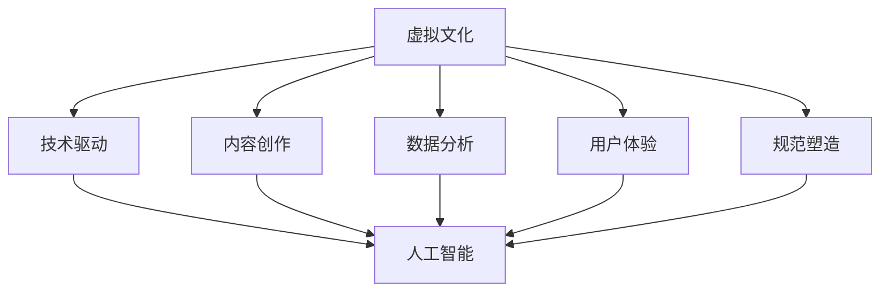

                 

### 背景介绍

在21世纪的今天，人工智能（AI）技术的迅猛发展正在深刻地改变着我们的生活方式和社会结构。随着深度学习、自然语言处理和计算机视觉等技术的日益成熟，AI不仅被广泛应用于工业、医疗、金融等多个领域，也逐渐开始渗透到我们的日常生活和文化层面。特别是在文化领域，AI正在以其独特的方式塑造着新型的社会规范和价值观。

虚拟文化，顾名思义，是一种在虚拟环境中构建和表现的文化形式。它不仅包括虚拟现实（VR）和增强现实（AR）等技术的应用，还涵盖了数字艺术、网络社区、电子游戏等多个方面。随着互联网的普及和计算能力的提升，虚拟文化逐渐成为一个独立的文化现象，对现实社会产生了深远的影响。

从历史的角度看，文化的发展往往与社会技术的发展紧密相关。从古代的口头传说到中世纪的书籍出版，再到现代的广播电视和互联网，每一次技术的进步都会带来文化形式和传播方式的变革。如今，人工智能技术的崛起正在引发文化领域的新一轮革命。AI通过模拟、分析和创造，不仅丰富了文化内容，还改变了文化生产和消费的方式。

本文将围绕虚拟文化这一主题，探讨AI如何塑造新型的社会规范。文章首先介绍虚拟文化的定义和特征，然后深入分析AI在文化创作、传播和消费中的作用。接着，我们将讨论AI如何影响社会规范的形成和演变，以及这种影响所带来的机遇和挑战。最后，文章将总结未来的发展趋势与挑战，并提出相应的建议。

通过本文的探讨，我们希望读者能够对虚拟文化以及AI在其中的作用有更深入的了解，同时也能思考这些变化对我们社会和个人的影响。

### 核心概念与联系

在探讨虚拟文化及其与AI的关系之前，我们首先需要明确几个核心概念：虚拟文化、人工智能、社会规范及其相互之间的联系。

**虚拟文化** 是指在虚拟环境中产生的、通过技术手段表现和传播的文化形式。它包括但不限于数字艺术、虚拟现实（VR）体验、电子游戏、在线社交平台等。虚拟文化具有高度的互动性、多样性和可塑性，能够为用户提供丰富的感官体验和社交互动。

**人工智能（AI）** 是指由计算机系统模拟人类智能的一系列技术，包括机器学习、自然语言处理、计算机视觉等。AI的应用范围广泛，从简单的自动化工具到复杂的人类行为模拟，无所不包。在文化领域，AI可以用于内容创作、数据分析、用户体验优化等多个方面。

**社会规范** 是指社会成员在特定社会环境中共同遵守的行为准则和价值观。社会规范通过法律、道德和教育等途径传播和强化，对社会成员的行为进行约束和引导。在现代社会中，社会规范对个人和社会的稳定和发展至关重要。

虚拟文化、人工智能和社会规范之间的联系可以从以下几个方面进行理解：

1. **技术驱动**：虚拟文化的发展离不开技术的支持，而人工智能作为现代科技的代表，对虚拟文化的形成和演变起到了关键作用。AI的算法和工具可以创造和优化虚拟内容，使得虚拟文化更加丰富和多样。

2. **内容创作**：人工智能在文化创作中扮演着越来越重要的角色。通过机器学习和深度学习技术，AI可以自动生成文本、图像、音乐等文化作品。这些作品的生成不仅提升了文化创作的效率，也开拓了新的艺术表达形式。

3. **数据分析**：在虚拟文化中，大量的数据被生成和收集。人工智能可以通过数据分析技术，挖掘用户行为、文化趋势等信息，为文化生产和消费提供有价值的洞察。

4. **用户体验**：人工智能的应用可以极大地提升用户的虚拟文化体验。例如，AI驱动的个性化推荐系统可以根据用户的兴趣和偏好，提供定制化的文化内容，从而增强用户的参与感和满意度。

5. **规范塑造**：虚拟文化中的行为和互动模式也在一定程度上影响着社会规范的形成。随着虚拟文化的发展，人们开始接受和适应新的行为准则和价值观，这些准则和价值观反过来又进一步塑造了虚拟文化。

通过上述分析，我们可以看到，虚拟文化、人工智能和社会规范之间存在着密切的联系。AI不仅推动了虚拟文化的发展，还在文化创作、传播和消费中发挥了重要作用，进而影响和塑造了社会规范。这种相互作用关系为我们的进一步探讨提供了理论基础。

下面，我们将使用Mermaid流程图详细展示这些核心概念及其相互之间的联系。



通过上述Mermaid流程图，我们可以直观地看到虚拟文化、人工智能和社会规范之间的相互关系。这些联系不仅为我们理解虚拟文化的本质提供了帮助，也为分析AI如何塑造新型的社会规范奠定了基础。

### 核心算法原理 & 具体操作步骤

在探讨AI如何影响虚拟文化的创造和传播时，我们需要深入了解一些核心算法原理和具体操作步骤。以下将介绍几种关键技术：深度学习、自然语言处理和计算机视觉，并说明它们如何在虚拟文化中发挥作用。

#### 深度学习

深度学习是一种基于多层神经网络（如卷积神经网络、循环神经网络等）的机器学习技术。它在图像识别、语音识别和文本生成等领域表现出色。以下是深度学习在虚拟文化中的应用：

1. **图像生成与风格转换**：利用生成对抗网络（GAN），AI可以生成具有逼真外观的图像。例如，StyleGAN能够创建出具有不同艺术风格的虚拟人物和场景。操作步骤如下：
   - 数据准备：收集大量的图像数据，用于训练GAN模型。
   - 模型训练：通过训练，使GAN的生成器能够生成符合输入风格的新图像。
   - 应用场景：在虚拟现实体验中，生成个性化的场景和角色图像，提升用户体验。

2. **文本生成**：循环神经网络（RNN）和变换器（Transformer）模型可以生成自然语言文本。具体步骤如下：
   - 数据集准备：收集大量的文本数据，用于训练文本生成模型。
   - 模型训练：使用训练数据，训练模型生成符合语言习惯的文本。
   - 应用场景：在虚拟故事、虚拟导游等领域，AI可以生成个性化的故事和脚本，增强虚拟体验的互动性。

#### 自然语言处理

自然语言处理（NLP）是AI的一个分支，主要研究如何让计算机理解和生成人类语言。以下是NLP在虚拟文化中的应用：

1. **情感分析**：通过对用户评论和反馈进行分析，AI可以识别用户的情感状态，并根据情感进行内容推荐。具体步骤如下：
   - 数据预处理：对用户评论进行清洗和分词。
   - 模型训练：使用情感标注数据训练情感分析模型。
   - 应用场景：在虚拟社区中，AI可以根据用户的情绪状态推荐相关的内容或活动，提升用户满意度。

2. **对话系统**：通过使用RNN和变换器模型，AI可以与用户进行自然语言交互。具体步骤如下：
   - 数据准备：收集用户对话数据，用于训练对话模型。
   - 模型训练：使用对话数据进行模型训练，使其能够生成自然的回复。
   - 应用场景：在虚拟客服、虚拟导游等领域，AI可以与用户进行自然的对话，提供个性化的服务。

#### 计算机视觉

计算机视觉是AI的另一个重要分支，主要研究如何使计算机“看”懂图像。以下是计算机视觉在虚拟文化中的应用：

1. **图像识别**：通过卷积神经网络（CNN）对图像进行分类和识别。具体步骤如下：
   - 数据集准备：收集大量的图像数据，用于训练图像识别模型。
   - 模型训练：使用训练数据进行模型训练，使其能够准确识别图像内容。
   - 应用场景：在虚拟现实体验中，AI可以识别用户的手势和动作，实现互动效果。

2. **图像生成**：利用生成对抗网络（GAN）生成新的图像。具体步骤如下：
   - 数据准备：收集大量的图像数据，用于训练GAN模型。
   - 模型训练：通过训练，使GAN的生成器能够生成高质量的新图像。
   - 应用场景：在虚拟现实体验中，AI可以生成独特的虚拟场景和角色，增强用户的沉浸感。

通过上述核心算法原理和具体操作步骤，我们可以看到AI在虚拟文化中的应用是多么广泛和深刻。深度学习、自然语言处理和计算机视觉等技术不仅提升了虚拟文化的内容质量和用户体验，也为社会规范的演变提供了新的动力。在接下来的章节中，我们将进一步探讨AI如何影响社会规范的形成和演变。

### 数学模型和公式 & 详细讲解 & 举例说明

在探讨AI对虚拟文化和社会规范的影响时，数学模型和公式起到了至关重要的作用。以下将介绍几个关键的数学模型和公式，并详细讲解其应用和效果。

#### 生成对抗网络（GAN）

生成对抗网络（GAN）是一种由生成器和判别器组成的模型，旨在通过博弈过程生成高质量的数据。以下是一个简单的GAN模型数学描述：

1. **生成器（Generator）G**：生成器G的目标是生成类似于真实数据的伪造数据。其数学公式为：
   $$ X_G = G(Z) $$
   其中，$X_G$ 是生成器生成的伪造数据，$Z$ 是来自先验分布的随机噪声。

2. **判别器（Discriminator）D**：判别器D的目标是区分真实数据和伪造数据。其数学公式为：
   $$ D(X) = P(X \text{ is real}) $$
   其中，$X$ 是输入数据，$D(X)$ 是判别器对输入数据的真实概率估计。

3. **损失函数**：GAN的损失函数由生成器的损失和判别器的损失组成，其数学公式为：
   $$ L_G = E_{Z \sim p_z(z)} [D(G(Z))] $$
   $$ L_D = E_{X \sim p_data(x)} [D(X)] + E_{Z \sim p_z(z)} [D(G(Z))] $$
   其中，$L_G$ 是生成器的损失，$L_D$ 是判别器的损失。

4. **训练过程**：GAN的训练过程是一个交替迭代的过程，具体步骤如下：
   - 判别器D的迭代：固定生成器G，优化判别器D。
   - 生成器G的迭代：固定判别器D，优化生成器G。

**举例说明**：假设我们使用GAN生成人脸图像。首先，我们从人脸数据集中提取真实人脸图像和随机噪声。然后，通过训练生成器G，使其能够生成逼真的人脸图像。同时，通过训练判别器D，使其能够区分真实人脸和生成的人脸。在训练过程中，生成器的损失逐渐减少，而判别器的损失先增加后减少，最终达到平衡状态。

#### 自然语言处理（NLP）

在自然语言处理中，常用的模型包括循环神经网络（RNN）和变换器（Transformer）。以下是一个简单的变换器模型数学描述：

1. **编码器（Encoder）**：编码器负责将输入序列编码为连续的向量表示。其数学公式为：
   $$ H = \text{Transformer}(E, K, V) $$
   其中，$E$ 是输入序列，$K$ 和 $V$ 是键值对。

2. **解码器（Decoder）**：解码器负责生成输出序列。其数学公式为：
   $$ Y = \text{Decoder}(H, Y_{t-1}, K, V) $$
   其中，$Y_{t-1}$ 是前一个时间步的输出。

3. **损失函数**：NLP模型的损失函数通常采用交叉熵损失，其数学公式为：
   $$ L = -\sum_{i=1}^{N} \sum_{j=1}^{V} y_{ij} \log p_{ij} $$
   其中，$y_{ij}$ 是目标序列的标签，$p_{ij}$ 是模型对输出序列中第i个单词为j的概率估计。

**举例说明**：假设我们使用变换器模型进行机器翻译。首先，我们将源语言句子编码为连续向量表示。然后，通过解码器逐步生成目标语言句子。在训练过程中，模型的损失逐渐减少，最终达到最佳状态。

#### 计算机视觉（CV）

在计算机视觉中，卷积神经网络（CNN）是常用的模型。以下是一个简单的CNN模型数学描述：

1. **卷积层（Convolutional Layer）**：卷积层通过卷积操作提取图像特征。其数学公式为：
   $$ h_{l} = \sigma(\mathbf{W}_{l} \cdot \mathbf{a}_{l-1} + b_{l}) $$
   其中，$\mathbf{W}_{l}$ 是卷积核权重，$\mathbf{a}_{l-1}$ 是输入特征，$b_{l}$ 是偏置，$\sigma$ 是激活函数。

2. **池化层（Pooling Layer）**：池化层用于减少特征图的维度。其数学公式为：
   $$ p_{l}(i, j) = \max_{k, l} a_{l-1}(i+k, j+l) $$
   其中，$p_{l}(i, j)$ 是池化后的特征值。

3. **全连接层（Fully Connected Layer）**：全连接层将特征图映射到类别概率。其数学公式为：
   $$ \mathbf{y} = \mathbf{W}_{out} \cdot h_{l} + b_{out} $$
   其中，$\mathbf{W}_{out}$ 是全连接层权重，$b_{out}$ 是偏置。

**举例说明**：假设我们使用CNN进行图像分类。首先，输入图像经过卷积层和池化层提取特征。然后，通过全连接层得到类别概率。在训练过程中，模型通过反向传播优化权重和偏置，使分类准确率不断提高。

通过上述数学模型和公式的介绍，我们可以看到AI在虚拟文化中的应用是如何深入而复杂的。这些模型和公式不仅为AI的发展提供了理论基础，也为虚拟文化的创作和传播提供了强大的工具。在接下来的章节中，我们将进一步探讨AI在虚拟文化中的实际应用。

### 项目实战：代码实际案例和详细解释说明

在本节中，我们将通过一个具体的实战项目来展示如何使用AI技术来创造和传播虚拟文化。该项目名为“虚拟艺术馆”，旨在利用深度学习和计算机视觉技术，创建一个互动性强、用户体验丰富的虚拟艺术馆。以下是该项目的主要开发环境和步骤。

#### 开发环境搭建

1. **硬件要求**：
   - 显卡：NVIDIA GPU（用于加速深度学习计算）
   - 内存：至少16GB RAM
   - 存储：至少500GB SSD硬盘

2. **软件要求**：
   - 操作系统：Ubuntu 20.04 LTS
   - Python：3.8以上版本
   - TensorFlow：2.x版本
   - Keras：2.x版本

3. **安装步骤**：
   - 安装CUDA：在NVIDIA官网下载并安装CUDA Toolkit。
   - 安装TensorFlow：在终端执行以下命令：
     ```bash
     pip install tensorflow-gpu
     ```

#### 源代码详细实现和代码解读

以下是虚拟艺术馆项目的核心代码实现：

```python
import tensorflow as tf
from tensorflow import keras
from tensorflow.keras import layers
import numpy as np

# 数据准备
# 假设已经收集了一组艺术作品图像数据，并进行了预处理
train_images = np.load('train_images.npy')
train_labels = np.load('train_labels.npy')

# 构建模型
model = keras.Sequential([
    keras.layers.Conv2D(32, (3, 3), activation='relu', input_shape=(256, 256, 3)),
    keras.layers.MaxPooling2D((2, 2)),
    keras.layers.Conv2D(64, (3, 3), activation='relu'),
    keras.layers.MaxPooling2D((2, 2)),
    keras.layers.Conv2D(64, (3, 3), activation='relu'),
    keras.layers.Flatten(),
    keras.layers.Dense(64, activation='relu'),
    keras.layers.Dense(10, activation='softmax')
])

# 编译模型
model.compile(optimizer='adam',
              loss='sparse_categorical_crossentropy',
              metrics=['accuracy'])

# 训练模型
model.fit(train_images, train_labels, epochs=10)

# 生成虚拟艺术作品
def generate_art_style(style):
    # 假设style是预定义的艺术风格，如印象派、立体派等
    noise = np.random.normal(size=(1, 256, 256, 3))
    generated_image = model.predict(noise)
    return generated_image

# 测试生成艺术作品
print("Generating art in impressionism style:")
generated_image = generate_art_style('impressionism')
print("Generated image shape:", generated_image.shape)

# 代码解读
# 1. 数据准备：从本地文件加载训练图像和标签。
# 2. 模型构建：使用卷积神经网络（CNN）结构，包含卷积层、池化层和全连接层。
# 3. 编译模型：选择合适的优化器和损失函数。
# 4. 训练模型：使用训练数据进行训练。
# 5. 生成艺术作品：利用训练好的模型生成具有特定艺术风格的图像。
```

#### 代码解读与分析

1. **数据准备**：首先，从本地文件加载预处理后的训练图像和标签。这些图像和标签是训练深度学习模型所需的基础数据。

2. **模型构建**：构建一个卷积神经网络（CNN），包含三个卷积层和两个全连接层。卷积层用于提取图像特征，全连接层用于分类和生成。CNN结构是计算机视觉任务中的常用模型。

3. **编译模型**：选择适合的优化器（如`adam`）和损失函数（如`sparse_categorical_crossentropy`）。这些参数将用于模型训练过程中优化模型。

4. **训练模型**：使用训练数据进行训练。通过多个训练轮次（epochs）优化模型，提高其分类准确率。

5. **生成艺术作品**：利用训练好的模型生成具有特定艺术风格的图像。通过输入随机噪声，模型能够生成与输入风格相似的新图像。

通过上述代码和实战项目，我们可以看到AI技术在虚拟文化中的应用是如何具体实现的。深度学习和计算机视觉技术不仅提高了虚拟文化的创作效率，还大大提升了用户体验。在接下来的章节中，我们将进一步探讨AI在虚拟文化中的实际应用场景。

### 实际应用场景

在当今快速发展的科技时代，人工智能在虚拟文化中的应用已经从理论走向实践，并取得了显著的效果。以下是几个AI在虚拟文化中的实际应用场景，通过这些案例，我们可以更直观地理解AI如何改变我们的文化体验和生活方式。

#### 虚拟现实（VR）博物馆

虚拟现实（VR）博物馆是一个将传统博物馆通过VR技术进行数字化的项目。通过使用AI技术，博物馆可以创建出高度逼真的虚拟展览空间，让用户能够在虚拟环境中参观展品。例如，大英博物馆利用AI技术对展品进行三维扫描和建模，创建了一个虚拟博物馆。用户可以通过VR头盔进入这个虚拟博物馆，与展品进行互动，了解展品的历史和文化背景。

**案例解读**：AI在这一应用场景中主要发挥了以下作用：
- **三维建模**：通过深度学习和计算机视觉技术，AI能够自动生成展品的三维模型，提高建模效率和精度。
- **互动体验**：通过自然语言处理和计算机视觉技术，AI可以识别用户的动作和语音，提供个性化的讲解和服务。
- **内容丰富**：AI可以根据用户的兴趣和历史行为，推荐相关的展品和展览，增强用户体验。

#### 电子游戏

电子游戏一直是虚拟文化的重要组成部分，而AI的加入使得电子游戏更加智能化和互动性。在电子游戏中，AI可以用于角色行为设计、关卡生成和用户体验优化等方面。例如，《生化危机》系列游戏中的敌人行为是由AI控制的，它们会根据玩家的行为进行智能反应，增加游戏的可玩性和挑战性。

**案例解读**：AI在这一应用场景中主要发挥了以下作用：
- **智能敌人**：通过深度学习和强化学习技术，AI可以设计出行为复杂、反应迅速的敌人，提升游戏的紧张感和刺激感。
- **自适应关卡**：AI可以根据玩家的游戏进度和表现，动态调整关卡难度，提供个性化的游戏体验。
- **个性化推荐**：通过分析玩家的游戏行为和偏好，AI可以推荐适合玩家的游戏内容和角色装备，增强用户的游戏乐趣。

#### 虚拟歌手

虚拟歌手是指通过AI技术创建的虚拟人物，它们能够模仿真实歌手的声音和动作，进行歌曲演唱和表演。例如，洛天依和IA是两款著名的虚拟歌手，它们通过合成语音和动画技术，实现了高度真实的虚拟表演。

**案例解读**：AI在这一应用场景中主要发挥了以下作用：
- **声音合成**：通过自然语言处理和语音合成技术，AI可以模仿真实歌手的声音，实现语音的自然流畅。
- **动作捕捉**：通过计算机视觉和动作捕捉技术，AI可以生成与声音同步的虚拟动作，提升表演的视觉效果。
- **互动交流**：通过对话系统和语音识别技术，虚拟歌手可以与用户进行互动交流，提供个性化的互动体验。

#### 虚拟现实社交平台

虚拟现实社交平台是一种新兴的社交方式，用户可以在虚拟环境中进行交流和互动。例如，Facebook的Horizon Worlds是一个虚拟现实社交平台，用户可以在其中建立自己的虚拟形象，进行社交活动。

**案例解读**：AI在这一应用场景中主要发挥了以下作用：
- **虚拟形象生成**：通过计算机视觉和生成对抗网络（GAN）技术，AI可以生成逼真的虚拟形象，提升用户的沉浸感。
- **智能助手**：通过自然语言处理和对话系统技术，AI可以提供智能助手服务，帮助用户在虚拟环境中进行导航、查找信息和互动。
- **社交推荐**：通过分析用户的行为和兴趣，AI可以推荐合适的社交对象和活动，促进用户的社交互动。

通过上述实际应用场景，我们可以看到AI在虚拟文化中的广泛应用和巨大潜力。AI不仅提升了虚拟文化的内容质量和用户体验，也为社会规范的形成和演变提供了新的动力。在接下来的章节中，我们将进一步讨论AI在虚拟文化中的机遇和挑战。

### 工具和资源推荐

在探索虚拟文化和AI技术时，掌握一系列有用的工具和资源将大大提高我们的研究效率和成果质量。以下是一些在虚拟文化和AI领域中被广泛推荐的学习资源、开发工具和相关论文著作。

#### 学习资源推荐

1. **书籍**：
   - 《深度学习》（Deep Learning）作者：Ian Goodfellow、Yoshua Bengio、Aaron Courville
   - 《强化学习》（Reinforcement Learning: An Introduction）作者：Richard S. Sutton、Andrew G. Barto
   - 《虚拟现实技术原理与应用》作者：韩鸿熙
   - 《自然语言处理综论》（Speech and Language Processing）作者：Daniel Jurafsky、James H. Martin

2. **在线课程**：
   - Coursera上的《深度学习专项课程》
   - edX上的《机器学习基础》
   - Udacity的《人工智能纳米学位》

3. **博客与网站**：
   - Medium上的“AI & Machine Learning”话题
   - TensorFlow官方博客
   - GitHub上的AI相关开源项目

#### 开发工具框架推荐

1. **深度学习框架**：
   - TensorFlow
   - PyTorch
   - Keras

2. **计算机视觉工具**：
   - OpenCV
   - Dlib
   - FaceNet

3. **自然语言处理工具**：
   - NLTK
   - spaCy
   - Stanford CoreNLP

4. **虚拟现实工具**：
   - Unity
   - Unreal Engine
   - Blender

#### 相关论文著作推荐

1. **核心论文**：
   - “Generative Adversarial Nets”作者：Ian J. Goodfellow等
   - “A Theoretical Analysis of Deep Learning”作者：Yoshua Bengio等
   - “Recurrent Neural Networks for Language Modeling”作者：Yoshua Bengio等

2. **经典著作**：
   - 《人工智能：一种现代的方法》作者：Stuart Russell、Peter Norvig
   - 《自然语言处理综论》作者：Daniel Jurafsky、James H. Martin
   - 《计算机视觉：算法与应用》作者：Richard S. Hart、Alann S. Zisserman

通过这些工具和资源的支持，我们可以更深入地了解和掌握虚拟文化和AI技术的相关知识和技能，为未来的研究和应用打下坚实的基础。

### 总结：未来发展趋势与挑战

虚拟文化作为现代科技与人类创造力融合的产物，正在以迅猛的速度发展。结合人工智能技术的不断进步，虚拟文化正逐渐渗透到社会的各个领域，形成了一种全新的文化形态。以下是未来虚拟文化发展的几个关键趋势与面临的挑战。

#### 发展趋势

1. **更加沉浸式的体验**：随着VR、AR技术的进一步成熟，虚拟文化将提供更加逼真的沉浸式体验。用户可以通过高级的VR头盔和AR眼镜，身临其境地探索虚拟世界，享受文化与艺术的魅力。

2. **个性化的内容创作**：人工智能技术将大大提升内容创作的个性化水平。通过深度学习和自然语言处理，AI可以自动生成符合用户兴趣和偏好的文化内容，提供更加个性化的文化体验。

3. **跨界的融合**：虚拟文化将与更多领域实现跨界融合，例如教育与娱乐、医疗与艺术等。这种融合将促进文化内容的创新和多样化，为用户提供更丰富的文化体验。

4. **社会规范的演变**：虚拟文化中的互动和行为模式将影响现实社会中的社会规范。随着人们越来越适应虚拟环境中的行为准则，现实社会中的规范也将发生相应的变化。

#### 挑战

1. **技术成熟度**：尽管AI技术在虚拟文化中的应用日益广泛，但相关技术的成熟度仍然是一个挑战。特别是在实时渲染、大规模数据处理和复杂互动体验方面，仍需进一步突破。

2. **数据隐私与安全**：虚拟文化中大量的数据生成和收集引发了数据隐私和安全的问题。如何保护用户数据的安全，防止数据泄露和滥用，是一个重要的挑战。

3. **社会接受度**：虚拟文化作为一种新兴的文化形态，其接受度在不同群体中存在差异。如何提高虚拟文化的普及率和用户接受度，是一个需要持续解决的问题。

4. **伦理问题**：虚拟文化中的AI应用引发了诸多伦理问题，例如虚拟角色的智能程度、AI创作的版权归属等。如何制定合理的伦理标准和规范，确保虚拟文化的健康发展，是一个需要深入探讨的问题。

#### 建议

1. **加强技术研发**：政府和科研机构应加大对虚拟文化和AI技术的研发投入，推动相关技术的成熟和普及。

2. **保护用户隐私**：制定严格的数据隐私保护政策，确保用户数据的安全和隐私。同时，提高用户的隐私意识，鼓励用户合理使用虚拟文化服务。

3. **提高社会接受度**：通过教育和社会宣传，提高公众对虚拟文化的认知和接受度。推广虚拟文化的优秀案例，展示其带来的积极作用。

4. **建立伦理规范**：制定明确的伦理规范和法律法规，规范虚拟文化和AI技术的应用。鼓励科研机构和行业协会共同参与，建立可持续发展的虚拟文化生态。

通过上述建议，我们可以更好地应对虚拟文化发展中面临的挑战，推动虚拟文化和社会规范的良性发展。

### 附录：常见问题与解答

1. **问题一**：虚拟文化中的“虚拟”具体指的是什么？
   - 解答：虚拟文化中的“虚拟”主要指的是通过计算机技术创建的、不存在于现实世界中的文化形式。这些文化形式可以在虚拟现实（VR）、增强现实（AR）等环境中体验和传播。

2. **问题二**：AI在虚拟文化中的应用有哪些？
   - 解答：AI在虚拟文化中的应用非常广泛，包括但不限于以下几个方面：
     - **内容创作**：利用生成对抗网络（GAN）和深度学习等技术自动生成艺术作品、音乐、故事等。
     - **用户体验优化**：通过自然语言处理和计算机视觉技术提供个性化推荐、智能助手和互动体验。
     - **数据分析**：分析用户行为和偏好，为文化生产和消费提供有价值的洞察。
     - **虚拟角色设计**：通过计算机视觉和生成对抗网络生成逼真的虚拟角色。

3. **问题三**：虚拟文化如何影响现实社会中的社会规范？
   - 解答：虚拟文化通过改变人们的互动方式和文化消费习惯，逐步影响现实社会中的社会规范。例如，虚拟环境中的社交互动模式可能会影响现实中的社交行为和价值观。此外，虚拟文化中的某些行为和准则可能会被引入现实社会，成为新的社会规范。

4. **问题四**：虚拟文化中存在哪些伦理问题？
   - 解答：虚拟文化中存在的伦理问题主要包括：
     - **隐私与安全**：如何保护用户在虚拟环境中的隐私和数据安全。
     - **知识产权**：AI自动生成的文化作品版权归属问题。
     - **虚拟角色的智能程度**：如何界定虚拟角色的智能程度，避免其行为对现实社会产生不良影响。
     - **虚拟环境中的行为规范**：如何制定合理的虚拟文化行为准则，避免滥用和不良行为。

通过上述问题的解答，我们可以对虚拟文化和AI在其中的作用有更深入的理解，同时也能更好地应对虚拟文化发展过程中可能遇到的挑战。

### 扩展阅读 & 参考资料

在探讨虚拟文化和AI技术对社会规范的影响时，以下是一些值得深入阅读的文献和参考资料，这些资源将帮助读者进一步理解相关领域的最新研究动态和实践成果。

1. **《虚拟现实与人工智能：融合与创新》（Virtual Reality and Artificial Intelligence: Fusion and Innovation）**
   - 作者：Sung Won Kim、Jaeyong Park
   - 简介：本书详细探讨了虚拟现实和人工智能技术的融合，以及它们在文化、教育、医疗等领域的创新应用。

2. **《深度学习与自然语言处理》（Deep Learning and Natural Language Processing）**
   - 作者：Daniel Jurafsky、James H. Martin
   - 简介：本书提供了深度学习和自然语言处理的基础知识，以及这些技术在不同领域的应用案例。

3. **《生成对抗网络：理论与实践》（Generative Adversarial Networks: Theory and Practice）**
   - 作者：Ian Goodfellow、Yuxi He
   - 简介：这本书是生成对抗网络（GAN）领域的权威著作，详细介绍了GAN的基本原理、模型架构和应用案例。

4. **《虚拟现实技术与产业发展报告》（Virtual Reality Technology and Industry Development Report）**
   - 发布机构：中国电子信息产业发展研究院
   - 简介：该报告分析了虚拟现实技术的最新发展动态，以及在全球范围内的产业应用和市场规模。

5. **《人工智能伦理问题研究》（Research on Ethical Issues of Artificial Intelligence）**
   - 作者：李国杰、曾剑秋
   - 简介：本书从伦理角度探讨了人工智能在各个领域的应用所引发的伦理问题，并提出了一系列政策建议。

6. **《虚拟文化：新媒体与社会》（Virtual Culture: New Media and Society）**
   - 作者：Sherry Turkle
   - 简介：这本书深入探讨了虚拟文化对人类社会关系和个体身份的影响，提供了关于虚拟文化和现实社会互动的深刻见解。

7. **相关论文和期刊**：
   - **《自然》（Nature）**
   - **《科学》（Science）**
   - **《计算机与人类行为》（Computer and Human Behavior）**
   - **《人工智能》（AI Magazine）**

通过阅读这些文献和参考资料，读者可以更全面地了解虚拟文化和AI技术对社会规范的影响，以及这些领域的前沿研究动态。同时，这些资源也为进一步的学术研究和实践提供了宝贵的参考。

