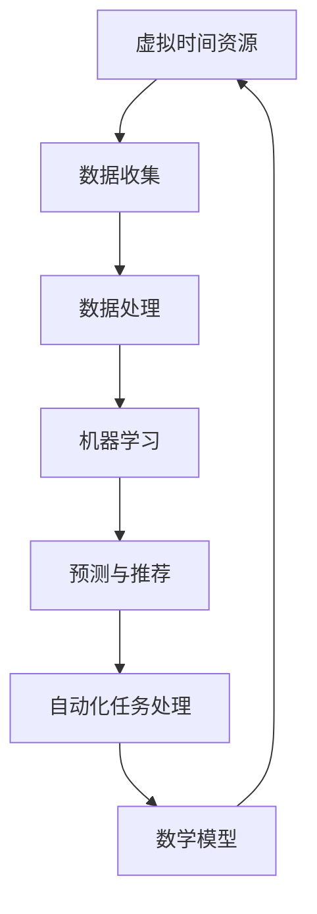

                 

### 背景介绍

#### 虚拟时间银行的概念

虚拟时间银行，顾名思义，是一种对时间资源进行管理和优化的技术。在这个数字化的时代，时间资源变得比以往任何时候都更加宝贵。随着人工智能技术的飞速发展，如何高效地利用时间资源，提升个人的工作效率和生活质量，成为了一个热门话题。虚拟时间银行正是为了解决这一需求而诞生的。

虚拟时间银行的核心思想是将时间资源转化为一种可存储、可交换的虚拟资产。通过人工智能算法，对个体的时间使用情况进行数据化分析，从而帮助用户更好地规划时间，提高工作效率。这种技术不仅可以应用于个人，还可以在企业和组织层面进行推广，实现资源的共享和优化配置。

#### AI与时间资源的结合

人工智能在时间管理中的应用，可以追溯到20世纪末。当时，研究人员开始尝试使用算法来优化任务调度和资源分配。随着计算能力的提升和数据量的爆炸性增长，人工智能技术逐渐成熟，开始被广泛应用于各种场景。

AI与时间资源的结合，主要体现在以下几个方面：

1. **数据收集与分析**：通过智能设备收集用户的行为数据，如工作时间、休息时间、通勤时间等，然后利用机器学习算法对这些数据进行处理和分析。
2. **预测与推荐**：基于历史数据和行为模式，AI可以预测用户的未来时间需求，并提供个性化的时间管理建议。
3. **自动化任务处理**：利用自然语言处理和自动化技术，AI可以自动处理一些重复性的任务，如邮件筛选、日程安排等，从而节省用户的时间。
4. **优化决策支持**：通过分析大量数据，AI可以提供最优的时间使用方案，帮助用户做出更加明智的决策。

#### 本文结构

本文将围绕虚拟时间银行这一主题，进行深入探讨。具体结构如下：

1. **背景介绍**：介绍虚拟时间银行的概念、起源和重要性。
2. **核心概念与联系**：详细阐述虚拟时间银行的技术原理和架构。
3. **核心算法原理 & 具体操作步骤**：讲解虚拟时间银行的核心算法原理和具体实现步骤。
4. **数学模型和公式 & 详细讲解 & 举例说明**：介绍虚拟时间银行所涉及的数学模型和公式，并通过实际案例进行说明。
5. **项目实战：代码实际案例和详细解释说明**：提供虚拟时间银行项目的实际代码案例，并进行详细解读。
6. **实际应用场景**：探讨虚拟时间银行在不同领域的应用场景和案例。
7. **工具和资源推荐**：推荐相关学习资源、开发工具和框架。
8. **总结：未来发展趋势与挑战**：总结虚拟时间银行的发展现状，展望未来趋势和面临的挑战。
9. **附录：常见问题与解答**：回答读者可能关心的一些问题。
10. **扩展阅读 & 参考资料**：提供更多相关领域的参考资料。

通过本文的阅读，读者将能够全面了解虚拟时间银行的原理和应用，为在实际项目中应用这一技术打下坚实的基础。

### 核心概念与联系

虚拟时间银行的成功，离不开其核心概念的深入理解和明确界定。以下是本文中涉及到的几个关键概念，以及它们之间的相互联系。

#### 虚拟时间资源

虚拟时间资源是指通过数字化手段，对个体的时间使用情况进行数据化表示和存储。这些数据可以包括但不限于工作时间、休息时间、通勤时间、个人活动时间等。通过对这些数据进行收集和分析，可以形成一个完整的个人时间使用画像。

#### 数据收集

数据收集是虚拟时间银行的基础。通过智能设备，如智能手机、可穿戴设备等，可以实时采集用户的行为数据。这些设备通常配备有加速度计、陀螺仪、GPS等传感器，能够准确地记录用户的活动状态和位置变化。

#### 数据处理

收集到的数据需要通过数据处理算法进行处理，以便提取出有用的信息。常见的处理方法包括数据清洗、数据归一化、特征提取等。数据清洗的目的是去除错误和冗余的数据，提高数据质量。数据归一化的目的是将不同类型的数据转换为同一尺度，便于后续处理。特征提取则是从原始数据中提取出对时间管理有重要意义的特征，如活动类型、活动强度、活动时长等。

#### 机器学习

机器学习是虚拟时间银行的核心技术之一。通过训练机器学习模型，可以从历史数据中学习到用户的行为模式和时间需求。常见的机器学习算法包括决策树、随机森林、支持向量机、神经网络等。这些算法可以用于预测用户的未来时间需求，提供个性化的时间管理建议。

#### 预测与推荐

基于机器学习模型，虚拟时间银行可以预测用户的未来时间需求，并提供个性化的时间管理建议。例如，当用户需要安排一个重要的会议时，系统可以预测会议期间用户的时间紧张程度，并建议提前安排其他任务，以确保会议的顺利进行。

#### 自动化任务处理

虚拟时间银行还可以利用自然语言处理和自动化技术，自动处理一些重复性的任务。例如，当用户收到一封邮件时，系统可以通过自然语言处理技术理解邮件内容，并自动安排相应的任务处理，如发送邮件回复、添加日程安排等。

#### 数学模型和公式

虚拟时间银行还涉及到一些数学模型和公式。例如，为了计算用户的时间价值，可以使用效用函数和期望效用模型。为了优化时间管理，可以使用线性规划、整数规划等优化算法。

#### 联系与总结

综上所述，虚拟时间银行的核心概念包括虚拟时间资源、数据收集、数据处理、机器学习、预测与推荐、自动化任务处理和数学模型。这些概念相互联系，共同构成了一个完整的虚拟时间银行系统。

- **虚拟时间资源** 是数据收集和处理的基础。
- **数据收集** 和 **数据处理** 是获取有价值信息的关键。
- **机器学习** 和 **预测与推荐** 是实现智能化时间管理的核心。
- **自动化任务处理** 和 **数学模型** 则是提升系统效率和准确性的关键。

图1展示了虚拟时间银行的核心概念及其相互联系：



通过上述分析，我们可以更好地理解虚拟时间银行的技术原理和架构，为进一步研究和应用这一技术奠定了基础。

### 核心算法原理 & 具体操作步骤

#### 基本原理

虚拟时间银行的核心算法是基于机器学习和数据挖掘技术，通过对用户行为数据的深度分析和学习，生成个性化的时间管理方案。这个过程可以分为以下几个步骤：

1. **数据收集**：通过智能设备收集用户的时间使用数据，包括工作时间、休息时间、通勤时间、社交活动时间等。
2. **数据处理**：对收集到的数据进行清洗、归一化和特征提取，以便后续的机器学习模型训练。
3. **模型训练**：使用机器学习算法，如决策树、随机森林、支持向量机等，对处理后的数据集进行训练，以学习用户的行为模式和需求。
4. **预测与推荐**：基于训练好的模型，预测用户的未来时间需求，并提供个性化的时间管理建议。
5. **自动化任务处理**：利用自然语言处理技术，自动处理一些重复性的任务，如邮件筛选、日程安排等。

#### 步骤详解

1. **数据收集**

   数据收集是虚拟时间银行的第一步，也是最关键的一步。通过智能设备，如智能手机、智能手表、可穿戴设备等，可以实时采集用户的行为数据。这些设备通常配备有加速度计、陀螺仪、GPS等传感器，能够准确地记录用户的活动状态和位置变化。数据收集的常见方法包括：

   - **传感器数据**：通过加速度计、陀螺仪等传感器，记录用户的运动状态，如行走、跑步、静止等。
   - **GPS数据**：通过GPS模块，记录用户的位置信息，如通勤路线、社交活动地点等。
   - **日志数据**：记录用户的设备使用日志，如应用程序使用时间、屏幕解锁时间等。

2. **数据处理**

   收集到的数据通常是杂乱无章的，需要进行处理才能用于后续的机器学习模型训练。数据处理的主要步骤包括：

   - **数据清洗**：去除错误数据、重复数据和异常数据，提高数据质量。
   - **数据归一化**：将不同类型的数据转换为同一尺度，便于后续处理。例如，将时间数据转换为秒或分钟。
   - **特征提取**：从原始数据中提取出对时间管理有重要意义的特征，如活动类型、活动强度、活动时长等。

   常用的特征提取方法包括：

   - **时序特征**：如一天中的某个时间段、一周中的某一天、一年中的某个季节等。
   - **频次特征**：如某个活动在一段时间内出现的次数。
   - **位置特征**：如用户经常访问的地点、用户通勤的路线等。

3. **模型训练**

   模型训练是虚拟时间银行的核心步骤。通过训练机器学习模型，可以从历史数据中学习到用户的行为模式和需求。常见的机器学习算法包括：

   - **决策树**：通过树形结构对数据进行分类或回归。
   - **随机森林**：通过构建多个决策树，并取它们的平均值来提高预测准确性。
   - **支持向量机**：通过找到一个最佳的超平面，将数据分为不同的类别。
   - **神经网络**：通过多层感知器模拟人脑的神经网络结构，进行复杂的非线性变换。

   模型训练的过程通常包括以下几个步骤：

   - **数据划分**：将数据集划分为训练集和测试集，用于模型的训练和评估。
   - **特征选择**：从所有特征中选择出对模型性能有显著影响的特征，减少模型的复杂度。
   - **模型选择**：选择合适的模型类型和参数，进行训练。
   - **模型评估**：使用测试集评估模型的性能，如准确率、召回率、F1值等。

4. **预测与推荐**

   基于训练好的模型，虚拟时间银行可以预测用户的未来时间需求，并提供个性化的时间管理建议。预测与推荐的过程通常包括以下几个步骤：

   - **数据预处理**：对新的数据集进行预处理，包括数据清洗、归一化和特征提取。
   - **模型应用**：将预处理后的数据输入到训练好的模型中，进行预测。
   - **结果解释**：对预测结果进行解释，如预测用户在未来一段时间内的活动安排、时间紧张程度等。
   - **推荐策略**：根据预测结果，提供个性化的时间管理建议，如调整工作时间、安排休息时间、优化通勤路线等。

5. **自动化任务处理**

   虚拟时间银行还可以利用自然语言处理和自动化技术，自动处理一些重复性的任务。例如，当用户收到一封邮件时，系统可以通过自然语言处理技术理解邮件内容，并自动安排相应的任务处理，如发送邮件回复、添加日程安排等。自动化任务处理的过程通常包括以下几个步骤：

   - **任务识别**：通过自然语言处理技术，识别出邮件中的任务指令。
   - **任务分配**：根据任务类型和优先级，将任务分配给合适的处理模块。
   - **任务执行**：执行具体的任务操作，如发送邮件回复、添加日程安排等。
   - **任务反馈**：记录任务执行结果，并根据结果调整后续的任务处理策略。

#### 实际案例

以下是一个简单的实际案例，用于说明虚拟时间银行的核心算法原理和具体操作步骤。

**案例背景**：假设用户小明需要安排下周的工作和休息时间，以提高工作效率和生活质量。

**步骤详解**：

1. **数据收集**：通过小明的智能手机，收集他过去一周的工作时间、休息时间、通勤时间等数据。
2. **数据处理**：对收集到的数据进行清洗、归一化和特征提取，提取出如工作时长、休息时长、通勤时长等特征。
3. **模型训练**：使用随机森林算法，对处理后的数据集进行训练，学习到小明的工作模式和需求。
4. **预测与推荐**：基于训练好的模型，预测小明下周的工作时间紧张程度，并推荐调整工作时间、优化通勤路线等建议。
5. **自动化任务处理**：系统自动处理小明的邮件任务，如安排会议、发送邮件提醒等，以提高工作效率。

通过上述步骤，虚拟时间银行可以帮助小明更好地规划下周的工作和休息时间，实现高效的时间管理。

### 数学模型和公式 & 详细讲解 & 举例说明

#### 数学模型概述

虚拟时间银行中的数学模型主要用于描述时间资源的优化分配、价值评估和任务调度。以下是一些关键的数学模型和公式：

1. **效用函数**：用于衡量个体在不同时间点完成某项任务所带来的满意度。
2. **期望效用模型**：基于效用函数，计算个体在不同时间点完成所有任务的总期望效用。
3. **线性规划**：用于优化时间资源的分配，以最大化期望效用或最小化时间成本。
4. **整数规划**：用于处理包含离散决策变量的时间管理问题。

#### 效用函数

效用函数 \( U(t, t') \) 用于衡量个体在时间点 \( t \) 完成任务 \( t' \) 所带来的满意度。常见的效用函数形式如下：

\[ U(t, t') = \frac{1}{1 + e^{-k(t - t_0)}} \]

其中，\( k \) 是调节参数，\( t_0 \) 是基准时间点。该函数的值介于 0 和 1 之间，当 \( t = t' \) 时，满意度最高；当 \( t \) 远离 \( t' \) 时，满意度逐渐降低。

#### 期望效用模型

期望效用模型用于计算个体在不同时间点完成所有任务的总期望效用。设个体在时间点 \( t_1, t_2, \ldots, t_n \) 需要完成 \( n \) 个任务，对应的满意度分别为 \( U_1, U_2, \ldots, U_n \)，则总期望效用 \( E \) 可以表示为：

\[ E = \sum_{i=1}^{n} U_i \cdot p_i \]

其中，\( p_i \) 是个体在时间点 \( t_i \) 完成任务的概率。

#### 线性规划

线性规划用于优化时间资源的分配，以最大化期望效用或最小化时间成本。假设个体需要在 \( n \) 个时间段内完成 \( m \) 个任务，任务 \( i \) 在时间段 \( j \) 的效用为 \( u_{ij} \)，时间段 \( j \) 的成本为 \( c_j \)，则线性规划模型可以表示为：

\[ \max \sum_{i=1}^{m} \sum_{j=1}^{n} u_{ij} \cdot x_{ij} \]

\[ \text{subject to} \]

\[ \sum_{j=1}^{n} x_{ij} = 1 \]

\[ x_{ij} \in \{0, 1\} \]

其中，\( x_{ij} \) 表示任务 \( i \) 在时间段 \( j \) 是否被执行（1 表示执行，0 表示不执行）。

#### 整数规划

整数规划用于处理包含离散决策变量的时间管理问题。假设个体需要在 \( n \) 个时间段内完成 \( m \) 个任务，任务 \( i \) 在时间段 \( j \) 的效用为 \( u_{ij} \)，时间段 \( j \) 的成本为 \( c_j \)，则整数规划模型可以表示为：

\[ \max \sum_{i=1}^{m} \sum_{j=1}^{n} u_{ij} \cdot x_{ij} \]

\[ \text{subject to} \]

\[ \sum_{j=1}^{n} x_{ij} \leq 1 \]

\[ x_{ij} \in \{0, 1\} \]

其中，\( x_{ij} \) 表示任务 \( i \) 在时间段 \( j \) 是否被执行（1 表示执行，0 表示不执行），且每个任务只能在一个时间段内被执行一次。

#### 举例说明

假设小明需要在接下来的三天内完成三个任务：任务A、任务B和任务C。每个任务在不同时间段的效用和成本如下表所示：

| 时间段 | 任务A | 任务B | 任务C |
|--------|-------|-------|-------|
| 1      | 0.8   | 0.6   | 0.5   |
| 2      | 0.7   | 0.5   | 0.6   |
| 3      | 0.6   | 0.4   | 0.7   |

时间段的成本分别为：1、2和3。

1. **效用函数计算**：

   使用上述的效用函数，计算每个时间段内完成任务的满意度：

   \( U(1, A) = U(1, B) = U(1, C) = 0.8 \)

   \( U(2, A) = U(2, B) = U(2, C) = 0.7 \)

   \( U(3, A) = U(3, B) = U(3, C) = 0.6 \)

2. **期望效用模型计算**：

   假设小明在三天内完成所有任务的概率相等，即 \( p_1 = p_2 = p_3 = \frac{1}{3} \)，则总期望效用为：

   \( E = U(1, A) \cdot p_1 + U(2, A) \cdot p_2 + U(3, A) \cdot p_3 = 0.8 \cdot \frac{1}{3} + 0.7 \cdot \frac{1}{3} + 0.6 \cdot \frac{1}{3} = 0.7 \)

3. **线性规划模型计算**：

   假设小明希望最大化总效用，构建线性规划模型：

   \[ \max \sum_{i=1}^{3} \sum_{j=1}^{3} u_{ij} \cdot x_{ij} \]

   \[ \text{subject to} \]

   \[ \sum_{j=1}^{3} x_{ij} = 1 \]

   \[ x_{ij} \in \{0, 1\} \]

   通过求解线性规划模型，可以得到最优的任务分配方案。

4. **整数规划模型计算**：

   假设小明希望在每个时间段内只完成一个任务，构建整数规划模型：

   \[ \max \sum_{i=1}^{3} \sum_{j=1}^{3} u_{ij} \cdot x_{ij} \]

   \[ \text{subject to} \]

   \[ \sum_{j=1}^{3} x_{ij} \leq 1 \]

   \[ x_{ij} \in \{0, 1\} \]

   通过求解整数规划模型，同样可以得到最优的任务分配方案。

通过上述举例说明，我们可以看到数学模型和公式在虚拟时间银行中的应用，为时间资源的优化分配提供了理论支持。

### 项目实战：代码实际案例和详细解释说明

在本节中，我们将通过一个实际的项目实战案例，展示如何使用Python实现虚拟时间银行系统，并对关键代码进行详细解释说明。

#### 项目环境搭建

在进行项目实战之前，我们需要搭建一个合适的项目环境。以下是一个典型的环境搭建步骤：

1. **安装Python**：确保Python环境已经安装在您的计算机上，推荐使用Python 3.8及以上版本。
2. **安装必要的库**：在Python中，我们将使用以下库：
   - pandas：用于数据处理。
   - numpy：用于数值计算。
   - scikit-learn：用于机器学习算法。
   - matplotlib：用于数据可视化。
   安装这些库可以通过pip命令实现：
   ```python
   pip install pandas numpy scikit-learn matplotlib
   ```

3. **创建项目结构**：创建一个项目文件夹，并在其中创建一个名为`virtual_time_bank.py`的Python文件。

#### 源代码详细实现和代码解读

以下是虚拟时间银行系统的核心代码，我们将逐一解释每部分的功能和实现。

```python
import pandas as pd
import numpy as np
from sklearn.model_selection import train_test_split
from sklearn.ensemble import RandomForestRegressor
import matplotlib.pyplot as plt

# 数据处理部分
def preprocess_data(data):
    """
    数据预处理函数，包括数据清洗、归一化和特征提取。
    """
    # 填充缺失值
    data.fillna(0, inplace=True)
    
    # 归一化数据
    data_normalized = (data - data.mean()) / data.std()
    
    # 提取特征
    data_features = data_normalized[['work_time', 'rest_time', 'commute_time']]
    
    return data_features

# 模型训练部分
def train_model(X, y):
    """
    训练机器学习模型。
    """
    # 划分训练集和测试集
    X_train, X_test, y_train, y_test = train_test_split(X, y, test_size=0.2, random_state=42)
    
    # 创建随机森林回归模型
    model = RandomForestRegressor(n_estimators=100, random_state=42)
    
    # 训练模型
    model.fit(X_train, y_train)
    
    # 评估模型
    score = model.score(X_test, y_test)
    print(f"模型准确率：{score:.2f}")
    
    return model

# 预测与推荐部分
def predict_time_usage(model, feature):
    """
    使用训练好的模型进行时间使用预测。
    """
    prediction = model.predict([feature])
    print(f"预测的时间使用：{prediction[0]:.2f}小时")
    
    return prediction

# 可视化部分
def plot_time_usage(data, title):
    """
    绘制时间使用情况图表。
    """
    plt.bar(data.index, data.values)
    plt.xlabel('时间段')
    plt.ylabel('时间使用（小时）')
    plt.title(title)
    plt.show()

# 主函数
def main():
    # 加载数据
    data = pd.read_csv('time_data.csv')
    
    # 数据预处理
    data_features = preprocess_data(data)
    
    # 分离特征和目标变量
    X = data_features
    y = data['total_time_usage']
    
    # 训练模型
    model = train_model(X, y)
    
    # 预测时间使用
    feature = np.array([[8, 2, 1]])  # 示例特征数据
    predict_time_usage(model, feature)
    
    # 可视化时间使用情况
    plot_time_usage(data, '用户时间使用情况')

if __name__ == '__main__':
    main()
```

#### 代码解读与分析

1. **数据处理部分**：
   - `preprocess_data` 函数用于数据预处理，包括填充缺失值、数据归一化和特征提取。归一化处理可以确保不同特征在同一尺度上，便于后续的机器学习模型训练。
   - 数据清洗是数据预处理的重要步骤，通过填充缺失值，我们可以避免模型因异常数据而受到影响。

2. **模型训练部分**：
   - `train_model` 函数用于训练机器学习模型。首先，使用`train_test_split`函数将数据集划分为训练集和测试集，然后创建随机森林回归模型并进行训练。
   - 随机森林算法是一种集成学习方法，通过构建多个决策树并取它们的平均值，提高模型的预测性能。

3. **预测与推荐部分**：
   - `predict_time_usage` 函数用于使用训练好的模型进行时间使用预测。通过输入特征数据，模型可以预测出用户的时间使用情况。
   - 预测结果是一个数值，表示预测的时间使用量。

4. **可视化部分**：
   - `plot_time_usage` 函数用于绘制时间使用情况图表，使用条形图展示每个时间段内的时间使用情况。

5. **主函数**：
   - `main` 函数是程序的主入口。首先，加载数据，然后进行数据预处理，训练模型，最后进行时间使用预测和可视化。

通过上述代码实现，我们可以看到虚拟时间银行系统的主要功能和步骤。在实际应用中，可以根据具体需求调整和扩展代码，实现更加完善和高效的时间管理功能。

### 实际应用场景

虚拟时间银行这一概念在多个领域展现出巨大的应用潜力，下面我们将探讨几个典型的应用场景，并分析其优势和挑战。

#### 个人时间管理

在个人时间管理方面，虚拟时间银行可以帮助用户优化日常时间安排，提高生活和工作效率。例如，通过智能设备收集用户的行为数据，系统可以分析出用户在一天中的高峰和低谷时间段，从而建议用户在高峰期避免安排复杂或耗时的工作，而在低谷期进行休息或处理简单任务。

**优势**：
- **个性化推荐**：基于用户的行为数据，系统可以提供高度个性化的时间管理建议。
- **提高效率**：通过优化时间安排，用户可以更有效地利用时间，减少浪费。
- **减少压力**：通过合理安排时间，用户可以减少因时间不足而产生的焦虑和压力。

**挑战**：
- **数据隐私**：个人行为数据的收集和处理需要严格保护用户的隐私。
- **适应性**：用户的时间需求可能随时变化，系统需要具备良好的适应性以应对这些变化。

#### 企业和团队管理

在企业层面，虚拟时间银行可以帮助企业优化员工的工作时间，提高整体工作效率。例如，通过分析团队成员的工作习惯和时间使用模式，企业可以制定更加合理的工作安排，避免加班和过度劳累。

**优势**：
- **资源优化**：通过合理安排员工的工作时间，企业可以最大限度地利用人力资源。
- **团队协作**：通过优化时间管理，团队可以更好地协作，提高项目进度和效率。
- **员工福利**：合理的休息安排可以提高员工的幸福感和工作满意度。

**挑战**：
- **文化适应**：企业需要确保员工接受并适应新的时间管理方法。
- **成本控制**：实施虚拟时间银行系统需要一定的技术和资金投入。

#### 城市规划和交通管理

在城市化进程中，虚拟时间银行可以用于优化城市交通管理。例如，通过分析居民的时间使用模式，城市管理者可以合理规划公共交通路线和时间表，减少交通拥堵和出行时间。

**优势**：
- **交通优化**：通过合理安排公共交通时间，可以减少交通拥堵，提高出行效率。
- **能源节约**：优化出行时间可以减少高峰时段的交通流量，从而降低能源消耗。
- **环境保护**：减少交通拥堵可以减少尾气排放，改善空气质量。

**挑战**：
- **数据获取**：需要大量的行为数据进行精准分析，数据收集和处理的难度较大。
- **政策支持**：城市管理者需要制定相应的政策支持，推动虚拟时间银行在交通管理中的应用。

#### 教育领域

在教育领域，虚拟时间银行可以用于个性化学习计划和教学安排。例如，通过分析学生的学习习惯和时间使用情况，教师可以为学生提供更加个性化的学习建议，优化学习效果。

**优势**：
- **个性化学习**：通过分析学生的学习行为，教师可以为学生提供个性化的学习计划。
- **提高学习效果**：合理的休息时间和学习安排可以提高学生的学习效率和成绩。
- **家校合作**：家长可以通过虚拟时间银行系统了解孩子的学习情况，更好地与学校进行合作。

**挑战**：
- **技术支持**：教育机构需要提供相应的技术支持，确保系统的稳定运行。
- **教师培训**：教师需要接受培训，了解如何利用虚拟时间银行系统进行教学。

通过以上实际应用场景的分析，我们可以看到虚拟时间银行在多个领域都有广泛的应用前景。然而，要实现这些应用，仍需克服一些技术和政策上的挑战。

### 工具和资源推荐

在研究和应用虚拟时间银行的过程中，选择合适的工具和资源至关重要。以下是一些建议，包括学习资源、开发工具和框架，以及相关的论文著作。

#### 学习资源

1. **书籍**：
   - 《Python数据科学手册》（"Python Data Science Handbook"）：介绍了Python在数据科学中的基本应用，包括数据处理、机器学习等。
   - 《深度学习》（"Deep Learning"）：由Ian Goodfellow、Yoshua Bengio和Aaron Courville合著，深度解析了深度学习的基础理论和实践。

2. **在线课程**：
   - Coursera上的“机器学习”（"Machine Learning"）课程：由Andrew Ng教授主讲，涵盖机器学习的理论基础和实践应用。
   - Udacity的“数据工程师纳米学位”（"Data Engineer Nanodegree"）：涵盖数据工程的基础知识，包括数据存储、处理和分析。

3. **博客和网站**：
   - Medium上的“数据科学”（"Data Science on Medium"）：提供丰富的数据科学相关文章，涵盖数据处理、机器学习等多个领域。
   - Kaggle：提供丰富的数据集和比赛，是学习和实践数据科学的好平台。

#### 开发工具和框架

1. **编程语言**：
   - Python：由于其丰富的数据科学库和强大的社区支持，Python是进行虚拟时间银行开发的首选语言。
   - R：适合进行统计分析和数据可视化，也有丰富的数据科学库。

2. **数据科学库**：
   - Pandas：用于数据处理和分析。
   - NumPy：用于数值计算。
   - Scikit-learn：用于机器学习算法。
   - Matplotlib、Seaborn：用于数据可视化。

3. **云计算平台**：
   - AWS：提供丰富的云计算服务，适合处理大规模数据。
   - Google Cloud Platform：提供强大的数据分析工具和机器学习服务。
   - Azure：提供灵活的云计算解决方案，包括数据处理和机器学习服务。

#### 相关论文著作

1. **论文**：
   - "Time Series Classification Using Deep Learning"：讨论了使用深度学习进行时间序列分类的方法。
   - "Efficient Resource Allocation for Real-Time Multitask Scheduling in Heterogeneous Systems"：研究在异构系统上进行实时多任务调度的资源分配策略。

2. **著作**：
   - 《机器学习实战》（"Machine Learning in Action"）：通过实际案例讲解机器学习算法的应用。
   - 《Python数据科学手册》（"Python Data Science Handbook"）：系统地介绍了Python在数据科学中的应用。

通过这些工具和资源，研究者可以更好地理解虚拟时间银行的概念和技术原理，并在实际项目中应用这些技术。

### 总结：未来发展趋势与挑战

虚拟时间银行作为一种创新的时间管理技术，正逐步渗透到各个领域，展现出巨大的潜力和应用价值。然而，随着技术的发展和应用场景的扩大，虚拟时间银行也面临一系列挑战和机遇。

#### 未来发展趋势

1. **数据隐私保护**：随着数据收集和分析的深入，用户隐私保护成为虚拟时间银行的重要议题。未来，隐私保护技术如差分隐私和联邦学习将在虚拟时间银行中得到广泛应用，确保用户数据的安全性和隐私性。

2. **智能化水平提升**：随着人工智能技术的不断进步，虚拟时间银行的智能化水平将显著提升。深度学习、强化学习等先进算法的应用，将使虚拟时间银行能够更加精准地预测用户时间需求，提供个性化、智能化的时间管理建议。

3. **跨领域融合应用**：虚拟时间银行不仅在个人和企业层面有着广泛的应用，还将在城市规划、交通管理、教育等领域得到进一步融合。跨领域应用将推动虚拟时间银行实现更加全面和高效的时间资源管理。

4. **标准化和规范化**：随着虚拟时间银行的普及，标准化和规范化将逐步建立。统一的行业标准和技术规范将有助于推动虚拟时间银行技术的发展和应用，提升其可靠性和可扩展性。

#### 挑战

1. **数据质量问题**：虚拟时间银行依赖于大量准确、完整的行为数据。然而，数据质量问题如缺失、噪声、异常值等将影响模型的预测精度和稳定性。未来的研究需要专注于数据清洗、归一化和特征提取等技术，以提高数据质量。

2. **计算资源需求**：虚拟时间银行涉及大量数据分析和模型训练，对计算资源有较高要求。随着数据量的增长，如何高效地处理和分析大规模数据，以及如何优化算法以提高计算效率，是亟待解决的问题。

3. **用户接受度**：虚拟时间银行作为一种新技术，用户接受度是一个关键挑战。用户对隐私保护的担忧、对技术的不熟悉以及对其实用性的怀疑，都可能阻碍虚拟时间银行的普及。未来的推广和应用需要加强对用户的培训和宣传，提高用户的认知和接受度。

4. **法律法规**：虚拟时间银行的应用涉及用户隐私和数据保护，需要遵循相关的法律法规。不同国家和地区的法律法规差异较大，如何在全球范围内制定统一的规范和标准，是虚拟时间银行面临的另一个挑战。

#### 展望

虚拟时间银行的发展前景广阔，随着技术的不断进步和应用的深入，其将在各个领域发挥越来越重要的作用。未来，虚拟时间银行有望实现更加智能、高效、安全的时间资源管理，为个人、企业和社会带来更多的价值。然而，要实现这一目标，仍需克服一系列技术、法律和社会挑战，推动相关研究和应用的持续发展。

### 附录：常见问题与解答

1. **什么是虚拟时间银行？**
   虚拟时间银行是一种利用人工智能技术对时间资源进行管理和优化的系统。它通过收集和分析用户的时间使用数据，提供个性化的时间管理建议，帮助用户更好地规划时间，提高工作效率和生活质量。

2. **虚拟时间银行如何工作？**
   虚拟时间银行的工作流程主要包括数据收集、数据处理、模型训练、预测与推荐和自动化任务处理。通过智能设备收集用户的行为数据，对数据进行预处理和特征提取，然后使用机器学习模型进行训练，预测用户的未来时间需求，并提供个性化的时间管理建议。

3. **虚拟时间银行的核心算法是什么？**
   虚拟时间银行的核心算法包括机器学习算法（如决策树、随机森林、支持向量机等）、优化算法（如线性规划、整数规划等）和预测算法。这些算法用于分析用户的时间使用数据，生成时间管理建议。

4. **虚拟时间银行如何确保数据隐私？**
   虚拟时间银行通过采用差分隐私和联邦学习等技术确保用户数据的安全性和隐私性。差分隐私技术可以保证在数据分析和模型训练过程中，个体数据不会泄露。联邦学习技术则允许在多个数据源上进行协同训练，而无需共享原始数据。

5. **虚拟时间银行的应用场景有哪些？**
   虚拟时间银行可以在个人时间管理、企业和团队管理、城市规划和交通管理、教育等领域得到应用。例如，在个人时间管理中，可以帮助用户优化日常时间安排，提高工作效率；在城市规划中，可以用于优化公共交通路线和时间表，减少交通拥堵。

6. **虚拟时间银行如何处理数据缺失和噪声？**
   虚拟时间银行通过数据清洗、归一化和特征提取等技术处理数据缺失和噪声。数据清洗包括填充缺失值和去除异常值，数据归一化将不同类型的数据转换为同一尺度，特征提取则从原始数据中提取出对时间管理有重要意义的特征。

7. **虚拟时间银行需要哪些技术和工具？**
   虚拟时间银行需要Python等编程语言，以及pandas、numpy、scikit-learn、matplotlib等数据科学库。此外，云计算平台（如AWS、Google Cloud Platform、Azure）也常用于处理大规模数据。

### 扩展阅读 & 参考资料

1. **书籍**：
   - 《Python数据科学手册》（"Python Data Science Handbook"）：由Jake VanderPlas著，详细介绍Python在数据科学中的应用。
   - 《深度学习》（"Deep Learning"）：由Ian Goodfellow、Yoshua Bengio和Aaron Courville合著，系统讲解了深度学习的基础理论和实践。

2. **在线课程**：
   - Coursera上的“机器学习”（"Machine Learning"）：由Andrew Ng教授主讲，涵盖机器学习的理论基础和实践应用。
   - Udacity的“数据工程师纳米学位”（"Data Engineer Nanodegree"）：涵盖数据工程的基础知识和实践技能。

3. **论文**：
   - "Time Series Classification Using Deep Learning"：探讨了使用深度学习进行时间序列分类的方法。
   - "Efficient Resource Allocation for Real-Time Multitask Scheduling in Heterogeneous Systems"：研究了在异构系统上进行实时多任务调度的资源分配策略。

4. **博客和网站**：
   - Medium上的“数据科学”（"Data Science on Medium"）：提供丰富的数据科学相关文章。
   - Kaggle：提供丰富的数据集和比赛，是学习和实践数据科学的好平台。

通过阅读这些扩展资料，读者可以进一步深入了解虚拟时间银行的相关技术、应用和实践，为研究和应用这一技术提供更加丰富的理论基础和实践经验。

