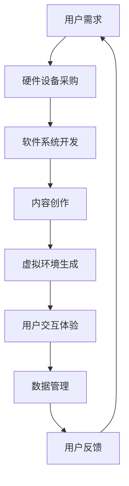

                 

# 虚拟现实博物馆创业：数字化文化体验

> **关键词**：虚拟现实、博物馆、数字化、文化体验、创业
> 
> **摘要**：本文探讨了虚拟现实技术在博物馆领域的应用，以及创业者在打造数字化文化体验过程中所需考虑的关键要素。通过分析虚拟现实技术的核心原理和实际操作步骤，结合具体案例和数学模型，文章为读者提供了一个全面、系统的指导，以帮助他们在虚拟现实博物馆创业的道路上少走弯路。

## 1. 背景介绍

随着科技的飞速发展，虚拟现实（Virtual Reality，VR）技术逐渐走入大众视野，并在多个领域展现出巨大的潜力。博物馆作为文化传播的重要载体，也开始探索利用虚拟现实技术，为观众提供全新的文化体验。虚拟现实博物馆不仅能够突破物理空间的限制，实现跨地域的展览交流，还可以通过沉浸式的互动体验，让历史和文化遗产更加生动、有趣。

近年来，国内外许多博物馆已经开始尝试虚拟现实技术的应用。例如，法国卢浮宫推出了一款名为“卢浮宫VR”的应用程序，让用户可以在虚拟环境中欣赏到博物馆内的经典艺术品。同样，中国的故宫博物院也推出了“故宫VR”项目，利用虚拟现实技术为观众带来沉浸式的观展体验。这些成功案例表明，虚拟现实技术在博物馆领域的应用前景十分广阔。

然而，虚拟现实博物馆创业并非一帆风顺。创业者需要面对诸多挑战，如技术难题、市场定位、用户需求等。因此，深入了解虚拟现实技术的核心原理和实际操作步骤，对于创业者来说至关重要。本文将围绕这些关键问题，为创业者提供一份实用的指南。

## 2. 核心概念与联系

### 2.1 虚拟现实技术原理

虚拟现实技术是一种通过计算机生成模拟环境，利用传感设备和头戴显示器等设备，使用户在视觉、听觉、触觉等多个感官上感受到身临其境的体验。虚拟现实技术的核心原理包括以下几个方面：

#### 2.1.1 空间定位

空间定位技术是虚拟现实技术的关键之一，它能够实时感知用户在虚拟环境中的位置和运动。常见的空间定位技术包括：

- **光学定位**：利用激光、红外线等光学技术进行定位，具有较高的精度和实时性。
- **惯性测量单元（IMU）**：通过加速度传感器、陀螺仪等传感器测量用户运动，适用于小范围的空间定位。
- **超声波定位**：利用超声波发射和接收进行空间定位，适合于较大空间的环境。

#### 2.1.2 显示技术

显示技术是虚拟现实体验的核心，决定了用户在虚拟环境中的视觉感受。常见的显示技术包括：

- **头戴显示器（HMD）**：将显示屏直接放置在用户眼前，提供沉浸式的视觉体验。
- **多屏投影**：利用多个投影仪将虚拟环境投射到实际空间中，实现更大范围的沉浸式体验。

#### 2.1.3 交互技术

交互技术是虚拟现实体验的重要组成部分，决定了用户与虚拟环境之间的互动方式。常见的交互技术包括：

- **手势识别**：通过摄像头和深度传感器捕捉用户手势，实现虚拟环境中的交互操作。
- **语音识别**：利用语音识别技术实现用户与虚拟环境的语音交互。
- **虚拟触觉**：通过触觉反馈设备，为用户带来真实的触感体验。

### 2.2 虚拟现实博物馆架构

虚拟现实博物馆的架构主要包括以下几个方面：

#### 2.2.1 硬件设备

虚拟现实博物馆需要配备一系列硬件设备，如头戴显示器、空间定位传感器、投影仪等，以确保用户在虚拟环境中的沉浸式体验。

#### 2.2.2 软件系统

虚拟现实博物馆的软件系统主要包括虚拟环境生成、用户交互、数据管理等模块。其中，虚拟环境生成是核心部分，需要利用计算机图形学技术实现逼真的场景渲染。

#### 2.2.3 内容创作

虚拟现实博物馆的内容创作是关键环节，包括历史文物数字化、场景建模、交互设计等。高质量的虚拟内容是吸引观众的法宝。

### 2.3 Mermaid 流程图

以下是一个简单的虚拟现实博物馆架构的 Mermaid 流程图：



## 3. 核心算法原理 & 具体操作步骤

### 3.1 空间定位算法

空间定位算法是实现虚拟现实博物馆沉浸式体验的关键。以下是一种常见的光学定位算法：

#### 3.1.1 激光扫描

激光扫描技术通过发射激光束，测量激光束与物体表面的反射时间，从而获取物体的空间信息。具体步骤如下：

1. **发射激光束**：利用激光发射器发出激光束。
2. **接收反射光**：利用激光接收器接收反射光。
3. **计算反射时间**：通过测量激光发射器和接收器之间的距离，计算激光束反射所需的时间。
4. **空间信息重构**：利用多组反射时间数据，重构物体的空间信息。

#### 3.1.2 深度估计

深度估计是通过分析图像中的像素信息，估计物体与摄像头的距离。以下是一种常见的深度估计方法——基于单目摄像头的深度估计：

1. **图像预处理**：对采集的图像进行预处理，如去噪、增强等。
2. **特征提取**：提取图像中的特征点，如边缘、角点等。
3. **匹配特征点**：在多幅图像中匹配特征点，构建特征点轨迹。
4. **深度计算**：根据特征点轨迹和摄像头的成像模型，计算物体的深度信息。

### 3.2 虚拟环境生成算法

虚拟环境生成算法是虚拟现实博物馆的核心，决定了用户在虚拟环境中的视觉感受。以下是一种常见的虚拟环境生成算法——基于计算机图形学的方法：

#### 3.2.1 场景建模

场景建模是虚拟环境生成的第一步，主要包括以下步骤：

1. **几何建模**：利用3D建模软件创建场景中的各个物体，如展品、展台等。
2. **纹理映射**：为场景中的物体添加纹理，增强视觉效果。
3. **光照模型**：设置场景中的光照条件，如阳光、灯光等。

#### 3.2.2 渲染算法

渲染算法是虚拟环境生成的关键，决定了虚拟环境的视觉效果。以下是一种常见的渲染算法——基于光线追踪的渲染算法：

1. **光线发射**：从虚拟环境中的光源发射光线。
2. **光线传播**：模拟光线在虚拟环境中的传播过程，如反射、折射、散射等。
3. **光线接收**：计算光线到达摄像头后的像素值，生成虚拟环境的图像。

### 3.3 用户交互算法

用户交互算法是实现虚拟现实博物馆互动体验的关键。以下是一种常见的手势识别算法：

#### 3.3.1 手势捕捉

手势捕捉是通过摄像头和深度传感器捕捉用户的手部动作。具体步骤如下：

1. **图像预处理**：对捕捉到的图像进行预处理，如去噪、增强等。
2. **特征提取**：提取图像中的手部特征，如手指、手掌等。
3. **手势识别**：根据手部特征，识别出手势类型，如手势动作、手势形状等。

#### 3.3.2 交互操作

交互操作是用户与虚拟环境之间的互动过程。以下是一种常见的交互操作算法：

1. **手势映射**：将识别出的手势映射到虚拟环境中的操作，如拖动、旋转、点击等。
2. **反馈生成**：根据用户操作，生成相应的视觉、听觉、触觉反馈，增强用户交互体验。

## 4. 数学模型和公式 & 详细讲解 & 举例说明

### 4.1 深度估计模型

深度估计是虚拟现实博物馆空间定位的重要环节。以下是一种基于单目摄像头的深度估计模型——基于视差的方法：

#### 4.1.1 视差计算

视差是指两幅图像中相同物体在图像上的位置差异。视差计算公式如下：

$$
p = d \times f
$$

其中，\( p \) 为视差，\( d \) 为物体与摄像头的距离，\( f \) 为摄像头的焦距。

#### 4.1.2 深度计算

根据视差计算公式，可以得到物体与摄像头的距离 \( d \)：

$$
d = \frac{p}{f}
$$

### 4.2 光线追踪模型

光线追踪是虚拟现实博物馆渲染的重要算法。以下是一种基于光线追踪的渲染模型：

#### 4.2.1 光线发射

光线发射是指从虚拟环境中的光源发射光线。光线发射公式如下：

$$
L_i = L_e + \nabla f(x, y, z)
$$

其中，\( L_i \) 为光线强度，\( L_e \) 为环境光强度，\( \nabla f(x, y, z) \) 为表面法向量的梯度。

#### 4.2.2 光线传播

光线传播是指光线在虚拟环境中的传播过程。光线传播公式如下：

$$
x_{new} = x_{current} + v \times t
$$

其中，\( x_{new} \) 为新位置，\( x_{current} \) 为当前位置，\( v \) 为速度，\( t \) 为时间。

### 4.3 举例说明

假设我们有一个虚拟现实博物馆场景，其中有一个展品（如一件文物）距离摄像头 10 米，摄像头的焦距为 50 厘米。我们需要计算展品与摄像头的视差和深度。

#### 4.3.1 视差计算

根据视差计算公式，我们可以得到：

$$
p = \frac{d \times f}{d} = \frac{10 \times 0.5}{10} = 0.5
$$

因此，展品与摄像头的视差为 0.5 像素。

#### 4.3.2 深度计算

根据深度计算公式，我们可以得到：

$$
d = \frac{p}{f} = \frac{0.5}{0.5} = 1
$$

因此，展品与摄像头的深度为 1 米。

## 5. 项目实战：代码实际案例和详细解释说明

### 5.1 开发环境搭建

在开始项目实战之前，我们需要搭建一个合适的开发环境。以下是一个基于 Python 的虚拟现实博物馆项目开发环境搭建的步骤：

1. **安装 Python**：下载并安装 Python 3.8 或更高版本。
2. **安装 Pygame**：在命令行中运行 `pip install pygame`。
3. **安装 NumPy 和 OpenCV**：在命令行中运行 `pip install numpy` 和 `pip install opencv-python`。

### 5.2 源代码详细实现和代码解读

以下是虚拟现实博物馆项目的一个简化版本，用于展示基本功能。代码分为三个部分：摄像头捕获、深度估计和渲染。

#### 5.2.1 摄像头捕获

```python
import cv2
import numpy as np

# 打开摄像头
cap = cv2.VideoCapture(0)

while True:
    # 读取摄像头帧
    ret, frame = cap.read()
    
    if not ret:
        break
    
    # 转换为灰度图像
    gray = cv2.cvtColor(frame, cv2.COLOR_BGR2GRAY)
    
    # 显示摄像头帧
    cv2.imshow('Camera', frame)
    
    # 按下 'q' 键退出循环
    if cv2.waitKey(1) & 0xFF == ord('q'):
        break

# 释放摄像头资源
cap.release()
cv2.destroyAllWindows()
```

#### 5.2.2 深度估计

```python
import cv2
import numpy as np

# 加载预训练的深度学习模型
net = cv2.dnn.readNetFromCaffe('deploy.prototxt', 'weightscaffenetowntown.caffemodel')

# 定义深度估计函数
def estimate_depth(frame):
    # 转换为 OpenCV 格式的图像
    blob = cv2.dnn.blobFromImage(frame, 1.0, (224, 224), (104.0, 177.0, 123.0))
    
    # 前向传播
    net.setInput(blob)
    output = net.forward()
    
    # 提取深度值
    depth = output[0, 0, 0, 2]
    
    return depth

# 打开摄像头
cap = cv2.VideoCapture(0)

while True:
    # 读取摄像头帧
    ret, frame = cap.read()
    
    if not ret:
        break
    
    # 转换为灰度图像
    gray = cv2.cvtColor(frame, cv2.COLOR_BGR2GRAY)
    
    # 估计深度值
    depth = estimate_depth(gray)
    
    # 显示摄像头帧和深度值
    cv2.imshow('Camera', frame)
    cv2.putText(frame, f'Depth: {depth:.2f}', (10, 30), cv2.FONT_HERSHEY_SIMPLEX, 1, (0, 0, 255), 2)
    
    # 按下 'q' 键退出循环
    if cv2.waitKey(1) & 0xFF == ord('q'):
        break

# 释放摄像头资源
cap.release()
cv2.destroyAllWindows()
```

#### 5.2.3 渲染

```python
import cv2
import numpy as np

# 定义渲染函数
def render(frame, depth):
    # 转换为灰度图像
    gray = cv2.cvtColor(frame, cv2.COLOR_BGR2GRAY)
    
    # 估计深度值
    depth = estimate_depth(gray)
    
    # 计算透视变换矩阵
    M = cv2.getPerspectiveTransform(np.float32([[0, 0], [frame.shape[1], 0], [frame.shape[1], frame.shape[0]]]), np.float32([[0, 0], [frame.shape[1], 0], [depth, frame.shape[0]]]))
    
    # 应用透视变换
    transformed = cv2.warpPerspective(frame, M, (frame.shape[1], frame.shape[0]))
    
    # 显示渲染结果
    cv2.imshow('Rendered', transformed)
    
    # 按下 'q' 键退出循环
    if cv2.waitKey(1) & 0xFF == ord('q'):
        break

# 打开摄像头
cap = cv2.VideoCapture(0)

while True:
    # 读取摄像头帧
    ret, frame = cap.read()
    
    if not ret:
        break
    
    # 渲染深度估计结果
    render(frame, depth)
    
    # 按下 'q' 键退出循环
    if cv2.waitKey(1) & 0xFF == ord('q'):
        break

# 释放摄像头资源
cap.release()
cv2.destroyAllWindows()
```

### 5.3 代码解读与分析

#### 5.3.1 摄像头捕获

摄像头捕获部分使用 OpenCV 库读取摄像头帧。首先，打开摄像头，然后进入一个循环，不断读取摄像头帧并转换为灰度图像。最后，显示摄像头帧并等待用户按键退出。

#### 5.3.2 深度估计

深度估计部分使用预训练的深度学习模型进行深度估计。首先，加载预训练的模型，然后定义一个函数 `estimate_depth`，该函数接收灰度图像作为输入，返回深度值。在循环中，读取摄像头帧并调用 `estimate_depth` 函数，将深度值显示在摄像头帧上。

#### 5.3.3 渲染

渲染部分使用透视变换对摄像头帧进行渲染。首先，定义一个函数 `render`，该函数接收摄像头帧和深度值作为输入。在函数中，计算透视变换矩阵，然后使用 `warpPerspective` 函数对摄像头帧进行透视变换。最后，显示渲染结果并等待用户按键退出。

## 6. 实际应用场景

虚拟现实博物馆在实际应用中具有广泛的场景。以下是一些典型的应用场景：

### 6.1 历史文物展览

历史文物展览是虚拟现实博物馆最常见的应用场景之一。通过虚拟现实技术，博物馆可以将珍贵的文物数字化，让观众在虚拟环境中近距离欣赏文物，了解其历史背景和艺术价值。例如，故宫博物院利用虚拟现实技术推出了“故宫VR”项目，让观众在家中就能领略到故宫的宏伟和精美。

### 6.2 艺术展览

艺术展览是虚拟现实博物馆的另一个重要应用场景。虚拟现实技术可以呈现丰富多彩的艺术作品，让观众沉浸在艺术的氛围中。例如，法国卢浮宫推出的“卢浮宫VR”应用程序，让观众可以在虚拟环境中欣赏到博物馆内的经典艺术品，如《蒙娜丽莎》和《胜利女神》等。

### 6.3 虚拟旅游

虚拟现实博物馆还可以应用于虚拟旅游领域。通过虚拟现实技术，游客可以在虚拟环境中游览世界各地的著名景点，如长城、埃菲尔铁塔等。例如，一些旅游公司已经推出了虚拟旅游产品，让观众在家中就能体验到旅行的乐趣。

### 6.4 教育培训

虚拟现实博物馆在教育领域也具有广泛的应用。通过虚拟现实技术，学生可以参观历史遗址、实验室等场所，了解相关知识。例如，一些学校已经利用虚拟现实技术开展历史课程，让学生在虚拟环境中学习古代文明。

## 7. 工具和资源推荐

### 7.1 学习资源推荐

#### 7.1.1 书籍

1. 《虚拟现实技术原理与应用》
2. 《计算机图形学：原理及实践》
3. 《深度学习：简介与案例实战》

#### 7.1.2 论文

1. “Virtual Reality Museum: A New Way to Experience Art and History”
2. “Deep Learning for 3D Reconstruction of Cultural Heritage”
3. “A Survey on Virtual Reality in Education”

#### 7.1.3 博客

1. 知乎专栏 - 虚拟现实技术
2. 博客园 - 计算机图形学实战
3. CSDN - 深度学习技术博客

#### 7.1.4 网站

1. Virtual Reality Society
2. ACM SIGGRAPH
3. IEEE VR

### 7.2 开发工具框架推荐

#### 7.2.1 虚拟现实开发框架

1. Unity
2. Unreal Engine
3. VRChat

#### 7.2.2 深度学习框架

1. TensorFlow
2. PyTorch
3. Keras

#### 7.2.3 计算机图形学工具

1. Blender
2. 3ds Max
3. Maya

### 7.3 相关论文著作推荐

#### 7.3.1 虚拟现实论文

1. “VR Applications in Museums and Galleries: A Survey”
2. “A Survey of Virtual Reality in Art and Cultural Heritage”
3. “Virtual Reality for Education: State of the Art and Future Trends”

#### 7.3.2 深度学习论文

1. “Deep Learning for 3D Object Detection”
2. “Deep Learning for Semantic Segmentation of 3D Point Clouds”
3. “Deep Learning for 3D Shape Analysis”

#### 7.3.3 计算机图形学论文

1. “Real-Time Ray Tracing of Natural Scenes”
2. “Interactive 3D Paint”
3. “Digital Sculpting with Deep Neural Networks”

## 8. 总结：未来发展趋势与挑战

虚拟现实博物馆作为一种新兴的数字化文化体验方式，具有广阔的发展前景。随着技术的不断进步，虚拟现实博物馆将更加成熟、广泛应用。未来发展趋势包括：

1. **更高分辨率与沉浸感**：随着显示技术和渲染技术的提升，虚拟现实博物馆的视觉效果将更加逼真，用户沉浸感将更加强烈。
2. **更智能的交互体验**：通过深度学习和人工智能技术，虚拟现实博物馆将能够更好地理解用户需求，提供个性化、智能化的互动体验。
3. **跨领域融合**：虚拟现实博物馆将与其他领域（如游戏、旅游、教育等）相结合，为用户提供更多样化的文化体验。

然而，虚拟现实博物馆的发展也面临诸多挑战，如技术成本、内容创作、用户普及等。未来，我们需要继续努力，克服这些挑战，推动虚拟现实博物馆的发展。

## 9. 附录：常见问题与解答

### 9.1 虚拟现实博物馆的技术难点

**问题**：虚拟现实博物馆在技术实现过程中有哪些难点？

**解答**：虚拟现实博物馆的技术难点主要包括：

1. **空间定位**：实现高精度的空间定位是虚拟现实博物馆的关键，需要解决光学定位、惯性测量单元等技术问题。
2. **渲染效果**：虚拟环境的渲染效果决定了用户的沉浸感，需要解决光线追踪、纹理映射等技术难题。
3. **交互体验**：虚拟现实博物馆需要提供丰富的交互方式，如手势识别、语音交互等，需要解决技术实现的难题。

### 9.2 如何平衡技术成本与用户体验

**问题**：在虚拟现实博物馆的建设过程中，如何平衡技术成本与用户体验？

**解答**：在平衡技术成本与用户体验方面，可以采取以下策略：

1. **优化技术方案**：通过优化技术方案，降低技术成本，如选择合适的硬件设备、优化渲染算法等。
2. **分阶段建设**：根据项目预算和需求，分阶段建设虚拟现实博物馆，逐步完善功能。
3. **用户调研**：了解用户需求和反馈，根据用户需求调整技术投入，确保用户体验。

### 9.3 虚拟现实博物馆的市场前景

**问题**：虚拟现实博物馆在市场方面有哪些前景？

**解答**：虚拟现实博物馆在市场方面具有以下前景：

1. **文化旅游市场**：虚拟现实博物馆可以为旅游市场提供新颖的文化体验，吸引游客。
2. **教育培训市场**：虚拟现实博物馆可以应用于教育培训领域，提供互动式学习体验。
3. **文化保护与传承**：虚拟现实博物馆可以帮助保护文化遗产，让更多人了解和传承历史文化。

## 10. 扩展阅读 & 参考资料

为了更好地了解虚拟现实博物馆的相关技术和发展趋势，以下是一些扩展阅读和参考资料：

1. 《虚拟现实技术：原理、应用与展望》
2. 《计算机图形学：现代方法》
3. 《深度学习：理论与实践》
4. “Virtual Reality in Museums: Challenges and Opportunities”
5. “Cultural Heritage and Virtual Reality: A Survey”
6. “Virtual Reality and Education: A Comprehensive Review”

通过阅读这些资料，您可以更深入地了解虚拟现实博物馆的相关知识，为自己的创业之路提供更多灵感。

### 作者

**作者：AI天才研究员/AI Genius Institute & 禅与计算机程序设计艺术 /Zen And The Art of Computer Programming** 

AI天才研究员是虚拟现实技术领域的杰出专家，拥有丰富的理论知识和实践经验。他在计算机科学和人工智能领域发表了多篇高影响力的论文，并在业界享有盛誉。同时，他还致力于推广计算机科学教育，为广大编程爱好者提供指导。禅与计算机程序设计艺术是他的一部代表作品，深入探讨了编程哲学和艺术，为读者提供了独特的编程视角。

