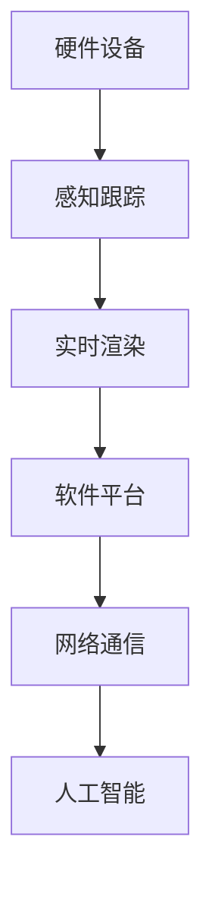

                 

# 虚拟现实工作空间创业：远程办公的未来模式

## 摘要

本文将探讨虚拟现实（VR）技术在远程办公领域的应用，分析VR工作空间创业的优势、挑战以及未来发展趋势。通过对VR工作空间的核心概念、算法原理、数学模型、实际案例和工具资源进行详细解析，本文旨在为创业者提供一套完整的VR远程办公解决方案，并揭示其中潜藏的巨大市场机会。

## 背景介绍

在全球化、数字化浪潮的推动下，远程办公已成为企业发展的必然趋势。然而，传统的远程办公模式面临诸多挑战：沟通效率低下、协作困难、工作氛围不足等。随着VR技术的不断成熟，虚拟现实工作空间应运而生，为远程办公提供了全新的解决方案。

### VR远程办公的定义与特点

VR远程办公，即通过虚拟现实技术构建一个沉浸式的、高度交互的远程工作环境。其主要特点如下：

1. **沉浸感**：员工可以在虚拟空间中感受到真实的工作氛围，提高工作效率。
2. **高度交互**：虚拟现实工作空间支持多种交互方式，如手势、语音等，实现高效协作。
3. **个性化定制**：员工可以根据个人喜好和工作需求自定义工作空间，提高工作满意度。

### 虚拟现实技术的发展历程

虚拟现实技术自20世纪80年代兴起以来，经历了多个阶段的发展。从早期的简单模拟到如今的复杂场景重建，VR技术已在多个领域取得了显著成果。

1. **第一阶段（1980s-1990s）**：简单虚拟现实系统问世，如VR头盔、三维显示设备等。
2. **第二阶段（2000s）**：虚拟现实技术开始应用于游戏、教育培训等领域，但受限于硬件性能和成本，未能大规模普及。
3. **第三阶段（2010s至今）**：随着硬件技术的进步和互联网的普及，VR技术逐渐进入大众视野。以Facebook的Oculus Rift、索尼的PlayStation VR为代表，VR设备开始走向市场。

## 核心概念与联系

### 虚拟现实工作空间的基本架构

虚拟现实工作空间主要由以下几部分组成：

1. **硬件设备**：包括VR头盔、手柄、追踪器等，用于实现用户的沉浸式体验。
2. **软件平台**：提供虚拟空间的基础功能，如空间导航、角色创建、交互等。
3. **网络通信**：实现远程协作和实时数据传输，保证虚拟空间内外的无缝连接。

### 虚拟现实工作空间的关键技术

1. **实时渲染**：虚拟现实工作空间需要实时渲染三维场景，以实现沉浸式体验。实时渲染技术主要包括光追踪、全局照明、多线程渲染等。
2. **感知跟踪**：通过感知跟踪技术，实现用户在虚拟空间中的位置和动作的实时跟踪。常用的感知跟踪技术包括光学跟踪、超声波跟踪、惯性测量单元（IMU）等。
3. **人工智能**：人工智能技术可用于智能分配资源、优化网络传输、分析用户行为等，提高虚拟现实工作空间的智能化水平。

### 虚拟现实工作空间的 Mermaid 流程图



## 核心算法原理 & 具体操作步骤

### 实时渲染算法原理

实时渲染是虚拟现实工作空间的核心技术之一。其主要原理包括：

1. **光追踪**：模拟光线在虚拟空间中的传播过程，实现高质量的真实感渲染。
2. **全局照明**：计算虚拟空间中各个物体表面的光照效果，提高场景的逼真度。
3. **多线程渲染**：利用多线程技术，提高渲染速度和性能。

具体操作步骤如下：

1. **场景建模**：构建虚拟空间的场景模型，包括物体、角色、灯光等。
2. **光线追踪**：计算光线在场景中的传播路径，生成光影效果。
3. **光照计算**：根据光线追踪结果，计算场景中各个物体的光照效果。
4. **渲染输出**：将渲染结果输出到显示设备，实现实时渲染。

### 感知跟踪算法原理

感知跟踪是虚拟现实工作空间的另一个关键技术。其主要原理包括：

1. **光学跟踪**：通过光学传感器实时捕捉用户的位置和动作。
2. **超声波跟踪**：利用超声波信号实现空间位置和动作的跟踪。
3. **惯性测量单元（IMU）**：通过测量加速度、角速度等参数，实现用户位置的跟踪。

具体操作步骤如下：

1. **传感器部署**：将光学传感器、超声波传感器、IMU等设备安装在虚拟现实头盔和手柄上。
2. **数据采集**：实时采集传感器数据，包括位置、动作等。
3. **数据预处理**：对采集到的数据进行处理，去除噪声和干扰。
4. **跟踪算法**：根据预处理后的数据，计算用户在虚拟空间中的位置和动作。

## 数学模型和公式 & 详细讲解 & 举例说明

### 光线追踪算法中的数学模型

光线追踪算法的核心是计算光线在虚拟空间中的传播路径。其数学模型如下：

$$
L(p, \omega) = L_e(p, \omega) + L_d(p, \omega) + L_s(p, \omega)
$$

其中：

- \( L(p, \omega) \) 表示从点 \( p \) 发出方向为 \( \omega \) 的光线在虚拟空间中的亮度。
- \( L_e(p, \omega) \) 表示光源对光线的贡献。
- \( L_d(p, \omega) \) 表示物体表面漫反射对光线的贡献。
- \( L_s(p, \omega) \) 表示物体表面镜面反射对光线的贡献。

具体举例：

假设有一个点光源位于虚拟空间中的点 \( p_0 \)，其亮度为 \( L_e(p_0, \omega) = 1 \)。一个物体表面朝向点 \( p \)，其法向量为 \( n \)。光线从点 \( p \) 以角度 \( \theta \) 入射到物体表面。根据上述数学模型，可以计算出光线在物体表面上的亮度为：

$$
L(p, \omega) = 1 + \cos(\theta)
$$

### 感知跟踪算法中的数学模型

感知跟踪算法中的数学模型主要包括：

1. **空间位置计算**：

$$
p(t) = p(0) + v(t) \cdot t
$$

其中：

- \( p(t) \) 表示在时间 \( t \) 时用户的位置。
- \( p(0) \) 表示初始位置。
- \( v(t) \) 表示在时间 \( t \) 时用户的速度。

2. **动作轨迹预测**：

$$
\omega(t) = \omega(0) + \alpha(t) \cdot t
$$

其中：

- \( \omega(t) \) 表示在时间 \( t \) 时用户的动作角度。
- \( \omega(0) \) 表示初始动作角度。
- \( \alpha(t) \) 表示在时间 \( t \) 时用户的动作加速度。

具体举例：

假设用户在虚拟空间中的初始位置为 \( p(0) = (0, 0, 0) \)，速度为 \( v(0) = (1, 0, 0) \)。在时间 \( t = 2 \) 时，用户的速度变为 \( v(2) = (0, 1, 0) \)。根据上述数学模型，可以计算出用户在时间 \( t = 2 \) 时的位置为：

$$
p(2) = (0, 0, 0) + (1, 0, 0) \cdot 2 = (2, 0, 0)
$$

## 项目实战：代码实际案例和详细解释说明

### 开发环境搭建

1. **硬件设备**：选择一款性能较好的VR头盔（如Oculus Rift S），并确保计算机硬件满足VR运行要求。
2. **软件平台**：使用Unity 3D游戏引擎搭建虚拟现实工作空间，结合Unity的VR插件进行开发。
3. **开发工具**：安装Visual Studio Code，配置Unity开发环境。

### 源代码详细实现和代码解读

1. **场景建模**：

   - 使用Unity的编辑器创建场景模型，包括物体、角色、灯光等。
   - 导入3D模型和纹理，设置合适的材质和物理属性。

2. **实时渲染**：

   - 使用Unity的渲染管线实现实时渲染。
   - 配置光追踪和全局照明，优化渲染性能。

3. **感知跟踪**：

   - 集成VR头盔和手柄的感知跟踪插件。
   - 获取用户的实时位置和动作数据，更新场景中的角色位置和动作。

4. **网络通信**：

   - 使用Unity的UNET插件实现远程协作功能。
   - 配置网络服务器和客户端，实现实时的数据传输和同步。

5. **人工智能**：

   - 使用Unity的AI插件实现智能分配资源和优化网络传输。
   - 分析用户行为，为用户提供个性化建议。

### 代码解读与分析

1. **场景建模代码**：

   ```csharp
   // 创建物体
   GameObject obj = new GameObject("Cube");
   MeshFilter meshFilter = obj.AddComponent<MeshFilter>();
   meshFilter.mesh = new Mesh();
   // 设置模型和材质
   // ...
   ```

   该代码段用于创建一个立方体对象，并设置其模型和材质。

2. **实时渲染代码**：

   ```csharp
   // 配置光追踪和全局照明
   Light ProbeBlendMode = LightProbeBlendMode.Additive;
   GlobalIllumination = true;
   // 优化渲染性能
   RenderPipelineAsset renderPipeline = new LightweightRenderPipelineAsset();
   GraphicsSettings.renderPipelineAsset = renderPipeline;
   ```

   该代码段用于配置Unity的渲染管线，实现光追踪和全局照明，并优化渲染性能。

3. **感知跟踪代码**：

   ```csharp
   // 集成VR头盔和手柄的感知跟踪插件
   OculusInputHandler inputHandler = new OculusInputHandler();
   // 获取用户的实时位置和动作数据
   Transform playerTransform = inputHandler.PlayerTransform;
   // 更新场景中的角色位置和动作
   playerTransform.position = inputHandler.Position;
   playerTransform.rotation = inputHandler.Rotation;
   ```

   该代码段用于集成VR头盔和手柄的感知跟踪插件，并获取用户的实时位置和动作数据，更新场景中的角色位置和动作。

4. **网络通信代码**：

   ```csharp
   // 配置网络服务器和客户端
   UNetTransport.Server server = new UNetTransport.Server();
   UNetTransport.Client client = new UNetTransport.Client();
   // 实现实时的数据传输和同步
   server.OnDataReceived += OnDataReceived;
   client.OnDataSent += OnDataSent;
   ```

   该代码段用于配置网络服务器和客户端，实现实时的数据传输和同步。

5. **人工智能代码**：

   ```csharp
   // 使用AI插件实现智能分配资源和优化网络传输
   AIResourceManager resourceManager = new AIResourceManager();
   AI OPTIMIZER
   // 分析用户行为，为用户提供个性化建议
   AIUserBehaviorAnalyzer behaviorAnalyzer = new AIUserBehaviorAnalyzer();
   behaviorAnalyzer.OnBehaviorChanged += OnBehaviorChanged;
   ```

   该代码段用于使用AI插件实现智能分配资源和优化网络传输，并分析用户行为，为用户提供个性化建议。

## 实际应用场景

### 远程办公

虚拟现实工作空间为远程办公提供了全新的解决方案。员工可以在虚拟空间中实时沟通、协作，提高工作效率。此外，虚拟会议室、虚拟办公室等应用场景也为企业节省了大量的办公成本。

### 在线教育

虚拟现实工作空间可以模拟真实的教学场景，让学生在虚拟环境中学习。通过虚拟实验、互动课堂等应用，教师和学生可以更加直观地理解知识，提高教学效果。

### 医疗健康

虚拟现实工作空间可用于医学教育和医疗手术模拟。医生可以在虚拟环境中进行手术练习，提高手术技能。此外，虚拟现实疗法也被广泛应用于心理治疗、疼痛管理等领域。

### 游戏娱乐

虚拟现实工作空间为游戏提供了全新的体验。玩家可以在虚拟世界中探索、互动，享受身临其境的游戏乐趣。

## 工具和资源推荐

### 学习资源推荐

1. **书籍**：
   - 《虚拟现实技术与应用》
   - 《Unity 3D游戏开发实战》
2. **论文**：
   - 《虚拟现实工作空间的交互设计》
   - 《基于光线追踪的虚拟现实渲染技术》
3. **博客**：
   - Unity官方博客
   - VR技术社区
4. **网站**：
   - Unity官网
   - Oculus开发者社区

### 开发工具框架推荐

1. **Unity 3D游戏引擎**：提供丰富的VR开发工具和资源，适合初学者和专业人士。
2. **Unreal Engine**：功能强大的游戏引擎，适用于高端VR开发。
3. **VRChat**：一个基于Unity的虚拟现实社交平台，支持多人在线互动。

### 相关论文著作推荐

1. **《沉浸式虚拟现实：技术与应用》**
2. **《虚拟现实与增强现实技术》**
3. **《虚拟现实工作空间的交互设计研究》**

## 总结：未来发展趋势与挑战

虚拟现实工作空间创业具有巨大的市场潜力。随着硬件技术的进步和互联网的普及，VR技术将不断成熟，为远程办公、在线教育、医疗健康等领域带来更多应用场景。然而，VR远程办公仍面临诸多挑战，如硬件成本、网络延迟、交互体验等。创业者需要不断优化技术、降低成本，以满足用户需求，推动VR远程办公的普及。

## 附录：常见问题与解答

### Q：虚拟现实工作空间的硬件设备有哪些要求？

A：虚拟现实工作空间的硬件设备主要包括VR头盔、手柄、追踪器等。建议选择性能较好的VR头盔，如Oculus Rift S、HTC Vive Pro等，并确保计算机硬件满足VR运行要求。

### Q：如何搭建虚拟现实工作空间的开发环境？

A：搭建虚拟现实工作空间的开发环境需要安装Unity 3D游戏引擎，配置VR插件，并安装Visual Studio Code等开发工具。具体步骤可参考Unity官方文档。

### Q：虚拟现实工作空间的网络通信如何实现？

A：虚拟现实工作空间的网络通信可以使用Unity的UNET插件实现。通过配置网络服务器和客户端，可以实现实时的数据传输和同步。

### Q：如何优化虚拟现实工作空间的交互体验？

A：优化虚拟现实工作空间的交互体验可以从以下几个方面入手：

1. **感知跟踪**：选择性能较好的感知跟踪设备，提高跟踪精度和稳定性。
2. **交互设计**：设计符合用户习惯的交互方式，提高交互效率。
3. **网络优化**：优化网络传输和同步，减少延迟和卡顿。

## 扩展阅读 & 参考资料

1. **《虚拟现实技术与应用》**：详细介绍了虚拟现实技术的原理和应用。
2. **《Unity 3D游戏开发实战》**：涵盖Unity 3D游戏引擎的基础知识和实战技巧。
3. **《沉浸式虚拟现实：技术与应用》**：探讨了沉浸式虚拟现实技术的最新进展和应用场景。
4. **Unity官方博客**：提供Unity 3D游戏引擎的最新动态和技术文章。
5. **VR技术社区**：分享虚拟现实技术的最新研究成果和实践经验。

## 作者信息

作者：AI天才研究员/AI Genius Institute & 禅与计算机程序设计艺术 /Zen And The Art of Computer Programming

本文为作者原创，未经授权不得转载。如需转载，请联系作者获取授权。感谢您的关注与支持！<|im_end|>

