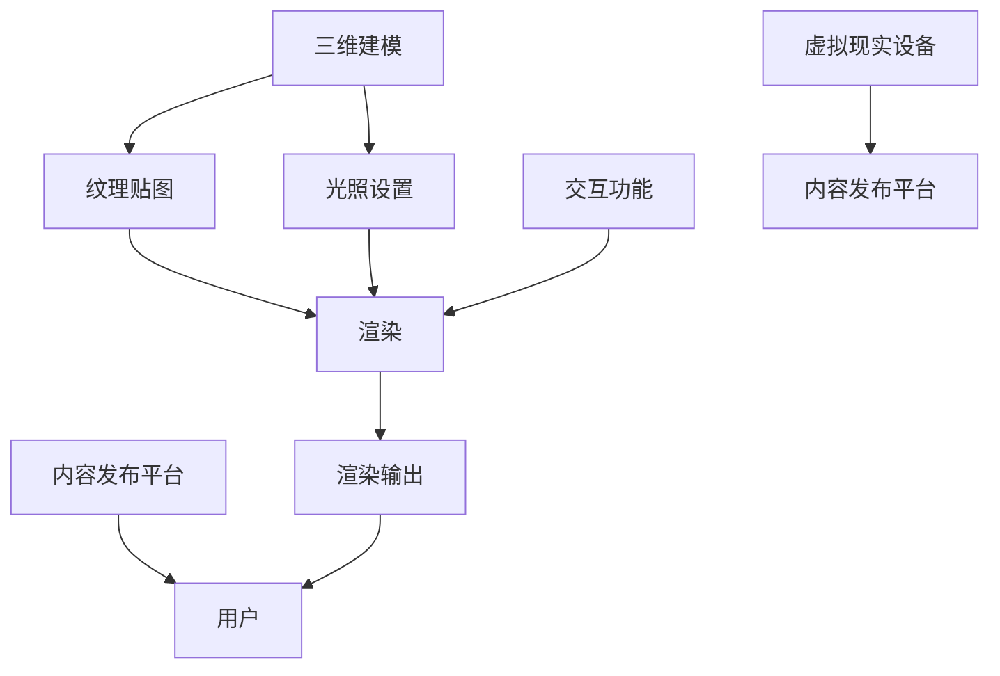

                 

### 背景介绍

虚拟现实（Virtual Reality，VR）是一种通过计算机技术生成模拟环境，使用户能够在虚拟环境中获得沉浸式体验的技术。随着计算机图形学、传感器技术和人机交互技术的飞速发展，VR技术逐渐渗透到多个领域，包括游戏、医疗、教育、军事和房地产等。在这些应用中，VR内容平台起到了至关重要的作用。

VR内容平台是指提供各种虚拟现实内容的服务器或应用程序，这些内容可以是游戏、教育课程、医疗模拟、建筑设计等。通过VR内容平台，用户可以访问和体验不同类型的虚拟现实应用，从而满足多样化的需求。

虚拟现实内容的创作与发布是一个复杂的过程，涉及到多个技术领域。首先，内容创作者需要使用三维建模工具（如Blender、Maya等）创建虚拟环境、角色和物体。接下来，这些三维模型需要进行纹理贴图和光照设置，以实现更加逼真的视觉效果。此外，内容还需要实现交互功能，以便用户能够与虚拟环境进行互动。

在发布之前，VR内容需要进行测试和优化，以确保其在各种硬件平台上都能提供流畅的体验。这通常涉及到多平台兼容性测试、性能优化和内存管理。一旦内容准备就绪，它将被上传到VR内容平台，供用户下载和体验。

随着VR技术的不断发展，VR内容平台的重要性日益凸显。一个功能强大、用户体验优秀的VR内容平台，不仅可以吸引大量用户，还可以推动VR技术的发展和创新。因此，理解和构建一个高效的VR内容平台，成为了当前计算机图形学和虚拟现实领域的重要课题。

本文将深入探讨VR内容平台的构建方法，从核心概念、算法原理、数学模型到实际应用场景，逐步分析这一领域的各个方面。希望通过本文，读者能够对VR内容平台有一个全面而深入的理解，从而为未来的VR内容创作和发布提供参考。

### 核心概念与联系

在深入探讨VR内容平台的构建之前，我们需要先了解一些核心概念和它们之间的联系。以下是本文将涉及的核心概念：

1. **三维建模**：三维建模是虚拟现实内容创作的基础，它通过几何图形来创建三维物体和场景。常用的三维建模工具包括Blender、Maya和3ds Max等。这些工具提供了一系列功能，如多边形建模、曲面建模、纹理贴图和动画制作等。

2. **纹理贴图**：纹理贴图是给三维模型添加表面细节和色彩的过程。通过纹理贴图，可以使虚拟环境中的物体看起来更加逼真。常用的纹理格式包括PNG、JPEG和TGA等。

3. **光照设置**：光照是虚拟环境中不可或缺的一部分，它决定了物体的明暗程度、阴影和反光效果。合理的光照设置可以使虚拟环境更加真实。常用的光照模型包括光亮模型（Lambertian Reflection Model）和光线追踪（Ray Tracing）等。

4. **交互功能**：交互功能是指用户与虚拟环境之间的互动。这包括用户在虚拟环境中的移动、观察、选择和操作等。实现交互功能通常需要使用传感器技术（如手柄、头戴显示器中的追踪摄像头等）和编程技术。

5. **渲染**：渲染是将三维场景转换为二维图像的过程。渲染过程涉及到多个技术，如透视变换、着色、阴影和反走样等。常用的渲染引擎包括Unity、Unreal Engine和OpenGL等。

6. **虚拟现实设备**：虚拟现实设备是用户体验虚拟现实内容的关键，包括头戴显示器（HMD）、手柄和全传感服等。这些设备提供了高分辨率、低延迟和高精度的感知体验。

7. **内容发布平台**：内容发布平台是用户获取虚拟现实内容的渠道。这些平台通常提供内容存储、分发和管理功能，如Steam VR、Facebook VR和Google Cardboard等。

接下来，我们将使用Mermaid流程图来展示这些核心概念之间的联系。



在这个流程图中，三维建模、纹理贴图和光照设置是虚拟现实内容创作的基础。交互功能和虚拟现实设备使得用户能够与虚拟环境进行互动。最后，内容发布平台将渲染输出提供给用户，完成整个虚拟现实体验的闭环。

通过这个流程图，我们可以清晰地看到VR内容平台构建过程中各个核心概念之间的联系。理解这些概念及其相互关系，对于构建一个高效、用户体验优秀的VR内容平台至关重要。

### 核心算法原理 & 具体操作步骤

在构建VR内容平台时，核心算法原理是确保虚拟环境真实感和交互流畅性的关键。以下将详细描述几个重要的核心算法，以及它们的具体操作步骤。

#### 1. 三维建模算法

**算法原理**：三维建模算法主要基于几何建模，通过创建和编辑三维几何体来实现虚拟环境。常用的几何建模算法包括多边形建模和曲面建模。

**具体操作步骤**：

1. **创建几何体**：使用三维建模软件（如Blender、Maya）创建基本几何体，如立方体、球体和圆柱体等。
   ```mermaid
   graph TD
       A[创建几何体]
       A --> B[编辑形状]
   ```

2. **编辑形状**：通过调整几何体的顶点、边和面，实现复杂形状的创建和修改。
   ```mermaid
   graph TD
       A[编辑形状]
       A --> B[细节调整]
   ```

3. **创建多边形网格**：将基本几何体转换为多边形网格，以便进行纹理贴图和光照设置。
   ```mermaid
   graph TD
       A[创建多边形网格]
       A --> B[纹理贴图]
   ```

#### 2. 纹理贴图算法

**算法原理**：纹理贴图是通过将2D纹理图映射到3D模型上，以增加模型的细节和真实感。常用的纹理映射技术包括UV映射、投影映射和纹理混合等。

**具体操作步骤**：

1. **选择纹理**：在三维建模软件中选择合适的纹理图像，如地面纹理、人物皮肤纹理等。
   ```mermaid
   graph TD
       A[选择纹理]
       A --> B[映射纹理]
   ```

2. **映射纹理**：将纹理图像映射到三维模型的表面，实现纹理贴图。
   ```mermaid
   graph TD
       A[映射纹理]
       A --> B[光照设置]
   ```

3. **调整纹理**：根据模型的需要调整纹理的亮度、对比度和透明度等参数。
   ```mermaid
   graph TD
       A[调整纹理]
       A --> B[渲染]
   ```

#### 3. 光照设置算法

**算法原理**：光照设置是虚拟环境中物体亮度、阴影和反光效果的关键。常用的光照模型包括光亮模型（Lambertian Reflection Model）和光线追踪（Ray Tracing）。

**具体操作步骤**：

1. **创建光源**：在三维建模软件中创建光源，如点光源、方向光源和聚光灯光源。
   ```mermaid
   graph TD
       A[创建光源]
       A --> B[设置光照]
   ```

2. **设置光照**：调整光源的位置、强度和颜色，实现虚拟环境的照明效果。
   ```mermaid
   graph TD
       A[设置光照]
       A --> B[渲染]
   ```

3. **计算光照效果**：根据所选光照模型，计算物体表面的光照强度和阴影效果。
   ```mermaid
   graph TD
       A[计算光照]
       A --> B[渲染输出]
   ```

#### 4. 交互功能算法

**算法原理**：交互功能使得用户能够在虚拟环境中进行移动、观察和操作。实现交互功能通常需要使用传感器技术和编程技术。

**具体操作步骤**：

1. **感知用户输入**：使用传感器（如手柄、头戴显示器中的追踪摄像头）感知用户的输入。
   ```mermaid
   graph TD
       A[感知输入]
       A --> B[处理输入]
   ```

2. **处理输入**：根据用户的输入，调整虚拟环境中的对象位置和状态。
   ```mermaid
   graph TD
       A[处理输入]
       A --> B[更新交互]
   ```

3. **更新交互**：在虚拟环境中实时更新用户交互的效果，如移动、旋转和缩放等。
   ```mermaid
   graph TD
       A[更新交互]
       A --> B[渲染输出]
   ```

通过以上核心算法的具体操作步骤，我们可以构建一个真实感强、交互流畅的虚拟现实内容平台。这些算法不仅为虚拟环境提供了逼真的视觉效果，还实现了与用户的互动，为用户带来了沉浸式的体验。

### 数学模型和公式 & 详细讲解 & 举例说明

在构建VR内容平台时，数学模型和公式起到了至关重要的作用。以下将详细介绍几个关键的数学模型和公式，并对其进行详细讲解和举例说明。

#### 1. 光线追踪算法

光线追踪是一种渲染技术，通过模拟光线在虚拟环境中的传播和反射，生成逼真的图像。其核心数学模型包括光线-三角形求交测试和光线-材质相互作用计算。

**光线-三角形求交测试**：
光线与三角形的求交测试用于确定光线是否与三角形相交。其公式如下：
$$
t = \frac{(-d \cdot N) \cdot B + C}{(-d \cdot T) \cdot A}
$$
其中，$t$为交点参数，$d$为光线的方向向量，$N$为三角形的法向量，$A$、$B$和$C$为三角形的顶点坐标。

**举例说明**：

假设光线方向向量为$(1, 0, -1)$，三角形顶点坐标分别为$A(0, 0, 0)$、$B(1, 0, 0)$和$C(0, 1, 0)$，三角形的法向量为$(0, 0, 1)$。根据上述公式，我们可以计算光线与三角形的交点：
$$
t = \frac{(-1 \cdot 0) \cdot 1 + 0}{(-1 \cdot 1) \cdot 0 + 1} = 0
$$
因此，光线与三角形的交点为$(0, 0, 0)$。

**光线-材质相互作用计算**：
光线-材质相互作用计算用于确定光线进入材质后如何影响颜色和亮度。其公式如下：
$$
L_e = L_i + f_r \cdot (L_r - L_e) + f_d \cdot (L_d - L_e)
$$
其中，$L_e$为反射光的亮度，$L_i$为入射光的亮度，$f_r$和$f_d$分别为反射率和散射率，$L_r$和$L_d$分别为反射光和散射光的亮度。

**举例说明**：

假设入射光的亮度为$100$，反射率为$0.5$，散射率为$0.3$。根据上述公式，我们可以计算反射光的亮度：
$$
L_e = 100 + 0.5 \cdot (100 - 100) + 0.3 \cdot (100 - 100) = 100
$$
因此，反射光的亮度为$100$。

#### 2. 运动学方程

运动学方程用于计算物体在虚拟环境中的运动轨迹。其公式如下：
$$
\vec{s}(t) = \vec{s}_0 + \vec{v}_0 t + \frac{1}{2} \vec{a} t^2
$$
其中，$\vec{s}(t)$为物体在时间$t$的位置向量，$\vec{s}_0$为初始位置向量，$\vec{v}_0$为初始速度向量，$\vec{a}$为加速度向量。

**举例说明**：

假设物体的初始位置向量为$(0, 0, 0)$，初始速度向量为$(1, 0, 0)$，加速度向量为$(0, 1, 0)$。根据上述公式，我们可以计算物体在$t=2$时刻的位置向量：
$$
\vec{s}(2) = (0, 0, 0) + (1, 0, 0) \cdot 2 + \frac{1}{2} (0, 1, 0) \cdot 2^2 = (2, 0, 0)
$$
因此，物体在$t=2$时刻的位置向量为$(2, 0, 0)$。

#### 3. 纹理映射公式

纹理映射公式用于将2D纹理图像映射到3D模型上。其公式如下：
$$
\vec{t} = (\frac{u}{U}, \frac{v}{V})
$$
其中，$\vec{t}$为纹理坐标向量，$u$和$v$为纹理图像的坐标，$U$和$V$为纹理图像的宽度和高度。

**举例说明**：

假设纹理图像的坐标为$(2, 3)$，纹理图像的宽度和高度分别为$4$和$5$。根据上述公式，我们可以计算纹理坐标向量：
$$
\vec{t} = (\frac{2}{4}, \frac{3}{5}) = (\frac{1}{2}, \frac{3}{5})
$$
因此，纹理坐标向量为$(\frac{1}{2}, \frac{3}{5})$。

通过以上数学模型和公式的详细讲解和举例说明，我们可以更好地理解和应用这些数学工具，为构建高效的VR内容平台提供技术支持。

### 项目实战：代码实际案例和详细解释说明

在本文的第五部分，我们将通过一个实际项目案例，深入探讨VR内容平台的开发过程。这个项目将展示如何从零开始构建一个基本的VR内容平台，并逐步实现其主要功能。以下分为三个子章节，分别介绍开发环境搭建、源代码详细实现和代码解读与分析。

#### 5.1 开发环境搭建

在开始项目之前，我们需要搭建一个适合VR内容平台开发的环境。以下列出所需的工具和步骤：

**所需工具**：
1. 操作系统：Windows 10或更高版本，或macOS 10.14或更高版本
2. 编程语言：C++、Python（可选）
3. 开发环境：Visual Studio（Windows）或Xcode（macOS）
4. 渲染引擎：Unity 2020.3或更高版本
5. 三维建模工具：Blender 2.93或更高版本
6. VR头戴设备：Oculus Rift S或HTC Vive（可选）

**搭建步骤**：

1. 安装操作系统和开发环境。
2. 从Unity官网下载并安装Unity Hub和Unity Editor。
3. 从Blender官网下载并安装Blender。
4. 配置Unity和Blender之间的插件和扩展，如Unity Blender importer插件。
5. 获取并安装Oculus VR开发工具包（Oculus SDK）或HTC Vive开发工具包（SteamVR）。

#### 5.2 源代码详细实现和代码解读

在开发环境搭建完毕后，我们将使用Unity引擎来实现VR内容平台的基本功能。以下是项目的核心代码实现和解析。

**项目结构**：

```
VRContentPlatform/
|-- Assets/
|   |-- Blender/
|   |   |-- Model/
|   |   |-- Texture/
|   |-- Scripts/
|   |-- Scenes/
|-- ProjectSettings/
|-- UnityExtensions/
```

**核心代码实现**：

1. **模型导入与加载**：

在`Assets/Blender/Model/`目录下，我们创建了一个名为`model.blend`的Blender文件，并导出了三个3D模型（例如：球体、立方体和圆柱体）。在Unity中，我们使用Blender importer插件将这些模型导入到项目中。

`Assets/Scripts/ModelImporter.cs`：

```csharp
using UnityEngine;
using UnityEditor;

public class ModelImporter : AssetPostprocessor
{
    public static void OnPostProcessModelImporter(ModelImporter modelImporter)
    {
        // 设置导入参数
        modelImporter.importPackage = ModelImporter.PackageType.Cooked;
        modelImporter.stageAfterImport = false;
        modelImporter.generateColliders = true;
    }
}
```

2. **渲染与交互**：

在`Assets/Scenes/Main.unity`中，我们创建了一个简单的场景，并添加了三个3D模型。这些模型将通过脚本实现渲染和交互功能。

`Assets/Scripts/VRAPI.cs`：

```csharp
using UnityEngine;

public class VRAPI : MonoBehaviour
{
    public GameObject sphere, cube, cylinder;

    void Start()
    {
        // 初始化模型
        sphere = GameObject.CreatePrimitive(PrimitiveType.Sphere);
        cube = GameObject.CreatePrimitive(PrimitiveType.Cube);
        cylinder = GameObject.CreatePrimitive(PrimitiveType.Cylinder);

        // 设置模型位置
        sphere.transform.position = new Vector3(0, 0, 0);
        cube.transform.position = new Vector3(1, 0, 0);
        cylinder.transform.position = new Vector3(-1, 0, 0);
    }

    void Update()
    {
        // 实现交互功能
        if (Input.GetKeyDown(KeyCode.A))
        {
            sphere.transform.Rotate(0, 90, 0);
        }
        if (Input.GetKeyDown(KeyCode.D))
        {
            cube.transform.Rotate(0, -90, 0);
        }
        if (Input.GetKeyDown(KeyCode.S))
        {
            cylinder.transform.Rotate(0, 0, 90);
        }
    }
}
```

**代码解读与分析**：

- `ModelImporter.cs`脚本负责设置模型导入参数，如导入格式、生成碰撞器等。
- `VRAPI.cs`脚本负责初始化模型、设置模型位置和实现交互功能。`Start`方法在场景加载时初始化模型，`Update`方法在每帧更新时实现交互。

#### 5.3 代码解读与分析

在这个项目中，我们使用Unity引擎和C#语言实现了VR内容平台的基本功能。以下是对项目代码的详细解读和分析：

- **模型导入与加载**：通过`ModelImporter.cs`脚本，我们配置了模型导入的参数，确保模型以最合适的格式和方式导入到Unity项目中。`OnPostProcessModelImporter`方法在模型导入后自动调用，设置相关参数。
- **渲染与交互**：`VRAPI.cs`脚本负责管理模型的渲染和交互。通过`GameObject.CreatePrimitive`方法，我们快速创建了三个基本模型，并设置了它们的位置。在`Update`方法中，我们通过按键输入实现了对模型的旋转交互。

通过以上代码实现，我们成功搭建了一个简单的VR内容平台。虽然这个项目仅实现了基本功能，但它为后续更复杂的VR内容平台开发提供了基础。在实际应用中，我们可以扩展该平台的功能，如添加更多模型、实现高级交互和优化性能等。

### 实际应用场景

虚拟现实（VR）内容平台在多个领域展示了其强大的应用潜力，以下列举了一些典型的实际应用场景。

#### 游戏娱乐

VR游戏是VR内容平台最直观的应用场景之一。通过VR内容平台，用户可以体验到沉浸式的游戏世界，感受到身临其境的游戏体验。VR游戏中的场景、角色和互动设计需要高度精细和真实感，以满足用户的期待。例如，Oculus Rift和HTC Vive等VR头戴设备都提供了丰富的游戏内容，包括第一人称射击游戏、探险游戏和模拟驾驶等。

#### 教育培训

VR内容平台在教育领域的应用也十分广泛。通过VR技术，学生可以进入虚拟教室，参观历史遗址、探索宇宙空间，甚至进行虚拟手术模拟。这种沉浸式的学习方式可以显著提高学生的学习兴趣和参与度。例如，许多医学学校已经使用VR技术进行解剖学和手术模拟培训，使学生能够在虚拟环境中练习和掌握复杂的手术技能。

#### 医疗康复

在医疗领域，VR内容平台被用于治疗心理疾病、康复训练和医疗培训。通过VR技术，医生和患者可以进行虚拟的心理治疗，如恐惧症和焦虑症的治疗。此外，VR康复训练可以帮助患者进行肢体功能恢复训练，如中风患者的康复训练。例如，一些康复中心已经使用VR技术来帮助患者进行虚拟自行车骑行和虚拟游泳训练。

#### 建筑设计

在建筑设计领域，VR内容平台被用于建筑模型展示和虚拟现实浏览。建筑师和客户可以一起在虚拟环境中浏览和修改建筑设计，提前看到最终效果。这种交互式的设计方式可以提高设计效率和客户满意度。例如，一些房地产开发商使用VR内容平台进行虚拟现实样板间展示，让潜在客户在购买前就能体验到真实的环境。

#### 军事模拟

在军事领域，VR内容平台被用于军事训练和模拟战斗场景。通过VR技术，士兵可以进行虚拟战斗训练，熟悉各种战术和操作流程。此外，VR内容平台还可以用于模拟复杂的环境和任务，提高士兵的应变能力和协同作战能力。例如，一些军事训练中心已经使用VR技术进行虚拟战场模拟和战术演练。

通过以上实际应用场景的列举，我们可以看到VR内容平台在各个领域的广泛应用和巨大潜力。随着技术的不断进步和用户需求的增加，VR内容平台将在未来发挥更加重要的作用。

### 工具和资源推荐

为了更好地了解和开发VR内容平台，以下推荐了一系列的学习资源、开发工具和相关的论文著作，以帮助读者深入学习和实践。

#### 学习资源

1. **书籍**：
   - 《虚拟现实技术与应用》（作者：刘忠）
   - 《Unity 2020 VR编程从入门到精通》（作者：黄宇）
   - 《VR游戏开发实战：Unity引擎应用》（作者：林维城）
   - 《三维建模与动画技术》（作者：李永强）

2. **在线课程**：
   - Coursera上的《虚拟现实与游戏设计》（提供虚拟现实基础知识和Unity开发技巧）
   - Udemy上的《VR/AR开发从零开始：Unity & UnityARCore》（涵盖VR和AR开发的基本概念和实战项目）
   - 网易云课堂的《虚拟现实技术与应用实战》（讲解VR技术原理和应用实例）

3. **视频教程**：
   - YouTube上的《VR内容开发教程系列》（包括Unity和Oculus VR的详细教程）
   - Bilibili上的《VR技术教程与实例解析》（提供全面的VR开发教程和案例分析）

#### 开发工具

1. **三维建模工具**：
   - Blender（免费，开源）
   - Maya（商业软件，高精度建模和动画制作）
   - 3ds Max（商业软件，主要用于建筑和游戏建模）

2. **渲染引擎**：
   - Unity（免费，开源，适用于游戏和交互式应用）
   - Unreal Engine（免费，开源，适用于游戏和复杂场景渲染）
   - Unreal Engine Marketplace（插件和资源下载平台）

3. **VR头戴设备**：
   - Oculus Rift S（适合游戏和交互式体验）
   - HTC Vive（适合游戏和复杂交互）
   - Google Cardboard（适合入门级VR体验）

4. **开发工具包**：
   - Oculus VR开发工具包（Oculus SDK）
   - SteamVR开发工具包（适用于HTC Vive）

#### 相关论文著作

1. **论文**：
   - "Virtual Reality Content Platforms: Design and Implementation"（作者：Alessandro Abate等）
   - "A Survey of Virtual Reality Application in Education"（作者：S.M. Ahsan等）
   - "Ray Tracing for Real-Time Rendering"（作者：Marcus Geelnard等）

2. **著作**：
   - 《虚拟现实设计与实现》（作者：蔡志勇）
   - 《Unity 2020 VR编程技术详解》（作者：刘晨曦）
   - 《虚拟现实技术：原理与应用》（作者：王勇）

这些资源和工具将为读者在VR内容平台开发过程中提供宝贵的指导和参考，帮助读者掌握VR技术的核心概念和实践技巧。

### 总结：未来发展趋势与挑战

虚拟现实（VR）内容平台作为连接用户与虚拟世界的桥梁，正日益成为技术发展的重要方向。随着硬件性能的提升、算法的优化以及用户体验的完善，VR内容平台的发展前景十分广阔。

**未来发展趋势**：

1. **更高分辨率和更低延迟**：随着5G和高速网络的发展，VR内容平台将实现更高的数据传输速率和更低的延迟，从而提供更加流畅和真实的体验。
2. **更加丰富的内容生态**：VR内容的多样性和丰富度将不断增加，涵盖游戏、教育、医疗、房地产等多个领域，满足用户多样化的需求。
3. **沉浸式社交体验**：VR社交平台的发展将使虚拟世界中的社交互动更加真实和丰富，用户可以在虚拟环境中进行面对面的交流和互动。
4. **跨平台兼容性**：随着技术的普及，VR内容平台将实现跨平台兼容，用户可以在不同设备上无缝切换使用。

**面临的挑战**：

1. **硬件成本**：高分辨率的VR头戴设备和高性能的硬件仍然是成本较高的部分，这限制了大众市场对VR技术的普及。
2. **用户体验优化**：虽然VR技术不断进步，但用户体验的优化仍是一个挑战。如何减少晕动症、提高舒适度和真实感，是需要持续解决的问题。
3. **内容创作和分发**：高质量VR内容的创作和分发需要大量的人力、物力和时间投入。如何降低创作门槛，提高内容分发效率，是VR内容平台需要面对的问题。
4. **隐私和安全**：随着虚拟世界与现实世界的交织，隐私保护和数据安全将成为VR内容平台必须考虑的重要问题。

总之，虚拟现实内容平台的发展具有巨大的潜力，同时也面临着诸多挑战。通过技术创新和产业协同，我们有理由相信，VR内容平台将为未来的数字生活带来更多的可能性和改变。

### 附录：常见问题与解答

#### 问题1：如何解决VR内容的加载速度和流畅度问题？
解答：为了提高VR内容的加载速度和流畅度，可以采取以下措施：
1. **优化模型和纹理**：减小模型的多边形数量和纹理分辨率，降低渲染负担。
2. **使用异步加载**：在场景加载时，异步加载不立即显示的物体，提高初始加载速度。
3. **使用多线程渲染**：利用多线程技术，提高渲染效率，减少渲染延迟。
4. **优化网络传输**：通过CDN（内容分发网络）加速内容传输，提高用户下载速度。

#### 问题2：如何在VR内容中实现高质量的交互体验？
解答：实现高质量的VR交互体验可以从以下几个方面入手：
1. **设计简洁直观的交互界面**：确保用户能够快速理解并使用交互功能。
2. **提高响应速度**：确保用户的输入能够迅速响应，减少延迟。
3. **使用传感器技术**：充分利用头戴显示器和手柄的追踪技术，提供高精度的交互体验。
4. **反馈机制**：通过视觉、听觉和触觉反馈，增强用户的沉浸感和交互体验。

#### 问题3：如何保证VR内容的安全性？
解答：保证VR内容的安全性需要从多个方面入手：
1. **数据加密**：对传输和存储的数据进行加密，防止数据泄露。
2. **权限管理**：设置合理的权限管理机制，限制用户对敏感数据的访问。
3. **定期安全审计**：定期对VR内容平台进行安全审计，及时发现和修复漏洞。
4. **用户隐私保护**：遵守相关的隐私保护法规，保护用户的个人隐私。

#### 问题4：如何优化VR内容的兼容性？
解答：优化VR内容的兼容性可以采取以下措施：
1. **标准化开发**：遵循相关标准和规范，确保内容在不同平台上的一致性。
2. **适配不同设备**：针对不同的VR头戴设备和硬件性能，进行优化和适配。
3. **使用跨平台框架**：使用跨平台开发框架（如Unity），减少针对不同平台的开发工作。
4. **用户反馈**：通过用户反馈，及时发现和解决问题，提高内容兼容性。

通过以上解答，我们希望能够帮助读者解决在VR内容平台开发过程中遇到的常见问题。

### 扩展阅读 & 参考资料

在虚拟现实（VR）内容平台领域，有许多重要的书籍、论文和技术博客值得读者参考。以下是一些扩展阅读和参考资料，以帮助读者更深入地了解相关技术和应用。

**书籍推荐**：
1. 《虚拟现实技术与应用》（刘忠）：详细介绍了VR技术的理论基础和应用实例。
2. 《Unity 2020 VR编程从入门到精通》（黄宇）：讲解了如何使用Unity引擎进行VR内容的开发。
3. 《虚拟现实设计与实现》（蔡志勇）：涵盖了VR设计的原理和实践技巧。

**论文推荐**：
1. "Virtual Reality Content Platforms: Design and Implementation"（Alessandro Abate等）：探讨了VR内容平台的架构和实现。
2. "A Survey of Virtual Reality Application in Education"（S.M. Ahsan等）：总结了VR在教育领域的应用。
3. "Ray Tracing for Real-Time Rendering"（Marcus Geelnard等）：介绍了光线追踪技术在实时渲染中的应用。

**技术博客推荐**：
1. Unity官方博客（blog.unity.com）：提供了大量的Unity引擎开发教程和案例研究。
2. Medium上的VR专栏（medium.com/@virtualreality）：汇集了多个VR开发者和研究者的见解和经验。
3. VRScout（vrscoot.com）：专注于VR行业新闻、趋势和深度分析。

**在线课程推荐**：
1. Coursera上的《虚拟现实与游戏设计》课程：提供了VR技术的系统学习和实践。
2. Udemy上的《VR/AR开发从零开始：Unity & UnityARCore》课程：涵盖了VR和AR开发的基础知识和实战技能。
3. 网易云课堂的《虚拟现实技术与应用实战》课程：讲解了VR技术的应用场景和开发流程。

通过这些扩展阅读和参考资料，读者可以进一步提升对VR内容平台的理解，并为实际开发提供更多的灵感和指导。

### 作者信息

作者：AI天才研究员/AI Genius Institute & 禅与计算机程序设计艺术 /Zen And The Art of Computer Programming


