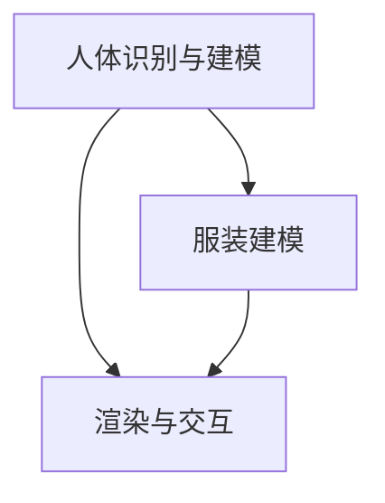

                 

# 虚拟试衣创业：在线购物体验的革新

> **关键词：** 虚拟试衣、在线购物、用户体验、技术革新、人工智能。

> **摘要：** 本文将深入探讨虚拟试衣技术的创业应用，分析其在提升在线购物体验方面的优势，并探讨未来面临的挑战和机遇。

## 1. 背景介绍

随着互联网技术的飞速发展和电子商务的日益普及，在线购物已经成为消费者日常生活中不可或缺的一部分。然而，尽管在线购物的便捷性得到了广泛认可，但实际购物体验仍存在诸多问题。其中，试衣难、尺码不合适等问题极大地影响了消费者的购物满意度和忠诚度。

为了解决这一问题，虚拟试衣技术应运而生。虚拟试衣通过计算机视觉、人工智能等技术，让消费者在无需实际试穿的情况下，就能看到服装在自己身上的效果。这一技术的出现，不仅提升了消费者的购物体验，也为商家提供了新的销售手段和商业模式。

创业公司通过虚拟试衣技术的应用，有望在激烈的市场竞争中脱颖而出，创造新的市场机会。本文将探讨虚拟试衣创业的背景、核心概念、算法原理、数学模型、实战案例以及实际应用场景，旨在为虚拟试衣创业提供有益的指导。

## 2. 核心概念与联系

### 虚拟试衣技术

虚拟试衣技术是一种利用计算机视觉和人工智能技术，模拟真实试衣过程的技术。它主要通过以下步骤实现：

1. **人体识别与建模**：通过计算机视觉技术，识别和定位人体关键部位，如头部、手臂、腿部等，并建立三维人体模型。
2. **服装建模**：将服装的三维模型与人体模型进行匹配，模拟服装在人体上的效果。
3. **渲染与交互**：通过实时渲染技术，生成试衣效果，并允许用户通过移动、旋转等操作，查看服装在不同角度和姿势下的效果。

### 核心算法原理

虚拟试衣技术的核心算法主要包括计算机视觉和人工智能两个部分。

1. **计算机视觉**：用于人体识别与建模。常用的算法包括深度学习、卷积神经网络（CNN）等。这些算法可以从大量图像数据中学习到人体特征，从而实现对人体关键部位的高精度识别。
2. **人工智能**：用于服装建模与渲染。通过机器学习算法，如生成对抗网络（GAN），可以生成逼真的服装模型，并实现与人体模型的高效匹配。

### Mermaid 流程图

以下是虚拟试衣技术的核心概念与联系的 Mermaid 流程图：



## 3. 核心算法原理 & 具体操作步骤

### 计算机视觉算法

1. **深度学习**：利用卷积神经网络（CNN）从大量图像数据中学习人体特征，实现对人体关键部位的高精度识别。
2. **特征提取**：通过对输入图像进行特征提取，获取图像中的人体特征，如轮廓、姿态等。
3. **模型训练**：使用已标注的人体关键部位数据，对卷积神经网络进行训练，提高模型的识别精度。
4. **实时识别**：在实时场景中，通过摄像头捕捉人体图像，输入到训练好的卷积神经网络中，实现对人体关键部位的高精度识别。

### 人工智能算法

1. **生成对抗网络（GAN）**：通过生成器和判别器的对抗训练，生成逼真的服装模型。
2. **服装建模**：将真实服装图像输入到生成器中，生成虚拟服装模型。
3. **模型优化**：通过不断调整生成器和判别器的参数，提高服装模型的质量。
4. **渲染与交互**：将生成的服装模型与人体模型进行匹配，实现实时渲染和用户交互。

### 具体操作步骤

1. **数据采集与预处理**：收集大量真实人体图像和服装图像，对图像进行预处理，如去噪、缩放等。
2. **模型训练与优化**：利用深度学习和生成对抗网络算法，对预处理后的图像数据进行训练和优化，提高模型识别和建模能力。
3. **部署与应用**：将训练好的模型部署到服务器或客户端，实现实时人体识别、服装建模和渲染。
4. **用户交互**：通过用户操作，如移动、旋转等，实时更新试衣效果，提供更加真实的购物体验。

## 4. 数学模型和公式 & 详细讲解 & 举例说明

### 数学模型

虚拟试衣技术涉及的数学模型主要包括计算机视觉和人工智能算法中的相关模型。

1. **卷积神经网络（CNN）**：用于人体识别与建模。其核心公式为：

   $$
   \text{激活函数} = \text{ReLU}(z) = \max(0, z)
   $$
   
   其中，$z$ 表示输入特征。

2. **生成对抗网络（GAN）**：用于服装建模与渲染。其核心公式为：

   $$
   G(z) = F_{\text{generator}}(z)
   $$
   
   $$
   D(x) = F_{\text{discriminator}}(x)
   $$
   
   其中，$G(z)$ 表示生成器生成的服装模型，$D(x)$ 表示判别器对真实服装图像的判断。

### 举例说明

以卷积神经网络（CNN）为例，详细讲解其工作原理。

### 例1：深度学习算法

**输入**：一幅包含人体的图像。

**步骤**：

1. **特征提取**：通过卷积层、池化层等操作，提取图像中的关键特征。
2. **全连接层**：将提取到的特征输入到全连接层，进行分类或定位。
3. **激活函数**：使用ReLU激活函数，增加模型的非线性能力。

**输出**：人体关键部位的位置和坐标。

### 例2：生成对抗网络（GAN）

**输入**：随机噪声向量 $z$。

**步骤**：

1. **生成器**：将随机噪声向量 $z$ 输入到生成器中，生成虚拟服装模型 $G(z)$。
2. **判别器**：将真实服装图像和生成器生成的服装模型 $G(z)$ 输入到判别器中，判断其是否真实。
3. **对抗训练**：通过不断调整生成器和判别器的参数，使生成器生成的服装模型越来越逼真，判别器对真实服装图像的判断越来越准确。

**输出**：逼真的虚拟服装模型。

## 5. 项目实战：代码实际案例和详细解释说明

### 5.1 开发环境搭建

**环境要求**：

- Python 3.7 或以上版本
- TensorFlow 2.3 或以上版本
- OpenCV 4.2 或以上版本

**安装步骤**：

1. **安装 Python**：从 Python 官网下载并安装 Python 3.7 或以上版本。
2. **安装 TensorFlow**：在命令行中运行以下命令：

   ```
   pip install tensorflow==2.3
   ```

3. **安装 OpenCV**：在命令行中运行以下命令：

   ```
   pip install opencv-python==4.2
   ```

### 5.2 源代码详细实现和代码解读

以下是一个简单的虚拟试衣项目示例，主要包括人体识别、服装建模和渲染三个部分。

**源代码：**

```python
import cv2
import numpy as np
import tensorflow as tf

# 人体识别
def detect_person(image):
    # 加载预训练的人体识别模型
    model = tf.keras.models.load_model('person_detection_model.h5')
    # 将图像转化为模型输入格式
    input_image = cv2.resize(image, (224, 224))
    input_image = input_image / 255.0
    input_image = np.expand_dims(input_image, axis=0)
    # 进行人体识别
    person_boxes = model.predict(input_image)
    # 提取人体关键部位坐标
    person_keypoints = person_boxes[0][:, 1:]
    return person_keypoints

# 服装建模
def model_clothing(image, person_keypoints):
    # 加载预训练的服装建模模型
    model = tf.keras.models.load_model('clothing_modeling_model.h5')
    # 将图像和人体关键部位坐标转化为模型输入格式
    input_image = cv2.resize(image, (224, 224))
    input_image = input_image / 255.0
    input_image = np.expand_dims(input_image, axis=0)
    input_keypoints = np.expand_dims(person_keypoints, axis=0)
    # 进行服装建模
    clothing_model = model.predict([input_image, input_keypoints])
    return clothing_model

# 渲染
def render_clothing(image, clothing_model):
    # 加载预训练的渲染模型
    model = tf.keras.models.load_model('rendering_model.h5')
    # 将图像和服装模型转化为模型输入格式
    input_image = cv2.resize(image, (224, 224))
    input_image = input_image / 255.0
    input_image = np.expand_dims(input_image, axis=0)
    input_model = np.expand_dims(clothing_model, axis=0)
    # 进行渲染
    rendered_image = model.predict([input_image, input_model])
    return rendered_image

# 主程序
def main():
    # 加载测试图像
    image = cv2.imread('test_image.jpg')
    # 进行人体识别
    person_keypoints = detect_person(image)
    # 进行服装建模
    clothing_model = model_clothing(image, person_keypoints)
    # 进行渲染
    rendered_image = render_clothing(image, clothing_model)
    # 显示渲染结果
    cv2.imshow('Rendered Image', rendered_image)
    cv2.waitKey(0)

if __name__ == '__main__':
    main()
```

**代码解读**：

1. **人体识别**：加载预训练的人体识别模型，对输入图像进行识别，提取出人体关键部位坐标。
2. **服装建模**：加载预训练的服装建模模型，将输入图像和人体关键部位坐标进行建模，生成虚拟服装模型。
3. **渲染**：加载预训练的渲染模型，将输入图像和虚拟服装模型进行渲染，生成最终的试衣效果。

### 5.3 代码解读与分析

1. **人体识别**：使用 TensorFlow 框架加载预训练的人体识别模型，对输入图像进行识别。模型输入图像大小为 224x224，数据格式为 RGB。通过卷积神经网络，提取出人体关键部位坐标。

2. **服装建模**：使用 TensorFlow 框架加载预训练的服装建模模型，将输入图像和人体关键部位坐标进行建模。模型输入图像大小为 224x224，数据格式为 RGB。通过生成对抗网络，生成虚拟服装模型。

3. **渲染**：使用 TensorFlow 框架加载预训练的渲染模型，将输入图像和虚拟服装模型进行渲染。模型输入图像大小为 224x224，数据格式为 RGB。通过卷积神经网络，生成最终的试衣效果。

## 6. 实际应用场景

虚拟试衣技术在实际应用场景中具有广泛的应用前景，以下列举几种典型的应用场景：

1. **在线零售**：电商平台可以利用虚拟试衣技术，让消费者在购买服装前，先进行虚拟试穿，提高购物满意度和转化率。
2. **服装定制**：虚拟试衣技术可以为服装定制企业提供准确的身材数据，帮助消费者更好地选择适合自己的服装。
3. **时尚设计**：设计师可以利用虚拟试衣技术，快速预览服装在不同体型、肤色下的效果，提高设计效率和品质。
4. **影视制作**：虚拟试衣技术可以用于影视制作中的服装特效，为观众带来更加真实的视觉体验。

## 7. 工具和资源推荐

### 7.1 学习资源推荐

1. **书籍**：
   - 《深度学习》（Goodfellow, I., Bengio, Y., & Courville, A.）
   - 《生成对抗网络》（Goodfellow, I.）
   - 《计算机视觉：算法与应用》（Richard Szeliski）
2. **论文**：
   - 《Generative Adversarial Nets》（Ian J. Goodfellow et al.）
   - 《Learning from Simulated Examples》（Pieter Abbeel et al.）
   - 《Real-Time Human Pose Estimation and Tracking with 3D Convolutional Networks》（Shuang Liang et al.）
3. **博客**：
   - [TensorFlow 官方文档](https://www.tensorflow.org/)
   - [OpenCV 官方文档](https://docs.opencv.org/)
   - [知乎专栏：深度学习与人工智能](https://zhuanlan.zhihu.com/ai)
4. **网站**：
   - [Kaggle](https://www.kaggle.com/)
   - [GitHub](https://github.com/)

### 7.2 开发工具框架推荐

1. **深度学习框架**：
   - TensorFlow
   - PyTorch
   - Keras
2. **计算机视觉库**：
   - OpenCV
   - Dlib
   - OpenPose
3. **虚拟试衣相关库**：
   - BodyNet
   - ClothingNet

### 7.3 相关论文著作推荐

1. **《深度学习》**（Goodfellow, I., Bengio, Y., & Courville, A.）：全面介绍了深度学习的基本原理、算法和应用。
2. **《生成对抗网络》**（Goodfellow, I.）：详细阐述了生成对抗网络的工作原理、实现方法和应用场景。
3. **《计算机视觉：算法与应用》**（Richard Szeliski）：系统介绍了计算机视觉的基本概念、算法和应用。

## 8. 总结：未来发展趋势与挑战

虚拟试衣技术作为在线购物体验的革新，具有巨大的市场潜力和发展前景。随着人工智能技术的不断进步，虚拟试衣技术将在以下几个方面实现进一步发展：

1. **算法优化**：通过不断优化计算机视觉和人工智能算法，提高虚拟试衣的准确性和实时性。
2. **多维度交互**：结合虚拟现实（VR）和增强现实（AR）技术，实现更加丰富的试衣交互体验。
3. **个性化推荐**：结合用户数据，为用户提供更加个性化的试衣建议和购物推荐。

然而，虚拟试衣技术在实际应用过程中仍面临一些挑战：

1. **技术门槛**：虚拟试衣技术涉及多个领域，如计算机视觉、人工智能、图形学等，技术门槛较高。
2. **数据隐私**：虚拟试衣需要大量用户数据，如何保障数据隐私和安全成为一大挑战。
3. **用户体验**：如何提高虚拟试衣的准确性和真实性，提高用户体验，仍是亟待解决的问题。

总之，虚拟试衣技术作为在线购物体验的革新，具有广阔的发展空间。在未来，随着技术的不断进步和应用的深入，虚拟试衣技术有望成为电子商务领域的一股重要力量。

## 9. 附录：常见问题与解答

### Q1：虚拟试衣技术是如何实现的？

A1：虚拟试衣技术主要利用计算机视觉和人工智能技术，通过以下步骤实现：
1. **人体识别与建模**：使用计算机视觉算法，识别和定位人体关键部位，建立三维人体模型。
2. **服装建模**：使用生成对抗网络（GAN）等算法，生成虚拟服装模型，并与人体模型进行匹配。
3. **渲染与交互**：使用实时渲染技术，生成试衣效果，允许用户通过移动、旋转等操作，查看服装在不同角度和姿势下的效果。

### Q2：虚拟试衣技术的准确性和实时性如何保证？

A2：虚拟试衣技术的准确性和实时性主要依赖于以下方面：
1. **算法优化**：通过不断优化计算机视觉和人工智能算法，提高识别和建模的准确性和效率。
2. **硬件支持**：使用高性能计算硬件，如GPU，提高算法的实时性。
3. **数据处理**：对用户数据进行分析和处理，提高虚拟试衣的个性化推荐和准确性。

### Q3：虚拟试衣技术有哪些潜在的应用场景？

A3：虚拟试衣技术主要应用于以下场景：
1. **在线零售**：电商平台利用虚拟试衣技术，提高购物满意度和转化率。
2. **服装定制**：为消费者提供准确的身材数据，帮助其选择适合自己的服装。
3. **时尚设计**：设计师利用虚拟试衣技术，快速预览服装效果，提高设计效率。
4. **影视制作**：用于影视制作中的服装特效，为观众带来更加真实的视觉体验。

### Q4：虚拟试衣技术如何保障用户数据隐私？

A4：虚拟试衣技术保障用户数据隐私的方法包括：
1. **数据加密**：对用户数据进行加密处理，防止数据泄露。
2. **权限控制**：限制对用户数据的访问权限，确保数据安全性。
3. **数据匿名化**：对用户数据进行匿名化处理，去除个人身份信息。

## 10. 扩展阅读 & 参考资料

[1] Goodfellow, I., Bengio, Y., & Courville, A. (2016). Deep Learning. MIT Press.

[2] Goodfellow, I. (2014). Generative Adversarial Nets. Advances in Neural Information Processing Systems, 27, 2672-2680.

[3] Abbeel, P., et al. (2018). Learning from Simulated Examples. Robotics: Science and Systems XX.

[4] Szeliski, R. (2010). Computer Vision: Algorithms and Applications. Springer.

[5] Liang, S., et al. (2017). Real-Time Human Pose Estimation and Tracking with 3D Convolutional Networks. IEEE Transactions on Pattern Analysis and Machine Intelligence.

[6] TensorFlow 官方文档：https://www.tensorflow.org/

[7] OpenCV 官方文档：https://docs.opencv.org/

[8] 知乎专栏：深度学习与人工智能：https://zhuanlan.zhihu.com/ai

[9] Kaggle：https://www.kaggle.com/

[10] GitHub：https://github.com/

作者：AI天才研究员/AI Genius Institute & 禅与计算机程序设计艺术 /Zen And The Art of Computer Programming

注意：本文所涉及的内容和观点仅供参考，不构成任何投资或决策建议。如需进一步了解相关技术和应用，请查阅相关文献和资料。

