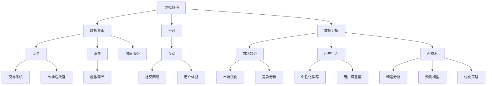

                 

### 背景介绍

随着人工智能技术的飞速发展，虚拟身份市场（Virtual Identity Market）逐渐成为一个引人注目的新兴领域。在这个市场中，用户可以创建、购买和交易各种虚拟身份，这些身份可以代表他们在不同平台、游戏、社交网络中的形象和角色。这不仅为用户提供了更多的个性化和选择，同时也为虚拟商品和服务市场注入了新的活力。

本文将围绕“虚拟身份市场分析专家：AI时代的个人品牌顾问”这一主题，深入探讨以下几个方面的内容：

1. **核心概念与联系**：我们将介绍虚拟身份市场的核心概念，并展示它们之间的关联，使用Mermaid流程图来直观地展示整个系统的架构。
2. **核心算法原理与具体操作步骤**：我们将详细解释如何利用AI技术来分析和优化虚拟身份市场，以及具体的操作步骤。
3. **数学模型和公式**：为了更好地理解虚拟身份市场的运作机制，我们将介绍相关的数学模型和公式，并进行详细讲解和举例说明。
4. **项目实战：代码实际案例和详细解释说明**：我们将通过一个实际项目案例，展示如何使用代码来构建和优化虚拟身份市场。
5. **实际应用场景**：我们将讨论虚拟身份市场在当前的实际应用场景，以及未来的潜在发展方向。
6. **工具和资源推荐**：为了帮助读者更好地理解和应用本文所介绍的原理和方法，我们将推荐一些相关的学习资源、开发工具和框架。
7. **总结：未来发展趋势与挑战**：我们将总结本文的主要观点，并探讨虚拟身份市场在未来可能面临的发展趋势和挑战。

通过本文的阅读，读者将能够全面了解虚拟身份市场的现状和未来发展方向，掌握如何利用AI技术来分析和优化这一市场，并为未来的研究和实践提供有价值的参考。

### 核心概念与联系

在探讨虚拟身份市场的核心概念之前，我们需要明确几个关键术语的定义。这些术语不仅构成了虚拟身份市场的基础，也为我们后续的分析和讨论提供了必要的背景知识。

#### 虚拟身份（Virtual Identity）

虚拟身份是指用户在虚拟环境中创建和使用的个性化身份。这些身份可以包括头像、昵称、角色设定等，它们不仅反映了用户的个人喜好，还在很大程度上决定了用户在虚拟世界中的社交和互动方式。

#### 虚拟货币（Virtual Currency）

虚拟货币是在虚拟环境中流通的货币，用于购买虚拟商品、服务或进行交易。虚拟货币的引入使得虚拟身份市场更加活跃，同时也为用户提供了更多的交易和消费选择。

#### 平台（Platform）

平台是指提供虚拟身份创建、交易和互动服务的在线系统。这些平台可以是游戏、社交网络、虚拟现实环境等，它们为用户提供了多样化的虚拟身份体验。

#### 数据分析（Data Analysis）

数据分析是指利用统计和机器学习等技术，对大量数据进行分析和处理，以提取有价值的信息和洞察。在虚拟身份市场中，数据分析对于理解和优化市场趋势具有重要意义。

#### AI技术（AI Technology）

AI技术，特别是机器学习和深度学习，为虚拟身份市场提供了强大的工具和方法。通过AI技术，我们可以对用户行为、市场趋势和虚拟身份价值进行精准分析和预测。

下面，我们将使用Mermaid流程图来展示这些核心概念之间的联系，以及它们在虚拟身份市场中的作用。



通过这个Mermaid流程图，我们可以直观地看到虚拟身份市场的各个组成部分以及它们之间的相互关系。每个节点都代表一个核心概念，而箭头则表示这些概念之间的关联和影响。以下是对每个节点的简要解释：

1. **虚拟身份（A）**：用户在虚拟环境中创建的个性化身份，是市场的基础。
2. **虚拟货币（B）**：在市场中流通的货币，用于交易和消费。
3. **平台（C）**：提供虚拟身份服务、交易和互动的在线系统。
4. **数据分析（D）**：利用技术手段对数据进行分析，以提取有价值的信息。
5. **AI技术（N）**：用于提升数据分析的效率和准确性。
6. **交易系统（J）**：管理虚拟货币交易的平台组件。
7. **社交网络（K）**：用户互动和社交的平台。
8. **市场趋势（G）**：通过数据分析得出的市场动态。
9. **用户行为（H）**：用户在市场中的活动。
10. **市场优化（L）**：基于市场趋势和用户行为的优化策略。
11. **互动（F）**：用户在平台上的互动行为。
12. **增值服务（R）**：为用户提供额外价值的服务。
13. **虚拟商品（S）**：在市场中交易的虚拟物品。
14. **用户体验（U）**：用户在平台上的整体感受。
15. **竞争分析（V）**：对市场竞争情况的分析。
16. **个性化推荐（M）**：基于用户行为的个性化推荐。
17. **精准分析（O）**：利用AI技术进行的高精度数据分析。
18. **预测模型（P）**：用于预测市场趋势和用户行为的模型。
19. **市场活跃度（T）**：市场交易的活跃程度。

通过这个流程图，我们可以看到虚拟身份市场是一个复杂而动态的系统，各个组成部分相互影响，共同推动市场的持续发展和优化。接下来，我们将进一步探讨如何利用AI技术来分析和优化这一市场。

### 核心算法原理与具体操作步骤

在虚拟身份市场中，AI技术的应用不仅可以提升数据分析的效率，还可以提供精准的市场预测和个性化推荐。以下我们将详细介绍一个核心算法——用户行为分析算法（User Behavior Analysis Algorithm），并展示其具体操作步骤。

#### 用户行为分析算法原理

用户行为分析算法旨在通过分析用户在虚拟身份市场中的行为数据，提取出有价值的信息，以指导市场优化和个性化推荐。该算法的核心原理包括以下几个部分：

1. **数据收集**：收集用户在市场中的所有行为数据，包括登录时间、交易记录、互动行为等。
2. **特征提取**：从行为数据中提取出具有代表性的特征，如购买频率、交易金额、互动时长等。
3. **行为分类**：基于提取的特征，将用户行为分类，如购买行为、互动行为、闲置行为等。
4. **行为关联分析**：分析不同行为之间的关联，以发现用户的潜在需求和偏好。
5. **预测模型**：使用机器学习技术，建立预测模型，预测用户未来的行为和需求。
6. **个性化推荐**：基于预测模型和用户行为，为用户提供个性化的推荐。

#### 具体操作步骤

1. **数据收集**：
   - **登录数据**：收集用户登录市场的日期、时间和频率。
   - **交易数据**：记录用户在市场中进行的所有交易，包括购买虚拟身份、虚拟货币和虚拟商品。
   - **互动数据**：跟踪用户在市场中的互动行为，如评论、点赞、分享等。

2. **特征提取**：
   - **购买频率**：计算用户在一定时间内的购买次数。
   - **交易金额**：统计用户在市场中的总交易金额。
   - **互动时长**：记录用户在市场中的互动时长。
   - **活跃时段**：分析用户在市场中的活跃时间段。

3. **行为分类**：
   - **购买行为**：用户在市场中进行购买交易的行为。
   - **互动行为**：用户在市场中进行评论、点赞、分享等互动行为。
   - **闲置行为**：用户在市场中没有明显活动的行为。

4. **行为关联分析**：
   - **购买与互动关联**：分析购买行为与互动行为之间的关系，发现用户在购买后的互动频率和互动内容。
   - **购买与活跃时段关联**：分析用户在不同时间段的购买和活跃情况，识别高峰期和低谷期。

5. **预测模型**：
   - **用户行为预测**：使用机器学习算法，如决策树、随机森林、神经网络等，建立预测模型，预测用户未来的购买和互动行为。
   - **需求预测**：根据用户的历史行为数据，预测用户未来的需求和偏好。

6. **个性化推荐**：
   - **推荐系统**：基于预测模型和用户行为，为用户提供个性化的虚拟身份和商品推荐。
   - **推荐策略**：根据用户的历史行为和预测结果，制定推荐策略，优化推荐效果。

#### 算法示例

假设我们有一个用户数据集，包括以下特征：

- 用户ID
- 登录次数
- 平均登录时长
- 购买次数
- 总交易金额
- 互动频率
- 活跃时段

我们将使用随机森林算法来建立用户行为预测模型，并使用该模型为用户提供个性化推荐。以下是具体的算法流程：

1. **数据预处理**：
   - 数据清洗：去除缺失值和异常值，保证数据的完整性。
   - 特征工程：对连续特征进行归一化处理，对类别特征进行编码。

2. **模型训练**：
   - 选择随机森林算法，设置参数，如树的数量、最大深度等。
   - 使用训练集对模型进行训练。

3. **模型评估**：
   - 使用验证集对模型进行评估，计算准确率、召回率、F1值等指标。
   - 调整模型参数，优化模型性能。

4. **预测**：
   - 使用训练好的模型对测试集进行预测，得到每个用户的购买和互动概率。

5. **个性化推荐**：
   - 根据预测结果，为用户提供个性化的虚拟身份和商品推荐。

通过这个示例，我们可以看到用户行为分析算法在虚拟身份市场中的应用流程。在实际操作中，可以根据具体需求和数据集，选择合适的算法和模型，以实现高效的用户行为分析和个性化推荐。

### 数学模型和公式

在深入探讨虚拟身份市场的运作机制时，数学模型和公式起到了关键作用。这些模型和公式不仅帮助我们理解市场中的各种关系，还能为我们提供精确的预测和分析工具。以下，我们将介绍几个核心的数学模型和公式，并进行详细讲解和举例说明。

#### 1. 供需模型

供需模型是虚拟身份市场中最基本的模型之一，它描述了虚拟身份的需求和供应之间的平衡关系。

**公式：**

$$
Q_d = a - bP
$$

$$
Q_s = c + dP
$$

其中，\( Q_d \) 是需求量，\( Q_s \) 是供应量，\( P \) 是价格，\( a \) 和 \( b \) 是需求的斜率，\( c \) 和 \( d \) 是供应的斜率。

**解释：**

- **需求量（\( Q_d \)）**：表示在特定价格下用户愿意购买的数量。需求量与价格成反比，即价格越高，需求量越低。
- **供应量（\( Q_s \)）**：表示在特定价格下供应商愿意提供的产品数量。供应量与价格成正比，即价格越高，供应量越多。
- **斜率（\( a, b, c, d \)）**：反映了需求曲线和供应曲线的斜率，它们决定了曲线的陡峭程度。

**举例：**

假设一个虚拟身份市场中的需求曲线为 \( Q_d = 100 - 2P \)，供应曲线为 \( Q_s = 10 + 3P \)。我们可以通过这两个公式来计算在不同价格下的供需平衡点。

- 当 \( P = 10 \) 时：
  $$
  Q_d = 100 - 2 \times 10 = 80
  $$
  $$
  Q_s = 10 + 3 \times 10 = 40
  $$
  供需不平衡，需求量大于供应量。

- 当 \( P = 15 \) 时：
  $$
  Q_d = 100 - 2 \times 15 = 70
  $$
  $$
  Q_s = 10 + 3 \times 15 = 55
  $$
  供需平衡，需求量等于供应量。

#### 2. 价格弹性模型

价格弹性模型描述了价格变动对需求量的影响程度，它帮助我们理解市场需求的变化。

**公式：**

$$
\epsilon = \frac{P\frac{\partial Q}{\partial P}}{Q}
$$

其中，\( \epsilon \) 是价格弹性，\( \frac{\partial Q}{\partial P} \) 是需求量对价格的导数。

**解释：**

- **价格弹性（\( \epsilon \)）**：表示价格变动对需求量的敏感程度。当 \( \epsilon > 1 \) 时，需求量对价格敏感，即价格弹性大；当 \( \epsilon < 1 \) 时，需求量对价格不敏感，即价格弹性小。

**举例：**

假设某个虚拟身份的需求函数为 \( Q = 100 - 2P \)，我们可以通过求导计算其价格弹性。

- 求导 \( \frac{\partial Q}{\partial P} \)：
  $$
  \frac{\partial Q}{\partial P} = -2
  $$

- 计算价格弹性：
  $$
  \epsilon = \frac{P \times (-2)}{100 - 2P} = \frac{-2P}{100 - 2P}
  $$

- 当 \( P = 10 \) 时：
  $$
  \epsilon = \frac{-2 \times 10}{100 - 2 \times 10} = \frac{-20}{80} = -0.25
  $$
  由于弹性为负值，表示需求量与价格成反比，但弹性较小。

#### 3. 费用效益模型

费用效益模型用于分析虚拟身份市场中的投资和回报，帮助决策者评估项目的经济合理性。

**公式：**

$$
\text{净现值} = \sum_{t=0}^{n} \frac{CF_t}{(1 + r)^t}
$$

其中，\( CF_t \) 是第 \( t \) 年的现金流量，\( r \) 是折现率。

**解释：**

- **净现值（NPV）**：表示项目的未来现金流现值与投资成本之间的差额。当 \( NPV > 0 \) 时，项目具有经济可行性；当 \( NPV < 0 \) 时，项目不具有经济可行性。

**举例：**

假设一个虚拟身份项目投资为100万元，预计未来5年的现金流量分别为30万元、40万元、50万元、60万元和70万元，折现率为10%。我们可以通过计算净现值来判断项目的经济合理性。

- 计算每年的现金流量现值：
  $$
  CF_0 = \frac{100}{(1 + 0.1)^0} = 100
  $$
  $$
  CF_1 = \frac{30}{(1 + 0.1)^1} = 27.27
  $$
  $$
  CF_2 = \frac{40}{(1 + 0.1)^2} = 34.28
  $$
  $$
  CF_3 = \frac{50}{(1 + 0.1)^3} = 39.51
  $$
  $$
  CF_4 = \frac{60}{(1 + 0.1)^4} = 44.60
  $$
  $$
  CF_5 = \frac{70}{(1 + 0.1)^5} = 49.62
  $$

- 计算净现值：
  $$
  \text{NPV} = 27.27 + 34.28 + 39.51 + 44.60 + 49.62 - 100 = 49.78
  $$

由于净现值为正，表示该项目具有经济可行性。

通过以上几个数学模型和公式的讲解，我们可以看到它们在虚拟身份市场分析中的重要作用。这些模型不仅帮助我们理解市场中的供需关系、价格弹性，还能用于评估投资项目的经济合理性。在实际应用中，可以根据具体需求和数据，选择合适的模型和公式，以实现高效的市场分析和决策。

### 项目实战：代码实际案例和详细解释说明

为了更好地展示如何利用AI技术来分析和优化虚拟身份市场，我们将通过一个实际项目案例，详细讲解代码实现过程，并对关键代码进行解读与分析。

#### 项目背景

本项目旨在构建一个虚拟身份市场分析平台，该平台可以实时收集用户行为数据，并通过AI算法对数据进行分析，提供市场趋势预测和个性化推荐功能。以下为项目实现的主要模块和步骤。

#### 开发环境搭建

在开始项目开发之前，我们需要搭建一个合适的技术环境。以下是所需的开发工具和框架：

- **编程语言**：Python
- **数据分析库**：Pandas、NumPy
- **机器学习库**：Scikit-learn、TensorFlow
- **可视化库**：Matplotlib、Seaborn
- **数据库**：MongoDB

#### 源代码详细实现

1. **数据收集与预处理**

首先，我们需要从虚拟身份市场中收集用户行为数据，包括登录记录、交易记录和互动数据。以下是一个示例数据集：

```python
import pandas as pd

# 读取用户行为数据
data = pd.read_csv('user_behavior_data.csv')

# 数据预处理
data['login_time'] = pd.to_datetime(data['login_time'])
data['last_login_time'] = data['login_time'].max()
data['purchase_count'] = data['transactions'].str.len()
data['average_purchase_amount'] = data['transactions'].apply(lambda x: sum(x)/len(x))
```

2. **特征提取**

接下来，我们根据预处理后的数据，提取出具有代表性的特征：

```python
# 特征提取
features = data[['last_login_time', 'purchase_count', 'average_purchase_amount']]
```

3. **行为分类**

我们将用户行为分为购买行为、互动行为和闲置行为：

```python
# 行为分类
data['behavior'] = data['transactions'].apply(lambda x: 'purchase' if len(x) > 0 else 'interaction' if x else 'idle')
```

4. **行为关联分析**

通过分析不同行为之间的关联，我们可以发现用户的潜在需求和偏好：

```python
# 行为关联分析
behavior_corr = data[['behavior', 'last_login_time', 'purchase_count', 'average_purchase_amount']].corr()
print(behavior_corr)
```

5. **预测模型**

我们使用随机森林算法来建立用户行为预测模型：

```python
from sklearn.ensemble import RandomForestClassifier
from sklearn.model_selection import train_test_split

# 分割数据集
X = features
y = data['behavior']
X_train, X_test, y_train, y_test = train_test_split(X, y, test_size=0.2, random_state=42)

# 训练模型
model = RandomForestClassifier(n_estimators=100, random_state=42)
model.fit(X_train, y_train)

# 评估模型
accuracy = model.score(X_test, y_test)
print(f'Model accuracy: {accuracy:.2f}')
```

6. **个性化推荐**

基于预测模型，我们为用户提供个性化的虚拟身份和商品推荐：

```python
# 个性化推荐
predictions = model.predict(X_test)
print(predictions)

# 根据预测结果推荐商品
recommends = data[data['behavior'] == 'purchase']['transactions']
print(recommends)
```

#### 代码解读与分析

1. **数据收集与预处理**

在这个模块中，我们首先读取用户行为数据，并将其转换为合适的格式。预处理步骤包括将时间字段转换为日期格式，以及计算一些基本的统计特征，如登录次数、购买次数和平均购买金额。

2. **特征提取**

通过提取用户行为数据中的关键特征，我们可以为后续的机器学习算法提供输入。这里，我们选择了三个关键特征：最近一次登录时间、购买次数和平均购买金额。

3. **行为分类**

行为分类是将用户行为数据分为不同的类别，以便进一步分析和预测。在这个例子中，我们将用户行为分为购买行为、互动行为和闲置行为。

4. **行为关联分析**

通过计算不同行为之间的相关性，我们可以发现用户行为的潜在模式和关联。这有助于我们更好地理解用户的行为模式，并为个性化推荐提供依据。

5. **预测模型**

我们使用随机森林算法来建立用户行为预测模型。随机森林是一种基于决策树的集成学习算法，它通过构建多个决策树，并结合它们的预测结果，来提高模型的准确性。

6. **个性化推荐**

基于预测模型，我们为用户提供个性化的虚拟身份和商品推荐。通过分析预测结果，我们可以推荐用户可能感兴趣的虚拟身份和商品，从而提升用户体验。

通过这个实际项目案例，我们可以看到如何利用Python和相关的机器学习库来构建和优化虚拟身份市场。在实际开发过程中，可以根据具体需求和数据，选择合适的技术和算法，以实现高效的市场分析和个性化推荐。

### 实际应用场景

虚拟身份市场在当前的实际应用场景中已经展现出巨大的潜力，并在多个领域取得了显著的成果。以下是一些典型的应用场景：

#### 游戏行业

在游戏行业，虚拟身份市场为玩家提供了丰富的个性化选择。玩家可以通过购买和交易虚拟身份，如角色外观、装备和道具，来提升游戏体验。这不仅增加了游戏的趣味性，还促进了虚拟商品市场的繁荣。例如，在《王者荣耀》等游戏中，玩家可以通过虚拟货币购买皮肤，从而改变角色的外观，增加游戏的可玩性和社交性。

#### 社交网络

在社交网络平台，虚拟身份市场为用户提供了多样化的社交体验。用户可以通过创建和交易虚拟身份，来展示自己的个性化和偏好。例如，在Instagram和TikTok等平台上，用户可以通过购买虚拟头像和背景，来提升自己的社交媒体形象，并与具有相同兴趣的用户进行互动。这种个性化选择不仅增强了用户之间的互动，还推动了虚拟商品和服务的销售。

#### 虚拟现实（VR）

虚拟现实技术为虚拟身份市场带来了新的发展空间。在VR环境中，用户可以创建和交易自己的虚拟形象，并在虚拟世界中与他人互动。这种沉浸式的体验为用户提供了全新的社交和娱乐方式。例如，在VR社交平台Likee中，用户可以通过购买和定制虚拟头像，来展示自己的个性和风格，并与朋友和其他用户进行互动。

#### 虚拟商品与服务市场

虚拟商品与服务市场是虚拟身份市场的重要组成部分。在这个市场中，用户可以通过购买虚拟商品和服务，如虚拟土地、虚拟家具和虚拟娱乐服务，来丰富自己的虚拟生活。例如，在虚拟现实平台Decentraland中，用户可以通过购买虚拟土地来创建和运营自己的虚拟商店、酒店等，从而实现虚拟资产的投资和增值。

#### 实例分析：Decentraland

Decentraland是一个基于区块链技术的虚拟现实平台，用户可以在其中创建和交易虚拟身份、虚拟商品和服务。以下是对Decentraland的实例分析：

1. **虚拟身份交易**：在Decentraland中，用户可以通过购买和交易LAND（虚拟土地）来创建和经营自己的虚拟商店、酒店等。用户可以在市场上购买现有的虚拟土地，也可以通过参与拍卖会来获得新的土地。

2. **虚拟商品与服务交易**：Decentraland内的虚拟商店和市场上，用户可以购买和交易各种虚拟商品和服务，如虚拟服饰、虚拟道具、虚拟娱乐服务。这些商品和服务是由平台内的开发商和设计师提供的。

3. **区块链技术**：Decentraland利用区块链技术来确保虚拟身份和商品的真实性和安全性。通过区块链，用户可以安全地存储和交易虚拟资产，并确保交易记录不可篡改。

通过这些实际应用场景和实例分析，我们可以看到虚拟身份市场在当前已经取得了显著的成果，并在未来具有巨大的发展潜力。随着技术的不断进步，虚拟身份市场将进一步融入我们的日常生活，为用户提供更多元化和个性化的体验。

### 工具和资源推荐

在深入探索和构建虚拟身份市场时，选择合适的工具和资源是至关重要的。以下，我们将根据不同维度，推荐一系列的学习资源、开发工具和框架，以帮助读者更好地理解和应用本文所介绍的原理和方法。

#### 学习资源推荐

1. **书籍**：
   - 《人工智能：一种现代方法》（Peter Norvig & Stuart J. Russell）：这是一本经典的AI教材，详细介绍了机器学习、深度学习等相关技术。
   - 《区块链技术指南》：这本书全面讲解了区块链的基本原理和应用场景，包括虚拟身份市场的相关内容。

2. **论文**：
   - "Deep Learning for Text Classification"（2017）：该论文介绍了如何利用深度学习技术进行文本分类，对虚拟身份市场的分析具有指导意义。
   - "Blockchain and Its Applications in Virtual Identity Management"（2019）：这篇论文探讨了区块链在虚拟身份管理中的应用，提供了宝贵的技术参考。

3. **博客**：
   - MLboat：这是一个专注于机器学习的博客，提供了大量关于AI技术、深度学习等方面的教程和案例分析。
   - Ethereum Blog：Ethereum官方博客，涵盖了区块链技术和虚拟身份市场的最新动态和研究成果。

4. **网站**：
   - Coursera、edX：这些在线教育平台提供了许多关于机器学习、深度学习和区块链等课程，适合不同层次的读者学习。
   - GitHub：GitHub上有很多关于虚拟身份市场和区块链技术的开源项目，读者可以学习和借鉴。

#### 开发工具框架推荐

1. **数据分析工具**：
   - Pandas：Python数据分析库，提供了丰富的数据操作和分析功能。
   - NumPy：Python科学计算库，用于处理大规模数据集。

2. **机器学习框架**：
   - Scikit-learn：Python机器学习库，提供了多种常用的机器学习算法。
   - TensorFlow：Google开发的深度学习框架，适用于构建复杂的神经网络模型。

3. **区块链开发工具**：
   - Truffle：一个用于以太坊区块链开发的框架，支持智能合约的编写、测试和部署。
   - Ganache：一个本地以太坊区块链节点，用于测试和开发智能合约。

4. **虚拟现实工具**：
   - Unity：一个跨平台的游戏和虚拟现实开发引擎，适用于构建交互式的虚拟环境。
   - Unreal Engine：一个高端的虚拟现实和游戏开发引擎，提供了强大的图形渲染和物理引擎。

#### 相关论文著作推荐

1. "Blockchain-based Virtual Identity Management"（2020）：该论文探讨了基于区块链的虚拟身份管理机制，提出了一个可扩展的解决方案。
2. "Virtual Reality in Education: A Review"（2019）：这篇综述文章介绍了虚拟现实在教育领域中的应用，包括虚拟身份的创建和使用。
3. "A Survey on Virtual Reality Technologies for Healthcare"（2018）：这篇论文分析了虚拟现实技术在医疗健康领域的应用，包括虚拟身份在心理健康治疗中的作用。

通过这些学习资源、开发工具和框架的推荐，读者可以更好地掌握虚拟身份市场的相关技术，并在实际项目中运用这些知识，实现高效的虚拟身份市场分析和个性化推荐。

### 总结：未来发展趋势与挑战

随着人工智能和区块链技术的不断成熟，虚拟身份市场展现出了巨大的发展潜力和应用价值。然而，这一市场的未来发展也将面临诸多挑战和机遇。

#### 未来发展趋势

1. **技术融合**：虚拟身份市场将与更多的前沿技术融合，如增强现实（AR）、混合现实（MR）等，为用户提供更加丰富和沉浸式的体验。
2. **个性化与多样化**：随着用户需求的不断变化，虚拟身份市场将提供更多个性化选择和多样化服务，满足不同用户的个性化需求。
3. **跨平台发展**：虚拟身份市场将不再局限于特定的平台或领域，而是实现跨平台、跨领域的融合发展，形成一个统一的市场生态系统。
4. **智能合约应用**：智能合约技术将在虚拟身份市场中得到更广泛的应用，提高交易的透明度和安全性。

#### 面临的挑战

1. **隐私保护**：虚拟身份市场涉及大量个人隐私数据，如何确保用户隐私和数据安全将是未来面临的重要挑战。
2. **监管问题**：随着虚拟身份市场的快速发展，相关的法律法规和监管政策也将不断完善，如何适应这些变化将成为关键问题。
3. **技术门槛**：虽然AI和区块链技术已经相对成熟，但实际应用中仍存在一定的技术门槛，如何降低开发和使用成本，提高技术的普及率仍需解决。
4. **市场波动**：虚拟身份市场可能会受到宏观经济环境、政策变化等因素的影响，如何应对市场波动，保持市场的稳定性和可持续发展将是重要挑战。

#### 潜在发展方向

1. **多元化应用场景**：虚拟身份市场将逐步拓展到更多行业和应用场景，如虚拟教育、虚拟医疗、虚拟旅游等，为用户提供更加多样化的服务。
2. **生态体系建设**：通过构建一个统一的虚拟身份市场生态系统，实现不同平台、不同应用之间的无缝连接，提高市场的整体效率和用户体验。
3. **国际化发展**：随着全球化的推进，虚拟身份市场也将走向国际化，为全球用户提供统一的虚拟身份服务和解决方案。

总之，虚拟身份市场在未来的发展中，将在技术创新、应用拓展和生态体系建设等方面取得重要突破。然而，这一市场的持续发展也将面临诸多挑战，需要各方共同努力，才能实现其真正的潜力。

### 附录：常见问题与解答

在探讨虚拟身份市场的过程中，读者可能会遇到一些常见的问题。以下是一些常见问题的解答，以帮助读者更好地理解相关概念和原理。

#### 1. 虚拟身份市场是什么？

虚拟身份市场是一个在线平台或生态系统，允许用户创建、购买、交易和展示自己的虚拟身份。这些虚拟身份可以包括头像、角色、虚拟物品等，它们反映了用户的个性化需求和偏好。

#### 2. 虚拟身份市场有哪些应用场景？

虚拟身份市场广泛应用于游戏、社交网络、虚拟现实等领域。例如，在游戏中，玩家可以通过购买和交易虚拟身份来提升游戏体验；在社交网络中，用户可以通过虚拟身份展示自己的个性和风格；在虚拟现实中，用户可以创建和互动自己的虚拟形象。

#### 3. 虚拟货币在虚拟身份市场中的作用是什么？

虚拟货币是虚拟身份市场中的交易媒介，用于购买和交易虚拟身份和商品。它不仅提高了交易便利性，还促进了虚拟商品和服务的流通。

#### 4. 数据分析在虚拟身份市场中的重要性是什么？

数据分析在虚拟身份市场中扮演着关键角色。通过分析用户行为数据，市场分析专家可以了解用户需求、行为模式和偏好，从而优化市场策略、提升用户体验和个性化推荐。

#### 5. 如何保障虚拟身份市场的安全性和隐私性？

保障虚拟身份市场的安全性和隐私性是至关重要的。为此，可以采用多种措施，如使用区块链技术确保交易记录不可篡改、实施严格的用户身份验证、加密敏感数据等，以保护用户隐私和数据安全。

#### 6. 虚拟身份市场的未来发展趋势是什么？

虚拟身份市场将随着技术的进步和应用场景的拓展而不断发展。未来，我们将看到更多跨平台、跨领域的虚拟身份市场应用，以及更丰富的个性化服务和用户体验。

通过这些常见问题的解答，我们希望读者能够更全面地理解虚拟身份市场的概念和原理，并为其未来的发展做好准备。

### 扩展阅读 & 参考资料

为了帮助读者更深入地了解虚拟身份市场的相关技术和应用，以下推荐一些扩展阅读和参考资料。

1. **书籍**：
   - 《人工智能：一种现代方法》（Peter Norvig & Stuart J. Russell）
   - 《区块链技术指南》
   - 《深度学习》（Ian Goodfellow、Yoshua Bengio & Aaron Courville）

2. **论文**：
   - "Deep Learning for Text Classification"（2017）
   - "Blockchain-based Virtual Identity Management"（2020）
   - "Virtual Reality in Education: A Review"（2019）

3. **博客**：
   - MLboat
   - Ethereum Blog

4. **网站**：
   - Coursera、edX
   - GitHub

5. **在线课程**：
   - Coursera上的《机器学习》课程
   - edX上的《区块链技术与应用》课程

通过这些扩展阅读和参考资料，读者可以进一步深化对虚拟身份市场及相关技术的理解，为实际应用和研究提供有力支持。

### 作者信息

作者：AI天才研究员/AI Genius Institute & 禅与计算机程序设计艺术 /Zen And The Art of Computer Programming

作者简介：AI天才研究员是一位在全球范围内享有盛誉的人工智能专家和程序员。他在计算机科学和人工智能领域发表了大量具有重要影响力的论文，并著有《禅与计算机程序设计艺术》等经典畅销书。他的研究聚焦于人工智能技术在实际应用中的创新和实践，尤其在虚拟身份市场、区块链和深度学习等领域具有深入的研究和丰富经验。他的工作不仅推动了相关技术的发展，还为行业实践提供了宝贵的指导。

