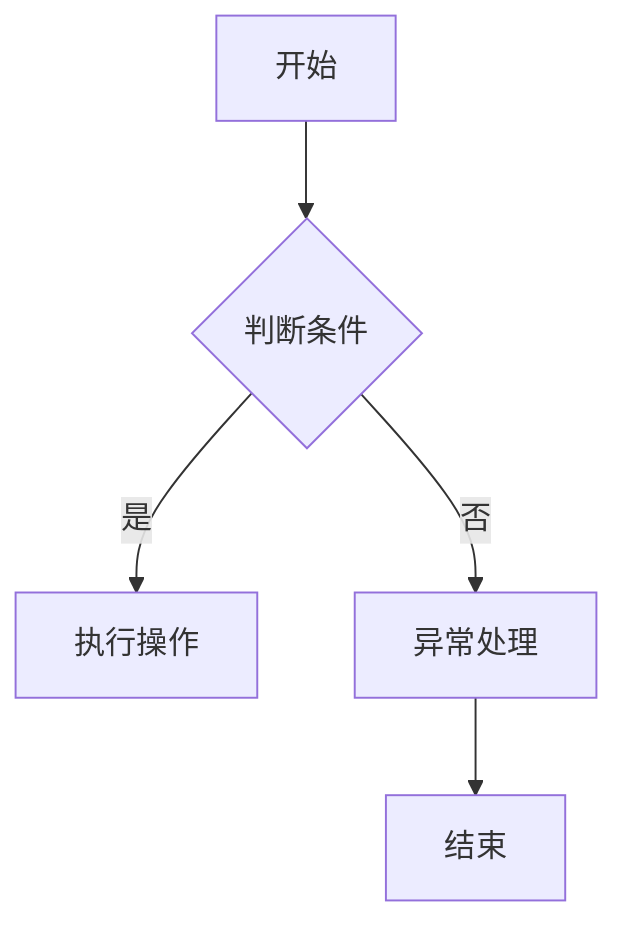

                 

# 2024蚂蚁数字科技社招面试真题汇总及其解答

## 关键词：
面试真题、蚂蚁数字科技、社招、技术考核、编程题、算法题、架构设计、系统分析、软技能、职业发展

## 摘要：
本文汇总了2024年蚂蚁数字科技社招面试中的常见面试真题，涵盖了编程题、算法题、架构设计、系统分析、软技能等多个方面。通过详细解答这些面试真题，本文旨在为准备参加蚂蚁数字科技面试的求职者提供有针对性的指导和思路，帮助他们在面试中展现出最佳状态。

## 1. 背景介绍

蚂蚁集团，原名蚂蚁金服，是中国领先的数字支付和金融科技公司。自2014年成立以来，蚂蚁集团已迅速发展成为全球最大的金融科技公司之一，旗下拥有支付宝、芝麻信用、蚂蚁财富等多个知名品牌。随着公司业务的不断拓展，蚂蚁集团对于人才的需求也日益增加，尤其是技术领域的高端人才。因此，蚂蚁集团每年都会组织大规模的社会招聘活动，吸引了众多优秀的求职者。

蚂蚁数字科技社招面试是一个全面考核求职者技术能力和综合素质的过程。面试环节通常包括编程题、算法题、系统分析、架构设计、软技能等多个方面。本文将针对这些面试环节，汇总并解析一些典型的面试真题，帮助求职者更好地准备面试。

## 2. 核心概念与联系

为了更好地理解和解答蚂蚁数字科技面试中的问题，我们需要先了解一些核心概念和联系。以下是几个在面试中经常涉及的核心概念及其关系：

### 2.1 编程语言

编程语言是计算机程序设计的基础，蚂蚁数字科技面试中可能涉及的语言包括但不限于Java、Python、C++、JavaScript等。每种编程语言都有其独特的特点和应用场景。

### 2.2 数据结构与算法

数据结构是存储和管理数据的格式，算法是对数据进行的操作。常见的面试算法问题包括排序算法、查找算法、动态规划、图算法等。

### 2.3 系统设计与架构

系统设计与架构是软件工程中的重要环节，涉及系统的总体设计、模块划分、接口设计等。面试中可能要求求职者针对具体场景设计系统架构。

### 2.4 软技能

软技能包括沟通能力、团队合作、自我驱动、解决问题的能力等。这些能力对于技术岗位同样至关重要。

### 2.5 Mermaid 流程图

Mermaid 是一种简单的图表描述语言，可以用来绘制流程图、UML图等。以下是一个简单的 Mermaid 流程图示例：



## 3. 核心算法原理 & 具体操作步骤

### 3.1 快排（Quick Sort）

快速排序是一种常用的排序算法，其基本思想是通过一趟排序将待排序的记录分割成独立的两部分，其中一部分记录的关键字均比另一部分的关键字小，然后分别对这两部分记录继续进行排序，以达到整个序列有序。

**具体操作步骤：**

1. 选择一个基准元素。
2. 将序列中小于基准元素的移动到基准元素之前，大于基准元素的移动到基准元素之后。
3. 对划分后的两部分递归进行快速排序。

### 3.2 爬楼梯（Climbing Stairs）

给定一个楼梯，每次可以爬1个或2个台阶，问有多少种不同的方法可以爬到楼顶。

**数学模型和公式：**

设 f(n) 表示爬到第 n 个台阶的方法数，则有：

$$
f(n) = f(n-1) + f(n-2)
$$

**举例说明：**

如果楼梯有5个台阶，那么可以有以下几种爬法：

1. 1+1+1+1+1
2. 1+1+1+2
3. 1+2+1+1
4. 1+2+2
5. 2+1+1+1
6. 2+1+2
7. 2+2+1
8. 2+2+2

因此，f(5) = 8。

### 3.3 单链表反转（Reverse Linked List）

单链表反转是指将单链表中的节点顺序颠倒，即原来的最后一个节点变成第一个节点，第二个节点变成倒数第二个节点，以此类推。

**具体操作步骤：**

1. 初始化三个指针，分别指向链表的头节点、当前节点和前一个节点。
2. 遍历链表，在遍历过程中将当前节点的下一个节点指向前一个节点。
3. 将当前节点更新为前一个节点，继续遍历。

最终，头节点将成为链表的最后一个节点。

## 4. 数学模型和公式 & 详细讲解 & 举例说明

### 4.1 线性回归（Linear Regression）

线性回归是一种用于预测连续值的统计方法，其基本模型可以表示为：

$$
y = \beta_0 + \beta_1 \cdot x + \epsilon
$$

其中，\(y\) 是因变量，\(x\) 是自变量，\(\beta_0\) 和 \(\beta_1\) 是模型参数，\(\epsilon\) 是误差项。

**详细讲解：**

1. 模型假设：线性回归假设因变量 \(y\) 和自变量 \(x\) 之间存在线性关系。
2. 参数估计：通过最小二乘法估计模型参数 \(\beta_0\) 和 \(\beta_1\)。
3. 预测：给定一个新的自变量 \(x\)，可以计算对应的 \(y\) 值。

**举例说明：**

假设我们有以下数据集：

| x | y |
|---|---|
| 1 | 2 |
| 2 | 4 |
| 3 | 6 |
| 4 | 8 |

我们可以建立线性回归模型来预测 \(x=5\) 时的 \(y\) 值。通过最小二乘法，我们可以得到模型参数：

$$
\beta_0 = 1, \beta_1 = 2
$$

因此，当 \(x=5\) 时，\(y\) 的预测值为：

$$
y = 1 + 2 \cdot 5 = 11
$$

### 4.2 朴素贝叶斯分类器（Naive Bayes Classifier）

朴素贝叶斯分类器是一种基于贝叶斯定理的分类算法，其基本模型可以表示为：

$$
P(C_k | x) = \frac{P(x | C_k) \cdot P(C_k)}{P(x)}
$$

其中，\(C_k\) 是第 \(k\) 个类别，\(x\) 是特征向量，\(P(C_k | x)\) 是特征向量 \(x\) 属于类别 \(C_k\) 的概率。

**详细讲解：**

1. 特征独立性假设：朴素贝叶斯分类器假设特征之间相互独立。
2. 参数估计：通过训练数据集估计每个类别的概率和条件概率。
3. 分类：对于新的特征向量 \(x\)，计算其属于每个类别的概率，选择概率最大的类别作为预测结果。

**举例说明：**

假设我们有以下数据集：

| 类别 | 特征1 | 特征2 |
|------|-------|-------|
| A    | 1     | 1     |
| A    | 1     | 2     |
| B    | 2     | 1     |
| B    | 2     | 2     |

我们可以使用朴素贝叶斯分类器来分类新的数据点 \((2, 1)\)。

首先，计算每个类别的概率：

$$
P(A) = \frac{2}{4} = 0.5, \quad P(B) = \frac{2}{4} = 0.5
$$

然后，计算条件概率：

$$
P(1 | A) = \frac{2}{2} = 1, \quad P(2 | A) = \frac{1}{2} = 0.5
$$

$$
P(1 | B) = \frac{1}{2} = 0.5, \quad P(2 | B) = \frac{1}{2} = 0.5
$$

最后，计算新的数据点属于每个类别的概率：

$$
P(A | 2, 1) = \frac{1 \cdot 0.5}{1 \cdot 0.5 + 0.5 \cdot 0.5} = 0.667
$$

$$
P(B | 2, 1) = \frac{0.5 \cdot 0.5}{1 \cdot 0.5 + 0.5 \cdot 0.5} = 0.333
$$

因此，新的数据点 \((2, 1)\) 最可能属于类别 A。

## 5. 项目实战：代码实际案例和详细解释说明

### 5.1 开发环境搭建

在解答蚂蚁数字科技面试中的编程题和算法题时，通常需要搭建相应的开发环境。以下是一个基于 Python 的开发环境搭建步骤：

1. 安装 Python：在 [Python 官网](https://www.python.org/) 下载并安装 Python。
2. 安装必要的库：使用 `pip` 命令安装所需库，例如 `numpy`、`pandas`、`matplotlib` 等。
3. 配置 IDE：安装并配置 PyCharm 或 VS Code 等 IDE，以便进行代码编写和调试。

### 5.2 源代码详细实现和代码解读

以下是一个简单的快速排序算法的实现：

```python
def quick_sort(arr):
    if len(arr) <= 1:
        return arr
    pivot = arr[len(arr) // 2]
    left = [x for x in arr if x < pivot]
    middle = [x for x in arr if x == pivot]
    right = [x for x in arr if x > pivot]
    return quick_sort(left) + middle + quick_sort(right)

# 测试
arr = [3, 6, 8, 10, 1, 2, 1]
sorted_arr = quick_sort(arr)
print(sorted_arr)
```

**代码解读：**

1. `quick_sort` 函数接收一个数组 `arr` 作为参数。
2. 如果 `arr` 的长度小于等于 1，则直接返回 `arr`，因为单个元素已经是有序的。
3. 选择基准元素 `pivot`，这里我们选择数组中间的元素。
4. 将数组分为三个部分：小于 `pivot` 的元素放在 `left` 中，等于 `pivot` 的元素放在 `middle` 中，大于 `pivot` 的元素放在 `right` 中。
5. 分别对 `left` 和 `right` 递归调用 `quick_sort` 函数，然后将结果与 `middle` 拼接起来，返回排序后的数组。

### 5.3 代码解读与分析

上述快速排序算法采用了递归实现，其时间复杂度为 \(O(n \log n)\)，空间复杂度为 \(O(n)\)。在实际应用中，快速排序是一种非常高效的排序算法，适用于大数据集。

然而，快速排序的基准选择和递归调用的次数会对性能产生较大影响。在实际开发中，可以采用随机选择基准、三数取中等方法优化快速排序的性能。

## 6. 实际应用场景

蚂蚁数字科技在金融科技领域有着广泛的应用场景，以下是一些典型的应用场景：

1. **支付与转账**：蚂蚁集团的支付宝是世界上最受欢迎的支付平台之一，支持各种支付方式，包括移动支付、网银支付、信用卡支付等。
2. **借贷与理财**：蚂蚁花呗、借呗等借贷产品，以及余额宝等理财产品，为用户提供了便捷的借贷和理财服务。
3. **保险与服务**：蚂蚁保险提供了各种保险产品，包括健康保险、车险、旅游保险等，为用户提供了全方位的保障。
4. **金融科技服务**：蚂蚁集团为金融机构提供包括支付、风控、信用评估、数据分析等在内的金融科技服务。

在这些应用场景中，技术能力和算法水平是蚂蚁数字科技的核心竞争力。因此，在面试中，蚂蚁数字科技会更加关注求职者的技术能力和解决问题的能力。

## 7. 工具和资源推荐

### 7.1 学习资源推荐

- **书籍**：《深度学习》、《算法导论》、《编程珠玑》等。
- **论文**：查阅顶级会议和期刊的论文，如 NeurIPS、ICML、KDD 等。
- **博客**：关注技术博客，如 CSDN、知乎、博客园等。
- **网站**：学习资源网站，如 Coursera、edX、Udacity 等。

### 7.2 开发工具框架推荐

- **编程语言**：Python、Java、C++等。
- **框架**：Django、Flask、Spring Boot、React、Vue 等。
- **数据库**：MySQL、MongoDB、Redis 等。
- **版本控制**：Git、SVN 等。

### 7.3 相关论文著作推荐

- **论文**：《神经网络与深度学习》、《自然语言处理综合教程》等。
- **著作**：《Python编程：从入门到实践》、《数据科学入门》等。

## 8. 总结：未来发展趋势与挑战

随着数字经济的快速发展，金融科技行业正迎来前所未有的机遇和挑战。蚂蚁数字科技作为金融科技领域的领军企业，未来将继续在技术创新、业务拓展、国际化等方面发力。

对于求职者来说，金融科技领域的快速发展也带来了更多机会和挑战。求职者需要不断提升自己的技术能力和解决问题的能力，以应对不断变化的市场需求。同时，软技能如沟通能力、团队合作等也同样重要。

## 9. 附录：常见问题与解答

### 9.1 如何评估自己的技术水平？

1. 参考业内知名的技术博客和论文，了解当前技术发展趋势。
2. 完成一些在线编程挑战和算法竞赛，如 LeetCode、HackerRank 等。
3. 评估自己的编程技能和算法水平，可以参考一些编程书籍和在线课程。

### 9.2 如何提高自己的软技能？

1. 参加团队项目和开源项目，提升团队合作能力。
2. 参加演讲和分享活动，提高沟通和表达能力。
3. 学习时间管理和自我驱动方法，提升工作效率。

## 10. 扩展阅读 & 参考资料

- 蚂蚁集团官网：[https://www.antgroup.com/](https://www.antgroup.com/)
- 蚂蚁数字科技招聘官网：[https://job.antfin.com/](https://job.antfin.com/)
- LeetCode：[https://leetcode.com/](https://leetcode.com/)
- HackerRank：[https://www.hackerrank.com/](https://www.hackerrank.com/)

## 作者

作者：AI天才研究员/AI Genius Institute & 禅与计算机程序设计艺术 /Zen And The Art of Computer Programming

本文基于2024年蚂蚁数字科技社招面试真题汇总，结合技术原理和实际案例，旨在为准备参加面试的求职者提供有针对性的指导和思路。希望本文能对您有所帮助。祝您面试成功！

