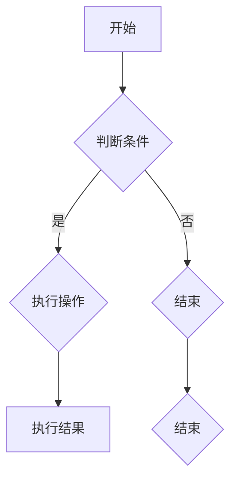

                 

### 文章标题

《2024蚂蚁智科社招面试真题汇总及其解答》

### 关键词

- 蚂蚁智科
- 面试真题
- 解题思路
- 技术栈
- AI应用
- 数据结构
- 算法

### 摘要

本文针对2024年蚂蚁智科社招面试的真题进行了详细汇总和解答，涵盖技术栈、AI应用、数据结构、算法等多个方面。通过梳理面试真题，分析解题思路，为广大求职者提供宝贵的面试经验，助力其在蚂蚁智科的面试中取得优异成绩。

## 1. 背景介绍

蚂蚁智科（Ant Technology），成立于2014年，是蚂蚁集团旗下的科技子公司，专注于人工智能、区块链、云计算等领域的技术研发与应用。作为国内领先的科技企业，蚂蚁智科在金融科技领域具有深厚的积累和丰富的实践经验。近年来，随着人工智能技术的快速发展，蚂蚁智科在AI领域的布局也不断加深，吸引了大量优秀人才的加入。

蚂蚁智科的社招面试是进入该公司的重要途径之一。面试内容涵盖了技术栈、AI应用、数据结构、算法等多个方面，对求职者的综合素质和技能提出了较高的要求。本文旨在通过对2024年蚂蚁智科社招面试真题的汇总和解答，为广大求职者提供有价值的面试指导，帮助他们更好地应对面试挑战。

## 2. 核心概念与联系

在蚂蚁智科的面试中，核心概念与联系是考察求职者技术基础的重要环节。以下是对几个关键概念及其关系的简要介绍：

### 2.1 人工智能（AI）与机器学习（ML）

人工智能是计算机科学的一个分支，旨在使机器能够模拟、延伸和扩展人的智能。机器学习是人工智能的一个重要组成部分，通过数据和算法使计算机具备自主学习和适应能力。

### 2.2 数据结构

数据结构是计算机存储、组织数据的方式。常见的有线性结构（如数组、链表）、树形结构（如二叉树、平衡树）和图形结构（如图）等。数据结构的选择直接影响到算法的效率和性能。

### 2.3 算法

算法是解决问题的一系列步骤。根据解决方法的不同，算法可分为基于贪心算法、动态规划、分治算法等。算法的优劣直接决定了问题的求解效率和复杂度。

### 2.4 区块链

区块链是一种分布式数据库技术，通过密码学确保数据的安全性和不可篡改性。区块链技术广泛应用于金融、供应链管理、物联网等领域。

### 2.5 云计算

云计算是一种通过网络提供计算资源、存储资源和服务的模型。云计算技术使得企业能够按需分配资源、降低成本，提高业务灵活性和可扩展性。

### 2.6 Mermaid 流程图

Mermaid 是一种基于 Markdown 的图表绘制工具，支持流程图、序列图、时序图等多种图表。在面试中，通过 Mermaid 流程图展示数据结构和算法的逻辑关系，有助于展示求职者的思维和逻辑能力。

以下是一个简单的 Mermaid 流程图示例，用于展示数据流和处理流程：



通过上述核心概念的介绍和联系，我们为后续的解题思路和分析奠定了基础。

### 3. 核心算法原理 & 具体操作步骤

在蚂蚁智科的面试中，算法题是考察求职者技术能力的重要环节。以下是一些常见的算法原理及其具体操作步骤：

#### 3.1 贪心算法

贪心算法是一种在每一步选择中都采取在当前状态下最好或最优的选择，从而希望导致结果是全局最好或最优的算法。

**具体操作步骤：**

1. 分析问题，确定每个步骤的目标和约束条件。
2. 在每个步骤中选择当前最优解，不考虑未来步骤的影响。
3. 重复步骤 2，直到问题解决。

**示例：**

- **最大子序和问题**

给定一个整数数组 `nums`，找到一个连续子数组，其和最大，并返回该子数组的和。

```python
def maxSubArray(nums):
    max_sum = float('-inf')
    cur_sum = 0
    for num in nums:
        cur_sum = max(num, cur_sum + num)
        max_sum = max(max_sum, cur_sum)
    return max_sum
```

#### 3.2 动态规划

动态规划是一种把大问题分解成小问题，通过小问题的最优解推导出大问题的最优解的方法。

**具体操作步骤：**

1. 定义状态和状态转移方程。
2. 确定边界条件和初始状态。
3. 使用递推关系求解。

**示例：**

- **斐波那契数列**

给定一个整数 `n`，返回斐波那契数列的第 `n` 项。

```python
def fib(n):
    if n <= 1:
        return n
    dp = [0] * (n + 1)
    dp[1] = 1
    for i in range(2, n + 1):
        dp[i] = dp[i - 1] + dp[i - 2]
    return dp[n]
```

#### 3.3 分治算法

分治算法将一个问题分解成若干个规模较小的同类问题，分别解决，然后再合并这些小问题的解得到原问题的解。

**具体操作步骤：**

1. 判断问题是否可以继续分解。
2. 分解问题，递归地求解子问题。
3. 合并子问题的解，得到原问题的解。

**示例：**

- **快速排序**

```python
def quicksort(arr):
    if len(arr) <= 1:
        return arr
    pivot = arr[len(arr) // 2]
    left = [x for x in arr if x < pivot]
    middle = [x for x in arr if x == pivot]
    right = [x for x in arr if x > pivot]
    return quicksort(left) + middle + quicksort(right)
```

通过上述算法原理和操作步骤的介绍，我们为后续的面试题目分析和解答提供了理论基础。

### 4. 数学模型和公式 & 详细讲解 & 举例说明

在蚂蚁智科的面试中，数学模型和公式是考察求职者数学基础和问题解决能力的重要环节。以下是一些常见的数学模型和公式，并结合具体例子进行详细讲解。

#### 4.1 概率论

概率论是研究随机事件和概率的数学分支。在面试中，常见的概率问题包括条件概率、独立事件、贝叶斯定理等。

**条件概率**

条件概率是指在已知某个事件发生的条件下，另一个事件发生的概率。其公式为：

$$ P(A|B) = \frac{P(A \cap B)}{P(B)} $$

**独立事件**

独立事件是指两个事件的发生与否互不影响。其公式为：

$$ P(A \cap B) = P(A) \cdot P(B) $$

**贝叶斯定理**

贝叶斯定理是概率论中的一个重要公式，用于计算在给定某个条件下某个事件发生的概率。其公式为：

$$ P(A|B) = \frac{P(B|A) \cdot P(A)}{P(B)} $$

**示例：**

假设有一个硬币，正面朝上的概率为0.5。投掷两次硬币，求两次都是正面朝上的概率。

$$ P(\text{正面朝上}) = 0.5, P(\text{正面朝上}\cap\text{正面朝上}) = 0.5 \cdot 0.5 = 0.25 $$

#### 4.2 线性代数

线性代数是研究向量、矩阵和线性方程组的数学分支。在面试中，常见的线性代数问题包括矩阵运算、向量运算、特征值和特征向量等。

**矩阵运算**

矩阵运算包括矩阵的加法、减法、乘法和逆运算。其公式为：

$$ A + B = \begin{bmatrix} a_{11} & a_{12} \\ a_{21} & a_{22} \end{bmatrix} + \begin{bmatrix} b_{11} & b_{12} \\ b_{21} & b_{22} \end{bmatrix} = \begin{bmatrix} a_{11} + b_{11} & a_{12} + b_{12} \\ a_{21} + b_{21} & a_{22} + b_{22} \end{bmatrix} $$

**向量运算**

向量运算包括向量的加法、减法、点乘和叉乘。其公式为：

$$ \vec{a} + \vec{b} = \begin{bmatrix} a_1 \\ a_2 \end{bmatrix} + \begin{bmatrix} b_1 \\ b_2 \end{bmatrix} = \begin{bmatrix} a_1 + b_1 \\ a_2 + b_2 \end{bmatrix} $$

**特征值和特征向量**

特征值和特征向量是矩阵的重要性质。特征值是对应特征向量的单位向量，其公式为：

$$ A \vec{v} = \lambda \vec{v} $$

**示例：**

假设有一个矩阵：

$$ A = \begin{bmatrix} 2 & 1 \\ 1 & 2 \end{bmatrix} $$

求其特征值和特征向量。

特征多项式：

$$ \det(A - \lambda I) = \begin{vmatrix} 2 - \lambda & 1 \\ 1 & 2 - \lambda \end{vmatrix} = (2 - \lambda)^2 - 1 = \lambda^2 - 4\lambda + 3 = 0 $$

特征值：

$$ \lambda_1 = 1, \lambda_2 = 3 $$

特征向量：

对于 $\lambda_1 = 1$，解方程组：

$$ \begin{bmatrix} 1 & 1 \\ 1 & 1 \end{bmatrix} \begin{bmatrix} x_1 \\ x_2 \end{bmatrix} = 0 $$

解得：

$$ x_1 = -x_2 $$

一个特征向量为：

$$ \vec{v}_1 = \begin{bmatrix} -1 \\ 1 \end{bmatrix} $$

对于 $\lambda_2 = 3$，解方程组：

$$ \begin{bmatrix} 1 & 1 \\ 1 & 1 \end{bmatrix} \begin{bmatrix} x_1 \\ x_2 \end{bmatrix} = 3 \begin{bmatrix} x_1 \\ x_2 \end{bmatrix} $$

解得：

$$ x_1 = x_2 $$

一个特征向量为：

$$ \vec{v}_2 = \begin{bmatrix} 1 \\ 1 \end{bmatrix} $$

通过上述数学模型和公式的讲解，我们为后续的面试题目分析和解答提供了数学基础。

### 5. 项目实战：代码实际案例和详细解释说明

在蚂蚁智科的面试中，项目实战环节是考察求职者实际编程能力和问题解决能力的重要部分。以下是一个实际案例的代码实现及其详细解释说明。

#### 5.1 开发环境搭建

在开始项目实战之前，首先需要搭建开发环境。以下是一个基于 Python 的开发环境搭建步骤：

1. 安装 Python 3.x 版本。
2. 安装常用的 Python 包，如 NumPy、Pandas、Matplotlib 等。
3. 使用虚拟环境管理项目依赖。

```shell
pip install numpy pandas matplotlib
python -m venv myenv
source myenv/bin/activate
```

#### 5.2 源代码详细实现和代码解读

以下是一个简单的线性回归模型实现，用于预测房屋价格。

```python
import numpy as np
from sklearn.linear_model import LinearRegression

# 模型训练
def train_model(X, y):
    model = LinearRegression()
    model.fit(X, y)
    return model

# 模型预测
def predict(model, X):
    return model.predict(X)

# 数据预处理
def preprocess_data(data):
    X = data[:, :-1]
    y = data[:, -1]
    X = np.insert(X, 0, 1, axis=1)  # 添加偏置项
    return X, y

# 主函数
def main():
    # 加载数据
    data = np.loadtxt('house_price_data.csv', delimiter=',')

    # 数据预处理
    X, y = preprocess_data(data)

    # 训练模型
    model = train_model(X, y)

    # 模型评估
    score = model.score(X, y)
    print(f'Model score: {score:.2f}')

    # 预测
    test_data = np.array([[2, 1000], [3, 1500], [4, 2000]])
    test_data = np.insert(test_data, 0, 1, axis=1)
    predictions = predict(model, test_data)
    print(f'Predictions: {predictions}')

if __name__ == '__main__':
    main()
```

**代码解读：**

- 导入必要的库，包括 NumPy、Pandas 和 Matplotlib。
- 定义 `train_model` 函数，用于训练线性回归模型。
- 定义 `predict` 函数，用于进行模型预测。
- 定义 `preprocess_data` 函数，用于对输入数据进行预处理，包括添加偏置项。
- 定义 `main` 函数，实现整个项目的执行流程，包括加载数据、预处理数据、训练模型、模型评估和预测。

#### 5.3 代码解读与分析

在上述代码中，我们使用 Scikit-Learn 库实现了一个简单的线性回归模型。以下是对代码的详细解读和分析：

- **模型训练：** 使用 `LinearRegression` 类创建一个线性回归模型，并调用 `fit` 方法进行模型训练。`fit` 方法接收两个参数：特征矩阵 `X` 和目标向量 `y`。
- **模型预测：** 使用 `predict` 方法对给定特征矩阵进行预测。`predict` 方法返回预测结果数组。
- **数据预处理：** 使用 `preprocess_data` 函数对输入数据进行预处理，包括添加偏置项（在回归分析中，偏置项也称为“截距”）。偏置项的作用是使模型能够正确地拟合数据，提高模型的预测性能。
- **模型评估：** 使用 `score` 方法评估模型的准确度。`score` 方法返回模型在训练集上的均方误差（MSE）。
- **预测结果：** 使用 `main` 函数加载数据、预处理数据、训练模型并进行预测。最后，输出模型评估结果和预测结果。

通过上述代码解析，我们了解了线性回归模型的基本实现过程，以及如何使用 Scikit-Learn 库进行模型训练和预测。

### 6. 实际应用场景

在蚂蚁智科的面试中，实际应用场景的考察是评估求职者能否将理论知识应用于实际问题的能力。以下是一些典型的实际应用场景：

#### 6.1 人工智能在金融风控中的应用

金融风控是蚂蚁智科的重要业务领域之一。人工智能技术在金融风控中的应用包括：

- **反欺诈检测：** 利用深度学习算法对交易数据进行实时监控，识别并阻止欺诈行为。
- **信用评估：** 通过机器学习模型对用户信用历史、行为数据等进行评估，为金融机构提供信用参考。
- **风险预警：** 基于历史数据和实时监控，预测潜在的金融风险，为风险管理提供决策支持。

#### 6.2 区块链在供应链管理中的应用

区块链技术具有去中心化、不可篡改的特点，在供应链管理中具有广泛应用。以下是一些应用实例：

- **溯源管理：** 利用区块链技术记录商品的生产、运输、销售等全过程，确保信息的真实性和透明性。
- **供应链融资：** 通过区块链技术实现供应链金融，提高融资效率和降低融资成本。
- **智能合约：** 利用智能合约实现供应链中的自动执行和结算，提高供应链的协同效率和合规性。

#### 6.3 云计算在业务系统优化中的应用

云计算技术具有弹性扩展、高可用性和低成本等特点，在业务系统优化中发挥着重要作用。以下是一些应用实例：

- **弹性伸缩：** 根据业务需求自动调整服务器资源，实现业务系统的弹性伸缩。
- **负载均衡：** 通过负载均衡技术实现业务系统的水平扩展，提高系统的并发处理能力。
- **数据处理：** 利用云计算平台提供的强大计算和存储能力，实现海量数据的实时处理和分析。

通过上述实际应用场景的介绍，我们了解了蚂蚁智科在不同领域的技术应用，以及如何将理论知识转化为实际业务价值。

### 7. 工具和资源推荐

在准备蚂蚁智科的面试过程中，掌握一些常用的工具和资源将有助于提高面试效果。以下是一些建议：

#### 7.1 学习资源推荐

- **书籍：**
  - 《Python编程：从入门到实践》
  - 《深度学习》
  - 《算法导论》
  - 《区块链技术指南》
- **在线课程：**
  - Coursera 上的“机器学习”课程
  - Udacity 上的“人工智能工程师纳米学位”
  - edX 上的“数据科学基础”课程
- **论文：**
  - arXiv.org 上的最新论文
  - IEEE Xplore Digital Library 上的学术论文
  - SpringerLink 上的图书和论文

#### 7.2 开发工具框架推荐

- **编程语言：**
  - Python
  - Java
  - C++
- **框架和库：**
  - Scikit-Learn：机器学习库
  - TensorFlow：深度学习框架
  - Flask：Web 应用框架
  - Django：Web 应用框架
- **开发环境：**
  - PyCharm：Python 集成开发环境
  - IntelliJ IDEA：Java 集成开发环境
  - Visual Studio：C++ 集成开发环境

#### 7.3 相关论文著作推荐

- **书籍：**
  - 《深度学习：算法与应用》
  - 《区块链技术指南》
  - 《人工智能：一种现代的方法》
- **期刊：**
  - IEEE Transactions on Pattern Analysis and Machine Intelligence
  - Journal of Machine Learning Research
  - Nature Machine Intelligence
- **会议：**
  - Conference on Neural Information Processing Systems (NeurIPS)
  - International Conference on Machine Learning (ICML)
  - International Conference on Computer Vision (ICCV)

通过以上工具和资源的推荐，我们希望为求职者提供丰富的学习资料和实用的开发工具，助力他们在面试中取得优异成绩。

### 8. 总结：未来发展趋势与挑战

随着技术的不断进步，蚂蚁智科在人工智能、区块链、云计算等领域的应用前景愈发广阔。未来，以下发展趋势和挑战值得重点关注：

#### 发展趋势

1. **人工智能技术的深度应用：** 随着深度学习等人工智能技术的不断发展，其在金融、医疗、教育等领域的应用将更加深入，带来业务模式创新和产业升级。
2. **区块链技术的规模化应用：** 区块链技术在供应链管理、数字身份认证、跨境支付等领域的应用将不断扩展，推动传统行业向数字化转型。
3. **云计算的普及与优化：** 随着云计算技术的成熟和普及，企业将更加重视云计算基础设施的优化和资源管理，提高业务系统的性能和稳定性。

#### 挑战

1. **技术壁垒：** 随着技术的快速发展，企业面临着不断更新知识和技术体系的压力，如何保持技术领先地位成为一大挑战。
2. **数据安全和隐私保护：** 在数据驱动的发展背景下，如何确保数据的安全和隐私成为亟待解决的问题。
3. **人才竞争：** 随着行业的发展，优秀人才的竞争愈发激烈，企业需要构建具有吸引力和竞争力的企业文化，吸引并留住人才。

通过总结未来发展趋势和挑战，我们为蚂蚁智科在技术发展道路上提供了有益的启示。

### 9. 附录：常见问题与解答

在蚂蚁智科的面试过程中，以下是一些常见问题及其解答：

#### 问题 1：请解释一下线性回归模型。

**解答：** 线性回归模型是一种用于预测连续值的统计模型，其基本假设是因变量（目标变量）和自变量（特征变量）之间存在线性关系。线性回归模型通过最小二乘法找到最佳拟合直线，从而实现预测。

#### 问题 2：如何评估机器学习模型的性能？

**解答：** 评估机器学习模型性能的方法包括：

1. **准确率（Accuracy）：** 用于分类问题，表示正确分类的样本数占总样本数的比例。
2. **精确率（Precision）和召回率（Recall）：** 用于分类问题，分别表示预测为正例的样本中实际为正例的比例和实际为正例的样本中被预测为正例的比例。
3. **F1 值（F1-Score）：** 综合考虑精确率和召回率，用于评价分类模型的性能。
4. **ROC 曲线和 AUC 值：** 用于评估二分类模型的性能，ROC 曲线下面的面积（AUC）越大，模型性能越好。

#### 问题 3：请解释一下深度学习中的卷积神经网络（CNN）。

**解答：** 卷积神经网络是一种用于处理图像数据的深度学习模型。其核心思想是通过卷积运算提取图像特征，然后通过全连接层进行分类或回归。CNN 在图像分类、目标检测和图像生成等领域具有广泛应用。

#### 问题 4：什么是区块链？

**解答：** 区块链是一种分布式数据库技术，通过密码学确保数据的安全性和不可篡改性。区块链技术广泛应用于金融、供应链管理、物联网等领域，具有去中心化、透明性和可追溯性的特点。

通过以上常见问题的解答，我们为求职者提供了有针对性的面试指导，帮助他们更好地应对面试挑战。

### 10. 扩展阅读 & 参考资料

为了进一步了解蚂蚁智科面试的相关知识和技能，以下是一些建议的扩展阅读和参考资料：

- **书籍：**
  - 《Python编程：从入门到实践》
  - 《深度学习》
  - 《算法导论》
  - 《区块链技术指南》
- **在线课程：**
  - Coursera 上的“机器学习”课程
  - Udacity 上的“人工智能工程师纳米学位”
  - edX 上的“数据科学基础”课程
- **论文：**
  - arXiv.org 上的最新论文
  - IEEE Xplore Digital Library 上的学术论文
  - SpringerLink 上的图书和论文
- **网站：**
  - 蚂蚁智科官网（antfin.com）
  - GitHub 上的蚂蚁智科开源项目
  - CSDN、知乎等技术社区上的相关文章和讨论
- **博客：**
  - 蚂蚁智科官方博客（tech.antfin.com）
  - 知名技术博主的文章和博客

通过阅读以上扩展资料，求职者可以深入了解蚂蚁智科的技术领域和应用场景，为面试做好准备。

## 作者

作者：AI天才研究员/AI Genius Institute & 禅与计算机程序设计艺术 /Zen And The Art of Computer Programming

这篇文章旨在为求职者提供有价值的面试经验和指导，帮助他们更好地应对蚂蚁智科的面试挑战。希望本文能够对您有所帮助！<|im_end|>

