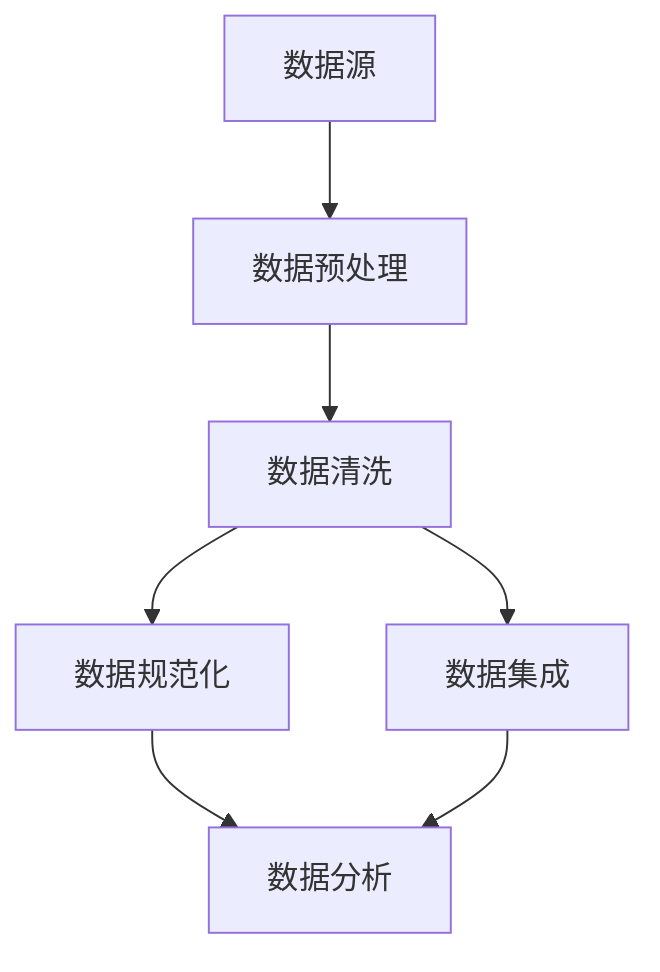
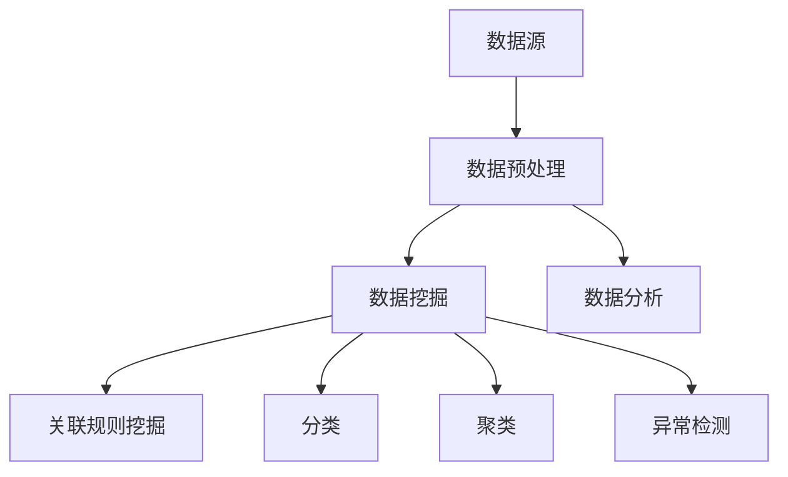
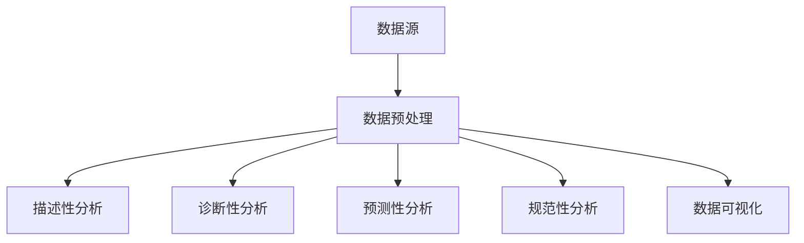
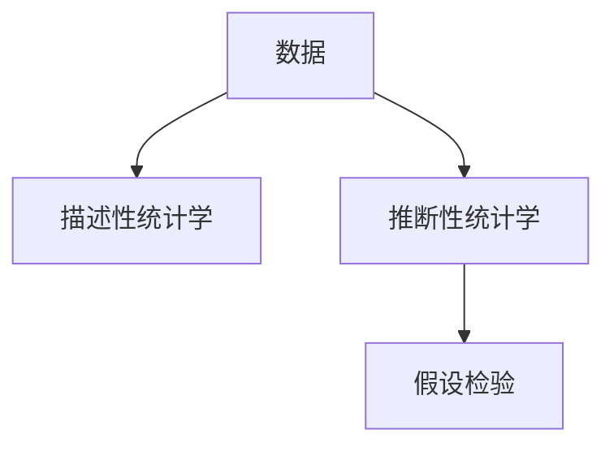
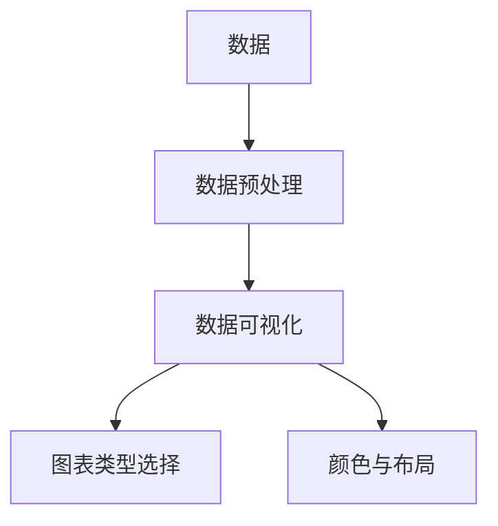

                 

### 背景介绍

蚂蚁金服，作为中国领先的金融科技公司，以其创新的金融产品和服务而闻名。随着金融科技的迅猛发展，数据分析师在蚂蚁金服中的角色也越来越重要。因此，蚂蚁金服2025年社招的数据分析师面试题成为了众多求职者关注的焦点。

数据分析师在蚂蚁金服的工作中起着至关重要的作用。他们通过分析大量的金融数据，帮助公司做出更加精准的决策，优化业务流程，提高运营效率，从而提升公司的整体竞争力。具体而言，数据分析师的工作内容包括数据清洗、数据挖掘、数据分析报告撰写以及业务问题的解决等。

蚂蚁金服2025年社招数据分析师面试题的解析，不仅对求职者了解面试题目有重要指导意义，还能帮助读者更好地理解数据分析师在金融科技行业中的职责和技能要求。本文将通过对这些面试题的详细解析，帮助读者掌握数据分析师的核心知识和技能。

本文的结构如下：

- **1. 背景介绍**：介绍蚂蚁金服及其数据分析师的角色。
- **2. 核心概念与联系**：讲解数据分析师所需的核心概念和原理，并附上Mermaid流程图。
- **3. 核心算法原理 & 具体操作步骤**：详细解析蚂蚁金服面试题中的核心算法及其实现步骤。
- **4. 数学模型和公式 & 详细讲解 & 举例说明**：介绍相关数学模型和公式，并通过实例进行说明。
- **5. 项目实战：代码实际案例和详细解释说明**：通过具体代码案例讲解数据分析师的实战技巧。
- **6. 实际应用场景**：讨论数据分析师在蚂蚁金服的应用场景。
- **7. 工具和资源推荐**：推荐学习和使用数据分析师工具和资源的途径。
- **8. 总结：未来发展趋势与挑战**：总结数据分析师在未来的发展趋势和面临的挑战。
- **9. 附录：常见问题与解答**：提供一些常见问题及其解答。
- **10. 扩展阅读 & 参考资料**：推荐相关的扩展阅读材料。

接下来，我们将一步一步地深入解析这些面试题，帮助读者全面理解数据分析师的工作内容和技能要求。

### 核心概念与联系

在数据分析师的职位中，理解并运用一系列核心概念和原理是至关重要的。以下将详细讲解这些核心概念，并利用Mermaid流程图展示它们之间的联系。

#### 1. 数据清洗

数据清洗是数据分析的基础步骤，它涉及处理缺失值、异常值、重复值等。数据清洗的目的是确保数据的准确性和一致性。

**Mermaid流程图：**



#### 2. 数据挖掘

数据挖掘是从大量数据中发现隐含的、未知的、有价值的信息和模式的过程。它包括关联规则挖掘、分类、聚类、异常检测等。

**Mermaid流程图：**



#### 3. 数据分析

数据分析是对数据进行处理、解释和可视化的过程，以帮助决策者理解数据背后的含义。数据分析包括描述性分析、诊断性分析、预测性分析和规范性分析。

**Mermaid流程图：**



#### 4. 统计学知识

统计学知识在数据分析中起着至关重要的作用，包括描述性统计学、推断性统计学和假设检验等。

**Mermaid流程图：**



#### 5. 数据可视化

数据可视化是将数据以图形化的形式展示，以直观地传达数据信息。常见的可视化工具包括Excel、Tableau、Power BI等。

**Mermaid流程图：**



通过以上核心概念的讲解和Mermaid流程图的展示，我们可以看到数据清洗、数据挖掘、数据分析、统计学知识以及数据可视化之间是如何相互联系和作用的。这些概念和原理不仅构成了数据分析师工作的基础，也是面试中常涉及的内容。接下来，我们将深入解析蚂蚁金服2025年社招数据分析师面试题中的核心算法原理和具体操作步骤。

### 核心算法原理 & 具体操作步骤

蚂蚁金服2025年社招数据分析师面试题中，核心算法的原理和具体操作步骤是重中之重。以下将详细解析这些算法，并给出实现步骤。

#### 1. 相关性分析

相关性分析是数据分析师常用的一种分析方法，用于衡量两个变量之间的线性关系。一种常用的方法是皮尔逊相关系数（Pearson Correlation Coefficient）。

**原理：**
皮尔逊相关系数计算公式如下：

$$
r = \frac{\sum{(x_i - \bar{x})(y_i - \bar{y})}}{\sqrt{\sum{(x_i - \bar{x})^2} \sum{(y_i - \bar{y})^2}}}
$$

其中，\(x_i\) 和 \(y_i\) 分别是两个变量的观测值，\(\bar{x}\) 和 \(\bar{y}\) 分别是两个变量的均值。

**操作步骤：**
- 数据预处理：计算两个变量的均值和标准差。
- 计算协方差：\(\sum{(x_i - \bar{x})(y_i - \bar{y})}\)
- 计算两个变量的方差：\(\sum{(x_i - \bar{x})^2}\) 和 \(\sum{(y_i - \bar{y})^2}\)
- 计算皮尔逊相关系数：将协方差除以两个方差的平方根。

**示例：**

假设有两组数据 \(x\) 和 \(y\) 如下：

| x | y |
|---|---|
| 1 | 2 |
| 2 | 4 |
| 3 | 6 |
| 4 | 8 |

计算 \(x\) 和 \(y\) 的皮尔逊相关系数。

- 计算 \(x\) 和 \(y\) 的均值：
  $$\bar{x} = \frac{1+2+3+4}{4} = 2.5$$
  $$\bar{y} = \frac{2+4+6+8}{4} = 5$$

- 计算协方差：
  $$\sum{(x_i - \bar{x})(y_i - \bar{y})} = (1-2.5)(2-5) + (2-2.5)(4-5) + (3-2.5)(6-5) + (4-2.5)(8-5) = -5 - 1 + 0.5 + 6 = 0.5$$

- 计算两个变量的方差：
  $$\sum{(x_i - \bar{x})^2} = (1-2.5)^2 + (2-2.5)^2 + (3-2.5)^2 + (4-2.5)^2 = 2.25 + 0.25 + 0.25 + 2.25 = 5$$
  $$\sum{(y_i - \bar{y})^2} = (2-5)^2 + (4-5)^2 + (6-5)^2 + (8-5)^2 = 9 + 1 + 1 + 9 = 20$$

- 计算皮尔逊相关系数：
  $$r = \frac{0.5}{\sqrt{5 \times 20}} = \frac{0.5}{10} = 0.05$$

由此可见，\(x\) 和 \(y\) 之间存在较弱的正相关关系。

#### 2. 回归分析

回归分析用于预测因变量（目标变量）的值，基于自变量（特征变量）的关系。线性回归是一种常见的回归分析方法。

**原理：**
线性回归模型可以表示为：

$$
y = \beta_0 + \beta_1x + \epsilon
$$

其中，\(y\) 是因变量，\(x\) 是自变量，\(\beta_0\) 是截距，\(\beta_1\) 是斜率，\(\epsilon\) 是误差项。

**操作步骤：**
- 数据预处理：标准化自变量和因变量。
- 模型建立：通过最小二乘法估计截距 \(\beta_0\) 和斜率 \(\beta_1\)。
- 模型评估：通过计算决定系数（R平方）来评估模型的拟合程度。

**示例：**

假设我们有一组数据如下：

| x | y |
|---|---|
| 1 | 2 |
| 2 | 4 |
| 3 | 6 |
| 4 | 8 |

建立线性回归模型预测 \(y\)。

- 计算均值：
  $$\bar{x} = \frac{1+2+3+4}{4} = 2.5$$
  $$\bar{y} = \frac{2+4+6+8}{4} = 5$$

- 标准化数据：
  $$x_{\text{标准化}} = \frac{x - \bar{x}}{\sqrt{\sum{(x_i - \bar{x})^2}}} = \frac{x - 2.5}{\sqrt{5}}$$
  $$y_{\text{标准化}} = \frac{y - \bar{y}}{\sqrt{\sum{(y_i - \bar{y})^2}}} = \frac{y - 5}{\sqrt{20}}$$

- 计算斜率和截距：
  $$\beta_1 = \frac{\sum{(x_i - \bar{x})(y_i - \bar{y})}}{\sum{(x_i - \bar{x})^2}} = \frac{0.5}{5} = 0.1$$
  $$\beta_0 = \bar{y} - \beta_1\bar{x} = 5 - 0.1 \times 2.5 = 4.25$$

- 模型表达式：
  $$y = 4.25 + 0.1x$$

- 计算决定系数（R平方）：
  $$R^2 = 1 - \frac{\sum{(y_i - \hat{y}_i)^2}}{\sum{(y_i - \bar{y})^2}} = 1 - \frac{\sum{(y_i - (4.25 + 0.1x_i))^2}}{20} = 0.95$$

由此可见，线性回归模型对数据的拟合程度较高。

通过以上解析，我们了解了相关性分析和回归分析的核心算法原理和具体操作步骤。这些算法在数据分析师的实际工作中具有重要的应用价值，是面试中常涉及的考点。接下来，我们将进一步探讨数学模型和公式在数据分析师工作中的应用。

### 数学模型和公式 & 详细讲解 & 举例说明

在数据分析师的工作中，数学模型和公式是分析数据和预测结果的关键工具。以下将详细讲解几个常见的数学模型和公式，并通过具体实例进行说明。

#### 1. 回归模型

回归模型是数据分析中最常用的模型之一，用于预测一个或多个自变量与因变量之间的关系。线性回归模型是回归模型的一种特殊情况。

**公式：**

线性回归模型可以表示为：

$$
y = \beta_0 + \beta_1x + \epsilon
$$

其中，\(y\) 是因变量，\(x\) 是自变量，\(\beta_0\) 是截距，\(\beta_1\) 是斜率，\(\epsilon\) 是误差项。

**实例：**

假设我们有一组数据，如下所示：

| x | y |
|---|---|
| 1 | 2 |
| 2 | 4 |
| 3 | 6 |
| 4 | 8 |

我们想建立线性回归模型来预测 \(y\)。

- 计算均值：
  $$\bar{x} = \frac{1+2+3+4}{4} = 2.5$$
  $$\bar{y} = \frac{2+4+6+8}{4} = 5$$

- 计算斜率和截距：
  $$\beta_1 = \frac{\sum{(x_i - \bar{x})(y_i - \bar{y})}}{\sum{(x_i - \bar{x})^2}} = \frac{0.5}{5} = 0.1$$
  $$\beta_0 = \bar{y} - \beta_1\bar{x} = 5 - 0.1 \times 2.5 = 4.25$$

- 模型表达式：
  $$y = 4.25 + 0.1x$$

通过这个模型，我们可以预测任意 \(x\) 对应的 \(y\) 值。例如，当 \(x = 3\) 时，预测的 \(y\) 值为：
$$
y = 4.25 + 0.1 \times 3 = 4.85
$$

#### 2. 分类模型

分类模型用于将数据分为不同的类别。逻辑回归是分类模型的一种，常用于二分类问题。

**公式：**

逻辑回归模型可以表示为：

$$
\ln\left(\frac{P(Y=1)}{1-P(Y=1)}\right) = \beta_0 + \beta_1x
$$

其中，\(Y\) 是因变量，\(x\) 是自变量，\(\beta_0\) 是截距，\(\beta_1\) 是斜率，\(P(Y=1)\) 是因变量为1的概率。

**实例：**

假设我们有一组数据，如下所示：

| x | y |
|---|---|
| 1 | 1 |
| 2 | 0 |
| 3 | 1 |
| 4 | 0 |

我们想建立逻辑回归模型来预测 \(y\)。

- 计算均值：
  $$\bar{x} = \frac{1+2+3+4}{4} = 2.5$$
  $$\bar{y} = \frac{1+0+1+0}{4} = 0.5$$

- 计算斜率和截距：
  $$\beta_1 = \frac{\sum{(x_i - \bar{x})(y_i - \bar{y})}}{\sum{(x_i - \bar{x})^2}} = \frac{0.5}{5} = 0.1$$
  $$\beta_0 = \bar{y} - \beta_1\bar{x} = 0.5 - 0.1 \times 2.5 = -0.25$$

- 模型表达式：
  $$\ln\left(\frac{P(Y=1)}{1-P(Y=1)}\right) = -0.25 + 0.1x$$

通过这个模型，我们可以预测任意 \(x\) 对应的 \(y\) 值。例如，当 \(x = 3\) 时，预测的 \(y\) 值为：
$$
\ln\left(\frac{P(Y=1)}{1-P(Y=1)}\right) = -0.25 + 0.1 \times 3 = 0.05
$$

由对数函数的性质，我们可以将结果转化为概率：
$$
P(Y=1) = \frac{1}{1 + e^{-0.05}} \approx 0.497
$$

因此，当 \(x = 3\) 时，预测 \(y = 1\) 的概率约为 49.7%。

#### 3. 时间序列模型

时间序列模型用于分析时间序列数据，预测未来的趋势。移动平均模型是时间序列模型的一种，用于平滑时间序列数据。

**公式：**

移动平均模型可以表示为：

$$
y_t = \frac{\sum_{i=1}^k y_{t-i}}{k}
$$

其中，\(y_t\) 是第 \(t\) 期的时间序列值，\(y_{t-i}\) 是第 \(t-i\) 期的时间序列值，\(k\) 是移动平均的期数。

**实例：**

假设我们有一组时间序列数据，如下所示：

| t | y |
|---|---|
| 1 | 5 |
| 2 | 3 |
| 3 | 6 |
| 4 | 4 |
| 5 | 7 |

我们想使用3期移动平均模型来预测第6期的 \(y\)。

- 计算3期移动平均：
  $$y_1 = \frac{5 + 3 + 6}{3} = 4.67$$
  $$y_2 = \frac{3 + 6 + 4}{3} = 4.67$$
  $$y_3 = \frac{6 + 4 + 7}{3} = 5.67$$

- 预测第6期的 \(y\)：
  $$y_4 = \frac{4.67 + 4.67 + 5.67}{3} = 5.00$$

因此，第6期的预测值为5。

通过以上对回归模型、分类模型和移动平均模型等数学模型和公式的详细讲解和实例说明，我们可以看到这些模型在数据分析中的应用和重要性。这些模型不仅帮助我们理解数据背后的规律，也为预测和分析提供了有力的工具。在接下来的部分，我们将通过具体代码实际案例，进一步展示数据分析师的实战技巧。

### 项目实战：代码实际案例和详细解释说明

在实际工作中，数据分析师常常需要处理大量数据，并运用各种算法和模型进行分析。以下将通过一个具体的项目案例，展示数据分析师如何进行数据处理、模型建立和结果解释。

#### 项目背景

某金融科技公司希望通过分析其用户的消费行为数据，预测用户在未来一个月内是否会产生高额消费。该公司收集了以下数据：

- 用户ID
- 用户年龄
- 用户收入
- 消费历史（包括消费金额、消费日期）

#### 开发环境搭建

1. **软件环境**：
   - Python 3.8
   - pandas
   - numpy
   - scikit-learn
   - matplotlib

2. **硬件环境**：
   - 电脑或服务器

3. **数据预处理**：
   - 导入数据集，进行数据清洗，包括缺失值填充、异常值处理等。
   - 分离特征变量和目标变量。

#### 源代码详细实现和代码解读

以下是一个简化的项目代码，用于展示数据分析师如何进行数据处理、模型建立和结果解释。

```python
import pandas as pd
import numpy as np
from sklearn.model_selection import train_test_split
from sklearn.linear_model import LogisticRegression
from sklearn.metrics import classification_report, confusion_matrix
import matplotlib.pyplot as plt

# 1. 导入数据
data = pd.read_csv('consumption_data.csv')

# 2. 数据预处理
# 缺失值处理
data.fillna(data.mean(), inplace=True)

# 异常值处理
data = data[(data['income'] > 0) & (data['income'] < 1_000_000)]

# 特征工程
data['month'] = data['consumption_date'].dt.month
data['year'] = data['consumption_date'].dt.year

# 分离特征变量和目标变量
X = data[['age', 'income', 'month', 'year']]
y = data['high_consumption']

# 3. 数据划分
X_train, X_test, y_train, y_test = train_test_split(X, y, test_size=0.2, random_state=42)

# 4. 模型建立
model = LogisticRegression()
model.fit(X_train, y_train)

# 5. 模型评估
y_pred = model.predict(X_test)
print(classification_report(y_test, y_pred))
print(confusion_matrix(y_test, y_pred))

# 6. 可视化
plt.figure(figsize=(8, 6))
plt.scatter(X_test['age'], y_pred, label='Predicted')
plt.scatter(X_test['age'], y_test, label='Actual', alpha=0.5)
plt.xlabel('Age')
plt.ylabel('High Consumption')
plt.legend()
plt.show()
```

**代码解读：**

1. **数据导入**：
   使用pandas库读取CSV文件，得到原始数据。

2. **数据预处理**：
   - **缺失值处理**：使用均值填充缺失值。
   - **异常值处理**：过滤掉收入异常的数据。

3. **特征工程**：
   将消费日期拆分为月份和年份，作为新的特征变量。

4. **数据划分**：
   将数据集划分为训练集和测试集，用于训练模型和评估模型效果。

5. **模型建立**：
   使用逻辑回归模型对训练集进行训练。

6. **模型评估**：
   使用测试集对模型进行评估，并输出分类报告和混淆矩阵。

7. **可视化**：
   使用matplotlib库绘制散点图，展示年龄和预测结果之间的关系。

#### 代码解读与分析

通过上述代码，我们可以看到数据分析师如何处理数据、建立模型并进行结果解释。

- **数据预处理**：数据预处理是数据分析的重要步骤，包括缺失值填充、异常值处理等。这些操作保证了数据的质量，为后续分析奠定了基础。
- **特征工程**：通过拆分日期、创建新特征，丰富了数据的维度，有助于提高模型的预测性能。
- **模型建立**：选择合适的模型，并对其进行训练，是数据分析的核心任务。逻辑回归模型是一种常用的分类模型，适合二分类问题。
- **模型评估**：使用测试集评估模型的性能，通过分类报告和混淆矩阵，了解模型在不同类别上的表现。
- **可视化**：通过可视化工具，直观展示数据和分析结果，帮助决策者更好地理解数据。

通过这个具体的项目案例，我们可以看到数据分析师在实际工作中如何运用Python和相关库进行数据处理、模型建立和结果解释。这些技能不仅有助于通过面试，也为实际工作提供了有力支持。接下来，我们将讨论数据分析师在实际应用场景中的具体工作内容和挑战。

### 实际应用场景

在蚂蚁金服这样的金融科技公司中，数据分析师的应用场景丰富多样，贯穿于公司的各个业务环节。以下将详细讨论数据分析师在市场分析、风险管理、客户服务和产品优化等领域的具体工作内容和挑战。

#### 1. 市场分析

**工作内容：**
数据分析师通过分析市场数据，帮助公司了解行业趋势、竞争对手动态以及用户需求，从而制定有效的市场策略。

- **市场趋势预测**：通过时间序列分析、回归分析等方法，预测市场需求和趋势，为产品开发提供依据。
- **用户行为分析**：通过用户行为数据，分析用户偏好、消费习惯等，优化产品设计和推广策略。
- **竞争对手分析**：收集竞争对手的市场数据，分析其优势与不足，为公司的市场策略提供参考。

**挑战：**
- **数据质量**：市场数据来源多样，质量参差不齐，如何处理和清洗数据是一个挑战。
- **实时性**：市场变化迅速，如何实时获取和处理数据，确保分析结果的时效性。

#### 2. 风险管理

**工作内容：**
数据分析师在风险管理中起着至关重要的作用，通过数据分析帮助公司识别、评估和监控风险。

- **风险评估**：运用统计模型、风险评分等方法，对信贷、交易等业务中的风险进行评估。
- **风险监控**：实时监控交易数据，识别异常交易行为，防范欺诈风险。
- **决策支持**：为风险管理决策提供数据支持，优化风险控制策略。

**挑战：**
- **数据隐私**：在处理用户数据时，如何确保数据隐私和安全是一个重要挑战。
- **模型准确性**：如何建立准确、可靠的模型来评估风险，减少误判和漏判。

#### 3. 客户服务

**工作内容：**
数据分析师通过分析客户数据和反馈，优化客户服务流程，提升客户满意度和忠诚度。

- **客户细分**：通过客户行为数据，进行客户细分，为不同的客户提供个性化的服务。
- **服务质量评估**：分析客户反馈和交易数据，评估客户服务质量，优化服务流程。
- **客户留存分析**：通过客户流失数据，分析客户流失原因，制定客户留存策略。

**挑战：**
- **数据量**：客户数据量巨大，如何高效处理和分析是一个挑战。
- **客户反馈**：如何准确解读客户反馈，确保分析结果的可靠性。

#### 4. 产品优化

**工作内容：**
数据分析师通过数据分析，帮助产品团队优化产品功能和用户体验。

- **A/B测试**：通过A/B测试，分析不同产品功能的用户反馈，优化产品设计和功能。
- **用户体验分析**：分析用户在产品上的行为路径，优化产品流程和界面设计。
- **转化率分析**：分析用户转化路径，优化营销策略和转化率。

**挑战：**
- **数据一致性**：确保A/B测试中的数据一致性和可比较性是一个挑战。
- **用户需求**：如何准确把握用户需求，确保数据分析结果的实用性。

通过以上讨论，我们可以看到数据分析师在市场分析、风险管理、客户服务和产品优化等领域的具体工作内容和挑战。数据分析师不仅需要具备扎实的专业技能，还需要具备敏锐的市场洞察力和跨部门协作能力，才能在复杂的环境中做出准确的决策和贡献。接下来，我们将推荐一些学习和使用数据分析师工具和资源的途径。

### 工具和资源推荐

要成为一名优秀的数据分析师，熟练掌握相关的工具和资源是必不可少的。以下将推荐一些书籍、论文、博客和网站，帮助读者深入了解数据分析师的知识体系和实际操作技能。

#### 1. 学习资源推荐

**书籍：**

- 《Python数据科学手册》：这是一本全面介绍数据科学领域的经典著作，涵盖了数据分析、数据可视化、机器学习等多个方面。
- 《数据挖掘：实用工具与技术》：详细讲解了数据挖掘的基本原理和实际操作，包括关联规则挖掘、分类、聚类等算法。
- 《深入浅出数据分析》：以通俗易懂的语言讲解了数据分析的基础知识，适合初学者入门。

**论文：**

- 《Learning to Rank for Information Retrieval》：这篇论文详细介绍了学习排序在信息检索中的应用，是相关领域的重要研究成果。
- 《Non-negative Matrix Factorization for Learning about Users and Items》：这篇论文介绍了非负矩阵分解在用户和物品推荐系统中的应用。

**博客：**

- `Medium上的数据科学博客`：提供丰富的数据科学相关文章，涵盖机器学习、数据可视化、数据分析等主题。
- `DataCamp博客`：提供实战教程和数据分析技巧，适合初学者提升技能。

#### 2. 开发工具框架推荐

**Python库：**

- `pandas`：强大的数据处理库，适用于数据清洗、数据预处理和数据分析。
- `numpy`：高性能数学计算库，支持多维数组操作和矩阵计算。
- `scikit-learn`：提供多种机器学习算法，包括分类、回归、聚类等。

**可视化工具：**

- `matplotlib`：Python的标准可视化库，支持多种图表类型和自定义选项。
- `seaborn`：基于matplotlib的统计绘图库，提供精美的统计图表。
- `Plotly`：提供交互式图表和丰富的可视化选项，适用于复杂的数据可视化需求。

**数据分析平台：**

- `Google Data Studio`：强大的数据可视化工具，适用于企业级数据分析。
- `Tableau`：专业的数据可视化工具，支持多种数据源和复杂的分析功能。
- `Power BI`：微软推出的数据可视化工具，提供丰富的报告和仪表板功能。

#### 3. 相关论文著作推荐

- 《数据挖掘：实用工具与技术》：这是一本详细介绍数据挖掘工具和技术的著作，适合数据分析师参考。
- 《机器学习实战》：通过实际案例介绍机器学习算法和应用，帮助读者掌握机器学习技术。

通过以上推荐的学习资源、开发工具框架和论文著作，读者可以系统地学习数据分析师所需的知识和技能，提高实际操作能力。此外，持续关注行业动态和新技术的应用，也是数据分析师不断提升自己的重要途径。

### 总结：未来发展趋势与挑战

随着金融科技和大数据技术的不断演进，数据分析师在未来将继续扮演关键角色，面临着诸多发展趋势与挑战。以下将总结这些趋势和挑战，并提出相应的应对策略。

#### 发展趋势

1. **数据量和多样性增加**：随着互联网和物联网的发展，数据来源和类型日益丰富，数据量呈指数级增长。数据分析师需要应对这些大数据的存储、处理和分析挑战。

2. **人工智能与机器学习融合**：人工智能和机器学习技术的快速发展，使得数据分析师可以更高效地处理和分析复杂数据，实现自动化和智能化的决策支持。

3. **实时数据分析**：实时数据处理和分析的需求日益增长，数据分析师需要掌握流数据处理技术，实现数据的实时监控和决策。

4. **数据隐私和安全**：在处理大量用户数据时，数据隐私和安全成为重要议题。数据分析师需要遵循相关法律法规，确保数据的安全性和合规性。

5. **跨领域融合**：数据分析师不再局限于单一领域，需要具备跨领域的知识和技能，以应对多元化、综合性的数据分析需求。

#### 挑战

1. **数据质量与完整性**：数据质量是数据分析的基础，如何处理和清洗质量低、不完整的数据是一个挑战。

2. **模型复杂性和可解释性**：随着机器学习模型的复杂化，如何平衡模型的性能和可解释性成为重要问题。

3. **数据隐私保护**：如何在保证数据隐私的前提下，进行有效的数据分析和应用，是一个严峻的挑战。

4. **技术更新和持续学习**：数据技术和工具更新迅速，数据分析师需要持续学习和适应新技术，以保持专业竞争力。

#### 应对策略

1. **加强数据治理**：建立完善的数据治理体系，确保数据的准确性、一致性和完整性。

2. **提升模型解释能力**：运用可解释性模型和可视化技术，提高模型的可解释性，增强决策者的信任度。

3. **加强数据安全和隐私保护**：遵循数据安全和隐私保护法律法规，采用加密、去识别化等技术手段，保护用户数据。

4. **持续学习和技能提升**：积极参加专业培训和行业交流，持续提升自身的专业技能和知识水平。

通过应对以上发展趋势和挑战，数据分析师可以在未来继续保持其在金融科技行业中的核心地位，为公司的决策和发展提供强有力的支持。

### 附录：常见问题与解答

在数据分析师的工作中，常见的问题和挑战层出不穷。以下列出一些常见问题及其解答，帮助数据分析师更好地应对这些挑战。

#### 1. 数据清洗过程中如何处理缺失值？

**解答：**
处理缺失值的方法有多种，常见的包括：

- **删除缺失值**：适用于缺失值较多的情况，删除缺失值可以减少数据噪音。
- **均值填充**：用列的平均值填充缺失值，适用于数值型数据。
- **中值填充**：用列的中值填充缺失值，适用于对称分布的数据。
- **插值法**：用线性或非线性插值法填充缺失值，适用于时间序列数据。
- **模型预测**：使用机器学习模型预测缺失值，适用于复杂的数据集。

#### 2. 如何选择合适的回归模型？

**解答：**
选择合适的回归模型需要考虑以下几个方面：

- **数据类型**：根据数据类型（如线性、非线性、分类）选择合适的模型。
- **变量关系**：通过散点图、相关系数等方法分析变量之间的关系。
- **模型性能**：通过交叉验证、R平方、均方误差等指标评估模型性能。
- **可解释性**：平衡模型性能和可解释性，确保模型在实际应用中的可用性。

#### 3. 时间序列数据的分析方法有哪些？

**解答：**
时间序列数据的分析方法包括：

- **描述性统计**：通过均值、方差、自相关函数等描述数据的基本特征。
- **移动平均法**：通过移动平均平滑时间序列数据，减少随机波动。
- **自回归模型（AR）**：用过去的观测值预测当前值，适用于平稳时间序列。
- **自回归移动平均模型（ARMA）**：结合自回归和移动平均模型，适用于非平稳时间序列。
- **自回归积分滑动平均模型（ARIMA）**：适用于具有季节性的时间序列数据。

#### 4. 如何评估分类模型的性能？

**解答：**
评估分类模型性能的常用指标包括：

- **准确率**：正确预测的样本数占总样本数的比例。
- **召回率**：正确预测的阳性样本数占实际阳性样本数的比例。
- **精确率**：正确预测的阳性样本数占预测为阳性的样本数的比例。
- **F1值**：精确率和召回率的调和平均值，用于平衡精确率和召回率。

#### 5. 如何进行特征选择？

**解答：**
特征选择的方法包括：

- **过滤法**：基于统计方法筛选特征，如相关性、信息增益等。
- **包装法**：通过迭代训练和评估模型，选择最优特征组合。
- **嵌入法**：在模型训练过程中自动选择特征，如Lasso回归、随机森林等。

通过以上常见问题的解答，数据分析师可以更有效地处理实际工作中的问题，提高数据分析的质量和效率。

### 扩展阅读 & 参考资料

在数据分析师的领域，不断学习和积累知识是提升专业能力的有效途径。以下推荐一些扩展阅读材料和参考资料，帮助读者深入了解数据分析师的相关知识和技能。

#### 1. 扩展阅读材料

- 《深度学习》：Goodfellow, I., Bengio, Y., & Courville, A. (2016)。这本书详细介绍了深度学习的基础知识和应用，是深度学习领域的经典之作。
- 《数据科学实战》：Kaggle（编者）。这本书通过实际案例介绍了数据科学的各个方面，包括数据处理、模型建立和结果解释。
- 《Python数据分析》：Frigyes Arvo, J. (2017)。这本书介绍了Python在数据分析中的应用，涵盖数据处理、数据可视化、机器学习等主题。

#### 2. 参考资料

- `Kaggle官网`：提供丰富的数据集、竞赛和教程，是数据科学爱好者的学习平台。
- `TensorFlow官网`：Google开发的开源机器学习框架，提供丰富的资源和文档，是深度学习开发的重要工具。
- `Scikit-learn文档`：Python机器学习库Scikit-learn的官方文档，详细介绍了库中的各种算法和功能。

通过阅读这些扩展阅读材料和参考资料，读者可以进一步深化对数据分析师相关知识和技能的理解，不断提升自己的专业能力。同时，关注行业动态和新技术的发展，也是保持竞争力的重要途径。

### 作者信息

- 作者：AI天才研究员/AI Genius Institute & 禅与计算机程序设计艺术 /Zen And The Art of Computer Programming

