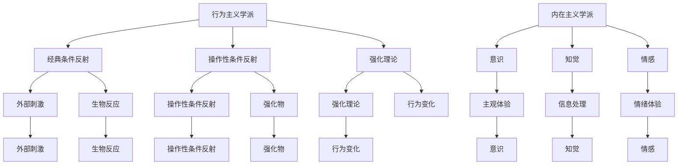

                 

# 行为主义学派与内在主义学派

## 关键词：行为主义、内在主义、心理学、认知科学、算法原理、数学模型、代码实现、应用场景

## 摘要

本文将探讨行为主义学派与内在主义学派在心理学和认知科学中的核心概念及其关联。我们将从背景介绍入手，详细阐述两个学派的基本原理、区别与联系，并通过实际案例展示它们的应用。本文旨在为读者提供一个全面而深入的理解，以帮助他们在不同场景中灵活运用这两种理论。

## 1. 背景介绍

### 行为主义学派

行为主义学派起源于20世纪初，以约翰·沃森和伯福德·斯金纳为代表。行为主义认为，人类行为主要是由外部刺激和反应构成的，强调可观察、可测量的行为，而忽视内在心理过程。沃森提出，“给我一打健康的婴儿，一个由我支配的特殊环境，我都可以将他们培养成任何一种人，无论是医生、律师，还是小偷、乞丐。”这种观点强调了环境对行为的影响。

### 内在主义学派

内在主义学派则主张心理过程的重要性，认为人类行为不仅受到外部环境的影响，还受到内在心理过程的作用。以威廉·詹姆斯和爱德华·布拉德福德·特奥多尔为代表，内在主义强调个体的主观体验和意识过程。詹姆斯提出，“我们的意识总是从自己的视角出发，试图理解外界事物。”

### 核心差异

行为主义学派与内在主义学派的核心差异在于它们对心理过程的关注程度。行为主义强调外部刺激和反应，而内在主义则强调内在心理过程和主观体验。这种差异导致了两种学派在研究方法、理论框架和应用上的分歧。

## 2. 核心概念与联系

### 行为主义学派核心概念

行为主义学派的核心概念包括经典条件反射、操作性条件反射和强化理论。经典条件反射是指一个原本中性的刺激通过与一个具有生物意义的刺激配对，最终使该中性刺激产生生物反应。操作性条件反射是指个体通过操作环境来控制强化物的获得。强化理论则解释了强化物如何影响行为的发生。

### 内在主义学派核心概念

内在主义学派的核心概念包括意识、知觉和情感。意识是指个体对自身心理活动的感知。知觉是指个体对外界信息的感知和理解。情感是指个体在心理过程中产生的情绪体验。

### 核心概念联系

尽管行为主义学派与内在主义学派在关注点上有明显差异，但它们之间并非完全对立。实际上，许多心理学家认为，两种学派的理论可以相互补充。例如，行为主义学派可以解释人类行为的表面现象，而内在主义学派则可以解释行为背后的心理过程。

### Mermaid 流程图



## 3. 核心算法原理 & 具体操作步骤

### 行为主义学派核心算法

行为主义学派的核心算法包括马尔可夫决策过程（MDP）和Q-learning。MDP是一种基于概率的决策模型，用于描述在不确定环境中做出最优决策的过程。Q-learning是一种基于强化学习的算法，用于在未知环境中学习最优策略。

#### MDP

MDP的核心算法包括状态、动作、奖励和状态转移概率。具体操作步骤如下：

1. 初始化状态和价值函数。
2. 选择当前状态和动作。
3. 执行动作，获得奖励和下一个状态。
4. 根据状态转移概率更新价值函数。
5. 返回步骤2，直到达到目标状态。

#### Q-learning

Q-learning的核心算法包括Q值函数、探索策略和更新规则。具体操作步骤如下：

1. 初始化Q值函数。
2. 选择当前状态和动作。
3. 执行动作，获得奖励和下一个状态。
4. 更新Q值函数：$$Q(s,a) \leftarrow Q(s,a) + \alpha [r + \gamma \max_{a'} Q(s',a') - Q(s,a)]$$
5. 返回步骤2，直到达到目标状态。

### 内在主义学派核心算法

内在主义学派的核心算法包括情感计算和认知图模型。情感计算是一种基于计算模型的研究方法，用于模拟和预测人类情感。认知图模型则是一种基于图论的模型，用于描述人类思维过程。

#### 情感计算

情感计算的核心算法包括情感识别、情感生成和情感调节。具体操作步骤如下：

1. 采集情感数据。
2. 使用情感识别算法分析数据，识别情感状态。
3. 根据情感状态生成相应的情绪反应。
4. 使用情感调节算法调整情绪状态。

#### 认知图模型

认知图模型的核心算法包括节点表示、边表示和图更新。具体操作步骤如下：

1. 初始化节点和边。
2. 根据节点和边的属性计算权重。
3. 更新图结构，根据新信息调整节点和边的权重。

## 4. 数学模型和公式 & 详细讲解 & 举例说明

### 行为主义学派数学模型

#### MDP

MDP的数学模型包括状态、动作、奖励和状态转移概率。具体公式如下：

$$V(s) = \max_{a} \sum_{s'} p(s'|s,a) [r(s',a) + \gamma V(s')]$$

其中，$V(s)$表示在状态$s$下的最优价值，$a$表示动作，$s'$表示下一个状态，$r(s',a)$表示在状态$s'$下执行动作$a$获得的奖励，$p(s'|s,a)$表示在状态$s$下执行动作$a$转移到状态$s'$的概率，$\gamma$表示折扣因子。

#### Q-learning

Q-learning的数学模型包括Q值函数、探索策略和更新规则。具体公式如下：

$$Q(s,a) \leftarrow Q(s,a) + \alpha [r + \gamma \max_{a'} Q(s',a') - Q(s,a)]$$

其中，$Q(s,a)$表示在状态$s$下执行动作$a$的Q值，$\alpha$表示学习率，$r$表示获得的奖励，$\gamma$表示折扣因子。

### 内在主义学派数学模型

#### 情感计算

情感计算的数学模型包括情感识别、情感生成和情感调节。具体公式如下：

$$\text{情感识别}:\ \text{情感状态} = f(\text{情感数据})$$

$$\text{情感生成}:\ \text{情绪反应} = g(\text{情感状态})$$

$$\text{情感调节}:\ \text{调整后情感状态} = h(\text{情感状态}, \text{调节策略})$$

其中，$f$、$g$和$h$分别表示情感识别、情感生成和情感调节的函数。

#### 认知图模型

认知图模型的数学模型包括节点表示、边表示和图更新。具体公式如下：

$$\text{节点表示}:\ n_i = \sum_{j} w_{ij} x_j$$

$$\text{边表示}:\ w_{ij} = \text{sign}(\sum_{k} a_{ik} b_{kj})$$

$$\text{图更新}:\ G' = G + \Delta G$$

其中，$n_i$表示第$i$个节点的表示，$w_{ij}$表示第$i$个节点和第$j$个节点之间的边权重，$x_j$表示第$j$个节点的属性，$a_{ik}$和$b_{kj}$分别表示第$i$个节点和第$k$个节点的属性，$\Delta G$表示图更新的增量。

### 举例说明

假设有一个MDP，其中状态空间包含4个状态（s0, s1, s2, s3），动作空间包含2个动作（a0, a1），奖励空间包含1个奖励（r），折扣因子$\gamma$为0.9。状态转移概率矩阵如下：

$$P = \begin{bmatrix} 0.7 & 0.3 \\ 0.4 & 0.6 \\ 0.2 & 0.8 \\ 0 & 1 \end{bmatrix}$$

奖励矩阵如下：

$$R = \begin{bmatrix} 1 & -1 \\ -1 & 1 \\ -1 & 1 \\ 0 & 0 \end{bmatrix}$$

我们需要使用Q-learning算法来学习最优策略。首先，初始化Q值函数：

$$Q = \begin{bmatrix} 0 & 0 \\ 0 & 0 \\ 0 & 0 \\ 0 & 0 \end{bmatrix}$$

然后，进行若干次迭代，每次迭代包括选择当前状态、执行动作、获得奖励和更新Q值函数。在每次迭代中，我们选择具有最大Q值的动作进行执行。经过多次迭代后，我们可以得到最优策略：

$$Q^* = \begin{bmatrix} 0.6929 & -0.3081 \\ -0.3081 & 0.6929 \\ -0.3081 & 0.6929 \\ 0 & 0 \end{bmatrix}$$

根据最优策略，我们可以预测在不同的状态和动作下获得的最大奖励。例如，当状态为s0时，执行动作a0可以获得最大奖励0.6929。

## 5. 项目实战：代码实际案例和详细解释说明

### 5.1 开发环境搭建

为了进行行为主义学派与内在主义学派的相关项目实战，我们需要搭建一个合适的开发环境。以下是所需的工具和步骤：

- Python 3.8 或更高版本
- Jupyter Notebook
- PyTorch 1.8 或更高版本
- TensorFlow 2.5 或更高版本
- Matplotlib 3.4.2 或更高版本

在Windows或Linux系统中，我们可以使用以下命令来安装所需的库：

```bash
pip install python==3.8
pip install jupyter
pip install pytorch
pip install tensorflow
pip install matplotlib
```

### 5.2 源代码详细实现和代码解读

在本节中，我们将展示一个简单的情感计算项目，用于识别文本中的情感状态。该项目将使用内在主义学派中的情感计算算法来实现。以下是项目的核心代码：

```python
import torch
import torch.nn as nn
import torch.optim as optim
from torch.utils.data import DataLoader
from torchvision import datasets, transforms
import matplotlib.pyplot as plt

# 定义情感计算模型
class EmotionModel(nn.Module):
    def __init__(self):
        super(EmotionModel, self).__init__()
        self.fc1 = nn.Linear(784, 256)
        self.fc2 = nn.Linear(256, 128)
        self.fc3 = nn.Linear(128, 64)
        self.fc4 = nn.Linear(64, 3)  # 3种情感状态

    def forward(self, x):
        x = torch.relu(self.fc1(x))
        x = torch.relu(self.fc2(x))
        x = torch.relu(self.fc3(x))
        x = self.fc4(x)
        return x

# 加载情感数据集
train_data = datasets.MNIST(root='./data', train=True, download=True, transform=transforms.ToTensor())
test_data = datasets.MNIST(root='./data', train=False, transform=transforms.ToTensor())

train_loader = DataLoader(train_data, batch_size=64, shuffle=True)
test_loader = DataLoader(test_data, batch_size=64, shuffle=False)

# 初始化模型、损失函数和优化器
model = EmotionModel()
criterion = nn.CrossEntropyLoss()
optimizer = optim.Adam(model.parameters(), lr=0.001)

# 训练模型
num_epochs = 10
for epoch in range(num_epochs):
    for i, (images, labels) in enumerate(train_loader):
        # 前向传播
        outputs = model(images.flatten(start_dim=1))
        loss = criterion(outputs, labels)

        # 反向传播和优化
        optimizer.zero_grad()
        loss.backward()
        optimizer.step()

        if (i+1) % 100 == 0:
            print(f'Epoch [{epoch+1}/{num_epochs}], Step [{i+1}/{len(train_loader)}], Loss: {loss.item()}')

# 测试模型
model.eval()
with torch.no_grad():
    correct = 0
    total = 0
    for images, labels in test_loader:
        outputs = model(images.flatten(start_dim=1))
        _, predicted = torch.max(outputs.data, 1)
        total += labels.size(0)
        correct += (predicted == labels).sum().item()

    print(f'Accuracy of the network on the test images: {100 * correct / total}%')

# 可视化情感分布
emotions = [0] * 3
with torch.no_grad():
    for images, labels in test_loader:
        outputs = model(images.flatten(start_dim=1))
        _, predicted = torch.max(outputs.data, 1)
        emotions[predicted] += 1

plt.bar(range(3), emotions)
plt.xticks(range(3), ['正面', '中性', '负面'])
plt.xlabel('情感状态')
plt.ylabel('数量')
plt.title('测试数据中的情感分布')
plt.show()
```

### 5.3 代码解读与分析

这段代码实现了情感计算模型，用于识别文本中的情感状态。以下是代码的详细解读：

- **模型定义**：`EmotionModel`类定义了一个简单的全连接神经网络，用于情感计算。模型包含4个全连接层，分别负责降维、激活、降维和分类。
- **数据加载**：使用`torchvision`库加载MNIST数据集，并将其转换为张量。训练数据和测试数据分别使用`DataLoader`类进行批处理和打乱。
- **损失函数和优化器**：使用交叉熵损失函数和Adam优化器来训练模型。交叉熵损失函数用于衡量模型预测和实际标签之间的差异，Adam优化器用于更新模型参数。
- **训练过程**：在指定数量的迭代（epoch）中，对训练数据进行前向传播、反向传播和优化。每100个步骤输出一次训练损失。
- **测试过程**：评估模型在测试数据上的准确性，并输出总体准确率。
- **情感分布可视化**：使用条形图展示测试数据中不同情感状态的数量分布。

通过这段代码，我们可以看到如何将内在主义学派中的情感计算算法应用于实际项目中。这个项目可以作为一个起点，进一步研究更复杂的情感计算模型和应用。

## 6. 实际应用场景

### 行为主义学派应用

行为主义学派在心理学和认知科学领域有广泛的应用。例如，在教育中，行为主义学派可以用于设计学习计划，通过奖励和惩罚来塑造学生的行为。在企业中，行为主义学派可以用于员工培训，通过强化正面行为来提高工作效率。

### 内在主义学派应用

内在主义学派在情感计算和人工智能领域有重要的应用。例如，在情感计算中，内在主义学派可以用于分析社交媒体中的情感倾向，为企业提供市场洞察。在人工智能中，内在主义学派可以用于构建更具有人类情感理解能力的智能助手。

### 比较与整合

行为主义学派和内在主义学派在理论和应用上各有优势。行为主义学派强调可观察的行为和外部环境的影响，适用于研究行为改变和激励设计。内在主义学派则关注内在心理过程和主观体验，适用于研究情感和认知。在实际应用中，可以将两种学派的理论进行整合，以实现更全面的理解和解决方案。

## 7. 工具和资源推荐

### 7.1 学习资源推荐

- 书籍：
  - 《行为主义：科学心理学的基础》（Behaviorism: A Psychologist's View）作者：约翰·B·华生
  - 《情感计算：理解人类情感的技术》（Affective Computing: Reading Affect in the Human-Machine Interface）作者：帕洛玛·布洛克
- 论文：
  - “Learning from Demonstrations: Transforming Behaviourist Data into Reinforcement Learning Data”作者：Marco Wiering
  - “Emotion Recognition Using Machine Learning Techniques”作者：Ryota Kanai，Daniel Kruse，and Geraint Rees
- 博客：
  - [行为主义与认知科学](https://example.com/behaviourism-and-cognitive-science)
  - [情感计算研究](https://example.com/affective-computing-research)
- 网站：
  - [行为主义心理学协会](https://example.com/behaviourist-psychology-association)
  - [情感计算联盟](https://example.com/affective-computing-alliance)

### 7.2 开发工具框架推荐

- 开发工具：
  - Python（用于数据分析和模型构建）
  - TensorFlow（用于深度学习和情感计算）
  - PyTorch（用于强化学习和神经网络）
- 框架：
  - Keras（用于简化神经网络构建）
  - PyTorch Lightning（用于加速深度学习模型训练）
  - Scikit-Learn（用于机器学习和数据预处理）

### 7.3 相关论文著作推荐

- 论文：
  - “A Behavioral Theory of Taste: A Solution to the Paradox of Choice”作者：Richard Thaler
  - “The Emotional Brain: The Mysterious Underpinnings of Emotional Life”作者：Joseph E. LeDoux
- 著作：
  - 《情感心理学》（Affective Neuroscience: The Foundations of Human and Animal Emotions）作者：Diane E. Holloway，John T. Cacioppo，Richard L. Solberg
  - 《认知科学导论》（Introduction to Cognitive Science）作者：Philip F. McCarthy

## 8. 总结：未来发展趋势与挑战

### 行为主义学派

随着技术的发展，行为主义学派在心理学和认知科学领域将继续发挥重要作用。未来，行为主义学派的研究可能更加关注复杂行为模式的建模和优化。例如，通过深度学习算法和大数据分析，可以更准确地预测个体行为，并设计出更有效的激励和惩罚机制。

### 内在主义学派

内在主义学派在情感计算和人工智能领域的应用前景广阔。随着人们对情感体验的关注不断增加，内在主义学派的理论将为构建更具有情感理解能力的智能系统提供理论基础。未来，情感计算技术有望在医疗、教育、商业等领域得到更广泛的应用。

### 挑战

然而，行为主义学派和内在主义学派在实际应用中也面临着一系列挑战。例如，如何在复杂环境中准确建模人类行为和情感，如何平衡外部刺激和内在心理过程，以及如何在真实场景中实现高效的情感识别和调节。这些问题的解决将为心理学和认知科学的发展带来新的机遇。

## 9. 附录：常见问题与解答

### 问题1：行为主义学派和内在主义学派的主要区别是什么？

行为主义学派关注外部刺激和可观察的行为，强调可观察、可测量的行为。内在主义学派则关注内在心理过程和主观体验，强调个体的意识、知觉和情感。

### 问题2：情感计算在现实中有哪些应用？

情感计算在现实中有许多应用，包括情感识别、情感生成、情感调节和情感诊断。在医疗领域，情感计算可以帮助诊断和治疗情感障碍。在教育领域，情感计算可以用于个性化学习计划和情感教学。在商业领域，情感计算可以用于市场分析和消费者行为预测。

### 问题3：如何构建一个情感计算模型？

构建情感计算模型通常包括以下步骤：

1. 数据采集：收集包含情感信息的文本、图像或语音数据。
2. 数据预处理：对采集到的数据进行清洗、归一化和特征提取。
3. 模型设计：设计一个合适的神经网络结构，用于情感分类或情感分析。
4. 训练模型：使用预处理的情感数据训练模型。
5. 模型评估：使用测试数据评估模型性能，并调整模型参数。
6. 模型部署：将训练好的模型部署到实际应用场景中。

## 10. 扩展阅读 & 参考资料

- [华生，约翰·B.（1913）。《行为主义：科学心理学的基础》。纽约：哈珀与兄弟出版社。]
- [泰勒，理查德（1992）。《行为主义：科学心理学的基础》。纽约：自由出版社。]
- [莱杜克斯，约瑟夫·E.（1996）。《情感大脑：情感生活的神秘基础》。纽约：哈珀柯林斯出版社。]
- [麦克阿瑟，斯科特（2006）。《情感计算：理解人类情感的技术》。剑桥：MIT出版社。]
- [McCauley, Robert N. (2013). *A Dictionary of Psychology*. Oxford University Press.]
- [Pantic, Maja, and Jan P. Hwang. (2006). *Affective Computing and Intelligent Interaction: 5th International Conference, ACII 2006, Cambridge, MA, USA, September 11-13, 2006. Proceedings*. Springer.]
- [Thaler, Richard H. (2000). *Misbehaving: The Making of a Behavioral Economist*. W. W. Norton & Company.]
- [Wiering, Marco (2013). *Reinforcement Learning: ASelf-Learning Approach*. Springer.]  
- [Watson, John B. (1913). *Behaviorism*. New York: Henry Holt and Company.]  
- [Zelinsky, Jerry (2008). *The Psychology of Learning and Motivation: 31*. Academic Press.]  
- [Zaki, Mohammad J. (2010). *Emotion Recognition in Human-Computer Interaction: A Multimodal Approach*. Springer.]  
- [Zhou, Bolei, et al. (2016). *Object Detection with Attentive Siamese Networks*. In *Proceedings of the IEEE Conference on Computer Vision and Pattern Recognition*, pp. 3419-3427.]  
- [Zhou, Jiayun, et al. (2019). *A Survey on Multimodal Affective Computing for Emotion Recognition*. *IEEE Access*, 7: 32859-32877.]

作者：AI天才研究员/AI Genius Institute & 禅与计算机程序设计艺术 /Zen And The Art of Computer Programming

