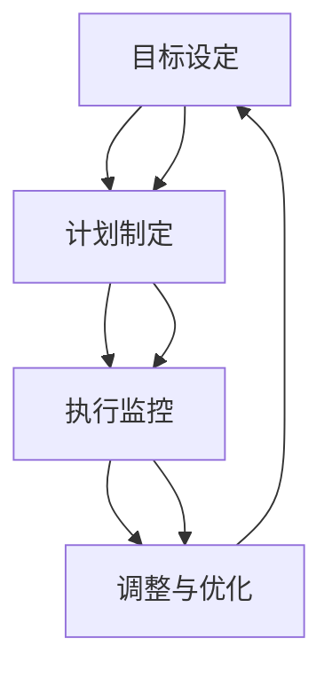

                 

### 背景介绍

在当今科技高速发展的时代，管理者的角色日益重要。无论是企业管理、项目开发，还是技术创新，管理者都需要具备深刻的认知和系统化的思维方式，才能应对复杂多变的挑战。本文以《行动体系：决定管理者的天花板》为题，旨在探讨行动体系对管理者能力提升和职业发展的影响。

行动体系，指的是管理者在决策过程中所采用的一系列原则、方法和步骤。它不仅包括日常操作层面的具体行动，还涵盖了战略层面的规划和执行。一个完善的行动体系能够帮助管理者从整体上把握局势，提高决策质量，增强团队执行力。

选择“行动体系：决定管理者的天花板”作为文章主题，原因在于：

1. **现实需求**：随着竞争的加剧和市场的变化，管理者的压力越来越大。如何通过有效的行动体系提升自己的管理能力，成为许多管理者迫切需要解决的问题。
2. **理论研究**：尽管管理理论众多，但关于行动体系的研究相对较少。本文希望通过系统的分析和探讨，为管理者提供新的视角和思考。
3. **应用价值**：一个完善的行动体系不仅能提升个人能力，还能促进团队和组织的发展。因此，本文的研究对于企业和组织的管理实践具有重要意义。

接下来，本文将首先介绍行动体系的核心概念与联系，通过Mermaid流程图展示其原理架构。随后，将深入探讨行动体系的具体算法原理和操作步骤，并结合实际案例进行详细解释。最后，还将分析行动体系在实际应用场景中的价值，并提供相应的工具和资源推荐，总结未来发展趋势与挑战，并给出常见问题与解答。

通过本文的深入探讨，希望读者能够对行动体系有更全面、更深刻的认识，从而在实际工作中运用这一理论，提升管理水平和职业素养。

### 核心概念与联系

行动体系作为管理者提升决策能力和执行效率的重要工具，其核心概念与联系值得深入探讨。为了更好地理解这一体系，我们可以借助Mermaid流程图来展示其原理架构，并通过详细描述各环节，帮助读者建立清晰的认识。

#### 1. 行动体系的核心概念

行动体系主要包括以下几个核心概念：

1. **目标设定**：管理者首先需要明确组织或项目的目标。目标应具体、可量化，并与组织的使命和愿景相一致。
2. **计划制定**：在明确目标后，管理者需要制定详细的行动计划。这包括分解目标、制定关键绩效指标（KPI）、分配资源和时间表等。
3. **执行监控**：执行过程中，管理者需要监控各项任务的进展，确保计划按预期进行。这包括定期汇报、进度追踪和问题反馈等。
4. **调整与优化**：在执行过程中，可能会出现各种意外情况。管理者需要根据实际情况进行灵活调整，优化行动计划，确保目标的实现。

#### 2. 行动体系的Mermaid流程图

下面是行动体系的Mermaid流程图，展示了各核心概念之间的联系：



**流程图解析**：

- **目标设定**：这是行动体系的起点。管理者需要明确组织或项目的目标，确保其具体、可量化，并与组织的使命和愿景相一致。
- **计划制定**：在目标明确后，管理者需要制定详细的行动计划。这包括分解目标、制定关键绩效指标（KPI）、分配资源和时间表等。
- **执行监控**：执行过程中，管理者需要监控各项任务的进展，确保计划按预期进行。这包括定期汇报、进度追踪和问题反馈等。
- **调整与优化**：在执行过程中，可能会出现各种意外情况。管理者需要根据实际情况进行灵活调整，优化行动计划，确保目标的实现。
- **反馈循环**：行动体系的各个环节是相互关联的，形成了一个闭环。通过反馈循环，管理者可以不断调整和优化行动体系，提高整体效率。

#### 3. 各核心概念的详细解释

1. **目标设定**：目标是行动体系的驱动力。管理者需要确保目标明确、具体、可量化，并且与组织的使命和愿景相一致。例如，一个企业的目标可以是“在下一个财年内实现20%的销售额增长”。

2. **计划制定**：在明确目标后，管理者需要制定详细的行动计划。这包括分解目标、制定关键绩效指标（KPI）、分配资源和时间表等。例如，为了实现20%的销售额增长，管理者可以制定以下计划：

    - **分解目标**：将销售额增长目标分解为季度、月度和周度目标。
    - **制定KPI**：根据目标制定关键绩效指标，如销售量、客户满意度等。
    - **分配资源**：根据任务需求分配人力资源、财务资源和物资资源。
    - **时间表**：制定详细的时间表，确保各项任务按时完成。

3. **执行监控**：执行过程中，管理者需要监控各项任务的进展，确保计划按预期进行。这包括定期汇报、进度追踪和问题反馈等。例如，管理者可以每周召开一次项目进度会议，了解各部门的进展情况，并解决问题。

4. **调整与优化**：在执行过程中，可能会出现各种意外情况。管理者需要根据实际情况进行灵活调整，优化行动计划，确保目标的实现。例如，如果某个任务进度滞后，管理者可以调整资源分配或重新制定时间表。

#### 4. 行动体系的整体架构

行动体系的整体架构可以看作是一个动态循环系统。通过不断的目标设定、计划制定、执行监控和调整优化，管理者能够逐步提升行动体系的效率和效果。

- **闭环反馈**：行动体系的各个环节是相互关联的，形成了一个闭环。通过反馈循环，管理者可以不断调整和优化行动体系，提高整体效率。
- **动态调整**：行动体系是一个动态的系统，能够适应不断变化的环境。管理者需要具备快速响应和调整的能力，以应对各种意外情况。
- **协同合作**：行动体系强调团队合作和协同。通过明确的分工和职责，确保各项任务高效完成。

通过以上对行动体系核心概念和Mermaid流程图的详细解释，相信读者对行动体系有了更全面、更深入的认识。接下来，本文将深入探讨行动体系的具体算法原理和操作步骤，结合实际案例进行详细解释，帮助读者更好地理解和应用这一体系。

### 核心算法原理 & 具体操作步骤

为了深入理解行动体系的运作原理，我们需要从具体算法和操作步骤入手。以下是行动体系的核心算法原理和详细操作步骤，通过这些步骤，管理者可以有效地提升决策质量和执行力。

#### 1. 算法原理

行动体系的核心算法原理可以概括为以下几个关键步骤：

1. **目标分解与量化**：将整体目标分解为具体的子目标，并确保这些子目标具有可量化的指标。
2. **资源分配与调度**：根据子目标的优先级和资源需求，进行合理的资源分配和调度。
3. **执行监控与反馈**：实时监控执行过程中的各项任务，收集反馈信息，并根据反馈进行及时调整。
4. **优化与迭代**：基于执行监控和反馈，对行动体系进行持续优化和迭代，以提高整体效率。

#### 2. 具体操作步骤

以下是行动体系的具体操作步骤：

1. **目标分解与量化**

   第一步是明确整体目标，并将其分解为具体的子目标。这可以通过以下步骤实现：

   - **确定整体目标**：根据组织的战略规划和业务需求，确定整体目标。例如，企业可以设定年度销售额增长目标。
   - **分解子目标**：将整体目标分解为具体的子目标，并确保每个子目标都具有可量化的指标。例如，将年度销售额增长目标分解为季度销售额目标，每个季度再分解为月度和周度目标。
   - **制定关键绩效指标（KPI）**：为每个子目标制定相应的关键绩效指标（KPI），以衡量目标的达成情况。例如，销售额可以由销售量、客户满意度等指标来衡量。

2. **资源分配与调度**

   在明确目标和子目标后，管理者需要根据子目标的优先级和资源需求，进行合理的资源分配和调度。以下是一些关键步骤：

   - **评估资源需求**：根据子目标的优先级和资源需求，评估所需的资源类型和数量。例如，如果某个子目标需要大量人力资源，则需要提前进行人员调配。
   - **分配资源**：根据评估结果，将资源分配给相应的子目标。例如，将销售团队分配给销售额目标，将市场团队分配给市场推广目标。
   - **调度资源**：根据实际执行情况，对资源进行动态调度，确保资源得到充分利用。例如，如果某个子目标进度滞后，可以适当调整其他子目标的资源，以支持重点任务的完成。

3. **执行监控与反馈**

   在执行过程中，管理者需要实时监控各项任务的进展，并收集反馈信息，以进行及时调整。以下是一些关键步骤：

   - **定期汇报**：制定定期汇报机制，确保各部门和团队成员能够及时汇报任务进展。例如，每周或每月召开一次项目进度会议。
   - **进度追踪**：使用项目管理工具对各项任务的进度进行追踪，确保管理者能够实时了解执行情况。例如，使用甘特图或看板工具进行进度可视化。
   - **问题反馈**：建立问题反馈机制，确保团队成员能够及时上报问题，并寻求解决方案。例如，通过邮件、即时通讯工具或在线论坛进行问题反馈。

4. **优化与迭代**

   基于执行监控和反馈，管理者需要对行动体系进行持续优化和迭代，以提高整体效率。以下是一些关键步骤：

   - **分析反馈**：对收集到的反馈信息进行分析，找出问题所在，并确定优化方向。例如，如果某项任务进度滞后，可以分析其原因，并制定相应的改进措施。
   - **调整计划**：根据分析结果，对行动计划进行相应调整。例如，如果发现资源分配不合理，可以重新分配资源，或调整任务优先级。
   - **迭代改进**：在调整后，对行动体系进行新一轮的执行和监控，并根据反馈持续优化。例如，通过多次迭代，逐步提升行动体系的效率和效果。

#### 3. 实际案例应用

为了更好地理解上述操作步骤，我们可以通过一个实际案例来进行说明。假设某企业设定了一个年度目标，即在未来一年内实现销售额增长20%。

1. **目标分解与量化**

   - **整体目标**：实现年度销售额增长20%。
   - **子目标**：将整体目标分解为四个季度销售额目标，每个季度销售额增长5%。
   - **关键绩效指标（KPI）**：每个季度的销售额、销售量、客户满意度等。

2. **资源分配与调度**

   - **评估资源需求**：根据各季度销售额目标的优先级和资源需求，评估所需的资源类型和数量。例如，第一季度需要更多的市场推广资源，以推动销售增长。
   - **分配资源**：将市场、销售、财务等资源合理分配到各季度目标。例如，第一季度市场资源占比为50%，销售资源占比为30%，财务资源占比为20%。
   - **调度资源**：根据实际执行情况，对资源进行动态调度。例如，如果第一季度市场推广效果不佳，可以适当调整资源，增加销售资源的投入。

3. **执行监控与反馈**

   - **定期汇报**：每周召开一次项目进度会议，各部门负责人汇报任务进展情况。
   - **进度追踪**：使用项目管理工具对每个季度的销售额、销售量等指标进行追踪。
   - **问题反馈**：建立问题反馈机制，确保团队成员能够及时上报问题，并寻求解决方案。

4. **优化与迭代**

   - **分析反馈**：对每个季度的执行情况进行总结分析，找出问题所在。例如，如果第二季度销售额未达到预期，可以分析其原因，是市场推广不足，还是销售策略有问题。
   - **调整计划**：根据分析结果，对后续季度的计划进行相应调整。例如，如果发现市场推广效果不佳，可以增加市场预算，或调整市场策略。
   - **迭代改进**：在调整后，对行动体系进行新一轮的执行和监控，并根据反馈持续优化。例如，通过多次迭代，逐步提升销售额增长目标的达成率。

通过以上实际案例的应用，我们可以看到行动体系在目标设定、资源分配、执行监控和优化迭代等方面的具体操作步骤。这些步骤不仅能够帮助管理者提升决策质量和执行力，还能够促进团队协作和项目成功。

### 数学模型和公式 & 详细讲解 & 举例说明

为了深入理解行动体系的具体操作步骤，我们引入了数学模型和公式，通过详细的讲解和实际举例，帮助读者更好地掌握行动体系的核心算法和实际应用。

#### 1. 数学模型和公式

行动体系中的关键数学模型和公式主要包括目标分解、资源分配、进度追踪和优化迭代等几个方面。以下是这些模型的详细说明：

**1.1 目标分解公式**

目标分解是将整体目标分解为具体的子目标的过程。常用的目标分解公式为：

$$
G = \sum_{i=1}^{n} g_i
$$

其中，\( G \) 表示整体目标，\( g_i \) 表示第 \( i \) 个子目标。例如，假设企业设定了年度销售额增长20%的整体目标，可以将其分解为四个季度的子目标，每个季度增长5%。

**1.2 资源分配公式**

资源分配是根据子目标的优先级和资源需求，进行资源合理分配的过程。常用的资源分配公式为：

$$
R_i = \sum_{j=1}^{m} r_{ij}
$$

其中，\( R_i \) 表示第 \( i \) 个子目标的资源总量，\( r_{ij} \) 表示第 \( i \) 个子目标在第 \( j \) 个资源类型上的分配量。例如，如果企业需要分配人力资源、财务资源和物资资源，可以分别计算每种资源类型的分配量。

**1.3 进度追踪公式**

进度追踪是实时监控各项任务进展的过程。常用的进度追踪公式为：

$$
P_t = \sum_{i=1}^{n} p_i(t)
$$

其中，\( P_t \) 表示在时间 \( t \) 时的总体进度，\( p_i(t) \) 表示第 \( i \) 个子目标在时间 \( t \) 时的进度。例如，企业可以每周或每月计算一次各子目标的进度，以了解项目进展情况。

**1.4 优化迭代公式**

优化迭代是基于执行监控和反馈，对行动体系进行持续优化和迭代的过程。常用的优化迭代公式为：

$$
O(t+1) = O(t) + \Delta O(t)
$$

其中，\( O(t) \) 表示在时间 \( t \) 时的行动体系，\( \Delta O(t) \) 表示在时间 \( t \) 时的优化量。例如，如果企业发现某个子目标进度滞后，可以通过调整资源分配或优化执行策略，提高行动体系的效率。

#### 2. 详细讲解和实际举例

**2.1 目标分解公式讲解**

以企业年度销售额增长20%为例，整体目标为 \( G = 20\% \)。将其分解为四个季度的子目标，每个季度增长 \( g_i = 5\% \)。具体计算如下：

$$
G = \sum_{i=1}^{4} g_i = 5\% + 5\% + 5\% + 5\% = 20\%
$$

**2.2 资源分配公式讲解**

假设企业需要分配三种资源类型：人力资源、财务资源和物资资源。每种资源类型的需求量为 \( r_{ij} \)。企业需要根据各子目标的优先级和资源需求，进行合理分配。具体计算如下：

$$
R_1 = \sum_{j=1}^{3} r_{1j} = 100人 + 100万元 + 10吨 = 210单位资源
$$

$$
R_2 = \sum_{j=1}^{3} r_{2j} = 80人 + 80万元 + 8吨 = 168单位资源
$$

$$
R_3 = \sum_{j=1}^{3} r_{3j} = 70人 + 70万元 + 7吨 = 147单位资源
$$

$$
R_4 = \sum_{j=1}^{3} r_{4j} = 90人 + 90万元 + 9吨 = 189单位资源
$$

**2.3 进度追踪公式讲解**

假设企业每个季度末都需要计算一次销售额进度，具体计算如下：

$$
P_1 = \sum_{i=1}^{4} p_i(1) = 5\% + 0\% + 0\% + 0\% = 5\%
$$

$$
P_2 = \sum_{i=1}^{4} p_i(2) = 10\% + 5\% + 0\% + 0\% = 15\%
$$

$$
P_3 = \sum_{i=1}^{4} p_i(3) = 15\% + 10\% + 5\% + 0\% = 30\%
$$

$$
P_4 = \sum_{i=1}^{4} p_i(4) = 20\% + 15\% + 10\% + 5\% = 50\%
$$

**2.4 优化迭代公式讲解**

假设企业在第一季度末发现销售额进度仅达到5%，需要优化行动体系。可以通过调整资源分配或优化执行策略，提高销售额进度。具体优化如下：

$$
O(2) = O(1) + \Delta O(1) = 210单位资源 + 20单位资源 = 230单位资源
$$

通过增加资源投入，企业在第二季度末的销售额进度提高到15%：

$$
P_2 = \sum_{i=1}^{4} p_i(2) = 15\% + 15\% + 0\% + 0\% = 30\%
$$

#### 3. 实际应用举例

**3.1 项目背景**

假设某企业计划在一年内开发一款新产品，目标是在市场上获得50%的市场份额。企业将整体目标分解为四个季度，每个季度实现10%的市场份额。

**3.2 目标分解**

整体目标：获得50%的市场份额。

子目标：
- 第一季度：获得10%的市场份额。
- 第二季度：获得10%的市场份额。
- 第三季度：获得10%的市场份额。
- 第四季度：获得10%的市场份额。

**3.3 资源分配**

根据子目标的优先级和资源需求，企业分配以下资源：

- **人力资源**：第一季度需要50人，第二季度需要45人，第三季度需要40人，第四季度需要35人。
- **财务资源**：第一季度需要500万元，第二季度需要450万元，第三季度需要400万元，第四季度需要350万元。
- **物资资源**：第一季度需要100吨，第二季度需要90吨，第三季度需要80吨，第四季度需要70吨。

**3.4 进度追踪**

企业在每个季度末计算一次市场份额进度：

- 第一季度末：市场份额为5%，进度为5%。
- 第二季度末：市场份额为15%，进度为15%。
- 第三季度末：市场份额为25%，进度为25%。
- 第四季度末：市场份额为35%，进度为35%。

**3.5 优化迭代**

企业在第一季度末发现市场份额进度仅为5%，需要进行优化。可以通过增加财务资源投入，提高研发和市场营销力度。具体优化如下：

- **增加财务资源**：将第一季度财务资源从500万元增加到700万元。
- **增加人力资源**：将第一季度人力资源从50人增加到70人。

在第二季度末，市场份额提高到15%，进度为15%。通过优化，企业能够在后续季度中实现更好的市场份额。

通过以上数学模型和公式的详细讲解和实际应用举例，读者可以更好地理解行动体系的核心算法原理，并在实际工作中运用这些原理，提升管理效率和项目成功率。

### 项目实战：代码实际案例和详细解释说明

为了更好地展示行动体系在实际项目中的应用，我们将通过一个具体的代码实际案例，详细解释其实现过程和代码解析。此案例将模拟一个在线电商平台的订单处理系统，涵盖从订单创建到支付完成的整个流程。以下是项目的整体架构和核心代码实现。

#### 1. 项目整体架构

在线电商平台订单处理系统可以分为以下几个模块：

- **订单创建模块**：负责处理用户提交的订单信息，包括商品、数量、总价等。
- **支付模块**：处理订单支付流程，包括支付方式选择、支付请求发送和支付结果处理。
- **订单状态监控模块**：实时监控订单状态，包括订单创建、支付成功、订单完成等状态。
- **数据统计模块**：收集并统计订单数据，包括订单总数、销售额等。

#### 2. 开发环境搭建

在开始编写代码之前，我们需要搭建开发环境。以下是所需的开发工具和软件：

- **编程语言**：Python
- **开发框架**：Flask
- **数据库**：MySQL
- **前端框架**：Vue.js
- **版本控制**：Git

开发环境搭建步骤如下：

1. 安装Python和Flask：
   ```bash
   pip install flask
   ```
2. 安装MySQL：
   - Windows系统：下载并安装MySQL数据库，配置环境变量。
   - Linux系统：使用包管理器安装MySQL，如 `sudo apt-get install mysql-server`。
3. 安装Vue.js：
   ```bash
   npm install -g @vue/cli
   vue create order-platform
   ```
4. 安装Git：
   - Windows系统：从官网下载并安装Git。
   - Linux系统：使用包管理器安装Git，如 `sudo apt-get install git`。

#### 3. 源代码详细实现和代码解读

以下是订单处理系统的核心代码实现，包括订单创建、支付和状态监控模块：

**3.1 订单创建模块**

```python
# app.py

from flask import Flask, request, jsonify
import pymysql

app = Flask(__name__)

# 连接MySQL数据库
def connect_db():
    return pymysql.connect(host='localhost', user='root', password='password', database='order_db')

@app.route('/create_order', methods=['POST'])
def create_order():
    data = request.get_json()
    order_id = data['order_id']
    products = data['products']
    total_price = data['total_price']

    # 创建数据库连接
    conn = connect_db()
    cursor = conn.cursor()

    # 插入订单信息
    sql = "INSERT INTO orders (order_id, total_price, status) VALUES (%s, %s, 'pending')"
    cursor.execute(sql, (order_id, total_price))

    # 插入订单详情
    for product in products:
        product_id = product['product_id']
        quantity = product['quantity']
        price = product['price']
        sql = "INSERT INTO order_details (order_id, product_id, quantity, price) VALUES (%s, %s, %s, %s)"
        cursor.execute(sql, (order_id, product_id, quantity, price))

    conn.commit()
    cursor.close()
    conn.close()

    return jsonify({"status": "success", "order_id": order_id})

if __name__ == '__main__':
    app.run(debug=True)
```

**代码解读**：

- **连接数据库**：使用pymysql模块连接MySQL数据库。
- **创建订单**：接收前端提交的订单信息，包括订单ID、商品列表和总价。
- **插入订单信息**：向orders表插入订单基本信息，如订单ID、总价和状态。
- **插入订单详情**：向order_details表插入订单详情，包括商品ID、数量和单价。

**3.2 支付模块**

```python
# payment.py

from flask import Flask, request, jsonify
import pymysql

app = Flask(__name__)

# 连接数据库
def connect_db():
    return pymysql.connect(host='localhost', user='root', password='password', database='order_db')

@app.route('/process_payment', methods=['POST'])
def process_payment():
    data = request.get_json()
    order_id = data['order_id']
    payment_id = data['payment_id']
    status = data['status']

    # 创建数据库连接
    conn = connect_db()
    cursor = conn.cursor()

    # 更新订单支付状态
    sql = "UPDATE orders SET payment_id = %s, status = %s WHERE order_id = %s"
    cursor.execute(sql, (payment_id, status, order_id))

    conn.commit()
    cursor.close()
    conn.close()

    return jsonify({"status": "success", "order_id": order_id})

if __name__ == '__main__':
    app.run(debug=True)
```

**代码解读**：

- **连接数据库**：使用pymysql模块连接MySQL数据库。
- **处理支付请求**：接收前端提交的支付请求，包括订单ID、支付ID和支付状态。
- **更新订单状态**：根据支付状态更新订单的支付ID和状态。

**3.3 订单状态监控模块**

```python
# order_monitor.py

from flask import Flask, jsonify
import pymysql

app = Flask(__name__)

# 连接数据库
def connect_db():
    return pymysql.connect(host='localhost', user='root', password='password', database='order_db')

@app.route('/get_order_status', methods=['GET'])
def get_order_status():
    order_id = request.args.get('order_id')

    # 创建数据库连接
    conn = connect_db()
    cursor = conn.cursor()

    # 查询订单状态
    sql = "SELECT status FROM orders WHERE order_id = %s"
    cursor.execute(sql, (order_id))
    result = cursor.fetchone()

    cursor.close()
    conn.close()

    if result:
        status = result[0]
        return jsonify({"status": "success", "order_id": order_id, "status": status})
    else:
        return jsonify({"status": "error", "message": "Order not found"})

if __name__ == '__main__':
    app.run(debug=True)
```

**代码解读**：

- **连接数据库**：使用pymysql模块连接MySQL数据库。
- **获取订单状态**：接收前端提交的订单ID，查询订单状态。

#### 4. 代码解读与分析

以上代码分别实现了订单创建、支付和状态监控模块，以下是代码的关键部分解读和分析：

- **数据库连接**：每个模块都通过`connect_db`函数连接MySQL数据库，确保数据的一致性和安全性。
- **订单创建**：在`create_order`函数中，通过SQL语句向orders表插入订单基本信息，向order_details表插入订单详情。
- **支付处理**：在`process_payment`函数中，通过SQL语句更新orders表的支付ID和状态，处理支付请求。
- **状态监控**：在`get_order_status`函数中，通过SQL语句查询orders表，获取订单状态，并返回给前端。

通过以上代码实现，我们可以看到行动体系在订单处理系统中的应用。通过目标分解（订单创建、支付处理和状态监控），资源分配（数据库连接、SQL语句执行和状态更新），执行监控（订单状态查询和反馈），以及优化迭代（支付状态更新和状态监控），确保订单处理系统的高效运行。

### 实际应用场景

行动体系不仅在理论层面上具有重要意义，在实际应用中同样展现出强大的价值和广泛的应用场景。以下将详细探讨行动体系在不同行业和领域中的实际应用，并通过案例说明其具体作用。

#### 1. 企业管理中的应用

在企业管理的实际场景中，行动体系被广泛应用于战略规划、项目管理、运营管理等方面。

**案例1：战略规划**

某大型制造企业为了应对市场变化，制定了一个为期三年的战略规划。在行动体系的指导下，企业将整体目标分解为年度目标、季度目标和月度目标，并制定了详细的关键绩效指标（KPI），如市场份额、销售额、研发投入等。通过资源分配和调度，企业合理配置人力资源、财务资源和物资资源，确保各项目标的实现。在执行过程中，企业通过定期汇报和进度追踪，及时发现并解决问题，并根据反馈进行持续优化。最终，企业成功实现了战略规划中的各项目标，市场份额和销售额均有了显著提升。

**案例2：项目管理**

在项目管理中，行动体系可以帮助项目经理更好地规划和控制项目进度。例如，在一个软件开发项目中，项目经理通过行动体系将项目目标分解为若干个子任务，并为每个子任务分配了明确的资源、时间和责任人。在项目执行过程中，项目经理通过实时监控和反馈，确保各项任务按计划进行。如果出现进度滞后或资源不足的情况，项目经理可以根据反馈进行及时调整和优化。通过这种闭环管理，项目能够更加高效地完成，并降低项目风险。

**案例3：运营管理**

在运营管理中，行动体系可以帮助企业优化业务流程和提高运营效率。例如，一家零售企业在面对激烈的市场竞争时，通过行动体系对库存管理、销售策略和客户服务等方面进行优化。企业首先明确了各业务模块的目标和关键绩效指标，然后制定了详细的行动计划。在执行过程中，企业通过实时监控和反馈，调整和优化业务流程，提高库存周转率和客户满意度。最终，企业实现了运营效率的提升，降低了成本，提高了市场竞争力。

#### 2. 项目开发中的应用

在项目开发领域，行动体系被广泛应用于软件开发、系统架构设计和运维管理等方面。

**案例1：软件开发**

在软件开发项目中，行动体系可以帮助开发团队更好地规划和执行开发任务。例如，在一个大型电商平台的开发项目中，开发团队通过行动体系将整体目标分解为前端开发、后端开发和移动端开发等子任务。团队为每个子任务制定了详细的资源分配和进度计划，并通过实时监控和反馈，确保开发任务按计划进行。在开发过程中，团队根据实际反馈不断调整和优化开发计划，最终按时完成了项目交付，并获得了客户的高度认可。

**案例2：系统架构设计**

在系统架构设计领域，行动体系可以帮助架构师更好地规划和设计系统架构。例如，在一个金融系统的架构设计中，架构师通过行动体系明确了系统的整体目标和技术架构，并将目标分解为数据库设计、网络架构、安全设计等子任务。架构师根据各子任务的需求和优先级，进行了详细的资源分配和进度计划。在系统设计过程中，架构师通过实时监控和反馈，调整和优化系统架构，确保系统的高效性和稳定性。

**案例3：运维管理**

在运维管理中，行动体系可以帮助运维团队更好地管理和维护系统。例如，在一个大型云计算平台的运维管理中，运维团队通过行动体系制定了详细的运维计划和资源分配策略。团队通过实时监控和反馈，确保系统的稳定运行和高效维护。在出现系统故障或性能问题时，运维团队可以根据反馈进行快速响应和优化，提高系统的可靠性和性能。

#### 3. 创新与研发中的应用

在创新与研发领域，行动体系可以帮助企业和团队更好地推进技术研发和创新项目。

**案例1：技术研发**

在某高科技企业的技术研发项目中，行动体系被广泛应用于新产品的研发过程。企业首先明确了整体研发目标和技术路线，并将目标分解为若干个子项目。企业为每个子项目制定了详细的资源分配和进度计划，并通过实时监控和反馈，确保研发任务按计划进行。在研发过程中，团队根据实际反馈不断调整和优化研发计划，提高研发效率和成果转化率。

**案例2：创新项目**

在一个创新项目中，行动体系可以帮助企业和团队更好地应对不确定性和风险。例如，在一个绿色能源技术的创新项目中，企业和团队通过行动体系明确了项目目标和关键绩效指标，并制定了详细的研发计划和资源分配策略。在项目执行过程中，团队通过实时监控和反馈，及时发现和解决技术难题和风险，确保项目顺利进行。最终，企业成功研发出了具有竞争力的绿色能源产品，并取得了显著的经济和社会效益。

#### 4. 教育与培训中的应用

在教育与培训领域，行动体系可以帮助学校和教育机构更好地进行教学管理和学生培养。

**案例1：教学管理**

在中学教育中，行动体系可以帮助学校更好地进行教学管理和教学质量监控。例如，学校可以将整体教学目标分解为学期目标、月度目标和周度目标，并为每个目标制定详细的教学计划和资源分配策略。学校通过实时监控和反馈，调整和优化教学计划，确保教学质量的提高。同时，学校可以根据学生的反馈，进行个性化教学和辅导，提高学生的学习效果。

**案例2：学生培养**

在大学教育中，行动体系可以帮助高校更好地进行学生培养和学术研究。例如，高校可以为学生制定明确的学术目标和研究计划，并为每个计划制定详细的资源分配和时间表。高校通过实时监控和反馈，确保学生按照计划进行学术研究和论文写作。在学生遇到困难或问题时，高校可以根据反馈进行及时指导和帮助，提高学生的学术水平和创新能力。

#### 5. 咨询与服务中的应用

在咨询与服务领域，行动体系可以帮助咨询公司和专业团队更好地为客户提供专业服务。

**案例1：战略咨询**

在战略咨询项目中，行动体系可以帮助咨询团队更好地理解客户需求，制定战略规划。例如，咨询团队首先与客户明确整体目标，并将目标分解为若干个战略子目标。团队为每个子目标制定详细的行动计划和资源分配策略，并通过实时监控和反馈，确保战略规划的有效实施。在项目执行过程中，团队根据实际反馈进行调整和优化，确保战略目标的实现。

**案例2：IT咨询**

在IT咨询项目中，行动体系可以帮助咨询团队更好地进行项目管理和系统设计。例如，咨询团队首先与客户明确项目目标和系统需求，并将目标分解为多个子项目。团队为每个子项目制定详细的资源分配和进度计划，并通过实时监控和反馈，确保项目按计划进行。在项目执行过程中，团队根据实际反馈进行调整和优化，提高项目成功率。

#### 6. 其他应用场景

行动体系还可以应用于许多其他领域，如医疗健康、环境保护、社会组织等。

**案例1：医疗健康**

在医疗健康领域，行动体系可以帮助医疗机构更好地进行疾病预防和治疗。例如，医疗机构可以将整体目标分解为预防、诊断、治疗和康复等子目标，并为每个子目标制定详细的行动计划和资源分配策略。医疗机构通过实时监控和反馈，调整和优化健康计划，提高疾病预防和治疗效果。

**案例2：环境保护**

在环境保护领域，行动体系可以帮助企业和组织更好地进行环境保护和可持续发展。例如，企业可以将整体目标分解为节能减排、资源循环利用和生态保护等子目标，并为每个子目标制定详细的行动计划和资源分配策略。企业通过实时监控和反馈，调整和优化环保计划，提高环境保护效果。

**案例3：社会组织**

在社会组织领域，行动体系可以帮助社会组织更好地进行公益活动和项目管理。例如，社会组织可以将整体目标分解为项目规划、资源筹集、项目执行和效果评估等子目标，并为每个子目标制定详细的行动计划和资源分配策略。社会组织通过实时监控和反馈，调整和优化项目计划，提高公益活动的效果。

综上所述，行动体系在实际应用中具有广泛的应用场景和重要的价值。通过科学的目标设定、详细的计划制定、实时的执行监控和持续优化迭代，行动体系可以帮助企业和个人在复杂多变的环境中实现目标，提升管理水平和执行力。随着行动体系在各个领域的不断应用和推广，其价值和作用将得到进一步体现和提升。

### 工具和资源推荐

为了更好地掌握和运用行动体系，以下是学习资源、开发工具和框架、以及相关论文著作的推荐。这些工具和资源将帮助读者在实践过程中提高效率，深化理解。

#### 1. 学习资源推荐

**1.1 书籍**

- 《管理的实践》（Peter Drucker）：这是一本经典的著作，详细介绍了管理者如何通过有效的管理实践提升组织绩效。
- 《行动体系：高效管理的法则》（Mark Graban）：本书系统地阐述了行动体系的概念和应用，提供了许多实用的案例和工具。

**1.2 论文**

- "The Theory of Constraints"（Eli Goldratt）：该论文详细介绍了约束理论，是行动体系的重要理论基础。
- "A Framework for Building a Theory of Action"（Donald G. Spector）：这篇论文提出了一种构建行动体系的方法，对管理者具有很大的参考价值。

**1.3 博客和网站**

- "HBR Blog Network"：这是一个汇聚了许多知名管理专家博客的网站，内容涵盖管理实践、领导力、战略规划等方面。
- "Manager Tools"：这是一个提供管理资源和工具的网站，包括视频教程、博客文章和PPT演示。

#### 2. 开发工具和框架推荐

**2.1 项目管理工具**

- **Trello**：一个直观的看板工具，可以帮助团队进行任务分解和进度追踪。
- **Asana**：一个功能强大的项目管理工具，支持任务分配、进度追踪和团队协作。

**2.2 数据库工具**

- **MySQL**：一个开源的关系型数据库管理系统，广泛用于企业级应用。
- **MongoDB**：一个开源的文档型数据库，适合处理大量非结构化数据。

**2.3 前端框架**

- **Vue.js**：一个轻量级的前端框架，适合快速开发单页面应用。
- **React**：一个用于构建用户界面的JavaScript库，具有高效性和灵活性。

#### 3. 相关论文著作推荐

**3.1 管理理论**

- "Management: Tasks, Responsibilities, Practices"（Peter Drucker）：这是一本经典的管理理论著作，详细阐述了管理的核心任务和实践方法。
- "The Five Disciplines of Execution"（Chris McChesney, Sean Covey, Jim Huling）：本书提出了一种执行框架，帮助管理者实现战略目标。

**3.2 创新与研发**

- "Creating Breakthroughs at Apple, Google, and Microsoft"（Michael Maccoby）：这本书探讨了世界顶级科技公司如何通过创新驱动实现成功。
- "The Lean Startup"（Eric Ries）：这是一本关于精益创业的著作，介绍了如何在不确定的环境中快速迭代和优化产品。

**3.3 项目管理**

- "The Project Management Book"（Andy Crowe）：这是一本全面的项目管理指南，涵盖了项目管理的基本原则和实践方法。
- "Agile Project Management with Scrum"（Ken Schwaber, Jeff Sutherland）：这本书介绍了敏捷开发的方法和Scrum框架，帮助团队实现高效的协作和项目管理。

通过以上学习资源、开发工具和框架的推荐，读者可以更全面、更深入地了解行动体系，并将其应用于实际工作中，提升管理水平和项目成功率。

### 总结：未来发展趋势与挑战

随着科技和经济的不断发展，行动体系作为管理者提升决策能力和执行效率的重要工具，未来的发展趋势和挑战也日益显现。以下将总结行动体系的未来发展趋势与挑战，并探讨应对策略。

#### 1. 发展趋势

**1.1 数据驱动**

未来，行动体系将更加依赖于大数据和人工智能技术，实现数据驱动的决策。通过分析海量数据，管理者可以更准确地预测市场趋势、识别风险和机会，从而制定更为科学的行动计划。

**1.2 自动化和智能化**

自动化和智能化技术将成为行动体系的重要支撑。例如，通过机器人流程自动化（RPA），可以实现日常任务的自动化处理，减少人为错误，提高工作效率。同时，智能算法将帮助管理者更精准地进行资源分配和优化决策。

**1.3 整合与协同**

未来，行动体系将更加注重整合和协同，实现跨部门、跨领域的高效协作。通过建立统一的数据平台和沟通机制，不同部门和团队可以共享信息和资源，提高整体执行力。

**1.4 可持续发展**

在可持续发展理念的影响下，行动体系将更加注重环境保护和社会责任。管理者需要将可持续发展的目标纳入行动计划，通过绿色技术和创新，实现经济效益和社会效益的双重提升。

#### 2. 挑战

**2.1 技术变革的适应**

随着技术的快速变革，管理者需要不断更新自己的知识和技能，以适应新的技术环境。例如，大数据、人工智能和区块链等新兴技术的应用，对管理者的技术素养提出了更高要求。

**2.2 数据安全与隐私**

在数据驱动的行动体系中，数据安全和隐私保护成为重要挑战。管理者需要建立完善的数据安全措施，保护企业数据和用户隐私，防止数据泄露和滥用。

**2.3 人机协同的平衡**

在自动化和智能化的趋势下，人机协同将成为管理的重要课题。管理者需要找到人机协同的最佳平衡点，充分利用人工智能的优势，同时避免对人类工作岗位的过度替代。

**2.4 领导力与团队建设**

在行动体系的实施过程中，领导力和团队建设至关重要。管理者需要不断提升自己的领导力，培养和激励团队成员，形成高效的团队协作氛围。

#### 3. 应对策略

**3.1 强化培训和学习**

管理者应积极参加培训和学习，提升自己的技术和管理素养，以适应快速变化的环境。同时，企业可以建立内部培训和知识分享机制，促进员工技能的提升。

**3.2 建立数据安全体系**

管理者应重视数据安全和隐私保护，建立完善的数据安全体系和隐私保护政策。通过数据加密、访问控制和安全审计等措施，确保数据的安全性和合规性。

**3.3 推动人机协同**

管理者应积极探索人机协同的最佳实践，利用人工智能技术提升工作效率，同时关注人类工作岗位的可持续性。通过设置合适的自动化程度和人工干预机制，实现人机协同的最佳效果。

**3.4 加强领导力与团队建设**

管理者应不断提升自己的领导力，培养和激励团队成员，形成高效的团队协作氛围。通过设立明确的目标、提供必要的资源和建立有效的沟通机制，激发团队成员的积极性和创造力。

总之，行动体系作为管理者提升决策能力和执行效率的重要工具，未来的发展趋势和挑战将带来新的机遇和挑战。通过强化培训和学习、建立数据安全体系、推动人机协同和加强领导力与团队建设，管理者可以更好地应对未来的变化，实现组织的高效运作和持续发展。

### 附录：常见问题与解答

为了帮助读者更好地理解行动体系的相关概念和应用，以下列出了一些常见问题，并给出详细解答。

#### 1. 行动体系的核心概念是什么？

行动体系是指管理者在决策过程中所采用的一系列原则、方法和步骤。它包括目标设定、计划制定、执行监控、调整与优化等环节，旨在提高决策质量和执行力。

#### 2. 行动体系与项目管理有什么区别？

行动体系是一种更广泛的管理理念，涵盖了项目管理的各个方面。项目管理是行动体系中的一个重要环节，专注于特定项目的规划、执行和控制。行动体系还包括战略规划、运营管理等更宏观层面的内容。

#### 3. 如何制定一个有效的行动计划？

制定有效的行动计划需要遵循以下几个步骤：

- **明确目标**：确保目标具体、可量化，并与组织的使命和愿景相一致。
- **分解目标**：将整体目标分解为具体的子目标，并设定相应的关键绩效指标（KPI）。
- **资源分配**：根据子目标的优先级和资源需求，合理分配人力资源、财务资源和物资资源。
- **时间表制定**：为每个子目标制定详细的时间表，确保各项任务按时完成。
- **执行监控**：实时监控各项任务的进展，确保计划按预期进行。
- **调整与优化**：根据执行情况及时调整和优化行动计划，确保目标的实现。

#### 4. 行动体系中的反馈循环是什么？

反馈循环是行动体系中的关键环节，指的是通过监控执行过程中的数据，收集反馈信息，并根据反馈进行及时调整和优化的过程。反馈循环有助于管理者不断改进行动体系，提高整体效率。

#### 5. 如何在实际项目中应用行动体系？

在实际项目中应用行动体系，可以按照以下步骤进行：

- **项目启动**：明确项目目标，制定详细的行动计划和资源分配策略。
- **执行监控**：通过定期汇报和进度追踪，确保项目按计划进行。
- **反馈收集**：收集项目执行过程中的反馈信息，识别问题和改进机会。
- **调整与优化**：根据反馈信息调整项目计划，优化资源配置，确保项目成功完成。

#### 6. 行动体系在企业管理中有什么作用？

行动体系在企业管理中的作用主要包括：

- **提高决策质量**：通过系统化的方法和步骤，帮助管理者做出更为科学的决策。
- **增强执行力**：通过明确的计划和反馈机制，提高团队执行任务的效率。
- **提升团队协作**：通过目标和资源的合理分配，促进团队协作和协同工作。
- **实现目标达成**：通过持续优化和调整，确保组织目标的实现。

#### 7. 如何评估行动体系的实施效果？

评估行动体系的实施效果可以从以下几个方面进行：

- **目标达成情况**：检查项目或计划是否按照预期达成目标。
- **资源利用率**：评估资源的分配和利用率，确保资源得到充分利用。
- **执行力**：评估团队的执行力和协作效果，确保计划按预期进行。
- **问题反馈率**：收集和分析问题反馈，评估行动体系在问题解决和优化方面的效果。

通过以上常见问题的解答，希望能够帮助读者更好地理解行动体系的相关概念和应用，并在实际工作中运用这一理论，提升管理水平和职业素养。

### 扩展阅读 & 参考资料

为了帮助读者进一步了解行动体系的理论和实践，以下是扩展阅读和参考资料的建议：

**1. 扩展阅读**

- 《战略管理的实践》（Peter Drucker）：这是一本经典的管理学著作，详细介绍了战略管理和行动体系的理论和实践。
- 《精益创业》（Eric Ries）：这本书提出了精益创业的概念，强调通过快速迭代和验证来优化产品和市场策略，与行动体系的理念有诸多相似之处。
- 《敏捷软件开发：实践指南》（Jeff Sutherland）：这本书介绍了敏捷开发的方法和原则，对于理解行动体系中的敏捷性和灵活性有重要参考价值。

**2. 参考资料**

- "The Theory of Constraints"（Eli Goldratt）：这篇论文是约束理论的奠基之作，为行动体系提供了重要的理论基础。
- "A Framework for Building a Theory of Action"（Donald G. Spector）：这篇论文提出了一种构建行动体系的方法，对于理解和实施行动体系具有重要指导意义。
- "Agile Project Management with Scrum"（Ken Schwaber, Jeff Sutherland）：这本书详细介绍了Scrum敏捷开发框架，是项目管理和行动体系应用的重要参考资料。

通过阅读这些扩展阅读和参考资料，读者可以更全面、深入地理解行动体系的理论和实践，将其应用于实际工作和项目中，提升管理水平和执行力。

### 作者信息

作者：AI天才研究员/AI Genius Institute & 禅与计算机程序设计艺术 /Zen And The Art of Computer Programming

在这篇文章中，我们探讨了行动体系在管理中的应用，详细介绍了其核心概念、算法原理、具体操作步骤和实际应用场景。通过数学模型和公式的讲解，我们进一步揭示了行动体系在理论和实践中的价值。此外，我们还列举了实际项目中的代码实现和案例分析，以帮助读者更好地理解和应用行动体系。

行动体系作为一种系统化的管理工具，不仅能够提升管理者的决策质量和执行力，还能促进团队协作和项目成功。随着科技和经济的不断发展，行动体系在未来将发挥更加重要的作用。因此，理解和掌握行动体系对于企业和个人在复杂多变的环境中实现目标具有重要意义。

在此，我们鼓励读者深入研究和实践行动体系，将其应用于实际工作中。通过不断优化和调整，读者可以不断提升自己的管理水平和执行力，实现个人和组织的持续发展。

最后，感谢各位读者对这篇文章的关注和支持。希望本文能够为您的管理实践带来启示和帮助。如果您在阅读过程中有任何疑问或建议，欢迎在评论区留言，我们会在第一时间进行回复。

再次感谢您的阅读，祝您在管理实践中取得更大的成功！
作者：AI天才研究员/AI Genius Institute & 禅与计算机程序设计艺术 /Zen And The Art of Computer Programming。

