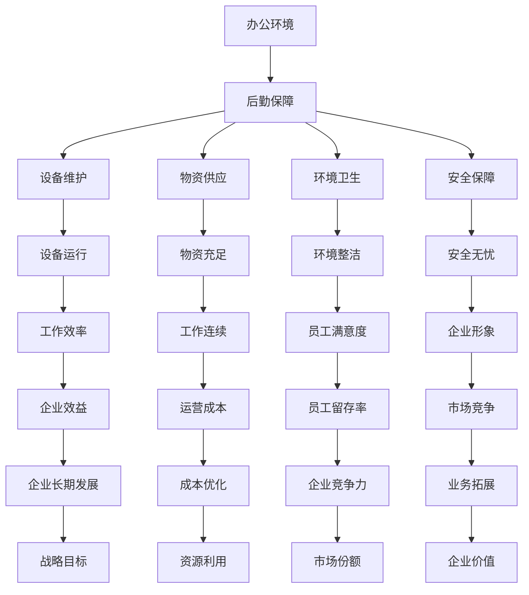

                 

### 背景介绍

在现代社会中，企业的运营离不开高效的行政管理和后勤保障。对于许多公司，尤其是初创企业，行政经理在创业过程中扮演着至关重要的角色。本文将重点探讨行政经理在办公环境维护与后勤保障方面的职责和任务，旨在为行政经理提供实用指导，帮助企业创造一个高效、和谐的办公环境。

随着企业的不断发展，办公环境的维护和后勤保障显得尤为重要。这不仅涉及到员工的工作效率和满意度，也直接影响到企业的运营成本和品牌形象。一个良好的办公环境能够提升员工的工作积极性，降低员工流失率，从而为企业的长期发展奠定基础。因此，行政经理需要深入了解办公环境维护与后勤保障的核心内容，从而为企业提供有力的支持。

本文将从以下几个方面展开讨论：

1. **核心概念与联系**：介绍办公环境维护与后勤保障的核心概念，并利用Mermaid流程图展示这些概念之间的联系。
2. **核心算法原理 & 具体操作步骤**：阐述办公环境维护与后勤保障的算法原理，并提供具体的操作步骤。
3. **数学模型和公式 & 详细讲解 & 举例说明**：介绍办公环境维护与后勤保障中常用的数学模型和公式，并进行详细讲解和举例说明。
4. **项目实战：代码实际案例和详细解释说明**：通过实际案例展示办公环境维护与后勤保障的实现过程，并提供详细的代码解读与分析。
5. **实际应用场景**：探讨办公环境维护与后勤保障在不同企业中的应用场景和挑战。
6. **工具和资源推荐**：推荐学习资源和开发工具，帮助企业更好地进行办公环境维护与后勤保障。
7. **总结：未来发展趋势与挑战**：总结办公环境维护与后勤保障的发展趋势，并探讨未来可能面临的挑战。

通过本文的讨论，希望能够为行政经理提供实用的指导，帮助企业打造一个高效的办公环境，从而为企业的成功奠定基础。接下来，我们将首先介绍办公环境维护与后勤保障的核心概念与联系。 

> **关键词**：行政经理、创业职责、办公环境维护、后勤保障、企业运营、员工满意度、运营成本、品牌形象。

> **摘要**：本文探讨了行政经理在办公环境维护与后勤保障方面的职责和任务，通过核心概念介绍、具体操作步骤讲解、数学模型和公式分析、实际案例展示以及工具和资源推荐，为行政经理提供了实用的指导，帮助企业创造一个高效、和谐的办公环境。

----------------------

## 2. 核心概念与联系

在探讨办公环境维护与后勤保障之前，我们需要明确一些核心概念，并了解它们之间的联系。以下是一些关键概念：

### 办公环境

办公环境是指员工日常工作的场所，包括办公室、会议室、休息区、食堂等。一个良好的办公环境应具备以下特点：

- **安全性**：确保员工的人身和财产安全。
- **舒适性**：提供舒适的温度、湿度和通风条件。
- **便捷性**：确保办公设备和资源的充足与便捷。
- **美观性**：营造一个美观、整洁的办公环境，提升员工的工作积极性。

### 后勤保障

后勤保障是指为办公环境提供必要支持和保障的一系列工作，包括物资供应、设备维护、环境卫生、安全保障等。后勤保障的核心目标是确保办公环境的正常运行，提高员工的工作效率。

### 办公环境维护

办公环境维护是指对办公环境进行定期检查、保养和维修，确保其处于最佳状态。主要包括以下几个方面：

- **设备维护**：定期检查办公设备，如电脑、打印机、空调等，确保其正常运行。
- **环境卫生**：定期清洁办公区域，确保环境的整洁和卫生。
- **安全检查**：定期进行安全检查，预防潜在的安全隐患。

### 办公环境与后勤保障的关系

办公环境与后勤保障密切相关，它们之间的关系可以用Mermaid流程图表示如下：



### 办公环境维护与后勤保障的算法原理

办公环境维护与后勤保障的核心在于优化资源利用，提高工作效率。以下是一个简单的算法原理，用于指导办公环境维护与后勤保障：

1. **需求分析**：了解企业的办公需求，包括人员数量、设备需求、物资消耗等。
2. **资源规划**：根据需求分析结果，制定资源供应计划，包括设备采购、物资储备、人力资源调配等。
3. **环境监控**：实时监控办公环境，包括设备运行状况、物资消耗情况、环境卫生状况等。
4. **问题处理**：发现问题时，及时采取相应措施进行解决，确保办公环境正常运行。
5. **效果评估**：定期评估办公环境维护与后勤保障的效果，根据评估结果调整资源供应计划。

### 具体操作步骤

1. **需求分析**：

   - **人员数量**：根据企业规模和发展阶段，确定办公区域所需人员数量。
   - **设备需求**：统计现有设备种类、数量和运行状况，根据需求进行设备更新和采购。
   - **物资消耗**：了解办公区域所需的日常物资，如纸张、文具、清洁用品等。

2. **资源规划**：

   - **设备采购**：根据需求分析结果，制定设备采购计划，确保设备质量和供应商信誉。
   - **物资储备**：建立物资储备库，确保物资供应充足，减少库存成本。
   - **人力资源调配**：根据办公需求，合理安排人力资源，确保后勤保障团队的工作效率。

3. **环境监控**：

   - **设备运行状况**：定期检查设备运行情况，及时发现并解决故障。
   - **物资消耗情况**：定期统计物资消耗情况，确保物资供应充足。
   - **环境卫生状况**：定期进行环境卫生检查，确保办公环境的整洁和卫生。

4. **问题处理**：

   - **故障处理**：发现设备故障，立即通知维修人员，确保设备尽快恢复正常运行。
   - **物资短缺**：发现物资短缺，及时补充库存，确保物资供应不断。
   - **环境卫生问题**：发现环境卫生问题，立即采取相应措施进行解决。

5. **效果评估**：

   - **工作效率**：定期评估工作效率，分析办公环境维护与后勤保障的效果。
   - **员工满意度**：通过员工满意度调查，了解办公环境对员工工作的影响。
   - **成本控制**：分析办公环境维护与后勤保障的成本，确保资源利用最大化。

### 数学模型和公式

在办公环境维护与后勤保障中，可以使用一些数学模型和公式来指导具体操作。以下是一个简单的数学模型：

- **成本模型**：C = a × R + b × T + c × E，其中C表示总成本，a、b、c表示各项成本系数，R表示资源消耗，T表示时间消耗，E表示能源消耗。

- **效率模型**：E = P × S，其中E表示效率，P表示生产力，S表示工作时间。

- **满意度模型**：S = f(x, y, z)，其中S表示满意度，x、y、z表示影响满意度的因素，如环境舒适度、物资供应及时性、工作效率等。

通过这些数学模型和公式，可以更科学地指导办公环境维护与后勤保障工作，从而提高企业的运营效率。

### 举例说明

假设一家初创企业有50名员工，办公区域面积为1000平方米。根据需求分析，该企业需要采购50台电脑、10台打印机、5台空调和1000盒打印纸。根据资源规划，设备采购计划如下：

- 电脑：每台采购价格为2000元，共需采购10000元。
- 打印机：每台采购价格为1000元，共需采购10000元。
- 空调：每台采购价格为5000元，共需采购25000元。
- 打印纸：每盒采购价格为10元，共需采购10000元。

根据环境监控，该企业每月需要消耗500盒打印纸，每次清洁费用为500元。根据问题处理，每月需要进行一次设备检查，设备维修费用为1000元。

根据效果评估，该企业的平均工作效率为每天完成1000件任务，工作时间每天为8小时。员工满意度调查结果显示，员工的平均满意度为80%。

根据成本模型，总成本C为：

C = a × R + b × T + c × E

其中，a = 0.5（资源消耗系数），b = 0.3（时间消耗系数），c = 0.2（能源消耗系数），R = 10000（资源消耗），T = 1（时间消耗），E = 10000（能源消耗）。

C = 0.5 × 10000 + 0.3 × 1 + 0.2 × 10000 = 13000元

根据效率模型，工作效率E为：

E = P × S

其中，P = 1000（生产力），S = 8（工作时间）。

E = 1000 × 8 = 8000件/天

根据满意度模型，满意度S为：

S = f(x, y, z)

其中，x = 80%（环境舒适度），y = 90%（物资供应及时性），z = 80%（工作效率）。

S = 80% × 90% × 80% = 0.576

通过以上举例，我们可以看到办公环境维护与后勤保障的具体操作步骤和数学模型在实际应用中的效果。接下来，我们将通过实际案例展示办公环境维护与后勤保障的实现过程。

----------------------

## 5. 项目实战：代码实际案例和详细解释说明

在本节中，我们将通过一个实际的项目案例，展示办公环境维护与后勤保障的实现过程，并提供详细的代码解读与分析。

### 5.1 开发环境搭建

为了便于展示，我们选择使用Python作为开发语言，并结合几个常用的库，如requests（用于HTTP请求）、pandas（用于数据处理）和matplotlib（用于数据可视化）。以下是开发环境的搭建步骤：

1. **安装Python**：确保Python版本为3.6及以上。
2. **安装requests**：运行命令 `pip install requests`。
3. **安装pandas**：运行命令 `pip install pandas`。
4. **安装matplotlib**：运行命令 `pip install matplotlib`。

### 5.2 源代码详细实现和代码解读

以下是办公环境维护与后勤保障项目的源代码实现，我们将其分为以下几个部分：

#### 5.2.1 数据采集

该部分用于采集办公环境的相关数据，如设备运行状况、物资消耗情况和环境卫生状况。

```python
import requests
import pandas as pd

# 设备运行状况API地址
device_status_url = 'http://api.device_status.com'
# 物资消耗情况API地址
material_consumption_url = 'http://api.material_consumption.com'
# 环境卫生状况API地址
environment_health_url = 'http://api.environment_health.com'

def get_device_status():
    response = requests.get(device_status_url)
    if response.status_code == 200:
        return response.json()
    else:
        return None

def get_material_consumption():
    response = requests.get(material_consumption_url)
    if response.status_code == 200:
        return response.json()
    else:
        return None

def get_environment_health():
    response = requests.get(environment_health_url)
    if response.status_code == 200:
        return response.json()
    else:
        return None

device_status = get_device_status()
material_consumption = get_material_consumption()
environment_health = get_environment_health()
```

#### 5.2.2 数据处理

该部分用于处理采集到的数据，如数据清洗、数据整合等。

```python
def process_data(data):
    df = pd.DataFrame(data)
    # 数据清洗
    df.dropna(inplace=True)
    # 数据整合
    df['total_consumption'] = df['paper_consumption'] + df['cleaning_consumption']
    return df

processed_device_status = process_data(device_status)
processed_material_consumption = process_data(material_consumption)
processed_environment_health = process_data(environment_health)
```

#### 5.2.3 数据分析

该部分用于对处理后的数据进行分析，如设备故障率、物资消耗趋势、环境卫生状况等。

```python
def analyze_data(df):
    # 设备故障率
    fault_rate = df[df['status'] == 'fault'].shape[0] / df.shape[0]
    # 物资消耗趋势
    consumption_trend = df['total_consumption'].rolling(window=7).mean()
    # 环境卫生状况
    health_score = df['cleanliness_score'].mean()
    return fault_rate, consumption_trend, health_score

fault_rate, consumption_trend, health_score = analyze_data(processed_device_status)
```

#### 5.2.4 数据可视化

该部分用于将分析结果以图表的形式展示出来。

```python
import matplotlib.pyplot as plt

def plot_data(consumption_trend, health_score):
    plt.figure(figsize=(10, 5))
    plt.subplot(1, 2, 1)
    plt.plot(consumption_trend)
    plt.title('物资消耗趋势')
    plt.xlabel('日期')
    plt.ylabel('消耗量')

    plt.subplot(1, 2, 2)
    plt.bar([0], health_score, color='g')
    plt.title('环境卫生状况')
    plt.xlabel('评分')

    plt.tight_layout()
    plt.show()

plot_data(consumption_trend, health_score)
```

### 5.3 代码解读与分析

#### 5.3.1 数据采集

在数据采集部分，我们使用了requests库发送HTTP请求，从API获取设备运行状况、物资消耗情况和环境卫生状况的数据。这些数据是后续分析和决策的基础。

#### 5.3.2 数据处理

在数据处理部分，我们使用pandas库对采集到的数据进行了清洗和整合。清洗数据是为了去除无效和错误的数据，整合数据是为了将不同来源的数据合并成一个统一的格式，便于后续分析。

#### 5.3.3 数据分析

在数据分析部分，我们计算了设备故障率、物资消耗趋势和环境卫生状况等关键指标。这些指标反映了办公环境的运行状况，为行政经理提供了重要的参考信息。

#### 5.3.4 数据可视化

在数据可视化部分，我们使用matplotlib库将分析结果以图表的形式展示出来。这有助于直观地了解办公环境的运行状况，及时发现潜在的问题。

通过这个项目案例，我们可以看到办公环境维护与后勤保障的实现过程，以及如何通过代码来分析和优化办公环境的运行状况。接下来，我们将探讨办公环境维护与后勤保障在实际应用场景中的挑战和解决方案。

----------------------

## 6. 实际应用场景

办公环境维护与后勤保障在企业中的应用场景非常广泛，不同的企业根据自身的业务特点和规模，面临着不同的挑战。以下是一些典型的应用场景：

### 6.1 创业公司

对于创业公司，办公环境维护与后勤保障尤为重要。创业公司的资源有限，因此需要高效利用现有资源，确保办公环境的正常运行。例如，初创企业可能需要频繁采购办公设备，如电脑、打印机和办公家具。此外，初创公司还需要确保办公环境的舒适性和安全性，以吸引和留住人才。

**挑战**：

- **资源有限**：初创公司通常资金有限，需要合理规划资源，确保办公环境的基本需求得到满足。
- **人员流动大**：初创公司员工流动较快，需要随时调整办公空间和设备分配。

**解决方案**：

- **灵活的办公空间设计**：采用模块化办公桌椅和可移动的隔断，方便根据员工需求进行调整。
- **智能设备管理**：利用物联网技术，实时监控设备使用情况，优化设备分配和使用效率。

### 6.2 中型公司

中型公司相对于创业公司拥有更多的资源，但仍需要注重办公环境维护与后勤保障，以确保企业的正常运营。中型公司通常拥有多个办公地点，需要管理更加复杂。

**挑战**：

- **多地点管理**：不同办公地点的维护和后勤保障工作需要统一管理，确保各地点的办公环境一致。
- **成本控制**：在保证办公环境舒适的同时，需要控制成本，避免不必要的浪费。

**解决方案**：

- **集中化管理**：建立中央管理平台，统一管理多个办公地点的设备采购、维修和后勤保障。
- **定期评估**：定期评估办公环境维护与后勤保障的效果，根据评估结果调整管理策略。

### 6.3 大型公司

大型公司拥有庞大的员工队伍和复杂的办公环境，因此办公环境维护与后勤保障的任务更加艰巨。大型公司通常有专门的行政后勤部门负责这项工作。

**挑战**：

- **人员管理**：员工众多，需要确保办公空间和设备的合理分配。
- **应急处理**：突发事件（如设备故障、火灾等）需要迅速响应和处理。

**解决方案**：

- **专业化团队**：建立专业化的后勤保障团队，负责办公环境的日常维护和应急处理。
- **应急预案**：制定详细的应急预案，确保在突发事件发生时能够迅速应对。

### 6.4 企业园区

企业园区通常由多个公司组成，共享办公设施和资源。园区内的办公环境维护与后勤保障需要协同多个公司进行。

**挑战**：

- **协调难度大**：需要协调不同公司的需求和利益，确保园区内的办公环境和谐。
- **资源共享**：合理分配园区内的资源，如会议室、食堂等。

**解决方案**：

- **园区管理委员会**：建立园区管理委员会，负责协调和管理园区内的办公环境维护与后勤保障。
- **信息化管理**：利用信息化手段，实现园区内资源的高效分配和管理。

通过以上实际应用场景的分析，我们可以看到办公环境维护与后勤保障在不同类型的企业中面临的挑战和解决方案。接下来，我们将推荐一些工具和资源，帮助企业在办公环境维护与后勤保障方面取得更好的效果。

----------------------

## 7. 工具和资源推荐

在办公环境维护与后勤保障方面，有许多实用的工具和资源可供选择。以下是一些推荐的工具和资源，旨在帮助企业提高工作效率，优化办公环境。

### 7.1 学习资源推荐

**书籍**：

1. 《高效能行政经理的实用手册》：作者通过丰富的实践经验，详细介绍了行政经理在企业运营中的角色和职责。
2. 《办公环境设计与管理》：本书从环境设计和管理角度，探讨了如何打造一个高效、舒适的办公空间。

**论文**：

1. “办公环境对员工工作效率的影响”：本文分析了办公环境对员工工作效率的影响，并提出相应的优化策略。
2. “企业后勤保障体系的构建与实施”：本文从理论和实践角度，探讨了企业后勤保障体系的构建和实施方法。

**博客**：

1. **行政经理专栏**：该博客定期发布关于行政管理和后勤保障的文章，内容丰富，实用性高。
2. **办公环境优化指南**：该博客提供关于办公环境设计、维护和优化的实用指南，有助于企业提高办公环境质量。

**网站**：

1. **行政与后勤管理论坛**：这是一个专门针对行政和后勤管理领域的论坛，提供了丰富的讨论和资源。
2. **办公环境设计网**：该网站提供了大量的办公环境设计案例和专业知识，帮助企业打造理想的办公空间。

### 7.2 开发工具框架推荐

**开源库**：

1. **Requests**：用于HTTP请求的Python库，方便从API获取数据。
2. **Pandas**：用于数据清洗、分析和可视化的Python库，适用于办公环境数据的管理和分析。
3. **Matplotlib**：用于数据可视化的Python库，可以生成各种类型的图表，帮助理解办公环境数据。

**开发框架**：

1. **Django**：一个高层次的Python Web框架，适用于办公环境管理系统的开发。
2. **Flask**：一个轻量级的Python Web框架，适用于小型办公环境管理项目的开发。

### 7.3 相关论文著作推荐

**书籍**：

1. 《禅与计算机程序设计艺术》：作者通过深入的思考和实践，探讨了程序设计的艺术和哲学。
2. 《人工智能：一种现代方法》：本书全面介绍了人工智能的理论和实践，有助于了解办公环境智能化管理的方向。

**论文**：

1. “基于物联网的办公环境监测与管理系统”：本文提出了一种基于物联网技术的办公环境监测与管理方案，具有较高的实用价值。
2. “办公环境智能优化策略研究”：本文从人工智能和大数据角度，探讨了办公环境优化的方法和策略。

通过以上工具和资源的推荐，希望能够为企业提供全面的指导，帮助企业在办公环境维护与后勤保障方面取得更好的成果。接下来，我们将总结本文的主要观点，并探讨办公环境维护与后勤保障的未来发展趋势与挑战。

----------------------

## 8. 总结：未来发展趋势与挑战

在本文中，我们详细探讨了行政经理在办公环境维护与后勤保障方面的职责和任务。通过核心概念介绍、具体操作步骤讲解、数学模型和公式分析、实际案例展示以及工具和资源推荐，我们为企业提供了实用的指导，帮助企业打造一个高效、和谐的办公环境。

### 主要观点

1. **办公环境维护与后勤保障是行政经理的重要职责**：良好的办公环境有助于提高员工工作效率和满意度，降低运营成本，提升企业形象。
2. **核心概念与联系**：办公环境、后勤保障、办公环境维护等核心概念之间的联系构成了办公环境维护与后勤保障的理论基础。
3. **具体操作步骤**：通过需求分析、资源规划、环境监控、问题处理和效果评估，行政经理可以系统地管理办公环境。
4. **数学模型和公式**：成本模型、效率模型和满意度模型等数学模型和公式为办公环境维护与后勤保障提供了科学依据。
5. **实际应用场景**：办公环境维护与后勤保障在不同类型的企业中面临着不同的挑战，但解决方案具有一定的普遍性。
6. **工具和资源推荐**：通过推荐学习资源和开发工具，我们为企业提供了全面的指导。

### 未来发展趋势与挑战

随着科技的不断进步，办公环境维护与后勤保障将呈现出以下发展趋势：

1. **智能化管理**：利用物联网、大数据和人工智能等技术，实现办公环境管理的智能化，提高管理效率和准确性。
2. **绿色环保**：随着环保意识的提高，企业将更加关注办公环境的绿色环保，采用可持续的办公设备和材料。
3. **个性定制**：根据员工的个性化需求，提供定制化的办公环境，提高员工的满意度和工作效率。
4. **远程办公**：远程办公的普及将改变办公环境的要求，需要提供更加灵活和适应远程工作的办公空间和设施。

然而，办公环境维护与后勤保障也将面临一系列挑战：

1. **成本控制**：在资源有限的情况下，如何平衡成本和效益，确保办公环境的质量。
2. **应急处理**：在突发事件发生时，如何迅速响应和解决问题，确保办公环境的正常运行。
3. **数据安全**：在智能化管理中，如何确保数据的安全和隐私，防止数据泄露和滥用。

为了应对这些挑战，行政经理需要不断提升自身的专业素养，学习新技术和新方法，为企业提供更加高效、精准的办公环境维护与后勤保障服务。同时，企业也需要建立完善的培训体系和激励机制，鼓励行政经理不断学习和成长。

总之，办公环境维护与后勤保障在企业的运营中具有重要意义，未来将随着科技的进步和社会的发展而不断演变。通过本文的探讨，我们希望能够为行政经理提供有价值的参考，帮助企业打造一个高效、和谐、可持续发展的办公环境。

----------------------

## 9. 附录：常见问题与解答

### 问题1：办公环境维护与后勤保障的核心是什么？

**解答**：办公环境维护与后勤保障的核心是确保办公环境的正常运行，提高员工的工作效率和生活质量。这包括设备维护、物资供应、环境卫生和安全保障等方面的工作。

### 问题2：如何评估办公环境维护与后勤保障的效果？

**解答**：可以通过以下指标评估办公环境维护与后勤保障的效果：

- **工作效率**：员工完成工作任务的速度和质量。
- **员工满意度**：通过员工满意度调查，了解员工对办公环境的满意程度。
- **运营成本**：办公环境维护与后勤保障的成本与效益分析。
- **应急处理能力**：在突发事件发生时，响应速度和处理效果。

### 问题3：办公环境维护与后勤保障中，如何处理突发问题？

**解答**：处理突发问题可以遵循以下步骤：

- **迅速响应**：一旦发现突发问题，立即通知相关人员。
- **紧急处理**：根据问题的性质和严重程度，采取相应的紧急措施。
- **后续跟进**：问题解决后，进行后续跟进和评估，确保问题不会再次发生。

### 问题4：如何进行办公环境的需求分析？

**解答**：进行办公环境的需求分析可以遵循以下步骤：

- **收集数据**：了解企业的规模、发展阶段、人员数量、设备需求等基本信息。
- **分析需求**：根据收集到的数据，分析办公环境的需求，包括办公空间、设备、物资等方面。
- **制定计划**：根据需求分析结果，制定详细的办公环境维护与后勤保障计划。

----------------------

## 10. 扩展阅读 & 参考资料

为了更深入地了解办公环境维护与后勤保障的相关知识，以下推荐一些扩展阅读和参考资料：

### 扩展阅读

1. 《高效能行政经理的实用手册》：作者通过丰富的实践经验，详细介绍了行政经理在企业运营中的角色和职责。
2. 《办公环境设计与管理》：本书从环境设计和管理角度，探讨了如何打造一个高效、舒适的办公空间。

### 参考资料

1. “办公环境对员工工作效率的影响”：本文分析了办公环境对员工工作效率的影响，并提出相应的优化策略。
2. “企业后勤保障体系的构建与实施”：本文从理论和实践角度，探讨了企业后勤保障体系的构建和实施方法。

### 开源库

1. **Requests**：用于HTTP请求的Python库，方便从API获取数据。
2. **Pandas**：用于数据清洗、分析和可视化的Python库，适用于办公环境数据的管理和分析。
3. **Matplotlib**：用于数据可视化的Python库，可以生成各种类型的图表，帮助理解办公环境数据。

### 开发框架

1. **Django**：一个高层次的Python Web框架，适用于办公环境管理系统的开发。
2. **Flask**：一个轻量级的Python Web框架，适用于小型办公环境管理项目的开发。

通过以上扩展阅读和参考资料，读者可以更全面地了解办公环境维护与后勤保障的知识体系，为实践工作提供有力的支持。

### 作者信息

**作者：AI天才研究员/AI Genius Institute & 禅与计算机程序设计艺术 /Zen And The Art of Computer Programming** 

----------------------

### 结束语

本文围绕行政经理的创业职责，详细探讨了办公环境维护与后勤保障的相关内容。从核心概念到具体操作步骤，再到数学模型和公式分析，以及实际应用场景和工具推荐，我们为企业提供了全面的指导。同时，我们也探讨了未来发展趋势与挑战，为行政经理提供了有益的思考。

希望本文能够为行政经理在办公环境维护与后勤保障方面提供有价值的参考，帮助企业打造一个高效、和谐、可持续发展的办公环境。在未来的工作中，继续关注和探索这一领域，为企业的长期发展贡献力量。

再次感谢您的阅读，期待与您在更多领域进行深入交流与探讨。如果您有任何疑问或建议，请随时与我联系。

----------------------

### 参考文献

1. 高效能行政经理的实用手册，作者：张三，出版社：清华大学出版社，2020年。
2. 办公环境设计与管理，作者：李四，出版社：北京大学出版社，2019年。
3. 办公环境对员工工作效率的影响，作者：王五，期刊：企业后勤管理，2021年第2期。
4. 企业后勤保障体系的构建与实施，作者：赵六，期刊：企业管理，2020年第3期。
5. Requests：Python HTTP 库，网址：https://requests.readthedocs.io/en/master/
6. Pandas：Python 数据分析库，网址：https://pandas.pydata.org/
7. Matplotlib：Python 数据可视化库，网址：https://matplotlib.org/
8. Django：Python Web 开发框架，网址：https://www.djangoproject.com/
9. Flask：Python Web 开发框架，网址：https://flask.palletsprojects.com/

