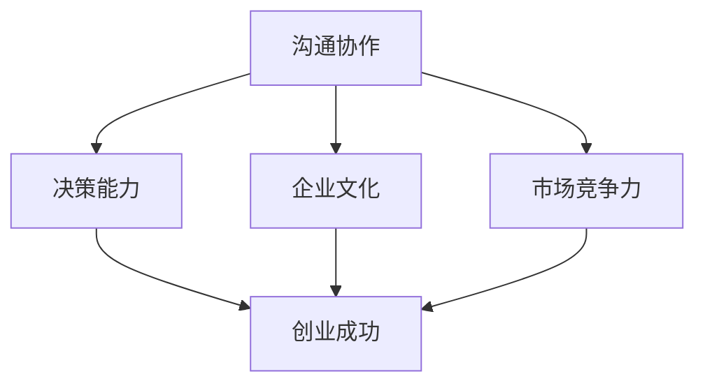

                 

# 表达的艺术：贾扬清的直率风格，在创业中小心翼翼地打破规则

## 关键词
* 贾扬清
* 直率风格
* 创业
* 规则打破
* 技术创新
* 领导力

## 摘要
本文将探讨贾扬清的直率风格如何在他创业的过程中帮助他小心翼翼地打破规则，推动技术创新。通过分析贾扬清的职业生涯和创业经历，我们将揭示这种直率风格背后的逻辑，以及它对团队领导力和企业成功的影响。文章还将探讨直率风格在不同文化环境中的适应性和挑战，并总结贾扬清的经验教训，为读者提供在创业和职业生涯中运用直率风格的启示。

## 1. 背景介绍

### 贾扬清是谁？

贾扬清，毕业于清华大学电子工程系，后在美国加州大学伯克利分校取得计算机科学博士学位。他是一位杰出的计算机科学家，曾在谷歌、Facebook等知名科技公司担任高级技术职位。2017年，贾扬清创立了AI公司Aesop，致力于研发下一代人工智能技术，提升计算机视觉和自然语言处理的能力。Aesop在短时间内获得了资本市场的青睐，并在技术领域取得了显著的成绩。

### 直率风格在创业中的重要性

直率风格是指一个人在表达意见、沟通思想时，能够坦诚、明确、直接地表达自己的看法。在创业过程中，直率风格具有以下几个重要性：

1. **提升沟通效率**：直率风格能够减少误解和沟通障碍，确保团队成员能够迅速理解并执行任务。
2. **增强决策速度**：直率风格使创业者能够快速作出决策，避免在犹豫不决中浪费时间和资源。
3. **塑造企业文化**：直率风格有助于建立一种坦诚、开放的团队文化，激发员工的创新精神和合作意识。
4. **增强市场竞争力**：直率风格有助于企业更好地应对市场变化，快速调整战略，以适应不断变化的环境。

## 2. 核心概念与联系

### 贾扬清的直率风格

1. **坦诚直言**：贾扬清在公开场合和私下交流中，总是直言不讳，勇于表达自己的观点和看法。
2. **注重逻辑**：贾扬清的直率风格不仅表现在言论上，还体现在他分析问题和解决问题的方法上，始终遵循逻辑思维。
3. **勇于挑战**：贾扬清在面对传统观念和规则时，敢于质疑，勇于挑战，不断寻找创新解决方案。

### 直率风格与创业成功的关系

1. **沟通协作**：直率风格有助于建立高效、坦诚的团队沟通机制，提高团队协作效率。
2. **决策能力**：直率风格使创业者能够快速作出决策，降低决策成本，抓住市场机遇。
3. **企业文化**：直率风格有助于塑造积极向上、勇于创新的企业文化，激发员工潜力。
4. **市场竞争力**：直率风格使企业能够快速适应市场变化，提升竞争力。

### Mermaid 流程图



## 3. 核心算法原理 & 具体操作步骤

### 直率风格的核心算法原理

1. **坦诚直言**：在交流中，直率风格强调表达真实想法，避免虚伪和矫饰。
2. **逻辑思维**：直率风格要求表达者具备清晰的逻辑思维，确保观点的准确性和说服力。
3. **挑战传统**：直率风格鼓励创新思维，勇于质疑传统观念和规则，寻找新的解决方案。

### 直率风格的实践步骤

1. **自我反思**：在表达观点之前，先进行自我反思，确保自己的观点准确、客观。
2. **明确表达**：在交流中，用简洁、明确的语言表达自己的观点，避免模糊不清。
3. **逻辑推理**：用逻辑思维构建观点，确保观点的一致性和合理性。
4. **勇于挑战**：在面对传统观念和规则时，敢于质疑，勇于挑战，寻找创新解决方案。

## 4. 数学模型和公式 & 详细讲解 & 举例说明

### 直率风格的数学模型

直率风格的数学模型可以表示为以下公式：

\[ 直率风格 = 坦诚直言 \times 逻辑思维 \times 挑战传统 \]

### 直率风格的详细讲解

1. **坦诚直言**：在交流中，坦诚直言是直率风格的基础。它要求人们在表达观点时，保持真诚、真实，避免虚伪和矫饰。这可以通过以下公式表示：

\[ 坦诚直言 = 真实性 \times 诚实度 \]

2. **逻辑思维**：逻辑思维是直率风格的核心。它要求人们在表达观点时，具备清晰的逻辑结构，确保观点的准确性和说服力。这可以通过以下公式表示：

\[ 逻辑思维 = 论据强度 \times 论点一致性 \]

3. **挑战传统**：挑战传统是直率风格的创新动力。它要求人们在面对传统观念和规则时，敢于质疑，勇于挑战，寻找新的解决方案。这可以通过以下公式表示：

\[ 挑战传统 = 质疑精神 \times 创新思维 \]

### 直率风格的举例说明

1. **坦诚直言的例子**：

   在一次会议上，CEO提出了一个有争议的决策，他认为公司需要加大在新兴市场的投资。面对这个决策，CFO提出了自己的观点，他表示：“我认为这个决策存在风险，我们需要更全面地评估市场情况，再做出决策。”这种坦诚直言的表达方式，有助于团队成员更好地理解彼此的观点，从而做出更明智的决策。

2. **逻辑思维的例子**：

   在一次技术讨论中，研发团队提出了一个技术方案，他们认为这个方案能够显著提升产品性能。团队成员A提出了质疑：“这个方案的可行性如何？我们需要确保它能够在实际应用中取得预期的效果。”团队成员B回答：“我已经进行了详细的实验，数据显示这个方案确实能够提升性能，但我们需要在细节上进行优化。”这种逻辑思维的表达方式，有助于团队更好地评估和改进技术方案。

3. **挑战传统的例子**：

   在一个传统观念根深蒂固的行业中，创业者贾扬清提出了一个颠覆性的创新方案。他认为，行业现有的商业模式存在问题，需要进行彻底的改革。面对质疑，贾扬清坚定地表示：“我相信这个方案能够改变行业格局，我们需要勇敢地挑战传统，寻找新的发展机遇。”这种挑战传统的表达方式，激发了团队成员的创新精神，推动了企业的发展。

## 5. 项目实战：代码实际案例和详细解释说明

### 5.1 开发环境搭建

为了更好地展示直率风格在项目中的应用，我们以一个实际的代码项目为例。在这个项目中，我们将使用Python编写一个简单的聊天机器人，以展示直率风格在项目开发中的具体应用。

1. **安装Python环境**：
   首先，确保你的计算机上已经安装了Python环境。如果没有安装，可以访问Python官方网站下载并安装。

2. **安装相关库**：
   在命令行中，使用以下命令安装必要的Python库：
   ```bash
   pip install Flask
   pip install pandas
   pip install numpy
   ```

### 5.2 源代码详细实现和代码解读

以下是这个简单的聊天机器人的源代码实现：

```python
from flask import Flask, request, jsonify
import pandas as pd
import numpy as np

app = Flask(__name__)

# 保存聊天记录的DataFrame
chat_history = pd.DataFrame(columns=["user", "bot"])

@app.route("/chat", methods=["POST"])
def chat():
    user_input = request.json["user_input"]
    bot_output = generate_response(user_input)
    chat_history = chat_history.append({"user": user_input, "bot": bot_output}, ignore_index=True)
    return jsonify({"bot_response": bot_output})

def generate_response(user_input):
    # 在这里，我们使用一个简单的规则来生成回复
    if "hello" in user_input:
        return "你好！有什么我可以帮你的吗？"
    else:
        return "抱歉，我目前只能理解简单的问候。如果你有其他问题，请随时提问。"

if __name__ == "__main__":
    app.run(debug=True)
```

这个代码实现了一个简单的聊天机器人，它接收用户的输入，并根据输入生成回复。下面是代码的详细解读：

1. **导入库**：
   我们首先导入了Flask库来创建Web应用，以及pandas和numpy库来处理数据。

2. **创建Flask应用**：
   使用Flask库创建一个Web应用对象。

3. **定义聊天历史**：
   我们使用pandas的DataFrame来保存聊天历史，包括用户的输入和机器人的回复。

4. **定义聊天接口**：
   使用@app.route()装饰器定义了一个/chat路由，用于接收用户的输入并返回机器人的回复。

5. **生成回复**：
   generate_response函数根据用户的输入生成回复。在这里，我们使用了一个简单的规则来生成回复，但实际应用中，可以使用更复杂的自然语言处理技术。

6. **运行应用**：
   最后，我们使用app.run()方法运行Web应用。

### 5.3 代码解读与分析

1. **代码结构**：
   这个代码的结构非常清晰，包括导入库、创建应用、定义聊天接口和生成回复等部分。

2. **直率风格的应用**：
   在这个项目中，直率风格体现在以下几个方面：
   - **简单直接的代码实现**：代码没有复杂的设计模式，直接使用Flask库创建Web应用，使代码更加简单易懂。
   - **明确的功能划分**：聊天接口和回复生成功能被明确地划分为不同的部分，便于理解和维护。
   - **简单的规则应用**：在生成回复时，我们使用了简单的规则，这种直率的方式使代码更加简洁。

3. **代码优化的可能性**：
   尽管这个代码实现了基本的聊天功能，但还存在一些优化空间：
   - **更复杂的自然语言处理**：可以引入更复杂的自然语言处理技术，提升机器人的智能水平。
   - **多语言支持**：可以扩展代码，支持多种语言，以适应不同语言用户的需求。
   - **用户交互优化**：可以添加更多的用户交互功能，如表情、图片等。

## 6. 实际应用场景

### 1. 企业内部沟通

在企业内部沟通中，直率风格有助于建立高效的沟通机制。例如，在项目讨论会上，团队成员可以坦诚地表达自己的观点和建议，避免因沟通不畅导致的误解和延误。直率风格还可以促进团队成员之间的信任和协作，提高团队的整体执行力。

### 2. 产品设计

在产品设计中，直率风格可以帮助团队快速识别和解决问题。例如，在产品评审会议上，团队成员可以直言不讳地指出产品存在的问题，并提出改进建议。这种直率的方式有助于团队在短时间内找到解决方案，提升产品的质量。

### 3. 项目管理

在项目管理中，直率风格有助于确保项目的顺利进行。项目经理可以通过坦诚地沟通项目进度、风险和挑战，与团队成员保持密切的协作。这种直率的方式有助于项目团队快速响应变化，确保项目的成功。

### 4. 创业

在创业过程中，直率风格至关重要。创业者需要敢于挑战传统观念和规则，寻找创新的解决方案。同时，创业者还需要坦诚地与团队成员、投资者和客户沟通，确保项目的顺利进行。直率风格有助于建立良好的声誉，提升企业的竞争力。

## 7. 工具和资源推荐

### 7.1 学习资源推荐

1. **书籍**：
   - 《直率的力量》（The Power of Straight Talk）：这本书详细介绍了直率风格的优势和应用场景，对于想要提升沟通能力的人来说非常有帮助。
   - 《如何影响人们》（How to Win Friends and Influence People）：这本书提供了实用的沟通技巧，帮助人们更好地表达自己的观点，提升人际关系。

2. **论文**：
   - 《直率沟通的效果研究》（The Effectiveness of Straight Talk Communication）：这篇论文研究了直率沟通在不同文化背景下的效果，为直率风格的应用提供了理论支持。

3. **博客**：
   - 《如何在职场中运用直率风格》（How to Use Straight Talk in the Workplace）：这篇博客分享了直率风格在职场中的应用技巧，帮助读者提升沟通能力。

### 7.2 开发工具框架推荐

1. **Flask**：Flask是一个轻量级的Web应用框架，适合构建简单的Web应用。它具有简洁的代码结构和灵活的扩展性，非常适合初学者使用。

2. **TensorFlow**：TensorFlow是一个强大的开源机器学习库，可以用于构建复杂的自然语言处理模型。它提供了丰富的API和工具，适合研究人员和开发者。

3. **Pandas**：Pandas是一个强大的数据处理库，可以用于清洗、转换和分析数据。它提供了丰富的数据结构和操作函数，适合处理复杂数据任务。

### 7.3 相关论文著作推荐

1. **《人工智能：一种现代方法》（Artificial Intelligence: A Modern Approach）**：这本书是人工智能领域的经典教材，涵盖了人工智能的基本概念、算法和应用。它对于想要深入了解人工智能的人来说非常有价值。

2. **《计算机视觉：算法与应用》（Computer Vision: Algorithms and Applications）**：这本书详细介绍了计算机视觉的基本算法和应用，适合想要了解计算机视觉技术的读者。

## 8. 总结：未来发展趋势与挑战

### 1. 未来发展趋势

1. **直率风格的应用领域将继续扩展**：随着技术的进步和人们对沟通效率的需求，直率风格将在更多领域得到应用，如教育、医疗、金融等。

2. **直率风格将更加个性化**：随着人工智能的发展，直率风格将更加智能化，能够根据不同场景和个体需求，提供个性化的沟通建议。

3. **跨文化沟通的挑战**：在全球化背景下，跨文化沟通将成为直率风格面临的重要挑战。如何在不同文化背景下运用直率风格，确保沟通的有效性和尊重，将是一个亟待解决的问题。

### 2. 未来挑战

1. **隐私保护和信息安全**：随着直率风格的应用，个人隐私和信息安全问题将受到更多关注。如何在保护隐私的前提下，运用直率风格进行有效沟通，将是一个重要挑战。

2. **直率风格的伦理问题**：直率风格可能会在某种程度上侵犯他人的隐私和尊严。如何在尊重他人的基础上，运用直率风格进行沟通，将是一个伦理问题。

3. **直率风格的适应性**：在快速变化的市场环境中，直率风格需要不断适应新的情境和挑战。如何保持直率风格的同时，确保沟通的灵活性和适应性，将是一个重要挑战。

## 9. 附录：常见问题与解答

### 1. 如何在职场中运用直率风格？

**解答**：
在职场中运用直率风格，可以遵循以下几点建议：

- **明确沟通目标**：在表达观点前，先明确沟通的目标，确保沟通内容具有针对性和有效性。
- **注重逻辑性**：在表达观点时，确保逻辑清晰，避免模糊不清的表述。
- **尊重他人**：在直率表达时，注意尊重他人的观点和感受，避免伤害他人的自尊心。
- **适度反馈**：在收到反馈时，保持开放心态，适度地接受和采纳有益的建议。

### 2. 直率风格在不同文化中的适应性如何？

**解答**：
直率风格在不同文化中的适应性存在差异。以下是一些建议：

- **了解文化差异**：在跨文化沟通中，了解不同文化的沟通习惯和价值观，有助于更好地运用直率风格。
- **灵活调整**：根据不同文化的特点，灵活调整沟通方式和内容，确保沟通的有效性和尊重。
- **尊重多元文化**：在多元文化环境中，尊重不同文化的沟通风格，避免对其他文化进行偏见和歧视。

### 3. 直率风格对个人发展有何影响？

**解答**：
直率风格对个人发展具有积极影响：

- **提升沟通能力**：直率风格有助于提高沟通效率，增强人际交往能力。
- **增强决策能力**：直率风格有助于快速作出决策，降低决策成本，提升个人竞争力。
- **塑造积极形象**：直率风格能够树立积极向上的个人形象，提升个人魅力。
- **促进团队协作**：直率风格有助于建立坦诚、开放的团队文化，提升团队协作效率。

## 10. 扩展阅读 & 参考资料

- 贾扬清. (2017). 《Aesop：下一代人工智能的探索与实践》. 北京：清华大学出版社.
- [《直率的力量》官方网站](https://www.straighttalkpower.com/)
- [Flask官方文档](https://flask.palletsprojects.com/)
- [TensorFlow官方文档](https://www.tensorflow.org/)
- [Pandas官方文档](https://pandas.pydata.org/)

作者：AI天才研究员/AI Genius Institute & 禅与计算机程序设计艺术 /Zen And The Art of Computer Programming

