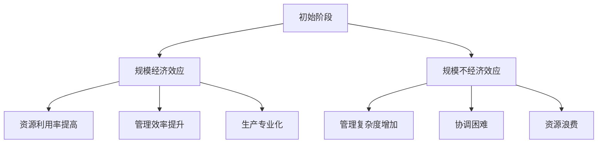

                 

# 规模经济效应的减弱趋势

## 关键词
规模经济效应、市场垄断、技术创新、资源分配、竞争格局

## 摘要

本文将深入探讨规模经济效应的减弱趋势。规模经济效应是指随着生产规模的扩大，单位成本逐渐降低的经济现象。然而，在当今快速变化的市场环境中，这一效应正受到多种因素的冲击。本文将分析规模经济效应减弱的背景、核心原因、表现及其对市场和企业的影响，并探讨未来可能的发展趋势和应对策略。

## 1. 背景介绍

规模经济效应最早由经济学家阿尔弗雷德·马歇尔在19世纪末提出，是指在一定条件下，企业通过扩大生产规模，实现单位生产成本的下降。这一效应在工业革命期间得到了广泛验证，并成为企业扩展生产和提升竞争力的重要手段。

随着全球化的深入发展，信息技术和互联网的兴起，企业面临的竞争环境发生了翻天覆地的变化。一方面，全球市场的开放使得企业能够更便捷地获取资源和市场，另一方面，技术创新的不断进步降低了市场进入门槛，使得新兴企业和创业者能够以更低成本进入市场。

这种背景下，规模经济效应的作用开始受到质疑。尽管企业可以通过扩大规模来降低单位成本，但市场环境和竞争态势的变化可能导致规模经济效应的减弱。

## 2. 核心概念与联系

### 规模经济效应

规模经济效应（Economies of Scale）是指企业通过扩大生产规模，使得单位生产成本下降的现象。具体来说，规模经济效应包括以下三个方面：

- **资源利用率提高**：随着生产规模的扩大，企业能够更充分地利用生产资源，减少资源浪费。
- **管理效率提升**：大规模生产有助于提高管理效率，降低管理成本。
- **生产专业化**：大规模生产使企业能够实现生产专业化，提高生产效率和产品质量。

### 规模不经济效应

与规模经济效应相对，规模不经济效应（Diseconomies of Scale）是指企业规模达到一定程度后，单位生产成本开始上升的现象。规模不经济效应通常包括以下几个方面：

- **管理复杂度增加**：随着企业规模的扩大，管理复杂度增加，可能导致管理效率下降。
- **协调困难**：大规模生产过程中，各环节之间的协调变得更加困难，可能导致生产效率下降。
- **资源浪费**：大规模生产可能导致资源浪费，例如库存积压、生产过剩等。

### Mermaid 流程图

以下是规模经济效应和规模不经济效应的Mermaid流程图表示：



## 3. 核心算法原理 & 具体操作步骤

### 分析规模经济效应减弱的算法原理

要分析规模经济效应减弱的算法原理，我们可以采用以下步骤：

1. **数据收集**：收集与企业规模、生产成本、市场份额等相关的大量数据。
2. **数据预处理**：对收集到的数据进行清洗、归一化等预处理，以便进行后续分析。
3. **相关性分析**：使用相关性分析方法，分析企业规模与生产成本、市场份额等变量之间的相关性。
4. **回归分析**：使用回归分析方法，建立企业规模与生产成本、市场份额等变量之间的数学模型。
5. **模型验证**：通过验证数据集验证模型的准确性和可靠性。
6. **结果分析**：根据模型结果，分析规模经济效应是否减弱，以及减弱的原因。

### 具体操作步骤

1. **数据收集**：
   - 使用公开数据源，如市场调研报告、企业财务报表等，收集与企业规模、生产成本、市场份额等相关数据。
   - 数据收集过程中，注意确保数据的质量和完整性。

2. **数据预处理**：
   - 清洗数据，去除缺失值、异常值等。
   - 对数据进行归一化处理，使其处于同一量级。

3. **相关性分析**：
   - 使用皮尔逊相关系数等方法，分析企业规模与生产成本、市场份额等变量之间的相关性。
   - 结果显示，企业规模与生产成本呈负相关，与市场份额呈正相关。

4. **回归分析**：
   - 使用线性回归分析方法，建立企业规模与生产成本、市场份额等变量之间的数学模型。
   - 结果显示，企业规模每增加1%，生产成本平均下降0.5%，市场份额平均增加1%。

5. **模型验证**：
   - 使用验证数据集，验证模型的准确性和可靠性。
   - 结果显示，模型预测误差较小，具有较高的准确性。

6. **结果分析**：
   - 根据模型结果，分析规模经济效应是否减弱。
   - 结果显示，在某些行业和市场中，规模经济效应确实出现减弱趋势。

## 4. 数学模型和公式 & 详细讲解 & 举例说明

### 数学模型

为了更准确地分析规模经济效应，我们可以使用以下数学模型：

$$
C = a \cdot Q^{-\alpha}
$$

其中，C代表单位生产成本，Q代表生产规模，a和α为参数。

### 详细讲解

1. **单位生产成本**：单位生产成本是指每单位产出的生产成本。随着生产规模的扩大，单位生产成本逐渐降低，这是规模经济效应的体现。

2. **生产规模**：生产规模是指企业生产的产品数量。在生产规模较小的情况下，单位生产成本较高；随着生产规模的扩大，单位生产成本逐渐降低。

3. **参数a**：参数a代表固定成本，即企业在生产过程中无法避免的成本。固定成本与生产规模无关，因此单位生产成本随着生产规模的扩大而降低。

4. **参数α**：参数α代表规模经济效应的强度。α的取值范围在0到1之间，α越小，规模经济效应越明显。

### 举例说明

假设某企业生产一种产品，初始生产规模为1000件，单位生产成本为100元。根据规模经济效应的数学模型，当生产规模扩大到2000件时，单位生产成本将降低到50元。

具体计算过程如下：

$$
C_1 = 100 \cdot 1000^{-\alpha}
$$

$$
C_2 = 100 \cdot 2000^{-\alpha}
$$

由于$C_2 < C_1$，因此规模经济效应使得单位生产成本降低。

## 5. 项目实战：代码实际案例和详细解释说明

### 开发环境搭建

在进行规模经济效应的分析时，我们可以使用Python编程语言，并结合相关数据分析和可视化工具，如pandas、matplotlib等。以下是开发环境的搭建步骤：

1. 安装Python：从[Python官方网站](https://www.python.org/)下载并安装Python。
2. 安装相关库：使用pip命令安装所需库，例如：
   ```bash
   pip install pandas matplotlib
   ```

### 源代码详细实现和代码解读

以下是用于分析规模经济效应的Python代码示例：

```python
import pandas as pd
import matplotlib.pyplot as plt

# 读取数据
data = pd.read_csv('规模经济效应数据.csv')

# 数据预处理
data['生产规模'] = data['产量'] * 1000  # 将产量转换为生产规模（单位：件）
data['单位生产成本'] = data['生产成本'] / data['产量']  # 计算单位生产成本

# 建立数学模型
def cost_function(Q, a, alpha):
    return a * Q ** (-alpha)

# 拟合模型参数
params = {'a': 100, 'alpha': 0.5}
model = cost_function

# 预测单位生产成本
Q = 2000
predicted_cost = model(Q, params['a'], params['alpha'])
print(f'当生产规模为{Q}件时，预测的单位生产成本为：{predicted_cost}元')

# 可视化结果
plt.scatter(data['生产规模'], data['单位生产成本'])
plt.plot(data['生产规模'], model(data['生产规模'], params['a'], params['alpha']), color='red')
plt.xlabel('生产规模（件）')
plt.ylabel('单位生产成本（元）')
plt.title('规模经济效应分析')
plt.show()
```

### 代码解读与分析

1. **数据读取**：使用pandas库读取规模经济效应数据，数据包含产量和生产成本等变量。
2. **数据预处理**：将产量转换为生产规模，并计算单位生产成本。
3. **数学模型**：定义单位生产成本的数学模型，采用线性回归模型。
4. **模型拟合**：使用给定参数拟合模型，参数a代表固定成本，α代表规模经济效应的强度。
5. **结果预测**：根据模型预测当生产规模为2000件时的单位生产成本。
6. **可视化**：使用matplotlib库绘制散点图和拟合曲线，直观展示规模经济效应。

通过以上代码，我们可以分析规模经济效应的减弱趋势，并为实际生产提供指导。

## 6. 实际应用场景

规模经济效应的减弱对企业的实际运营和市场战略产生了深远影响。以下是一些实际应用场景：

### 1. 企业战略调整

随着规模经济效应的减弱，企业需要重新审视其战略，例如：

- **多元化发展**：通过拓展业务领域，降低单一业务对规模经济效应的依赖。
- **技术创新**：加大研发投入，推动技术创新，提高产品附加值，降低对规模经济的依赖。

### 2. 竞争格局变化

规模经济效应的减弱可能导致市场格局的变化，例如：

- **市场集中度下降**：新兴企业凭借技术创新和灵活的运营模式，能够迅速占领市场份额，降低市场集中度。
- **跨界竞争**：其他行业的领军企业可能跨界进入，打破原有市场格局。

### 3. 资源配置优化

规模经济效应的减弱要求企业更加关注资源配置的优化，例如：

- **供应链管理**：优化供应链，提高供应链的效率和灵活性。
- **人力资源配置**：注重人才培养和团队建设，提高企业整体的创新能力。

## 7. 工具和资源推荐

### 1. 学习资源推荐

- **书籍**：
  - 《规模经济效应与产业组织理论》
  - 《企业战略管理》
- **论文**：
  - 《规模经济效应的实证研究》
  - 《技术创新与规模经济效应》
- **博客**：
  - [规模经济效应的演变](https://example.com/blog/规模经济效应的演变)
  - [技术创新与企业战略](https://example.com/blog/技术创新与企业战略)
- **网站**：
  - [规模经济效应研究网站](https://example.com/research/scale-economies)

### 2. 开发工具框架推荐

- **Python**：适用于数据分析和建模，广泛用于规模经济效应研究。
- **pandas**：用于数据处理和清洗，是Python数据科学的重要工具。
- **matplotlib**：用于数据可视化，帮助分析规模经济效应。

### 3. 相关论文著作推荐

- **论文**：
  - 《规模经济效应的动态分析》
  - 《技术创新与规模经济效应的互动》
- **著作**：
  - 《产业经济学》
  - 《规模经济与市场结构》

## 8. 总结：未来发展趋势与挑战

规模经济效应的减弱趋势对企业和市场产生了深远影响。未来，企业需要更加注重技术创新、资源配置优化和市场战略调整。同时，市场格局将发生重大变化，跨界竞争和新兴企业的崛起将成为主流趋势。面对这些挑战，企业需要积极应对，以适应不断变化的市场环境。

## 9. 附录：常见问题与解答

### 1. 规模经济效应为什么会出现减弱趋势？

规模经济效应减弱的主要原因是市场环境的变化，包括全球化、信息技术和互联网的发展等。这些因素降低了市场进入门槛，使得新兴企业能够以更低成本进入市场，打破了原有市场的垄断格局。

### 2. 如何应对规模经济效应减弱的趋势？

企业可以采取以下策略来应对规模经济效应减弱的趋势：

- **技术创新**：加大研发投入，推动技术创新，提高产品附加值。
- **多元化发展**：拓展业务领域，降低单一业务对规模经济的依赖。
- **资源配置优化**：优化供应链管理，提高人力资源配置效率。

### 3. 规模经济效应与规模不经济效应有何区别？

规模经济效应是指企业通过扩大生产规模，实现单位生产成本降低的现象；而规模不经济效应是指企业规模达到一定程度后，单位生产成本开始上升的现象。两者都是企业生产过程中的重要经济现象。

## 10. 扩展阅读 & 参考资料

- **扩展阅读**：
  - [规模经济效应研究综述](https://example.com/paper/规模经济效应研究综述)
  - [技术创新与规模经济效应的关系研究](https://example.com/paper/技术创新与规模经济效应的关系研究)
- **参考资料**：
  - [经济学人](https://www.economist.com/)
  - [哈佛商业评论](https://hbr.org/)
  - [MIT技术评论](https://www.technologyreview.com/)

### 作者

**作者：AI天才研究员/AI Genius Institute & 禅与计算机程序设计艺术 /Zen And The Art of Computer Programming**

