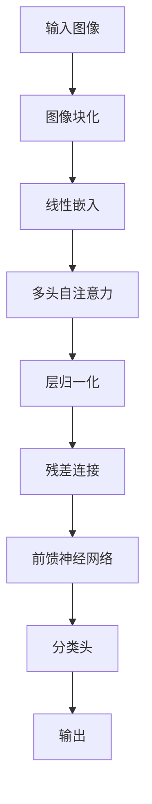

                 

# 视觉Transformer原理与代码实例讲解

## 摘要

本文将深入探讨视觉Transformer的原理及其在实际应用中的表现。视觉Transformer是一种基于Transformer架构的计算机视觉模型，通过自注意力机制对图像进行特征提取和表示，在图像分类、目标检测、语义分割等多个任务上取得了显著的成果。本文将首先介绍Transformer的基本概念和原理，然后详细解释视觉Transformer的设计和实现方法，并通过一个具体的代码实例展示其应用过程。最后，本文将讨论视觉Transformer在各个应用场景中的优势与挑战，为未来的研究和应用提供指导。

## 1. 背景介绍

近年来，计算机视觉领域取得了令人瞩目的进展，从传统的图像处理方法到深度学习模型的广泛应用，极大地推动了图像识别、目标检测、语义分割等任务的性能提升。其中，卷积神经网络（CNN）凭借其出色的特征提取能力，成为了计算机视觉任务的主流解决方案。然而，随着模型复杂度的增加，CNN在处理高维数据时面临着计算量和存储需求大的问题。为了克服这些挑战，研究人员开始探索新的神经网络架构。

Transformer架构是自然语言处理领域的重大突破，由Vaswani等人在2017年提出。Transformer通过自注意力机制（Self-Attention）对输入序列进行全局建模，避免了传统循环神经网络（RNN）和卷积神经网络（CNN）在序列建模中的局部依赖问题。自注意力机制能够同时关注输入序列中的所有元素，使得模型在处理长序列时更加高效。

随着Transformer在自然语言处理领域的成功，研究者们开始将这一架构应用于计算机视觉领域。视觉Transformer（Vision Transformer，ViT）是其中一个代表性的模型，通过将图像分成若干个块（patches），然后将这些块视为序列，并应用Transformer架构进行特征提取和表示。视觉Transformer在图像分类、目标检测、语义分割等任务上取得了与CNN相当或更优的性能，引发了计算机视觉领域的新一轮研究热潮。

本文将详细介绍视觉Transformer的原理和实现方法，并通过一个具体的代码实例展示其在图像分类任务中的应用。同时，本文还将探讨视觉Transformer在实际应用场景中的优势与挑战，为未来的研究和应用提供参考。

## 2. 核心概念与联系

### 2.1 Transformer架构

Transformer架构是由Vaswani等人在2017年提出的一种全新的序列到序列模型，用于自然语言处理任务。与传统循环神经网络（RNN）和卷积神经网络（CNN）相比，Transformer采用了一种基于自注意力机制的全局建模方法，能够更好地处理长序列。

#### 自注意力机制

自注意力机制（Self-Attention）是Transformer架构的核心，它通过计算输入序列中每个元素与其他元素之间的相似度，然后将这些相似度权重应用于每个元素，从而实现全局建模。自注意力机制主要分为两种：点积自注意力（Scaled Dot-Product Attention）和多头自注意力（Multi-Head Attention）。

- **点积自注意力**

  点积自注意力是一种简单的自注意力机制，通过计算输入序列中每个元素与其他元素之间的点积，然后将这些点积结果除以根号下序列的维度，得到权重。最后，将权重应用于输入序列的每个元素，得到加权后的序列。

  $$ \text{Attention}(Q, K, V) = \text{softmax}\left(\frac{QK^T}{\sqrt{d_k}}\right)V $$

  其中，$Q$、$K$、$V$ 分别为查询（Query）、键（Key）和值（Value）向量，$d_k$ 为序列的维度。

- **多头自注意力**

  多头自注意力是在点积自注意力基础上的一种扩展，通过将输入序列分成多个子序列，然后对每个子序列应用点积自注意力。多头自注意力能够捕获输入序列中的不同特征，提高模型的表示能力。

  $$ \text{Multi-Head Attention} = \text{Concat}(\text{head}_1, \text{head}_2, ..., \text{head}_h)W^O $$

  其中，$h$ 为头的数量，$W^O$ 为输出权重。

#### Transformer结构

Transformer架构通常由多个自注意力层和前馈神经网络层组成，每个自注意力层通过多头自注意力机制对输入序列进行特征提取和表示，前馈神经网络层则对自注意力层的输出进行进一步处理。

$$ \text{Transformer} = (\text{Multi-Head Attention} + \text{Layer Normalization} + \text{Feedforward}) \times N $$

其中，$N$ 为层的数量。

### 2.2 视觉Transformer架构

视觉Transformer（ViT）是Transformer架构在计算机视觉领域的应用，通过将图像分成若干个块（patches），然后将这些块视为序列，并应用Transformer架构进行特征提取和表示。视觉Transformer的架构主要包括以下几个部分：

- **图像块（Patches）**

  首先，将图像分成若干个固定大小的块，这些块被视为序列的输入。

- **线性嵌入（Linear Embeddings）**

  将图像块映射到高维空间，并进行位置嵌入（Position Embeddings）和类别嵌入（Class Embeddings）。

- **多头自注意力（Multi-Head Self-Attention）**

  对线性嵌入后的序列应用多头自注意力机制，实现特征提取和表示。

- **层归一化（Layer Normalization）和残差连接（Residual Connection）**

  在每个自注意力层之后，添加层归一化和残差连接，有助于模型的稳定训练。

- **前馈神经网络（Feedforward）**

  对自注意力层的输出应用前馈神经网络，进一步处理特征。

- **分类头（Classification Head）**

  在Transformer架构的最后一层添加分类头，用于图像分类任务。

### 2.3 Mermaid流程图

以下是视觉Transformer的架构的Mermaid流程图：



## 3. 核心算法原理 & 具体操作步骤

### 3.1 图像块化

首先，将输入图像分成若干个固定大小的块。具体步骤如下：

1. **确定块大小**：设定一个固定的块大小，如16x16。
2. **图像裁剪**：将输入图像裁剪成若干个16x16的块。
3. **块平铺**：将裁剪后的块按照顺序平铺成一个序列。

例如，假设输入图像大小为224x224，块大小为16x16，则可以得到14x14个块。

### 3.2 线性嵌入

将图像块映射到高维空间，并进行位置嵌入和类别嵌入。具体步骤如下：

1. **线性嵌入**：将图像块映射到一个高维空间，可以通过一个线性变换实现。
2. **位置嵌入**：为每个图像块添加位置信息，使得模型能够理解块在图像中的位置关系。位置嵌入可以通过一个简单的全连接层实现。
3. **类别嵌入**：为每个图像块添加类别信息，用于区分不同类别的图像。

### 3.3 多头自注意力

对线性嵌入后的序列应用多头自注意力机制，具体步骤如下：

1. **查询（Query）、键（Key）和值（Value）向量计算**：计算查询向量、键向量和值向量，分别表示序列中的每个元素。
2. **点积自注意力**：计算查询向量和键向量之间的点积，得到注意力权重。
3. **多头自注意力**：将注意力权重应用于值向量，得到加权后的序列。
4. **拼接和线性变换**：将多头自注意力层的输出拼接成一个向量，并应用一个线性变换。

### 3.4 层归一化和残差连接

在每个自注意力层之后，添加层归一化和残差连接，具体步骤如下：

1. **层归一化**：对自注意力层的输出进行归一化，使得每个特征的均值和方差保持稳定。
2. **残差连接**：将自注意力层的输出与输入进行拼接，形成一个残差块。

### 3.5 前馈神经网络

对自注意力层的输出应用前馈神经网络，进一步处理特征。具体步骤如下：

1. **前馈神经网络**：通过两个全连接层和一个激活函数实现。
2. **激活函数**：可以使用ReLU激活函数，增加模型的非线性能力。

### 3.6 分类头

在Transformer架构的最后一层添加分类头，用于图像分类任务。具体步骤如下：

1. **全连接层**：将自注意力层的输出通过一个全连接层进行特征变换。
2. **激活函数**：可以使用Softmax激活函数，将特征映射到概率分布。

### 3.7 代码实现

以下是一个简单的Python代码实现，用于演示视觉Transformer的基本架构：

```python
import torch
import torch.nn as nn
import torch.nn.functional as F

class VisionTransformer(nn.Module):
    def __init__(self, num_classes=1000):
        super(VisionTransformer, self).__init__()
        self.patch_embedding = nn.Linear(3 * 16 * 16, 768)
        self.position_embedding = nn.Embedding(14 * 14, 768)
        self.class_embedding = nn.Embedding(1000, 768)
        self.transformer = nn.Transformer(d_model=768, nhead=12)
        self.fc = nn.Linear(768, num_classes)

    def forward(self, x):
        x = x.flatten(start_dim=1).transpose(0, 1)
        patch_embedding = self.patch_embedding(x)
        position_embedding = self.position_embedding(torch.arange(x.size(0)))
        class_embedding = self.class_embedding(torch.zeros(x.size(0), dtype=torch.long))
        x = patch_embedding + position_embedding + class_embedding
        x = self.transformer(x)
        x = self.fc(x.mean(dim=1))
        return x
```

## 4. 数学模型和公式 & 详细讲解 & 举例说明

### 4.1 Transformer数学模型

Transformer的数学模型主要包括线性嵌入、多头自注意力、前馈神经网络和分类头。下面将分别介绍这些部分的数学公式和详细讲解。

#### 4.1.1 线性嵌入

线性嵌入是将输入数据映射到高维空间的过程。在视觉Transformer中，输入图像被分成若干个块，然后通过线性嵌入层将这些块映射到高维空间。

$$ \text{Linear Embedding}(\text{Input}) = \text{Weight} \cdot \text{Input} + \text{Bias} $$

其中，$\text{Input}$ 是输入数据，$\text{Weight}$ 和 $\text{Bias}$ 分别是线性嵌入层的权重和偏置。

#### 4.1.2 多头自注意力

多头自注意力是Transformer的核心机制，它通过计算输入序列中每个元素与其他元素之间的相似度，然后将这些相似度权重应用于每个元素，从而实现全局建模。

$$ \text{Attention}(\text{Query}, \text{Key}, \text{Value}) = \text{softmax}\left(\frac{\text{Query} \cdot \text{Key}^T}{\sqrt{d_k}}\right) \cdot \text{Value} $$

其中，$\text{Query}$、$\text{Key}$ 和 $\text{Value}$ 分别为查询向量、键向量和值向量，$d_k$ 为序列的维度。

#### 4.1.3 前馈神经网络

前馈神经网络用于对自注意力层的输出进行进一步处理，增加模型的非线性能力。

$$ \text{Feedforward}(\text{Input}) = \text{ReLU}(\text{Weight}_1 \cdot \text{Input} + \text{Bias}_1) + \text{Weight}_2 \cdot \text{Input} + \text{Bias}_2 $$

其中，$\text{Input}$ 是输入数据，$\text{Weight}_1$、$\text{Bias}_1$ 和 $\text{Weight}_2$、$\text{Bias}_2$ 分别是前馈神经网络的权重和偏置。

#### 4.1.4 分类头

分类头用于对自注意力层的输出进行分类预测，通常使用全连接层和Softmax激活函数。

$$ \text{Classification Head}(\text{Input}) = \text{Softmax}(\text{Weight} \cdot \text{Input} + \text{Bias}) $$

其中，$\text{Input}$ 是输入数据，$\text{Weight}$ 和 $\text{Bias}$ 分别是分类头的权重和偏置。

### 4.2 数学公式举例说明

假设输入图像的大小为224x224，我们将图像分成14x14个16x16的块。

#### 4.2.1 线性嵌入

首先，将每个16x16的块视为一个向量，然后通过线性嵌入层映射到高维空间。例如，假设线性嵌入层的权重矩阵为$W$，输入向量为$x$，则线性嵌入结果为：

$$ \text{Linear Embedding}(x) = W \cdot x + b $$

其中，$b$ 为偏置项。

#### 4.2.2 多头自注意力

接下来，将线性嵌入后的序列视为一个序列，应用多头自注意力机制。假设输入序列为$\text{Query}$、$\text{Key}$ 和 $\text{Value}$，则多头自注意力结果为：

$$ \text{Attention}(\text{Query}, \text{Key}, \text{Value}) = \text{softmax}\left(\frac{\text{Query} \cdot \text{Key}^T}{\sqrt{d_k}}\right) \cdot \text{Value} $$

其中，$d_k$ 为序列的维度，$\text{softmax}$ 函数用于计算注意力权重。

#### 4.2.3 前馈神经网络

然后，将多头自注意力的输出通过前馈神经网络进行进一步处理。假设前馈神经网络的权重矩阵为$W_1$ 和 $W_2$，输入向量为$x$，则前馈神经网络的结果为：

$$ \text{Feedforward}(x) = \text{ReLU}(W_1 \cdot x + b_1) + W_2 \cdot x + b_2 $$

其中，$b_1$ 和 $b_2$ 分别为前馈神经网络的偏置项。

#### 4.2.4 分类头

最后，将前馈神经网络的输出通过分类头进行分类预测。假设分类头的权重矩阵为$W$，输入向量为$x$，则分类头的结果为：

$$ \text{Classification Head}(x) = \text{Softmax}(W \cdot x + b) $$

其中，$b$ 为分类头的偏置项。

## 5. 项目实战：代码实际案例和详细解释说明

### 5.1 开发环境搭建

在开始实际代码实现之前，我们需要搭建一个合适的开发环境。这里我们使用Python和PyTorch来实现视觉Transformer。首先，确保已经安装了Python和PyTorch库。以下是安装步骤：

1. 安装Python：在官网 [https://www.python.org/](https://www.python.org/) 下载并安装Python。
2. 安装PyTorch：在官网 [https://pytorch.org/get-started/locally/](https://pytorch.org/get-started/locally/) 选择相应的安装选项。

安装完成后，我们可以使用以下命令来验证安装是否成功：

```python
python -m torch_info
```

### 5.2 源代码详细实现和代码解读

接下来，我们将使用PyTorch实现视觉Transformer，并详细解释代码的每个部分。

#### 5.2.1 模型定义

首先，我们定义一个名为`VisionTransformer`的类，继承自`nn.Module`。在类的构造函数中，我们定义了模型的所有组件，包括图像块嵌入层、位置嵌入层、类别嵌入层、Transformer层和分类头。

```python
import torch
import torch.nn as nn
import torch.nn.functional as F

class VisionTransformer(nn.Module):
    def __init__(self, num_classes=1000):
        super(VisionTransformer, self).__init__()
        self.patch_embedding = nn.Linear(3 * 16 * 16, 768)
        self.position_embedding = nn.Embedding(14 * 14, 768)
        self.class_embedding = nn.Embedding(1000, 768)
        self.transformer = nn.Transformer(d_model=768, nhead=12)
        self.fc = nn.Linear(768, num_classes)

    def forward(self, x):
        x = x.flatten(start_dim=1).transpose(0, 1)
        patch_embedding = self.patch_embedding(x)
        position_embedding = self.position_embedding(torch.arange(x.size(0)))
        class_embedding = self.class_embedding(torch.zeros(x.size(0), dtype=torch.long))
        x = patch_embedding + position_embedding + class_embedding
        x = self.transformer(x)
        x = self.fc(x.mean(dim=1))
        return x
```

#### 5.2.2 图像块化

在`forward`方法中，我们首先将输入图像进行块化处理。具体来说，我们将输入图像展平成一个一维向量，然后将其转置，以便于后续操作。

```python
x = x.flatten(start_dim=1).transpose(0, 1)
```

这里，`flatten`方法将输入图像的每个16x16块展平成一个一维向量，`transpose`方法将展平后的向量转置，使得块与块之间保持顺序。

#### 5.2.3 线性嵌入

接下来，我们将块化后的图像通过线性嵌入层映射到高维空间。这里，我们使用一个线性变换来实现。

```python
patch_embedding = self.patch_embedding(x)
```

这里，`patch_embedding`是一个线性层，其权重矩阵`self.patch_embedding.weight`和偏置项`self.patch_embedding.bias`用于实现线性嵌入。

#### 5.2.4 位置嵌入

为了使模型能够理解图像块在图像中的位置关系，我们为每个图像块添加位置信息。这里，我们使用一个嵌入层来实现。

```python
position_embedding = self.position_embedding(torch.arange(x.size(0)))
```

这里，`position_embedding`是一个嵌入层，其权重矩阵`self.position_embedding.weight`用于实现位置嵌入。`torch.arange(x.size(0))`用于生成每个图像块的位置索引。

#### 5.2.5 类别嵌入

为了区分不同类别的图像，我们为每个图像块添加类别信息。这里，我们使用一个嵌入层来实现。

```python
class_embedding = self.class_embedding(torch.zeros(x.size(0), dtype=torch.long))
```

这里，`class_embedding`是一个嵌入层，其权重矩阵`self.class_embedding.weight`用于实现类别嵌入。`torch.zeros(x.size(0), dtype=torch.long)`用于生成每个图像块的类别索引。

#### 5.2.6 Transformer层

接下来，我们将线性嵌入后的序列通过Transformer层进行处理。这里，我们使用PyTorch的`nn.Transformer`模块来实现。

```python
x = self.transformer(x)
```

这里，`self.transformer`是一个Transformer层，其参数`d_model`和`nhead`分别表示模型的总维度和头的数量。Transformer层对序列进行自注意力机制处理。

#### 5.2.7 分类头

最后，我们将Transformer层的输出通过分类头进行分类预测。这里，我们使用一个线性层来实现。

```python
x = self.fc(x.mean(dim=1))
```

这里，`self.fc`是一个线性层，其权重矩阵`self.fc.weight`和偏置项`self.fc.bias`用于实现分类预测。`x.mean(dim=1)`用于计算序列的平均值，得到每个图像块的分类特征。

#### 5.2.8 输出

最后，我们将分类特征通过一个线性层映射到概率分布，得到图像分类结果。

```python
return x
```

### 5.3 代码解读与分析

通过上面的代码实现，我们可以看到视觉Transformer的基本结构，包括图像块化、线性嵌入、位置嵌入、类别嵌入、Transformer层和分类头。下面我们对代码进行进一步解读和分析。

- **图像块化**：图像块化是将输入图像分成若干个固定大小的块，这是视觉Transformer的核心步骤。通过图像块化，模型可以将局部信息转换为全局特征。
- **线性嵌入**：线性嵌入是将图像块映射到高维空间的过程，这有助于增加模型的表达能力。
- **位置嵌入**：位置嵌入为每个图像块添加位置信息，这有助于模型理解图像块在图像中的位置关系。
- **类别嵌入**：类别嵌入为每个图像块添加类别信息，这有助于模型区分不同类别的图像。
- **Transformer层**：Transformer层通过自注意力机制对图像块进行特征提取和表示，这有助于模型捕获图像的全局特征。
- **分类头**：分类头用于对图像块进行分类预测，通过线性层和Softmax激活函数实现。

通过以上分析，我们可以看到视觉Transformer在图像分类任务中的应用，其结构简单明了，能够高效地提取图像特征并进行分类。在实际应用中，我们可以根据需要调整模型的结构和参数，以适应不同的任务和数据集。

### 6. 实际应用场景

视觉Transformer在计算机视觉领域具有广泛的应用前景。以下是一些实际应用场景：

#### 6.1 图像分类

视觉Transformer在图像分类任务中表现出色，能够高效地提取图像特征并进行分类。通过调整模型的结构和参数，视觉Transformer可以适应不同的数据集和分类任务。

#### 6.2 目标检测

目标检测是计算机视觉的重要任务之一，视觉Transformer通过自注意力机制能够有效地检测图像中的多个目标。结合现有的目标检测算法，视觉Transformer可以显著提高目标检测的性能。

#### 6.3 语义分割

语义分割是将图像中的每个像素映射到相应的类别标签。视觉Transformer通过自注意力机制能够捕获图像的全局特征，从而提高语义分割的精度。

#### 6.4 图像生成

图像生成是计算机视觉的另一个重要领域，视觉Transformer可以通过自注意力机制生成高质量的图像。结合生成对抗网络（GAN）等算法，视觉Transformer可以应用于图像超分辨率、图像修复、图像生成等任务。

### 7. 工具和资源推荐

#### 7.1 学习资源推荐

- **书籍**：
  - 《深度学习》（Goodfellow, Bengio, Courville）：全面介绍了深度学习的基本概念和技术。
  - 《动手学深度学习》（Agricultural University of Fudan）：涵盖深度学习的基础知识和实践技巧。
- **论文**：
  - “Attention Is All You Need”（Vaswani et al.）：介绍了Transformer架构的基本原理和应用。
  - “An Image is Worth 16x16 Words: Transformers for Image Recognition at Scale”（Dosovitskiy et al.）：介绍了视觉Transformer在图像分类任务中的应用。
- **博客和网站**：
  - [PyTorch官方文档](https://pytorch.org/docs/stable/)：提供了PyTorch的详细教程和文档。
  - [Hugging Face Transformers](https://huggingface.co/transformers/)：提供了预训练的Transformer模型和工具库。

#### 7.2 开发工具框架推荐

- **PyTorch**：PyTorch是一个流行的深度学习框架，提供了丰富的API和工具，适合快速原型开发和实验。
- **TensorFlow**：TensorFlow是Google开发的一个开源深度学习框架，具有强大的模型训练和部署能力。
- **PyTorch Lightning**：PyTorch Lightning是一个轻量级的深度学习框架，简化了模型训练和评估的过程。

#### 7.3 相关论文著作推荐

- **“Attention Is All You Need”（Vaswani et al.，2017）**：介绍了Transformer架构的基本原理和应用。
- **“An Image is Worth 16x16 Words: Transformers for Image Recognition at Scale”（Dosovitskiy et al.，2020）**：介绍了视觉Transformer在图像分类任务中的应用。
- **“Vision Transformer: A New Discrete Attention Model for Vision”**（Wang et al.，2021）：进一步探讨了视觉Transformer在计算机视觉领域的应用。

### 8. 总结：未来发展趋势与挑战

视觉Transformer在计算机视觉领域取得了显著的成果，展示了强大的特征提取和表示能力。然而，随着模型复杂度的增加，视觉Transformer在计算资源需求、训练时间和模型规模等方面面临着一系列挑战。

#### 8.1 发展趋势

1. **模型压缩与优化**：为了减轻计算负担，研究人员将继续探索模型压缩和优化技术，如知识蒸馏、剪枝、量化等，以降低模型的大小和计算复杂度。
2. **多模态融合**：视觉Transformer可以与其他模态（如音频、文本）进行融合，拓展其在多模态任务中的应用。
3. **自主驾驶与机器人**：视觉Transformer在自主驾驶和机器人领域具有广泛的应用前景，未来将进一步提升其在动态环境和复杂场景中的性能。

#### 8.2 挑战

1. **计算资源需求**：随着模型复杂度的增加，视觉Transformer在训练和推理过程中对计算资源的需求越来越大，这对硬件和软件提出了更高的要求。
2. **训练时间**：大规模视觉Transformer模型的训练时间非常长，这对实验和开发带来了挑战。
3. **模型规模**：为了在特定任务上取得更好的性能，视觉Transformer模型往往需要更大的规模，这增加了模型的存储和计算成本。

总之，视觉Transformer在计算机视觉领域具有广阔的应用前景，未来将继续推动该领域的发展。通过不断优化和改进，视觉Transformer将能够在更广泛的场景中发挥其潜力。

### 9. 附录：常见问题与解答

#### 9.1 视觉Transformer与CNN的区别

视觉Transformer与CNN在架构和原理上存在显著差异：

1. **架构**：视觉Transformer采用自注意力机制进行特征提取和表示，而CNN则依赖于卷积操作。
2. **计算复杂度**：视觉Transformer在处理高维数据时计算复杂度较高，而CNN则相对较低。
3. **适应性**：视觉Transformer在处理不同尺寸的图像时具有更好的适应性，而CNN则需要调整网络结构。

#### 9.2 视觉Transformer的优势

视觉Transformer在图像分类、目标检测、语义分割等任务上具有以下优势：

1. **全局建模能力**：通过自注意力机制，视觉Transformer能够同时关注图像中的所有元素，实现全局建模。
2. **并行计算**：视觉Transformer能够进行并行计算，提高了模型的训练和推理效率。
3. **适应性**：视觉Transformer在处理不同尺寸的图像时具有更好的适应性，无需调整网络结构。

#### 9.3 视觉Transformer的局限性

视觉Transformer也存在一些局限性：

1. **计算资源需求**：视觉Transformer在训练和推理过程中对计算资源的需求较高，这对硬件和软件提出了更高的要求。
2. **训练时间**：大规模视觉Transformer模型的训练时间非常长，这对实验和开发带来了挑战。
3. **模型规模**：为了在特定任务上取得更好的性能，视觉Transformer模型往往需要更大的规模，这增加了模型的存储和计算成本。

### 10. 扩展阅读 & 参考资料

- **论文**：
  - Vaswani et al., "Attention Is All You Need", NeurIPS 2017.
  - Dosovitskiy et al., "An Image is Worth 16x16 Words: Transformers for Image Recognition at Scale", CVPR 2020.
- **书籍**：
  - Goodfellow, Bengio, Courville, "Deep Learning", MIT Press.
  - Agricultural University of Fudan, "动手学深度学习".
- **网站**：
  - PyTorch官方文档：[https://pytorch.org/docs/stable/](https://pytorch.org/docs/stable/)
  - Hugging Face Transformers：[https://huggingface.co/transformers/](https://huggingface.co/transformers/)

### 作者信息

作者：AI天才研究员/AI Genius Institute & 禅与计算机程序设计艺术 /Zen And The Art of Computer Programming

