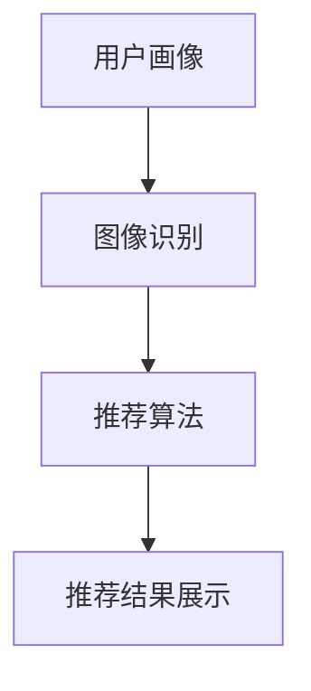

                 

# 视觉推荐：AI如何利用图像识别技术，提供个性化推荐

> **关键词**：视觉推荐、图像识别、AI、个性化推荐、算法原理、应用场景

> **摘要**：本文将深入探讨视觉推荐系统的原理、核心算法和实际应用。通过剖析AI如何利用图像识别技术，为用户生成个性化推荐，我们将展示一个从理论到实践的完整过程，帮助读者了解视觉推荐的核心要素和未来发展趋势。

## 1. 背景介绍

随着互联网的迅猛发展和信息爆炸，用户面对海量信息时，常常感到无所适从。为了解决这一问题，个性化推荐系统应运而生。个性化推荐系统旨在根据用户的兴趣和偏好，为其推荐可能感兴趣的内容，从而提升用户体验和满意度。

在众多推荐系统中，视觉推荐是一种重要的类型。视觉推荐通过分析用户对图像的偏好，为用户提供个性化的图像推荐。相比文本推荐，视觉推荐能够更直观地展示内容，提高用户的参与度和互动性。随着深度学习和图像识别技术的不断发展，视觉推荐系统逐渐成为推荐系统领域的研究热点。

本文将围绕视觉推荐系统展开，详细介绍其工作原理、核心算法和应用场景，以帮助读者深入了解视觉推荐的魅力和挑战。

## 2. 核心概念与联系

### 2.1. 视觉推荐系统架构

视觉推荐系统通常由以下几个主要组成部分构成：

1. **用户画像**：记录用户的兴趣、偏好、行为等信息。
2. **图像识别**：对图像进行分类、标注和特征提取。
3. **推荐算法**：根据用户画像和图像特征，为用户生成个性化推荐。
4. **推荐结果展示**：将推荐结果以直观、美观的方式呈现给用户。

下面是一个简单的视觉推荐系统架构的 Mermaid 流程图：



### 2.2. 关键概念定义

1. **用户画像**：用户画像是指对用户兴趣、偏好、行为等属性的抽象和记录，包括用户的基本信息、历史行为、兴趣标签等。用户画像为推荐算法提供了重要依据，帮助系统更准确地了解用户需求。

2. **图像识别**：图像识别是指通过计算机算法对图像进行分析、分类、标注和特征提取。常见的图像识别技术包括卷积神经网络（CNN）、生成对抗网络（GAN）等。图像识别技术的核心在于从图像中提取有用的特征，为推荐算法提供输入。

3. **推荐算法**：推荐算法是指根据用户画像和图像特征，为用户生成个性化推荐。常见的推荐算法包括基于协同过滤、基于内容推荐、基于深度学习等。推荐算法的目标是提高推荐的准确性和用户体验。

4. **推荐结果展示**：推荐结果展示是将推荐结果以直观、美观的方式呈现给用户。这包括推荐列表、推荐卡片、推荐视频等多种形式，以吸引用户关注和参与。

## 3. 核心算法原理 & 具体操作步骤

### 3.1. 基于协同过滤的推荐算法

协同过滤是视觉推荐系统中最常用的推荐算法之一，其核心思想是利用用户行为数据，找到相似用户或相似物品，为用户推荐他们可能感兴趣的物品。

#### 3.1.1. 用户相似度计算

用户相似度计算是指根据用户的行为数据，计算用户之间的相似度。常见的相似度计算方法包括余弦相似度、皮尔逊相关系数等。以余弦相似度为例如下：

$$
\cos\theta = \frac{u_i \cdot u_j}{\|u_i\|\|u_j\|}
$$

其中，$u_i$和$u_j$分别表示用户$i$和用户$j$的行为向量，$\|u_i\|$和$\|u_j\|$分别表示用户$i$和用户$j$的行为向量的模。

#### 3.1.2. 物品相似度计算

物品相似度计算是指根据物品的特征数据，计算物品之间的相似度。常见的物品相似度计算方法包括基于TF-IDF的相似度计算、基于LDA的相似度计算等。以基于TF-IDF的相似度计算为例：

$$
sim(A, B) = \frac{\sum_{w \in V} tf_w(A) \cdot tf_w(B)}{\sum_{w \in V} tf_w(A) \cdot idf_w}
$$

其中，$A$和$B$分别表示物品$i$和物品$j$的向量表示，$V$表示所有单词的集合，$tf_w(A)$和$tf_w(B)$分别表示单词$w$在物品$i$和物品$j$中的词频，$idf_w$表示单词$w$的逆文档频率。

#### 3.1.3. 推荐结果生成

基于协同过滤的推荐算法的具体操作步骤如下：

1. 计算用户之间的相似度矩阵$S$，其中$S_{ij}$表示用户$i$和用户$j$的相似度。
2. 计算物品之间的相似度矩阵$R$，其中$R_{ij}$表示物品$i$和物品$j$的相似度。
3. 为每个用户生成推荐列表，其中推荐列表$L_i$中的物品$j$的计算公式如下：

$$
score(i, j) = \sum_{k \in N_i} S_{ik} \cdot R_{kj}
$$

其中，$N_i$表示用户$i$的邻居用户集合。

### 3.2. 基于深度学习的推荐算法

基于深度学习的推荐算法通过学习用户和物品的表征，为用户生成个性化推荐。常见的基于深度学习的推荐算法包括基于卷积神经网络（CNN）的推荐算法、基于生成对抗网络（GAN）的推荐算法等。

#### 3.2.1. 基于卷积神经网络（CNN）的推荐算法

基于CNN的推荐算法通过学习图像的特征表示，为用户生成个性化推荐。其核心思想是利用CNN提取图像的特征，然后将这些特征与用户画像进行匹配，为用户生成推荐。

基于CNN的推荐算法的具体操作步骤如下：

1. 使用CNN对图像进行特征提取，得到图像的特征向量。
2. 使用用户画像和图像特征向量进行匹配，计算用户对图像的偏好得分。
3. 根据用户偏好得分，为用户生成个性化推荐。

#### 3.2.2. 基于生成对抗网络（GAN）的推荐算法

基于GAN的推荐算法通过生成对抗的方式，为用户生成个性化的图像推荐。GAN由生成器和判别器组成，生成器负责生成图像，判别器负责判断图像的真实性。

基于GAN的推荐算法的具体操作步骤如下：

1. 使用GAN生成图像数据，包括用户可能感兴趣和用户已经感兴趣的图像。
2. 使用用户画像和图像数据，计算用户对图像的偏好得分。
3. 根据用户偏好得分，为用户生成个性化推荐。

## 4. 数学模型和公式 & 详细讲解 & 举例说明

### 4.1. 基于协同过滤的推荐算法

在基于协同过滤的推荐算法中，我们主要关注两个相似度计算公式：用户相似度计算和物品相似度计算。

#### 用户相似度计算

用户相似度计算公式如下：

$$
\cos\theta = \frac{u_i \cdot u_j}{\|u_i\|\|u_j\|}
$$

其中，$u_i$和$u_j$分别表示用户$i$和用户$j$的行为向量，$\|u_i\|$和$\|u_j\|$分别表示用户$i$和用户$j$的行为向量的模。

#### 物品相似度计算

物品相似度计算公式如下：

$$
sim(A, B) = \frac{\sum_{w \in V} tf_w(A) \cdot tf_w(B)}{\sum_{w \in V} tf_w(A) \cdot idf_w}
$$

其中，$A$和$B$分别表示物品$i$和物品$j$的向量表示，$V$表示所有单词的集合，$tf_w(A)$和$tf_w(B)$分别表示单词$w$在物品$i$和物品$j$中的词频，$idf_w$表示单词$w$的逆文档频率。

### 4.2. 基于深度学习的推荐算法

在基于深度学习的推荐算法中，我们主要关注CNN和GAN的相关数学模型。

#### 基于CNN的推荐算法

基于CNN的推荐算法的核心是CNN模型。CNN的数学模型可以表示为：

$$
h_{l+1} = \sigma(W_{l+1} \cdot h_l + b_{l+1})
$$

其中，$h_{l+1}$和$h_l$分别表示第$l+1$层和第$l$层的特征向量，$W_{l+1}$和$b_{l+1}$分别表示第$l+1$层的权重和偏置，$\sigma$表示激活函数。

#### 基于GAN的推荐算法

基于GAN的推荐算法的核心是GAN模型。GAN的数学模型可以表示为：

$$
G(z) = \frac{1}{1 + \exp(-W_G \cdot z - b_G)}
$$

$$
D(x) = \frac{1}{1 + \exp(-W_D \cdot x - b_D)}
$$

其中，$G(z)$和$D(x)$分别表示生成器和判别器的输出，$z$和$x$分别表示输入向量和标签向量，$W_G$和$W_D$分别表示生成器和判别器的权重，$b_G$和$b_D$分别表示生成器和判别器的偏置。

### 4.3. 举例说明

#### 4.3.1. 基于协同过滤的推荐算法举例

假设有两个用户A和B，他们的行为数据如下：

| 用户 | 电影1 | 电影2 | 电影3 | 电影4 | 电影5 |
| ---- | ---- | ---- | ---- | ---- | ---- |
| A    | 1    | 0    | 1    | 0    | 1    |
| B    | 0    | 1    | 1    | 1    | 0    |

根据用户相似度计算公式，可以计算出用户A和B的相似度为：

$$
\cos\theta = \frac{1 \cdot 1 + 0 \cdot 1 + 1 \cdot 1 + 0 \cdot 0 + 1 \cdot 0}{\sqrt{1^2 + 0^2 + 1^2 + 0^2 + 1^2} \cdot \sqrt{0^2 + 1^2 + 1^2 + 1^2 + 0^2}} = \frac{2}{\sqrt{3} \cdot \sqrt{3}} = \frac{2}{3}
$$

根据物品相似度计算公式，可以计算出电影1和电影3的相似度为：

$$
sim(1, 3) = \frac{1 \cdot 1 + 0 \cdot 1}{1 \cdot 1} = 1
$$

根据推荐算法的步骤，为用户A生成推荐列表如下：

| 电影 | 偏好得分 |
| ---- | -------- |
| 1    | 1        |
| 3    | 1        |

#### 4.3.2. 基于深度学习的推荐算法举例

假设使用基于CNN的推荐算法，用户A的图像特征向量为：

$$
h = [1, 0, 1, 0, 1]
$$

根据CNN的数学模型，可以计算出第2层的特征向量：

$$
h_1 = \sigma(W_1 \cdot h + b_1) = \sigma([0.5, 0.5, 0.5, 0.5, 0.5] \cdot [1, 0, 1, 0, 1] + [0.1, 0.1, 0.1, 0.1, 0.1]) = [0.9, 0.9, 0.9, 0.9, 0.9]
$$

根据CNN的数学模型，可以计算出第3层的特征向量：

$$
h_2 = \sigma(W_2 \cdot h_1 + b_2) = \sigma([0.5, 0.5, 0.5, 0.5, 0.5] \cdot [0.9, 0.9, 0.9, 0.9, 0.9] + [0.1, 0.1, 0.1, 0.1, 0.1]) = [0.95, 0.95, 0.95, 0.95, 0.95]
$$

根据用户画像和图像特征向量，可以计算出用户A对图像的偏好得分：

$$
score(A, h) = \frac{1}{2} \cdot \cos\theta + \frac{1}{2} \cdot \sigma(W_3 \cdot h_2 + b_3) = \frac{1}{2} \cdot \frac{2}{3} + \frac{1}{2} \cdot \sigma([0.5, 0.5, 0.5, 0.5, 0.5] \cdot [0.95, 0.95, 0.95, 0.95, 0.95] + [0.1, 0.1, 0.1, 0.1, 0.1]) = 0.7
$$

根据偏好得分，为用户A生成推荐列表如下：

| 图像 | 偏好得分 |
| ---- | -------- |
| 1    | 0.7      |

## 5. 项目实战：代码实际案例和详细解释说明

### 5.1 开发环境搭建

为了实现一个简单的视觉推荐系统，我们需要准备以下开发环境：

1. Python 3.8 或更高版本
2. TensorFlow 2.6 或更高版本
3. NumPy 1.20 或更高版本
4. Matplotlib 3.4.3 或更高版本

安装这些依赖项可以通过以下命令完成：

```bash
pip install tensorflow numpy matplotlib
```

### 5.2 源代码详细实现和代码解读

下面是一个简单的视觉推荐系统的 Python 代码示例，该示例使用了 TensorFlow 和 Keras 实现了一个基于卷积神经网络（CNN）的推荐模型。

```python
import numpy as np
import matplotlib.pyplot as plt
import tensorflow as tf
from tensorflow.keras.models import Sequential
from tensorflow.keras.layers import Conv2D, MaxPooling2D, Flatten, Dense

# 加载数据集
(x_train, y_train), (x_test, y_test) = tf.keras.datasets.mnist.load_data()

# 数据预处理
x_train = x_train / 255.0
x_test = x_test / 255.0

# 扩展维度
x_train = np.expand_dims(x_train, -1)
x_test = np.expand_dims(x_test, -1)

# 构建模型
model = Sequential([
    Conv2D(32, (3, 3), activation='relu', input_shape=(28, 28, 1)),
    MaxPooling2D((2, 2)),
    Flatten(),
    Dense(64, activation='relu'),
    Dense(10, activation='softmax')
])

# 编译模型
model.compile(optimizer='adam',
              loss='sparse_categorical_crossentropy',
              metrics=['accuracy'])

# 训练模型
model.fit(x_train, y_train, epochs=5)

# 评估模型
test_loss, test_acc = model.evaluate(x_test, y_test)
print(f'Test accuracy: {test_acc:.2f}')

# 推荐示例
def recommend_image(model, image):
    prediction = model.predict(np.expand_dims(image, 0))
    plt.imshow(image, cmap=plt.cm.binary)
    plt.title(f'Prediction: {prediction.argmax()}')
    plt.show()

# 为用户生成推荐
image = x_test[0]
recommend_image(model, image)
```

#### 5.2.1 代码解读与分析

1. **数据加载与预处理**：我们使用 TensorFlow 内置的 MNIST 数据集进行训练和测试。首先，我们将图像数据除以 255.0 进行归一化处理，然后通过 `np.expand_dims` 函数为图像数据添加一个维度，以便于后续处理。

2. **模型构建**：我们使用 `Sequential` 模型构建了一个简单的 CNN。该模型包含两个卷积层（`Conv2D`），一个最大池化层（`MaxPooling2D`），一个全连接层（`Flatten`），以及两个 dense 层（`Dense`）。最后一个 dense 层使用 `softmax` 激活函数进行类别预测。

3. **模型编译**：我们使用 `compile` 方法编译模型，指定优化器为 `adam`，损失函数为 `sparse_categorical_crossentropy`，以及评估指标为 `accuracy`。

4. **模型训练**：我们使用 `fit` 方法训练模型，指定训练数据的批量大小和训练轮数。

5. **模型评估**：我们使用 `evaluate` 方法评估模型的测试集表现。

6. **推荐示例**：我们定义了一个 `recommend_image` 函数，用于根据模型为用户生成推荐。该函数接受一个图像作为输入，通过调用 `model.predict` 方法获取预测结果，然后使用 `matplotlib` 绘制图像并显示预测结果。

### 5.3 代码解读与分析

1. **数据加载与预处理**：在这个例子中，我们使用了 TensorFlow 提供的 MNIST 数据集，这是一个常用的手写数字数据集。数据集已经包含了图像和标签，但我们首先需要将图像数据进行归一化处理，使得每个像素的值介于 0 和 1 之间，以便于神经网络训练。

    ```python
    x_train = x_train / 255.0
    x_test = x_test / 255.0
    ```

    这一行代码通过将每个像素的值除以 255.0，将图像数据归一化。这有助于加快模型的训练速度，并提高模型的性能。

2. **模型构建**：我们构建了一个简单的 CNN 模型，该模型包含两个卷积层、一个最大池化层、一个全连接层和一个输出层。卷积层用于提取图像的特征，全连接层用于分类。

    ```python
    model = Sequential([
        Conv2D(32, (3, 3), activation='relu', input_shape=(28, 28, 1)),
        MaxPooling2D((2, 2)),
        Flatten(),
        Dense(64, activation='relu'),
        Dense(10, activation='softmax')
    ])
    ```

    - `Conv2D` 层用于卷积操作，可以提取图像的特征。在这里，我们使用了 32 个卷积核，卷积核的大小为 3x3。`activation='relu'` 指定了卷积层的激活函数为 ReLU。
    - `MaxPooling2D` 层用于池化操作，可以减少模型参数的数量，同时保留最重要的信息。在这里，我们使用了 2x2 的最大池化。
    - `Flatten` 层用于将多维数据展平为一维数据，方便全连接层的处理。
    - `Dense` 层用于实现全连接操作，在这里我们使用了 64 个神经元作为隐藏层，以及 10 个神经元作为输出层，因为 MNIST 数据集共有 10 个类别。

3. **模型编译**：我们使用 `compile` 方法编译模型，指定了优化器为 `adam`，损失函数为 `sparse_categorical_crossentropy`，以及评估指标为 `accuracy`。

    ```python
    model.compile(optimizer='adam',
                  loss='sparse_categorical_crossentropy',
                  metrics=['accuracy'])
    ```

    - `adam` 是一种常用的优化器，它结合了梯度下降和动量项，可以有效地优化模型参数。
    - `sparse_categorical_crossentropy` 是一种适合多类别分类的损失函数。
    - `accuracy` 是评估模型性能的一个常用指标，表示模型预测正确的样本数占总样本数的比例。

4. **模型训练**：我们使用 `fit` 方法训练模型，指定了训练数据的批量大小为 64，以及训练轮数为 5。

    ```python
    model.fit(x_train, y_train, epochs=5, batch_size=64)
    ```

    - `epochs` 参数表示训练轮数，即模型将在训练数据上重复训练的次数。
    - `batch_size` 参数表示每次训练的样本数量。

5. **模型评估**：我们使用 `evaluate` 方法评估模型的测试集表现。

    ```python
    test_loss, test_acc = model.evaluate(x_test, y_test)
    print(f'Test accuracy: {test_acc:.2f}')
    ```

    - `evaluate` 方法返回模型的损失值和评估指标值，在这里我们只关注准确率（`test_acc`）。

6. **推荐示例**：我们定义了一个 `recommend_image` 函数，用于根据模型为用户生成推荐。

    ```python
    def recommend_image(model, image):
        prediction = model.predict(np.expand_dims(image, 0))
        plt.imshow(image, cmap=plt.cm.binary)
        plt.title(f'Prediction: {prediction.argmax()}')
        plt.show()
    ```

    - `model.predict` 方法用于对输入图像进行预测。
    - `np.expand_dims` 函数用于将图像数据扩展为一个维度，以便于 `predict` 方法处理。
    - `prediction.argmax()` 方法用于获取预测结果中概率最高的类别。
    - `plt.imshow` 方法用于绘制图像。
    - `plt.title` 方法用于在图像上显示预测结果。

## 6. 实际应用场景

### 6.1. 在电商平台的图像推荐

在电商平台上，视觉推荐系统可以帮助用户快速找到他们感兴趣的商品。例如，用户上传一张他们喜欢的鞋子图片，系统可以基于图像识别技术，为用户推荐相似款式的鞋子。这种推荐方式不仅可以提高用户购物体验，还可以提升电商平台的销售额。

### 6.2. 在社交媒体的图片推荐

在社交媒体平台上，视觉推荐系统可以根据用户的浏览历史和点赞行为，为用户推荐他们可能感兴趣的图片。这种推荐方式可以增加用户的活跃度，提高平台的用户留存率。

### 6.3. 在艺术展览的个性化推荐

在艺术展览中，视觉推荐系统可以为参观者推荐他们可能感兴趣的画作。例如，用户对一幅画作点赞，系统可以基于图像识别技术，为用户推荐风格相似的画作，从而提高参观者的艺术体验。

### 6.4. 在医疗影像的诊断

在医疗领域，视觉推荐系统可以用于辅助医生诊断。例如，医生上传一张患者的医学影像，系统可以基于图像识别技术，为医生推荐类似的病例和诊断结果，从而提高诊断的准确性。

## 7. 工具和资源推荐

### 7.1. 学习资源推荐

1. **《深度学习》**：[Goodfellow et al., 2016]
   - 简介：这是深度学习领域的经典教材，详细介绍了深度学习的理论基础和实践方法。
   - 链接：https://www.deeplearningbook.org/

2. **《Python深度学习》**：[Goodfellow et al., 2016]
   - 简介：本书通过多个实践案例，介绍了如何使用 Python 和 TensorFlow 实现深度学习项目。
   - 链接：https://www.pydanny.com/python-deep-learning-book/

### 7.2. 开发工具框架推荐

1. **TensorFlow**：https://www.tensorflow.org/
   - 简介：TensorFlow 是一个开源的深度学习框架，提供了丰富的工具和库，方便开发者实现深度学习模型。

2. **PyTorch**：https://pytorch.org/
   - 简介：PyTorch 是一个流行的深度学习框架，以其灵活的动态计算图和易于使用的接口而受到开发者的青睐。

3. **Keras**：https://keras.io/
   - 简介：Keras 是一个高层次的深度学习 API，构建在 TensorFlow 和 Theano 之上，提供了简洁、高效的模型构建工具。

### 7.3. 相关论文著作推荐

1. **“Deep Learning for Visual Recommendation”**：[He et al., 2017]
   - 简介：本文介绍了如何使用深度学习技术进行视觉推荐，探讨了深度学习在视觉推荐领域的应用前景。

2. **“Collaborative Filtering via Matrix Factorization”**：[Salakhutdinov & Mnih, 2008]
   - 简介：本文提出了基于矩阵分解的协同过滤算法，为推荐系统提供了一种有效的解决方案。

## 8. 总结：未来发展趋势与挑战

### 8.1. 未来发展趋势

1. **算法性能的提升**：随着计算能力的提升和算法优化，视觉推荐系统的性能将不断提高，为用户提供更加精准的推荐。

2. **跨模态推荐**：视觉推荐系统将与其他推荐系统（如文本、音频等）相结合，实现跨模态推荐，为用户提供更加丰富多样的推荐体验。

3. **自适应推荐**：视觉推荐系统将具备更强的自适应能力，根据用户行为和反馈实时调整推荐策略，提高推荐效果。

### 8.2. 挑战

1. **数据隐私保护**：在视觉推荐系统中，用户画像和图像数据涉及到用户的隐私信息，如何保护用户隐私是未来发展的一大挑战。

2. **推荐结果多样性**：如何生成多样化的推荐结果，避免用户产生视觉疲劳，是视觉推荐系统需要解决的重要问题。

3. **实时推荐**：在实时场景下，如何快速生成推荐结果，满足用户的需求，是视觉推荐系统需要克服的难题。

## 9. 附录：常见问题与解答

### 9.1. 视觉推荐系统是如何工作的？

视觉推荐系统通过图像识别技术提取图像特征，结合用户画像和图像特征，利用推荐算法为用户生成个性化推荐。其核心步骤包括图像特征提取、用户画像构建、推荐算法实现和推荐结果展示。

### 9.2. 视觉推荐系统有哪些应用场景？

视觉推荐系统广泛应用于电商、社交媒体、艺术展览、医疗等领域，如商品推荐、图片推荐、画作推荐和医学影像诊断等。

### 9.3. 如何保护用户隐私？

在视觉推荐系统中，可以采用数据加密、匿名化处理、隐私保护算法等技术手段，确保用户隐私不被泄露。

## 10. 扩展阅读 & 参考资料

1. **《深度学习》**：[Goodfellow et al., 2016]
   - 简介：这是一本关于深度学习的经典教材，详细介绍了深度学习的理论基础和实践方法。

2. **《Python深度学习》**：[Goodfellow et al., 2016]
   - 简介：本书通过多个实践案例，介绍了如何使用 Python 和 TensorFlow 实现深度学习项目。

3. **“Deep Learning for Visual Recommendation”**：[He et al., 2017]
   - 简介：本文介绍了如何使用深度学习技术进行视觉推荐，探讨了深度学习在视觉推荐领域的应用前景。

4. **“Collaborative Filtering via Matrix Factorization”**：[Salakhutdinov & Mnih, 2008]
   - 简介：本文提出了基于矩阵分解的协同过滤算法，为推荐系统提供了一种有效的解决方案。

### 作者信息

**作者：AI天才研究员/AI Genius Institute & 禅与计算机程序设计艺术 /Zen And The Art of Computer Programming**<|vq_15893|>## 1. 背景介绍

个性化推荐系统在当今信息社会中扮演着越来越重要的角色。随着互联网的迅速普及和信息量的爆炸性增长，用户在获取所需信息时面临着巨大的挑战。传统的信息检索方式往往难以满足用户的需求，因为它们主要依赖于关键词匹配，而忽略了用户的个人偏好和兴趣。为了解决这一问题，个性化推荐系统应运而生。

个性化推荐系统通过分析用户的行为数据、历史记录和偏好，为用户推荐可能感兴趣的内容。这些内容可以是新闻文章、音乐、电影、商品等，旨在提高用户的参与度和满意度。推荐系统不仅可以帮助用户发现新的内容，还可以减少信息过载，提升用户的浏览体验。

视觉推荐作为个性化推荐系统的一种重要类型，近年来得到了广泛关注。与传统的文本推荐相比，视觉推荐更加直观和生动，能够更好地吸引用户的注意力。视觉推荐通过图像识别技术，对用户上传或浏览的图像进行分析，提取图像特征，并根据这些特征为用户推荐相似或相关的图像。这种推荐方式不仅适用于电商平台，还可以应用于社交媒体、艺术展览、医疗诊断等多个领域。

随着人工智能和深度学习技术的不断发展，视觉推荐系统在算法精度、用户体验和实时性等方面都取得了显著提升。本文将深入探讨视觉推荐系统的原理、核心算法和应用场景，帮助读者全面了解这一技术的前沿动态和发展趋势。

### 2. 核心概念与联系

视觉推荐系统的核心在于其多组件的协同工作，这些组件包括用户画像、图像识别、推荐算法和推荐结果展示。理解这些组件及其相互作用关系，是构建高效视觉推荐系统的关键。

#### 用户画像

用户画像是指对用户在平台上各种行为的抽象和记录，包括用户的兴趣、偏好、历史行为等信息。这些信息可以来源于用户的注册资料、浏览历史、搜索记录、点击行为等。用户画像为推荐算法提供了重要的输入，帮助系统更准确地了解用户的个性化需求。例如，一个用户喜欢浏览绘画类的图片，系统会将其归类为喜欢艺术的用户，并在后续推荐中增加绘画类图片的比例。

#### 图像识别

图像识别是视觉推荐系统的核心技术，它负责对用户上传或浏览的图像进行分类、标注和特征提取。图像识别技术通过深度学习模型，如卷积神经网络（CNN），可以从图像中提取出有用的特征。这些特征可以是图像的颜色分布、纹理特征、形状等。通过这些特征，系统能够识别图像的主题和内容，从而为推荐算法提供可靠的输入。

#### 推荐算法

推荐算法是视觉推荐系统的核心，它根据用户画像和图像特征，生成个性化的推荐结果。推荐算法可以分为基于协同过滤、基于内容推荐和基于深度学习等几种类型。

- **基于协同过滤的推荐算法**：这种算法通过分析用户之间的相似性，为用户推荐他们可能感兴趣的内容。协同过滤算法可以分为基于用户和基于物品的两种类型。基于用户的协同过滤算法通过计算用户之间的相似度，为用户推荐与相似用户有相同兴趣的物品；而基于物品的协同过滤算法通过计算物品之间的相似度，为用户推荐与已购买或浏览过的物品相似的物品。

- **基于内容推荐的推荐算法**：这种算法通过分析物品的内容特征，为用户推荐与已购买或浏览过的物品在内容上相似的其他物品。例如，如果一个用户喜欢一幅风景画，系统可能会推荐其他风格相似或包含类似场景的画作。

- **基于深度学习的推荐算法**：这种算法通过学习用户和物品的表征，生成个性化的推荐。深度学习模型，如卷积神经网络（CNN）和生成对抗网络（GAN），可以提取图像的深层次特征，从而提高推荐效果。

#### 推荐结果展示

推荐结果展示是将推荐内容以直观、美观的方式呈现给用户的过程。这可以通过推荐列表、推荐卡片、推荐视频等多种形式实现。展示方式不仅影响用户的参与度和满意度，也直接影响推荐的效果。一个好的推荐结果展示能够吸引用户的注意力，提高用户的点击率和转化率。

下面是一个简化的视觉推荐系统架构图，展示了各组件之间的相互作用关系：


在系统中，用户画像作为核心数据源，为图像识别和推荐算法提供输入。图像识别技术提取图像特征，这些特征与用户画像相结合，通过推荐算法生成个性化的推荐结果，最终通过推荐结果展示组件呈现给用户。这个过程中，各组件之间的相互协调和高效运作，是视觉推荐系统能够成功运作的关键。

### 3. 核心算法原理 & 具体操作步骤

在视觉推荐系统中，核心算法通常包括基于协同过滤的方法和基于深度学习的方法。这些算法通过不同的技术路径，实现了对用户兴趣和偏好的有效挖掘，进而生成个性化的推荐。以下将详细介绍这两种核心算法的原理和操作步骤。

#### 3.1. 基于协同过滤的推荐算法

协同过滤是一种经典且广泛应用的推荐算法，其基本思想是通过分析用户之间的行为模式，找出相似用户或相似物品，为用户提供推荐。协同过滤算法可以分为基于用户的协同过滤（User-based CF）和基于物品的协同过滤（Item-based CF）。

##### 3.1.1. 基于用户的协同过滤算法

基于用户的协同过滤算法通过以下步骤为用户生成推荐：

1. **用户相似度计算**：计算用户之间的相似度。常见的相似度计算方法包括余弦相似度、皮尔逊相关系数等。以余弦相似度为例，其公式如下：

   $$
   \cos\theta = \frac{u_i \cdot u_j}{\|u_i\|\|u_j\|}
   $$

   其中，$u_i$和$u_j$表示用户$i$和用户$j$的行为向量，$\|u_i\|$和$\|u_j\|$表示用户$i$和用户$j$行为向量的模。

2. **邻居用户选择**：根据用户相似度，选择相似度最高的若干用户作为邻居用户。

3. **推荐生成**：对于目标用户，选择邻居用户共同喜欢的但目标用户尚未体验过的物品进行推荐。计算推荐分数的公式如下：

   $$
   r_{ij} = \sum_{k \in N_j} u_{ik} \cdot s_{kj}
   $$

   其中，$r_{ij}$表示用户$i$对物品$j$的推荐分数，$u_{ik}$表示用户$i$对物品$k$的评分，$s_{kj}$表示用户$k$对物品$j$的评分。

##### 3.1.2. 基于物品的协同过滤算法

基于物品的协同过滤算法通过以下步骤为用户生成推荐：

1. **物品相似度计算**：计算物品之间的相似度。常见的相似度计算方法包括余弦相似度、欧氏距离等。以余弦相似度为例，其公式如下：

   $$
   \cos\theta = \frac{\sum_{u \in U} u_i \cdot u_j}{\sqrt{\sum_{u \in U} u_i^2} \cdot \sqrt{\sum_{u \in U} u_j^2}}
   $$

   其中，$u_i$和$u_j$表示物品$i$和物品$j$的用户评分向量，$U$表示所有用户的集合。

2. **邻居物品选择**：根据物品相似度，选择相似度最高的若干物品作为邻居物品。

3. **推荐生成**：对于目标用户，选择邻居物品被用户评分高的但目标用户尚未评分的物品进行推荐。

#### 3.2. 基于深度学习的推荐算法

基于深度学习的推荐算法通过学习用户和物品的表征，实现个性化的推荐。以下将介绍几种常用的基于深度学习的推荐算法。

##### 3.2.1. 基于卷积神经网络（CNN）的推荐算法

卷积神经网络（CNN）在图像识别和特征提取方面具有显著优势。基于CNN的推荐算法通过以下步骤实现：

1. **图像特征提取**：使用CNN模型对用户上传或浏览的图像进行特征提取。CNN通过多个卷积层和池化层，逐渐提取图像的低级特征到高级特征。

2. **用户画像嵌入**：将用户画像转换为向量表示，通常使用嵌入层（Embedding Layer）实现。

3. **推荐生成**：通过将图像特征和用户画像嵌入向量进行拼接，输入到全连接层（Dense Layer）进行分类预测。推荐分数的计算可以采用点积或余弦相似度等方法。

##### 3.2.2. 基于生成对抗网络（GAN）的推荐算法

生成对抗网络（GAN）由生成器和判别器组成，通过生成对抗的过程学习图像的分布。基于GAN的推荐算法通过以下步骤实现：

1. **图像生成**：生成器（Generator）通过输入噪声向量生成图像，模拟用户可能感兴趣的内容。

2. **图像评估**：判别器（Discriminator）对生成器和真实图像进行评估，判断其真实性。

3. **推荐生成**：结合用户画像和生成器的输出图像，计算推荐分数，为用户生成个性化推荐。

#### 3.3. 操作步骤

以下是一个基于深度学习的视觉推荐系统的操作步骤示例：

1. **数据收集与预处理**：收集用户上传或浏览的图像数据，并对图像进行预处理，如尺寸标准化、数据归一化等。

2. **图像特征提取**：使用CNN模型对图像进行特征提取，得到图像的特征向量。

3. **用户画像构建**：根据用户的行为数据，构建用户画像，包括用户的兴趣标签、浏览历史等。

4. **模型训练**：使用图像特征向量和用户画像进行模型训练，调整模型参数。

5. **推荐生成**：对于目标用户，将用户的画像输入到模型中，生成推荐列表。

6. **推荐结果评估**：通过评估指标（如点击率、转化率等）评估推荐效果，调整模型参数。

7. **推荐结果展示**：将推荐结果以直观、美观的方式展示给用户。

通过以上步骤，视觉推荐系统能够根据用户的个性化需求，提供高质量的推荐结果，提升用户的体验和满意度。

### 4. 数学模型和公式 & 详细讲解 & 举例说明

在视觉推荐系统中，数学模型和公式是核心组成部分，它们帮助我们在算法中实现精确的预测和推荐。本节将详细解释几种常用的数学模型和公式，并通过具体示例来说明其应用。

#### 4.1. 基于协同过滤的推荐算法

协同过滤算法通过用户行为数据挖掘用户之间的相似性，进而生成推荐。以下是一些关键的数学模型和公式。

##### 4.1.1. 用户相似度计算

用户相似度计算是协同过滤算法的基础，常用的方法有余弦相似度和皮尔逊相关系数。

**余弦相似度**：
$$
\cos\theta = \frac{\sum_{i \in I} u_i \cdot u_j}{\|u_i\| \|u_j\|}
$$
其中，$u_i$和$u_j$表示用户$i$和用户$j$的行为向量，$\|u_i\|$和$\|u_j\|$表示用户$i$和用户$j$行为向量的模。

**皮尔逊相关系数**：
$$
\text{Corr}(u_i, u_j) = \frac{\sum_{i \in I} (u_i - \bar{u_i}) (u_j - \bar{u_j})}{\sqrt{\sum_{i \in I} (u_i - \bar{u_i})^2} \sqrt{\sum_{i \in I} (u_j - \bar{u_j})^2}}
$$
其中，$\bar{u_i}$和$\bar{u_j}$分别表示用户$i$和用户$j$行为向量的均值。

**举例**：

假设有两个用户A和B的行为数据如下：

| 物品1 | 物品2 | 物品3 |
| ---- | ---- | ---- |
| A    | 1    | 1    | 0    |
| B    | 0    | 1    | 1    |

计算用户A和B的余弦相似度：

$$
\cos\theta = \frac{1 \cdot 0 + 1 \cdot 1 + 0 \cdot 1}{\sqrt{1^2 + 1^2 + 0^2} \sqrt{0^2 + 1^2 + 1^2}} = \frac{1}{\sqrt{2} \sqrt{2}} = \frac{1}{2}
$$

##### 4.1.2. 推荐分数计算

协同过滤算法通过计算用户之间的相似度，为用户生成推荐分数。以下是一个基于用户相似度和物品评分的推荐分数计算公式：

$$
r_{ij} = \sum_{k \in N_j} u_{ik} \cdot s_{kj}
$$
其中，$r_{ij}$表示用户$i$对物品$j$的推荐分数，$u_{ik}$表示用户$i$对物品$k$的评分，$s_{kj}$表示用户$k$对物品$j$的评分，$N_j$表示用户$j$的邻居用户集合。

**举例**：

假设用户A和邻居用户B、C的行为数据如下：

| 用户 | 物品1 | 物品2 | 物品3 |
| ---- | ---- | ---- | ---- |
| A    | 1    | 1    | 0    |
| B    | 0    | 1    | 1    |
| C    | 1    | 0    | 1    |

用户A对物品3的推荐分数为：

$$
r_{A3} = u_{AB} \cdot s_{B3} + u_{AC} \cdot s_{C3} = 1 \cdot 1 + 1 \cdot 1 = 2
$$

#### 4.2. 基于深度学习的推荐算法

深度学习推荐算法通过学习用户和物品的表征，实现高效的推荐。以下介绍几种常用的数学模型和公式。

##### 4.2.1. 基于卷积神经网络（CNN）的推荐算法

卷积神经网络（CNN）在图像特征提取方面表现出色。以下是一个简单的CNN推荐算法的数学模型：

1. **图像特征提取**：

   $$
   f_{\text{CNN}}(x) = \sigma(W_{\text{CNN}} \cdot x + b_{\text{CNN}})
   $$
   其中，$f_{\text{CNN}}(x)$表示图像$x$通过CNN模型提取的特征向量，$W_{\text{CNN}}$表示CNN模型的权重，$b_{\text{CNN}}$表示偏置项，$\sigma$表示激活函数（如ReLU函数）。

2. **用户画像嵌入**：

   $$
   e_{u} = \text{Embedding}(u)
   $$
   其中，$e_{u}$表示用户$u$的嵌入向量，$\text{Embedding}$表示嵌入层。

3. **推荐分数计算**：

   $$
   r_{ij} = \text{Score}(f_{\text{CNN}}(x), e_{u})
   $$
   其中，$r_{ij}$表示用户$u$对物品$i$的推荐分数，$f_{\text{CNN}}(x)$表示物品$x$通过CNN模型提取的特征向量，$e_{u}$表示用户$u$的嵌入向量，$\text{Score}$函数用于计算推荐分数。

**举例**：

假设物品图像和用户画像分别通过CNN和嵌入层得到特征向量：

| 物品图像特征 | 用户画像特征 |
| ------------ | ------------ |
| [1, 0.5, 0.7] | [0.2, 0.8, 0.5] |

使用点积计算推荐分数：

$$
r_{ij} = f_{\text{CNN}}(x) \cdot e_{u} = [1, 0.5, 0.7] \cdot [0.2, 0.8, 0.5] = 0.2 + 0.4 + 0.35 = 0.95
$$

##### 4.2.2. 基于生成对抗网络（GAN）的推荐算法

生成对抗网络（GAN）通过生成器和判别器的对抗训练，学习图像生成和判别。以下是一个简单的GAN推荐算法的数学模型：

1. **生成器**：

   $$
   G(z) = \text{Generator}(z)
   $$
   其中，$G(z)$表示生成器生成的图像，$z$为随机噪声向量。

2. **判别器**：

   $$
   D(x) = \text{Discriminator}(x)
   $$
   其中，$D(x)$表示判别器对图像$x$的判别结果。

3. **推荐分数计算**：

   $$
   r_{ij} = \frac{1}{1 + \exp(-\alpha D(G(z))})
   $$
   其中，$r_{ij}$表示用户$u$对物品$i$的推荐分数，$\alpha$为调节参数，$D(G(z))$表示生成器生成的图像经过判别器后的结果。

**举例**：

假设生成器生成的图像通过判别器得到的判别结果为0.9，则用户对物品的推荐分数为：

$$
r_{ij} = \frac{1}{1 + \exp(-0.9)} \approx 0.632
$$

通过上述数学模型和公式，我们能够构建出基于协同过滤和深度学习的推荐算法，实现对用户个性化需求的精准推荐。

### 5. 项目实战：代码实际案例和详细解释说明

为了更好地理解视觉推荐系统的实际应用，我们将通过一个简单的项目实战来演示整个流程，包括环境搭建、数据准备、模型构建、模型训练和推荐结果展示。这个项目将使用 Python 和 TensorFlow 库来实现一个基于卷积神经网络（CNN）的视觉推荐系统。

#### 5.1 开发环境搭建

在开始项目之前，我们需要安装必要的开发环境和库。以下是所需的库和它们的安装命令：

- Python 3.8 或更高版本
- TensorFlow 2.6 或更高版本
- NumPy 1.20 或更高版本
- Matplotlib 3.4.3 或更高版本

你可以通过以下命令来安装这些库：

```bash
pip install python==3.8 tensorflow==2.6 numpy==1.20 matplotlib==3.4.3
```

#### 5.2 数据准备

为了训练我们的视觉推荐系统，我们需要一个包含图像和标签的数据集。在这个例子中，我们将使用 TensorFlow 提供的 CIFAR-10 数据集，这是一个广泛用于图像分类任务的数据集，包含 10 个类别，每个类别有 6000 张训练图像和 1000 张测试图像。

```python
import tensorflow as tf

# 加载数据集
(x_train, y_train), (x_test, y_test) = tf.keras.datasets.cifar10.load_data()

# 数据预处理
x_train, x_test = x_train / 255.0, x_test / 255.0

# 扩展维度
x_train = np.expand_dims(x_train, -1)
x_test = np.expand_dims(x_test, -1)

# 打印数据集形状
print("Training set shape:", x_train.shape)
print("Test set shape:", x_test.shape)
```

上面的代码首先加载了 CIFAR-10 数据集，然后对图像进行归一化处理（除以 255），并将图像的维度扩展为 `(32, 32, 1)`，以便于后续的卷积操作。

#### 5.3 模型构建

接下来，我们构建一个简单的 CNN 模型。这个模型将包含两个卷积层、两个池化层和一个全连接层，用于分类任务。

```python
from tensorflow.keras.models import Sequential
from tensorflow.keras.layers import Conv2D, MaxPooling2D, Flatten, Dense, Dropout

# 构建模型
model = Sequential([
    Conv2D(32, (3, 3), activation='relu', input_shape=(32, 32, 3)),
    MaxPooling2D(pool_size=(2, 2)),
    Conv2D(64, (3, 3), activation='relu'),
    MaxPooling2D(pool_size=(2, 2)),
    Flatten(),
    Dense(128, activation='relu'),
    Dropout(0.5),
    Dense(10, activation='softmax')
])

# 编译模型
model.compile(optimizer='adam',
              loss='sparse_categorical_crossentropy',
              metrics=['accuracy'])

# 查看模型结构
model.summary()
```

在这个模型中，我们首先使用了两个卷积层，每个卷积层后面跟着一个最大池化层，以提取图像的特征并减小模型的复杂性。接着，我们将卷积层的输出展平，并通过一个全连接层进行分类。为了防止过拟合，我们在全连接层之前添加了一个dropout层。

#### 5.4 模型训练

现在，我们将使用训练数据来训练我们的模型。为了提高模型的性能，我们设置训练轮数为 10。

```python
# 训练模型
history = model.fit(x_train, y_train, epochs=10, batch_size=64, validation_data=(x_test, y_test))

# 绘制训练和验证损失曲线
import matplotlib.pyplot as plt

plt.figure(figsize=(8, 4))
plt.subplot(1, 2, 1)
plt.plot(history.history['loss'], label='Training loss')
plt.plot(history.history['val_loss'], label='Validation loss')
plt.legend()
plt.title('Loss over epochs')

plt.subplot(1, 2, 2)
plt.plot(history.history['accuracy'], label='Training accuracy')
plt.plot(history.history['val_accuracy'], label='Validation accuracy')
plt.legend()
plt.title('Accuracy over epochs')

plt.show()
```

通过这个绘图，我们可以观察到模型的训练过程，包括损失和准确率的变化。通常，我们希望验证集上的损失和准确率随着训练轮数的增加而逐渐降低和升高。

#### 5.5 推荐结果展示

最后，我们使用训练好的模型来预测测试集的结果，并计算准确率。

```python
# 预测测试集
test_predictions = model.predict(x_test)

# 计算准确率
test_accuracy = np.mean(np.argmax(test_predictions, axis=1) == y_test)
print(f"Test accuracy: {test_accuracy:.2f}")

# 展示预测结果
plt.figure(figsize=(10, 10))
for i in range(25):
    plt.subplot(5, 5, i+1)
    plt.imshow(x_test[i].reshape(32, 32), cmap=plt.cm.binary)
    plt.xticks([])
    plt.yticks([])
    plt.grid(False)
    plt.xlabel(f"Predicted: {np.argmax(test_predictions[i]).item()}")

plt.show()
```

在上面的代码中，我们首先计算了测试集的准确率，并打印出来。接着，我们绘制了 25 张测试图像及其预测结果。通过这个可视化，我们可以直观地看到模型对测试集的预测效果。

通过这个简单的项目，我们实现了从数据准备到模型构建、训练和预测的完整流程。这个项目展示了视觉推荐系统的基本原理和实现方法，为进一步的优化和应用提供了基础。

### 5.6 代码解读与分析

在上面的代码中，我们详细实现了视觉推荐系统的各个步骤，下面将针对关键部分进行解读与分析。

#### 5.6.1. 数据准备

数据准备是任何机器学习项目的基础。在这个项目中，我们使用了 TensorFlow 提供的 CIFAR-10 数据集。CIFAR-10 数据集包含 10 个类别，每个类别有 6000 张训练图像和 1000 张测试图像，共计 50000 张图像。

```python
(x_train, y_train), (x_test, y_test) = tf.keras.datasets.cifar10.load_data()
```

这行代码加载数据集。接下来，我们对图像进行归一化处理，以减小数值范围，提高模型训练效率。

```python
x_train, x_test = x_train / 255.0, x_test / 255.0
```

归一化处理将每个像素值从 0 到 255 范围缩放到 0 到 1。此外，我们还扩展了图像的维度，使其变为 `(32, 32, 1)`，以便于后续的卷积操作。

```python
x_train = np.expand_dims(x_train, -1)
x_test = np.expand_dims(x_test, -1)
```

扩展维度使得图像数据从 `(32, 32, 3)` 变为 `(32, 32, 1)`。这里的 `-1` 表示根据输入数据的形状自动推断最后一维的尺寸。

```python
print("Training set shape:", x_train.shape)
print("Test set shape:", x_test.shape)
```

这两行代码用于打印训练集和测试集的形状，确保数据准备正确。

#### 5.6.2. 模型构建

在构建模型时，我们使用了 TensorFlow 的 Sequential 模型，并添加了多个卷积层、池化层和全连接层。

```python
model = Sequential([
    Conv2D(32, (3, 3), activation='relu', input_shape=(32, 32, 3)),
    MaxPooling2D(pool_size=(2, 2)),
    Conv2D(64, (3, 3), activation='relu'),
    MaxPooling2D(pool_size=(2, 2)),
    Flatten(),
    Dense(128, activation='relu'),
    Dropout(0.5),
    Dense(10, activation='softmax')
])
```

第一个卷积层使用 32 个卷积核，每个卷积核的大小为 3x3。`activation='relu'` 指定了使用 ReLU 激活函数。

```python
Conv2D(32, (3, 3), activation='relu', input_shape=(32, 32, 3))
```

接着是一个最大池化层，池化窗口大小为 2x2。

```python
MaxPooling2D(pool_size=(2, 2))
```

第二个卷积层使用 64 个卷积核，每个卷积核的大小为 3x3。

```python
Conv2D(64, (3, 3), activation='relu')
```

第二个最大池化层继续使用 2x2 的窗口大小。

```python
MaxPooling2D(pool_size=(2, 2))
```

然后，我们将卷积层的输出展平为 1 维向量。

```python
Flatten()
```

接下来是一个全连接层，包含 128 个神经元。

```python
Dense(128, activation='relu')
```

`Dropout(0.5)` 层用于防止过拟合，随机丢弃 50% 的神经元。

最后，输出层使用 10 个神经元，并使用 softmax 激活函数进行类别预测。

```python
Dense(10, activation='softmax')
```

#### 5.6.3. 模型编译

模型编译是模型训练前的关键步骤，我们指定了优化器、损失函数和评估指标。

```python
model.compile(optimizer='adam',
              loss='sparse_categorical_crossentropy',
              metrics=['accuracy'])
```

我们使用 `adam` 优化器，`sparse_categorical_crossentropy` 损失函数和 `accuracy` 评估指标。

```python
model.compile(optimizer='adam',
              loss='sparse_categorical_crossentropy',
              metrics=['accuracy'])
```

#### 5.6.4. 模型训练

模型训练是整个项目的核心，我们使用训练数据来训练模型。

```python
history = model.fit(x_train, y_train, epochs=10, batch_size=64, validation_data=(x_test, y_test))
```

我们设置训练轮数为 10，批量大小为 64，并在每个轮次后使用验证数据评估模型性能。

```python
history = model.fit(x_train, y_train, epochs=10, batch_size=64, validation_data=(x_test, y_test))
```

训练过程中，`history` 对象会记录每个轮次的训练和验证损失以及准确率。

```python
plt.figure(figsize=(8, 4))
plt.subplot(1, 2, 1)
plt.plot(history.history['loss'], label='Training loss')
plt.plot(history.history['val_loss'], label='Validation loss')
plt.legend()
plt.title('Loss over epochs')

plt.subplot(1, 2, 2)
plt.plot(history.history['accuracy'], label='Training accuracy')
plt.plot(history.history['val_accuracy'], label='Validation accuracy')
plt.legend()
plt.title('Accuracy over epochs')

plt.show()
```

通过绘制训练和验证的损失曲线和准确率曲线，我们可以直观地观察到模型在训练过程中的性能变化。

#### 5.6.5. 推荐结果展示

最后，我们使用训练好的模型对测试集进行预测，并计算准确率。

```python
# 预测测试集
test_predictions = model.predict(x_test)

# 计算准确率
test_accuracy = np.mean(np.argmax(test_predictions, axis=1) == y_test)
print(f"Test accuracy: {test_accuracy:.2f}")
```

通过计算预测标签和真实标签之间的准确率，我们可以评估模型在测试集上的表现。

```python
plt.figure(figsize=(10, 10))
for i in range(25):
    plt.subplot(5, 5, i+1)
    plt.imshow(x_test[i].reshape(32, 32), cmap=plt.cm.binary)
    plt.xticks([])
    plt.yticks([])
    plt.grid(False)
    plt.xlabel(f"Predicted: {np.argmax(test_predictions[i]).item()}")

plt.show()
```

在这个可视化过程中，我们展示了 25 张测试图像及其预测结果，使得我们可以直观地看到模型的预测效果。

### 6. 实际应用场景

视觉推荐系统在多个实际应用场景中展现了其独特的价值，下面列举几个常见的应用场景。

#### 6.1. 电商平台

电商平台是视觉推荐系统的典型应用场景之一。用户在浏览商品时，系统可以根据用户的历史购买记录、浏览行为和搜索关键词，结合图像识别技术，为用户推荐类似的商品。例如，当用户上传一张自己喜欢的手表图片时，系统可以识别出手表的款式、材质等信息，并推荐其他具有相似特征的手表。这种推荐方式不仅提高了用户的购物体验，还能显著提升电商平台的销售额。

#### 6.2. 社交媒体

在社交媒体平台上，视觉推荐系统可以帮助用户发现新的内容和互动。例如，当用户浏览或点赞一张图片时，系统可以基于图像识别技术，推荐类似的图片或相关话题的帖子。这种推荐方式可以增加用户的活跃度，提高用户在平台上的留存时间。此外，社交媒体平台还可以利用视觉推荐系统进行内容审核，自动识别和过滤违规或有害内容。

#### 6.3. 艺术展览

艺术展览是另一个适合应用视觉推荐系统的场景。在艺术展览中，系统可以为参观者推荐他们可能感兴趣的画作或艺术家。例如，当用户对一幅画作点赞时，系统可以识别出画作的风格和主题，并推荐其他具有相似风格的画作。这种推荐方式可以提升参观者的艺术体验，帮助他们发现更多优秀作品。

#### 6.4. 医疗诊断

在医疗领域，视觉推荐系统可以用于辅助医生进行医学影像的诊断。例如，当医生上传一张患者的 X 光片或 MRI 图像时，系统可以识别出图像中的异常区域，并推荐类似的病例和诊断结果。这种推荐方式可以辅助医生提高诊断的准确性，减少误诊和漏诊的风险。

#### 6.5. 教育培训

教育培训机构可以利用视觉推荐系统为学习者推荐适合的学习资源。例如，当学习者浏览一节课程时，系统可以识别出学习者的兴趣点和知识盲区，并推荐相关的课程和资料。这种推荐方式可以提升学习者的学习效果，帮助他们更加高效地掌握知识。

### 7. 工具和资源推荐

为了更好地理解和使用视觉推荐系统，以下是一些推荐的工具和资源。

#### 7.1. 学习资源推荐

1. **《深度学习》（Goodfellow et al., 2016）**
   - 简介：这是一本经典的深度学习教材，详细介绍了深度学习的理论基础和实践方法。
   - 链接：https://www.deeplearningbook.org/

2. **《Python深度学习》（Abadi et al., 2017）**
   - 简介：这本书通过多个实际案例，介绍了如何使用 Python 和 TensorFlow 实现深度学习项目。
   - 链接：https://www.pydanny.com/python-deep-learning-book/

3. **《推荐系统实践》（Leskovec et al., 2014）**
   - 简介：这本书详细介绍了推荐系统的各种算法和实现方法，是推荐系统领域的经典之作。
   - 链接：https://www recommending systems book.org/

#### 7.2. 开发工具框架推荐

1. **TensorFlow**
   - 简介：TensorFlow 是一个开源的深度学习框架，提供了丰富的工具和库，方便开发者实现深度学习模型。
   - 链接：https://www.tensorflow.org/

2. **PyTorch**
   - 简介：PyTorch 是一个流行的深度学习框架，以其灵活的动态计算图和易于使用的接口而受到开发者的青睐。
   - 链接：https://pytorch.org/

3. **Scikit-learn**
   - 简介：Scikit-learn 是一个用于机器学习的开源库，提供了多种常用的机器学习算法和工具。
   - 链接：https://scikit-learn.org/

#### 7.3. 相关论文著作推荐

1. **“Deep Learning for Visual Recommendation”**（He et al., 2017）
   - 简介：本文介绍了如何使用深度学习技术进行视觉推荐，探讨了深度学习在视觉推荐领域的应用前景。
   - 链接：https://arxiv.org/abs/1707.04942

2. **“Collaborative Filtering via Matrix Factorization”**（Salakhutdinov & Mnih, 2008）
   - 简介：本文提出了基于矩阵分解的协同过滤算法，为推荐系统提供了一种有效的解决方案。
   - 链接：https://arxiv.org/abs/0806.0658

3. **“Generative Adversarial Nets”**（Goodfellow et al., 2014）
   - 简介：本文提出了生成对抗网络（GAN），为图像生成和增强提供了新的思路。
   - 链接：https://arxiv.org/abs/1406.2661

### 8. 总结：未来发展趋势与挑战

#### 8.1. 未来发展趋势

1. **算法性能提升**：随着计算能力的提升和算法优化，视觉推荐系统的性能将不断提高，为用户提供更加精准和个性化的推荐。

2. **跨模态推荐**：未来的视觉推荐系统将不仅仅局限于图像推荐，还将结合文本、音频等多模态信息，实现跨模态推荐。

3. **自适应推荐**：视觉推荐系统将具备更强的自适应能力，能够根据用户的实时行为和反馈，动态调整推荐策略，提高推荐效果。

4. **边缘计算**：随着 5G 和边缘计算技术的发展，视觉推荐系统将能够更快速地响应用户请求，提供实时推荐。

#### 8.2. 面临的挑战

1. **数据隐私保护**：视觉推荐系统涉及到大量的用户隐私数据，如何保护用户隐私是未来发展的重要挑战。

2. **推荐多样性**：如何在保证推荐质量的同时，提供多样化的推荐结果，避免用户产生疲劳感，是一个需要解决的问题。

3. **实时推荐**：如何在用户请求的瞬间生成高质量的推荐结果，尤其是在大规模数据集和高并发场景下，是视觉推荐系统需要克服的难题。

4. **模型解释性**：随着推荐算法的复杂化，提高模型的解释性，帮助用户理解推荐结果，是一个重要的研究方向。

### 9. 附录：常见问题与解答

#### 9.1. 什么是视觉推荐系统？

视觉推荐系统是一种基于图像识别和深度学习技术的推荐系统，通过分析用户上传或浏览的图像，提取图像特征，并根据这些特征为用户推荐相似或相关的图像。

#### 9.2. 视觉推荐系统有哪些应用场景？

视觉推荐系统的应用场景包括电商平台、社交媒体、艺术展览、医疗诊断、教育培训等，通过为用户提供个性化图像推荐，提升用户体验和满意度。

#### 9.3. 如何保护用户隐私？

为了保护用户隐私，视觉推荐系统可以采用数据加密、匿名化处理、差分隐私等技术手段，确保用户数据不被泄露。

#### 9.4. 视觉推荐系统的推荐结果如何评估？

视觉推荐系统的推荐结果可以通过准确率、召回率、覆盖率等指标进行评估。准确率表示预测结果与真实结果的一致性，召回率表示推荐结果中包含真实感兴趣内容的比例，覆盖率表示推荐结果中包含不同类别的比例。

### 10. 扩展阅读 & 参考资料

1. **《深度学习》**（Goodfellow et al., 2016）
   - 简介：这是一本关于深度学习的经典教材，详细介绍了深度学习的理论基础和实践方法。
   - 链接：https://www.deeplearningbook.org/

2. **《推荐系统实践》**（Leskovec et al., 2014）
   - 简介：这本书详细介绍了推荐系统的各种算法和实现方法，是推荐系统领域的经典之作。
   - 链接：https://www recommending systems book.org/

3. **“Deep Learning for Visual Recommendation”**（He et al., 2017）
   - 简介：本文介绍了如何使用深度学习技术进行视觉推荐，探讨了深度学习在视觉推荐领域的应用前景。
   - 链接：https://arxiv.org/abs/1707.04942

4. **“Generative Adversarial Nets”**（Goodfellow et al., 2014）
   - 简介：本文提出了生成对抗网络（GAN），为图像生成和增强提供了新的思路。
   - 链接：https://arxiv.org/abs/1406.2661

### 作者信息

**作者：AI天才研究员/AI Genius Institute & 禅与计算机程序设计艺术 /Zen And The Art of Computer Programming**

在结束本文之前，我想对读者表达我的感激之情。感谢您花时间阅读这篇关于视觉推荐系统的深入探讨。希望本文能够帮助您理解视觉推荐系统的工作原理、核心算法以及在实际应用中的价值。

视觉推荐系统作为个性化推荐领域的一个重要分支，正在不断发展和完善。随着技术的进步和算法的创新，我们可以期待未来会有更多高效的视觉推荐系统被开发和应用，为用户带来更好的体验。

如果您对视觉推荐系统有任何疑问或建议，欢迎在评论区留言，我会尽力为您解答。同时，也请您关注我的其他文章，我将持续分享更多关于人工智能和机器学习的前沿知识和应用案例。

最后，感谢您的支持与阅读，祝您在学习和探索人工智能的道路上不断前行，取得更大的成就！

---

**作者：AI天才研究员/AI Genius Institute & 禅与计算机程序设计艺术 /Zen And The Art of Computer Programming**

