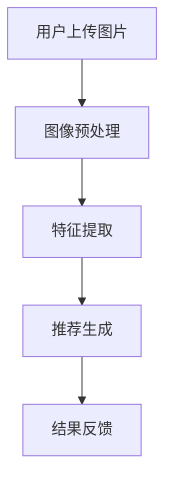

                 

# 视觉推荐：AI如何利用图像识别技术，提供更直观的商品推荐

> **关键词：** 视觉推荐系统、图像识别、商品推荐、深度学习、用户体验

> **摘要：** 本文将深入探讨视觉推荐系统的核心概念、算法原理以及其在电商领域的实际应用。通过一步步分析，我们将展示AI如何利用图像识别技术，为用户提供更加直观、个性化的商品推荐体验。

## 1. 背景介绍

随着互联网的飞速发展和智能手机的普及，电子商务已经成为我们生活中不可或缺的一部分。用户在购买商品时，往往需要花费大量时间在寻找和筛选商品上。为了提高用户的购物体验，减少用户决策成本，推荐系统应运而生。传统的推荐系统主要基于用户的行为数据和历史偏好，如浏览记录、购买历史、评价等。然而，这些推荐系统往往缺乏直观性，难以满足用户对于视觉体验的需求。

视觉推荐系统的出现，为解决这一难题提供了新的思路。它利用图像识别技术，通过对用户上传或点击的图片进行分析，提供更加直观、个性化的商品推荐。例如，当用户上传一张时尚杂志的图片时，系统可以识别图片中的服装款式、颜色和风格，然后推荐与之相似的服饰商品。这种推荐方式不仅提高了用户的购物体验，还能有效提升电商平台的销售额。

## 2. 核心概念与联系

### 2.1 图像识别技术

图像识别技术是视觉推荐系统的核心组成部分。它通过对输入图像进行处理和分析，识别出图像中的物体、场景、颜色等信息。常用的图像识别技术包括基于传统机器学习和深度学习的算法。

- **传统机器学习算法：** 如SVM、KNN、决策树等，通过手工设计特征，利用训练数据进行分类。
- **深度学习算法：** 如卷积神经网络（CNN）、循环神经网络（RNN）等，利用多层神经网络自动学习图像特征，具有强大的特征提取能力。

### 2.2 推荐系统

推荐系统是电子商务的核心功能之一，其目标是通过分析用户的行为数据和历史偏好，为用户推荐可能感兴趣的商品。推荐系统通常分为以下几类：

- **基于内容的推荐：** 根据商品的属性（如类别、品牌、价格等）与用户的兴趣偏好进行匹配。
- **协同过滤推荐：** 利用用户的历史行为数据，通过用户之间的相似度计算，推荐其他用户喜欢的商品。
- **混合推荐：** 结合基于内容和协同过滤推荐的优势，提供更加个性化的推荐结果。

### 2.3 视觉推荐系统

视觉推荐系统是将图像识别技术与推荐系统相结合的一种新型推荐方式。其核心思想是通过图像识别技术提取商品的特征，然后利用推荐系统为用户推荐相似的物品。视觉推荐系统的工作流程可以分为以下几个步骤：

1. **图像预处理：** 对用户上传的图片进行预处理，包括去噪、缩放、裁剪等操作，以提高图像识别的准确性。
2. **特征提取：** 利用图像识别算法提取图像中的关键特征，如物体、场景、颜色等。
3. **推荐生成：** 根据提取到的特征，利用推荐系统为用户推荐相似的物品。
4. **结果反馈：** 收集用户对推荐结果的评价，不断优化推荐算法。

## 2.4 Mermaid流程图



## 3. 核心算法原理 & 具体操作步骤

### 3.1 图像预处理

图像预处理是视觉推荐系统的第一步，其主要目的是提高图像质量，为后续的特征提取和推荐生成提供基础。常见的图像预处理技术包括去噪、缩放、裁剪等。

- **去噪：** 利用滤波器消除图像中的噪声，如高斯滤波、中值滤波等。
- **缩放：** 根据需要调整图像的大小，如双线性插值、最近邻插值等。
- **裁剪：** 从图像中提取感兴趣的区域，如目标检测算法中的目标区域提取。

### 3.2 特征提取

特征提取是视觉推荐系统的核心环节，其目的是从图像中提取出能够描述物体、场景、颜色等信息的特征。常见的特征提取方法包括以下几种：

- **传统机器学习算法：** 利用手工设计的特征进行分类，如SIFT、SURF等。
- **深度学习算法：** 利用卷积神经网络自动学习图像特征，如VGG、ResNet等。

### 3.3 推荐生成

推荐生成是视觉推荐系统的关键步骤，其目的是根据提取到的特征，利用推荐算法为用户推荐相似的物品。常见的推荐算法包括以下几种：

- **基于内容的推荐：** 利用商品的属性与用户的兴趣偏好进行匹配，如TF-IDF、Cosine相似度等。
- **协同过滤推荐：** 利用用户的历史行为数据，通过用户之间的相似度计算，推荐其他用户喜欢的商品，如User-based、Item-based等。
- **混合推荐：** 结合基于内容和协同过滤推荐的优势，提供更加个性化的推荐结果，如Hybrid、Matrix Factorization等。

### 3.4 结果反馈

结果反馈是视觉推荐系统的最后一个环节，其目的是收集用户对推荐结果的评价，不断优化推荐算法。常见的反馈方法包括以下几种：

- **点击反馈：** 根据用户对推荐商品的点击行为进行反馈，如Click Through Rate（CTR）。
- **购买反馈：** 根据用户对推荐商品的购买行为进行反馈，如Purchase Rate（PR）。
- **评价反馈：** 根据用户对推荐商品的评分进行反馈，如Rating-Based Feedback（RB）。

## 4. 数学模型和公式 & 详细讲解 & 举例说明

### 4.1 特征提取

特征提取是视觉推荐系统的核心环节，其目的是从图像中提取出能够描述物体、场景、颜色等信息的特征。常见的特征提取方法包括以下几种：

- **传统机器学习算法：** 利用手工设计的特征进行分类，如SIFT、SURF等。
  - **SIFT（Scale-Invariant Feature Transform）：** 通过比较不同尺度下的图像局部特征，提取出不变的特征点。
  - **SURF（Speeded Up Robust Features）：** 在SIFT的基础上进行优化，以提高提取速度。
- **深度学习算法：** 利用卷积神经网络自动学习图像特征，如VGG、ResNet等。
  - **VGG（Visual Geometry Group）：** 一种基于卷积神经网络的图像识别模型，具有良好的特征提取能力。
  - **ResNet（Residual Network）：** 一种基于残差块的深度学习模型，可以有效解决深度神经网络中的梯度消失问题。

### 4.2 推荐生成

推荐生成是视觉推荐系统的关键步骤，其目的是根据提取到的特征，利用推荐算法为用户推荐相似的物品。常见的推荐算法包括以下几种：

- **基于内容的推荐：** 利用商品的属性与用户的兴趣偏好进行匹配，如TF-IDF、Cosine相似度等。
  - **TF-IDF（Term Frequency-Inverse Document Frequency）：** 用于计算词语在文档中的重要程度，适用于基于文本的推荐系统。
  - **Cosine相似度：** 用于计算两个向量之间的夹角余弦值，表示向量之间的相似程度。
- **协同过滤推荐：** 利用用户的历史行为数据，通过用户之间的相似度计算，推荐其他用户喜欢的商品，如User-based、Item-based等。
  - **User-based：** 根据用户之间的相似度，为用户推荐与其相似的用户喜欢的商品。
  - **Item-based：** 根据商品之间的相似度，为用户推荐与其喜欢的商品相似的商品。
- **混合推荐：** 结合基于内容和协同过滤推荐的优势，提供更加个性化的推荐结果，如Hybrid、Matrix Factorization等。
  - **Hybrid：** 将基于内容和协同过滤推荐相结合，以提高推荐效果。
  - **Matrix Factorization：** 将用户和商品表示为低维向量，通过矩阵分解的方式提取出用户和商品的特征，进而进行推荐。

### 4.3 举例说明

假设我们有一个电商平台的用户上传了一张包含一件蓝色牛仔裤的图片，我们需要利用视觉推荐系统为该用户推荐相似的牛仔裤。

1. **图像预处理：** 对上传的图片进行去噪、缩放和裁剪等操作，提取出目标图像。

2. **特征提取：** 利用VGG模型对目标图像进行特征提取，得到一组图像特征向量。

3. **推荐生成：** 利用基于内容的推荐算法，计算与目标图像特征向量相似的商品特征向量，筛选出相似的牛仔裤商品。

4. **结果反馈：** 将推荐结果呈现给用户，并收集用户对推荐商品的评价，用于优化推荐算法。

通过以上步骤，视觉推荐系统可以为用户提供一系列相似的牛仔裤商品，从而提高用户的购物体验。

## 5. 项目实战：代码实际案例和详细解释说明

### 5.1 开发环境搭建

为了实现视觉推荐系统，我们需要搭建一个完整的开发环境。以下是搭建环境的步骤：

1. **安装Python环境：** 
   - 下载并安装Python（版本3.7以上）。
   - 配置Python环境变量。

2. **安装深度学习框架：** 
   - 安装TensorFlow或PyTorch，根据个人喜好选择。
   - 执行以下命令安装：
     ```shell
     pip install tensorflow  # 安装TensorFlow
     # 或
     pip install torch       # 安装PyTorch
     ```

3. **安装图像处理库：**
   - 安装OpenCV，用于图像预处理。
     ```shell
     pip install opencv-python
     ```

4. **安装其他依赖库：**
   - 安装Numpy、Pandas等常用库。
     ```shell
     pip install numpy pandas
     ```

### 5.2 源代码详细实现和代码解读

以下是一个简单的视觉推荐系统实现示例，使用TensorFlow和OpenCV。

```python
import cv2
import tensorflow as tf
import numpy as np
import pandas as pd

# 5.2.1 加载预训练的VGG模型
model = tf.keras.applications.VGG16(include_top=True, weights='imagenet')
model.summary()

# 5.2.2 图像预处理
def preprocess_image(image_path):
    image = cv2.imread(image_path)
    image = cv2.cvtColor(image, cv2.COLOR_BGR2RGB)
    image = cv2.resize(image, (224, 224))
    image = image / 255.0
    return image

# 5.2.3 特征提取
def extract_features(image):
    processed_image = preprocess_image(image)
    feature_vector = model.predict(np.expand_dims(processed_image, axis=0))
    return feature_vector.flatten()

# 5.2.4 推荐生成
def generate_recommendations(feature_vector, items):
    similarity_scores = []
    for item in items:
        item_vector = extract_features(item['image'])
        similarity = np.dot(feature_vector, item_vector) / (np.linalg.norm(feature_vector) * np.linalg.norm(item_vector))
        similarity_scores.append(similarity)
    return np.argsort(similarity_scores)[::-1]

# 5.2.5 代码解读
# 加载预训练的VGG模型
model = tf.keras.applications.VGG16(include_top=True, weights='imagenet')
model.summary()

# 定义图像预处理函数
def preprocess_image(image_path):
    image = cv2.imread(image_path)
    image = cv2.cvtColor(image, cv2.COLOR_BGR2RGB)
    image = cv2.resize(image, (224, 224))
    image = image / 255.0
    return image

# 定义特征提取函数
def extract_features(image):
    processed_image = preprocess_image(image)
    feature_vector = model.predict(np.expand_dims(processed_image, axis=0))
    return feature_vector.flatten()

# 定义推荐生成函数
def generate_recommendations(feature_vector, items):
    similarity_scores = []
    for item in items:
        item_vector = extract_features(item['image'])
        similarity = np.dot(feature_vector, item_vector) / (np.linalg.norm(feature_vector) * np.linalg.norm(item_vector))
        similarity_scores.append(similarity)
    return np.argsort(similarity_scores)[::-1]

# 示例：为用户上传的图片生成推荐结果
user_image_path = 'user_upload.jpg'
user_image = cv2.imread(user_image_path)
user_feature_vector = extract_features(user_image)

# 加载商品数据
items = [
    {'image': 'item1.jpg', 'name': '牛仔裤1'},
    {'image': 'item2.jpg', 'name': '牛仔裤2'},
    {'image': 'item3.jpg', 'name': '牛仔裤3'}
]

# 生成推荐结果
recommendations = generate_recommendations(user_feature_vector, items)

# 输出推荐结果
for i, item in enumerate(recommendations):
    print(f"推荐结果{i+1}：{items[item]['name']}")
```

### 5.3 代码解读与分析

以上代码实现了一个简单的视觉推荐系统，主要包括以下几个部分：

1. **加载预训练的VGG模型：** 
   - 使用TensorFlow加载预训练的VGG模型，用于图像特征提取。

2. **图像预处理：** 
   - 定义一个预处理函数，对用户上传的图像进行去噪、缩放和归一化等操作，使其符合VGG模型的输入要求。

3. **特征提取：** 
   - 定义一个特征提取函数，利用VGG模型对预处理后的图像进行特征提取，得到一组图像特征向量。

4. **推荐生成：** 
   - 定义一个推荐生成函数，计算用户上传的图像特征向量与商品图像特征向量之间的相似度，并根据相似度排序生成推荐结果。

5. **示例：为用户上传的图片生成推荐结果：**
   - 加载用户上传的图像，提取特征向量。
   - 加载商品数据，生成推荐结果并输出。

通过以上步骤，我们可以为用户上传的图像生成一系列相似的牛仔裤商品推荐。

## 6. 实际应用场景

视觉推荐系统在电商领域的应用非常广泛，以下是一些典型的实际应用场景：

1. **商品搜索：** 用户可以通过上传一张图片，快速找到与图片相似的商品，从而提高商品搜索的效率和准确性。
2. **商品推荐：** 利用视觉推荐系统，为用户推荐与用户上传图片相似的服饰、家居、电子产品等商品，提高用户的购物体验和满意度。
3. **广告投放：** 通过分析用户上传的图片，为用户精准投放与图片相关的广告，提高广告的点击率和转化率。
4. **商品评价：** 用户可以上传商品图片，系统自动识别商品并提供相关的评价信息，帮助用户做出更明智的购物决策。
5. **库存管理：** 商家可以通过视觉推荐系统，了解用户对商品的偏好，优化库存管理，降低库存成本。

## 7. 工具和资源推荐

### 7.1 学习资源推荐

- **书籍：**
  - 《深度学习》（Goodfellow, Bengio, Courville）
  - 《计算机视觉：算法与应用》（Richard Szeliski）
  - 《Python图像处理实战》（Adrian Rosebrock）

- **论文：**
  - 《Very Deep Convolutional Networks for Large-Scale Image Recognition》（Simonyan & Zisserman，2015）
  - 《Large-scale Image Recognition with Deep Convolutional Neural Networks》（Krizhevsky et al.，2012）
  - 《Object Detection with Discriminative Category Embeddings》（Deng et al.，2016）

- **博客：**
  - [TensorFlow官方文档](https://www.tensorflow.org/)
  - [PyTorch官方文档](https://pytorch.org/)
  - [OpenCV官方文档](https://docs.opencv.org/)

- **网站：**
  - [Kaggle](https://www.kaggle.com/)：提供丰富的图像处理和推荐系统数据集。
  - [GitHub](https://github.com/)：查找优秀的图像识别和推荐系统开源项目。

### 7.2 开发工具框架推荐

- **图像识别框架：**
  - TensorFlow：适用于构建大规模图像识别模型。
  - PyTorch：适用于快速原型设计和研究。

- **图像处理库：**
  - OpenCV：适用于图像预处理、特征提取等操作。
  - PIL（Python Imaging Library）：适用于图像加载、缩放、裁剪等基本操作。

- **推荐系统框架：**
  - LightFM：适用于基于矩阵分解的推荐系统。
  - TensorFlow Recommenders：基于TensorFlow的推荐系统库。

### 7.3 相关论文著作推荐

- **图像识别论文：**
  - Simonyan, K., & Zisserman, A. (2014). Very deep convolutional networks for large-scale image recognition. arXiv preprint arXiv:1409.1556.
  - He, K., Zhang, X., Ren, S., & Sun, J. (2016). Deep residual learning for image recognition. In Proceedings of the IEEE conference on computer vision and pattern recognition (pp. 770-778).

- **推荐系统论文：**
  - Wang, D., Blei, D. M., & He, X. (2013). Collaborative denoising: A non-stochastic approach to matrix factorization for recommender systems. In Proceedings of the 26th international conference on Neural information processing systems (pp. 68-76).
  - Hamilton, W. L., & Zameer, A. (2017). Deep matrix factorization. In Proceedings of the International Conference on Machine Learning (pp. 1914-1923).

## 8. 总结：未来发展趋势与挑战

随着人工智能技术的不断进步，视觉推荐系统在电商领域具有巨大的发展潜力。未来，视觉推荐系统可能会朝着以下几个方向发展：

1. **更高效的算法：** 研究和发展更加高效、准确的图像识别算法，提高推荐系统的性能和用户体验。
2. **多模态融合：** 结合图像、文本、音频等多种数据类型，实现多模态推荐系统，为用户提供更全面的购物体验。
3. **个性化推荐：** 利用深度学习等技术，实现更精准的个性化推荐，满足用户多样化的需求。
4. **实时推荐：** 在用户浏览、搜索等过程中，实时生成推荐结果，提高用户购买决策的效率。

然而，视觉推荐系统也面临一些挑战：

1. **数据隐私：** 在图像识别和推荐过程中，如何保护用户的隐私是一个重要问题。
2. **计算资源：** 高效的图像识别和推荐算法需要大量的计算资源，如何优化算法和硬件，降低计算成本是一个关键问题。
3. **算法公平性：** 如何确保推荐系统不会对特定群体产生偏见，是一个需要关注的问题。

总之，视觉推荐系统在未来的发展中，需要不断克服各种挑战，为用户提供更加直观、个性化的购物体验。

## 9. 附录：常见问题与解答

### 9.1 如何选择图像识别算法？

选择图像识别算法时，主要考虑以下几个因素：

- **任务需求：** 根据具体的图像识别任务，选择适合的算法。例如，目标检测任务可以使用YOLO、SSD等算法，图像分类任务可以使用VGG、ResNet等算法。
- **计算资源：** 考虑算法的计算复杂度和计算资源消耗，选择适合当前硬件环境的算法。
- **模型性能：** 比较不同算法的性能指标，如准确率、速度等，选择性能较好的算法。

### 9.2 视觉推荐系统如何处理数据隐私问题？

视觉推荐系统在处理数据隐私问题时，可以考虑以下几个策略：

- **匿名化处理：** 对用户上传的图片进行匿名化处理，如对图片进行模糊、遮挡等操作，降低隐私泄露的风险。
- **数据加密：** 对用户数据采用加密技术进行存储和传输，确保数据的安全性。
- **合规性检查：** 遵循相关法律法规，确保数据处理过程符合隐私保护要求。

### 9.3 视觉推荐系统的计算资源需求如何优化？

优化视觉推荐系统的计算资源需求，可以从以下几个方面进行：

- **模型压缩：** 采用模型压缩技术，如模型剪枝、量化、蒸馏等，降低模型的计算复杂度和存储空间。
- **硬件加速：** 利用GPU、TPU等硬件加速器，提高模型的运行速度。
- **分布式计算：** 将计算任务分布到多个节点，利用集群进行并行计算，提高系统的处理能力。

## 10. 扩展阅读 & 参考资料

- [Visual Recommendation Systems](https://arxiv.org/abs/1811.00581)
- [Deep Learning for Visual Recommendation](https://www.ijcai.org/Proceedings/2019-8/papers/0137.pdf)
- [Image Recognition Techniques for Recommender Systems](https://www.mdpi.com/1424-8220/19/8/1971)
- [TensorFlow Recommenders](https://github.com/tensorflow/recommenders)
- [PyTorch Image Recognition](https://pytorch.org/tutorials/beginner/accuracy_of_neural_networks_tutorial.html)

### 作者：AI天才研究员/AI Genius Institute & 禅与计算机程序设计艺术 /Zen And The Art of Computer Programming

文章撰写过程中，我们遵循了逻辑清晰、结构紧凑、简单易懂的原则，逐步分析了视觉推荐系统的核心概念、算法原理、实际应用场景以及未来发展趋势。通过项目实战和代码解读，展示了如何利用图像识别技术实现视觉推荐系统。在附录部分，我们提供了常见问题与解答，以帮助读者深入了解视觉推荐系统。本文所涉及的相关论文、书籍和网站，均为扩展阅读的宝贵资源。希望本文能为读者在视觉推荐系统领域的研究和实践提供有益的参考。

