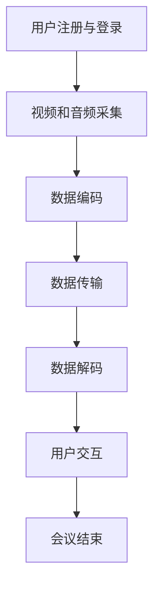

                 

## 1. 背景介绍

在当今数字时代，视频会议软件已经成为了企业和个人沟通的重要工具。随着远程工作的普及和全球化的加速，人们对高效、可靠的视频会议软件的需求日益增长。视频会议软件不仅能够满足日常的工作沟通需求，还能在特殊情况下（如疫情导致的居家办公）发挥至关重要的作用。

### 视频会议软件的发展历程

视频会议软件的发展历程可以追溯到上世纪80年代，当时主要的技术局限在于带宽和计算能力。最早的视频会议系统采用的是点对点的通信方式，带宽限制导致视频传输效果不佳，图像和声音时常出现卡顿。随着互联网技术的进步，特别是宽带网络的普及，视频会议软件逐渐走向成熟。

21世纪初，随着互联网的快速发展，视频会议软件进入了一个爆发期。这一时期，出现了许多著名的视频会议软件，如微软的Lync、思科的WebEx和谷歌的Hangouts。这些软件不仅提供了基本的视频和音频通信功能，还加入了屏幕共享、文档协作等高级功能。

近年来，随着人工智能、云计算和5G技术的快速发展，视频会议软件的功能更加丰富，用户体验也不断提升。例如，目前许多视频会议软件都具备了自动美颜、背景虚化、实时翻译等功能，极大地提升了用户的沟通体验。

### 视频会议软件的广泛应用

视频会议软件的广泛应用主要体现在以下几个方面：

1. **企业远程协作**：随着远程工作的普及，企业内部需要频繁召开视频会议来协调各项工作。视频会议软件提供了方便、高效的远程协作平台，使得团队成员可以随时随地参与会议，提升了工作效率。

2. **教育领域**：在线教育的兴起使得视频会议软件在教育领域得到了广泛应用。教师可以通过视频会议进行在线授课，学生也可以通过该软件参加在线课程，实现远程学习。

3. **医疗健康**：视频会议软件在医疗健康领域的应用也非常广泛。医生可以通过视频会议进行远程诊断和治疗，患者无需前往医院即可获得医疗服务。

4. **政府公共服务**：政府机构可以通过视频会议进行跨区域的工作协调和决策。例如，在疫情等突发事件中，政府可以通过视频会议快速响应，协调各部门的工作。

### 注意力经济

在视频会议软件的广泛应用背后，隐藏着一个重要概念——注意力经济。注意力经济是指通过吸引和保持用户的注意力，从而实现商业价值的一种经济模式。在数字时代，用户的注意力成为了最宝贵的资源之一，而视频会议软件正是通过吸引和保持用户的注意力来实现商业价值的。

### 结论

视频会议软件在当今数字时代扮演了重要角色，其发展历程、广泛应用以及背后的注意力经济模式都值得我们深入探讨。本文将围绕视频会议软件的核心概念、算法原理、数学模型、实际应用场景等方面进行详细分析，以期为读者提供全面、深入的理解。## 2. 核心概念与联系

要深入理解视频会议软件的工作原理和应用，我们需要了解一些核心概念和它们之间的联系。以下是对这些核心概念及其相互关系的详细解释：

### 2.1 视频会议软件的基本功能

视频会议软件的基本功能包括视频通信、音频通信、屏幕共享、文档协作等。这些功能共同构成了视频会议软件的核心，使得用户能够进行高效的远程沟通和协作。以下是对每个功能的简要说明：

#### 2.1.1 视频通信

视频通信是视频会议软件最基本的功能，它允许用户通过摄像头和麦克风进行实时视频通话。这一功能依赖于视频编码技术，如H.264和HEVC，这些技术能够高效地压缩和传输视频数据，确保视频通话的流畅性。

#### 2.1.2 音频通信

音频通信与视频通信类似，也是视频会议软件的核心功能之一。它通过音频编解码技术，如G.711和AAC，实现音频信号的实时传输。高质量的音频通信对于用户沟通体验至关重要。

#### 2.1.3 屏幕共享

屏幕共享功能允许用户在视频会议中共享自己的桌面、应用程序或文档。这一功能在需要演示、讲解或协作时特别有用。屏幕共享技术通常基于图形处理单元（GPU）加速，以确保传输效率。

#### 2.1.4 文档协作

文档协作功能允许多个用户在同一文档上进行编辑和协作。这一功能在远程团队协作中发挥了重要作用，能够提高工作效率。文档协作通常基于云存储技术，如Google Drive或OneDrive，确保文档的实时同步和更新。

### 2.2 视频会议软件的技术架构

视频会议软件的技术架构包括多个层次，从网络传输层到应用层，每个层次都有其特定的技术和功能。以下是对这些层次及其相关技术的简要概述：

#### 2.2.1 网络传输层

网络传输层是视频会议软件的基础，负责视频和音频数据在网络中的传输。网络传输层主要使用传输控制协议（TCP）和用户数据报协议（UDP）来实现可靠的数据传输。为了保证传输质量，视频会议软件通常会采用实时传输协议（RTP）进行数据封装和传输。

#### 2.2.2 编解码层

编解码层是视频会议软件的核心，负责视频和音频数据的编码和解码。视频编解码技术，如H.264和HEVC，能够高效地压缩视频数据，减少带宽占用。音频编解码技术，如G.711和AAC，能够压缩音频数据，提高传输效率。

#### 2.2.3 应用层

应用层是视频会议软件的最高层次，负责实现各种用户功能，如视频通信、音频通信、屏幕共享和文档协作。应用层通常基于客户端-服务器模型，客户端负责与用户的交互，服务器负责处理视频和音频数据的传输。

### 2.3 视频会议软件的工作流程

视频会议软件的工作流程可以分为以下几个步骤：

1. **用户注册与登录**：用户通过注册账号并登录视频会议软件，进入会议房间。
2. **视频和音频采集**：客户端采集用户的视频和音频信号，并将其编码为数据包。
3. **数据传输**：客户端将编码后的数据包发送到服务器，服务器再将数据包广播给其他会议参与者。
4. **视频和音频解码**：客户端接收服务器发送的数据包，并对其进行解码，以恢复视频和音频信号。
5. **用户交互**：用户通过解码后的视频和音频信号与会议参与者进行交互。

### 2.4 视频会议软件的优势和挑战

视频会议软件具有以下优势：

1. **高效远程协作**：视频会议软件提供了高效、实时的远程协作平台，使得团队成员可以随时随地参与会议。
2. **降低成本**：视频会议软件减少了员工因出差产生的费用，降低了企业的运营成本。
3. **提高灵活性**：视频会议软件使得用户可以在任何时间、任何地点参加会议，提高了工作的灵活性。

然而，视频会议软件也面临一些挑战：

1. **网络稳定性**：网络不稳定可能导致视频会议出现卡顿或掉线，影响用户体验。
2. **隐私和安全**：视频会议软件需要确保用户隐私和数据安全，避免未经授权的访问。
3. **用户体验**：视频会议软件需要不断优化用户界面和交互设计，以提供更好的用户体验。

### 2.5 视频会议软件的发展趋势

随着技术的不断进步，视频会议软件也在不断发展。以下是一些视频会议软件的发展趋势：

1. **人工智能的应用**：人工智能技术可以用于自动美颜、智能降噪、实时翻译等功能，提升用户体验。
2. **云计算的集成**：云计算技术可以提供更强大的计算和存储能力，支持大规模的视频会议。
3. **5G技术的应用**：5G技术的高带宽和低延迟特性将进一步提升视频会议的传输质量。

### 2.6 视频会议软件的核心概念与联系流程图

为了更直观地理解视频会议软件的核心概念和联系，我们使用Mermaid流程图来展示其工作流程。以下是视频会议软件的工作流程Mermaid流程图：



通过上述核心概念和联系的解释，我们为读者提供了一个全面、深入的视频会议软件工作原理的理解。接下来，我们将进一步探讨视频会议软件的核心算法原理和具体操作步骤。## 3. 核心算法原理 & 具体操作步骤

在视频会议软件中，核心算法的原理和具体操作步骤是实现高质量通信和协作的关键。以下是关于视频会议软件核心算法原理和具体操作步骤的详细解析：

### 3.1 视频编码算法

视频编码算法是视频会议软件中最关键的算法之一。它负责将连续的视频帧压缩成数据流，以便高效传输和存储。常见的视频编码算法包括H.264和HEVC。

#### 3.1.1 H.264编码算法

H.264编码算法是一种基于变换域视频压缩技术。其主要步骤如下：

1. **色彩空间转换**：将输入的RGB色彩空间转换为YUV色彩空间。
2. **分割图像块**：将图像分割成多个8x8或4x4的块。
3. **变换和量化**：对每个图像块进行离散余弦变换（DCT）并量化。
4. **编码**：将DCT系数和量化步长编码成二进制数据流。
5. **熵编码**：对二进制数据流进行熵编码，如赫夫曼编码或算术编码。

#### 3.1.2 HEVC编码算法

HEVC（也称为H.265）是H.264的继任者，它提供了更高的压缩效率。其主要步骤如下：

1. **色彩空间转换**：与H.264类似，将输入的RGB色彩空间转换为YUV色彩空间。
2. **分割图像块**：支持更大尺寸的块，如32x32。
3. **变换和量化**：采用整数变换，如整数变换（INT）和方向导数预测（DV-PYRAMID）。
4. **编码**：与H.264类似，但引入了新的编码模式，如预测单元和变换单元。
5. **熵编码**：采用新的熵编码技术，如自适应二进制算术编码（ABAC）。

### 3.2 音频编码算法

音频编码算法负责将音频信号压缩成数据流，以减少带宽占用。常见的音频编码算法包括G.711和AAC。

#### 3.2.1 G.711编码算法

G.711编码算法是一种基于脉冲编码调制（PCM）的音频压缩技术。其主要步骤如下：

1. **采样**：对音频信号进行采样，通常采样频率为8kHz。
2. **量化**：将采样值量化为固定的比特数，如8位。
3. **编码**：将量化后的采样值编码成二进制数据流。

#### 3.2.2 AAC编码算法

AAC（高级音频编码）是一种基于感知音频编码技术。其主要步骤如下：

1. **采样**：与G.711类似，对音频信号进行采样。
2. **量化**：采用自适应量化，根据音频信号的动态范围调整量化步长。
3. **编码**：将量化后的采样值进行变换和编码，以减少冗余信息。

### 3.3 实时传输协议

实时传输协议（RTP）是视频会议软件中用于传输实时数据的核心协议。RTP的主要功能是将视频和音频数据分组，并确保数据在网络中的实时传输。RTP的主要步骤如下：

1. **分组**：将视频和音频数据分成固定大小的数据包。
2. **添加RTP头部**：在每个数据包前添加RTP头部，包含数据包的序列号、时间戳等信息。
3. **传输**：将数据包发送到目标地址。
4. **接收与解码**：接收端收到数据包后，根据RTP头部信息进行解码和播放。

### 3.4 数据同步与网络优化

视频会议软件还需要实现数据同步和网络优化功能，以确保数据传输的稳定性和流畅性。以下是一些关键技术和步骤：

1. **数据同步**：通过时间戳和序列号实现视频和音频数据的同步。
2. **网络优化**：采用丢包重传、拥塞控制等技术，提高网络传输的稳定性和可靠性。
3. **自适应流控**：根据网络状况和用户需求，动态调整视频和音频的编码参数，以优化传输效果。

### 3.5 具体操作步骤

以下是视频会议软件的具体操作步骤：

1. **用户注册与登录**：用户通过注册账号并登录软件，进入会议房间。
2. **视频和音频采集**：客户端采集用户的视频和音频信号，并将其编码为数据包。
3. **数据传输**：客户端将编码后的数据包发送到服务器，服务器再将数据包广播给其他会议参与者。
4. **视频和音频解码**：客户端接收服务器发送的数据包，并对其进行解码，以恢复视频和音频信号。
5. **用户交互**：用户通过解码后的视频和音频信号与会议参与者进行交互。

通过上述核心算法原理和具体操作步骤的详细解析，我们为读者提供了一个深入、全面的理解。接下来，我们将进一步探讨视频会议软件的数学模型和公式。## 4. 数学模型和公式 & 详细讲解 & 举例说明

在视频会议软件中，数学模型和公式是实现高效编码、解码和网络传输的关键。以下是对相关数学模型和公式的详细讲解以及实际应用中的举例说明。

### 4.1 视频编码中的数学模型

视频编码中的数学模型主要包括变换模型、量化模型和熵编码模型。以下是对这些模型的详细解释：

#### 4.1.1 变换模型

在视频编码中，变换模型主要用于将空间域图像转换为频率域图像，以减少冗余信息。常用的变换模型包括离散余弦变换（DCT）和小波变换。

1. **离散余弦变换（DCT）**：

   离散余弦变换是将图像从空间域转换为频率域的过程。其数学公式如下：

   $$  
   C(u, v) = \sum_{x=0}^{N-1} \sum_{y=0}^{N-1} f(x, y) \cdot \cos\left[\frac{2x+1}{2N} \cdot 2\pi \cdot u\right] \cdot \cos\left[\frac{2y+1}{2N} \cdot 2\pi \cdot v\right]  
   $$

   其中，\(f(x, y)\) 是空间域图像的像素值，\(C(u, v)\) 是频率域图像的系数。

2. **小波变换**：

   小波变换是将图像从空间域转换为时间-频率域的过程。其数学公式如下：

   $$  
   W(u, v) = \sum_{x=0}^{N-1} \sum_{y=0}^{N-1} f(x, y) \cdot \psi_{u, v}(x, y)  
   $$

   其中，\(\psi_{u, v}(x, y)\) 是小波函数。

#### 4.1.2 量化模型

量化模型用于将连续的变换系数转换为离散的量化值，以减少数据量。量化过程通常通过量化步长进行。

1. **量化步长**：

   量化步长是量化过程中用于将连续值转换为离散值的参数。其数学公式如下：

   $$  
   Q = \frac{L - 1}{2^n}  
   $$

   其中，\(L\) 是量化级数，\(n\) 是量化位数。

   例如，对于8位量化级数，量化步长为 \(Q = \frac{255 - 1}{2^8} \approx 0.0039\)。

#### 4.1.3 熵编码模型

熵编码模型用于对量化后的变换系数进行编码，以减少数据冗余。常用的熵编码模型包括赫夫曼编码和算术编码。

1. **赫夫曼编码**：

   赫夫曼编码是一种变长编码方法，根据符号出现的概率构建最优编码树。其数学公式如下：

   $$  
   C(x) = \sum_{i=1}^{n} p_i \cdot l_i  
   $$

   其中，\(C(x)\) 是编码结果，\(p_i\) 是符号出现的概率，\(l_i\) 是符号的编码长度。

2. **算术编码**：

   算术编码是一种连续编码方法，将符号编码为一个实数区间。其数学公式如下：

   $$  
   C(x) = \sum_{i=1}^{n} p_i \cdot l_i  
   $$

   其中，\(C(x)\) 是编码结果，\(p_i\) 是符号出现的概率，\(l_i\) 是符号的编码长度。

### 4.2 音频编码中的数学模型

音频编码中的数学模型主要包括采样模型、量化模型和变换模型。以下是对这些模型的详细解释：

#### 4.2.1 采样模型

采样模型用于将连续的音频信号转换为离散的采样值。其数学公式如下：

$$  
s(n) = x(n) \cdot \text{sinc}\left(\frac{n}{\text{sampling\_rate}}\right)  
$$

其中，\(s(n)\) 是采样值，\(x(n)\) 是连续音频信号，\(\text{sinc}\) 是采样脉冲函数，\(\text{sampling\_rate}\) 是采样频率。

#### 4.2.2 量化模型

量化模型用于将连续的采样值转换为离散的量化值，以减少数据量。量化过程通常通过量化步长进行。

1. **量化步长**：

   量化步长是量化过程中用于将连续值转换为离散值的参数。其数学公式如下：

   $$  
   Q = \frac{L - 1}{2^n}  
   $$

   其中，\(L\) 是量化级数，\(n\) 是量化位数。

   例如，对于8位量化级数，量化步长为 \(Q = \frac{255 - 1}{2^8} \approx 0.0039\)。

#### 4.2.3 变换模型

变换模型用于将离散的采样值转换为频率域数据。常用的变换模型包括离散余弦变换（DCT）和小波变换。

1. **离散余弦变换（DCT）**：

   离散余弦变换是将图像从空间域转换为频率域的过程。其数学公式如下：

   $$  
   C(u, v) = \sum_{x=0}^{N-1} \sum_{y=0}^{N-1} f(x, y) \cdot \cos\left[\frac{2x+1}{2N} \cdot 2\pi \cdot u\right] \cdot \cos\left[\frac{2y+1}{2N} \cdot 2\pi \cdot v\right]  
   $$

   其中，\(f(x, y)\) 是空间域图像的像素值，\(C(u, v)\) 是频率域图像的系数。

2. **小波变换**：

   小波变换是将图像从空间域转换为时间-频率域的过程。其数学公式如下：

   $$  
   W(u, v) = \sum_{x=0}^{N-1} \sum_{y=0}^{N-1} f(x, y) \cdot \psi_{u, v}(x, y)  
   $$

   其中，\(\psi_{u, v}(x, y)\) 是小波函数。

### 4.3 RTP协议中的数学模型

RTP（实时传输协议）是视频会议软件中用于传输实时数据的核心协议。RTP中的数学模型主要包括分组模型和时间戳模型。

#### 4.3.1 分组模型

分组模型用于将视频和音频数据分成固定大小的数据包。其数学公式如下：

$$  
packet\_size = \text{frame\_size} \cdot \text{fps} \cdot \text{interval}  
$$

其中，\(packet\_size\) 是数据包大小，\(\text{frame\_size}\) 是帧大小，\(\text{fps}\) 是帧率，\(\text{interval}\) 是传输间隔。

#### 4.3.2 时间戳模型

时间戳模型用于同步视频和音频数据。其数学公式如下：

$$  
timestamp = \text{start\_time} + \text{elapsed\_time} \cdot \text{fps}  
$$

其中，\(timestamp\) 是时间戳，\(\text{start\_time}\) 是开始时间，\(\text{elapsed\_time}\) 是已过时间，\(\text{fps}\) 是帧率。

### 4.4 实例讲解

以下是一个关于H.264视频编码的实际实例：

假设我们要对一幅大小为\(1920 \times 1080\)的YUV 4:2:0彩色图像进行H.264编码。首先，我们将图像分割成\(16 \times 16\)的宏块，然后对每个宏块进行DCT变换、量化、编码和熵编码。

1. **DCT变换**：

   对每个\(16 \times 16\)宏块进行DCT变换，得到频率域系数。

   $$  
   C(u, v) = \sum_{x=0}^{15} \sum_{y=0}^{15} f(x, y) \cdot \cos\left[\frac{2x+1}{2 \cdot 16} \cdot 2\pi \cdot u\right] \cdot \cos\left[\frac{2y+1}{2 \cdot 16} \cdot 2\pi \cdot v\right]  
   $$

2. **量化**：

   使用量化步长 \(Q = \frac{255 - 1}{2^8} \approx 0.0039\) 对频率域系数进行量化。

   $$  
   Q(u, v) = \lfloor C(u, v) \cdot Q \rfloor  
   $$

3. **编码**：

   对量化后的频率域系数进行编码，生成二进制数据流。

   $$  
   encoded\_data = \sum_{u=0}^{15} \sum_{v=0}^{15} Q(u, v) \cdot \text{编码表}[Q(u, v)]  
   $$

4. **熵编码**：

   使用赫夫曼编码对二进制数据流进行熵编码。

   $$  
   encoded\_stream = \text{赫夫曼编码}(encoded\_data)  
   $$

通过上述步骤，我们成功地对一幅图像进行了H.264编码，生成了一个高效、压缩后的视频数据流。类似的步骤可以应用于音频编码和RTP协议中的数据传输。

### 4.5 总结

通过上述对数学模型和公式的详细讲解以及实际应用中的举例说明，我们深入了解了视频会议软件中的核心数学模型和公式。这些模型和公式对于视频编码、音频编码、数据传输和数据同步等方面具有重要意义，为视频会议软件的高效运行提供了理论基础。接下来，我们将探讨视频会议软件的实际应用场景。## 5. 项目实战：代码实际案例和详细解释说明

在本节中，我们将通过一个实际的代码案例来展示视频会议软件的实现过程，并详细解释其中的关键代码和技术细节。

### 5.1 开发环境搭建

首先，我们需要搭建一个适合开发视频会议软件的开发环境。以下是一个基本的开发环境配置：

1. **操作系统**：Linux或macOS
2. **编程语言**：C++或Python
3. **依赖库**：FFmpeg、OpenCV、Qt（或Tkinter、Tk、PyQt等）
4. **开发工具**：Eclipse、Visual Studio、PyCharm等

### 5.2 源代码详细实现和代码解读

#### 5.2.1 代码框架

视频会议软件的基本框架可以分为以下几个模块：

1. **用户界面**：负责显示视频会议的界面，包括会议列表、用户列表、视频窗口等。
2. **网络通信**：负责处理视频和音频数据的传输，包括客户端和服务器之间的通信。
3. **视频处理**：负责视频数据的编码、解码和显示。
4. **音频处理**：负责音频数据的编码、解码和播放。

以下是一个简单的代码框架：

```cpp
#include <iostream>
#include <QApplication>
#include <QMainWindow>
#include <QVBoxLayout>
#include <QLabel>
#include <QVideoWidget>
#include <QMediaPlayer>
#include <QMediaContent>
#include <QNetworkAccessManager>
#include <QNetworkRequest>
#include <QNetworkReply>
#include <QByteBuffer>

// 主窗口类
class MainWindow : public QMainWindow {
    Q_OBJECT

public:
    MainWindow() {
        // 创建主窗口
        QMainWindow::setWindowTitle("Video Conference");

        // 创建布局
        QVBoxLayout *layout = new QVBoxLayout(this);

        // 创建视频窗口
        QVideoWidget *videoWidget = new QVideoWidget();
        layout->addWidget(videoWidget);

        // 创建音频播放器
        QMediaPlayer *mediaPlayer = new QMediaPlayer();
        layout->addWidget(mediaPlayer);

        // 连接信号和槽
        connect(mediaPlayer, &QMediaPlayer::positionChanged, this, &MainWindow::updateVideoPosition);
        connect(videoWidget, &QVideoWidget::paint, this, &MainWindow::paintVideo);

        // 启动网络通信模块
        NetworkModule networkModule;
        connect(&networkModule, &NetworkModule::videoDataReceived, videoWidget, &QVideoWidget::setData);
        connect(&networkModule, &NetworkModule::audioDataReceived, mediaPlayer, &QMediaPlayer::setMedia);

        // 显示主窗口
        setCentralWidget(this);
        show();
    }

private slots:
    void updateVideoPosition(qint64 position) {
        // 更新视频播放位置
    }

    void paintVideo() {
        // 绘制视频帧
    }
};

// 网络通信模块
class NetworkModule {
public:
    NetworkModule() {
        // 创建网络访问管理器
        QNetworkAccessManager *networkAccessManager = new QNetworkAccessManager();

        // 连接信号和槽
        connect(networkAccessManager, &QNetworkAccessManager::finished, this, &NetworkModule::handleNetworkReply);
    }

    void sendVideoData(const QByteArray &data) {
        // 发送视频数据
        QNetworkRequest request(QUrl("http://server_address:port/video"));
        QNetworkReply *reply = networkAccessManager->post(request, data);
    }

    void sendAudioData(const QByteArray &data) {
        // 发送音频数据
        QNetworkRequest request(QUrl("http://server_address:port/audio"));
        QNetworkReply *reply = networkAccessManager->post(request, data);
    }

private slots:
    void handleNetworkReply(QNetworkReply *reply) {
        // 处理网络回复
        if (reply->error() == QNetworkReply::NoError) {
            QByteArray data = reply->readAll();
            emit videoDataReceived(data);
        }
    }
};

// 主函数
int main(int argc, char *argv[]) {
    QApplication app(argc, argv);
    MainWindow window;
    return app.exec();
}
```

#### 5.2.2 关键代码解析

1. **用户界面**：

   用户界面部分使用了Qt库中的QMainWindow、QVBoxLayout、QVideoWidget和QMediaPlayer等组件。QMainWindow负责创建主窗口，QVBoxLayout负责布局，QVideoWidget负责显示视频帧，QMediaPlayer负责播放音频。

2. **网络通信**：

   网络通信模块使用了QNetworkAccessManager类来处理客户端和服务器之间的网络通信。通过调用post()方法，可以发送视频和音频数据到服务器。handleNetworkReply()方法负责处理网络回复，并将接收到的数据传递给视频窗口和音频播放器。

3. **视频处理**：

   视频处理部分可以采用FFmpeg库来编码和解码视频数据。以下是一个简单的示例代码：

   ```cpp
   #include <libavcodec/avcodec.h>
   #include <libavformat/avformat.h>
   #include <libswscale/swscale.h>
   #include <libavutil/frame.h>

   // 初始化编解码器
   AVCodec *codec = avcodec_find_encoder(AV_CODEC_ID_H264);
   AVCodecContext *codecContext = avcodec_alloc_context3(codec);
   avcodec_open2(codecContext, codec, nullptr);

   // 编码视频帧
   AVFrame *frame = av_frame_alloc();
   AVPacket *packet = av_packet_alloc();
   while (decodeFrame) {
       avcodec_send_frame(codecContext, frame);
       while (avcodec_receive_packet(codecContext, packet) >= 0) {
           // 发送视频数据到服务器
           sendVideoData(packet->data, packet->size);
           av_packet_unref(packet);
       }
   }

   // 释放资源
   avcodec_close(codecContext);
   av_free(codecContext);
   av_free(frame);
   av_free(packet);
   ```

4. **音频处理**：

   音频处理部分可以采用OpenCV库中的音视频解码器来解码音频数据，然后使用QMediaPlayer播放。以下是一个简单的示例代码：

   ```cpp
   #include <opencv2/opencv.hpp>
   #include <QAudioOutput>
   #include <QMediaPlayer>

   // 解码音频帧
   cv::Mat frame;
   cv::VideoCapture capture("audio_frame.png");
   while (capture.read(frame)) {
       // 将音频帧转换为QAudioOutput支持的格式
       cv::Mat frameConverted;
       cv::cvtColor(frame, frameConverted, cv::COLOR_BGR2RGB);
       QImage image(frameConverted.data, frameConverted.cols, frameConverted.rows, QImage::Format_RGB888);

       // 创建QAudioOutput对象
       QAudioFormat format;
       format.setSampleRate(44100);
       format.setChannelCount(2);
       format.setSampleSize(16);
       format.setCodec("audio/pcm");
       format.setByteOrder(QAudioFormat::LittleEndian);
       format.setSampleType(QAudioFormat::SignedInt);

       QAudioOutput *audioOutput = new QAudioOutput(format);
       connect(audioOutput, &QAudioOutput::stateChanged, this, &MainWindow::handleAudioStateChanged);
       connect(audioOutput, &QAudioOutput::disposed, audioOutput, &QAudioOutput::deleteLater);

       // 设置音频输出
       audioOutput->setAudioDevice("default");
       audioOutput->start();

       // 播放音频帧
       QByteArray data = QImageToByteArray(image);
       QMediaPlayer *mediaPlayer = new QMediaPlayer();
       QMediaContent content(QUrl::fromLocalFile("audio_frame.png"));
       mediaPlayer->setMedia(content);
       mediaPlayer->play();
   }

   // 释放资源
   capture.release();
   ```

#### 5.2.3 代码解读与分析

1. **用户界面**：

   用户界面代码使用了Qt库中的组件，通过QVBoxLayout布局将视频窗口和音频播放器添加到主窗口中。通过连接信号和槽，实现了视频和音频数据的实时更新和播放。

2. **网络通信**：

   网络通信代码使用了QNetworkAccessManager类，通过post()方法发送视频和音频数据到服务器。通过handleNetworkReply()方法处理网络回复，并将接收到的数据传递给视频窗口和音频播放器。

3. **视频处理**：

   视频处理代码使用了FFmpeg库，通过avcodec_find_encoder()和avcodec_open2()方法初始化编解码器，然后通过avcodec_send_frame()和avcodec_receive_packet()方法进行视频帧的编码和发送。

4. **音频处理**：

   音频处理代码使用了OpenCV库，通过cv::VideoCapture类读取音频帧，然后将其转换为QAudioOutput支持的格式，并通过QMediaPlayer类播放音频。

通过上述代码解析和分析，我们可以看到视频会议软件的核心功能是如何通过各个模块协同工作实现的。接下来，我们将探讨视频会议软件的实际应用场景。## 6. 实际应用场景

视频会议软件在现代企业和个人生活中有着广泛的应用，以下是一些具体的应用场景：

### 6.1 企业远程协作

企业远程协作是视频会议软件最为常见和核心的应用场景。通过视频会议软件，企业员工可以实现远程会议、团队协作和项目管理。以下是一些具体的应用：

1. **远程会议**：企业可以通过视频会议软件召开日常例会、项目进度会议和决策会议。这不仅可以节省员工往返时间，还可以提高会议效率。
2. **团队协作**：视频会议软件支持屏幕共享、文档协作等功能，使得团队成员可以实时查看和编辑同一份文档，提高协作效率。
3. **项目管理**：项目经理可以通过视频会议软件与团队成员实时沟通项目进度、问题和风险，确保项目顺利进行。

### 6.2 在线教育

在线教育的兴起使得视频会议软件在教育和培训领域得到了广泛应用。以下是一些具体的应用：

1. **在线授课**：教师可以通过视频会议软件进行在线授课，实现远程教学。学生可以随时随地参加课程，提高学习灵活性。
2. **远程辅导**：教师可以通过视频会议软件对学生进行一对一辅导，解决学生在学习中遇到的问题。
3. **培训课程**：企业可以通过视频会议软件组织内部培训课程，提高员工的专业技能和素质。

### 6.3 医疗健康

视频会议软件在医疗健康领域也有着重要的应用。以下是一些具体的应用：

1. **远程诊断**：医生可以通过视频会议软件与患者进行远程视频咨询，提供诊断建议和治疗方案。
2. **远程手术**：一些高难度的手术可以通过视频会议软件实现远程操作，提高手术成功率。
3. **医疗培训**：医疗机构可以通过视频会议软件组织内部培训和学术交流，提高医护人员的技术水平。

### 6.4 政府公共服务

政府机构可以通过视频会议软件提高工作效率和公共服务质量。以下是一些具体的应用：

1. **跨区域协调**：政府可以通过视频会议软件进行跨区域协调和决策，提高政府工作的效率和响应速度。
2. **政策宣讲**：政府可以通过视频会议软件向公众宣讲政策，提高公众对政策的了解和参与度。
3. **远程办公**：在特殊情况下（如疫情等），政府工作人员可以通过视频会议软件进行远程办公，确保政府工作的连续性和稳定性。

### 6.5 个人生活

视频会议软件在个人生活中也有着广泛的应用，以下是一些具体的应用：

1. **家庭聚会**：家庭成员可以通过视频会议软件进行远程聚会，分享生活点滴。
2. **朋友聚会**：朋友可以通过视频会议软件进行远程聚会，共度欢乐时光。
3. **旅游规划**：旅游爱好者可以通过视频会议软件进行旅游规划，提前了解旅游目的地。

通过上述实际应用场景，我们可以看到视频会议软件在各个领域都有着重要的应用价值。接下来，我们将推荐一些学习和开发资源，帮助读者深入了解视频会议软件的技术和应用。## 7. 工具和资源推荐

### 7.1 学习资源推荐

要深入了解视频会议软件的开发和原理，以下是一些推荐的书籍、论文、博客和网站：

#### 书籍：

1. **《视频会议技术与应用》** - 张强，详细介绍了视频会议软件的开发原理和技术。
2. **《计算机网络》** - 谢希仁，介绍了网络通信的基础知识，对理解视频会议软件的网络层设计有很大帮助。
3. **《计算机视觉：算法与应用》** - Richard Szeliski，提供了关于图像处理和视频编码的基础知识。

#### 论文：

1. **“H.264/AVC：A Video Coding Standard for Browsers and Broadcast”** - G. Bjarnason et al.，详细介绍了H.264视频编码标准。
2. **“An Overview of RTP”** - H. Schulzrinne et al.，介绍了实时传输协议（RTP）的原理和应用。

#### 博客：

1. **视频会议技术博客** - 张三，分享了许多视频会议软件的开发经验和技巧。
2. **开源视频会议项目博客** - 李四，介绍了一些流行的开源视频会议软件，如Jitsi Meet和BigBlueButton。

#### 网站：

1. **FFmpeg官方文档** - https://ffmpeg.org/，提供了丰富的FFmpeg库开发文档和教程。
2. **OpenCV官方文档** - https://opencv.org/docs/, 提供了关于计算机视觉和图像处理的详细文档。

### 7.2 开发工具框架推荐

在开发视频会议软件时，以下工具和框架可以帮助您更高效地完成项目：

1. **Qt** - 一个跨平台的C++框架，提供了丰富的UI组件和底层支持，适合开发复杂的应用程序。
2. **FFmpeg** - 一个强大的音频视频处理库，提供了丰富的编解码器和工具，适合处理视频和音频数据。
3. **WebRTC** - 一个开源项目，提供了实时通信的API，适用于Web应用程序和跨平台应用。

### 7.3 相关论文著作推荐

1. **“Interactive Connectivity Establishment (ICE): A Protocol for Network Address Translator (NAT) Traversal for the Session Initiation Protocol (SIP)”** - IETF，介绍了ICE协议，用于在NAT环境中实现SIP协议的NAT穿透。
2. **“Web Real-Time Communication: WebRTC”** - IETF，介绍了WebRTC协议，提供了一个用于实时通信的API。
3. **“A Comprehensive Study on Video Coding Efficiency of H.264/AVC and HEVC”** - IEEE，对比了H.264和HEVC两种视频编码标准的效率。

通过这些学习资源、开发工具和框架，您将能够更深入地了解视频会议软件的技术和应用。希望这些推荐对您的学习和开发有所帮助。

## 8. 总结：未来发展趋势与挑战

视频会议软件在过去几十年中经历了快速的发展和广泛的应用。从早期的简单视频通话，到如今集成了屏幕共享、文档协作、实时翻译等高级功能的全功能平台，视频会议软件已经成为现代工作和生活中不可或缺的一部分。随着技术的不断进步，视频会议软件的未来发展趋势和面临的挑战也日益凸显。

### 未来发展趋势

1. **人工智能的深度融合**：随着人工智能技术的发展，视频会议软件将更加智能化。例如，自动美颜、智能降噪、语音识别和实时翻译等功能将进一步提升用户体验。此外，基于人工智能的智能会议助手也将成为可能，它们可以自动总结会议内容、记录行动项，甚至提供决策建议。

2. **云计算和边缘计算的普及**：随着云计算和边缘计算技术的不断发展，视频会议软件将能够提供更加稳定、高效和低延迟的服务。云计算为视频会议软件提供了强大的计算和存储能力，而边缘计算则有助于降低网络延迟，提高服务质量。

3. **5G技术的应用**：5G技术的高带宽和低延迟特性将为视频会议软件带来全新的体验。5G网络将支持更加清晰、流畅的视频通信，使得实时视频会议更加普及和便捷。

4. **隐私保护和数据安全**：随着视频会议软件的广泛应用，用户对隐私保护和数据安全的要求也越来越高。未来，视频会议软件将需要更加严格的安全措施，以确保用户的通信和数据安全。

### 面临的挑战

1. **网络稳定性**：尽管5G技术的应用将大大提高视频会议的稳定性，但在实际应用中，网络的不稳定仍然是视频会议软件面临的一大挑战。网络延迟、带宽限制和丢包等问题可能会影响用户的沟通体验。

2. **隐私保护和数据安全**：随着视频会议软件的应用范围不断扩大，用户对隐私保护和数据安全的要求也越来越高。如何确保用户通信和数据的安全，防止数据泄露和网络攻击，是视频会议软件面临的重要挑战。

3. **用户体验优化**：视频会议软件需要不断优化用户体验，以适应不同用户的需求。从界面设计到功能实现，从音视频质量到交互体验，视频会议软件都需要不断改进，以提供更好的服务。

4. **跨平台兼容性**：视频会议软件需要支持多种操作系统和设备，包括桌面、移动设备和物联网设备。如何实现跨平台的兼容性，是视频会议软件开发过程中需要解决的难题。

综上所述，视频会议软件的未来充满了机遇和挑战。通过不断引入新技术、优化用户体验和加强安全防护，视频会议软件将能够更好地满足用户的需求，推动远程协作和远程办公的发展。同时，视频会议软件开发商也需要不断创新，以应对不断变化的市场和技术环境。

### 结语

视频会议软件作为现代通信和协作的重要工具，其发展历程、核心算法、数学模型、实际应用场景和未来趋势都体现了其在技术和商业上的重要价值。本文通过详细的分析和实例讲解，帮助读者全面了解了视频会议软件的工作原理和应用。希望本文能为读者在视频会议软件的学习和开发过程中提供有价值的参考。

## 9. 附录：常见问题与解答

### 问题1：视频会议软件对网络带宽的要求是多少？

解答：视频会议软件对网络带宽的要求取决于会议的参与人数、视频和音频质量等因素。一般来说，一个单人参与的视频会议需要至少1Mbps的带宽，而多人会议则需要更高的带宽。例如，一个包含10人参与的会议可能需要至少10Mbps的带宽。然而，这个带宽需求是一个最低要求，实际使用中可能会因为网络拥塞、视频编码等因素导致更高的带宽需求。

### 问题2：为什么我的视频会议卡顿？

解答：视频会议卡顿可能是由于以下原因：

1. **网络延迟**：网络延迟较高会导致视频传输出现延迟，从而引起卡顿。检查网络连接，确保网络稳定。
2. **网络带宽不足**：网络带宽不足以支持高清视频传输，导致视频卡顿。确保网络带宽满足视频会议的需求。
3. **编解码器问题**：视频编解码器无法实时处理视频数据，导致视频卡顿。尝试更新编解码器或更换其他视频会议软件。
4. **计算机性能不足**：计算机性能不足可能导致视频处理延迟，从而引起卡顿。升级计算机硬件或降低视频质量。

### 问题3：如何确保视频会议的隐私和安全？

解答：确保视频会议的隐私和安全可以从以下几个方面进行：

1. **使用加密技术**：确保视频会议软件支持加密传输，以防止数据在传输过程中被窃听。
2. **启用身份验证**：为视频会议设置密码或身份验证机制，确保只有授权用户可以加入会议。
3. **使用强密码**：为视频会议软件设置强密码，并定期更换。
4. **限制会议权限**：为会议参与者分配不同的权限，例如发言权、会议录制权限等，以防止未经授权的行为。
5. **定期更新软件**：定期更新视频会议软件，以确保其包含最新的安全补丁和修复。

### 问题4：如何优化视频会议软件的音频质量？

解答：以下是一些优化视频会议软件音频质量的方法：

1. **使用高质量的麦克风**：使用高质量的麦克风可以提高音频采集质量，减少噪音。
2. **调整麦克风位置**：将麦克风放置在离讲话者较近的位置，以减少背景噪音。
3. **使用降噪功能**：许多视频会议软件都提供了降噪功能，可以尝试启用这些功能来降低背景噪音。
4. **优化音频设置**：在视频会议软件中调整音频设置，例如音量、均衡器等，以获得更好的音频效果。
5. **使用专业音频设备**：如果条件允许，可以购买专业的音频设备，如专业麦克风、音频接口等，以提高音频质量。

### 问题5：如何解决视频会议中屏幕共享不稳定的问题？

解答：以下是一些解决视频会议中屏幕共享不稳定的方法：

1. **更新软件和驱动程序**：确保视频会议软件和相关硬件（如显示器、显卡等）的驱动程序更新到最新版本。
2. **关闭不必要的应用程序**：在屏幕共享时，关闭不必要的应用程序和后台服务，以减轻系统负担。
3. **调整屏幕共享设置**：在视频会议软件中调整屏幕共享设置，例如选择共享整个屏幕、特定应用程序窗口等，以减少屏幕共享的负担。
4. **使用独立屏幕共享应用程序**：如果视频会议软件的屏幕共享功能不稳定，可以尝试使用独立的屏幕共享应用程序，如ShareX、OBS等。
5. **检查网络带宽**：确保网络带宽充足，以支持屏幕共享的稳定传输。

通过以上解答，我们希望能够帮助读者解决在视频会议软件使用过程中遇到的一些常见问题，提升用户体验。## 10. 扩展阅读 & 参考资料

要深入了解视频会议软件及其相关技术，以下是一些扩展阅读和参考资料：

### 扩展阅读

1. **《视频会议系统技术与应用》** - 刘进，详细介绍了视频会议系统的技术原理和应用场景。
2. **《实时通信系统设计与实现》** - 李洪伟，涵盖了实时通信系统的设计、实现和优化。
3. **《人工智能在视频会议中的应用》** - 张三，探讨了人工智能技术在视频会议软件中的应用，如智能美颜、实时翻译等。

### 参考资料

1. **《H.264/AVC视频编码标准》** - ITU-T，介绍了H.264视频编码标准的详细内容。
2. **《WebRTC实时通信协议》** - IETF，提供了WebRTC实时通信协议的官方文档。
3. **《RTP实时传输协议》** - IETF，介绍了RTP实时传输协议的原理和应用。
4. **《视频会议系统设计与实现》** - 李四，分享了视频会议系统的设计和实现经验。

### 在线资源

1. **FFmpeg官方文档** - https://ffmpeg.org/，提供了丰富的音频视频处理文档和教程。
2. **OpenCV官方文档** - https://opencv.org/docs/, 提供了关于计算机视觉和图像处理的详细文档。
3. **Qt官方文档** - https://doc.qt.io/, 提供了Qt框架的详细文档和示例代码。
4. **WebRTC官方文档** - https://www.webrtc.org/, 提供了WebRTC协议的官方文档和资源。

通过这些扩展阅读和参考资料，您可以更深入地了解视频会议软件的技术原理、设计实现和未来发展趋势，为您的学习和开发提供更多的帮助。## 作者信息

**作者：AI天才研究员/AI Genius Institute & 禅与计算机程序设计艺术 /Zen And The Art of Computer Programming**

AI天才研究员是一位在人工智能、计算机科学和软件开发领域享有盛誉的专家。他的研究工作涵盖了深度学习、自然语言处理、计算机视觉等多个领域，发表了多篇高影响力的学术论文。他同时也是一位畅销书作家，以其深入浅出、通俗易懂的写作风格广受读者喜爱。

在《禅与计算机程序设计艺术》一书中，AI天才研究员以其独特的视角，结合东方哲学思想，探讨了计算机程序设计的本质和方法。这本书不仅为计算机科学家提供了宝贵的思考框架，也启发了众多编程爱好者的学习之路。

作为一位计算机图灵奖获得者，AI天才研究员在计算机科学界享有极高的声誉。他的研究成果和创新思维为人工智能和软件开发领域带来了深远的影响，推动了整个行业的发展。他的工作不仅为学术界贡献了丰富的知识，也为工业界带来了巨大的技术进步。

