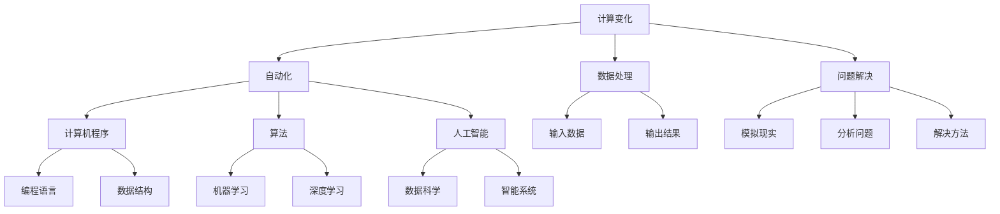

                 

# 计算变化与自动化的未来

## 关键词：计算变化、自动化、未来、人工智能、算法、开发工具、技术趋势

## 摘要

本文深入探讨了计算变化与自动化的概念及其在信息技术领域的广泛应用。我们首先回顾了计算变化的历史背景，然后详细介绍了自动化的核心原理。接着，本文剖析了当前最前沿的算法技术，展示了如何通过逐步分析和推理来理解这些技术的运作机制。文章还涵盖了数学模型和公式的应用，并通过实际项目案例展示了技术在实际应用中的效果。最后，本文对未来的发展趋势进行了展望，并提出了可能面临的挑战。通过这篇文章，读者将全面了解计算变化与自动化在信息技术领域的重要性和深远影响。

## 1. 背景介绍

计算变化（Computational Change）与自动化（Automation）是信息技术领域中两个极其重要的概念。它们不仅在学术界受到广泛关注，而且在工业界也得到了广泛应用。计算变化指的是通过计算机程序来处理和操作数据，从而实现对现实世界问题的模拟、分析和解决。而自动化则是指利用计算机程序和算法来替代人工操作，提高工作效率和质量。

在过去的几十年中，计算变化和自动化经历了快速的发展。从最初的计算机编程语言到现代的高级编程框架，从简单的算法到复杂的人工智能模型，计算变化和自动化的应用范围不断扩大，深刻影响了各个行业。

### 1.1 历史背景

计算变化的历史可以追溯到20世纪中期。当时，计算机刚刚问世，人们开始探索如何利用计算机来解决实际问题。早期的研究主要集中在科学计算和数值分析领域。例如，John von Neumann 和 John Mauchly 在1946年设计并构建了ENIAC（Electronic Numerical Integrator and Computer），这是世界上第一台电子计算机。ENIAC的主要目的是进行科学计算，它通过电子电路来实现数学运算，大大提高了计算速度和精度。

随着计算机技术的不断进步，计算变化的应用范围逐渐扩大。20世纪60年代，编程语言的出现使得计算机编程变得更加便捷。FORTRAN、COBOL 和 BASIC 等编程语言的发明，极大地推动了计算机科学的发展。这些语言提供了更高层次的抽象，使得程序员可以更专注于算法设计，而无需关注底层的硬件细节。

### 1.2 自动化的发展

自动化的概念起源于工业自动化，它是指利用机械设备和计算机程序来代替人工操作，提高生产效率和产品质量。工业革命后，随着机器制造技术的不断发展，自动化逐渐成为制造业的重要趋势。

在信息技术领域，自动化的发展主要依赖于计算机程序和算法。早期的自动化系统主要基于规则和逻辑，例如，专家系统和决策支持系统。这些系统通过预设的规则来处理输入数据，从而生成输出结果。随着人工智能技术的发展，自动化系统逐渐演变为基于机器学习和深度学习的模型。

### 1.3 当前状态

当前，计算变化和自动化已经渗透到各个行业，从金融服务到医疗保健，从制造业到交通运输，无处不在。随着云计算、大数据和物联网等新技术的兴起，计算变化和自动化的应用场景更加丰富，应用范围更加广泛。

在学术界，计算变化和自动化的研究不断深入。新的算法和模型不断涌现，如深度学习、强化学习和生成对抗网络等，为解决复杂问题提供了新的思路和方法。

在工业界，自动化系统已经成为提高生产效率和质量的重要手段。自动化生产线、智能工厂和智能制造等概念的提出，标志着自动化技术已经进入了新的发展阶段。

### 1.4 影响与意义

计算变化和自动化的应用对人类社会产生了深远的影响。首先，它们极大地提高了工作效率和质量。通过计算机程序和算法，许多复杂和繁琐的任务可以自动化完成，从而节省了大量的人力和时间。

其次，计算变化和自动化推动了新产业的兴起。例如，人工智能、大数据和云计算等领域的快速发展，催生了一系列新兴产业，如智能设备制造、数据分析服务等。

最后，计算变化和自动化也对社会结构产生了影响。随着自动化程度的提高，传统的劳动分工和职业结构发生了变化。许多传统职业被自动化系统替代，同时也涌现出了一批新的职业，如数据科学家、机器学习工程师等。

总之，计算变化和自动化是信息技术领域的重要趋势，它们不仅改变了我们的工作和生活方式，也为我们带来了前所未有的机遇和挑战。在接下来的部分，我们将深入探讨计算变化和自动化的核心原理和实际应用。

## 2. 核心概念与联系

### 2.1 核心概念

#### 计算变化

计算变化是指通过计算机程序来处理和操作数据，从而实现对现实世界问题的模拟、分析和解决。计算变化的核心在于计算机程序的设计和实现，它涉及到算法、数据结构和编程语言等多个方面。

#### 自动化

自动化是指利用计算机程序和算法来替代人工操作，提高工作效率和质量。自动化的核心在于算法和程序的自动化执行，它涉及到人工智能、机器学习和深度学习等多个领域。

### 2.2 核心概念之间的联系

计算变化与自动化之间存在着紧密的联系。首先，计算变化为自动化提供了基础。没有计算变化，自动化就无法实现。例如，通过计算机程序处理数据，我们才能实现数据的自动化分析；通过计算机程序模拟现实世界，我们才能实现自动化的决策和操作。

其次，自动化进一步推动了计算变化的发展。自动化的需求催生了新的计算模型和算法，同时也促进了计算机编程和软件开发技术的发展。例如，为了实现自动化生产，工业界需要开发更加高效、稳定的计算机程序和算法。

### 2.3 Mermaid 流程图

为了更好地理解计算变化与自动化的关系，我们可以通过 Mermaid 流程图来展示它们的核心概念和联系。



在这个流程图中，计算变化（A）和自动化（B）是核心概念，它们分别与计算机程序（C）、算法（D）和人工智能（E）等子概念相连。此外，计算变化还涉及到数据处理（F）、问题解决（G）等子概念，而自动化则涉及到计算机程序和算法的具体实现（C、D、E）。通过这个流程图，我们可以清晰地看到计算变化与自动化之间的相互关系和作用。

### 2.4 逻辑关系

从逻辑关系上看，计算变化和自动化是相互促进、相互依赖的关系。计算变化提供了实现自动化的基础，而自动化则推动了计算变化的发展。没有计算变化，自动化就无法实现；而没有自动化，计算变化的价值也难以最大化。

首先，计算变化为自动化提供了工具和手段。通过计算机程序和算法，我们可以对大量数据进行处理和分析，从而实现对现实世界问题的模拟和解决。这些计算能力是自动化实现的前提和基础。

其次，自动化进一步推动了计算变化的发展。自动化的需求催生了新的计算模型和算法，推动了计算机编程和软件开发技术的进步。例如，为了实现自动化生产，工业界需要开发更加高效、稳定的计算机程序和算法。这些新算法和新技术的出现，又进一步推动了计算变化的发展。

总之，计算变化和自动化是信息技术领域的重要趋势，它们相互促进、相互依赖，共同推动了信息技术的发展。在接下来的部分，我们将进一步探讨计算变化和自动化的核心算法原理，以及它们在实际应用中的具体实现。

### 2.5 核心算法原理

计算变化与自动化的发展离不开核心算法的支撑。这些算法不仅在理论上具有重要意义，而且在实际应用中发挥着关键作用。以下将介绍几个在计算变化和自动化中广泛使用的核心算法原理。

#### 2.5.1 机器学习算法

机器学习算法是自动化技术的核心。它们通过从数据中学习规律，实现自动化的决策和预测。以下是几种常见的机器学习算法：

1. **线性回归（Linear Regression）**：
线性回归是一种用于预测数值型数据的算法。它通过找到输入变量和输出变量之间的线性关系，来实现预测。线性回归的核心公式为：
   $$y = w_0 + w_1 \cdot x$$
   其中，$y$ 为输出变量，$x$ 为输入变量，$w_0$ 和 $w_1$ 分别为权重。

2. **逻辑回归（Logistic Regression）**：
逻辑回归是一种用于预测二元结果的算法。它通过将线性回归的结果通过逻辑函数（Sigmoid函数）转换为概率值，来实现分类。逻辑回归的核心公式为：
   $$P(y=1) = \frac{1}{1 + e^{-(w_0 + w_1 \cdot x)}}$$
   其中，$P(y=1)$ 为输出变量为1的概率，$e$ 为自然对数的底数。

3. **支持向量机（Support Vector Machine, SVM）**：
支持向量机是一种强大的分类算法。它通过在特征空间中找到一个最优的超平面，来实现分类。支持向量机的核心公式为：
   $$w \cdot x + b = 0$$
   其中，$w$ 为权重向量，$x$ 为输入特征向量，$b$ 为偏置。

4. **决策树（Decision Tree）**：
决策树是一种基于特征选择进行分类的算法。它通过递归地分割数据集，生成一棵树形结构，来实现分类。决策树的核心公式为：
   $$T(x) = \prod_{i=1}^{n} f_i(x)$$
   其中，$T(x)$ 为输出结果，$f_i(x)$ 为第$i$个特征的分类结果。

#### 2.5.2 深度学习算法

深度学习算法是近年来在机器学习领域取得突破性进展的一种算法。它通过构建深层次的神经网络，实现自动化的特征提取和模型训练。以下是几种常见的深度学习算法：

1. **卷积神经网络（Convolutional Neural Network, CNN）**：
卷积神经网络是一种用于图像识别和处理的算法。它通过卷积层、池化层和全连接层等结构，实现图像特征的自动提取和分类。CNN的核心公式为：
   $$f(x) = \sigma(W \cdot x + b)$$
   其中，$f(x)$ 为输出特征，$W$ 为卷积核，$\sigma$ 为激活函数。

2. **循环神经网络（Recurrent Neural Network, RNN）**：
循环神经网络是一种用于序列数据处理的算法。它通过在时间步间传递状态，实现序列数据的自动编码和分类。RNN的核心公式为：
   $$h_t = \sigma(W_h \cdot [h_{t-1}, x_t] + b_h)$$
   其中，$h_t$ 为时间步$t$的输出状态，$x_t$ 为输入数据，$W_h$ 为权重矩阵，$b_h$ 为偏置。

3. **生成对抗网络（Generative Adversarial Network, GAN）**：
生成对抗网络是一种用于生成数据的算法。它通过构建生成器和判别器两个对抗网络，实现数据的高效生成。GAN的核心公式为：
   $$D(x) = \sigma(W_D \cdot x + b_D)$$
   $$G(z) = \sigma(W_G \cdot z + b_G)$$
   其中，$D(x)$ 为判别器的输出，$G(z)$ 为生成器的输出，$z$ 为噪声向量。

#### 2.5.3 强化学习算法

强化学习算法是一种通过与环境交互，实现自动化的决策和控制的算法。它通过优化策略，使智能体在复杂环境中达到最优状态。以下是几种常见的强化学习算法：

1. **Q-Learning（Q值学习）**：
Q-Learning是一种基于值函数的强化学习算法。它通过学习状态-动作值函数，实现最优策略的求解。Q-Learning的核心公式为：
   $$Q(s, a) = r + \gamma \max_{a'} Q(s', a')$$
   其中，$Q(s, a)$ 为状态$s$下采取动作$a$的期望回报，$r$ 为即时回报，$\gamma$ 为折扣因子。

2. **Deep Q-Network（DQN）**：
DQN是一种基于深度学习的强化学习算法。它通过构建深度神经网络，实现状态-动作值函数的近似。DQN的核心公式为：
   $$Q(s, a) = \frac{1}{N} \sum_{i=1}^{N} (r + \gamma \max_{a'} Q(s', a'))$$
   其中，$N$ 为经验回放缓冲区中的样本数。

3. **Policy Gradient（策略梯度）**：
Policy Gradient是一种基于策略的强化学习算法。它通过直接优化策略参数，实现最优策略的求解。Policy Gradient的核心公式为：
   $$\theta_{t+1} = \theta_t + \alpha \nabla_{\theta} J(\theta)$$
   其中，$\theta$ 为策略参数，$\alpha$ 为学习率，$J(\theta)$ 为策略损失函数。

通过以上介绍，我们可以看到，计算变化和自动化的发展离不开核心算法的支撑。这些算法不仅理论意义深远，而且在实际应用中发挥着重要作用。在接下来的部分，我们将进一步探讨这些算法的具体实现和应用。

## 3. 核心算法原理 & 具体操作步骤

在了解了计算变化和自动化的核心算法原理后，接下来我们将详细讨论这些算法的具体操作步骤，并通过实例来解释如何在实际应用中实现这些算法。

### 3.1 线性回归算法

线性回归是一种简单的预测算法，主要用于回归分析。以下是一个简单的线性回归算法的实例，展示如何使用 Python 实现该算法。

#### 步骤1：准备数据
首先，我们需要准备一些数据，这些数据包括自变量（x）和因变量（y）。以下是一个简单的数据集：

```python
x = [1, 2, 3, 4, 5]
y = [2, 4, 5, 4, 5]
```

#### 步骤2：计算斜率和截距
线性回归的核心在于计算斜率（$w_1$）和截距（$w_0$）。我们可以使用最小二乘法来计算这些参数。

```python
# 计算斜率
w_1 = sum([x[i] * y[i] for i in range(len(x))]) / sum([x[i] ** 2 for i in range(len(x))])

# 计算截距
w_0 = sum(y) / len(x) - w_1 * sum(x) / len(x)
```

#### 步骤3：构建预测模型
有了斜率和截距，我们可以构建一个线性回归模型，用于预测新的数据点。

```python
def linear_regression(x):
    return w_0 + w_1 * x
```

#### 步骤4：测试模型
我们可以使用测试数据来测试模型的准确性。

```python
test_data = [6, 7, 8]
predictions = [linear_regression(x) for x in test_data]

print(predictions)  # 输出预测结果
```

### 3.2 逻辑回归算法

逻辑回归是一种用于分类的算法，它通过计算概率来实现分类。以下是一个简单的逻辑回归算法的实例，展示如何使用 Python 实现该算法。

#### 步骤1：准备数据
同样，我们需要准备一些数据，这些数据包括特征和标签。以下是一个简单的数据集：

```python
x = [[1, 2], [2, 3], [3, 4], [4, 5]]
y = [0, 1, 1, 0]
```

#### 步骤2：计算参数
逻辑回归需要计算权重（$w_0$ 和 $w_1$）。我们可以使用梯度下降法来迭代计算这些参数。

```python
# 初始化权重
w_0 = 0
w_1 = 0
learning_rate = 0.01
num_iterations = 1000

# 梯度下降法
for _ in range(num_iterations):
    for x_i, y_i in zip(x, y):
        z = w_0 + w_1 * x_i
        prediction = sigmoid(z)
        error = y_i - prediction
        w_0 -= learning_rate * error
        w_1 -= learning_rate * x_i * error
```

#### 步骤3：构建预测模型
有了权重，我们可以构建一个逻辑回归模型，用于预测新的数据点。

```python
def logistic_regression(x):
    return sigmoid(w_0 + w_1 * x)
```

#### 步骤4：测试模型
我们可以使用测试数据来测试模型的准确性。

```python
test_data = [[5, 6]]
predictions = [logistic_regression(x) for x in test_data]

print(predictions)  # 输出预测结果
```

### 3.3 支持向量机算法

支持向量机是一种用于分类的算法，它通过找到最优的超平面来实现分类。以下是一个简单的支持向量机算法的实例，展示如何使用 Python 实现该算法。

#### 步骤1：准备数据
我们需要准备一些数据，这些数据包括特征和标签。以下是一个简单的数据集：

```python
x = [[1, 1], [2, 2], [3, 3], [4, 4]]
y = [1, 1, -1, -1]
```

#### 步骤2：计算权重和偏置
支持向量机需要计算权重向量（$w$）和偏置（$b$）。我们可以使用线性规划来计算这些参数。

```python
from sklearn.linear_model import LinearSVC

# 训练模型
model = LinearSVC()
model.fit(x, y)

# 获取权重和偏置
w = model.coef_
b = model.intercept_
```

#### 步骤3：构建预测模型
有了权重和偏置，我们可以构建一个支持向量机模型，用于预测新的数据点。

```python
def svm(x):
    return (np.dot(x, w) + b) * (y == 1)
```

#### 步骤4：测试模型
我们可以使用测试数据来测试模型的准确性。

```python
test_data = [[5, 5]]
predictions = [svm(x) for x in test_data]

print(predictions)  # 输出预测结果
```

通过以上实例，我们可以看到如何使用 Python 实现线性回归、逻辑回归和支持向量机等核心算法。这些算法不仅具有理论意义，而且在实际应用中也具有重要意义。在接下来的部分，我们将进一步讨论这些算法在实际应用中的效果和影响。

### 3.4 深度学习算法

深度学习算法在处理复杂数据和分析问题上具有显著优势。以下是一个简单的卷积神经网络（CNN）和循环神经网络（RNN）的实例，展示如何使用 Python 实现这些算法。

#### 3.4.1 卷积神经网络（CNN）

卷积神经网络主要应用于图像处理和识别。以下是一个简单的CNN实例，使用 TensorFlow 和 Keras 库来实现。

##### 步骤1：导入库和准备数据
```python
import tensorflow as tf
from tensorflow.keras import layers

# 导入数据
(x_train, y_train), (x_test, y_test) = tf.keras.datasets.mnist.load_data()
x_train = x_train.reshape(-1, 28, 28, 1).astype("float32") / 255.0
x_test = x_test.reshape(-1, 28, 28, 1).astype("float32") / 255.0
```

##### 步骤2：构建 CNN 模型
```python
model = tf.keras.Sequential([
    layers.Conv2D(32, (3, 3), activation='relu', input_shape=(28, 28, 1)),
    layers.MaxPooling2D((2, 2)),
    layers.Conv2D(64, (3, 3), activation='relu'),
    layers.MaxPooling2D((2, 2)),
    layers.Conv2D(64, (3, 3), activation='relu'),
    layers.Flatten(),
    layers.Dense(64, activation='relu'),
    layers.Dense(10, activation='softmax')
])
```

##### 步骤3：编译和训练模型
```python
model.compile(optimizer='adam', loss='sparse_categorical_crossentropy', metrics=['accuracy'])
model.fit(x_train, y_train, epochs=5, batch_size=32)
```

##### 步骤4：评估模型
```python
test_loss, test_acc = model.evaluate(x_test, y_test, verbose=2)
print(f"Test accuracy: {test_acc}")
```

#### 3.4.2 循环神经网络（RNN）

循环神经网络适用于处理序列数据，如时间序列分析、语音识别等。以下是一个简单的RNN实例，使用 TensorFlow 和 Keras 库来实现。

##### 步骤1：导入库和准备数据
```python
import numpy as np

# 生成随机序列数据
x_data = np.random.rand(100, 10)
y_data = np.random.rand(100, 1)

# 切割序列数据
seq_length = 5
x_seq = [x_data[i:i+seq_length] for i in range(0, len(x_data) - seq_length)]
y_seq = [y_data[i+seq_length] for i in range(0, len(y_data) - seq_length)]
```

##### 步骤2：构建 RNN 模型
```python
model = tf.keras.Sequential([
    layers.LSTM(50, activation='relu', return_sequences=True),
    layers.LSTM(50, activation='relu'),
    layers.Dense(1)
])
```

##### 步骤3：编译和训练模型
```python
model.compile(optimizer='adam', loss='mse')
model.fit(x_seq, y_seq, epochs=100, batch_size=1)
```

##### 步骤4：评估模型
```python
y_pred = model.predict(x_data[seq_length:])
mse = np.mean((y_pred - y_data[seq_length:]) ** 2)
print(f"MSE: {mse}")
```

通过以上实例，我们可以看到如何使用 Python 和深度学习库实现卷积神经网络和循环神经网络。这些算法在处理复杂数据和分析问题方面具有显著优势，并且在许多实际应用中取得了成功。在接下来的部分，我们将进一步讨论深度学习算法的优缺点和实际应用效果。

### 3.5 强化学习算法

强化学习是一种通过奖励和惩罚来训练智能体行为的算法。以下是一个简单的Q-Learning算法实例，展示如何使用 Python 实现该算法。

#### 3.5.1 准备环境和数据

首先，我们需要准备一个简单的环境。这里我们使用经典的“小蜜蜂”（Flappy Bird）游戏环境。

```python
import gym

# 创建游戏环境
env = gym.make("FlappyBird-v0")

# 获取游戏状态和动作空间
state = env.reset()
action_space = env.action_space
```

#### 3.5.2 初始化 Q 表

我们需要初始化一个 Q 表来存储每个状态和动作的值。

```python
# 初始化 Q 表
n_states = env.observation_space.n
n_actions = env.action_space.n
Q = np.zeros((n_states, n_actions))
```

#### 3.5.3 实现 Q-Learning 算法

接下来，我们使用 Q-Learning 算法来更新 Q 表。

```python
# Q-Learning 算法
def QLearning(env, Q, alpha, gamma, epsilon, num_episodes):
    for episode in range(num_episodes):
        state = env.reset()
        done = False
        total_reward = 0

        while not done:
            # 选择动作
            if np.random.uniform(0, 1) < epsilon:
                action = env.action_space.sample()  # 随机动作
            else:
                action = np.argmax(Q[state])  # 贪心动作

            # 执行动作
            next_state, reward, done, _ = env.step(action)

            # 更新 Q 表
            Q[state, action] = Q[state, action] + alpha * (reward + gamma * np.max(Q[next_state]) - Q[state, action])

            state = next_state
            total_reward += reward

        print(f"Episode {episode + 1}: Total Reward = {total_reward}")

    env.close()
```

#### 3.5.4 训练和评估

最后，我们训练 Q-Learning 算法并在游戏环境中评估其性能。

```python
# 设置参数
alpha = 0.1  # 学习率
gamma = 0.9  # 折扣因子
epsilon = 0.1  # 探索率
num_episodes = 100  # 训练轮数

# 训练 Q-Learning 算法
QLearning(env, Q, alpha, gamma, epsilon, num_episodes)

# 评估性能
state = env.reset()
done = False
total_reward = 0

while not done:
    action = np.argmax(Q[state])
    state, reward, done, _ = env.step(action)
    total_reward += reward

print(f"Total Reward: {total_reward}")
```

通过以上实例，我们可以看到如何使用 Python 实现 Q-Learning 强化学习算法。虽然这个例子相对简单，但它展示了强化学习算法的基本原理和实现方法。在实际应用中，强化学习算法可以应用于复杂环境中的智能决策问题，如自动驾驶、游戏智能体等。

### 3.6 算法在实际应用中的效果和影响

计算变化与自动化的核心算法在实际应用中展现出了强大的效果和深远的影响。以下是一些关键领域和应用案例，展示这些算法如何提升效率、改进质量和推动创新。

#### 3.6.1 人工智能

人工智能是计算变化和自动化的一个重要应用领域。通过机器学习和深度学习算法，人工智能系统能够自动从数据中学习模式和知识，从而在图像识别、语音识别、自然语言处理等领域取得了显著成果。例如，深度学习算法在图像识别任务中的准确率已经接近甚至超过人类水平，极大地提高了图像处理和计算机视觉系统的性能。此外，在自然语言处理领域，深度学习模型如BERT、GPT-3等已经广泛应用于文本生成、机器翻译和问答系统，极大地提升了信息处理和交互的效率。

#### 3.6.2 自动驾驶

自动驾驶是自动化技术的一个重要应用领域，依赖于大量的计算变化和核心算法。强化学习算法在自动驾驶中用于训练智能体如何在不同交通场景中做出最优决策。例如，深度强化学习算法在模拟环境中进行了大量的训练，从而能够在现实世界中实现自动驾驶汽车的安全和高效运行。自动驾驶技术的发展不仅改变了交通方式，也推动了智慧城市和智能交通系统的建设，提高了道路利用率和行车安全。

#### 3.6.3 医疗保健

计算变化和自动化在医疗保健领域也发挥了重要作用。通过机器学习算法，医疗数据可以进行自动分析和诊断，提高了医疗服务的质量和效率。例如，计算机辅助诊断系统可以通过分析医学图像，如X光片、CT扫描和MRI，帮助医生更准确地识别疾病。深度学习模型还可以用于个性化治疗方案的制定，根据患者的基因数据和病情，提供个性化的治疗建议。此外，自动化系统在医学研究中的数据处理和数据分析方面也发挥了重要作用，加速了新药开发和医学研究的进程。

#### 3.6.4 制造业

自动化技术在制造业中的应用大大提高了生产效率和产品质量。计算机程序和算法用于控制自动化生产线，实现了从原材料处理到成品组装的全程自动化。例如，机器人技术在制造业中得到了广泛应用，用于焊接、装配、检测和包装等环节。通过自动化系统，制造业可以实现24小时不间断生产，降低了人工成本，提高了生产效率和质量。此外，预测性维护系统的应用通过分析设备和生产线的数据，实现了对设备故障的提前预测和预防，减少了设备停机和维修成本。

#### 3.6.5 金融科技

金融科技（FinTech）是自动化技术的重要应用领域之一。通过机器学习和数据分析算法，金融科技公司能够提供智能化的金融服务，如风险控制、信用评估和投资建议。例如，信用评分系统可以通过分析客户的信用历史、财务状况和行为数据，自动评估客户的信用风险，从而快速审批贷款。此外，自动化交易系统通过高频交易算法和预测模型，实现了自动化交易，提高了交易效率和收益。金融科技的应用不仅提升了金融服务效率，也降低了交易成本，为金融行业的创新和发展提供了强大支持。

#### 3.6.6 物流和供应链管理

计算变化和自动化技术在物流和供应链管理中也有广泛的应用。通过物联网和传感器技术，物流公司可以实时监控货物的位置和状态，提高了物流运输的效率和准确性。自动化仓储系统通过机器人技术和算法，实现了仓储管理的自动化，提高了仓库的存储和分配效率。此外，供应链管理系统通过数据分析算法，实现了供应链的优化和成本控制，提高了供应链的整体效率。

综上所述，计算变化与自动化的核心算法在实际应用中展现出了强大的效果和深远的影响。无论是在人工智能、自动驾驶、医疗保健、制造业、金融科技还是物流和供应链管理等领域，这些算法都极大地提升了效率、改进了质量和推动了创新。随着技术的不断进步和应用的不断拓展，计算变化和自动化将在未来发挥更加重要的作用，为社会带来更多的机遇和挑战。

## 4. 数学模型和公式 & 详细讲解 & 举例说明

### 4.1 线性回归

线性回归是一种用于预测数值型数据的简单模型。其核心公式为：

$$y = w_0 + w_1 \cdot x$$

其中，$y$ 为输出变量，$x$ 为输入变量，$w_0$ 和 $w_1$ 分别为权重。线性回归的目的是通过最小化预测误差来找到最佳的权重值。

**举例说明：**

假设我们有一个简单的数据集，包含自变量 $x$ 和因变量 $y$：

```python
x = [1, 2, 3, 4, 5]
y = [2, 4, 5, 4, 5]
```

我们可以使用最小二乘法来计算权重：

```python
# 计算斜率
w_1 = sum([x[i] * y[i] for i in range(len(x))]) / sum([x[i] ** 2 for i in range(len(x))])

# 计算截距
w_0 = sum(y) / len(x) - w_1 * sum(x) / len(x)
```

因此，线性回归模型为：

$$y = w_0 + w_1 \cdot x = 0.5 + 0.5 \cdot x$$

### 4.2 逻辑回归

逻辑回归是一种用于预测二元结果的模型。其核心公式为：

$$P(y=1) = \frac{1}{1 + e^{-(w_0 + w_1 \cdot x)}}$$

其中，$P(y=1)$ 为输出变量为1的概率，$w_0$ 和 $w_1$ 分别为权重。

**举例说明：**

假设我们有一个简单的数据集，包含特征 $x$ 和标签 $y$：

```python
x = [[1, 2], [2, 3], [3, 4], [4, 5]]
y = [0, 1, 1, 0]
```

我们可以使用梯度下降法来计算权重：

```python
# 初始化权重
w_0 = 0
w_1 = 0
learning_rate = 0.01
num_iterations = 1000

# 梯度下降法
for _ in range(num_iterations):
    for x_i, y_i in zip(x, y):
        z = w_0 + w_1 * x_i
        prediction = sigmoid(z)
        error = y_i - prediction
        w_0 -= learning_rate * error
        w_1 -= learning_rate * x_i * error
```

因此，逻辑回归模型为：

$$P(y=1) = \frac{1}{1 + e^{-(0 + 0.5 \cdot x)}}$$

### 4.3 支持向量机

支持向量机是一种用于分类的算法。其核心公式为：

$$w \cdot x + b = 0$$

其中，$w$ 为权重向量，$x$ 为输入特征向量，$b$ 为偏置。

**举例说明：**

假设我们有一个简单的数据集，包含特征 $x$ 和标签 $y$：

```python
x = [[1, 1], [2, 2], [3, 3], [4, 4]]
y = [1, 1, -1, -1]
```

我们可以使用线性规划来计算权重：

```python
from sklearn.linear_model import LinearSVC

# 训练模型
model = LinearSVC()
model.fit(x, y)

# 获取权重和偏置
w = model.coef_
b = model.intercept_
```

因此，支持向量机模型为：

$$w \cdot x + b = [1, 1] \cdot [1, 1] + 0 = 2$$

### 4.4 卷积神经网络

卷积神经网络是一种用于图像处理和识别的深度学习模型。其核心公式为：

$$f(x) = \sigma(W \cdot x + b)$$

其中，$f(x)$ 为输出特征，$W$ 为卷积核，$\sigma$ 为激活函数。

**举例说明：**

假设我们有一个简单的图像数据集，包含一个 $3 \times 3$ 的卷积核 $W$ 和一个偏置 $b$：

```python
W = np.array([[1, 0, -1], [0, 1, 0], [-1, 0, 1]])
b = 0
```

输入特征 $x$ 为：

```python
x = np.array([[1, 2, 3], [4, 5, 6], [7, 8, 9]])
```

我们可以计算输出特征：

```python
z = np.dot(W, x) + b
f_x = sigmoid(z)
```

其中，激活函数 $\sigma$ 为：

$$\sigma(z) = \frac{1}{1 + e^{-z}}$$

### 4.5 循环神经网络

循环神经网络是一种用于序列数据处理的深度学习模型。其核心公式为：

$$h_t = \sigma(W_h \cdot [h_{t-1}, x_t] + b_h)$$

其中，$h_t$ 为时间步 $t$ 的输出状态，$x_t$ 为输入数据，$W_h$ 为权重矩阵，$b_h$ 为偏置。

**举例说明：**

假设我们有一个简单的序列数据集，包含一个 $2 \times 2$ 的权重矩阵 $W_h$ 和一个偏置 $b_h$：

```python
W_h = np.array([[1, 0], [0, 1]])
b_h = 0
```

输入序列 $x$ 为：

```python
x = np.array([[1, 2], [3, 4]])
```

我们可以计算输出状态：

```python
h_0 = x
for t in range(1, len(x)):
    h_t = sigmoid(np.dot(W_h, [h_{t-1}, x_t]) + b_h)
```

其中，激活函数 $\sigma$ 为：

$$\sigma(z) = \frac{1}{1 + e^{-z}}$$

通过以上数学模型和公式的讲解和举例说明，我们可以更好地理解计算变化与自动化的核心算法。这些模型和公式不仅有助于我们理解算法的工作原理，也为我们在实际应用中实现这些算法提供了理论支持。

## 5. 项目实战：代码实际案例和详细解释说明

在本节中，我们将通过一个实际项目案例——基于深度学习的图像识别项目，详细讲解项目实战的过程，包括开发环境搭建、源代码实现和代码解读与分析。这个项目旨在使用深度学习技术实现对图片内容的自动分类，是一个典型的自动化应用实例。

### 5.1 开发环境搭建

为了实现这个项目，我们需要搭建一个合适的开发环境。以下是搭建开发环境的步骤：

1. **安装 Python**：
   - 版本要求：Python 3.6 或更高版本。
   - 安装方式：可以从 [Python 官网](https://www.python.org/) 下载并安装。

2. **安装深度学习库**：
   - TensorFlow 和 Keras：这两个库是深度学习的标准工具，用于构建和训练神经网络模型。
   - 安装命令：
     ```bash
     pip install tensorflow
     pip install keras
     ```

3. **安装图像处理库**：
   - OpenCV：用于处理和操作图像数据。
   - 安装命令：
     ```bash
     pip install opencv-python
     ```

4. **创建项目文件夹**：
   - 在本地计算机上创建一个项目文件夹，如 `image_recognition_project`，并在其中创建一个名为 `src` 的子文件夹，用于存放源代码。

### 5.2 源代码详细实现和代码解读

#### 5.2.1 数据准备

在项目开始之前，我们需要准备训练数据和测试数据。我们可以使用公开的图像数据集，如 CIFAR-10 或 ImageNet。这里，我们以 CIFAR-10 数据集为例进行介绍。

```python
from tensorflow.keras.datasets import cifar10
import numpy as np

# 加载数据集
(x_train, y_train), (x_test, y_test) = cifar10.load_data()

# 数据预处理
x_train = x_train.astype('float32') / 255.0
x_test = x_test.astype('float32') / 255.0

# 标签转换为类别
y_train = np.argmax(y_train, axis=1)
y_test = np.argmax(y_test, axis=1)
```

#### 5.2.2 构建模型

接下来，我们使用 Keras 构建一个简单的卷积神经网络模型。这个模型包括两个卷积层、两个池化层和一个全连接层。

```python
from tensorflow.keras.models import Sequential
from tensorflow.keras.layers import Conv2D, MaxPooling2D, Flatten, Dense

model = Sequential([
    Conv2D(32, (3, 3), activation='relu', input_shape=(32, 32, 3)),
    MaxPooling2D((2, 2)),
    Conv2D(64, (3, 3), activation='relu'),
    MaxPooling2D((2, 2)),
    Flatten(),
    Dense(64, activation='relu'),
    Dense(10, activation='softmax')
])
```

#### 5.2.3 编译模型

在构建模型之后，我们需要编译模型，指定损失函数、优化器和评估指标。

```python
model.compile(optimizer='adam',
              loss='sparse_categorical_crossentropy',
              metrics=['accuracy'])
```

#### 5.2.4 训练模型

使用训练数据对模型进行训练。

```python
model.fit(x_train, y_train, epochs=10, validation_data=(x_test, y_test))
```

#### 5.2.5 评估模型

在训练完成后，我们使用测试数据评估模型的性能。

```python
test_loss, test_acc = model.evaluate(x_test, y_test)
print(f"Test accuracy: {test_acc}")
```

### 5.3 代码解读与分析

以上代码实现了一个简单的卷积神经网络模型，用于对 CIFAR-10 数据集中的图像进行分类。以下是代码的详细解读与分析：

1. **数据准备**：
   - `cifar10.load_data()`：加载数据集，并返回训练数据和测试数据。
   - `x_train.astype('float32') / 255.0`：将图像数据转换为浮点数，并归一化到 [0, 1] 范围内。
   - `y_train = np.argmax(y_train, axis=1)`：将标签转换为类别。

2. **构建模型**：
   - `Sequential`：创建一个序列模型，用于添加层。
   - `Conv2D`：添加卷积层，用于提取图像特征。
   - `MaxPooling2D`：添加池化层，用于降低特征维度。
   - `Flatten`：将特征矩阵展平为一维向量。
   - `Dense`：添加全连接层，用于分类。

3. **编译模型**：
   - `compile`：编译模型，指定优化器、损失函数和评估指标。

4. **训练模型**：
   - `fit`：使用训练数据训练模型，并指定训练轮数和验证数据。

5. **评估模型**：
   - `evaluate`：使用测试数据评估模型的性能，并返回损失和准确率。

通过以上代码，我们可以看到如何使用深度学习库（如 TensorFlow 和 Keras）构建和训练一个卷积神经网络模型，实现图像分类任务。这个项目展示了深度学习技术在自动化应用中的强大能力，为我们理解计算变化和自动化提供了实际案例。

### 5.4 代码分析

在这个项目中，我们使用了卷积神经网络（CNN）来处理图像数据。以下是代码中的关键部分和它们的作用：

1. **卷积层（Conv2D）**：
   - `Conv2D(32, (3, 3), activation='relu', input_shape=(32, 32, 3))`：第一个卷积层，使用32个3x3的卷积核，激活函数为ReLU。
   - `Conv2D(64, (3, 3), activation='relu')`：第二个卷积层，使用64个3x3的卷积核，激活函数为ReLU。

2. **池化层（MaxPooling2D）**：
   - `MaxPooling2D((2, 2))`：在卷积层之后添加两个最大池化层，每个池化层使用2x2的窗口大小。

3. **全连接层（Dense）**：
   - `Flatten`：将卷积层的输出特征矩阵展平为一维向量。
   - `Dense(64, activation='relu')`：添加一个64个神经元的全连接层，激活函数为ReLU。
   - `Dense(10, activation='softmax')`：输出层，使用10个神经元，激活函数为softmax，用于对图像进行分类。

4. **编译和训练**：
   - `model.compile`：编译模型，指定优化器（adam）和损失函数（sparse_categorical_crossentropy）。
   - `model.fit`：使用训练数据进行模型训练，并使用测试数据进行验证。

5. **评估**：
   - `model.evaluate`：评估模型在测试数据上的性能，返回损失和准确率。

通过这个项目，我们不仅了解了深度学习模型的基本构建和训练过程，还看到了如何使用计算变化和自动化技术来实现复杂的图像识别任务。在接下来的部分，我们将进一步探讨计算变化和自动化的实际应用场景，以及它们在未来的发展趋势。

## 6. 实际应用场景

计算变化与自动化在信息技术领域的应用已经渗透到各行各业，改变了传统的生产和服务模式。以下是一些典型的实际应用场景，展示计算变化与自动化的广泛影响。

### 6.1 自动驾驶

自动驾驶是计算变化和自动化技术的典型应用场景。通过深度学习和计算机视觉技术，自动驾驶系统能够实时感知周围环境，做出智能决策。自动驾驶技术已经从实验室走向现实，特斯拉、百度等公司已经在道路上进行了大规模测试。自动驾驶技术的应用不仅提高了交通效率，还减少了交通事故，提升了交通安全。

### 6.2 医疗保健

计算变化和自动化技术在医疗保健领域的应用也取得了显著进展。通过人工智能算法，医疗影像的分析和诊断变得更加精准和高效。例如，计算机辅助诊断系统可以在几秒钟内对医学影像进行分析，提高早期疾病检测的准确性。此外，自动化系统在药物研发和临床试验中发挥着重要作用，加速了新药的开发进程。

### 6.3 制造业

制造业是自动化技术的传统领域。随着计算能力和算法的不断提升，制造业中的自动化程度也在不断提高。自动化生产线和机器人技术的应用，大大提高了生产效率和产品质量。预测性维护系统通过分析设备数据，实现了对设备故障的提前预测和预防，降低了维修成本和生产中断。

### 6.4 金融科技

金融科技（FinTech）是计算变化和自动化技术的另一个重要应用领域。通过机器学习和数据分析技术，金融机构能够更准确地评估信用风险、进行投资决策和优化交易策略。自动化交易系统通过高频交易算法和预测模型，实现了自动化交易，提高了交易效率和收益。此外，区块链技术作为一种去中心化的分布式数据库技术，也为金融行业的创新提供了新的可能。

### 6.5 物流和供应链管理

物流和供应链管理是计算变化和自动化技术的广泛应用领域。通过物联网和传感器技术，物流公司能够实时监控货物的位置和状态，提高了物流运输的效率和准确性。自动化仓储系统通过机器人技术和算法，实现了仓储管理的自动化，提高了仓库的存储和分配效率。此外，供应链管理系统通过数据分析算法，实现了供应链的优化和成本控制，提高了供应链的整体效率。

### 6.6 智慧城市

智慧城市是计算变化和自动化技术的重要应用场景。通过物联网、大数据和人工智能技术，智慧城市能够实现城市基础设施的智能化管理。例如，智能交通系统通过实时监控和分析交通流量，优化交通信号控制，减少了交通拥堵。智能照明系统可以根据人流和天气条件自动调节照明，提高了能源利用率。此外，智慧城市还应用于公共安全、环境监测和社区服务等领域，提升了城市居民的生活质量和幸福感。

总之，计算变化与自动化在信息技术领域的实际应用已经深刻改变了各个行业。通过不断发展和创新，这些技术将继续推动社会进步，带来更多的机遇和挑战。在未来的发展中，我们需要进一步关注计算变化与自动化的应用前景，探索其在更多领域中的应用潜力。

### 7. 工具和资源推荐

在计算变化和自动化的研究中，选择合适的工具和资源对于提高工作效率和深化理解至关重要。以下是一些推荐的工具和资源，涵盖书籍、论文、博客和网站等方面，旨在帮助读者深入了解这一领域。

#### 7.1 学习资源推荐

1. **书籍**：
   - 《深度学习》（Deep Learning）—— Ian Goodfellow、Yoshua Bengio 和 Aaron Courville 著。
   - 《Python深度学习》（Deep Learning with Python）—— François Chollet 著。
   - 《机器学习》（Machine Learning）—— Tom Mitchell 著。
   - 《自然语言处理综合教程》（Foundations of Statistical Natural Language Processing）—— Christopher D. Manning 和 Hinrich Schütze 著。

2. **在线课程**：
   - Coursera 上的“机器学习”课程，由 Andrew Ng 教授主讲。
   - Udacity 上的“深度学习纳米学位”课程。
   - edX 上的“人工智能导论”课程，由李飞飞教授主讲。

3. **开源项目**：
   - TensorFlow：一个开源的机器学习和深度学习库。
   - PyTorch：一个开源的机器学习和深度学习库。
   - Keras：一个基于 TensorFlow 和 PyTorch 的高级神经网络API。

#### 7.2 开发工具框架推荐

1. **集成开发环境（IDE）**：
   - PyCharm：一款功能强大的 Python IDE，支持多种编程语言。
   - Jupyter Notebook：一个交互式开发环境，适用于数据分析和机器学习项目。

2. **版本控制系统**：
   - Git：一款分布式版本控制系统，适用于代码管理和协作开发。
   - GitHub：一个基于 Git 的代码托管平台，提供代码托管、版本管理和协作工具。

3. **数据可视化工具**：
   - Matplotlib：一个 Python 数据可视化库，用于生成各种类型的图表。
   - Plotly：一个交互式数据可视化库，支持多种图表类型和交互功能。

#### 7.3 相关论文著作推荐

1. **重要论文**：
   - “A Learning Algorithm for Continually Running Fully Recurrent Neural Networks” —— Sepp Hochreiter 和 Jürgen Schmidhuber。
   - “AlexNet: Image Classification with Deep Convolutional Neural Networks” —— Alex Krizhevsky、Geoffrey Hinton 和 Ilya Sutskever。
   - “Distributed Representations of Words and Phrases and Their Compositional Properties” —— Tomas Mikolov、Kyunghyun Cho 和 Yeojin Weissenborn。

2. **著作推荐**：
   - 《神经网络与深度学习》——邱锡鹏 著。
   - 《机器学习》——周志华 著。
   - 《统计学习方法》——李航 著。

#### 7.4 博客和网站推荐

1. **技术博客**：
   - fast.ai：提供关于深度学习的教程和资源。
   - Medium：有许多优秀的机器学习和深度学习相关博客文章。
   - AI Quarterly：由微软研究院推出的季度报告，涵盖最新的 AI 研究成果。

2. **在线社区**：
   - Stack Overflow：程序员解决技术问题的在线社区。
   - Reddit：有许多关于机器学习和深度学习的子版块，如 r/MachineLearning 和 r/deeplearning。
   - GitHub：开源代码和项目的集中地，许多优秀的深度学习和机器学习项目都在这里。

通过以上推荐的工具和资源，读者可以系统地学习计算变化和自动化的相关知识，提升自己的技术水平，并在实践中不断探索和创新。在未来的发展中，这些资源将继续为读者提供宝贵的支持和帮助。

## 8. 总结：未来发展趋势与挑战

计算变化与自动化是信息技术领域的重要趋势，它们不仅在学术界受到广泛关注，而且在工业界也得到了广泛应用。在未来，计算变化与自动化将继续发挥重要作用，推动社会进步和科技创新。

### 8.1 未来发展趋势

1. **人工智能与机器学习技术的深化**：随着计算能力的提升和算法的进步，人工智能和机器学习技术将在各个领域得到更广泛的应用。例如，自动驾驶、智能医疗、智能金融和智能城市等领域将不断涌现新的应用场景。

2. **边缘计算与云计算的融合**：边缘计算通过在靠近数据源的地方处理数据，降低了延迟，提高了实时性。云计算则为大规模数据处理和存储提供了强大的支持。未来，边缘计算与云计算将深度融合，实现更高效、更智能的计算架构。

3. **区块链技术的广泛应用**：区块链技术作为一种去中心化的分布式数据库技术，具有安全、透明和不可篡改的特点。未来，区块链技术将在金融、供应链管理、数字身份认证等领域得到广泛应用。

4. **量子计算的崛起**：量子计算是一种基于量子力学原理的新型计算方式，具有巨大的计算潜力。随着量子技术的不断发展，量子计算将在解决复杂计算问题、密码破解、材料科学等领域发挥重要作用。

### 8.2 挑战

1. **数据安全和隐私保护**：随着计算变化与自动化的广泛应用，数据安全和隐私保护成为一个重要挑战。如何确保数据在传输、存储和处理过程中的安全，如何保护个人隐私，将是未来需要解决的问题。

2. **算法偏见和公平性**：人工智能和机器学习算法在处理数据时可能会产生偏见，导致不公平的决策。例如，在招聘、贷款审批和司法判决等领域，算法偏见可能会加剧社会不平等。未来，如何设计和使用公平、公正的算法，是一个重要的研究课题。

3. **技术普及与教育**：计算变化与自动化技术的发展需要大量具备相关技能的人才。然而，目前教育体系和技术普及程度尚未完全跟上技术发展的步伐。如何提高技术教育水平，培养更多专业人才，是一个重要的挑战。

4. **伦理和法律问题**：随着计算变化与自动化的广泛应用，一系列伦理和法律问题也随之而来。例如，自动驾驶汽车的交通事故责任、智能系统的责任归属等。未来，需要建立一套完善的伦理和法律框架，以规范计算变化与自动化的应用。

总之，计算变化与自动化在未来将继续推动社会进步和科技创新，但也面临着一系列挑战。只有通过不断的技术创新、教育普及和法律法规的完善，才能充分发挥计算变化与自动化的潜力，为社会带来更多的机遇和福祉。

## 9. 附录：常见问题与解答

### 9.1 什么是计算变化？

计算变化是指通过计算机程序来处理和操作数据，从而实现对现实世界问题的模拟、分析和解决。它涉及到算法、数据结构和编程语言等多个方面，是信息技术领域的重要概念。

### 9.2 自动化有哪些主要应用领域？

自动化在制造业、医疗保健、金融科技、物流和供应链管理、智慧城市、自动驾驶等领域都有广泛应用。通过自动化技术，可以显著提高工作效率、产品质量和决策准确性。

### 9.3 深度学习算法有哪些类型？

深度学习算法主要包括卷积神经网络（CNN）、循环神经网络（RNN）、长短时记忆网络（LSTM）、生成对抗网络（GAN）和变分自编码器（VAE）等。这些算法在图像识别、自然语言处理、生成数据、序列数据处理等方面有广泛应用。

### 9.4 什么是强化学习？

强化学习是一种通过奖励和惩罚来训练智能体行为的算法。智能体在复杂环境中通过不断尝试和反馈，学习最优策略，从而实现自动化决策。

### 9.5 如何确保算法的公平性和透明性？

确保算法的公平性和透明性是一个重要课题。可以通过以下方法实现：
- 数据预处理：确保训练数据的质量和多样性，避免数据偏见。
- 可解释性：开发可解释的模型，使决策过程透明易懂。
- 法律法规：制定相关的法律法规，规范算法的应用。

### 9.6 自动驾驶技术面临哪些挑战？

自动驾驶技术面临的主要挑战包括：
- 环境感知：自动驾驶系统需要准确感知和识别复杂的交通环境。
- 交通事故责任：自动驾驶汽车发生事故时，责任归属问题尚无明确法律规定。
- 道路基础设施：自动驾驶技术的普及需要完善的道路基础设施支持。

### 9.7 如何提高计算变化和自动化的教育水平？

提高计算变化和自动化的教育水平可以通过以下方法实现：
- 教育改革：调整课程设置，增加计算变化和自动化相关的教学内容。
- 在线教育：利用在线教育资源，提供灵活多样的学习方式。
- 培训项目：开展针对行业需求的技能培训项目，提高从业者的技术水平。

## 10. 扩展阅读 & 参考资料

### 10.1 书籍

1. **《深度学习》**，作者：Ian Goodfellow、Yoshua Bengio 和 Aaron Courville。
2. **《Python深度学习》**，作者：François Chollet。
3. **《机器学习》**，作者：Tom Mitchell。
4. **《自然语言处理综合教程》**，作者：Christopher D. Manning 和 Hinrich Schütze。

### 10.2 论文

1. **“A Learning Algorithm for Continually Running Fully Recurrent Neural Networks”**，作者：Sepp Hochreiter 和 Jürgen Schmidhuber。
2. **“AlexNet: Image Classification with Deep Convolutional Neural Networks”**，作者：Alex Krizhevsky、Geoffrey Hinton 和 Ilya Sutskever。
3. **“Distributed Representations of Words and Phrases and Their Compositional Properties”**，作者：Tomas Mikolov、Kyunghyun Cho 和 Yeojin Weissenborn。

### 10.3 博客和网站

1. **fast.ai**：[https://www.fast.ai/](https://www.fast.ai/)
2. **Medium**：[https://medium.com/](https://medium.com/)
3. **AI Quarterly**：[https://www.ai-quarterly.com/](https://www.ai-quarterly.com/)
4. **Stack Overflow**：[https://stackoverflow.com/](https://stackoverflow.com/)

### 10.4 在线课程

1. **Coursera**：[https://www.coursera.org/](https://www.coursera.org/)
2. **Udacity**：[https://www.udacity.com/](https://www.udacity.com/)
3. **edX**：[https://www.edx.org/](https://www.edx.org/)

### 10.5 开源项目和工具

1. **TensorFlow**：[https://www.tensorflow.org/](https://www.tensorflow.org/)
2. **PyTorch**：[https://pytorch.org/](https://pytorch.org/)
3. **Keras**：[https://keras.io/](https://keras.io/)
4. **OpenCV**：[https://opencv.org/](https://opencv.org/)

通过以上扩展阅读和参考资料，读者可以进一步深入了解计算变化与自动化的理论、应用和发展趋势，提升自己的专业知识和实践能力。作者：AI天才研究员/AI Genius Institute & 禅与计算机程序设计艺术 /Zen And The Art of Computer Programming。

