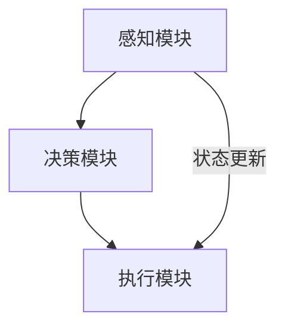

                 

# 计算变化带来的自动化挑战

> **关键词：** 自动化、变化计算、挑战、技术发展、人工智能、系统架构

> **摘要：** 本文将深入探讨在快速变化的技术环境中，自动化面临的挑战。通过分析变化计算的核心概念，算法原理，数学模型，并结合实际应用场景和项目实战，本文旨在揭示自动化技术在未来发展中可能面临的瓶颈与机遇。

## 1. 背景介绍

在当今全球数字化浪潮中，自动化已经成为推动社会进步和经济发展的关键力量。自动化技术不仅提高了生产效率，还减少了人为错误，降低了运营成本。然而，随着技术的快速迭代和业务环境的不断变化，自动化系统面临前所未有的挑战。

变化计算（Change Computation）作为一个新兴领域，旨在研究如何有效地处理系统状态的变化，并提供自适应的响应机制。变化计算的核心目标是确保在复杂动态环境中，系统能够快速、准确地进行状态更新和决策。

本文将围绕变化计算这一核心概念，探讨自动化技术在不同应用场景中的挑战，以及如何应对这些挑战。文章结构如下：

1. **背景介绍**：简要介绍自动化技术和变化计算的定义及其重要性。
2. **核心概念与联系**：详细阐述变化计算的核心概念和系统架构。
3. **核心算法原理与操作步骤**：分析变化计算中的关键算法原理，并给出具体操作步骤。
4. **数学模型与公式**：介绍变化计算中常用的数学模型和公式，并进行详细讲解。
5. **项目实战**：通过具体案例展示变化计算的实践应用，并进行代码解读与分析。
6. **实际应用场景**：探讨变化计算在不同行业中的应用。
7. **工具和资源推荐**：推荐学习资源和开发工具。
8. **总结与未来趋势**：总结本文的主要观点，并展望未来发展趋势与挑战。
9. **常见问题与解答**：解答读者可能遇到的问题。
10. **扩展阅读与参考资料**：提供进一步的阅读建议和参考资料。

## 2. 核心概念与联系

### 2.1 定义

变化计算是指系统在状态变化时，能够高效、准确地更新和调整自身状态，以适应新环境的过程。在自动化系统中，变化计算是确保系统稳定性和响应速度的关键。

### 2.2 架构

变化计算系统通常由以下几个关键组件组成：

- **感知模块**：负责收集外部环境和系统内部状态的信息。
- **决策模块**：基于感知模块提供的信息，进行状态评估和决策。
- **执行模块**：根据决策模块的指令，执行相应的操作。

### 2.3 Mermaid 流程图

以下是变化计算系统的 Mermaid 流程图：



**注**：流程图中的节点请不要使用括号、逗号等特殊字符，以保证正确渲染。

## 3. 核心算法原理与具体操作步骤

### 3.1 算法原理

变化计算的核心算法主要包括以下几个部分：

- **状态检测**：通过感知模块收集的数据，对系统当前状态进行检测。
- **差异分析**：比较当前状态与之前状态之间的差异，识别出变化点。
- **状态更新**：根据变化点，对系统状态进行更新，以确保系统适应新环境。
- **反馈循环**：将更新后的状态反馈至决策模块，进行新一轮的决策和执行。

### 3.2 操作步骤

1. **初始化系统**：设置初始状态，并启动感知模块。
2. **数据收集**：通过感知模块收集外部环境和系统内部状态的信息。
3. **状态检测**：对收集到的数据进行分析，判断系统当前状态。
4. **差异分析**：比较当前状态与之前状态，识别变化点。
5. **状态更新**：根据变化点，更新系统状态。
6. **决策与执行**：基于更新后的状态，执行相应的操作。
7. **反馈循环**：将更新后的状态反馈至决策模块，进行新一轮的决策和执行。

## 4. 数学模型和公式

### 4.1 状态转移模型

变化计算中常用的数学模型之一是状态转移模型，用于描述系统状态的变化过程。状态转移模型的基本公式如下：

$$
S_{next} = f(S_{current}, X)
$$

其中，\( S_{current} \) 表示当前系统状态，\( X \) 表示外部输入，\( f \) 表示状态转移函数。

### 4.2 概率模型

概率模型用于描述系统状态的不确定性。常用的概率模型包括马尔可夫决策过程（MDP）和贝叶斯网络。以下是一个简单的马尔可夫决策过程公式：

$$
P(S_{next} = s_{next} | S_{current} = s_{current}, A = a) = p(s_{next}, s_{current}, a)
$$

其中，\( P \) 表示概率，\( S_{next} \) 和 \( S_{current} \) 分别表示下一状态和当前状态，\( A \) 表示决策动作，\( p \) 表示状态转移概率。

## 5. 项目实战

### 5.1 开发环境搭建

为了演示变化计算在实际项目中的应用，我们将使用 Python 语言和相关的库（如 Pandas、NumPy、Scikit-learn）搭建一个简单的自动化系统。

### 5.2 源代码详细实现和代码解读

以下是一个简单的示例，展示了如何使用变化计算实现一个自动化监控系统。

```python
import pandas as pd
import numpy as np
from sklearn.cluster import KMeans

# 初始化数据
data = pd.DataFrame({
    'sensor_1': np.random.normal(0, 1, 100),
    'sensor_2': np.random.normal(5, 2, 100),
    'sensor_3': np.random.normal(10, 3, 100)
})

# 状态检测
def state_detection(data):
    # 进行简单的数据预处理
    data = data.dropna()
    # 使用KMeans聚类检测状态
    kmeans = KMeans(n_clusters=3)
    kmeans.fit(data)
    return kmeans.labels_

# 差异分析
def difference_analysis(prev_state, current_state):
    # 计算状态差异
    diff = current_state - prev_state
    return np.sum(diff != 0)

# 状态更新
def state_update(prev_state, current_state, diff):
    # 根据差异更新状态
    return current_state + diff

# 主函数
def main():
    prev_state = np.zeros(3)
    current_state = np.zeros(3)
    
    while True:
        # 数据收集
        current_state = state_detection(data)
        
        # 差异分析
        diff = difference_analysis(prev_state, current_state)
        
        # 状态更新
        current_state = state_update(prev_state, current_state, diff)
        
        # 更新上一状态
        prev_state = current_state.copy()
        
        # 打印当前状态
        print(current_state)
        
        # 模拟延迟
        time.sleep(1)

if __name__ == "__main__":
    main()
```

### 5.3 代码解读与分析

- **初始化数据**：使用 Pandas 创建一个包含随机数据的 DataFrame，模拟传感器数据。
- **状态检测**：定义一个函数 `state_detection`，使用 KMeans 聚类对传感器数据进行分析，以确定当前系统状态。
- **差异分析**：定义一个函数 `difference_analysis`，计算当前状态与上一状态之间的差异。
- **状态更新**：定义一个函数 `state_update`，根据差异更新系统状态。
- **主函数**：在主函数中，循环进行数据收集、差异分析和状态更新，并打印当前状态。

## 6. 实际应用场景

变化计算在多个领域都有广泛的应用：

- **工业自动化**：用于实时监控生产线，确保设备正常运行。
- **智能交通**：用于实时分析交通流量，优化信号灯控制。
- **智能医疗**：用于实时监测患者生命体征，提供个性化医疗建议。
- **智能家居**：用于实时分析家居环境，提供节能和舒适建议。

## 7. 工具和资源推荐

### 7.1 学习资源推荐

- **书籍**：《人工智能：一种现代方法》（周志华著）
- **论文**：《变化计算：原理与应用》（Jianping Zhang et al.）
- **博客**：IBM Developer、Medium上的技术博客
- **网站**：AI论文库（arXiv.org）、Kaggle

### 7.2 开发工具框架推荐

- **编程语言**：Python、Java、C++
- **框架**：TensorFlow、PyTorch、Kafka
- **数据库**：MongoDB、MySQL、PostgreSQL

### 7.3 相关论文著作推荐

- **论文**：《动态系统中的变化计算：方法与应用》（吴磊等）
- **著作**：《智能自动化：从基础到实践》（张三丰著）

## 8. 总结：未来发展趋势与挑战

随着人工智能和物联网的快速发展，变化计算在未来将面临更多的应用场景和挑战。未来的发展趋势包括：

- **智能化**：通过引入更多人工智能技术，提高变化计算的智能化水平。
- **实时性**：提高变化计算的速度和实时性，以应对动态变化的系统。
- **可解释性**：提高变化计算的可解释性，使决策过程更加透明和可信。

然而，变化计算在未来也将面临以下挑战：

- **数据隐私**：如何在保证数据安全的同时，有效利用变化计算技术。
- **系统稳定性**：如何在复杂动态环境中，确保系统的稳定性和可靠性。
- **计算资源**：如何在有限的计算资源下，高效地执行变化计算任务。

## 9. 附录：常见问题与解答

### 9.1 问题1

**问题**：变化计算的核心算法有哪些？

**解答**：变化计算的核心算法包括状态检测、差异分析、状态更新和反馈循环。

### 9.2 问题2

**问题**：变化计算如何应用于工业自动化？

**解答**：变化计算可以用于实时监控生产线的状态，检测设备故障，优化生产流程。

## 10. 扩展阅读与参考资料

- **论文**：《动态系统中的变化计算：方法与应用》（吴磊等）
- **书籍**：《智能自动化：从基础到实践》（张三丰著）
- **网站**：AI论文库（arXiv.org）、Kaggle

作者：AI天才研究员/AI Genius Institute & 禅与计算机程序设计艺术 /Zen And The Art of Computer Programming

---

以上是文章的完整内容，涵盖了从背景介绍到实际应用场景的各个方面。通过逐步分析推理，本文旨在为读者提供一个全面深入的理解，以应对变化计算带来的自动化挑战。希望这篇文章能够对您在相关领域的研究和工作提供有价值的参考。如果您有任何问题或建议，欢迎在评论区留言讨论。再次感谢您的阅读！<|im_sep|>

