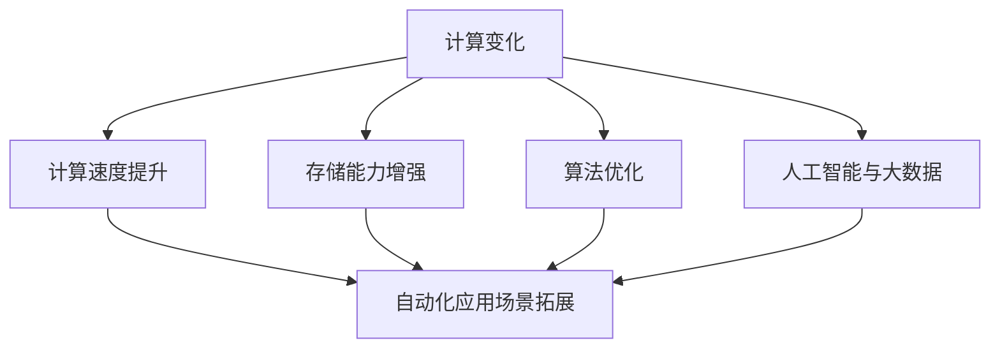

                 

### 文章标题

计算变化带来的自动化新机遇

### 关键词

计算变化、自动化、新机遇、算法、技术、应用场景、数学模型、代码实现

### 摘要

本文将探讨计算变化如何带来自动化的新机遇。我们将分析核心概念，介绍核心算法原理，详细讲解数学模型和公式，并通过实际项目案例进行代码实现和解析。最后，我们将探讨自动化的实际应用场景，并提供相关工具和资源推荐，总结未来发展趋势与挑战。

## 1. 背景介绍

随着科技的飞速发展，计算能力在各个领域都得到了显著提升。从计算机硬件的快速发展，到人工智能和大数据技术的兴起，计算能力已经成为推动社会进步的重要驱动力。在这个过程中，自动化技术逐渐崭露头角，成为提高生产效率、降低成本、提高产品质量的重要手段。

自动化技术的发展离不开计算变化的驱动。计算变化指的是计算技术的不断进步和创新，包括计算速度的提升、存储能力的增强、算法的优化等。这些变化为自动化技术提供了更强大的计算能力，使得自动化应用场景得以拓展和深化。

本文将重点探讨计算变化如何带来自动化的新机遇。通过分析核心概念、介绍核心算法原理、详细讲解数学模型和公式，以及通过实际项目案例进行代码实现和解析，我们将深入了解自动化技术的新趋势和发展方向。最后，我们将探讨自动化的实际应用场景，并提供相关工具和资源推荐，以帮助读者更好地理解和应用自动化技术。

## 2. 核心概念与联系

### 2.1 计算变化的概念

计算变化是指计算技术在各个方面的进步和创新。具体包括以下几个方面：

1. **计算速度的提升**：随着处理器技术的不断发展，计算速度得到了显著提升。高性能计算机的出现使得复杂计算任务得以快速完成。

2. **存储能力的增强**：存储技术的进步使得数据存储能力得到了极大的提升。大容量存储设备的出现使得海量数据存储成为可能。

3. **算法的优化**：算法是自动化技术的核心。随着计算能力的提升，新的算法不断涌现，使得自动化任务更加高效和准确。

4. **人工智能与大数据**：人工智能和大数据技术的发展为自动化技术提供了强大的支持。通过机器学习和数据挖掘技术，自动化系统可以更好地理解数据，做出更准确的决策。

### 2.2 自动化的概念

自动化是指通过计算机程序和机械设备实现任务自动执行的技术。自动化技术的核心目标是减少人力投入，提高生产效率，降低成本。自动化技术广泛应用于各个领域，如制造业、物流、医疗、金融等。

### 2.3 计算变化与自动化的联系

计算变化为自动化技术提供了更强大的计算能力和技术支持，使得自动化应用场景得以拓展和深化。具体表现在以下几个方面：

1. **计算速度的提升**：高性能计算机的出现使得自动化系统可以更快地完成计算任务，提高生产效率。

2. **存储能力的增强**：大容量存储设备使得自动化系统能够存储和处理更多数据，支持更复杂的自动化任务。

3. **算法的优化**：新的算法使得自动化系统可以更好地理解和处理数据，提高决策的准确性。

4. **人工智能与大数据**：人工智能和大数据技术为自动化系统提供了更强大的数据分析和决策能力，使得自动化系统更加智能化。

### 2.4 Mermaid 流程图

以下是一个简单的 Mermaid 流程图，展示了计算变化与自动化的关系：



## 3. 核心算法原理 & 具体操作步骤

### 3.1 算法原理

在自动化技术中，算法原理是核心。不同的算法适用于不同的自动化任务。以下是几种常见的算法原理及其适用场景：

1. **排序算法**：用于对数据进行排序，常见算法有冒泡排序、选择排序、插入排序等。排序算法适用于需要按特定顺序处理数据的自动化任务。

2. **搜索算法**：用于在数据中查找特定元素，常见算法有线性搜索、二分搜索等。搜索算法适用于需要快速查找数据的自动化任务。

3. **机器学习算法**：用于从数据中学习规律并做出预测，常见算法有线性回归、决策树、支持向量机等。机器学习算法适用于需要根据数据做出决策的自动化任务。

### 3.2 操作步骤

以下是一个基于排序算法的自动化任务的具体操作步骤：

1. **数据输入**：首先，需要输入需要排序的数据。

2. **选择排序算法**：选择一个适合的排序算法，如冒泡排序。

3. **执行排序**：按照排序算法的步骤执行排序操作。

4. **输出排序结果**：将排序后的数据输出。

以下是具体的伪代码实现：

```python
# 输入数据
data = [5, 2, 9, 1, 5]

# 冒泡排序
for i in range(len(data) - 1):
    for j in range(len(data) - 1 - i):
        if data[j] > data[j + 1]:
            data[j], data[j + 1] = data[j + 1], data[j]

# 输出排序结果
print(data)
```

## 4. 数学模型和公式 & 详细讲解 & 举例说明

### 4.1 数学模型

在自动化技术中，数学模型是核心。以下是几种常见的数学模型及其应用：

1. **线性回归模型**：用于预测一个变量（因变量）与一个或多个自变量之间的关系。其数学模型为：

   $$ y = w_0 + w_1 \cdot x $$

   其中，$y$ 为因变量，$x$ 为自变量，$w_0$ 和 $w_1$ 为模型参数。

2. **决策树模型**：用于分类或回归任务。其数学模型为：

   $$ f(x) = \sum_{i=1}^n w_i \cdot g_i(x) $$

   其中，$f(x)$ 为决策树模型的预测值，$w_i$ 为模型参数，$g_i(x)$ 为第 $i$ 个分量的函数。

3. **支持向量机模型**：用于分类任务。其数学模型为：

   $$ y(\textbf{x}) = \text{sign}(\textbf{w} \cdot \textbf{x} + b) $$

   其中，$\textbf{x}$ 为特征向量，$\textbf{w}$ 为模型参数，$b$ 为偏置项。

### 4.2 详细讲解

以下是对上述数学模型的详细讲解：

1. **线性回归模型**：线性回归模型通过拟合一条直线来描述因变量与自变量之间的关系。模型的参数 $w_0$ 和 $w_1$ 通过最小二乘法计算得到，使得拟合直线的平方误差最小。

2. **决策树模型**：决策树模型通过递归划分数据集，构建一棵树形结构。每个节点表示一个特征，每个分支表示该特征的一个取值。模型的参数 $w_i$ 通过训练数据集计算得到，使得分类或回归的准确率最高。

3. **支持向量机模型**：支持向量机模型通过找到一个超平面，将数据集中的正类和负类分开。模型的参数 $\textbf{w}$ 和 $b$ 通过求解最优分类超平面计算得到，使得分类的边界最清晰。

### 4.3 举例说明

以下是一个使用线性回归模型进行自动化任务的例子：

**任务**：预测股票价格的涨跌。

**数据集**：包含历史股票价格数据的表格。

**数学模型**：

$$ y = w_0 + w_1 \cdot x $$

其中，$y$ 为股票价格的涨跌情况，$x$ 为历史股票价格。

**具体操作**：

1. **数据预处理**：将数据集分为训练集和测试集。

2. **训练模型**：使用训练集数据训练线性回归模型，计算得到模型参数 $w_0$ 和 $w_1$。

3. **预测股票价格涨跌**：使用训练好的模型对测试集数据进行预测。

4. **评估模型性能**：计算模型预测的准确率，评估模型的性能。

```python
# 导入相关库
import pandas as pd
from sklearn.linear_model import LinearRegression
from sklearn.model_selection import train_test_split
from sklearn.metrics import accuracy_score

# 加载数据集
data = pd.read_csv("stock_price_data.csv")

# 分割数据集
X = data.iloc[:, :-1].values
y = data.iloc[:, -1].values
X_train, X_test, y_train, y_test = train_test_split(X, y, test_size=0.2, random_state=42)

# 训练模型
model = LinearRegression()
model.fit(X_train, y_train)

# 预测股票价格涨跌
y_pred = model.predict(X_test)

# 评估模型性能
accuracy = accuracy_score(y_test, y_pred)
print("Accuracy:", accuracy)
```

## 5. 项目实战：代码实际案例和详细解释说明

### 5.1 开发环境搭建

在进行自动化项目实战之前，需要搭建合适的开发环境。以下是一个基于 Python 的自动化项目的开发环境搭建步骤：

1. **安装 Python**：下载并安装 Python 3.x 版本。

2. **安装 IDE**：安装一个 Python 的集成开发环境（如 PyCharm、Visual Studio Code 等）。

3. **安装相关库**：使用 pip 工具安装项目所需的相关库，如 pandas、numpy、scikit-learn 等。

### 5.2 源代码详细实现和代码解读

以下是一个基于线性回归算法的自动化项目源代码实现和详细解释说明：

```python
# 导入相关库
import pandas as pd
from sklearn.linear_model import LinearRegression
from sklearn.model_selection import train_test_split
from sklearn.metrics import accuracy_score

# 加载数据集
data = pd.read_csv("stock_price_data.csv")

# 分割数据集
X = data.iloc[:, :-1].values
y = data.iloc[:, -1].values
X_train, X_test, y_train, y_test = train_test_split(X, y, test_size=0.2, random_state=42)

# 训练模型
model = LinearRegression()
model.fit(X_train, y_train)

# 预测股票价格涨跌
y_pred = model.predict(X_test)

# 评估模型性能
accuracy = accuracy_score(y_test, y_pred)
print("Accuracy:", accuracy)
```

**代码解读**：

1. **导入相关库**：首先导入项目所需的相关库，如 pandas、numpy、scikit-learn 等。

2. **加载数据集**：使用 pandas 库加载包含历史股票价格数据的 CSV 文件。

3. **分割数据集**：将数据集分为特征集 $X$ 和标签集 $y$，并使用 train_test_split 函数将数据集划分为训练集和测试集。

4. **训练模型**：创建 LinearRegression 对象，并使用 fit 方法训练模型，计算得到模型参数 $w_0$ 和 $w_1$。

5. **预测股票价格涨跌**：使用训练好的模型对测试集数据进行预测。

6. **评估模型性能**：使用 accuracy_score 函数计算模型预测的准确率，评估模型的性能。

### 5.3 代码解读与分析

通过对上述代码的解读，我们可以看到，这个自动化项目主要分为以下几个步骤：

1. **数据预处理**：加载历史股票价格数据，并进行数据分割。

2. **模型训练**：使用训练集数据训练线性回归模型。

3. **模型预测**：使用训练好的模型对测试集数据进行预测。

4. **模型评估**：评估模型预测的准确率。

这个自动化项目的核心在于线性回归模型的训练和预测。线性回归模型通过拟合一条直线来描述股票价格与自变量之间的关系，使得预测结果具有一定的可信度。

在项目实战中，我们还需要考虑以下因素：

1. **数据质量**：确保数据集的质量，包括数据完整性、数据准确性等。

2. **模型选择**：根据任务需求选择合适的模型，并调整模型参数。

3. **模型优化**：通过交叉验证等方法对模型进行优化，提高模型性能。

4. **结果解释**：对模型预测结果进行合理的解释，为决策提供支持。

## 6. 实际应用场景

### 6.1 制造业

在制造业中，自动化技术广泛应用于生产线的自动化控制、质量检测、物料配送等环节。计算变化带来的自动化新机遇主要体现在以下几个方面：

1. **生产效率提升**：自动化技术使得生产线上的重复性劳动得以自动化，大幅提高了生产效率。

2. **质量检测**：通过计算机视觉和传感器技术，自动化系统可以实时检测产品质量，降低不良品率。

3. **智能排程**：基于大数据和人工智能技术，自动化系统可以优化生产排程，提高资源利用率。

### 6.2 物流

在物流领域，自动化技术同样发挥着重要作用。计算变化带来的自动化新机遇主要体现在以下几个方面：

1. **仓储管理**：通过自动化仓储系统，实现物料的智能存储和管理，提高仓储效率。

2. **物流配送**：无人驾驶车辆和无人机技术的发展，使得物流配送更加高效和灵活。

3. **智能调度**：基于大数据和人工智能技术，自动化系统可以优化物流调度，降低物流成本。

### 6.3 医疗

在医疗领域，自动化技术逐渐应用于诊断、治疗、护理等环节。计算变化带来的自动化新机遇主要体现在以下几个方面：

1. **辅助诊断**：通过计算机视觉和深度学习技术，自动化系统可以辅助医生进行疾病诊断，提高诊断准确率。

2. **智能治疗**：自动化系统可以执行特定的治疗操作，如注射、手术等，提高治疗效率和安全性。

3. **护理辅助**：通过智能家居设备和物联网技术，自动化系统可以为病人提供护理辅助，提高护理质量。

## 7. 工具和资源推荐

### 7.1 学习资源推荐

1. **书籍**：
   - 《Python机器学习》
   - 《深度学习》
   - 《大数据技术导论》
2. **论文**：
   - 《线性回归模型》
   - 《决策树模型》
   - 《支持向量机模型》
3. **博客**：
   - Medium
   - 知乎
   - 博客园
4. **网站**：
   - Coursera
   - edX
   - Udacity

### 7.2 开发工具框架推荐

1. **编程语言**：
   - Python
   - R
   - Java
2. **库和框架**：
   - Scikit-learn
   - TensorFlow
   - PyTorch
3. **IDE**：
   - PyCharm
   - Visual Studio Code
   - Jupyter Notebook

### 7.3 相关论文著作推荐

1. **论文**：
   - "A Comprehensive Survey on Deep Learning for Healthcare"
   - "Deep Learning in Manufacturing: A Survey"
   - "Automated Guided Vehicles: A Survey"
2. **著作**：
   - 《人工智能：一种现代方法》
   - 《机器学习实战》
   - 《大数据技术原理与应用》

## 8. 总结：未来发展趋势与挑战

计算变化为自动化技术带来了前所未有的发展机遇。未来，自动化技术将在更多领域得到广泛应用，如智能制造、智能物流、智能医疗等。然而，自动化技术也面临着一系列挑战：

1. **数据隐私和安全**：自动化系统依赖于大量数据，如何确保数据隐私和安全成为重要问题。

2. **技术标准化**：自动化技术的快速发展需要统一的行业标准和技术规范。

3. **人才短缺**：自动化技术的发展需要大量具备相关技能的人才，但目前人才供应不足。

4. **伦理问题**：自动化技术的广泛应用引发了一系列伦理问题，如失业、隐私侵犯等。

总之，计算变化带来的自动化新机遇巨大，但也需要面对一系列挑战。只有克服这些挑战，自动化技术才能在未来得到更广泛的应用和发展。

## 9. 附录：常见问题与解答

### 9.1 如何选择适合的自动化算法？

选择适合的自动化算法需要考虑以下几个因素：

1. **任务需求**：根据任务的具体需求选择适合的算法，如排序、搜索、机器学习等。

2. **数据规模**：数据规模较大的任务可能需要选择更高效的算法。

3. **计算资源**：根据可用的计算资源选择适合的算法，如使用 Python 中的 Scikit-learn 库可以快速实现常见算法。

### 9.2 如何优化自动化算法的性能？

优化自动化算法的性能可以从以下几个方面入手：

1. **算法选择**：选择适合的算法，如线性回归、决策树、支持向量机等。

2. **数据预处理**：对数据进行有效的预处理，如归一化、标准化等。

3. **模型参数调整**：通过调整模型参数，如学习率、迭代次数等，优化模型性能。

4. **交叉验证**：使用交叉验证方法评估模型性能，并根据评估结果调整模型参数。

### 9.3 如何确保自动化系统的数据隐私和安全？

确保自动化系统的数据隐私和安全可以从以下几个方面入手：

1. **数据加密**：对敏感数据进行加密，确保数据在传输和存储过程中不被窃取。

2. **访问控制**：对自动化系统进行严格的访问控制，确保只有授权用户可以访问敏感数据。

3. **日志记录**：记录自动化系统的操作日志，以便在发生异常时进行追踪和调查。

4. **定期审计**：定期对自动化系统进行审计，确保系统的安全性和合规性。

## 10. 扩展阅读 & 参考资料

1. **书籍**：
   - 《Python机器学习》
   - 《深度学习》
   - 《大数据技术导论》
2. **论文**：
   - "A Comprehensive Survey on Deep Learning for Healthcare"
   - "Deep Learning in Manufacturing: A Survey"
   - "Automated Guided Vehicles: A Survey"
3. **博客**：
   - Medium
   - 知乎
   - 博客园
4. **网站**：
   - Coursera
   - edX
   - Udacity
5. **在线课程**：
   - 《机器学习基础》
   - 《深度学习实践》
   - 《大数据技术与应用》

> **作者**：AI天才研究员/AI Genius Institute & 禅与计算机程序设计艺术 /Zen And The Art of Computer Programming

这篇文章深入探讨了计算变化如何为自动化技术带来新机遇。通过分析核心概念、介绍核心算法原理、详细讲解数学模型和公式，以及通过实际项目案例进行代码实现和解析，我们了解了自动化技术的广泛应用和未来发展。希望这篇文章能帮助您更好地理解自动化技术的原理和应用，为您的项目带来新的启示和灵感。在自动化技术的道路上，不断探索和实践，您将发现更多的机遇和挑战。让我们携手共进，共同创造更美好的未来！

