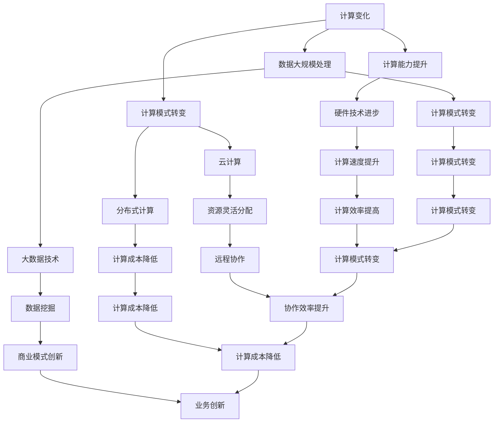

                 

# 《计算变化带来的自动化机遇》

> **关键词：** 计算变化、自动化、算法、机器学习、应用场景

> **摘要：** 本文旨在探讨计算技术带来的变化如何为自动化带来新的机遇。我们将深入探讨这些变化的核心概念、算法原理、实际应用场景以及未来发展趋势。

## 1. 背景介绍

在过去的几十年中，计算技术经历了飞速的发展。从最初的计算机硬件到软件系统，再到如今的人工智能和机器学习，计算技术的每一次变革都深刻地影响了我们的工作和生活方式。特别是近年来，随着大数据、云计算和物联网等技术的兴起，计算能力得到了空前的提升，这为自动化带来了前所未有的机遇。

自动化是指通过计算机程序和算法来实现任务的自动化执行，从而减少人为干预和重复劳动。随着计算技术的进步，自动化正在逐渐渗透到各个领域，从制造业到服务业，从医疗保健到金融投资，自动化已经成为提升生产效率、降低成本和提高服务质量的重要手段。

本文将围绕计算技术带来的变化，探讨自动化在各个领域中的应用，并分析未来自动化发展的趋势和挑战。

## 2. 核心概念与联系

在探讨自动化机遇之前，我们首先需要了解一些核心概念，包括计算变化、算法和机器学习。

### 2.1 计算变化

计算变化指的是计算技术的不断进步和变革。这些变化包括：

- **计算能力的提升**：随着硬件技术的发展，计算机的处理速度和存储能力不断提高。
- **计算模式的转变**：从传统的单机计算模式到云计算和分布式计算模式，计算资源可以更加灵活地分配和利用。
- **数据的大规模处理**：大数据技术的应用，使得我们可以对海量数据进行快速处理和分析。

### 2.2 算法

算法是解决问题的步骤和规则。在自动化中，算法起着至关重要的作用。算法可以分为以下几类：

- **基础算法**：如排序、查找、图算法等，是解决常见问题的基础。
- **机器学习算法**：如线性回归、决策树、神经网络等，用于从数据中学习并做出预测或决策。
- **深度学习算法**：如卷积神经网络（CNN）、循环神经网络（RNN）等，能够处理更复杂的数据模式。

### 2.3 机器学习

机器学习是一种通过数据训练算法，使其能够自动学习和改进的方法。机器学习可以分为以下几类：

- **监督学习**：通过已标记的数据训练模型，使其能够对新的数据进行预测或分类。
- **无监督学习**：通过未标记的数据，寻找数据中的模式和规律。
- **强化学习**：通过试错和反馈机制，使模型能够不断优化行为策略。

### 2.4 Mermaid 流程图

以下是计算变化与自动化核心概念的 Mermaid 流程图：



## 3. 核心算法原理 & 具体操作步骤

### 3.1 算法原理

在自动化领域，核心算法通常是基于机器学习或深度学习的技术。以下是一些常见的算法原理：

- **线性回归**：通过拟合数据中的线性关系来进行预测。
- **决策树**：通过一系列的规则来对数据进行分类或回归。
- **神经网络**：通过多层神经元来模拟人脑的神经传递过程，进行复杂的数据处理。

### 3.2 操作步骤

以神经网络为例，以下是构建神经网络的一般步骤：

1. **数据收集与预处理**：收集数据，并进行清洗和预处理，以便后续的训练。
2. **模型设计**：设计神经网络的架构，包括层数、神经元个数、激活函数等。
3. **模型训练**：使用训练数据对模型进行训练，不断调整模型的参数，使其能够更好地拟合数据。
4. **模型评估**：使用验证数据对模型进行评估，确定模型的性能。
5. **模型应用**：将训练好的模型应用到实际场景中，进行预测或决策。

## 4. 数学模型和公式 & 详细讲解 & 举例说明

### 4.1 神经网络中的数学模型

神经网络的核心是神经元，每个神经元都可以看作是一个简单的数学模型。以下是一个简单的神经元模型：

$$
y = \sigma(z)
$$

其中，$z$ 表示神经元的输入，$\sigma$ 表示激活函数，$y$ 表示神经元的输出。

### 4.2 激活函数

激活函数是神经网络中的一个关键组成部分，它用于引入非线性特性。以下是一些常见的激活函数：

- **Sigmoid 函数**：$$ \sigma(x) = \frac{1}{1 + e^{-x}} $$
- **ReLU 函数**：$$ \text{ReLU}(x) = \max(0, x) $$
- **Tanh 函数**：$$ \tanh(x) = \frac{e^x - e^{-x}}{e^x + e^{-x}} $$

### 4.3 损失函数

在训练神经网络时，损失函数用于衡量模型预测值与真实值之间的差距。以下是一些常见的损失函数：

- **均方误差（MSE）**：$$ \text{MSE}(y, \hat{y}) = \frac{1}{n} \sum_{i=1}^{n} (y_i - \hat{y}_i)^2 $$
- **交叉熵（Cross-Entropy）**：$$ \text{CE}(y, \hat{y}) = -\sum_{i=1}^{n} y_i \log(\hat{y}_i) $$

### 4.4 示例

假设我们有一个简单的神经网络，用于对一组数据进行分类。该网络的输入层有3个神经元，隐藏层有2个神经元，输出层有1个神经元。使用 Sigmoid 函数作为激活函数，均方误差（MSE）作为损失函数。给定一个输入向量 $X = [1, 2, 3]$，目标输出为 $Y = [0, 1]$。以下是该网络的训练过程：

1. **初始化权重和偏置**：随机初始化权重和偏置。
2. **前向传播**：计算输入层到隐藏层的输出，隐藏层到输出层的输出。
3. **计算损失**：使用 MSE 损失函数计算预测值与真实值之间的差距。
4. **反向传播**：更新权重和偏置，以减少损失。
5. **重复步骤 2-4**，直到损失足够小或达到最大迭代次数。

通过上述步骤，神经网络可以不断调整其参数，以更好地拟合数据。

## 5. 项目实战：代码实际案例和详细解释说明

### 5.1 开发环境搭建

在开始项目实战之前，我们需要搭建一个合适的开发环境。以下是搭建 Python 神经网络项目所需的步骤：

1. 安装 Python（3.6 以上版本）。
2. 安装 Python 的 pip 包管理器。
3. 使用 pip 安装必要的库，如 NumPy、Pandas、TensorFlow 或 PyTorch。

### 5.2 源代码详细实现和代码解读

以下是使用 TensorFlow 搭建一个简单的神经网络，用于对一组数据进行分类的示例代码：

```python
import tensorflow as tf
from tensorflow.keras.models import Sequential
from tensorflow.keras.layers import Dense, Activation
from tensorflow.keras.optimizers import SGD
from tensorflow.keras.losses import mean_squared_error
from tensorflow.keras.metrics import accuracy

# 数据准备
X = [[1, 2, 3], [4, 5, 6], [7, 8, 9]]
Y = [[0], [1], [1]]

# 模型搭建
model = Sequential([
    Dense(2, input_shape=(3,), activation='sigmoid'),
    Dense(1, activation='sigmoid')
])

# 编译模型
model.compile(optimizer=SGD(), loss=mean_squared_error(), metrics=['accuracy'])

# 训练模型
model.fit(X, Y, epochs=1000, batch_size=1, verbose=1)

# 评估模型
loss, accuracy = model.evaluate(X, Y, verbose=1)
print(f'Loss: {loss}, Accuracy: {accuracy}')
```

### 5.3 代码解读与分析

1. **数据准备**：首先，我们导入所需的库，并准备输入数据和目标数据。这里，我们使用两个简单的数据集，每个数据集包含三个样本。

2. **模型搭建**：我们使用 `Sequential` 模型，并添加两个全连接层。输入层有3个神经元，隐藏层有2个神经元，输出层有1个神经元。我们使用 Sigmoid 函数作为激活函数，以引入非线性特性。

3. **编译模型**：在编译模型时，我们指定了优化器（SGD）、损失函数（MSE）和评价指标（accuracy）。

4. **训练模型**：我们使用 `fit` 方法训练模型。在这里，我们设置训练的迭代次数（epochs）为1000，批量大小（batch_size）为1。

5. **评估模型**：最后，我们使用 `evaluate` 方法评估模型的性能。输出结果包括损失和准确率。

通过这个简单的示例，我们可以看到如何使用 TensorFlow 搭建和训练一个神经网络。在实际项目中，数据集会更加复杂，网络结构也会更加复杂，但基本流程是类似的。

## 6. 实际应用场景

自动化技术已经广泛应用于各个领域，以下是一些典型的应用场景：

- **制造业**：自动化生产线，机器人操作，自动化质量控制。
- **服务业**：智能客服，自动化订单处理，自动化财务管理。
- **医疗保健**：医疗图像分析，自动化诊断，自动化药物研发。
- **金融投资**：自动化交易，风险评估，自动化投资组合管理。
- **交通运输**：自动驾驶，智能交通管理，无人机配送。

在这些应用场景中，计算技术为自动化提供了强大的支持，使得许多复杂任务可以自动化完成。这不仅提高了生产效率，还降低了成本，提高了服务质量。

## 7. 工具和资源推荐

### 7.1 学习资源推荐

- **书籍**：
  - 《Python深度学习》（François Chollet 著）
  - 《深度学习》（Ian Goodfellow、Yoshua Bengio、Aaron Courville 著）
  - 《神经网络与深度学习》（邱锡鹏 著）

- **论文**：
  - 《A Theoretical Analysis of the Voted Perceptron Algorithm》（John Shawe-Taylor 和 Peter L. Bartlett 著）
  - 《A Note on a Problem in Multidimensional Scaling》（Arthur E.宓尔逊 著）

- **博客**：
  - [TensorFlow 官方文档](https://www.tensorflow.org/)
  - [PyTorch 官方文档](https://pytorch.org/)
  - [Keras 官方文档](https://keras.io/)

- **网站**：
  - [GitHub](https://github.com/)
  - [ArXiv](https://arxiv.org/)
  - [Medium](https://medium.com/)

### 7.2 开发工具框架推荐

- **开发工具**：
  - Jupyter Notebook：用于数据分析和机器学习实验。
  - Visual Studio Code：适用于 Python 开发，支持多种插件。

- **框架**：
  - TensorFlow：适用于构建和训练深度学习模型。
  - PyTorch：提供灵活的深度学习框架，支持动态计算图。
  - Keras：高级神经网络 API，易于使用。

### 7.3 相关论文著作推荐

- **论文**：
  - 《Deep Learning》（Yoshua Bengio、Ian Goodfellow、Aaron Courville 著）
  - 《Neural Networks and Deep Learning》（Ian Goodfellow、Yoshua Bengio、Aaron Courville 著）
  - 《Learning Deep Architectures for AI》（Yoshua Bengio 著）

- **著作**：
  - 《Python深度学习》（François Chollet 著）
  - 《机器学习实战》（Peter Harrington 著）
  - 《深度学习》（Google AI 著）

## 8. 总结：未来发展趋势与挑战

计算技术为自动化带来了巨大的机遇，使得许多原本复杂的任务可以自动化完成。未来，随着计算能力的进一步提升，自动化技术将在更多领域得到应用。同时，人工智能和机器学习的发展也将进一步推动自动化的进程。

然而，自动化也面临着一些挑战。首先，自动化技术的安全性和隐私性需要得到保障。其次，自动化技术的普及可能会导致就业岗位的减少，这需要社会各方共同努力解决。最后，自动化技术的复杂性使得其维护和更新变得更加困难，这也需要持续的技术创新和优化。

总之，计算技术带来的自动化机遇是巨大的，但也需要我们面对挑战，积极应对，以实现可持续的发展。

## 9. 附录：常见问题与解答

### 9.1 什么是对自动化的理解？

自动化是指通过计算机程序和算法来实现任务的自动化执行，从而减少人为干预和重复劳动。自动化技术可以应用于各种领域，从制造业到服务业，从医疗保健到金融投资。

### 9.2 机器学习和深度学习有什么区别？

机器学习是一种通过数据训练算法，使其能够自动学习和改进的方法。深度学习是机器学习的一种特殊形式，它通过多层神经网络来模拟人脑的神经传递过程，处理更复杂的数据模式。

### 9.3 如何选择合适的神经网络架构？

选择合适的神经网络架构取决于具体的任务和数据。对于简单的数据集，可以选择简单的神经网络结构；对于复杂的数据集，可以选择更深的神经网络结构或使用卷积神经网络（CNN）或循环神经网络（RNN）等。

### 9.4 自动化技术会对就业市场产生什么影响？

自动化技术的普及可能会导致一些就业岗位的减少，但同时也会创造新的就业机会。例如，自动化技术的维护和更新需要大量的技术人才。因此，社会各方需要共同努力，确保自动化技术的发展不会导致大规模的失业。

## 10. 扩展阅读 & 参考资料

- **书籍**：
  - 《Python深度学习》（François Chollet 著）
  - 《深度学习》（Ian Goodfellow、Yoshua Bengio、Aaron Courville 著）
  - 《神经网络与深度学习》（邱锡鹏 著）

- **论文**：
  - 《A Theoretical Analysis of the Voted Perceptron Algorithm》（John Shawe-Taylor 和 Peter L. Bartlett 著）
  - 《A Note on a Problem in Multidimensional Scaling》（Arthur E.宓尔逊 著）

- **博客**：
  - [TensorFlow 官方文档](https://www.tensorflow.org/)
  - [PyTorch 官方文档](https://pytorch.org/)
  - [Keras 官方文档](https://keras.io/)

- **网站**：
  - [GitHub](https://github.com/)
  - [ArXiv](https://arxiv.org/)
  - [Medium](https://medium.com/)

### 作者

**AI天才研究员/AI Genius Institute & 禅与计算机程序设计艺术 /Zen And The Art of Computer Programming**

