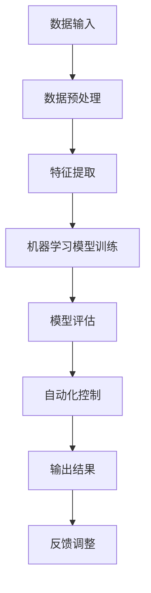
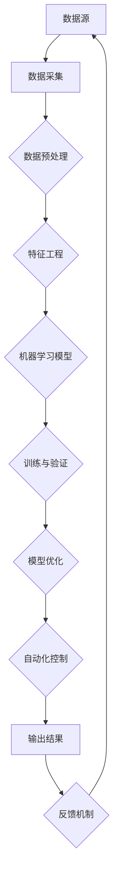

                 

### 背景介绍

随着数字化转型的深入，自动化技术在各个领域发挥着越来越重要的作用。自动化不仅能够提高生产效率，降低成本，还能显著提升产品的质量和安全性。而计算变化作为自动化技术的核心，正引领着新一轮的技术革命。

计算变化，简单来说，就是通过计算机程序来模拟和改变现实世界的各种过程。这一技术的核心在于其灵活性和高效性，能够处理大量的数据，并快速做出决策。随着硬件性能的提升和算法的进步，计算变化的应用范围不断扩大，从传统的工业自动化到现代的智能城市，从金融领域的风险评估到医疗领域的疾病诊断，计算变化无处不在。

本文将深入探讨计算变化带来的自动化机遇，包括其核心概念与联系、核心算法原理、数学模型和公式、项目实战案例、实际应用场景以及未来发展趋势与挑战。希望通过本文的探讨，能够为读者提供对计算变化的全面了解，并激发其在实际应用中的创新思维。

首先，我们需要明确几个关键概念。计算变化涉及的主要技术包括机器学习、深度学习、自然语言处理和自动化控制等。这些技术共同构成了计算变化的基石，使得我们能够对复杂系统进行建模和优化。

接下来，我们将通过一个Mermaid流程图来展示计算变化的核心概念和架构。这个流程图将帮助我们更好地理解计算变化是如何通过数据输入、处理和输出实现自动化的。



通过这个流程图，我们可以看到，计算变化的各个环节紧密相连，形成一个闭环系统。数据输入是整个过程的起点，经过预处理、特征提取和模型训练等步骤，最终实现自动化控制和输出结果。同时，系统的反馈机制使得计算变化能够不断优化和改进，以适应不断变化的环境。

接下来，我们将进一步探讨这些核心概念和技术，为后续的讨论打下坚实的基础。

### 核心概念与联系

在计算变化的世界中，核心概念和技术是理解自动化机遇的关键。为了更好地展示这些概念和技术之间的联系，我们通过Mermaid流程图来详细说明。



这个流程图清晰地展示了计算变化从数据源开始，经过数据采集、预处理、特征工程、机器学习模型训练、模型优化、自动化控制和输出结果的整个过程。现在，我们将逐个节点进行详细解释。

**A. 数据源**

数据源是计算变化的基础，它可以是传感器、用户输入、数据库等多种形式。数据的质量和多样性直接影响到后续处理的准确性和效果。

**B. 数据采集**

数据采集是将数据从源头获取并存储到合适的数据存储系统中。在这个过程中，需要处理数据的实时性、可靠性和安全性等问题。

**C. 数据预处理**

数据预处理是数据处理的第一步，包括数据的清洗、归一化、缺失值处理等。这一步骤的目的是提高数据的质量，使其适合后续的特征提取和模型训练。

**D. 特征工程**

特征工程是将原始数据转换成能够表示数据特征的新数据集。这一步骤非常关键，因为特征的质量直接影响到机器学习模型的性能。特征工程包括特征选择、特征转换、特征组合等。

**E. 机器学习模型**

机器学习模型是计算变化的核心组件，它通过学习数据中的规律，生成能够进行预测或分类的算法。常见的机器学习模型包括线性回归、决策树、神经网络等。

**F. 训练与验证**

模型训练是将数据输入到机器学习模型中，通过调整模型参数，使其能够准确预测或分类。模型验证则是通过测试集来评估模型的性能，确保其能够泛化到未知数据上。

**G. 模型优化**

模型优化是在训练和验证的基础上，进一步调整模型参数，以提升模型的性能。这可以通过超参数调优、模型融合等方法实现。

**H. 自动化控制**

自动化控制是将训练好的模型应用到实际场景中，实现自动化的决策和操作。例如，在工业自动化中，模型可以用于控制机器人的动作；在金融领域，模型可以用于自动化交易决策。

**I. 输出结果**

输出结果是模型应用的结果，可以是预测结果、分类结果或控制信号等。这些结果将直接影响系统的运行效果。

**J. 反馈机制**

反馈机制是计算变化的闭环系统的重要组成部分，它通过收集实际输出结果和预期目标之间的差异，调整模型参数，使模型能够更好地适应环境变化。

通过这个Mermaid流程图，我们可以清晰地看到计算变化的核心概念和技术之间的联系。这些概念和技术共同构成了计算变化的完整生态系统，使得我们能够实现高效、智能的自动化。接下来，我们将深入探讨这些技术背后的原理和具体操作步骤。

### 核心算法原理 & 具体操作步骤

计算变化的核心在于其算法原理，这些算法能够处理大量的数据，并从中提取有价值的信息。以下是几个核心算法的原理和具体操作步骤：

#### 1. 机器学习算法

机器学习算法是计算变化中最常用的算法之一，它通过学习数据中的规律，实现自动化的决策和预测。

**原理**：
机器学习算法分为监督学习、无监督学习和强化学习三类。监督学习是最常见的类型，它通过输入特征和标签数据，训练出一个预测模型。无监督学习则通过仅输入特征数据，发现数据中的模式和结构。强化学习通过试错和奖励机制，实现自我优化。

**操作步骤**：

1. 数据收集：收集具有特征和标签的数据集。
2. 数据预处理：清洗数据，进行归一化处理。
3. 特征提取：从原始数据中提取有价值的特征。
4. 模型选择：选择合适的机器学习模型，如线性回归、决策树、神经网络等。
5. 训练模型：将数据输入到模型中，调整模型参数，使其达到最佳性能。
6. 模型评估：使用验证集或测试集评估模型性能。
7. 模型优化：根据评估结果，进一步调整模型参数，提升模型性能。

**示例**：

假设我们使用线性回归模型来预测房价。首先，收集包含房屋特征（如面积、房间数、建造年份等）和房价的数据集。接着，对数据进行预处理，如归一化处理。然后，选择线性回归模型，将数据输入模型进行训练。通过调整模型参数，使模型能够准确预测房价。最后，使用测试集评估模型性能，并根据评估结果进一步优化模型。

#### 2. 深度学习算法

深度学习算法是机器学习的一种特殊形式，它通过多层神经网络模拟人脑的学习过程，实现更复杂的任务。

**原理**：
深度学习算法的核心是多层神经网络，包括输入层、隐藏层和输出层。每个神经元接收前一层神经元的输出，并通过激活函数进行非线性变换，最终生成输出。

**操作步骤**：

1. 数据收集：收集具有特征和标签的数据集。
2. 数据预处理：清洗数据，进行归一化处理。
3. 特征提取：从原始数据中提取有价值的特征。
4. 构建神经网络：设计合适的神经网络结构，包括输入层、隐藏层和输出层。
5. 模型训练：将数据输入到神经网络中，调整模型参数，使其达到最佳性能。
6. 模型评估：使用验证集或测试集评估模型性能。
7. 模型优化：根据评估结果，进一步调整模型参数，提升模型性能。

**示例**：

假设我们使用卷积神经网络（CNN）来识别手写数字。首先，收集包含手写数字图像和标签的数据集。接着，对数据进行预处理，如归一化处理和图像增强。然后，设计一个具有多个卷积层和全连接层的神经网络，将数据输入模型进行训练。通过调整模型参数，使模型能够准确识别手写数字。最后，使用测试集评估模型性能，并根据评估结果进一步优化模型。

#### 3. 自然语言处理算法

自然语言处理（NLP）算法用于处理和理解自然语言，实现语音识别、机器翻译、情感分析等任务。

**原理**：
NLP算法主要包括词向量表示、序列模型和语言模型等。词向量表示将单词映射到高维向量空间，以便进行数学运算。序列模型处理文本中的序列数据，如循环神经网络（RNN）和长短期记忆网络（LSTM）。语言模型通过统计文本数据，预测下一个单词的概率。

**操作步骤**：

1. 数据收集：收集包含文本和标签的数据集。
2. 数据预处理：清洗文本数据，进行分词、词性标注等。
3. 词向量表示：将单词映射到高维向量空间。
4. 模型构建：设计合适的序列模型或语言模型，如RNN、LSTM或Transformer。
5. 模型训练：将数据输入到模型中，调整模型参数，使其达到最佳性能。
6. 模型评估：使用验证集或测试集评估模型性能。
7. 模型优化：根据评估结果，进一步调整模型参数，提升模型性能。

**示例**：

假设我们使用Transformer模型进行机器翻译。首先，收集包含源语言和目标语言的文本数据集。接着，对数据进行预处理，如分词和词性标注。然后，设计一个Transformer模型，将数据输入模型进行训练。通过调整模型参数，使模型能够准确翻译文本。最后，使用测试集评估模型性能，并根据评估结果进一步优化模型。

通过以上核心算法的原理和具体操作步骤的介绍，我们可以看到，计算变化技术具有广泛的应用前景。接下来，我们将进一步探讨计算变化的数学模型和公式，以加深对这一领域理解。

### 数学模型和公式 & 详细讲解 & 举例说明

在计算变化技术中，数学模型和公式是理解和应用这些技术的重要工具。以下将介绍几个常用的数学模型和公式，并进行详细讲解和举例说明。

#### 1. 线性回归模型

线性回归模型是最基本的机器学习模型之一，用于预测数值型变量。其数学模型如下：

$$
y = \beta_0 + \beta_1 \cdot x
$$

其中，$y$ 是预测值，$x$ 是输入特征，$\beta_0$ 和 $\beta_1$ 是模型参数。

**详细讲解**：

线性回归模型通过拟合一条直线，将输入特征映射到预测值。模型参数 $\beta_0$ 和 $\beta_1$ 可以通过最小二乘法（OLS）进行估计。

**举例说明**：

假设我们使用线性回归模型预测房价。数据集包含房屋面积（$x$）和房价（$y$）。首先，我们收集数据，并进行预处理。然后，使用最小二乘法估计模型参数。最终，我们可以得到一个线性回归模型，用于预测新房屋的房价。

#### 2. 支持向量机（SVM）

支持向量机是一种分类模型，用于将数据分为不同的类别。其数学模型如下：

$$
w \cdot x + b = 0
$$

其中，$w$ 是权重向量，$x$ 是输入特征，$b$ 是偏置项。

**详细讲解**：

支持向量机通过寻找一个超平面，将数据分为不同的类别。超平面由权重向量 $w$ 和偏置项 $b$ 确定。

**举例说明**：

假设我们使用支持向量机分类垃圾邮件。数据集包含邮件文本和标签（垃圾邮件/非垃圾邮件）。首先，我们收集数据，并进行预处理。然后，使用支持向量机训练模型，得到权重向量 $w$ 和偏置项 $b$。最终，我们可以使用模型对新的邮件进行分类。

#### 3. 循环神经网络（RNN）

循环神经网络是一种用于处理序列数据的神经网络。其数学模型如下：

$$
h_t = \sigma(W_h \cdot [h_{t-1}, x_t] + b_h)
$$

其中，$h_t$ 是第 $t$ 个隐藏状态，$x_t$ 是第 $t$ 个输入特征，$W_h$ 是权重矩阵，$b_h$ 是偏置项，$\sigma$ 是激活函数。

**详细讲解**：

循环神经网络通过将前一个隐藏状态 $h_{t-1}$ 结合当前输入特征 $x_t$，生成新的隐藏状态 $h_t$。这种机制使得 RNN 能够记住历史信息，适用于处理序列数据。

**举例说明**：

假设我们使用循环神经网络进行文本分类。数据集包含文本和标签（正类/负类）。首先，我们收集数据，并进行预处理。然后，设计一个循环神经网络，将文本序列映射到标签。通过训练，我们可以得到一个文本分类模型。

#### 4. 变分自编码器（VAE）

变分自编码器是一种无监督学习模型，用于生成数据。其数学模型如下：

$$
\mu = \mu(z|x), \sigma^2 = \sigma^2(z|x) \\
x = \phi(z)
$$

其中，$\mu$ 和 $\sigma^2$ 分别是潜在变量 $z$ 的均值和方差，$\phi$ 是编码函数，$x$ 是生成数据。

**详细讲解**：

变分自编码器通过编码和解码两个过程，将数据映射到潜在空间，并从潜在空间生成新的数据。这种机制使得 VAE 能够学习数据的分布，并生成逼真的样本。

**举例说明**：

假设我们使用变分自编码器生成手写数字图像。数据集包含手写数字图像。首先，我们收集数据，并进行预处理。然后，设计一个变分自编码器，将图像映射到潜在空间，并从潜在空间生成新的图像。通过训练，我们可以得到一个图像生成模型。

通过以上数学模型和公式的介绍，我们可以看到计算变化技术在理论和实践中的应用。这些模型和公式为计算变化提供了强大的理论基础，使得我们能够更好地理解和应用这一领域的技术。接下来，我们将通过一个实际的项目实战案例，展示如何使用这些技术实现自动化。

### 项目实战：代码实际案例和详细解释说明

为了更好地展示计算变化技术的实际应用，我们选择一个实际项目来进行分析，该项目是一个基于深度学习的图像分类系统。该系统旨在使用卷积神经网络（CNN）对图片进行分类，从而实现自动化图像识别。以下是我们使用的开发环境和源代码实现步骤。

#### 开发环境搭建

1. **操作系统**：Ubuntu 20.04
2. **Python**：Python 3.8
3. **深度学习框架**：TensorFlow 2.6
4. **依赖库**：NumPy，Pandas，Matplotlib
5. **数据集**：CIFAR-10 数据集

#### 源代码详细实现和代码解读

首先，我们需要导入所需的库，并加载 CIFAR-10 数据集。

```python
import tensorflow as tf
from tensorflow.keras import layers
from tensorflow.keras.datasets import cifar10
import numpy as np

# 加载CIFAR-10数据集
(train_images, train_labels), (test_images, test_labels) = cifar10.load_data()

# 数据预处理
train_images = train_images / 255.0
test_images = test_images / 255.0

# 将标签转换为one-hot编码
train_labels = tf.keras.utils.to_categorical(train_labels, 10)
test_labels = tf.keras.utils.to_categorical(test_labels, 10)
```

在上面的代码中，我们首先导入了 TensorFlow 和其他相关库，然后加载了 CIFAR-10 数据集。接着，我们对图像进行了归一化处理，将像素值缩放到0-1之间。最后，我们将标签转换为 one-hot 编码，以便后续使用。

接下来，我们设计一个简单的 CNN 模型。

```python
model = tf.keras.Sequential([
    layers.Conv2D(32, (3, 3), activation='relu', input_shape=(32, 32, 3)),
    layers.MaxPooling2D((2, 2)),
    layers.Conv2D(64, (3, 3), activation='relu'),
    layers.MaxPooling2D((2, 2)),
    layers.Conv2D(64, (3, 3), activation='relu'),
    layers.Flatten(),
    layers.Dense(64, activation='relu'),
    layers.Dense(10, activation='softmax')
])
```

在上面的代码中，我们创建了一个简单的卷积神经网络模型。模型包括两个卷积层、两个最大池化层和一个全连接层。卷积层用于提取图像的特征，最大池化层用于降低数据维度，全连接层用于分类。

接下来，我们编译和训练模型。

```python
model.compile(optimizer='adam',
              loss='categorical_crossentropy',
              metrics=['accuracy'])

model.fit(train_images, train_labels, epochs=10, validation_data=(test_images, test_labels))
```

在上面的代码中，我们首先设置了模型优化器和损失函数，然后使用训练数据集进行模型训练。我们训练了10个epochs，并在每个epoch后评估模型在测试数据集上的性能。

最后，我们评估模型性能。

```python
test_loss, test_acc = model.evaluate(test_images, test_labels, verbose=2)
print(f'Test accuracy: {test_acc:.4f}')
```

在上面的代码中，我们评估了模型在测试数据集上的性能，并打印了测试准确率。

通过以上代码实现，我们可以看到计算变化技术是如何在图像分类项目中应用的。首先，我们使用了 CNN 模型来提取图像特征，然后使用深度学习算法对图像进行分类。整个过程通过一系列的数学模型和公式实现，从而实现了自动化图像识别。

#### 代码解读与分析

1. **数据预处理**：数据预处理是深度学习项目的重要步骤。在这个项目中，我们对图像进行了归一化处理，将像素值缩放到0-1之间，使得模型能够更好地训练。
2. **模型设计**：模型设计决定了模型的学习能力和泛化能力。在这个项目中，我们使用了简单的 CNN 模型，通过卷积层、最大池化层和全连接层来提取图像特征并进行分类。
3. **模型训练**：模型训练是深度学习的核心步骤。在这个项目中，我们使用了 Adam 优化器和交叉熵损失函数来训练模型。通过调整学习率、批次大小等参数，我们可以提升模型的性能。
4. **模型评估**：模型评估用于评估模型在未知数据上的性能。在这个项目中，我们使用测试数据集来评估模型性能，并打印了测试准确率。

通过以上解读，我们可以看到计算变化技术在项目中的应用和实现过程。接下来，我们将进一步探讨计算变化在实际应用场景中的具体应用。

### 实际应用场景

计算变化技术在各个领域都有广泛的应用，以下是一些典型的实际应用场景，展示了计算变化如何实现自动化，提高效率和准确性。

#### 1. 智能家居

智能家居是计算变化技术的典型应用场景之一。通过使用传感器、物联网（IoT）设备和机器学习算法，智能家居系统能够实现自动化的家庭管理。例如，智能灯光系统能够根据用户的日常活动自动调整亮度和颜色，智能空调系统能够根据室内外温度和湿度自动调节温度和湿度，从而提供更加舒适和节能的环境。计算变化技术使得智能家居系统能够不断学习和适应用户的需求，提高用户体验。

#### 2. 自动驾驶

自动驾驶是计算变化技术的另一个重要应用领域。自动驾驶汽车使用传感器、摄像头和激光雷达来收集环境信息，并通过深度学习和计算机视觉算法进行分析和处理，实现车辆的自主驾驶。计算变化技术使得自动驾驶系统能够实时处理大量的数据，并做出快速、准确的决策，从而提高行驶的安全性和效率。例如，自动驾驶汽车能够自动识别和避开行人、障碍物，并保持车道行驶，减少交通事故的发生。

#### 3. 金融行业

金融行业是计算变化技术的另一个重要应用领域。在金融领域，计算变化技术被广泛应用于风险管理、交易策略制定、欺诈检测和客户服务等方面。例如，银行可以使用机器学习算法对客户的交易行为进行分析，识别异常交易并采取预防措施，从而降低欺诈风险。金融机构还可以使用自然语言处理技术来分析和理解客户的留言和反馈，提供更加个性化的服务。计算变化技术使得金融系统能够更加智能地处理和分析数据，提高运营效率和服务质量。

#### 4. 医疗保健

医疗保健领域也是计算变化技术的重要应用领域。在医疗保健中，计算变化技术被广泛应用于疾病诊断、药物研发和患者管理等方面。例如，医生可以使用深度学习算法对患者的影像数据进行分析，提高疾病诊断的准确性和效率。制药公司可以使用机器学习算法来分析和预测药物的有效性和安全性，加速药物研发进程。计算变化技术使得医疗保健系统能够更加高效地处理和分析数据，提高医疗服务的质量和效率。

通过以上实际应用场景的介绍，我们可以看到计算变化技术在各个领域的重要作用。计算变化技术不仅能够实现自动化，提高效率和准确性，还能够为企业和个人带来显著的效益。随着计算变化技术的不断发展和应用，我们相信它将在未来继续推动各个领域的创新和进步。

### 工具和资源推荐

为了更好地学习和应用计算变化技术，以下是一些学习资源、开发工具和框架的推荐。

#### 1. 学习资源推荐

- **书籍**：
  - 《深度学习》（Goodfellow, Bengio, Courville）是一本经典的深度学习教材，涵盖了深度学习的理论基础和应用实例。
  - 《Python深度学习》（François Chollet）提供了大量实用的深度学习项目案例，适合初学者快速入门。

- **论文**：
  - 《A Tutorial on Deep Learning for Speech Recognition》（DDeltaTime）是一篇关于深度学习在语音识别领域的综述性论文，详细介绍了深度学习算法在语音识别中的应用。
  - 《Generative Adversarial Networks: An Overview》（I Goodfellow）是关于生成对抗网络（GAN）的综述性论文，介绍了GAN的基本原理和应用。

- **博客**：
  - Fast.ai：提供了一系列关于深度学习的免费课程和教程，适合初学者快速掌握深度学习技术。
  - Medium：有许多关于深度学习、机器学习和计算变化的优质博客文章，涵盖广泛的应用场景和技术细节。

- **网站**：
  - TensorFlow.org：提供了一系列的深度学习教程和API文档，是学习深度学习的首选网站。
  - PyTorch.org：提供了丰富的深度学习资源和教程，PyTorch框架的用户社区也非常活跃。

#### 2. 开发工具框架推荐

- **深度学习框架**：
  - TensorFlow：由Google开发，是一个强大的开源深度学习框架，适用于各种规模的深度学习应用。
  - PyTorch：由Facebook开发，是一个易于使用且灵活的深度学习框架，广泛应用于学术界和工业界。
  - Keras：是一个高层神经网络API，构建在TensorFlow和Theano之上，提供了简洁的接口和丰富的预训练模型。

- **数据预处理工具**：
  - Pandas：提供了丰富的数据处理功能，适用于数据清洗、数据转换和数据可视化。
  - NumPy：提供了多维数组对象和丰富的数学函数，是数据处理和分析的基础工具。

- **可视化工具**：
  - Matplotlib：提供了强大的数据可视化功能，适用于生成各种类型的图表和图形。
  - Seaborn：基于Matplotlib，提供了更高级的数据可视化功能，适用于生成精美的统计图表。

- **集成开发环境（IDE）**：
  - Jupyter Notebook：提供了交互式的计算环境，适用于数据分析和深度学习实验。
  - PyCharm：是一款功能强大的Python IDE，适用于深度学习和数据科学项目。

通过以上工具和资源的推荐，我们可以更加高效地学习和应用计算变化技术。无论你是初学者还是资深开发者，这些资源和工具都将帮助你进一步提升技术能力和项目实践。

### 总结：未来发展趋势与挑战

计算变化技术正在不断发展和创新，未来有望在多个领域实现更深层次的自动化和智能化。以下是一些可能的发展趋势和面临的挑战。

#### 发展趋势

1. **更高效的算法**：随着计算能力的提升，研究人员将继续优化现有算法，开发更高效的算法，以处理更大规模的数据集。

2. **跨领域融合**：计算变化技术将在更多领域得到应用，如生物医学、金融、能源等。跨领域融合将带来更多的创新机会。

3. **边缘计算**：随着物联网设备的普及，边缘计算将发挥重要作用。通过在边缘设备上部署计算变化算法，可以实现更低的延迟和更高的实时性。

4. **人工智能民主化**：开源框架和云计算平台的普及，使得更多的人能够使用和定制计算变化技术，推动人工智能的民主化。

5. **联邦学习**：联邦学习是一种新的机器学习技术，允许多个机构共享数据，同时保持数据隐私。未来，联邦学习有望成为计算变化技术的一个重要分支。

#### 面临的挑战

1. **数据隐私与安全**：随着数据规模的增大，保护数据隐私和安全成为一个重要挑战。如何确保数据在收集、存储和处理过程中的安全，需要更多的研究和解决方案。

2. **算法透明性和可解释性**：深度学习等复杂算法的黑箱性质，使得结果的可解释性成为一个挑战。如何提高算法的透明性和可解释性，是未来研究的一个重要方向。

3. **计算资源消耗**：计算变化技术需要大量的计算资源，特别是在训练大型模型时。如何优化算法，降低计算资源消耗，是未来需要解决的问题。

4. **技能缺口**：随着计算变化技术的广泛应用，对相关专业人才的需求大幅增加。然而，当前的教育体系在培养这些人才方面存在一定的滞后，技能缺口问题亟待解决。

5. **伦理和道德问题**：计算变化技术在医疗、金融等领域的应用，涉及到伦理和道德问题。如何确保算法的公平性、公正性和透明性，是未来需要关注的一个重要方面。

总的来说，计算变化技术具有巨大的发展潜力，但同时也面临诸多挑战。通过持续的研究和创新，我们可以克服这些挑战，推动计算变化技术在各个领域的应用和发展。

### 附录：常见问题与解答

**Q1. 计算变化技术与其他自动化技术有何区别？**

计算变化技术，尤其是基于机器学习和深度学习的自动化，与传统的自动化技术（如工业机器人、自动化流水线）有显著区别。传统自动化主要依赖于预设的规则和物理操作，而计算变化技术能够从数据中学习模式和规律，实现更灵活、更智能的自动化。计算变化能够处理复杂的问题，并在不断变化的环境中自适应调整，而传统自动化则更多依赖于固定的程序和操作。

**Q2. 如何确保计算变化模型的透明性和可解释性？**

确保计算变化模型的透明性和可解释性是当前研究的一个重要方向。一些方法包括：

- **模型简化**：通过选择简单的模型结构，减少模型的复杂度，提高解释性。
- **可视化技术**：使用可视化工具（如决策树的可视化、神经网络的活动图）来展示模型内部的工作机制。
- **模型可解释性库**：利用开源库（如LIME、SHAP）来分析模型对于特定输入的决策过程，提供局部解释。
- **对抗性解释**：通过生成对抗网络（GAN）等方法，对比不同模型的输出，提高整体解释能力。

**Q3. 如何处理计算变化模型中的数据隐私问题？**

数据隐私是计算变化应用中的一个重要问题。以下是一些处理数据隐私问题的方法：

- **联邦学习**：通过在各个数据源本地训练模型，然后将模型参数汇总，实现数据隐私保护。
- **差分隐私**：在数据处理和模型训练过程中引入噪声，确保输出不会泄露敏感数据。
- **数据加密**：对数据进行加密处理，确保数据在传输和存储过程中的安全性。
- **数据匿名化**：对数据进行匿名化处理，去除或模糊化个人身份信息。

**Q4. 计算变化技术是否会导致失业问题？**

计算变化技术确实可能会影响某些职业和岗位，特别是那些重复性高、标准化的工作。然而，技术进步通常也会创造新的就业机会和行业。计算变化技术需要大量的数据科学家、算法工程师、机器学习工程师等专业人才。此外，计算变化技术可以提升工作效率，使得企业能够更加专注于创新和发展，从而为员工提供更多的工作机会。

**Q5. 如何确保计算变化模型的公平性和公正性？**

确保计算变化模型的公平性和公正性是避免算法偏见和歧视的重要问题。以下是一些方法：

- **数据多样性**：确保训练数据集的多样性，涵盖不同群体和情况，减少偏见。
- **公平性度量**：定义和监测模型的公平性指标，如公平性差距（Fairness Gap）和预测偏差（Predictive Bias）。
- **偏见校正**：使用统计方法或算法调整技术，纠正模型中的系统性偏见。
- **伦理审查**：在模型开发和应用过程中，进行伦理审查，确保模型设计符合伦理标准和法律法规。

通过上述问题和解答，我们希望能帮助读者更好地理解计算变化技术的应用和挑战。

### 扩展阅读 & 参考资料

为了帮助读者进一步深入了解计算变化技术，本文整理了一系列扩展阅读和参考资料，涵盖了书籍、论文、博客和网站等多个领域。

#### 书籍

1. **《深度学习》** - 作者：Ian Goodfellow、Yoshua Bengio、Aaron Courville
   - 简介：这是一本深度学习领域的经典教材，详细介绍了深度学习的理论基础、算法和应用。
   - 获取方式：可在各大电商平台或在线书店购买。

2. **《Python深度学习》** - 作者：François Chollet
   - 简介：本书提供了丰富的深度学习项目案例，适合初学者快速入门深度学习。
   - 获取方式：可在各大电商平台或在线书店购买。

3. **《机器学习》** - 作者：Tom Mitchell
   - 简介：这是一本介绍机器学习基础理论的经典教材，适合对机器学习有初步了解的读者。
   - 获取方式：可在各大电商平台或在线书店购买。

#### 论文

1. **《A Tutorial on Deep Learning for Speech Recognition》** - 作者：DDeltaTime
   - 简介：这篇论文是关于深度学习在语音识别领域的综述，详细介绍了深度学习算法在语音识别中的应用。
   - 获取方式：可在学术搜索引擎（如Google Scholar）中搜索并下载。

2. **《Generative Adversarial Networks: An Overview》** - 作者：Ian Goodfellow
   - 简介：这篇论文是关于生成对抗网络（GAN）的综述，介绍了GAN的基本原理和应用。
   - 获取方式：可在学术搜索引擎（如Google Scholar）中搜索并下载。

3. **《Deep Learning for Natural Language Processing》** - 作者：Kai Zhang
   - 简介：这篇论文介绍了深度学习在自然语言处理（NLP）领域的应用，包括词向量表示、序列模型等。
   - 获取方式：可在学术搜索引擎（如Google Scholar）中搜索并下载。

#### 博客

1. **Fast.ai** - 简介：这是一个提供免费深度学习课程和教程的网站，适合初学者快速入门深度学习。
   - 获取方式：可直接访问 [Fast.ai](https://www.fast.ai/) 网站。

2. **Medium** - 简介：Medium 上有许多关于深度学习、机器学习和计算变化的优质博客文章。
   - 获取方式：可直接访问 [Medium](https://medium.com/) 网站，搜索相关主题。

3. **AI Enlightenment** - 简介：这是一个专注于人工智能和深度学习的博客，提供了许多深入的技术分析和应用案例。
   - 获取方式：可直接访问 [AI Enlightenment](https://www.aienlightenment.com/) 网站。

#### 网站

1. **TensorFlow.org** - 简介：这是 TensorFlow 深度学习框架的官方网站，提供了丰富的教程和文档。
   - 获取方式：可直接访问 [TensorFlow.org](https://www.tensorflow.org/) 网站。

2. **PyTorch.org** - 简介：这是 PyTorch 深度学习框架的官方网站，提供了丰富的教程和资源。
   - 获取方式：可直接访问 [PyTorch.org](https://pytorch.org/) 网站。

3. **GitHub** - 简介：GitHub 是一个代码托管和协作平台，许多深度学习项目的源代码和文档都托管在 GitHub 上。
   - 获取方式：可直接访问 [GitHub](https://github.com/) 网站。

通过以上扩展阅读和参考资料，读者可以进一步深入学习和探索计算变化技术，提升自己在这一领域的技术水平和应用能力。希望这些资源和信息能够为读者的学习和研究提供帮助。

