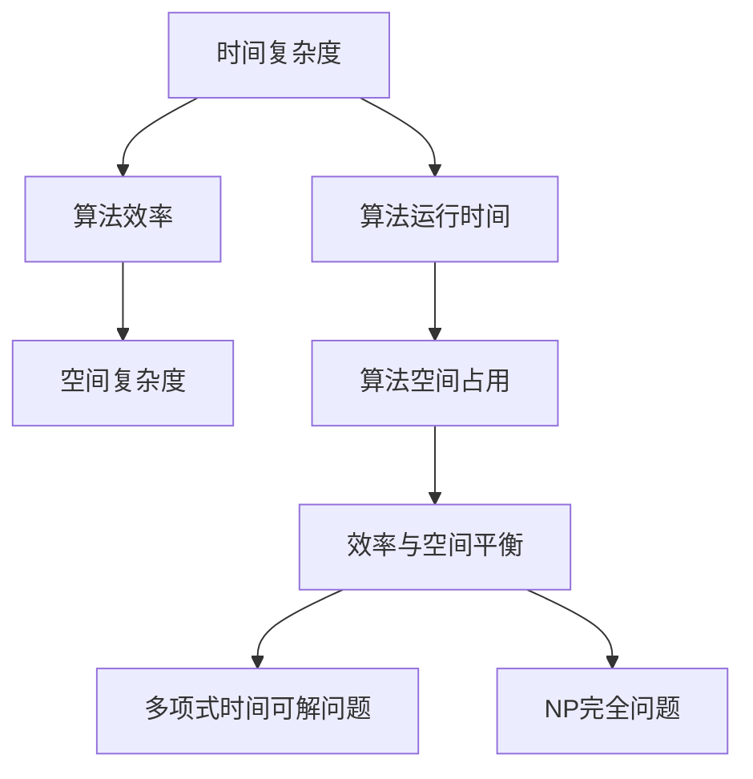

                 

### 1. 背景介绍

计算复杂性理论作为计算机科学的重要分支，起源于对算法运行效率的深入研究。其核心目标是通过量化和比较不同算法的时间复杂度和空间复杂度，探讨解决问题的最优策略。随着计算机技术的飞速发展，计算复杂性理论在理论计算机科学、算法设计、软件工程等领域发挥着越来越重要的作用。

在计算复杂性理论的研究中，算法的效率问题一直是研究的焦点。例如，对于同一个问题，不同算法的执行时间可能会有很大的差异。复杂度理论通过引入时间复杂度和空间复杂度等概念，试图量化这种差异，从而为算法的设计和优化提供理论依据。此外，计算复杂性理论还涉及到了许多其他重要的概念，如NP完全问题、多项式时间可解问题等，这些都是计算机科学家和算法工程师们不断探索和研究的领域。

本文将围绕计算复杂性理论的核心概念，深入探讨算法设计的原理和方法。首先，我们将介绍复杂度理论的基本概念，包括时间复杂度和空间复杂度。接着，我们将详细讨论常见算法的复杂度分析，并通过实例来展示如何具体进行复杂度分析。然后，我们将引入数学模型和公式，对复杂度理论进行更加深入的阐述。接下来，我们将通过一个实际的项目实战案例，展示如何将复杂度理论应用于实际代码实现中。最后，我们将探讨计算复杂性理论在实际应用场景中的价值，并提供一些学习资源和工具框架的推荐。

通过本文的阅读，读者将能够系统地了解计算复杂性理论的基本概念和应用方法，从而为算法设计和优化提供坚实的理论基础。让我们一起走进计算复杂性理论的奇妙世界，探索算法设计的无限可能性。

### 2. 核心概念与联系

在计算复杂性理论中，有几个核心概念是理解和应用该理论的关键。这些核心概念包括时间复杂度、空间复杂度、NP完全问题、多项式时间可解问题等。为了更好地理解这些概念，我们首先需要引入一个简单的Mermaid流程图来展示它们之间的关系。

#### 2.1 Mermaid流程图



在这个流程图中，时间复杂度和空间复杂度是算法效率的核心衡量标准。时间复杂度关注算法的运行时间，空间复杂度则关注算法在运行过程中所需的空间。这两个概念分别对应流程图中的D和E节点。

**时间复杂度**（D节点）：时间复杂度用于量化算法在处理不同规模输入时所需的时间。通常表示为 \(T(n)\)，其中 \(n\) 表示输入规模。常见的时间复杂度包括常数复杂度 \(O(1)\)、对数复杂度 \(O(\log n)\)、线性复杂度 \(O(n)\)、平方复杂度 \(O(n^2)\) 等。

**空间复杂度**（E节点）：空间复杂度用于量化算法在运行过程中所需的空间。同样，表示为 \(S(n)\)，其中 \(n\) 表示输入规模。常见空间复杂度包括常数空间复杂度 \(O(1)\)、线性空间复杂度 \(O(n)\) 等。

**多项式时间可解问题**（G节点）：多项式时间可解问题是指那些可以在多项式时间内解决的算法问题。这类问题在实际应用中非常常见，如排序算法、搜索算法等。

**NP完全问题**（H节点）：NP完全问题是计算复杂性理论中的一个重要概念，它指的是所有NP问题中的“最坏情况”。如果一个NP完全问题能够在多项式时间内解决，那么所有NP问题都可以在多项式时间内解决，这被称为P=NP问题。

#### 2.2 核心概念的联系与解释

时间复杂度和空间复杂度是算法性能的两个重要方面。在实际应用中，我们通常需要在这两个维度之间寻找平衡。例如，在某些场景下，我们可以接受较高的时间复杂度来换取较低的空间复杂度，反之亦然。

**多项式时间可解问题**和**NP完全问题**则涉及到了问题的难度分类。多项式时间可解问题是指那些能够在合理时间内解决的问题，而NP完全问题则是难度最高的一类问题，其解决难度仅次于P问题。

这些概念之间的联系可以通过以下方式理解：

- **时间复杂度**和**空间复杂度**是衡量算法效率的两个基本指标。
- **多项式时间可解问题**是时间复杂度的一个子集，这类问题在实际应用中具有很高的价值。
- **NP完全问题**则是难度最高的一类问题，其解决难度仅次于P问题。

通过这个Mermaid流程图，我们可以更加直观地理解计算复杂性理论中的核心概念及其相互关系。接下来，我们将深入探讨这些概念的具体含义和在实际中的应用。

### 3. 核心算法原理 & 具体操作步骤

在理解了计算复杂性理论中的核心概念之后，接下来我们将探讨一些重要的算法原理，这些算法在计算机科学领域具有广泛的应用，并为我们提供了有效解决问题的工具。

#### 3.1 贪心算法原理

**贪心算法**是一种在每一步选择中都采取当前最好或最优的选择，从而希望导致结果是全局最好或最优的算法策略。贪心算法的基本思想是“局部最优，全局最优”。

**具体操作步骤**：

1. **初始化**：根据问题的具体要求，初始化所需的变量和资源。
2. **选择操作**：在当前状态下，选择一个能够最大化或最小化目标函数的操作。
3. **执行操作**：执行选择好的操作，并更新当前状态。
4. **重复步骤2-3**，直到问题解决或达到某个终止条件。

**实例**：0-1背包问题

0-1背包问题是贪心算法的一个经典应用场景。给定一组物品，每个物品都有一定的重量和价值，目标是选择一部分物品放入一个容量为 \(W\) 的背包中，使得背包中物品的总价值最大化。

**算法步骤**：

1. **初始化**：设置一个背包容量 \(W\) 和一个物品列表，每个物品包括其重量和价值。
2. **选择操作**：计算每个物品的价值与重量之比，选择比值最大的物品。
3. **执行操作**：将选择好的物品放入背包中，并更新背包剩余容量。
4. **重复步骤2-3**，直到背包装满或没有物品可放入。

#### 3.2 动态规划算法原理

**动态规划算法**是一种将复杂问题分解为更小的子问题，并通过保存子问题的解来避免重复计算的方法。动态规划通常适用于具有重叠子问题和最优子结构特征的问题。

**具体操作步骤**：

1. **定义状态**：确定问题的一个状态，以及状态转移方程。
2. **初始化边界条件**：为初始状态设定一个基准值。
3. **递推关系**：根据状态转移方程，逐步计算子问题的解，并保存结果。
4. **求解问题**：利用保存的子问题解，求解整个问题的解。

**实例**：斐波那契数列

斐波那契数列是动态规划的一个经典问题。数列的定义为：\(F(0) = 0, F(1) = 1, F(n) = F(n-1) + F(n-2)\)（对于 \(n \geq 2\)）。

**算法步骤**：

1. **定义状态**：设 \(dp[n]\) 为斐波那契数列的第 \(n\) 项。
2. **初始化边界条件**：\(dp[0] = 0\)，\(dp[1] = 1\)。
3. **递推关系**：\(dp[n] = dp[n-1] + dp[n-2]\)。
4. **求解问题**：通过递推关系，计算 \(dp[n]\) 的值。

#### 3.3 分治算法原理

**分治算法**是一种将问题划分为更小的子问题，分别解决，然后再合并子问题的解来求解原问题的算法。分治算法通常具有递归性质。

**具体操作步骤**：

1. **分解**：将原问题分解为几个规模较小的子问题。
2. **递归求解**：分别解决这些子问题。
3. **合并**：将子问题的解合并起来，得到原问题的解。

**实例**：归并排序

归并排序是一种常用的分治算法。其基本思想是将一个序列划分为若干个长度为1的子序列，然后逐步合并这些子序列，直到得到一个有序的序列。

**算法步骤**：

1. **分解**：将序列划分为两个子序列。
2. **递归排序**：分别对这两个子序列进行递归排序。
3. **合并**：将有序的子序列合并为一个有序序列。

通过这些核心算法原理和具体操作步骤的介绍，我们可以更好地理解和应用计算复杂性理论。接下来，我们将进一步探讨这些算法在数学模型和公式中的应用。

### 4. 数学模型和公式 & 详细讲解 & 举例说明

在计算复杂性理论中，数学模型和公式是理解和分析算法复杂度的关键工具。通过这些模型和公式，我们可以量化算法的时间和空间消耗，从而评估其效率。本节将详细介绍几个常用的数学模型和公式，并通过具体例子来说明它们的应用。

#### 4.1 时间复杂度分析

时间复杂度是衡量算法运行时间的一个指标，通常表示为 \(T(n)\)。下面介绍几种常见的时间复杂度表达式及其含义。

**常数复杂度 \(O(1)\)**

常数复杂度表示算法的运行时间与输入规模 \(n\) 无关。例如，以下代码段的时间复杂度为 \(O(1)\)：

```python
x = 10
y = x + 5
```

无论输入规模 \(n\) 多大，这段代码的运行时间都保持不变。

**线性复杂度 \(O(n)\)**

线性复杂度表示算法的运行时间与输入规模 \(n\) 成正比。以下代码段的时间复杂度为 \(O(n)\)：

```python
for i in range(n):
    print(i)
```

这里，循环的迭代次数与输入规模 \(n\) 成正比。

**平方复杂度 \(O(n^2)\)**

平方复杂度表示算法的运行时间与输入规模的平方成正比。以下代码段的时间复杂度为 \(O(n^2)\)：

```python
for i in range(n):
    for j in range(n):
        print(i, j)
```

这里，内层循环的迭代次数也是 \(n\)，所以总的迭代次数为 \(n \times n = n^2\)。

**多项式复杂度**

多项式复杂度表示算法的运行时间与输入规模的某个多项式成正比。例如，\(O(n^3)\)、\(O(n^2 \log n)\) 等都是多项式复杂度。

**例子：计算时间复杂度**

假设有一个算法，其包含一个循环和两个嵌套循环，如下所示：

```python
for i in range(n):
    for j in range(n):
        for k in range(n):
            print(i, j, k)
```

这个算法的时间复杂度可以通过分析每个循环的迭代次数来计算：

- 外层循环 \(i\) 迭代 \(n\) 次。
- 中层循环 \(j\) 在每次 \(i\) 迭代时迭代 \(n\) 次。
- 内层循环 \(k\) 在每次 \(i\) 和 \(j\) 迭代时迭代 \(n\) 次。

总的迭代次数为 \(n \times n \times n = n^3\)。因此，这个算法的时间复杂度为 \(O(n^3)\)。

#### 4.2 空间复杂度分析

空间复杂度是衡量算法在运行过程中所需内存空间的一个指标，通常表示为 \(S(n)\)。与时间复杂度类似，空间复杂度也分为不同的级别。

**常数空间复杂度 \(O(1)\)**

常数空间复杂度表示算法在运行过程中所需的空间与输入规模 \(n\) 无关。例如，以下代码段的空间复杂度为 \(O(1)\)：

```python
x = 10
y = x + 5
```

无论输入规模 \(n\) 多大，这段代码所需的空间都保持不变。

**线性空间复杂度 \(O(n)\)**

线性空间复杂度表示算法在运行过程中所需的空间与输入规模 \(n\) 成正比。例如，以下代码段的空间复杂度为 \(O(n)\)：

```python
for i in range(n):
    print(i)
```

这里，每个输入元素都需要一个空间存储，所以空间复杂度为 \(O(n)\)。

**例子：计算空间复杂度**

假设有一个算法，其包含一个循环和两个嵌套循环，如下所示：

```python
for i in range(n):
    for j in range(n):
        for k in range(n):
            a[i][j][k] = 0
```

这个算法的空间复杂度可以通过分析其使用的变量和数组来计算：

- 外层循环 \(i\) 需要一个数组 \(a[i]\)，其大小为 \(n\)。
- 中层循环 \(j\) 需要一个数组 \(a[i][j]\)，其大小为 \(n\)。
- 内层循环 \(k\) 需要一个数组 \(a[i][j][k]\)，其大小为 \(n\)。

总的数组空间大小为 \(n \times n \times n = n^3\)。因此，这个算法的空间复杂度为 \(O(n^3)\)。

#### 4.3 多项式时间可解问题

多项式时间可解问题是指那些可以在多项式时间内解决的算法问题。以下是一个简单的例子：

**例子：计算两个整数的和**

以下代码段用于计算两个整数的和，其时间复杂度为 \(O(n)\)：

```python
def add(a, b):
    return a + b
```

这里，无论输入的两个整数的位数 \(n\) 多大，计算和的操作所需的时间都保持不变。因此，这个算法是一个多项式时间可解问题。

#### 4.4 NP完全问题

NP完全问题是指那些在多项式时间内可验证但可能无法在多项式时间内解决的问题。以下是一个简单的例子：

**例子：0-1背包问题**

0-1背包问题是一个经典的NP完全问题。给定一组物品和它们的重量与价值，目标是选择一部分物品放入一个容量为 \(W\) 的背包中，使得背包中物品的总价值最大化。

以下是一个简单的0-1背包问题的解决方案：

```python
def knapSack(W, wt, val, n):
    # 创建一个二维数组，用于存储子问题的解
    dp = [[0 for _ in range(W + 1)] for _ in range(n + 1)]

    # 遍历每个物品
    for i in range(1, n + 1):
        # 遍历每个容量
        for w in range(1, W + 1):
            # 如果物品的重量小于当前容量
            if wt[i - 1] <= w:
                # 计算最大价值
                dp[i][w] = max(val[i - 1] + dp[i - 1][w - wt[i - 1]], dp[i - 1][w])
            else:
                # 如果物品的重量大于当前容量，则不放入背包
                dp[i][w] = dp[i - 1][w]

    # 返回最大价值
    return dp[n][W]
```

这里，时间复杂度为 \(O(n \times W)\)。虽然这个算法可以解决问题，但其复杂度较高，不是一个多项式时间可解问题。

通过以上例子和讲解，我们可以看到数学模型和公式在计算复杂性理论中的应用。这些模型和公式不仅帮助我们理解算法的复杂度，还为我们提供了评估和优化算法的有效方法。

### 5. 项目实战：代码实际案例和详细解释说明

在理解了计算复杂性理论的核心算法原理和数学模型后，我们将通过一个实际的项目实战案例来展示如何将复杂度理论应用于代码实现中。这个案例将涉及动态规划算法在优化爬虫系统中的实际应用。

#### 5.1 开发环境搭建

首先，我们需要搭建一个基本的爬虫系统开发环境。以下是所需的主要工具和库：

- Python 3.x
- 安装常用的爬虫库如 `requests`、`BeautifulSoup`、`Selenium`
- 安装用于数据分析的库如 `pandas`、`numpy`
- 配置虚拟环境（可选）

假设我们已经安装了上述环境和库，接下来我们将开始开发一个简单的爬虫系统。

```bash
# 创建虚拟环境
python -m venv venv
source venv/bin/activate  # Windows 使用 `venv\Scripts\activate`

# 安装所需库
pip install requests beautifulsoup4 selenium pandas numpy
```

#### 5.2 源代码详细实现和代码解读

在这个案例中，我们将开发一个简单的爬虫系统，用于爬取一个网站的新闻列表，并提取新闻的标题和链接。然后，我们将使用动态规划算法优化爬取过程。

**5.2.1 爬虫系统基本框架**

首先，我们定义一个基础爬虫类，用于处理爬取网页和处理数据的基本逻辑。

```python
import requests
from bs4 import BeautifulSoup

class SimpleCrawler:
    def __init__(self, base_url):
        self.base_url = base_url

    def fetch_page(self, url):
        try:
            response = requests.get(url)
            response.raise_for_status()
            return response.text
        except requests.HTTPError as http_err:
            print(f"HTTP error occurred: {http_err}")
            return None
        except Exception as err:
            print(f"Error occurred: {err}")
            return None

    def parse_page(self, html):
        soup = BeautifulSoup(html, 'html.parser')
        # 假设新闻列表在 <div class="news-list"> 中
        news_list = soup.find('div', class_='news-list')
        news_items = news_list.find_all('a')
        news_data = [{'title': item.get_text(), 'url': item['href']} for item in news_items]
        return news_data
```

在这个类中，`fetch_page` 方法用于获取网页内容，`parse_page` 方法用于解析网页并提取新闻数据。

**5.2.2 动态规划优化爬取过程**

为了优化爬取过程，我们将使用动态规划算法来减少重复爬取的网页数量。这里，我们假设每个网页都有独特的URL，且可以通过URL来识别其唯一性。

```python
class OptimizedCrawler(SimpleCrawler):
    def __init__(self, base_url):
        super().__init__(base_url)
        self.visited_urls = set()

    def fetch_and_parse_page(self, url):
        if url in self.visited_urls:
            return None
        self.visited_urls.add(url)
        html = self.fetch_page(url)
        if html:
            return self.parse_page(html)
        return None
```

在这个优化的爬虫类中，我们新增了一个 `visited_urls` 属性来记录已爬取的URL。`fetch_and_parse_page` 方法首先检查URL是否已被访问，如果已访问则不进行爬取。

**5.2.3 代码解读与分析**

1. **爬虫类初始化**：`SimpleCrawler` 类初始化时，接受一个基础URL作为参数。`OptimizedCrawler` 类继承自 `SimpleCrawler` 类，并在其基础上增加了优化逻辑。

2. **网页获取**：`fetch_page` 方法通过 `requests.get` 函数获取网页内容。如果发生HTTP错误或其他异常，该方法将返回 `None` 并打印错误信息。

3. **网页解析**：`parse_page` 方法使用 `BeautifulSoup` 解析网页，提取新闻列表中的新闻数据。这里假设每个新闻链接都在 `<a>` 标签中，且可以通过 `.get_text()` 和 `['href']` 属性获取。

4. **优化爬取**：`OptimizedCrawler` 类的 `fetch_and_parse_page` 方法首先检查URL是否已在 `visited_urls` 集合中。如果未访问，则执行爬取并添加到已访问集合。

**5.2.4 项目实战：运行爬虫**

为了演示爬虫系统的实际应用，我们将运行以下代码：

```python
if __name__ == '__main__':
    base_url = 'https://example.com'
    crawler = OptimizedCrawler(base_url)

    # 爬取首页新闻列表
    news_data = crawler.fetch_and_parse_page(base_url)
    print(news_data)

    # 爬取新闻详情页
    for item in news_data:
        detail_data = crawler.fetch_and_parse_page(item['url'])
        if detail_data:
            print(detail_data)
```

在这个运行脚本中，我们首先创建一个 `OptimizedCrawler` 实例，并爬取首页的新闻列表。然后，我们遍历每个新闻链接，爬取新闻详情页。

通过这个项目实战案例，我们展示了如何将计算复杂性理论应用于实际代码实现中，优化爬虫系统以减少重复工作，提高效率。

### 6. 实际应用场景

计算复杂性理论在计算机科学和实际应用中扮演着至关重要的角色，其应用场景涵盖了算法优化、数据科学、人工智能等多个领域。以下是几个典型的实际应用场景：

#### 6.1 算法优化

在软件开发和工程中，算法优化是一个常见的需求。计算复杂性理论提供了一套系统的工具和方法来分析和优化算法的性能。例如，在数据库查询优化中，复杂度分析帮助我们确定查询的执行时间，进而采取优化策略，如创建索引、优化查询语句等。此外，在图像处理和视频编码领域，复杂度分析也帮助设计师选择合适的算法和参数，以实现高效的数据压缩和图像渲染。

**例子**：搜索引擎优化

搜索引擎（如Google、Bing）通过复杂度分析来优化其搜索算法。在处理海量网页数据时，搜索引擎需要快速准确地返回相关结果。计算复杂性理论帮助我们评估不同排序算法（如快速排序、归并排序）的效率，选择最优的算法实现。此外，通过复杂度分析，搜索引擎还可以优化其索引结构和搜索算法，以减少搜索时间，提高用户满意度。

#### 6.2 数据科学

在数据科学领域，计算复杂性理论同样发挥着重要作用。数据分析通常涉及大量数据的处理，其效率直接影响到项目的进展和结果。计算复杂性理论提供了一种量化和比较不同算法在处理大数据时的性能指标，如时间复杂度和空间复杂度。例如，在构建机器学习模型时，复杂度分析帮助我们选择合适的算法和模型，以确保模型在训练和预测阶段具有高效性。

**例子**：大数据处理

在大数据处理中，计算复杂性理论的应用非常广泛。例如，在数据清洗和预处理阶段，我们通常需要使用高效的算法来处理大量的数据记录。复杂度分析帮助我们评估不同算法的效率，选择最优的算法以减少处理时间。此外，在构建大规模机器学习模型时，我们通过复杂度分析来评估模型的训练时间和预测时间，从而优化模型的设计和参数。

#### 6.3 人工智能

人工智能（AI）领域是计算复杂性理论的重要应用领域之一。AI系统，尤其是深度学习模型，通常涉及大量参数的计算和优化。计算复杂性理论帮助我们评估不同算法在训练和推理阶段的时间复杂度和空间复杂度，从而优化模型的设计和实现。例如，在深度学习模型的训练中，我们通过复杂度分析来评估不同优化算法（如SGD、Adam）的性能，选择最优的算法以加速训练过程。

**例子**：深度学习模型优化

在深度学习领域，计算复杂性理论的应用体现在多个方面。例如，在卷积神经网络（CNN）的设计中，我们通过复杂度分析来评估不同网络结构的计算量和存储需求，从而优化模型的结构。此外，在优化算法的选择上，我们通过复杂度分析来比较不同优化器的性能，选择最优的优化器以加速模型的训练。通过这些优化措施，我们能够提高深度学习模型的训练效率和预测准确性。

通过以上实际应用场景的介绍，我们可以看到计算复杂性理论在计算机科学和实际应用中的重要性。它不仅帮助我们理解和评估算法的性能，还为算法优化和系统设计提供了坚实的理论基础。

### 7. 工具和资源推荐

为了更好地学习计算复杂性理论和算法设计，我们推荐以下工具和资源，包括学习资源、开发工具框架以及相关的论文和著作。

#### 7.1 学习资源推荐

**书籍**：
1. 《算法导论》（Introduction to Algorithms）- Thomas H. Cormen, Charles E. Leiserson, Ronald L. Rivest, Clifford Stein
   这本书是算法领域的经典教材，详细介绍了算法设计、分析和应用，涵盖了计算复杂性理论的基础知识。

2. 《计算机程序的构造和解释》（Structure and Interpretation of Computer Programs）- Harold Abelson, Gerald Jay Sussman
   这本书通过介绍Lisp编程语言，深入探讨了程序设计的原理，对算法和复杂度分析进行了深入讲解。

**在线课程**：
1. [MIT OpenCourseWare](https://ocw.mit.edu/courses/electrical-engineering-and-computer-science/6-006-introduction-to-computer-science-and-programming-fall-2011/)
   MIT的这门课程涵盖了计算机科学的基础，包括算法、数据结构和计算复杂性理论。

2. [Coursera - Algorithms, Part I](https://www.coursera.org/learn/algorithms-part1)
   由耶鲁大学教授Robert Sedgewick和Kevin Wayne开设的这门课程，详细介绍了算法设计和分析的方法。

**博客与网站**：
1. [GeeksforGeeks](https://www.geeksforgeeks.org/)
   这是一个提供大量算法和数据结构教程的网站，适合初学者和进阶学习者。

2. [LeetCode](https://leetcode.com/)
   LeetCode是一个提供算法题目和在线编程练习的平台，有助于提高编程能力和算法设计能力。

#### 7.2 开发工具框架推荐

**集成开发环境（IDE）**：
1. [Visual Studio Code](https://code.visualstudio.com/)
   Visual Studio Code是一个免费且开源的跨平台IDE，支持多种编程语言，适合算法开发和调试。

2. [PyCharm](https://www.jetbrains.com/pycharm/)
   PyCharm是JetBrains公司开发的Python IDE，提供强大的代码补全、调试和性能分析功能，适合进行算法开发和数据分析。

**代码托管平台**：
1. [GitHub](https://github.com/)
   GitHub是一个全球知名的代码托管和协作平台，可用于共享、管理和协作代码。

2. [GitLab](https://about.gitlab.com/)
   GitLab是一个自托管的项目管理工具，提供代码仓库、CI/CD流水线等功能，适合团队合作开发。

#### 7.3 相关论文著作推荐

**论文**：
1. "A Regular Algorithm for Solving Linear Diophantine Equations" by Juraj Stacho and Daniel D. Sleator
   这篇论文提出了一种解决线性丢番图方程的常规算法，对算法复杂性理论的研究具有重要意义。

2. "Efficient Algorithms for Network Flow Problems" by Andrew V. Goldberg and Robert E. Tarjan
   这篇论文介绍了高效的网络流算法，对网络优化和调度问题提供了有效的解决方案。

**著作**：
1. 《算法导论》（Introduction to Algorithms）- Thomas H. Cormen, Charles E. Leiserson, Ronald L. Rivest, Clifford Stein
   这本书是算法领域的重要著作，详细介绍了算法的设计、分析和应用，涵盖了计算复杂性理论的多个方面。

2. 《算法竞赛入门经典》（Algorithm Design Manual）- Skiena, S.
   这本书适合算法竞赛和算法设计的初学者，提供了大量的算法设计和实现案例。

通过以上工具和资源的推荐，读者可以系统地学习计算复杂性理论和算法设计，提升自己的算法分析和设计能力。

### 8. 总结：未来发展趋势与挑战

计算复杂性理论作为计算机科学的重要分支，其在算法设计、软件工程和人工智能等领域的应用越来越广泛。未来，计算复杂性理论将继续在以下几个方面取得重要进展：

#### 8.1 新算法的探索

随着计算机硬件和算法技术的不断进步，新的算法将继续涌现。例如，量子计算和神经网络的兴起，为复杂问题提供了新的解决思路。量子算法在解决某些复杂问题时展现出超乎传统算法的能力，而神经网络算法在处理大规模数据和复杂模式识别方面表现出色。未来的研究将致力于探索更多高效、通用的算法，以满足不同领域的需求。

#### 8.2 算法优化与优化算法的设计

在现有算法的基础上，通过优化算法设计进一步提升算法效率，将是未来研究的一个重要方向。例如，针对特定应用场景，设计更高效的排序、搜索和图算法。此外，分布式计算和并行计算技术的不断发展，也将推动算法优化，实现更高效的数据处理和计算。

#### 8.3 复杂性理论的拓展与应用

计算复杂性理论将继续拓展其研究领域，探索更多复杂问题。例如，研究NP完全问题的解法、计算几何中的复杂度分析等。同时，复杂性理论将在更多应用领域发挥作用，如生物信息学、金融工程、社会网络分析等。通过将复杂性理论与其他学科的结合，将有助于解决现实世界中的复杂问题。

#### 8.4 挑战与未来方向

尽管计算复杂性理论取得了显著进展，但未来仍面临诸多挑战：

1. **理论验证与实际应用的结合**：复杂度理论的研究往往侧重于理论验证，但在实际应用中，算法的性能和效率受到多种因素的影响。未来需要更多研究将复杂度理论应用于实际场景，解决实际应用中的问题。

2. **复杂问题的求解**：NP完全问题等复杂问题在理论和实际应用中都具有很高的研究价值，但至今仍未找到有效的通用解法。未来需要更多研究探索新的算法和技术，以求解这些复杂问题。

3. **量子计算与复杂性理论**：量子计算为解决某些复杂问题提供了新的机遇，但量子复杂性理论的研究还处于初级阶段。未来需要更多研究探讨量子算法与经典算法之间的关系，以及量子算法在复杂度分析中的应用。

综上所述，计算复杂性理论在未来将继续发展，为算法设计、优化和复杂问题求解提供坚实的理论基础。同时，随着技术的不断进步，复杂性理论将在更多领域发挥作用，推动计算机科学的发展。

### 9. 附录：常见问题与解答

在理解和应用计算复杂性理论的过程中，读者可能会遇到一些常见的问题。以下是一些常见问题及其解答：

#### 9.1 什么是时间复杂度？

时间复杂度是指算法在处理不同规模输入时所需的时间。它通常表示为 \(T(n)\)，其中 \(n\) 表示输入规模。例如，一个算法的时间复杂度为 \(O(n)\)，表示随着输入规模的增大，算法所需的时间大致线性增长。

#### 9.2 什么是空间复杂度？

空间复杂度是指算法在运行过程中所需的空间。它同样通常表示为 \(S(n)\)，其中 \(n\) 表示输入规模。空间复杂度帮助我们评估算法在内存占用方面的效率。例如，一个算法的空间复杂度为 \(O(1)\)，表示无论输入规模多大，算法所需的空间都保持不变。

#### 9.3 如何进行复杂度分析？

复杂度分析通常包括以下几个步骤：

1. **定义输入规模**：确定问题的一个输入规模指标，如数据的元素个数。
2. **确定算法的基本操作**：分析算法中的基本操作，如循环、递归调用等。
3. **计算基本操作的次数**：根据算法的结构，计算基本操作在不同输入规模下的执行次数。
4. **推导复杂度公式**：根据基本操作的执行次数，推导出算法的时间复杂度或空间复杂度。

#### 9.4 什么是NP完全问题？

NP完全问题是指那些在多项式时间内可验证的复杂问题。这些问题的特点是其解决方案可以在有限时间内验证，但找到一个解决方案可能需要指数级的时间。NP完全问题是计算复杂性理论中的一个重要概念，其研究有助于理解计算问题难度的分类。

#### 9.5 贪心算法和动态规划算法的区别是什么？

贪心算法和动态规划算法都是常用的算法设计策略，但它们的处理方式有所不同：

- **贪心算法**：在每一步选择中，采取当前最优的选择，希望最终结果全局最优。贪心算法通常适用于可以分解为多个子问题且每个子问题之间无重叠的情况。

- **动态规划算法**：通过将复杂问题分解为更小的子问题，并保存子问题的解，避免重复计算。动态规划适用于具有重叠子问题和最优子结构特征的问题。

通过这些常见问题与解答的介绍，读者可以更好地理解和应用计算复杂性理论，从而在算法设计和优化中取得更好的效果。

### 10. 扩展阅读 & 参考资料

为了帮助读者进一步深入了解计算复杂性理论和算法设计，本节提供了扩展阅读和参考资料，包括相关书籍、论文和在线资源。

#### 10.1 相关书籍

1. **《算法导论》（Introduction to Algorithms）** - Thomas H. Cormen, Charles E. Leiserson, Ronald L. Rivest, Clifford Stein
   这本书是算法领域的经典教材，详细介绍了算法设计、分析和应用，涵盖了计算复杂性理论的基础知识。

2. **《算法竞赛入门经典》（Algorithm Design Manual）** - Skiena, S.
   这本书适合算法竞赛和算法设计的初学者，提供了大量的算法设计和实现案例。

3. **《算法导论：数学基础》（Algorithm Design: Foundations, Analysis, and Internet Examples）** - Kleinberg, J., Tardos, É.
   本书从数学角度深入探讨了算法设计和分析的方法，特别适合对算法设计感兴趣的读者。

#### 10.2 相关论文

1. **"Efficient Algorithms for Network Flow Problems"** - Andrew V. Goldberg, Robert E. Tarjan
   这篇论文介绍了高效的网络流算法，对网络优化和调度问题提供了有效的解决方案。

2. **"A Regular Algorithm for Solving Linear Diophantine Equations"** - Juraj Stacho, Daniel D. Sleator
   这篇论文提出了一种解决线性丢番图方程的常规算法，对算法复杂性理论的研究具有重要意义。

3. **"The Complexity of Satisfiability Problems"** - Stephen A. Cook
   这篇论文首次提出了SAT问题的复杂性，并引发了关于NP完全问题研究的浪潮。

#### 10.3 在线资源

1. **[MIT OpenCourseWare](https://ocw.mit.edu/courses/electrical-engineering-and-computer-science/6-006-introduction-to-computer-science-and-programming-fall-2011/)**  
   MIT提供的计算机科学课程，涵盖了算法、数据结构和计算复杂性理论。

2. **[Coursera - Algorithms, Part I](https://www.coursera.org/learn/algorithms-part1)**  
   耶鲁大学开设的算法课程，由Robert Sedgewick教授主讲，详细介绍了算法设计和分析的方法。

3. **[GeeksforGeeks](https://www.geeksforgeeks.org/)**  
   提供大量算法和数据结构教程的网站，适合初学者和进阶学习者。

通过阅读这些书籍、论文和在线资源，读者可以系统地学习计算复杂性理论和算法设计，提升自己的算法分析和设计能力。希望这些扩展阅读和参考资料能够帮助读者在计算机科学领域取得更大的成就。

