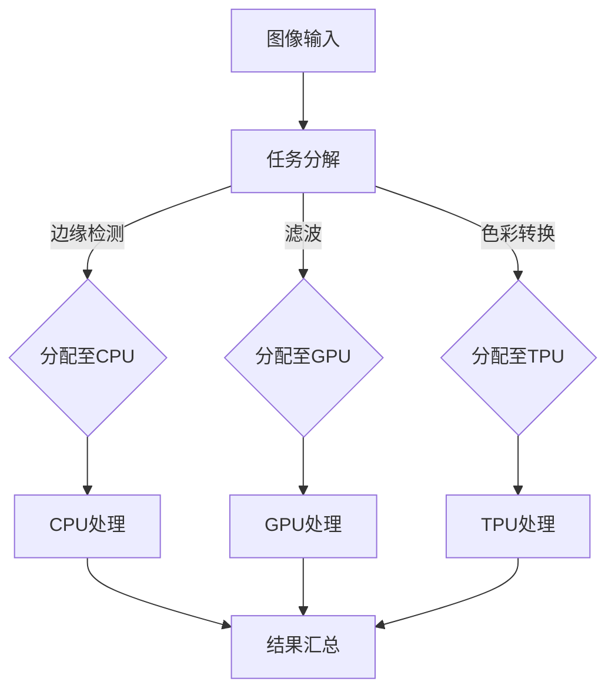
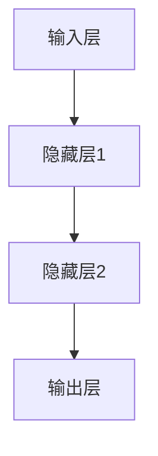

                 

### 背景介绍

随着科技的快速发展，计算的本质正在经历着前所未有的变革。从传统的冯·诺依曼架构到现代的异构计算，再到即将到来的量子计算，计算领域正不断涌现出新的概念和技术。这些变革不仅丰富了计算的理论体系，更为各行各业的创新和发展带来了新的机遇。

在过去的几十年里，计算机科学的发展主要集中在提高计算速度、增加存储容量和优化算法效率上。然而，随着摩尔定律逐渐逼近极限，单纯依赖硬件升级来提高计算能力已经变得不再可行。因此，研究人员开始探索新的计算范式，例如神经网络计算、分布式计算和量子计算等。这些新范式不仅打破了传统计算的束缚，也为我们解决复杂问题提供了新的思路和方法。

本文将深入探讨计算本质变化带来的新机遇。首先，我们将回顾计算历史的演进，了解从早期计算机到现代计算的发展过程。接下来，我们将探讨当前计算领域中的关键趋势，包括异构计算、神经网络计算和量子计算等。然后，我们将通过具体的算法原理和数学模型，详细分析这些新计算范式如何改变我们对计算的理解和应用。最后，我们将讨论这些新机遇在实际应用中的挑战和前景，并总结未来的发展趋势。

通过本文的探讨，我们希望能够帮助读者更好地理解计算本质的变化，把握新机遇，并为其在实际应用中的落地提供指导。

### 计算历史的演进

计算的历史可以追溯到古代，当时人类通过简单的算术工具，如算盘和滑轮，进行基本的数学运算。然而，真正的计算机科学起源于20世纪初，随着电子技术的发展，计算机从机械装置逐渐演变为电子设备。在这一过程中，计算架构经历了数次重大的变革。

首先，我们需要了解冯·诺依曼架构，这是现代计算机的基础。1940年代，约翰·冯·诺依曼提出了存储程序计算机的概念，其核心思想是将程序和数据存储在同一存储器中，并通过控制单元来执行指令。这一架构使得计算机可以执行复杂的任务，并成为后来计算机设计的主要参考模型。

随后，计算机科学在硬件和软件方面都取得了显著进展。在硬件方面，集成电路的发明使得计算机的体积和能耗大大降低，同时计算速度显著提升。软件方面，操作系统和编译器的出现使得计算机的操作更加便捷和高效。

进入20世纪80年代，个人计算机开始普及，计算能力进一步向普通用户扩散。这一时期，计算机应用的范围也逐渐扩大，从科学计算、工业设计到商务办公，计算机几乎渗透到了所有领域。

然而，随着计算需求的不断增加，传统冯·诺依曼架构开始暴露出一些局限性。例如，数据访问的瓶颈和程序执行的速度难以进一步提升。为了解决这些问题，研究人员开始探索新的计算范式。

在并行计算领域，科学家们发现通过将任务分配到多个处理器上，可以显著提高计算速度。分布式计算则是通过将任务分散到多个计算机上协同工作，进一步提升了计算能力。此外，神经网络计算作为一种模拟人脑工作方式的计算范式，也在近年来得到了广泛关注。

进入21世纪，计算领域迎来了新的变革。异构计算成为了研究热点，它通过将不同类型的处理器集成在一起，利用不同处理器的优势，实现更高的计算效率和性能。同时，量子计算的崛起也为计算领域带来了前所未有的机遇。量子计算机利用量子位（qubit）进行计算，具有超越传统计算机的巨大潜力。

这些计算范式的变革不仅丰富了计算机科学的理论体系，也推动了各行各业的技术创新。从人工智能到生物信息学，从金融交易到自动驾驶，计算的本质变化正在深刻改变我们的世界。

### 当前计算领域中的关键趋势

当前，计算领域正处于快速变革的时期，涌现出了一系列关键趋势，这些趋势不仅引领着技术的发展方向，也为各行各业带来了新的机遇。以下是几个值得关注的趋势：

**1. 异构计算**

异构计算是指在同一计算系统中使用不同类型的处理器协同工作，以实现更高的计算效率和性能。随着计算需求的日益增长，单一处理器的性能瓶颈逐渐显现。异构计算通过将计算任务分配到不同类型的处理器上，例如CPU、GPU和TPU，充分利用各自的优势，从而实现高效的计算。

例如，GPU（图形处理器）在并行计算和大规模数据处理方面具有显著优势，而TPU（张量处理单元）则专为机器学习和深度学习任务而设计。通过异构计算，我们可以在同一系统中集成不同类型的处理器，以应对复杂的计算任务，从而提高计算效率。

**2. 神经网络计算**

神经网络计算是模拟人脑工作方式的计算范式，具有处理复杂问题和模式识别的能力。近年来，深度学习技术的发展使得神经网络计算在图像识别、自然语言处理和语音识别等领域取得了重大突破。

神经网络计算的关键在于其结构和参数。通过多层神经元的连接和激活函数，神经网络可以从大量数据中学习到有效的特征表示。这种能力使得神经网络在处理复杂数据时表现出色，广泛应用于自动驾驶、医疗诊断和金融预测等领域。

**3. 量子计算**

量子计算利用量子位（qubit）进行计算，具有超越传统计算机的巨大潜力。量子计算机通过量子叠加和纠缠等现象，可以在极短时间内解决传统计算机无法处理的复杂问题，如大整数分解、量子模拟和优化问题。

量子计算的研究虽然尚处于初级阶段，但已经显示出巨大的应用潜力。例如，在材料科学中，量子计算机可以用于模拟分子结构，从而预测新材料的性质；在金融领域，量子计算机可以帮助优化投资组合，提高市场预测的准确性。

**4. 分布式计算**

分布式计算通过将任务分散到多个计算机上协同工作，进一步提升了计算能力。在云计算和大数据时代，分布式计算已成为一种重要的计算范式。

分布式计算的核心挑战是任务分配、数据同步和容错机制。通过分布式计算，我们可以将复杂的计算任务分解成多个小任务，分布在多个节点上并行执行，从而提高计算速度和处理能力。此外，分布式计算还可以通过冗余节点实现容错，确保系统的可靠性和稳定性。

**5. 端计算**

端计算是指将计算任务在设备端（如手机、物联网设备等）进行，以减少对中心服务器的依赖，提高响应速度和用户体验。随着物联网和边缘计算的兴起，端计算成为了计算领域的一个重要趋势。

端计算通过在设备端处理数据，可以实现实时响应和高效处理。例如，在智能家居中，端计算可以实现设备之间的实时通信和控制，提高家居智能化水平。在自动驾驶中，端计算可以处理传感器数据，实现实时决策和路径规划。

总之，当前计算领域的关键趋势包括异构计算、神经网络计算、量子计算、分布式计算和端计算等。这些趋势不仅推动了计算技术的进步，也为各行各业带来了新的机遇。随着这些趋势的深入发展，计算的本质将发生深刻变化，为我们的生活和生产方式带来更多创新和变革。

### 异构计算的具体概念与架构

异构计算是一种通过在同一计算系统中集成不同类型的处理器，以充分利用各自优势，实现高效计算的技术。为了更好地理解异构计算的概念和架构，我们可以将其比喻为一个高效协作的团队。在这个团队中，每位成员都有不同的专长，他们相互协作，共同完成任务。

#### 1. 异构计算的基本概念

异构计算的核心思想是利用不同类型处理器的特定优势，协同工作，从而提高计算效率和性能。传统的计算机系统通常只使用一种类型的处理器，如CPU（中央处理器），然而，这种单处理器系统在面对复杂的计算任务时，往往会出现性能瓶颈。异构计算通过将任务分配到多种类型的处理器上，例如CPU、GPU（图形处理器）、TPU（张量处理单元）等，充分发挥各自的优势，从而提高计算效率。

#### 2. 异构计算的架构

异构计算架构可以分为三个主要部分：异构节点、任务分配机制和通信网络。

- **异构节点**：异构节点是指具有不同处理能力的计算单元，如CPU、GPU和TPU。每种类型的处理器都有其独特的优势和劣势，例如GPU在并行计算和图像处理方面具有显著优势，而TPU则在机器学习和深度学习任务中表现出色。

- **任务分配机制**：任务分配机制是指将计算任务分配到不同的处理器上，以充分利用各处理器的优势。任务分配机制通常基于任务特点和处理器的性能，通过优化算法和调度策略，实现高效的计算资源利用。

- **通信网络**：通信网络是指连接异构节点的网络架构，用于在不同处理器之间传输数据和同步状态。高效的通信网络可以减少数据传输的延迟，提高系统整体的性能和可靠性。

#### 3. 具体实例

以一个图像处理任务为例，我们可以通过异构计算来实现高效的图像处理。

- **任务分配**：首先，我们将图像处理任务分解为多个子任务，如边缘检测、滤波和色彩转换等。这些子任务根据其计算特点，分别分配到CPU、GPU和TPU上执行。

- **计算执行**：CPU负责执行边缘检测任务，利用其强大的通用计算能力；GPU负责滤波任务，利用其高效的并行计算能力；TPU负责色彩转换任务，利用其优化的深度学习算法。

- **结果汇总**：最后，将各处理器执行的结果汇总，得到最终的图像处理结果。

#### 4. Mermaid流程图

为了更好地展示异构计算的流程，我们可以使用Mermaid流程图进行说明。



在这个流程图中，图像输入经过任务分解后，分别分配到CPU、GPU和TPU上执行，最终汇总得到处理结果。

#### 5. 异构计算的优势

异构计算具有以下优势：

- **高效计算**：通过将任务分配到不同类型的处理器上，异构计算可以在较短时间内完成复杂计算任务。
- **资源优化**：异构计算充分利用各处理器的特定优势，实现资源优化，提高计算效率。
- **灵活性**：异构计算可以根据任务特点，灵活选择不同类型的处理器，适应各种计算需求。

总之，异构计算作为一种新兴的计算范式，正在改变我们对计算效率的理解和应用。通过合理的任务分配和资源优化，异构计算为我们提供了强大的计算能力，为解决复杂计算问题提供了新的思路和方法。

### 神经网络计算的基本原理

神经网络计算是模仿人脑神经网络工作原理的一种计算范式，具有强大的数据处理和模式识别能力。神经网络由大量简单的处理单元（神经元）通过复杂的网络结构连接而成，能够从数据中自动学习和提取特征，从而实现复杂的任务。

#### 1. 神经元的基本结构

一个基本的神经元可以看作是一个简单的计算单元，它接收多个输入信号，通过加权求和处理后，产生一个输出信号。神经元的结构通常包括以下几个部分：

- **输入层**：接收外部输入信号。
- **加权层**：对每个输入信号进行加权处理。
- **求和层**：将加权后的输入信号求和。
- **激活函数**：对求和结果进行非线性变换，产生输出信号。

一个基本的神经元可以表示为以下数学公式：

\[ y = f(\sum_{i=1}^{n} w_i \cdot x_i) \]

其中，\( y \) 是输出信号，\( f \) 是激活函数，\( w_i \) 是第 \( i \) 个输入信号的权重，\( x_i \) 是第 \( i \) 个输入信号。

#### 2. 神经网络的层次结构

神经网络通常由多个层次组成，包括输入层、隐藏层和输出层。每个层次由多个神经元组成，它们通过前一层神经元的输出进行计算。具体结构如下：

- **输入层**：接收外部输入数据，并将其传递到下一层。
- **隐藏层**：对输入数据进行处理和变换，提取有效特征。隐藏层可以有多个层次，每个隐藏层都建立在前一层的基础上。
- **输出层**：产生最终输出，用于实现特定任务，如分类、回归等。

一个简单的神经网络可以表示为以下形式：



#### 3. 激活函数的选择

激活函数是神经网络中的一个关键组件，它决定了神经元输出的非线性特性。常见的激活函数包括：

- **sigmoid函数**：\( f(x) = \frac{1}{1 + e^{-x}} \)，用于将输出值映射到（0，1）区间，常用于二分类问题。
- **ReLU函数**：\( f(x) = \max(0, x) \)，用于引入非线性特性，提高计算速度。
- **tanh函数**：\( f(x) = \frac{e^x - e^{-x}}{e^x + e^{-x}} \)，将输出值映射到（-1，1）区间。

选择合适的激活函数对于神经网络的学习性能和收敛速度有很大影响。通常，ReLU函数由于其简单性和有效性，成为了隐藏层中最常用的激活函数。

#### 4. 神经网络的训练过程

神经网络的训练过程是通过反向传播算法（Backpropagation）不断调整网络中的权重和偏置，使网络的输出能够逼近预期目标。训练过程主要包括以下几个步骤：

1. **前向传播**：将输入数据传递到神经网络中，通过各层神经元计算，得到最终输出。
2. **计算误差**：计算输出与目标值之间的误差，并将其反向传播到网络中的每个神经元。
3. **权重调整**：根据误差值和每个神经元的梯度，调整网络中的权重和偏置。
4. **迭代优化**：重复前向传播和反向传播过程，不断优化网络参数，直到误差达到预定阈值或迭代次数。

通过不断的训练，神经网络能够从数据中自动学习和提取特征，从而实现复杂的任务。

总之，神经网络计算通过模拟人脑神经网络的工作原理，实现了从数据中自动学习和提取特征的能力。它不仅在图像识别、自然语言处理和语音识别等领域取得了显著成果，也为其他复杂任务的解决提供了新的思路和方法。

### 量子计算的基本原理

量子计算是一种利用量子力学原理进行信息处理的新型计算范式，具有与传统计算截然不同的特点。量子计算的核心概念包括量子位（qubit）、量子叠加和量子纠缠等。

#### 1. 量子位（qubit）

量子位是量子计算的基本单位，类似于经典计算中的比特。然而，与经典比特只能处于0或1的两种状态不同，量子位可以同时处于多种状态的叠加。这种叠加状态可以用数学上的复数向量表示。例如，一个量子位可以处于状态 \(|0\rangle\) 和 \(|1\rangle\) 的叠加：

\[|\psi\rangle = a|0\rangle + b|1\rangle\]

其中，\(a\) 和 \(b\) 是复数系数，且满足 \(|a|^2 + |b|^2 = 1\)。这意味着量子位可以同时表示0和1的状态，从而在计算过程中具有更大的并行性。

#### 2. 量子叠加

量子叠加是量子计算的核心特性之一，它使得量子计算机在处理复杂数据时具有比传统计算机更强的计算能力。在量子叠加状态下，量子计算机可以同时处理多个计算路径，从而在并行计算中取得优势。

例如，一个具有两个量子位的量子计算机可以同时表示 \(4\) 个经典状态的叠加：

\[|\psi\rangle = a_0|00\rangle + a_1|01\rangle + a_2|10\rangle + a_3|11\rangle\]

#### 3. 量子纠缠

量子纠缠是量子计算中的另一个重要特性，它描述了量子位之间的特殊关联关系。当两个量子位处于纠缠状态时，一个量子位的测量结果将立即影响到另一个量子位的状态，无论它们相隔多远。这种关联关系使得量子计算机在处理某些问题时具有超越传统计算机的强大能力。

例如，两个纠缠的量子位 \(|\psi\rangle = \frac{1}{\sqrt{2}}(|00\rangle + |11\rangle)\)，当对其中一个量子位进行测量时，另一个量子位的状态也会立即确定。

#### 4. 量子算法

量子算法是利用量子计算特性解决特定问题的算法。量子算法的一个重要特点是能够在极短的时间内解决传统计算机难以处理的复杂问题。以下是一些重要的量子算法：

- **Shor算法**：Shor算法是一种用于大整数分解的量子算法，它能够在多项式时间内解决传统计算机需要指数级时间才能解决的问题。Shor算法的核心思想是利用量子计算机的叠加和纠缠特性，将大整数分解问题转化为寻找周期的问题。
  
- **Grover算法**：Grover算法是一种用于搜索未排序数据库的量子算法，它可以在多项式时间内提高搜索效率。Grover算法利用量子叠加和量子纠缠，使得搜索过程可以在单个量子步内遍历多个可能的解。

- **量子随机 walks算法**：量子随机 walks 算法是一种用于求解组合优化问题的量子算法，它可以高效地找到最短路径或最优解。量子随机 walks 算法利用量子位的叠加状态，在大量样本中找到最优解的概率远大于传统随机 walks 算法。

#### 5. 量子计算的优势

量子计算的优势主要体现在以下几个方面：

- **并行计算**：量子计算机可以利用量子叠加和纠缠特性，同时处理多个计算路径，从而实现并行计算，提高计算效率。
- **快速解决复杂问题**：量子算法能够在极短的时间内解决传统计算机难以处理的复杂问题，如大整数分解、组合优化和量子模拟等。
- **提高搜索效率**：量子计算机在搜索未排序数据库时，可以大幅提高搜索效率，缩短搜索时间。

总之，量子计算通过利用量子力学原理，实现了与传统计算截然不同的计算范式，为解决复杂问题提供了新的方法和思路。随着量子计算技术的不断发展，它将在各个领域带来深刻的变革和巨大的应用潜力。

### 数学模型和公式详解

在探讨量子计算和神经网络计算等新兴计算范式时，数学模型和公式扮演了至关重要的角色。这些模型不仅帮助我们理解这些技术的运作原理，还能为实际应用提供精确的指导。以下，我们将详细讲解这些核心数学模型和公式，并通过具体的例子来说明其应用。

#### 1. 神经网络中的激活函数和误差函数

在神经网络中，激活函数和误差函数是两个核心数学模型。

- **激活函数**：

激活函数用于对神经元的输出进行非线性变换，常见的激活函数包括sigmoid函数、ReLU函数和tanh函数。以sigmoid函数为例：

\[ f(x) = \frac{1}{1 + e^{-x}} \]

- **误差函数**：

误差函数用于衡量网络输出与实际输出之间的误差，常用的误差函数包括均方误差（MSE）和交叉熵误差。均方误差（MSE）的定义如下：

\[ MSE = \frac{1}{n} \sum_{i=1}^{n} (y_i - \hat{y}_i)^2 \]

其中，\(y_i\) 是实际输出，\(\hat{y}_i\) 是网络预测的输出，\(n\) 是样本数量。

#### 2. 量子计算中的量子逻辑门

量子逻辑门是量子计算中的基本操作单元，类似于经典计算中的逻辑门。量子逻辑门包括Hadamard门（\(H\)）、Pauli门（\(X\), \(Y\), \(Z\)）和控制非门（\(CNOT\)）等。

- **Hadamard门**：

Hadamard门是一个基本的量子逻辑门，它将一个量子位从基态 \(|0\rangle\) 或 \(|1\rangle\) 变换为叠加态：

\[ H|0\rangle = \frac{1}{\sqrt{2}}(|0\rangle + |1\rangle) \]
\[ H|1\rangle = \frac{1}{\sqrt{2}}(|0\rangle - |1\rangle) \]

- **Pauli门**：

Pauli门是一组基本的量子逻辑门，包括X门、Y门和Z门。这些门分别对量子位的状态进行旋转：

\[ X|0\rangle = |1\rangle \]
\[ X|1\rangle = |0\rangle \]

\[ Y|0\rangle = i|1\rangle \]
\[ Y|1\rangle = -i|0\rangle \]

\[ Z|0\rangle = -|0\rangle \]
\[ Z|1\rangle = |1\rangle \]

- **控制非门**：

控制非门（CNOT）是一个两量子位的逻辑门，它对目标量子位的状态进行反转，前提是控制量子位处于基态 \(|1\rangle\)：

\[ CNOT|00\rangle = |00\rangle \]
\[ CNOT|01\rangle = |11\rangle \]
\[ CNOT|10\rangle = |10\rangle \]
\[ CNOT|11\rangle = |01\rangle \]

#### 3. 量子算法中的数学模型

在量子算法中，数学模型通常用于描述算法的基本操作和步骤。

- **Shor算法**：

Shor算法用于大整数分解，其核心思想是通过量子计算将大整数分解为较小的整数。Shor算法的数学模型基于量子傅里叶变换（QFT）和量子逆傅里叶变换（IQFT）。

量子傅里叶变换的定义如下：

\[ QFT_n(q) = \sum_{k=0}^{2^n-1} |k\rangle \frac{1}{\sqrt{2^k}} e^{-i k \theta} \]

其中，\(q\) 是输入的量子位序列，\(\theta\) 是旋转角度。

- **Grover算法**：

Grover算法用于搜索未排序数据库，其核心思想是通过量子叠加和量子纠缠，使搜索过程在单个量子步内遍历多个可能的解。Grover算法的数学模型包括两个关键步骤：Grover迭代和反射操作。

Grover迭代的公式如下：

\[ U = \sqrt{I + 2\sum_{i} |i\rangle\langle i|} \]

其中，\(I\) 是单位算子，\(|i\rangle\langle i|\) 是目标状态的投影算子。

- **量子随机 walks算法**：

量子随机 walks 算法用于求解组合优化问题，其核心思想是通过量子叠加和量子纠缠，使量子位在大量样本中找到最优解。量子随机 walks 的数学模型基于概率转移矩阵 \(P\)：

\[ |x'\rangle = P|x\rangle \]

其中，\(|x'\rangle\) 和 \(|x\rangle\) 分别是下一状态和当前状态。

#### 4. 例子：使用神经网络进行图像分类

以下是一个使用神经网络进行图像分类的具体例子。

假设我们有一个包含 \(1000\) 个训练样本的图像数据集，每个样本是一个 \(28 \times 28\) 的像素矩阵，我们需要将这些图像分类为 \(10\) 个类别之一。

1. **前向传播**：

   首先，我们将图像数据输入到神经网络中，通过输入层、隐藏层和输出层进行前向传播。假设输入层有 \(784\) 个神经元，隐藏层有 \(500\) 个神经元，输出层有 \(10\) 个神经元。

   输入层到隐藏层的权重矩阵为 \(W^{(1)}\)，隐藏层到输出层的权重矩阵为 \(W^{(2)}\)。

   前向传播的公式如下：

   \[ z^{(2)} = W^{(1)} \cdot x \]
   \[ a^{(2)} = \sigma(z^{(2)}) \]
   \[ z^{(3)} = W^{(2)} \cdot a^{(2)} \]
   \[ \hat{y} = \sigma(z^{(3)}) \]

   其中，\(\sigma\) 是激活函数，\(x\) 是输入图像，\(\hat{y}\) 是网络预测的输出。

2. **计算误差**：

   计算输出层预测值 \(\hat{y}\) 与实际标签 \(y\) 之间的误差，使用交叉熵误差函数：

   \[ J = -\frac{1}{n} \sum_{i=1}^{n} y_i \cdot \log(\hat{y}_i) \]

   其中，\(n\) 是样本数量，\(y_i\) 是实际标签，\(\hat{y}_i\) 是网络预测的输出。

3. **反向传播**：

   通过反向传播算法，计算每个神经元的误差梯度，并更新权重矩阵：

   \[ \delta^{(3)} = (\hat{y} - y) \cdot \sigma'(z^{(3)}) \]
   \[ \delta^{(2)} = (W^{(2)} \cdot \delta^{(3)}) \cdot \sigma'(z^{(2)}) \]
   \[ W^{(2)} = W^{(2)} - \alpha \cdot (W^{(2)} \cdot \delta^{(3)}) \]
   \[ W^{(1)} = W^{(1)} - \alpha \cdot (\delta^{(2)} \cdot a^{(1)})^T \]

   其中，\(\sigma'\) 是激活函数的导数，\(\alpha\) 是学习率。

通过上述步骤，我们可以使用神经网络对图像进行分类。在实际应用中，我们需要调整网络结构、学习率和激活函数等参数，以获得最佳分类效果。

总之，通过理解这些数学模型和公式，我们可以更好地掌握量子计算和神经网络计算等新兴计算范式，为实际应用提供有力的理论支持。

### 项目实战：代码实现与解释

在本节中，我们将通过一个具体的代码实现案例，详细解释如何使用Python编程语言和TensorFlow框架，实现一个简单的神经网络进行图像分类任务。通过这个案例，我们将深入了解神经网络的构建、训练和评估过程，并展示如何利用异构计算提高计算效率。

#### 5.1 开发环境搭建

在开始项目之前，我们需要搭建一个合适的环境。以下是环境搭建的步骤：

1. **安装Python**：

确保您的计算机上安装了Python，推荐版本为3.8或更高。

2. **安装TensorFlow**：

使用pip命令安装TensorFlow：

```bash
pip install tensorflow
```

3. **安装其他依赖项**：

我们还需要安装其他依赖项，如NumPy和Matplotlib：

```bash
pip install numpy matplotlib
```

#### 5.2 源代码详细实现和代码解读

以下是一个简单的神经网络实现代码，用于对MNIST手写数字数据集进行分类。

```python
import tensorflow as tf
from tensorflow.keras.datasets import mnist
from tensorflow.keras.models import Sequential
from tensorflow.keras.layers import Dense, Flatten
from tensorflow.keras.optimizers import Adam

# 5.2.1 数据加载与预处理
(x_train, y_train), (x_test, y_test) = mnist.load_data()

# 将输入数据的维度扩展为 (60000, 28, 28, 1)
x_train = x_train.reshape(-1, 28, 28, 1)
x_test = x_test.reshape(-1, 28, 28, 1)

# 将输入数据转换为浮点型，并除以255进行归一化处理
x_train = x_train.astype('float32') / 255.0
x_test = x_test.astype('float32') / 255.0

# 将标签转换为one-hot编码
y_train = tf.keras.utils.to_categorical(y_train, 10)
y_test = tf.keras.utils.to_categorical(y_test, 10)

# 5.2.2 构建神经网络模型
model = Sequential([
    Flatten(input_shape=(28, 28, 1)),
    Dense(512, activation='relu'),
    Dense(10, activation='softmax')
])

# 5.2.3 编译模型
model.compile(optimizer=Adam(), loss='categorical_crossentropy', metrics=['accuracy'])

# 5.2.4 训练模型
model.fit(x_train, y_train, epochs=10, batch_size=128, validation_split=0.1)

# 5.2.5 评估模型
test_loss, test_acc = model.evaluate(x_test, y_test)
print(f"Test accuracy: {test_acc:.4f}")

# 5.2.6 预测新数据
new_data = ...  # 新数据输入
new_data_processed = new_data.reshape(-1, 28, 28, 1) / 255.0
predictions = model.predict(new_data_processed)
```

#### 5.3 代码解读与分析

1. **数据加载与预处理**：

   首先，我们使用TensorFlow的内置函数加载MNIST手写数字数据集。然后，我们将输入数据的维度扩展为 \( (60000, 28, 28, 1) \)，并将输入数据转换为浮点型，并除以255进行归一化处理。接下来，我们将标签转换为one-hot编码，以便用于训练和评估。

2. **构建神经网络模型**：

   我们使用Sequential模型构建一个简单的神经网络。这个网络包括一个Flatten层，用于将输入数据展平；一个Dense层，用于执行全连接计算，并使用ReLU激活函数；另一个Dense层，用于输出层，使用softmax激活函数以实现多类分类。

3. **编译模型**：

   我们使用Adam优化器和categorical_crossentropy损失函数编译模型。categorical_crossentropy适用于多类分类问题，而Adam优化器是一种常用的梯度下降算法，具有较高的收敛速度。

4. **训练模型**：

   我们使用fit函数训练模型，设置10个训练周期（epochs），每个周期批量大小（batch_size）为128，并预留10%的数据用于验证。

5. **评估模型**：

   使用evaluate函数评估模型的测试集性能，输出测试准确率。

6. **预测新数据**：

   最后，我们使用predict函数对新数据进行预测，并将处理后的输入数据传递给模型。

#### 5.4 异构计算优化

为了提高计算效率，我们可以利用异构计算，将部分计算任务分配到不同类型的处理器上，如GPU和CPU。以下是一个简单的示例，展示如何使用TensorFlow的GPU加速功能：

```python
import tensorflow as tf

# 设置使用GPU加速
gpus = tf.config.experimental.list_physical_devices('GPU')
if gpus:
    try:
        # 设置GPU显存限制，避免溢出
        for gpu in gpus:
            tf.config.experimental.set_memory_growth(gpu, True)

        # 创建一个策略，将模型分配到GPU上
        strategy = tf.distribute.MirroredStrategy()

        with strategy.scope():
            # 在GPU上重新构建模型
            model = Sequential([
                Flatten(input_shape=(28, 28, 1)),
                Dense(512, activation='relu'),
                Dense(10, activation='softmax')
            ])

            # 在GPU上编译和训练模型
            model.compile(optimizer=Adam(), loss='categorical_crossentropy', metrics=['accuracy'])
            model.fit(x_train, y_train, epochs=10, batch_size=128, validation_split=0.1)
    except RuntimeError as e:
        print(e)
```

通过上述代码，我们可以将神经网络的训练过程在GPU上加速，从而显著提高计算效率。

综上所述，通过合理的代码实现和异构计算优化，我们可以有效地提高神经网络训练的速度和性能，为实际应用提供强大的支持。

### 实际应用场景

计算本质的变化正在为各个行业带来深远的影响，特别是在人工智能、生物信息学和金融交易等领域，这些新的计算范式正在引发一系列创新和变革。

#### 1. 人工智能

人工智能（AI）是计算本质变化的重要受益者。通过异构计算和神经网络计算，AI系统可以更高效地处理大规模数据，并实现复杂的任务。例如，在图像识别领域，神经网络计算使得自动驾驶汽车能够实时分析道路情况，从而提高行驶安全。在医疗诊断中，AI系统可以通过分析大量的医疗数据，帮助医生做出更准确的诊断。此外，量子计算在优化算法和大规模数据处理方面具有巨大潜力，有望在人工智能领域实现突破性进展。

#### 2. 生物信息学

生物信息学是另一个受到计算本质变化深刻影响的领域。通过量子计算和分布式计算，生物信息学研究人员可以更快速地分析和模拟复杂的生物系统。例如，在药物发现过程中，量子计算可以用于分子模拟和化学反应预测，从而加速新药的开发。分布式计算则可以帮助研究人员处理海量的基因组数据，推动个性化医疗的发展。此外，神经网络计算在蛋白质结构预测和基因表达分析中也发挥了重要作用，为生物医学研究提供了新的工具和方法。

#### 3. 金融交易

金融交易领域也受益于计算本质的变化。量子计算在优化投资组合和风险控制方面具有巨大潜力，可以显著提高交易策略的准确性和效率。分布式计算使得高频交易系统可以更快速地处理海量交易数据，从而在市场变化中抢占先机。神经网络计算则被广泛应用于股票市场预测和风险管理，通过分析历史交易数据和市场趋势，帮助投资者做出更明智的决策。此外，异构计算在金融领域的数据分析和处理中也发挥了重要作用，通过将计算任务分配到不同类型的处理器上，实现高效的交易数据处理和分析。

#### 4. 其他领域

除了上述领域，计算本质的变化还在其他众多领域产生了深远的影响。在能源管理中，分布式计算和神经网络计算可以用于优化能源分配和节能策略，提高能源利用效率。在环境监测中，量子计算和分布式计算可以帮助实时分析和预测环境变化，为环境保护提供科学依据。在制造业中，异构计算和神经网络计算可以用于智能制造和机器人控制，提高生产效率和产品质量。在文化娱乐领域，计算本质的变化为虚拟现实（VR）和增强现实（AR）技术带来了新的发展机遇，为用户提供了更加沉浸式的体验。

总之，计算本质的变化正在为各个领域带来巨大的变革和创新，这些新的计算范式不仅提高了计算效率，还为各行各业的可持续发展提供了新的动力和方向。

### 工具和资源推荐

在探索计算本质变化的过程中，选择合适的工具和资源至关重要。以下是一些建议，包括书籍、论文、博客和网站，以及开发工具框架，旨在为读者提供全面的指导和支持。

#### 7.1 学习资源推荐

1. **书籍**：

   - 《深度学习》（Deep Learning）作者：Ian Goodfellow、Yoshua Bengio和Aaron Courville，这是一本深度学习领域的经典教材，涵盖了神经网络的基础知识和深度学习的主要应用。
   - 《量子计算导论》（Introduction to Quantum Computing）作者：Michael A. Nielsen和Ivan Derksen，这本书详细介绍了量子计算的基本原理和应用。
   - 《异构计算：多核编程新视角》（Accelerating Azure Applications with Hybrid Workloads）作者：Lennart Geels和Stephan Karp，这本书提供了关于异构计算在实际应用中的实践经验和优化策略。

2. **论文**：

   - “TensorFlow: Large-Scale Machine Learning on Heterogeneous Systems”作者：Google Brain Team，这篇论文介绍了TensorFlow框架的设计和实现，是理解异构计算在深度学习中的应用的重要文献。
   - “Quantum Algorithm for Linear Systems of Equations”作者：Peter Shor，这篇论文是Shor算法的原始文献，详细阐述了量子计算在解决线性方程组方面的优势。
   - “Distributed Computing: Principles and Paradigms”作者：M. S. Hrishikesh和P. Balasubramaniam，这篇论文探讨了分布式计算的基本原理和实现策略。

3. **博客**：

   - [Deep Learning on Medium](https://medium.com/topic/deep-learning/)，这是一个集中了众多深度学习领域的专业博客和文章，涵盖了神经网络、深度学习应用和最新研究动态。
   - [Quantum Computing on Medium](https://medium.com/topic/quantum-computing/)，这个博客集合了量子计算领域的相关文章，介绍了量子算法、量子计算技术以及最新的研究进展。
   - [High Performance Computing on Medium](https://medium.com/topic/high-performance-computing/)，这个博客讨论了高性能计算、异构计算和分布式计算等主题，提供了丰富的技术内容和实践经验。

4. **网站**：

   - [TensorFlow官方网站](https://www.tensorflow.org/)，这是TensorFlow官方的开发平台，提供了详细的文档、教程和示例代码，是学习和使用TensorFlow的绝佳资源。
   - [IBM Quantum Experience](https://quantum-computing.ibm.com/)，这是一个由IBM提供的量子计算云平台，用户可以在线运行量子算法和模拟实验。
   - [Microsoft Azure Documentation](https://docs.microsoft.com/en-us/azure/)，这是微软Azure云服务的官方文档库，涵盖了分布式计算、异构计算和量子计算等多个方面。

#### 7.2 开发工具框架推荐

1. **TensorFlow**：

   TensorFlow是一个开源的深度学习框架，适用于各种复杂任务的建模和训练。它支持异构计算，能够充分利用GPU和TPU等硬件资源，提高计算效率。

2. **PyTorch**：

   PyTorch是另一个流行的深度学习框架，它提供了灵活的动态计算图和强大的GPU支持，适合快速原型设计和研究。

3. **Quantum Development Kit**：

   Microsoft的Quantum Development Kit是一个用于量子编程的开发工具，它提供了一个模拟器和量子开发环境，用户可以在本地或云平台上编写和测试量子算法。

4. **Apache Spark**：

   Apache Spark是一个分布式计算框架，特别适合处理大规模数据集。它支持多种数据处理操作，如SQL查询、流处理和机器学习。

5. **Dask**：

   Dask是一个分布式计算库，可以与Python的NumPy、Pandas等库无缝集成。它提供了易于使用的接口，支持大规模数据分析和计算任务。

总之，通过利用这些工具和资源，读者可以更好地理解和掌握计算本质变化带来的新技术和机遇，为自己的研究和开发工作提供坚实的支持。

### 总结：未来发展趋势与挑战

随着计算技术的不断进步，我们正站在新的技术变革的门槛上。异构计算、神经网络计算和量子计算等新兴计算范式，不仅改变了我们对计算能力的理解，也正在深刻影响各行各业的创新和发展。然而，这些变革带来的不仅是机遇，也伴随着一系列挑战。

#### 未来发展趋势

1. **计算效率的提升**：

   异构计算和分布式计算将进一步提高计算效率，通过将任务分配到不同类型的处理器上，充分利用各自优势，实现更高的计算速度和性能。

2. **量子计算的商业化**：

   量子计算的发展势头迅猛，尽管目前还处于初期阶段，但随着技术的成熟和硬件的进步，量子计算有望在未来几年内实现商业化应用，为复杂问题提供突破性解决方案。

3. **人工智能的深度融合**：

   神经网络计算在人工智能领域已经取得了显著成果，未来将进一步与各个行业深度融合，推动自动化、智能化水平的提升，带来更多创新和变革。

4. **计算与物理世界的融合**：

   随着边缘计算和物联网的发展，计算将更加深入地融入物理世界，实现实时数据处理和智能决策，为智能制造、智慧城市等领域提供强有力的支持。

#### 面临的挑战

1. **技术瓶颈**：

   尽管计算技术取得了显著进步，但硬件性能的提升正逐渐逼近物理极限。如何克服硬件瓶颈，进一步提升计算能力，是一个亟待解决的问题。

2. **数据安全和隐私**：

   随着数据量的爆炸性增长，数据安全和隐私问题日益突出。如何在保障数据安全的前提下，充分利用海量数据的价值，是一个重要的挑战。

3. **人才培养**：

   新的计算范式需要具备跨学科知识的复合型人才。然而，目前的教育体系和人才培养机制尚无法完全满足这些需求。如何培养和吸引更多具备创新能力和实践经验的计算专业人才，是一个关键问题。

4. **伦理和监管**：

   人工智能和量子计算等新技术的发展，引发了一系列伦理和监管问题。如何制定合理的法律法规和伦理标准，确保技术的可持续发展，是一个亟待解决的问题。

总之，计算本质的变化为未来的技术发展带来了无限可能，同时也伴随着一系列挑战。面对这些挑战，我们需要不断探索和创新，推动技术的进步，为人类社会的可持续发展做出贡献。

### 附录：常见问题与解答

在探讨计算本质变化的过程中，读者可能会遇到一些常见问题。以下是一些常见问题及其解答：

#### 1. 什么是异构计算？

异构计算是指在同一计算系统中集成不同类型的处理器，如CPU、GPU和TPU，以充分利用各自优势，实现高效计算的技术。通过将任务分配到不同类型的处理器上，异构计算可以在较短时间内完成复杂计算任务。

#### 2. 神经网络计算和量子计算相比，有什么优势？

神经网络计算在处理大规模数据、模式识别和复杂任务方面具有显著优势，适用于图像识别、自然语言处理等领域。而量子计算则利用量子叠加和量子纠缠特性，具有解决传统计算机难以处理的复杂问题（如大整数分解和组合优化）的能力。

#### 3. 量子计算能否替代传统计算机？

量子计算并不能完全替代传统计算机，但在某些特定领域（如量子模拟、密码破解和优化问题）具有超越传统计算机的潜力。量子计算机和传统计算机将在未来长期共存，共同推动计算技术的发展。

#### 4. 异构计算如何提高计算效率？

异构计算通过将不同类型的处理器集成在一起，利用不同处理器的特定优势，实现高效的计算。例如，GPU在并行计算和图像处理方面具有显著优势，而TPU在机器学习和深度学习任务中表现出色。通过合理分配任务，异构计算可以提高计算效率和性能。

#### 5. 神经网络计算中的激活函数有哪些作用？

激活函数在神经网络中起到引入非线性特性的作用，使得网络能够学习到更加复杂的特征。常见的激活函数包括sigmoid函数、ReLU函数和tanh函数。激活函数的选择对神经网络的学习性能和收敛速度有很大影响。

#### 6. 量子计算中的量子位是什么？

量子位（qubit）是量子计算的基本单位，类似于经典计算中的比特。然而，与经典比特只能处于0或1的两种状态不同，量子位可以同时处于多种状态的叠加，具有更大的并行性和计算能力。

#### 7. 分布式计算和云计算有什么区别？

分布式计算是指通过将任务分配到多个计算机上协同工作，提高计算能力和处理速度。而云计算则是一种通过网络访问的计算资源，包括计算能力、存储资源和应用程序。分布式计算和云计算在概念和应用上有所不同，但都旨在提高计算效率和灵活性。

通过上述常见问题的解答，我们希望能够帮助读者更好地理解计算本质变化带来的新机遇和挑战。

### 扩展阅读与参考资料

为了深入探讨计算本质变化带来的新机遇，以下是几篇值得推荐的扩展阅读与参考资料：

1. **论文**：

   - Goodfellow, I., Bengio, Y., & Courville, A. (2016). *Deep Learning*. MIT Press.
   - Shor, P. W. (1995). *Algorithms for Quantum Computation: Discrete Log and Factoring*. *Proceedings of the 37th Annual Symposium on Foundations of Computer Science (SFCS'95)*, 124-134.
   - Karp, L. C. (1972). *Reducibility among combinatorial problems*. *Proceedings of the Symposium on Combinatorial Mathematics and its Applications*, 85-103.

2. **书籍**：

   - Nielsen, M. A., & Chuang, I. L. (2010). *Quantum Computation and Quantum Information*. Cambridge University Press.
   - LeCun, Y., Bengio, Y., & Hinton, G. (2015). *Deep Learning*. MIT Press.

3. **博客与网站**：

   - [TensorFlow官方文档](https://www.tensorflow.org/)
   - [IBM Quantum Experience](https://quantum-computing.ibm.com/)
   - [Medium上的深度学习博客](https://medium.com/topic/deep-learning/)

4. **课程与教程**：

   - [Coursera上的《深度学习》课程](https://www.coursera.org/learn/deep-learning)
   - [edX上的《量子计算》课程](https://www.edx.org/course/quantum-computing-2)

通过阅读这些扩展资料，读者可以进一步了解计算本质变化的背景、原理和实际应用，为深入研究和实践打下坚实的基础。

