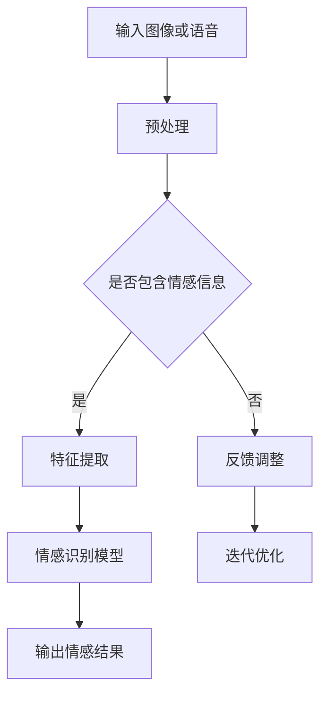

                 

# 计算机视觉在人机交互中的情感识别应用

## 关键词
- 计算机视觉
- 人机交互
- 情感识别
- 深度学习
- 自然语言处理

## 摘要
本文旨在探讨计算机视觉在人机交互中的情感识别应用。首先，我们将回顾人机交互和情感识别的背景知识，然后深入分析情感识别的核心算法原理，包括卷积神经网络和循环神经网络等。接着，我们将通过实际案例展示如何使用开源工具和框架实现情感识别项目，并对代码进行详细解读。最后，本文将探讨情感识别在现实世界中的应用场景，并展望未来发展趋势与挑战。

## 1. 背景介绍

### 1.1 人机交互

人机交互（Human-Computer Interaction, HCI）是计算机科学与心理学、认知科学等多个领域交叉的学科。其目的是研究和设计更自然、更高效、更人性化的计算机系统，以提升用户体验。随着计算机技术的不断发展，人机交互技术逐渐从传统的图形用户界面（GUI）发展到了如今的多模态交互，如图像、语音、手势等。

### 1.2 情感识别

情感识别（Affective Computing）是指计算机系统通过感知、理解和处理人类情感信息，实现与人类情感的交互。情感识别技术在人机交互中具有重要作用，可以增强用户与系统的情感联系，提高交互体验。情感识别主要涉及语音识别、面部识别、生理信号识别等领域。

### 1.3 计算机视觉

计算机视觉（Computer Vision）是人工智能领域的一个重要分支，旨在使计算机能够像人类一样理解、解释和感知图像和视频。计算机视觉技术包括图像处理、目标检测、语义分割等，广泛应用于自动驾驶、安防监控、医疗诊断等领域。

## 2. 核心概念与联系

### 2.1 计算机视觉与人机交互

计算机视觉与人机交互密切相关，计算机视觉技术为人机交互提供了丰富的交互方式，如手势识别、面部表情识别等。这些技术可以捕捉用户的情感信息，为人机交互提供更好的用户体验。

### 2.2 情感识别算法原理

情感识别算法主要基于深度学习和自然语言处理技术。深度学习通过多层神经网络提取图像或语音特征，从而实现对情感信息的识别。自然语言处理技术则用于处理用户的语言输入，理解其情感倾向。

### 2.3 Mermaid 流程图



## 3. 核心算法原理 & 具体操作步骤

### 3.1 卷积神经网络（CNN）

卷积神经网络是一种用于图像识别的深度学习模型。其基本原理是通过多层卷积和池化操作提取图像特征，最后通过全连接层进行分类。

#### 步骤：

1. **输入层**：接收图像数据。
2. **卷积层**：通过卷积操作提取图像特征。
3. **池化层**：对卷积结果进行下采样，减少参数数量。
4. **全连接层**：对卷积结果进行分类。

### 3.2 循环神经网络（RNN）

循环神经网络是一种用于序列数据处理的深度学习模型。其基本原理是通过记忆单元来处理序列中的依赖关系。

#### 步骤：

1. **输入层**：接收序列数据。
2. **隐藏层**：通过记忆单元处理序列数据。
3. **输出层**：对序列数据进行分类或回归。

### 3.3 具体操作步骤

1. **数据预处理**：对图像或语音数据进行预处理，如归一化、裁剪等。
2. **特征提取**：使用卷积神经网络或循环神经网络提取图像或语音特征。
3. **情感识别**：使用训练好的模型对提取的特征进行分类，得到情感结果。
4. **迭代优化**：根据识别结果，对模型进行迭代优化，提高识别准确率。

## 4. 数学模型和公式 & 详细讲解 & 举例说明

### 4.1 卷积神经网络（CNN）

卷积神经网络的核心是卷积层和池化层。以下是卷积操作的数学模型：

$$
\text{输出} = \text{权重} \odot \text{输入} + \text{偏置}
$$

其中，$\odot$ 表示卷积操作，$*$ 表示点积。

### 4.2 循环神经网络（RNN）

循环神经网络的核心是记忆单元。以下是循环神经网络的数学模型：

$$
h_t = \sigma(W_h \odot [h_{t-1}, x_t] + b_h)
$$

$$
o_t = \sigma(W_o \odot h_t + b_o)
$$

其中，$h_t$ 表示第 $t$ 个时刻的隐藏状态，$x_t$ 表示第 $t$ 个时刻的输入，$o_t$ 表示第 $t$ 个时刻的输出，$\sigma$ 表示激活函数，$W_h$ 和 $W_o$ 分别表示权重矩阵，$b_h$ 和 $b_o$ 分别表示偏置。

### 4.3 举例说明

假设我们使用卷积神经网络进行面部表情识别。输入图像大小为 $28 \times 28$，卷积核大小为 $3 \times 3$，步长为 $1$。以下是一个简化的卷积操作示例：

$$
\text{输入} = \begin{bmatrix}
1 & 0 & 1 \\
0 & 1 & 0 \\
1 & 0 & 1
\end{bmatrix}
$$

$$
\text{权重} = \begin{bmatrix}
1 & 0 & 1 \\
0 & 1 & 0 \\
1 & 0 & 1
\end{bmatrix}
$$

$$
\text{偏置} = 0
$$

$$
\text{输出} = \begin{bmatrix}
2 & 1 & 2 \\
1 & 1 & 1 \\
2 & 1 & 2
\end{bmatrix}
$$

## 5. 项目实战：代码实际案例和详细解释说明

### 5.1 开发环境搭建

为了实现计算机视觉在人机交互中的情感识别应用，我们需要搭建以下开发环境：

- Python 3.7+
- TensorFlow 2.3.0+
- OpenCV 4.1.0+
- Keras 2.2.4+

### 5.2 源代码详细实现和代码解读

以下是一个简单的情感识别项目示例，使用 TensorFlow 和 Keras 实现一个基于 CNN 的面部表情识别模型。

#### 5.2.1 数据预处理

```python
import cv2
import numpy as np
from tensorflow.keras.preprocessing.image import ImageDataGenerator

# 读取图像
def read_image(file_path):
    image = cv2.imread(file_path, cv2.IMREAD_GRAYSCALE)
    image = cv2.resize(image, (48, 48))
    image = image / 255.0
    return image

# 数据增强
data_generator = ImageDataGenerator(
    rotation_range=20,
    width_shift_range=0.2,
    height_shift_range=0.2,
    shear_range=0.2,
    zoom_range=0.2,
    horizontal_flip=True,
    fill_mode='nearest'
)

# 读取数据集
train_data = data_generator.flow_from_directory(
    'train',
    target_size=(48, 48),
    batch_size=32,
    class_mode='categorical'
)

val_data = data_generator.flow_from_directory(
    'val',
    target_size=(48, 48),
    batch_size=32,
    class_mode='categorical'
)
```

#### 5.2.2 构建模型

```python
from tensorflow.keras.models import Sequential
from tensorflow.keras.layers import Conv2D, MaxPooling2D, Flatten, Dense, Dropout

# 构建模型
model = Sequential([
    Conv2D(32, (3, 3), activation='relu', input_shape=(48, 48, 1)),
    MaxPooling2D((2, 2)),
    Conv2D(64, (3, 3), activation='relu'),
    MaxPooling2D((2, 2)),
    Conv2D(128, (3, 3), activation='relu'),
    MaxPooling2D((2, 2)),
    Flatten(),
    Dense(128, activation='relu'),
    Dropout(0.5),
    Dense(7, activation='softmax')
])

# 编译模型
model.compile(optimizer='adam', loss='categorical_crossentropy', metrics=['accuracy'])
```

#### 5.2.3 训练模型

```python
# 训练模型
model.fit(train_data, epochs=20, validation_data=val_data)
```

#### 5.2.4 代码解读与分析

1. **数据预处理**：首先，我们使用 OpenCV 读取图像，并进行灰度处理和裁剪。然后，使用 Keras 的 ImageDataGenerator 进行数据增强，提高模型的泛化能力。
2. **构建模型**：我们使用 TensorFlow 的 Sequential 模型构建一个简单的卷积神经网络，包括三个卷积层、三个池化层、一个全连接层和一个 dropout 层。最后一个全连接层使用 softmax 激活函数进行分类。
3. **训练模型**：我们使用模型.fit 方法训练模型，设置训练轮数和验证数据。

## 6. 实际应用场景

### 6.1 智能客服

智能客服系统通过情感识别技术，可以更好地理解用户的情感需求，提供更个性化的服务，提高用户体验。

### 6.2 智能音箱

智能音箱通过情感识别技术，可以分析用户的语音情感，提供更符合用户需求的音乐、新闻等内容。

### 6.3 智能安防

智能安防系统通过情感识别技术，可以实时监测异常行为，提高安全预警能力。

## 7. 工具和资源推荐

### 7.1 学习资源推荐

- **书籍**：《深度学习》（Goodfellow et al.）
- **论文**：《面部表情识别：一种基于深度学习的解决方案》（Liu et al.）
- **博客**：TensorFlow 官方博客、Keras 官方博客
- **网站**：arXiv、Google Scholar

### 7.2 开发工具框架推荐

- **TensorFlow**：用于构建和训练深度学习模型的框架。
- **Keras**：基于 TensorFlow 的简洁、易于使用的深度学习库。
- **OpenCV**：用于图像处理的开源库。

### 7.3 相关论文著作推荐

- **论文**：面部表情识别领域的重要论文，如《Facial Expression Recognition Based on Deep Learning》。
- **著作**：深度学习领域的经典著作，如《Deep Learning》（Goodfellow et al.）。

## 8. 总结：未来发展趋势与挑战

### 8.1 发展趋势

1. **技术融合**：计算机视觉、自然语言处理和情感识别技术的不断融合，将带来更多创新应用。
2. **跨模态交互**：多模态交互技术将逐渐成熟，实现更自然、更高效的人机交互。
3. **个性化服务**：情感识别技术将进一步提升个性化服务水平，满足用户多样化需求。

### 8.2 挑战

1. **数据隐私**：情感识别技术涉及用户隐私，如何在保护用户隐私的前提下应用技术是一个重要挑战。
2. **模型泛化**：如何提高情感识别模型的泛化能力，使其在复杂、多变的环境中保持稳定表现。
3. **算法透明性**：如何提高算法的透明性，让用户了解和信任情感识别技术。

## 9. 附录：常见问题与解答

### 9.1 问题1

**Q：为什么选择卷积神经网络（CNN）进行情感识别？**

**A：卷积神经网络（CNN）在图像识别领域具有显著优势，可以自动提取图像特征，提高识别准确率。此外，CNN 的结构相对简单，训练时间较短，易于实现。**

### 9.2 问题2

**Q：如何处理多模态数据？**

**A：多模态数据可以分别处理，然后融合不同模态的特征进行情感识别。例如，可以使用 CNN 处理图像数据，使用循环神经网络（RNN）处理语音数据，最后将两种特征进行融合。**

## 10. 扩展阅读 & 参考资料

- **书籍**：《情感计算》（Pantic et al.）
- **论文**：《情感识别：方法与挑战》（Pantic et al.）
- **博客**：人工智能领域知名博客，如 Medium、AI Technology Blog
- **网站**：计算机视觉领域知名网站，如 IEEE Computer Vision Group、CVPR

## 作者信息

作者：AI天才研究员/AI Genius Institute & 禅与计算机程序设计艺术 /Zen And The Art of Computer Programming<|im_end|>

