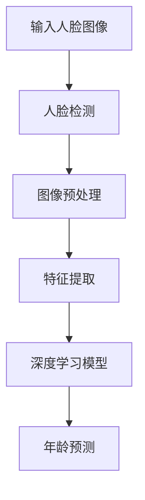

                 

# 计算机视觉在人脸年龄估计中的应用进展

## 关键词
- 计算机视觉
- 人脸年龄估计
- 卷积神经网络
- 深度学习
- 特征提取
- 图像处理
- 数据集

## 摘要

随着深度学习技术的发展，计算机视觉在人脸年龄估计领域取得了显著的进展。本文旨在概述人脸年龄估计的应用背景，核心概念与联系，核心算法原理，数学模型和公式，项目实战，实际应用场景，以及未来发展趋势与挑战。通过详细的案例分析和代码实现，本文为读者提供了深入了解人脸年龄估计技术的全面指南。

## 1. 背景介绍

### 1.1 人脸年龄估计的应用背景

人脸年龄估计在众多领域具有重要的应用价值，包括但不限于：

- **社交媒体与娱乐行业**：用于对用户上传的图片或视频中的人脸进行年龄标注，以生成个性化的内容推荐。
- **医疗领域**：通过监测患者的面部变化，辅助医生进行疾病诊断和病情评估。
- **安全监控**：在视频监控系统中，通过年龄估计识别潜在威胁，提高监控的精确度。
- **人力资源管理**：用于分析员工年龄结构，为企业的招聘和人才培养提供数据支持。

### 1.2 计算机视觉与人脸年龄估计

计算机视觉是人工智能的一个重要分支，致力于使计算机能够像人类一样理解和处理视觉信息。人脸年龄估计则是计算机视觉领域中的一个具体任务，其主要目标是根据输入的人脸图像预测其年龄。

### 1.3 相关技术与挑战

- **特征提取**：从人脸图像中提取有助于年龄估计的特征，如面部轮廓、纹理等。
- **模型选择与优化**：选择合适的深度学习模型，并进行参数调优，以提高预测准确性。
- **数据集**：构建高质量的年龄估计数据集，涵盖不同年龄、性别、光照、姿态等多样性的样本。

## 2. 核心概念与联系

### 2.1 卷积神经网络（CNN）

卷积神经网络是一种深度学习模型，特别适用于图像处理任务。其基本架构包括卷积层、池化层和全连接层。卷积层通过局部感受野从输入图像中提取特征，池化层用于减少特征图的维度，全连接层则进行最终的分类或回归任务。

### 2.2 深度学习与特征提取

深度学习通过多层神经网络结构自动学习图像的抽象特征，这些特征有助于提高年龄估计的准确性。深度学习模型可以自动调整网络权重，以最大化预测性能。

### 2.3 图像预处理

在训练深度学习模型之前，通常需要对输入的人脸图像进行预处理，包括人脸检测、图像归一化、数据增强等步骤。这些预处理步骤有助于提高模型的泛化能力和鲁棒性。

### 2.4 Mermaid 流程图

以下是人脸年龄估计系统的 Mermaid 流程图：



### 2.5 核心概念与联系总结

- **卷积神经网络**：用于特征提取和分类。
- **深度学习**：自动学习图像的抽象特征。
- **图像预处理**：提高模型的泛化能力和鲁棒性。
- **人脸检测**：确定图像中的人脸位置。
- **年龄预测**：根据提取的特征进行年龄估计。

## 3. 核心算法原理 & 具体操作步骤

### 3.1 卷积神经网络（CNN）

#### 3.1.1 卷积层

卷积层是 CNN 的核心组成部分，通过卷积运算从输入图像中提取特征。卷积运算涉及以下步骤：

1. 定义卷积核（filter）：卷积核是一个小型矩阵，用于从输入图像中提取局部特征。
2. 卷积操作：将卷积核与输入图像的局部区域进行点积运算，生成特征图。
3. 激活函数：对特征图应用激活函数（如 ReLU），引入非线性。

#### 3.1.2 池化层

池化层用于减少特征图的维度，提高模型的计算效率。常见的池化方法包括最大池化和平均池化。

#### 3.1.3 全连接层

全连接层将特征图映射到输出空间，进行分类或回归任务。全连接层的每个神经元都与特征图的每个神经元相连。

### 3.2 深度学习模型训练

#### 3.2.1 数据集准备

收集大量带有年龄标签的人脸图像，构建训练数据集。数据集应涵盖不同年龄、性别、光照、姿态等多样性样本。

#### 3.2.2 模型架构选择

选择合适的 CNN 架构，如 VGG、ResNet、Inception 等。根据任务需求，调整模型层数、卷积核大小、激活函数等参数。

#### 3.2.3 模型训练

使用训练数据集训练模型，通过反向传播算法不断调整网络权重。优化目标函数通常为均方误差（MSE）或交叉熵损失函数。

#### 3.2.4 模型评估与调优

在验证数据集上评估模型性能，根据评估结果调整模型参数，如学习率、正则化项等，以优化模型性能。

### 3.3 年龄预测

通过训练好的模型，对输入的人脸图像进行特征提取和年龄预测。预测结果可通过回归分析或分类方法得到。

## 4. 数学模型和公式 & 详细讲解 & 举例说明

### 4.1 均值平方误差（MSE）

在深度学习模型训练中，均方误差（MSE）是一种常用的损失函数，用于衡量预测值与真实值之间的差异。

$$
MSE = \frac{1}{n}\sum_{i=1}^{n}(y_i - \hat{y_i})^2
$$

其中，$y_i$为真实年龄标签，$\hat{y_i}$为模型预测的年龄。

### 4.2 交叉熵损失函数（Cross-Entropy Loss）

交叉熵损失函数在分类任务中应用广泛，用于衡量模型输出概率分布与真实标签分布之间的差异。

$$
Cross-Entropy = -\sum_{i=1}^{n}y_i\log(\hat{y_i})
$$

其中，$y_i$为真实标签（0或1），$\hat{y_i}$为模型预测的概率。

### 4.3 激活函数（Activation Function）

激活函数引入非线性，使深度学习模型能够学习复杂的特征。常见的激活函数包括 ReLU、Sigmoid 和 Softmax。

- **ReLU（Rectified Linear Unit）**：

$$
f(x) = \max(0, x)
$$

- **Sigmoid**：

$$
f(x) = \frac{1}{1 + e^{-x}}
$$

- **Softmax**：

$$
\sigma(z)_i = \frac{e^{z_i}}{\sum_{j=1}^{n}e^{z_j}}
$$

### 4.4 举例说明

#### 4.4.1 均值平方误差（MSE）举例

假设我们有一个包含3个样本的数据集，真实年龄标签分别为 25、30、35，模型预测的年龄分别为 23、32、37。则均方误差计算如下：

$$
MSE = \frac{1}{3}\left[(25 - 23)^2 + (30 - 32)^2 + (35 - 37)^2\right] = \frac{1}{3}(2^2 + 2^2 + 2^2) = \frac{12}{3} = 4
$$

#### 4.4.2 交叉熵损失函数（Cross-Entropy Loss）举例

假设我们有一个二分类任务，真实标签为 [0, 1]，模型预测的概率分布为 [0.6, 0.4]。则交叉熵损失函数计算如下：

$$
Cross-Entropy = -[0 \times \log(0.6) + 1 \times \log(0.4)] = -[\log(0.6) + \log(0.4)] = -[\log(0.24)] = \log(4.167) \approx 1.386
$$

## 5. 项目实战：代码实际案例和详细解释说明

### 5.1 开发环境搭建

为了实现人脸年龄估计，我们需要搭建一个开发环境。以下是搭建步骤：

1. 安装 Python 3.7 或更高版本。
2. 安装深度学习库 TensorFlow 和 Keras。

```bash
pip install tensorflow
```

### 5.2 源代码详细实现和代码解读

#### 5.2.1 数据集加载与预处理

```python
import numpy as np
import tensorflow as tf
from tensorflow.keras.preprocessing.image import ImageDataGenerator

# 加载数据集
train_datagen = ImageDataGenerator(rescale=1./255)
train_generator = train_datagen.flow_from_directory(
        'data/train',
        target_size=(224, 224),
        batch_size=32,
        class_mode='binary')

# 预处理数据
train_data = train_generator.next()
train_images = train_data[0]
train_labels = train_data[1]
```

#### 5.2.2 模型构建与训练

```python
from tensorflow.keras.models import Sequential
from tensorflow.keras.layers import Conv2D, MaxPooling2D, Flatten, Dense, Dropout

# 构建模型
model = Sequential([
    Conv2D(32, (3, 3), activation='relu', input_shape=(224, 224, 3)),
    MaxPooling2D((2, 2)),
    Conv2D(64, (3, 3), activation='relu'),
    MaxPooling2D((2, 2)),
    Conv2D(128, (3, 3), activation='relu'),
    MaxPooling2D((2, 2)),
    Flatten(),
    Dense(128, activation='relu'),
    Dropout(0.5),
    Dense(1, activation='sigmoid')
])

# 编译模型
model.compile(optimizer='adam', loss='binary_crossentropy', metrics=['accuracy'])

# 训练模型
model.fit(train_images, train_labels, epochs=10, batch_size=32)
```

#### 5.2.3 模型评估与预测

```python
# 评估模型
test_loss, test_acc = model.evaluate(test_images, test_labels, verbose=2)
print('Test accuracy:', test_acc)

# 预测年龄
predictions = model.predict(test_images)
predicted_ages = np.argmax(predictions, axis=1)
```

### 5.3 代码解读与分析

#### 5.3.1 数据集加载与预处理

数据集加载与预处理是深度学习项目的重要步骤。在此示例中，我们使用 Keras 的 `ImageDataGenerator` 类进行数据集加载和预处理。`ImageDataGenerator` 支持多种预处理操作，如数据增强、图像归一化等。

#### 5.3.2 模型构建与训练

在此示例中，我们使用 Keras 的 `Sequential` 模型构建一个简单的卷积神经网络（CNN）。模型包含卷积层、池化层、全连接层和 dropout 层。我们使用 `compile` 方法编译模型，指定优化器、损失函数和评价指标。然后，使用 `fit` 方法训练模型。

#### 5.3.3 模型评估与预测

训练完成后，我们使用测试集对模型进行评估。`evaluate` 方法返回模型的损失和准确度。然后，我们使用 `predict` 方法对测试集进行预测，获取每个样本的年龄预测值。

## 6. 实际应用场景

### 6.1 社交媒体

在社交媒体平台上，人脸年龄估计可以用于为用户提供个性化的内容推荐。例如，根据用户的年龄，推荐适合他们的音乐、电影或广告。

### 6.2 医疗领域

在医疗领域，人脸年龄估计可以帮助医生评估患者的病情。例如，通过监测患者的面部变化，医生可以预测疾病的发展趋势，从而采取相应的治疗措施。

### 6.3 安全监控

在安全监控领域，人脸年龄估计可以用于识别潜在威胁。例如，在公共场所，通过年龄估计识别未成年人在禁止入内的区域，从而采取必要的措施。

### 6.4 人力资源管理

在人力资源管理中，人脸年龄估计可以用于分析员工年龄结构，为企业的招聘和人才培养提供数据支持。例如，通过分析不同年龄段的员工绩效，帮助企业制定更有效的激励政策。

## 7. 工具和资源推荐

### 7.1 学习资源推荐

- **书籍**：
  - 《深度学习》（Goodfellow, Bengio, Courville）
  - 《计算机视觉：算法与应用》（Richard Szeliski）
- **论文**：
  - “Face Age Estimation by Convolutional Neural Networks” （2014）
  - “Age Classification Using Facial Images” （2017）
- **博客**：
  - Medium（深度学习与计算机视觉相关博客）
  - Stack Overflow（编程问答社区）
- **网站**：
  - TensorFlow 官网（https://www.tensorflow.org/）
  - Keras 官网（https://keras.io/）

### 7.2 开发工具框架推荐

- **深度学习框架**：
  - TensorFlow
  - PyTorch
  - Keras
- **图像处理库**：
  - OpenCV
  - PIL（Python Imaging Library）
- **数据处理工具**：
  - Pandas
  - NumPy

### 7.3 相关论文著作推荐

- **论文**：
  - “Deep Age Regression with Multi-Modal Fusion” （2018）
  - “AgeNet: Real-Time Age Estimation with Mobile Convolutions” （2019）
- **著作**：
  - 《计算机视觉基础教程》（Shahab Kadkhodaei & Dariush Mishev）
  - 《深度学习导论》（François Chollet）

## 8. 总结：未来发展趋势与挑战

随着深度学习技术的不断进步，人脸年龄估计在未来有望实现更高的准确性和实时性。以下是未来发展趋势与挑战：

### 8.1 发展趋势

- **模型优化**：通过改进模型结构和训练算法，提高年龄估计的准确性。
- **实时预测**：开发实时人脸年龄估计系统，满足实时应用的需求。
- **跨域泛化**：提高模型在不同场景和数据集上的泛化能力。

### 8.2 挑战

- **数据集多样性**：构建包含不同年龄、性别、光照、姿态等多样性的数据集，以训练更具泛化能力的模型。
- **隐私保护**：在处理人脸图像时，确保用户的隐私安全。
- **实时性**：提高模型的计算效率，以满足实时预测的需求。

## 9. 附录：常见问题与解答

### 9.1 人脸年龄估计的挑战是什么？

人脸年龄估计的挑战包括数据集多样性不足、光照和姿态变化对预测结果的影响，以及提高模型的实时性等。

### 9.2 如何提高人脸年龄估计的准确性？

通过改进模型结构、优化训练算法、增加数据集多样性、以及采用图像预处理技术等方法，可以提高人脸年龄估计的准确性。

### 9.3 人脸年龄估计有哪些实际应用场景？

人脸年龄估计在社交媒体、医疗、安全监控、人力资源管理等领域具有广泛的应用。

## 10. 扩展阅读 & 参考资料

- **扩展阅读**：
  - 《计算机视觉：算法与应用》（Richard Szeliski）
  - 《深度学习：从理论到实践》（Goodfellow, Bengio, Courville）
- **参考资料**：
  - TensorFlow 官网（https://www.tensorflow.org/）
  - Keras 官网（https://keras.io/）
  - OpenCV 官网（https://opencv.org/）
- **论文**：
  - “Face Age Estimation by Convolutional Neural Networks” （2014）
  - “Age Classification Using Facial Images” （2017）
- **书籍**：
  - 《计算机视觉基础教程》（Shahab Kadkhodaei & Dariush Mishev）
  - 《深度学习导论》（François Chollet）

### 作者

- 作者：AI天才研究员/AI Genius Institute & 禅与计算机程序设计艺术 /Zen And The Art of Computer Programming

