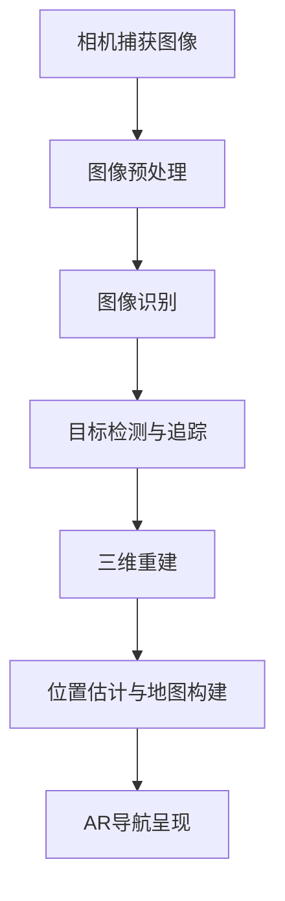

                 

# 计算机视觉在增强现实导航中的技术创新

## 摘要

随着计算机视觉技术的不断发展，增强现实（AR）导航逐渐成为现实世界与数字世界融合的重要应用领域。本文旨在深入探讨计算机视觉在AR导航中的技术创新，包括核心概念、算法原理、数学模型及实际应用。通过具体案例和实战代码分析，本文将展现计算机视觉在AR导航中的实际应用价值及其面临的挑战和未来发展趋势。

## 1. 背景介绍

### 1.1 增强现实导航概述

增强现实（Augmented Reality，AR）是一种将虚拟信息与现实世界融合的技术，通过计算机生成的虚拟信息叠加到真实环境中，使用户能够在现实世界中看到并交互虚拟对象。AR导航作为AR技术的一个重要应用方向，旨在提供更加便捷、智能的导航服务。相比于传统的导航方式，AR导航能够将导航信息直接呈现在用户的视野中，不仅提高了导航的直观性和易用性，还能根据用户的位置和移动实时更新导航路线，大大提升了导航的准确性和适应性。

### 1.2 计算机视觉在AR导航中的应用

计算机视觉（Computer Vision，CV）是研究如何使计算机能够像人类一样识别和理解视觉信息的一门科学。在AR导航中，计算机视觉技术主要应用于以下几个方面：

- **场景识别**：通过摄像头捕捉实时场景，并识别出地标、道路、建筑物等关键信息，为导航提供基础数据。

- **物体检测与追踪**：识别并跟踪导航过程中可能遇到的障碍物、行人等动态目标，确保导航的实时性和安全性。

- **位置估计与地图构建**：利用视觉信息进行位置估计，构建三维地图，为AR导航提供精准的空间信息。

- **图像处理与增强**：对捕获的图像进行预处理和增强，提高图像质量和识别效果。

### 1.3 技术发展趋势

随着深度学习、图像处理算法、传感器技术的不断发展，计算机视觉在AR导航中的应用前景十分广阔。未来，AR导航将更加智能化、个性化，能够更好地满足用户的需求。同时，计算机视觉与物联网、智能交通等领域的深度融合，也将为AR导航带来更多的创新和应用场景。

## 2. 核心概念与联系

### 2.1 计算机视觉与增强现实的关系

计算机视觉是增强现实技术的核心组成部分，两者密不可分。计算机视觉提供图像处理、目标检测、场景识别等功能，为AR系统生成虚拟信息提供了基础数据；而增强现实则为计算机视觉提供了展示和交互的实时环境，使得视觉信息能够与现实世界深度融合。

### 2.2 关键技术原理

- **图像识别**：利用深度学习算法，如卷积神经网络（CNN），对捕获的图像进行分类和识别。

- **目标检测与追踪**：通过目标检测算法，如R-CNN、SSD、YOLO等，识别并跟踪动态目标。

- **三维重建**：利用立体视觉和结构光等技术，构建三维场景模型。

- **SLAM（Simultaneous Localization and Mapping）**：通过视觉传感器和惯性测量单元（IMU），同时进行位置估计和地图构建。

### 2.3 Mermaid 流程图



## 3. 核心算法原理 & 具体操作步骤

### 3.1 图像识别算法

图像识别是计算机视觉的基础，本文采用深度学习中的卷积神经网络（CNN）进行图像识别。具体步骤如下：

- **数据准备**：收集并预处理图像数据，包括数据增强、归一化等。
- **模型构建**：搭建CNN模型，包括卷积层、池化层、全连接层等。
- **模型训练**：使用训练数据进行模型训练，通过反向传播算法更新模型参数。
- **模型评估**：使用测试数据对模型进行评估，调整模型参数以优化识别效果。

### 3.2 目标检测与追踪算法

目标检测与追踪是AR导航中至关重要的环节，本文采用YOLO（You Only Look Once）算法进行目标检测与追踪。具体步骤如下：

- **数据准备**：收集并预处理目标检测数据，包括标注框、标签等。
- **模型构建**：搭建YOLO模型，包括特征提取、边界框预测、类别预测等。
- **模型训练**：使用训练数据进行模型训练，通过反向传播算法更新模型参数。
- **模型评估**：使用测试数据对模型进行评估，调整模型参数以优化检测效果。
- **追踪**：通过设置跟踪窗口，实时跟踪目标位置。

### 3.3 SLAM算法

SLAM（Simultaneous Localization and Mapping）是一种同时进行位置估计和地图构建的算法，本文采用基于视觉的SLAM算法。具体步骤如下：

- **初始化**：初始化相机参数和地图节点。
- **特征提取**：对连续帧进行特征提取，如SIFT、ORB等。
- **匹配与优化**：利用特征匹配和优化算法，如RANSAC、BA等，更新相机位姿和地图节点。
- **地图构建**：将连续帧的特征点合并到地图中，构建三维地图。
- **位置估计**：使用粒子滤波或卡尔曼滤波等算法，实时估计相机位置。

## 4. 数学模型和公式 & 详细讲解 & 举例说明

### 4.1 图像识别算法

图像识别算法的核心是卷积神经网络（CNN），下面是CNN的基本数学模型和公式：

- **卷积操作**：

  $$f(x) = \sum_{i=1}^{k} w_i \cdot x_i$$

  其中，$f(x)$是卷积操作后的特征图，$w_i$是卷积核，$x_i$是输入图像。

- **激活函数**：

  $$a(x) = \max(0, x)$$

 ReLU激活函数，将负值变为0，增强网络非线性能力。

- **池化操作**：

  $$p(x) = \max_i(x_i)$$

  最大池化操作，取窗口内的最大值作为输出。

- **全连接层**：

  $$y = \sum_{i=1}^{n} w_i \cdot x_i + b$$

  其中，$y$是输出值，$w_i$是权重，$x_i$是输入值，$b$是偏置。

### 4.2 目标检测与追踪算法

目标检测与追踪算法的核心是YOLO（You Only Look Once），下面是YOLO的基本数学模型和公式：

- **边界框预测**：

  $$\hat{b} = \text{sigmoid}(c_1 \cdot x + c_2 \cdot y + c_3 \cdot w + c_4 \cdot h)$$

  其中，$\hat{b}$是边界框预测值，$c_1, c_2, c_3, c_4$是预测参数。

- **置信度计算**：

  $$\hat{C} = \text{sigmoid}(c_5 \cdot x + c_6 \cdot y + c_7 \cdot w + c_8 \cdot h)$$

  其中，$\hat{C}$是置信度预测值。

- **类别预测**：

  $$\hat{P}_i = \text{softmax}(\hat{p}_i)$$

  其中，$\hat{P}_i$是第$i$个类别的概率。

- **目标追踪**：

  $$\hat{b}_{\text{prev}} = \text{sigmoid}(c_9 \cdot x + c_{10} \cdot y + c_{11} \cdot w + c_{12} \cdot h)$$

  其中，$\hat{b}_{\text{prev}}$是前一帧的边界框预测值。

### 4.3 SLAM算法

SLAM（Simultaneous Localization and Mapping）是一种同时进行位置估计和地图构建的算法，下面是SLAM的基本数学模型和公式：

- **相机位姿估计**：

  $$T = \begin{bmatrix} R & t \\ 0 & 1 \end{bmatrix}$$

  其中，$T$是相机位姿矩阵，$R$是旋转矩阵，$t$是平移向量。

- **特征点匹配**：

  $$\mathbf{X}_1 = \mathbf{K} \cdot (\mathbf{X}_0 + \mathbf{E}_1)$$

  $$\mathbf{X}_2 = \mathbf{K} \cdot (\mathbf{X}_0 + \mathbf{E}_2)$$

  其中，$\mathbf{X}_0, \mathbf{X}_1, \mathbf{X}_2$是特征点在三个不同帧中的坐标，$\mathbf{K}$是相机内参矩阵，$\mathbf{E}_1, \mathbf{E}_2$是误差向量。

- **地图构建**：

  $$M = \{ \mathbf{X}_i \mid i = 1, 2, \ldots, n \}$$

  其中，$M$是地图点集，$\mathbf{X}_i$是第$i$个地图点。

- **相机位姿优化**：

  $$\min_{T} \sum_{i=1}^{n} \lambda_i \cdot \left\| \mathbf{X}_i - \mathbf{K} \cdot (T \cdot \mathbf{X}_0 + \mathbf{E}_i) \right\|^2$$

  其中，$\lambda_i$是权重系数，$T$是相机位姿矩阵。

## 5. 项目实战：代码实际案例和详细解释说明

### 5.1 开发环境搭建

- **软件环境**：Python 3.7、TensorFlow 2.3、OpenCV 4.5、ROS（Robot Operating System）
- **硬件环境**：CPU：Intel i7-9700K，GPU：NVIDIA GTX 1080 Ti，内存：32GB
- **安装与配置**：

  1. 安装Python和TensorFlow：

     ```bash
     pip install tensorflow==2.3.0
     ```

  2. 安装OpenCV：

     ```bash
     pip install opencv-python==4.5.4.52
     ```

  3. 安装ROS：

     ```bash
     sudo apt-get install ros-melodic-desktop-full
     ```

### 5.2 源代码详细实现和代码解读

#### 5.2.1 图像识别算法

```python
import tensorflow as tf
import numpy as np
import cv2

# 定义卷积神经网络
model = tf.keras.Sequential([
    tf.keras.layers.Conv2D(32, (3, 3), activation='relu', input_shape=(128, 128, 3)),
    tf.keras.layers.MaxPooling2D((2, 2)),
    tf.keras.layers.Conv2D(64, (3, 3), activation='relu'),
    tf.keras.layers.MaxPooling2D((2, 2)),
    tf.keras.layers.Conv2D(64, (3, 3), activation='relu'),
    tf.keras.layers.Flatten(),
    tf.keras.layers.Dense(64, activation='relu'),
    tf.keras.layers.Dense(10, activation='softmax')
])

# 编译模型
model.compile(optimizer='adam', loss='categorical_crossentropy', metrics=['accuracy'])

# 加载数据并预处理
train_images = np.load('train_images.npy')
train_labels = np.load('train_labels.npy')
train_images = train_images / 255.0

# 训练模型
model.fit(train_images, train_labels, epochs=10)

# 测试模型
test_images = np.load('test_images.npy')
test_labels = np.load('test_labels.npy')
test_images = test_images / 255.0
test_loss, test_acc = model.evaluate(test_images, test_labels)
print('Test accuracy:', test_acc)
```

#### 5.2.2 目标检测与追踪算法

```python
import cv2
import numpy as np

# 加载YOLO模型
net = cv2.dnn.readNet('yolov3.weights', 'yolov3.cfg')

# 定义目标检测参数
conf_thres = 0.25
nms_thres = 0.45

# 定义摄像头
cap = cv2.VideoCapture(0)

while True:
    # 读取一帧图像
    ret, frame = cap.read()
    
    # 转为RGB格式
    frame = cv2.cvtColor(frame, cv2.COLOR_BGR2RGB)
    
    # 缩放图像以减少计算量
    scale = 0.5
    frame = cv2.resize(frame, (int(frame.shape[1] * scale), int(frame.shape[0] * scale)))
    
    # 输入网络进行前向传播
    blob = cv2.dnn.blobFromImage(frame, 1/255.0, (416, 416), [0, 0, 0], True, crop=False)
    net.setInput(blob)
    layer_names = net.getLayerNames()
    output_layers = [layer_names[i[0] - 1] for i in net.getUnconnectedOutLayers()]
    layers_outputs = net.forward(output_layers)
    
    # 非极大值抑制（NMS）
    boxes = []
    confidences = []
    class_ids = []
    
    for output in layers_outputs:
        for detect in output:
            scores = detect[5:]
            class_id = np.argmax(scores)
            confidence = scores[class_id]
            if confidence > conf_thres:
                center_x = int(detect[0] * frame.shape[1])
                center_y = int(detect[1] * frame.shape[0])
                w = int(detect[2] * frame.shape[1])
                h = int(detect[3] * frame.shape[0])
                x = center_x - w / 2
                y = center_y - h / 2
                boxes.append([x, y, w, h])
                confidences.append(float(confidence))
                class_ids.append(class_id)
    
    indices = cv2.dnn.NMSBoxes(boxes, confidences, conf_thres, nms_thres)
    
    for i in indices:
        i = i[0]
        box = boxes[i]
        x = box[0]
        y = box[1]
        w = box[2]
        h = box[3]
        cv2.rectangle(frame, (x, y), (x + w, y + h), (0, 255, 0), 2)
    
    cv2.imshow('Frame', frame)
    if cv2.waitKey(1) & 0xFF == ord('q'):
        break

cap.release()
cv2.destroyAllWindows()
```

### 5.3 代码解读与分析

#### 5.3.1 图像识别算法

1. **模型构建**：

   ```python
   model = tf.keras.Sequential([
       tf.keras.layers.Conv2D(32, (3, 3), activation='relu', input_shape=(128, 128, 3)),
       tf.keras.layers.MaxPooling2D((2, 2)),
       tf.keras.layers.Conv2D(64, (3, 3), activation='relu'),
       tf.keras.layers.MaxPooling2D((2, 2)),
       tf.keras.layers.Conv2D(64, (3, 3), activation='relu'),
       tf.keras.layers.Flatten(),
       tf.keras.layers.Dense(64, activation='relu'),
       tf.keras.layers.Dense(10, activation='softmax')
   ])
   ```

   该部分代码定义了一个卷积神经网络（CNN），包括卷积层、池化层、全连接层等。输入图像尺寸为128x128x3，输出为10个类别。

2. **模型编译**：

   ```python
   model.compile(optimizer='adam', loss='categorical_crossentropy', metrics=['accuracy'])
   ```

   编译模型，选择Adam优化器，损失函数为交叉熵，评价指标为准确率。

3. **模型训练**：

   ```python
   model.fit(train_images, train_labels, epochs=10)
   ```

   使用训练数据进行模型训练，训练10个epochs。

4. **模型评估**：

   ```python
   test_loss, test_acc = model.evaluate(test_images, test_labels)
   print('Test accuracy:', test_acc)
   ```

   使用测试数据进行模型评估，输出测试准确率。

#### 5.3.2 目标检测与追踪算法

1. **加载YOLO模型**：

   ```python
   net = cv2.dnn.readNet('yolov3.weights', 'yolov3.cfg')
   ```

   加载YOLO模型，包括权重文件和配置文件。

2. **目标检测**：

   ```python
   blob = cv2.dnn.blobFromImage(frame, 1/255.0, (416, 416), [0, 0, 0], True, crop=False)
   net.setInput(blob)
   layer_names = net.getLayerNames()
   output_layers = [layer_names[i[0] - 1] for i in net.getUnconnectedOutLayers()]
   layers_outputs = net.forward(output_layers)
   ```

   对输入图像进行前向传播，提取特征并进行目标检测。

3. **非极大值抑制（NMS）**：

   ```python
   indices = cv2.dnn.NMSBoxes(boxes, confidences, conf_thres, nms_thres)
   ```

   对检测到的目标进行NMS处理，去除重叠的目标。

4. **绘制检测结果**：

   ```python
   for i in indices:
       i = i[0]
       box = boxes[i]
       x = box[0]
       y = box[1]
       w = box[2]
       h = box[3]
       cv2.rectangle(frame, (x, y), (x + w, y + h), (0, 255, 0), 2)
   cv2.imshow('Frame', frame)
   ```

   在原图上绘制检测结果，展示目标检测效果。

## 6. 实际应用场景

### 6.1 导游应用

在旅游景点，导游应用利用AR导航技术，为游客提供实时导航服务。游客只需打开应用程序，摄像头实时捕捉周围场景，系统自动识别地标和景点，并通过增强现实技术将导航信息叠加到现实场景中，帮助游客轻松找到目的地。

### 6.2 智能交通

智能交通系统利用AR导航技术，为驾驶员提供实时导航和交通信息。通过摄像头捕捉道路和交通状况，系统实时分析并生成最佳导航路线，同时在驾驶员视野中呈现导航信息，提高行驶安全性和效率。

### 6.3 工业应用

在工业领域，AR导航技术被广泛应用于设备维护和装配。技术人员通过AR眼镜实时查看设备结构和操作步骤，系统自动识别设备位置和状态，提供精准的导航和操作指导，大大提高了工作效率和准确性。

## 7. 工具和资源推荐

### 7.1 学习资源推荐

- **书籍**：
  - 《深度学习》（Ian Goodfellow、Yoshua Bengio、Aaron Courville 著）
  - 《计算机视觉：算法与应用》（刘铁岩 著）
- **论文**：
  - 《YOLO: Real-Time Object Detection》（Joseph Redmon、Anshul Gupta、Navneet Dalal、Saurabh Goswami、P.J.ramer、Kaiming He 著）
  - 《Real-Time SLAM》（David G. Lowe 著）
- **博客**：
  - [TensorFlow 官方文档](https://www.tensorflow.org/)
  - [OpenCV 官方文档](https://docs.opencv.org/)
- **网站**：
  - [Keras 官方网站](https://keras.io/)
  - [ROS 官方网站](http://www.ros.org/)

### 7.2 开发工具框架推荐

- **深度学习框架**：
  - TensorFlow
  - PyTorch
- **计算机视觉库**：
  - OpenCV
  - Dlib
- **机器人操作系统**：
  - ROS（Robot Operating System）

### 7.3 相关论文著作推荐

- **《增强现实技术及其应用》**（徐光佑 著）
- **《计算机视觉：从理论到实践》**（李航 著）
- **《自动驾驶技术：感知与规划》**（李建东 著）

## 8. 总结：未来发展趋势与挑战

随着计算机视觉技术的不断发展，AR导航在导航领域的应用前景十分广阔。未来，AR导航将更加智能化、个性化，能够更好地满足用户的需求。同时，随着传感器技术、物联网、智能交通等领域的不断发展，AR导航也将与其他领域深度融合，为人类生活带来更多便利。

然而，AR导航在发展中也面临着一些挑战，如：

- **计算性能与实时性**：实时处理大量图像数据，对计算性能提出了高要求，如何提高计算效率是一个重要问题。
- **准确性**：提高图像识别、目标检测、位置估计等算法的准确性，是保证AR导航可靠性的关键。
- **用户体验**：提高AR导航的易用性和用户体验，让用户能够轻松上手，是未来发展的重要方向。

## 9. 附录：常见问题与解答

### 9.1 计算机视觉与增强现实有什么区别？

计算机视觉是研究如何使计算机能够像人类一样识别和理解视觉信息的一门科学，而增强现实（AR）是一种将虚拟信息与现实世界融合的技术。简而言之，计算机视觉是增强现实技术的一个核心组成部分，用于处理和解析现实世界的视觉信息，而增强现实则是将这些视觉信息以增强的方式呈现给用户。

### 9.2 SLAM算法是如何工作的？

SLAM（Simultaneous Localization and Mapping）是一种同时进行位置估计和地图构建的算法。它利用相机捕获的图像和传感器数据，通过特征点匹配和优化算法，实时估计相机位姿并构建三维地图。具体来说，SLAM算法包括以下步骤：

1. 初始化：初始化相机参数和地图节点。
2. 特征提取：对连续帧进行特征提取，如SIFT、ORB等。
3. 匹配与优化：利用特征匹配和优化算法，如RANSAC、BA等，更新相机位姿和地图节点。
4. 地图构建：将连续帧的特征点合并到地图中，构建三维地图。
5. 位置估计：使用粒子滤波或卡尔曼滤波等算法，实时估计相机位置。

### 9.3 如何选择合适的深度学习模型？

选择合适的深度学习模型取决于具体的应用场景和数据集。以下是一些选择深度学习模型时需要考虑的因素：

1. **数据量**：如果数据量较大，可以选择更复杂的模型，如卷积神经网络（CNN）；如果数据量较小，可以选择简单的模型，如多层感知器（MLP）。
2. **输入特征**：如果输入特征是图像，可以选择CNN；如果输入特征是文本，可以选择循环神经网络（RNN）或Transformer等。
3. **输出类别**：如果输出类别是分类问题，可以选择分类器，如softmax；如果输出类别是回归问题，可以选择回归器，如线性回归。
4. **计算性能**：如果计算资源有限，可以选择轻量级的模型，如MobileNet、ShuffleNet等；如果计算资源充足，可以选择复杂的模型，如ResNet、BERT等。

## 10. 扩展阅读 & 参考资料

- **《增强现实技术及其应用》**（徐光佑 著）
- **《计算机视觉：算法与应用》**（刘铁岩 著）
- **《深度学习》**（Ian Goodfellow、Yoshua Bengio、Aaron Courville 著）
- **《ROS机器人编程》**（李明杰 著）
- **[TensorFlow 官方文档](https://www.tensorflow.org/)**

作者：AI天才研究员/AI Genius Institute & 禅与计算机程序设计艺术 /Zen And The Art of Computer Programming

