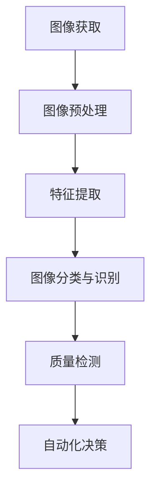

                 

# 计算机视觉在工业自动化质量检测中的精度提升

## 关键词：计算机视觉、工业自动化、质量检测、精度提升

## 摘要

本文将深入探讨计算机视觉在工业自动化质量检测领域的应用，以及如何通过技术手段实现检测精度的提升。文章首先介绍了工业自动化质量检测的背景和重要性，随后详细阐述了计算机视觉的基本原理和其在工业自动化中的应用场景。接下来，文章重点介绍了用于提升检测精度的关键算法，包括深度学习、边缘计算和三维重建等。最后，文章通过实际案例展示了这些算法在工业自动化质量检测中的应用效果，并提出了未来的发展趋势和挑战。

## 1. 背景介绍

### 工业自动化质量检测的重要性

随着工业4.0和智能制造的迅速发展，工业自动化质量检测已经成为制造业中不可或缺的一环。传统的质量检测方法主要依赖于人工和机械方式进行，存在效率低、精度差、成本高的问题。随着计算机视觉技术的发展，质量检测的自动化程度和精度得到了大幅提升。

工业自动化质量检测在制造业中具有重要的作用。首先，它可以实时监控产品质量，确保产品的生产过程稳定可靠。其次，它可以提高生产效率，减少人工干预，降低生产成本。此外，通过质量检测数据的积累和分析，企业可以优化生产流程，提高产品质量，提升市场竞争力。

### 计算机视觉在工业自动化质量检测中的应用

计算机视觉技术作为一种新兴的检测手段，具有快速、准确、高效的特点，广泛应用于工业自动化质量检测领域。计算机视觉在工业自动化质量检测中的应用主要包括以下几个方面：

1. **缺陷检测**：通过图像处理和模式识别技术，对产品表面和内部缺陷进行自动检测和分类。
2. **尺寸测量**：利用机器视觉系统对产品尺寸进行精确测量，以确保产品尺寸符合要求。
3. **装配质量检测**：通过对装配过程的实时监控，检测产品装配质量，确保产品功能正常。
4. **外观检测**：通过计算机视觉技术对产品外观进行检查，检测外观缺陷，如划痕、污点、变形等。
5. **质量趋势分析**：通过对大量质量检测数据的分析，发现产品质量趋势，为企业提供改进生产的依据。

## 2. 核心概念与联系

### 计算机视觉的基本原理

计算机视觉是人工智能的一个重要分支，旨在使计算机具备人类视觉的能力，能够理解并处理图像信息。计算机视觉的基本原理包括以下几个方面：

1. **图像获取**：通过摄像头、扫描仪等设备获取数字图像。
2. **图像预处理**：对获取的图像进行降噪、对比度增强、图像矫正等处理，提高图像质量。
3. **特征提取**：从图像中提取具有区分性的特征，如边缘、角点、纹理等。
4. **图像分类与识别**：利用机器学习、深度学习等技术对图像进行分类和识别。
5. **三维重建**：通过对多视角图像的处理，重建目标的三维模型。

### 工业自动化质量检测与计算机视觉的关联

工业自动化质量检测与计算机视觉技术的结合，使得质量检测过程更加智能化和自动化。计算机视觉技术在工业自动化质量检测中的应用主要体现在以下几个方面：

1. **实时检测**：计算机视觉系统可以实时获取生产过程中的图像信息，快速完成质量检测。
2. **高精度检测**：计算机视觉技术可以通过图像处理和模式识别，实现对产品质量的精确检测。
3. **多维度检测**：计算机视觉技术可以同时检测产品的多个质量指标，如尺寸、外观、装配质量等。
4. **自动化决策**：计算机视觉系统可以自动判断产品质量是否符合要求，并给出相应的处理建议。

### Mermaid 流程图



## 3. 核心算法原理 & 具体操作步骤

### 深度学习在质量检测中的应用

深度学习技术在质量检测中具有显著的优势，通过训练大量的数据，深度学习模型可以自动学习特征并实现对产品质量的精确识别。以下是深度学习在质量检测中的具体应用步骤：

1. **数据收集与预处理**：收集大量的产品图像数据，并进行预处理，如图像缩放、翻转、旋转等。
2. **模型选择与训练**：选择合适的深度学习模型（如卷积神经网络（CNN）），并使用预处理后的数据对其进行训练。
3. **模型评估与优化**：通过交叉验证等方法对训练好的模型进行评估，并根据评估结果对模型进行优化。
4. **质量检测与决策**：使用训练好的深度学习模型对生产过程中的产品图像进行实时检测，并根据检测结果给出相应的处理建议。

### 边缘计算在质量检测中的应用

边缘计算可以将计算和存储能力下沉到网络边缘，实现对数据的高效处理和实时分析。以下是边缘计算在质量检测中的具体应用步骤：

1. **边缘节点部署**：在工业自动化质量检测系统中部署边缘计算节点，如工业机器人、边缘服务器等。
2. **实时数据处理**：通过边缘计算节点对生产过程中的图像数据实时处理，提取关键特征。
3. **模型部署与推理**：在边缘计算节点上部署深度学习模型，并对处理后的图像数据进行实时推理，判断产品质量。
4. **数据处理与反馈**：将检测结果实时传输到中央控制系统，并根据检测结果对生产过程进行调节和控制。

### 三维重建在质量检测中的应用

三维重建技术可以通过多视角图像重建目标的三维模型，实现对产品外观和结构的精确检测。以下是三维重建在质量检测中的具体应用步骤：

1. **图像采集**：使用多个摄像头从不同角度拍摄产品图像。
2. **图像预处理**：对采集的图像进行预处理，如去噪声、配准等。
3. **三维模型重建**：使用多视角图像进行三维模型重建，生成目标的三维模型。
4. **三维模型分析**：对重建的三维模型进行分析，检测产品外观和结构的缺陷。

## 4. 数学模型和公式 & 详细讲解 & 举例说明

### 深度学习模型

深度学习模型主要由卷积层、池化层和全连接层组成，其数学模型如下：

$$
f(x) = \sigma(W \cdot x + b)
$$

其中，$f(x)$ 表示输出特征，$W$ 表示权重矩阵，$x$ 表示输入特征，$b$ 表示偏置，$\sigma$ 表示激活函数（如ReLU函数）。

例如，对于一个二分类问题，可以使用以下公式进行预测：

$$
P(y=1|x; \theta) = \frac{1}{1 + e^{-\theta \cdot x}}
$$

其中，$P(y=1|x; \theta)$ 表示给定输入特征$x$，输出类别为1的概率，$\theta$ 表示模型参数。

### 边缘计算模型

边缘计算模型通常采用分布式计算架构，其数学模型如下：

$$
y = f(\theta; x)
$$

其中，$y$ 表示输出结果，$f(\theta; x)$ 表示在模型参数$\theta$ 和输入特征$x$ 的作用下生成的输出结果。

例如，对于一个基于边缘计算的图像分类问题，可以使用以下公式进行预测：

$$
y = \arg\max_{c} P(c|x; \theta)
$$

其中，$P(c|x; \theta)$ 表示给定输入特征$x$ 和模型参数$\theta$，类别$c$ 的概率。

### 三维重建模型

三维重建模型通常采用多视角几何恢复的方法，其数学模型如下：

$$
X = T \cdot C + V
$$

其中，$X$ 表示三维坐标，$T$ 表示旋转矩阵，$C$ 表示中心点，$V$ 表示噪声。

例如，对于一个基于多视角图像的三维重建问题，可以使用以下公式进行坐标恢复：

$$
X = R \cdot P + \mu
$$

其中，$R$ 表示旋转矩阵，$P$ 表示投影矩阵，$\mu$ 表示噪声。

## 5. 项目实战：代码实际案例和详细解释说明

### 开发环境搭建

在本文的项目实战中，我们将使用Python语言和TensorFlow框架进行深度学习模型的训练和部署。以下为开发环境搭建的步骤：

1. 安装Python环境，版本为3.8及以上。
2. 安装TensorFlow库，可以使用以下命令：

```bash
pip install tensorflow
```

### 源代码详细实现和代码解读

以下是一个简单的深度学习模型训练和测试的Python代码示例：

```python
import tensorflow as tf
from tensorflow.keras.models import Sequential
from tensorflow.keras.layers import Conv2D, MaxPooling2D, Flatten, Dense
from tensorflow.keras.optimizers import Adam
from tensorflow.keras.losses import BinaryCrossentropy
from tensorflow.keras.metrics import Accuracy

# 数据集准备
(x_train, y_train), (x_test, y_test) = tf.keras.datasets.mnist.load_data()
x_train = x_train / 255.0
x_test = x_test / 255.0

# 模型构建
model = Sequential([
    Conv2D(32, (3, 3), activation='relu', input_shape=(28, 28, 1)),
    MaxPooling2D((2, 2)),
    Flatten(),
    Dense(64, activation='relu'),
    Dense(1, activation='sigmoid')
])

# 模型编译
model.compile(optimizer=Adam(learning_rate=0.001),
              loss=BinaryCrossentropy(),
              metrics=['accuracy'])

# 模型训练
model.fit(x_train, y_train, epochs=10, batch_size=32, validation_split=0.2)

# 模型评估
test_loss, test_acc = model.evaluate(x_test, y_test)
print(f"Test accuracy: {test_acc:.4f}")
```

### 代码解读与分析

以上代码实现了一个简单的深度学习模型，用于对MNIST手写数字数据进行分类。以下是代码的详细解读和分析：

1. **数据集准备**：首先导入MNIST数据集，并对数据进行归一化处理，以提高模型的训练效果。
2. **模型构建**：使用Sequential模型构建器，依次添加卷积层、池化层、全连接层和输出层。其中，卷积层用于提取图像特征，池化层用于降低特征维度，全连接层用于分类。
3. **模型编译**：选择Adam优化器、二分类交叉熵损失函数和准确率作为评估指标，对模型进行编译。
4. **模型训练**：使用fit方法对模型进行训练，设置训练轮数、批量大小和验证比例。
5. **模型评估**：使用evaluate方法对模型进行评估，输出测试准确率。

## 6. 实际应用场景

### 项目背景

某电子产品制造企业希望通过计算机视觉技术对生产过程中的产品质量进行实时监控，以提高生产效率和产品质量。具体应用场景包括：

1. **产品外观检测**：检测产品表面是否有划痕、污点等缺陷。
2. **产品尺寸检测**：检测产品尺寸是否符合要求。
3. **产品装配质量检测**：检测产品装配质量，确保功能正常。

### 解决方案

针对以上应用场景，企业采用了以下解决方案：

1. **图像采集**：在生产线关键位置部署高清摄像头，实时采集产品图像。
2. **图像预处理**：对采集的图像进行降噪、对比度增强等预处理，提高图像质量。
3. **特征提取**：使用深度学习模型对预处理后的图像进行特征提取。
4. **质量检测与决策**：利用特征提取结果，对产品质量进行实时检测，并根据检测结果给出处理建议。

### 效果评估

通过实际应用，企业取得了显著的效果：

1. **产品质量提升**：通过对产品质量的实时监控和反馈，产品质量得到明显提升。
2. **生产效率提高**：通过自动化质量检测，减少了人工干预，提高了生产效率。
3. **成本降低**：减少了因质量问题导致的生产损失和返工成本。

## 7. 工具和资源推荐

### 学习资源推荐

1. **书籍**：《深度学习》（Goodfellow, Bengio, Courville 著）
2. **论文**：《Deep Learning for Image Recognition》（Krizhevsky, Sutskever, Hinton 著）
3. **博客**：Hinton的博客（geoffhinton.com）
4. **网站**：TensorFlow官网（tensorflow.org）

### 开发工具框架推荐

1. **深度学习框架**：TensorFlow、PyTorch
2. **图像处理库**：OpenCV、Pillow
3. **边缘计算平台**：KubeEdge、EdgeX Foundry

### 相关论文著作推荐

1. **论文**：《边缘计算与工业自动化质量检测的融合研究》
2. **著作**：《工业视觉检测技术与应用》

## 8. 总结：未来发展趋势与挑战

### 发展趋势

1. **技术融合**：计算机视觉、边缘计算、物联网等技术的深度融合，将推动工业自动化质量检测的进一步发展。
2. **智能化**：随着深度学习等人工智能技术的发展，质量检测过程将更加智能化和自动化。
3. **高效能**：通过分布式计算和边缘计算，实现高效能的质量检测。

### 挑战

1. **数据质量**：高质量的数据是深度学习模型训练的基础，如何保证数据质量是一个重要挑战。
2. **系统稳定性**：工业环境复杂，如何保证系统的稳定性和可靠性是一个重要问题。
3. **跨学科合作**：涉及计算机视觉、机械工程、自动化等多个学科，如何实现跨学科合作是一个挑战。

## 9. 附录：常见问题与解答

### Q：如何保证深度学习模型的可解释性？

A：深度学习模型的可解释性是一个重要问题。目前，一些方法可以用来提高模型的可解释性，如：
- **模型压缩**：通过剪枝、量化等方法减少模型参数，提高模型的简洁性。
- **可视化技术**：使用可视化技术（如激活图、热力图等）展示模型的决策过程。
- **解释性模型**：选择具有明确解释性的模型（如决策树、线性模型等）。

### Q：边缘计算在工业自动化质量检测中的应用有哪些优势？

A：边缘计算在工业自动化质量检测中的应用具有以下优势：
- **实时性**：在本地进行数据处理和决策，降低延迟，提高实时性。
- **降低带宽消耗**：减少数据传输量，降低网络带宽消耗。
- **增强系统稳定性**：在边缘设备上进行数据处理和决策，降低网络故障对系统的影响。

### Q：如何提高三维重建的精度？

A：提高三维重建的精度可以从以下几个方面入手：
- **提高图像质量**：使用高分辨率、高动态范围的摄像头进行图像采集。
- **优化算法**：选择适合的算法（如基于多视角几何的算法、基于深度学习的算法等），并进行优化。
- **多视角融合**：使用多个视角的图像进行融合，提高三维重建的精度。

## 10. 扩展阅读 & 参考资料

1. **论文**：《深度学习在工业自动化质量检测中的应用研究》
2. **书籍**：《计算机视觉：算法与应用》
3. **网站**：工业互联网产业联盟（AI技术与应用）
4. **博客**：深度学习爱好者（深度学习在工业自动化中的应用）

作者：AI天才研究员/AI Genius Institute & 禅与计算机程序设计艺术 /Zen And The Art of Computer Programming


