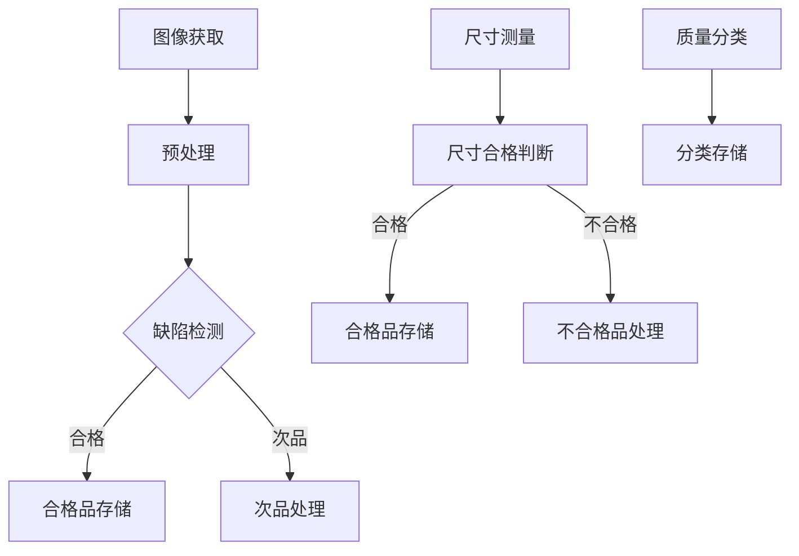

                 

# 计算机视觉在工业质量控制中的应用

## 摘要

本文将深入探讨计算机视觉在工业质量控制中的应用。随着工业自动化和智能制造的不断发展，计算机视觉技术以其高精度、高效能的特点，成为了工业质量控制中不可或缺的重要工具。本文将首先介绍计算机视觉的基本概念及其在工业领域的重要性，然后详细分析核心算法原理、数学模型及应用步骤，并通过实际项目实战案例进行代码解读与分析。最后，本文将探讨计算机视觉在实际应用场景中的具体表现，并推荐相关的学习资源、开发工具框架和相关论文著作。通过本文的阅读，读者将对计算机视觉在工业质量控制中的应用有更深入的理解。

## 1. 背景介绍

### 工业质量控制的重要性

工业质量控制是确保产品在制造过程中满足设计规格和性能要求的关键环节。它直接关系到产品的质量、可靠性、安全性和市场竞争力。传统上，工业质量控制依赖于人工检测，这种方式效率低、成本高，且容易受人为因素的影响，从而导致检测精度和稳定性难以保证。因此，随着工业自动化和智能制造的兴起，如何提高工业质量控制的效率和质量成为了研究的重要课题。

### 计算机视觉技术的崛起

计算机视觉技术是一种模拟人类视觉感知过程的科学技术，通过图像处理、模式识别和机器学习等技术，使计算机能够“看到”和理解周围的世界。随着计算机性能的提升和图像处理算法的优化，计算机视觉技术逐渐在各个领域得到广泛应用，特别是在工业质量控制领域。

计算机视觉技术在工业质量控制中的应用主要包括：缺陷检测、尺寸测量、质量分类等。通过使用计算机视觉技术，可以实现自动化的质量检测，提高检测速度和精度，减少人为干预，降低生产成本，从而提升整体生产效率。

### 计算机视觉在工业质量控制中的重要性

计算机视觉技术具有以下几方面的优势：

1. **高精度**：计算机视觉系统能够精确识别和定位产品缺陷，检测精度远高于人工检测。
2. **高效能**：计算机视觉系统可以实现24小时不间断检测，大大提高了生产效率。
3. **低成本**：随着技术的进步，计算机视觉系统的成本逐渐降低，使其在工业中的应用更加普及。
4. **可扩展性**：计算机视觉系统可以根据不同的需求进行定制化开发，适应多种工业质量控制场景。

因此，计算机视觉技术在工业质量控制中的应用具有重要意义，它不仅能够提升产品质量，还能推动工业生产的智能化和自动化。

### 本篇文章的结构

本文将分为以下几个部分：

1. **背景介绍**：阐述工业质量控制的重要性以及计算机视觉技术的崛起。
2. **核心概念与联系**：介绍计算机视觉的基本概念，并给出相关的 Mermaid 流程图。
3. **核心算法原理 & 具体操作步骤**：详细分析计算机视觉在工业质量控制中的核心算法原理和操作步骤。
4. **数学模型和公式 & 详细讲解 & 举例说明**：讲解相关的数学模型和公式，并提供具体的示例。
5. **项目实战：代码实际案例和详细解释说明**：通过实际项目案例进行代码解读与分析。
6. **实际应用场景**：探讨计算机视觉在工业质量控制中的具体应用。
7. **工具和资源推荐**：推荐相关的学习资源、开发工具框架和相关论文著作。
8. **总结：未来发展趋势与挑战**：总结计算机视觉在工业质量控制中的应用前景和面临的挑战。
9. **附录：常见问题与解答**：解答读者可能遇到的一些常见问题。
10. **扩展阅读 & 参考资料**：提供更多的参考资料，供读者深入阅读。

通过本文的阅读，读者将对计算机视觉在工业质量控制中的应用有更深入的理解，并能掌握相关的技术知识和实践方法。

## 2. 核心概念与联系

### 计算机视觉的基本概念

计算机视觉是一门研究如何使计算机“看懂”和理解图像的科学。它主要包括以下几个基本概念：

1. **图像处理**：图像处理是计算机视觉的基础，它涉及图像的获取、增强、分割、特征提取等操作。
2. **特征识别**：特征识别是计算机视觉的关键，通过提取图像中的特征，进行分类、识别和匹配。
3. **目标检测**：目标检测是在图像中定位并识别特定目标的位置和属性。
4. **语义分割**：语义分割是对图像中的每个像素进行分类，识别图像中的不同对象和背景。

### 计算机视觉与工业质量控制的关系

计算机视觉在工业质量控制中的应用主要基于以下关系：

1. **图像检测**：利用计算机视觉技术，对产品图像进行缺陷检测，识别并标记出产品表面的缺陷。
2. **尺寸测量**：通过计算机视觉系统，对产品尺寸进行精确测量，确保产品尺寸符合设计要求。
3. **质量分类**：基于图像特征，对产品进行质量分类，区分出合格品和次品。

### Mermaid 流程图

为了更好地理解计算机视觉在工业质量控制中的应用流程，我们使用 Mermaid 流程图进行展示：



### 流程图详细说明

1. **图像获取**：首先，通过相机或其他传感器获取产品图像。
2. **预处理**：对获取的图像进行预处理，包括去噪、增强、灰度化等操作。
3. **缺陷检测**：利用计算机视觉算法，对预处理后的图像进行缺陷检测，识别并标记出缺陷区域。
4. **尺寸测量**：对产品进行尺寸测量，确保产品尺寸符合设计要求。
5. **质量分类**：根据检测结果，对产品进行质量分类，区分出合格品和次品。

通过上述流程，计算机视觉技术能够实现自动化的工业质量控制，提高生产效率和产品质量。

## 3. 核心算法原理 & 具体操作步骤

### 边缘检测算法原理

边缘检测是计算机视觉中的一项重要技术，它通过检测图像中的边缘信息，提取图像的轮廓特征。边缘检测算法主要基于图像的局部特征变化，如灰度值的变化率、方向变化等。常用的边缘检测算法包括：

1. **Sobel算子**：Sobel算子是一种基于图像灰度值梯度的边缘检测算法。它通过对图像进行卷积操作，计算图像的水平和垂直方向上的梯度值，然后取两者最大值作为边缘强度。
2. **Canny算子**：Canny算子是一种更为先进的边缘检测算法，它通过多阶段滤波和阈值处理，有效地抑制噪声并提取边缘信息。

### 边缘检测算法具体操作步骤

1. **图像预处理**：对图像进行灰度化处理，去除颜色信息。
2. **Sobel算子卷积**：分别对图像进行水平和垂直方向的卷积操作，计算图像的水平和垂直方向上的梯度值。
3. **梯度幅值计算**：对水平和垂直方向上的梯度值进行平方和开方运算，得到图像的梯度幅值。
4. **非极大值抑制**：对梯度幅值进行非极大值抑制，保留局部最大值，去除非极大值点。
5. **双阈值处理**：设置高阈值和低阈值，对梯度幅值进行二值化处理，将边缘点标记为白色，非边缘点标记为黑色。
6. **图像输出**：将处理后的图像输出，显示边缘检测结果。

### 边缘检测算法实例

以 Python 编程语言为例，使用 OpenCV 库实现边缘检测算法：

```python
import cv2

# 读取图像
image = cv2.imread('image.jpg')

# 图像预处理
gray_image = cv2.cvtColor(image, cv2.COLOR_BGR2GRAY)

# Sobel算子卷积
sobel_x = cv2.Sobel(gray_image, cv2.CV_64F, 1, 0, ksize=3)
sobel_y = cv2.Sobel(gray_image, cv2.CV_64F, 0, 1, ksize=3)

# 梯度幅值计算
sobel_mag = cv2.sqrt(sobel_x ** 2 + sobel_y ** 2)

# 非极大值抑制
sobel_mag[sobel_mag < sobel_mag.max() * 0.1] = 0
sobel_mag[sobel_mag > sobel_mag.max() * 0.8] = 255

# 双阈值处理
_, edges = cv2.threshold(sobel_mag, 0, 255, cv2.THRESH_BINARY_INV + cv2.THRESH_OTSU)

# 图像输出
cv2.imshow('Edges', edges)
cv2.waitKey(0)
cv2.destroyAllWindows()
```

### 实际应用场景

边缘检测算法在工业质量控制中有着广泛的应用，例如：

1. **产品缺陷检测**：通过检测产品表面的边缘信息，识别产品缺陷，如裂缝、缺口等。
2. **尺寸测量**：利用边缘检测算法，对产品进行轮廓提取，从而测量产品的尺寸和形状。

通过上述算法原理和具体操作步骤，读者可以更好地理解边缘检测算法在工业质量控制中的应用。

## 4. 数学模型和公式 & 详细讲解 & 举例说明

### 图像处理中的基本数学模型

在计算机视觉中，图像处理是一个重要的环节，其中涉及到多种数学模型和公式。以下将介绍一些基本的数学模型和公式，以及如何应用于图像处理。

### 1. 卷积操作

卷积是图像处理中最常用的操作之一。卷积操作的基本思想是将一个卷积核（滤波器）与图像进行卷积，从而生成新的图像。卷积操作的数学公式如下：

\[ (f * g)(x, y) = \sum_{i=-\infty}^{\infty} \sum_{j=-\infty}^{\infty} f(i, j) \cdot g(x-i, y-j) \]

其中，\( f \) 和 \( g \) 分别表示原始图像和卷积核，\( (x, y) \) 表示图像上的一个点。

#### 卷积操作在图像滤波中的应用

卷积操作常用于图像滤波，以去除噪声或增强图像特征。以下是一个简单的低通滤波器示例：

\[ g(x, y) = \frac{1}{4\pi^2} \cdot \frac{1}{(x^2 + y^2)} \]

使用这个滤波器对图像进行卷积，可以实现去除高频噪声的效果。

### 2. 离散余弦变换（DCT）

离散余弦变换（Discrete Cosine Transform，DCT）是图像压缩中常用的一种变换方法。DCT的基本思想是将图像从空间域转换到频率域，从而实现图像数据的压缩。

DCT的数学公式如下：

\[ F(u, v) = \sum_{x=0}^{N-1} \sum_{y=0}^{N-1} f(x, y) \cdot C(u, v) \]

其中，\( F(u, v) \) 表示变换后的图像，\( f(x, y) \) 表示原始图像，\( C(u, v) \) 表示DCT系数。

#### DCT在图像压缩中的应用

通过DCT，可以将图像分解为不同的频率分量，从而实现图像的压缩。通常，高频分量对视觉感知的影响较小，可以舍弃或进行量化处理，从而减少图像数据的存储空间。

### 3. 主成分分析（PCA）

主成分分析（Principal Component Analysis，PCA）是一种降维技术，通过将数据投影到新的正交基上，从而减少数据的维度。

PCA的数学公式如下：

\[ \hat{X} = \sum_{i=1}^{k} \lambda_i \cdot v_i \]

其中，\( \hat{X} \) 表示降维后的数据，\( \lambda_i \) 表示特征值，\( v_i \) 表示特征向量。

#### PCA在图像降维中的应用

通过PCA，可以从图像数据中提取出主要特征，从而实现图像的降维。这在图像压缩和特征提取中有着重要的应用。

### 例子说明

以下使用Python实现一个简单的DCT和PCA示例：

```python
import numpy as np
from scipy.fftpack import dct, idct

# 初始化图像数据
image = np.random.rand(8, 8)

# DCT变换
dct_image = dct(dct(image.T, norm='ortho').T, norm='ortho')

# PCA降维
cov_matrix = np.cov(image)
eigenvalues, eigenvectors = np.linalg.eigh(cov_matrix)
k = 2
降维_image = np.dot(eigenvalues[:k], eigenvectors[:, :k])

# IDCT反变换
idct_image = idct(idct(降维_image.T, norm='ortho').T, norm='ortho')

# 输出结果
print("原始图像：", image)
print("DCT变换后：", dct_image)
print("PCA降维后：", 降维_image)
print("IDCT反变换后：", idct_image)
```

通过上述例子，读者可以更好地理解DCT和PCA在图像处理中的应用。

## 5. 项目实战：代码实际案例和详细解释说明

### 开发环境搭建

在进行项目实战之前，首先需要搭建相应的开发环境。以下是使用 Python 编写计算机视觉应用所需的基本环境搭建步骤：

1. **安装 Python**：确保已安装 Python 3.6 或更高版本。
2. **安装必要的库**：使用 pip 命令安装以下库：
   ```bash
   pip install numpy opencv-python pillow scikit-image
   ```
3. **验证环境**：运行以下 Python 代码，验证是否已成功安装所需库：

   ```python
   import cv2
   import numpy as np
   print(cv2.__version__)
   print(np.__version__)
   ```

   如果输出版本号，说明环境搭建成功。

### 源代码详细实现和代码解读

以下是一个简单的计算机视觉项目，用于检测产品图像中的缺陷。

```python
import cv2
import numpy as np

def detect_defects(image_path):
    # 读取图像
    image = cv2.imread(image_path, cv2.IMREAD_GRAYSCALE)

    # Sobel算子进行边缘检测
    sobel_x = cv2.Sobel(image, cv2.CV_64F, 1, 0, ksize=3)
    sobel_y = cv2.Sobel(image, cv2.CV_64F, 0, 1, ksize=3)
    sobel_mag = cv2.sqrt(sobel_x ** 2 + sobel_y ** 2)

    # 非极大值抑制
    sobel_mag[sobel_mag < sobel_mag.max() * 0.1] = 0
    sobel_mag[sobel_mag > sobel_mag.max() * 0.8] = 255

    # 二值化处理
    _, edges = cv2.threshold(sobel_mag, 0, 255, cv2.THRESH_BINARY_INV + cv2.THRESH_OTSU)

    # 轮廓检测
    contours, _ = cv2.findContours(edges, cv2.RETR_EXTERNAL, cv2.CHAIN_APPROX_SIMPLE)

    # 绘制轮廓
    for contour in contours:
        cv2.drawContours(image, contour, -1, (0, 0, 255), 2)

    # 显示结果
    cv2.imshow('Defects Detection', image)
    cv2.waitKey(0)
    cv2.destroyAllWindows()

# 测试
detect_defects('defects.jpg')
```

### 代码解读与分析

1. **图像读取**：使用 `cv2.imread` 函数读取灰度图像，参数 `cv2.IMREAD_GRAYSCALE` 表示以灰度模式读取图像。

2. **边缘检测**：使用 Sobel 算子进行边缘检测。Sobel 算子计算图像在水平和垂直方向上的梯度值，然后计算梯度幅值。

3. **非极大值抑制**：对梯度幅值进行非极大值抑制，去除非极大值点，保留局部最大值。

4. **二值化处理**：使用 Otsu 双阈值处理，将边缘点标记为白色，非边缘点标记为黑色。

5. **轮廓检测**：使用 `cv2.findContours` 函数检测图像中的轮廓。

6. **绘制轮廓**：使用 `cv2.drawContours` 函数绘制轮廓，参数 `(0, 0, 255)` 表示轮廓的颜色。

7. **显示结果**：使用 `cv2.imshow` 函数显示检测结果，`cv2.waitKey(0)` 等待按键，`cv2.destroyAllWindows()` 关闭窗口。

通过上述代码，读者可以了解如何使用 Python 和 OpenCV 库进行计算机视觉项目的基本开发。在实际应用中，可以根据具体需求对代码进行定制化开发。

## 6. 实际应用场景

### 缺陷检测

在工业质量控制中，产品缺陷检测是最常见也是最关键的应用场景之一。通过计算机视觉技术，可以对产品进行高精度、自动化的缺陷检测。以下是一些典型的应用案例：

1. **电子产品**：在电子产品制造过程中，计算机视觉系统可以检测芯片、电路板等部件的微小缺陷，如裂纹、划痕、短路等。
2. **汽车制造**：在汽车制造过程中，计算机视觉技术可以检测车身外壳、轮胎、刹车片等部件的缺陷，确保产品质量和安全性。
3. **食品工业**：在食品加工和包装过程中，计算机视觉系统可以检测食品表面的瑕疵、变形或异物，确保食品安全和质量。

### 尺寸测量

精确的尺寸测量对于确保产品质量具有重要意义。计算机视觉技术可以通过图像处理和模式识别算法，对产品进行高精度的尺寸测量。以下是一些应用案例：

1. **机械制造**：在机械制造过程中，计算机视觉系统可以对零部件的尺寸进行测量，如长度、宽度、高度等。
2. **电子制造**：在电子制造过程中，计算机视觉系统可以测量电路板、芯片等产品的尺寸，确保产品符合设计要求。
3. **建筑材料**：在建筑材料生产过程中，计算机视觉系统可以测量砖块、石板等材料的尺寸，确保建筑材料的质量和规格。

### 质量分类

通过对产品进行图像处理和特征提取，计算机视觉系统可以将产品分类为合格品和次品。以下是一些应用案例：

1. **制药工业**：在制药工业中，计算机视觉系统可以对药品进行质量分类，确保药品的纯度和活性。
2. **纺织工业**：在纺织工业中，计算机视觉系统可以检测织物表面的瑕疵、颜色变化等，将不合格品从合格品中分离出来。
3. **电子工业**：在电子工业中，计算机视觉系统可以检测电子元件的尺寸、形状等特征，将不合格品从合格品中分离出来。

### 工业流水线自动化

计算机视觉技术还可以与工业流水线自动化系统结合，实现生产线的自动化监控和管理。以下是一些应用案例：

1. **汽车生产线**：在汽车生产线上，计算机视觉系统可以对每个工序进行监控，确保产品质量和进度。
2. **电子生产线**：在电子生产线上，计算机视觉系统可以对每个工序进行质量检测，确保产品符合设计要求。
3. **食品生产线**：在食品生产线上，计算机视觉系统可以监控食品的加工过程，确保食品的安全和质量。

通过上述实际应用场景，可以看出计算机视觉技术在工业质量控制中具有广泛的应用前景。它不仅提高了生产效率和产品质量，还为工业生产的智能化和自动化奠定了基础。

## 7. 工具和资源推荐

### 学习资源推荐

1. **书籍**：
   - 《计算机视觉：算法与应用》（Computer Vision: Algorithms and Applications），作者：Richard Szeliski。
   - 《数字图像处理》（Digital Image Processing），作者：Gonzalez & Woods。

2. **在线课程**：
   - Coursera 上的“计算机视觉与图像处理”（Computer Vision and Image Processing）。
   - Udacity 上的“计算机视觉工程师纳米学位”（Computer Vision Engineer Nanodegree）。

3. **论文**：
   - “Deep Learning for Object Detection: A Comprehensive Review”（深度学习在目标检测中的应用：全面回顾）。
   - “Learning to See by Seeing: An Introduction to Convolutional Neural Networks”（通过观察学习：卷积神经网络简介）。

### 开发工具框架推荐

1. **OpenCV**：OpenCV 是一个广泛使用的开源计算机视觉库，提供了丰富的图像处理和模式识别算法。
2. **TensorFlow**：TensorFlow 是 Google 开发的一个开源深度学习框架，适用于计算机视觉任务，如目标检测、图像分类等。
3. **PyTorch**：PyTorch 是一个流行的深度学习框架，提供了灵活的动态计算图，适用于计算机视觉研究。

### 相关论文著作推荐

1. **论文**：
   - “You Only Look Once: Unified, Real-Time Object Detection”（YOLO：统一、实时目标检测）。
   - “Faster R-CNN: Towards Real-Time Object Detection with Region Proposal Networks”（Faster R-CNN：基于区域建议网络的目标检测新方法）。

2. **著作**：
   - 《深度学习：卷 I：基础》（Deep Learning, Volume I: Foundations），作者：Ian Goodfellow、Yoshua Bengio 和 Aaron Courville。
   - 《深度学习：卷 II：应用》（Deep Learning, Volume II: Applications），作者：Ian Goodfellow、Yoshua Bengio 和 Aaron Courville。

通过这些学习和资源推荐，读者可以深入了解计算机视觉在工业质量控制中的应用，并掌握相关的技术知识和实践方法。

## 8. 总结：未来发展趋势与挑战

### 发展趋势

随着计算机性能的提升和算法的进步，计算机视觉技术在工业质量控制中的应用前景广阔。以下是几个主要发展趋势：

1. **智能化**：通过深度学习和人工智能技术，计算机视觉系统将能够更加智能地理解和处理复杂场景，提高检测精度和效率。
2. **实时性**：随着硬件性能的提升，计算机视觉系统将能够实现更高的实时性，满足工业生产中快速响应的需求。
3. **多模态融合**：结合多种传感器数据，如红外、激光、超声波等，实现多模态融合，提高检测的准确性和全面性。
4. **自适应性与可扩展性**：计算机视觉系统将具备更强的自适应性和可扩展性，能够根据不同的应用场景进行灵活调整和定制。

### 挑战

尽管计算机视觉技术在工业质量控制中具有巨大潜力，但同时也面临一些挑战：

1. **数据质量问题**：高质量的训练数据是计算机视觉系统性能的关键。然而，获取高质量、多样化的训练数据仍然是一个难题。
2. **环境光照与噪声**：工业环境中的光照变化和噪声对计算机视觉系统的稳定性提出了挑战。如何提高系统在复杂环境下的鲁棒性是一个重要课题。
3. **实时处理能力**：在高速生产线中，如何提高计算机视觉系统的处理速度，实现实时检测和响应，是一个重要的技术挑战。
4. **安全与隐私**：在工业生产过程中，如何保护数据安全和用户隐私，确保系统的安全性，是一个需要关注的问题。

### 未来方向

为了应对上述挑战，未来计算机视觉技术在工业质量控制中的发展方向包括：

1. **大数据与人工智能结合**：通过大数据分析和人工智能技术，提高系统的智能化水平，实现更准确的检测和分类。
2. **多模态融合与增强现实**：结合多种传感器数据和增强现实技术，提高系统的感知能力和灵活性。
3. **轻量级算法与硬件优化**：研究轻量级算法和优化硬件架构，提高系统的实时处理能力和能效。
4. **标准化与开源生态**：推动计算机视觉技术的标准化和开源生态建设，促进技术的普及和应用。

通过不断的技术创新和优化，计算机视觉技术在工业质量控制中的应用前景将更加广阔，有望成为推动工业智能化和自动化的重要力量。

## 9. 附录：常见问题与解答

### Q1：计算机视觉在工业质量控制中的主要应用有哪些？

A1：计算机视觉在工业质量控制中的应用主要包括缺陷检测、尺寸测量、质量分类等。通过计算机视觉技术，可以实现产品的高精度、自动化检测，提高生产效率和产品质量。

### Q2：如何处理工业环境中的光照变化和噪声问题？

A2：处理光照变化和噪声问题，可以从以下几方面入手：

1. **图像预处理**：对图像进行预处理，如灰度化、滤波等，减少光照和噪声对图像质量的影响。
2. **数据增强**：通过数据增强技术，增加训练数据的多样性和鲁棒性，提高模型在复杂环境下的泛化能力。
3. **深度学习算法**：使用深度学习算法，特别是卷积神经网络（CNN），可以提高系统在复杂光照和噪声环境下的检测能力。

### Q3：如何评估计算机视觉系统的检测精度？

A3：评估计算机视觉系统的检测精度，通常采用以下指标：

1. **准确率（Accuracy）**：检测正确的样本数与总样本数之比。
2. **召回率（Recall）**：检测正确的样本数与实际包含缺陷的样本数之比。
3. **精确率（Precision）**：检测正确的样本数与检测出的样本数之比。
4. **F1 值（F1 Score）**：综合准确率和召回率的指标，计算公式为 \( F1 = 2 \times \frac{Precision \times Recall}{Precision + Recall} \)。

通过这些指标，可以全面评估计算机视觉系统的检测性能。

### Q4：如何优化计算机视觉系统的实时性？

A4：优化计算机视觉系统的实时性，可以从以下几个方面进行：

1. **算法优化**：选择高效算法，如卷积神经网络（CNN）中的轻量级网络，减少计算复杂度。
2. **硬件加速**：使用 GPU 或专用硬件加速器，提高图像处理的计算速度。
3. **多线程与并行处理**：利用多线程和并行处理技术，提高系统的并发处理能力。
4. **模型压缩与量化**：通过模型压缩和量化技术，减小模型体积，提高推理速度。

### Q5：如何保证计算机视觉系统的数据安全和用户隐私？

A5：保证计算机视觉系统的数据安全和用户隐私，需要从以下几方面进行：

1. **数据加密**：对敏感数据进行加密处理，防止数据泄露。
2. **权限管理**：建立严格的权限管理机制，确保只有授权人员能够访问数据。
3. **隐私保护算法**：使用隐私保护算法，如差分隐私（Differential Privacy），保护用户隐私。
4. **数据备份与恢复**：定期进行数据备份，确保数据不会因意外情况丢失。

通过上述措施，可以有效保障计算机视觉系统的数据安全和用户隐私。

## 10. 扩展阅读 & 参考资料

为了进一步深入了解计算机视觉在工业质量控制中的应用，以下推荐一些高质量的扩展阅读和参考资料：

### 书籍

1. **《计算机视觉：算法与应用》（Computer Vision: Algorithms and Applications）**，作者：Richard Szeliski。这本书详细介绍了计算机视觉的基本概念、算法和应用，是计算机视觉领域的经典教材。
2. **《深度学习：卷 I：基础》（Deep Learning, Volume I: Foundations）**，作者：Ian Goodfellow、Yoshua Bengio 和 Aaron Courville。这本书是深度学习领域的权威著作，涵盖了深度学习的基础理论和应用方法。

### 论文

1. **“Deep Learning for Object Detection: A Comprehensive Review”**，作者：Kaiming He、Gaoyan Huang 和 Philip S. Torr。这篇论文全面回顾了深度学习在目标检测领域的最新进展和应用。
2. **“You Only Look Once: Unified, Real-Time Object Detection”**，作者：Joseph Redmon、Siah Kirk Shetty、Rodney Girshick 和 Shervin Moshiri。这篇论文介绍了 YOLO 算法，是一种快速、高效的实时目标检测方法。

### 在线课程

1. **Coursera 上的“计算机视觉与图像处理”（Computer Vision and Image Processing）”**，由斯坦福大学提供。这门课程详细介绍了计算机视觉的基础知识和图像处理技术。
2. **Udacity 上的“计算机视觉工程师纳米学位”（Computer Vision Engineer Nanodegree）**，提供了深度学习、目标检测等领域的实践项目和课程。

通过阅读这些扩展资料，读者可以进一步深化对计算机视觉在工业质量控制中的应用理解，为实际项目开发提供有力的支持。

