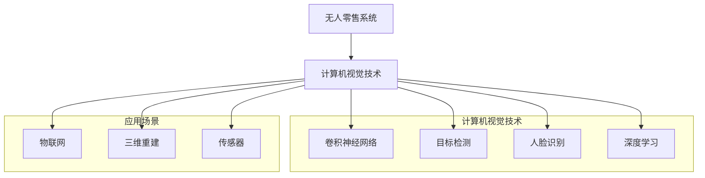

                 

### 背景介绍

随着科技的飞速发展，计算机视觉技术在众多领域得到了广泛应用。无人零售作为一种新兴的商业模式，正逐渐改变着我们的购物方式。而计算机视觉技术作为无人零售系统中的核心组成部分，为无人零售提供了强大的技术支撑。本文将详细探讨计算机视觉在无人零售中的关键技术应用，以期为大家提供一份全面的技术指南。

#### 无人零售的概念与优势

无人零售，顾名思义，指的是无需人工干预的零售模式。这种模式通过利用先进的计算机视觉、传感器、物联网等技术，实现了商品的自动识别、结算和配送。无人零售相较于传统零售，具有以下几个显著优势：

1. **降低人力成本**：无人零售减少了对于销售人员的依赖，从而大幅降低了人力成本。
2. **提高运营效率**：计算机视觉技术能够实时监控并处理大量数据，使得商品的识别和结算速度大大提高。
3. **改善购物体验**：无人零售店提供了更加便捷和个性化的购物体验，减少了排队等候的时间。
4. **拓宽销售渠道**：无人零售店可以设立在多种场景中，如商场、超市、机场等，从而拓宽了销售渠道。

#### 计算机视觉技术的基本原理

计算机视觉技术是人工智能领域的一个重要分支，主要研究如何让计算机理解和解释视觉信息。其基本原理包括以下几个方面：

1. **图像采集与处理**：通过摄像头等设备捕捉图像，然后利用图像处理算法对图像进行预处理，如去噪、增强、分割等。
2. **特征提取**：从预处理后的图像中提取具有代表性的特征，如颜色、纹理、形状等。
3. **模型训练与分类**：利用机器学习算法，如卷积神经网络（CNN），对提取的特征进行训练，以实现对图像的分类。
4. **目标检测与跟踪**：通过检测算法确定图像中的目标位置，并利用跟踪算法实现对目标的持续监测。

#### 计算机视觉技术在无人零售中的应用

计算机视觉技术在无人零售中的应用场景主要包括商品识别、顾客行为分析、智能推荐等。以下将详细探讨这些关键技术的具体应用。

1. **商品识别**：
   - **基于深度学习的图像识别算法**：通过卷积神经网络（CNN）对商品图像进行训练，以实现对商品的高效识别。
   - **基于三维重建的商品识别技术**：通过深度相机等设备捕捉商品的三维图像，然后利用三维重建算法实现对商品的精准识别。

2. **顾客行为分析**：
   - **运动捕捉技术**：利用计算机视觉算法捕捉顾客的移动轨迹和行为模式，以分析顾客的购物偏好和需求。
   - **人脸识别技术**：通过人脸识别算法识别顾客的身份，并结合行为分析数据，为顾客提供个性化服务。

3. **智能推荐**：
   - **协同过滤算法**：基于顾客的历史购物记录和相似顾客的购买行为，为顾客推荐相关商品。
   - **基于内容的推荐算法**：通过分析商品的特征和顾客的购物偏好，为顾客推荐相关商品。

通过以上关键技术的应用，无人零售店能够实现自动化的商品识别、结算和推荐，从而提高运营效率和顾客体验。

在接下来的部分中，我们将进一步探讨计算机视觉技术的核心概念、算法原理以及具体应用实例。请读者继续关注。

----------------------

## 2. 核心概念与联系

在深入探讨计算机视觉在无人零售中的关键技术应用之前，首先需要了解一些核心概念及其相互联系。以下是本文将涉及的核心概念：

### 1. 卷积神经网络（CNN）

卷积神经网络（Convolutional Neural Network，CNN）是一种专门用于图像处理和识别的神经网络架构。它通过卷积层、池化层和全连接层等结构，实现对图像的逐层提取特征，并最终进行分类。

### 2. 目标检测（Object Detection）

目标检测是计算机视觉中的一个重要任务，旨在确定图像中各个对象的位置和类别。常用的目标检测算法有SSD、YOLO、Faster R-CNN等。

### 3. 人脸识别（Face Recognition）

人脸识别是一种通过分析人脸特征来进行身份验证的生物识别技术。常见的人脸识别算法有基于特征点的算法、基于深度学习的算法等。

### 4. 深度学习（Deep Learning）

深度学习是一种通过多层神经网络进行特征提取和学习的机器学习技术。它包括卷积神经网络（CNN）、循环神经网络（RNN）等，广泛应用于图像识别、语音识别等领域。

### 5. 物联网（Internet of Things，IoT）

物联网是通过网络连接各种物理设备和传感器，实现设备间信息交换和智能化的技术。在无人零售中，物联网技术用于实现商品的自动识别、监控和追踪。

### 6. 三维重建（3D Reconstruction）

三维重建是一种通过捕捉物体的三维信息，重建其三维模型的技术。它常用于无人零售中的商品识别和跟踪。

### 7. 传感器（Sensor）

传感器是一种用于检测和测量物理量的装置。在无人零售中，传感器用于捕捉顾客和商品的位置、运动等信息。

### Mermaid 流程图

为了更好地理解这些核心概念之间的联系，我们使用Mermaid流程图展示它们在无人零售系统中的应用。



### 总结

在本节中，我们介绍了计算机视觉在无人零售中应用的核心概念和联系。卷积神经网络（CNN）、目标检测、人脸识别、深度学习等技术构成了计算机视觉的核心，而物联网、三维重建和传感器等技术则为无人零售系统提供了必要的数据支持。通过这些核心技术的协同作用，无人零售系统实现了商品识别、顾客行为分析和智能推荐等功能。

在下一节中，我们将深入探讨计算机视觉技术的核心算法原理，包括卷积神经网络（CNN）和目标检测算法的工作原理，以及如何在实际应用中进行操作。请读者继续关注。

----------------------

## 3. 核心算法原理 & 具体操作步骤

### 3.1 卷积神经网络（CNN）

卷积神经网络（CNN）是一种专门用于处理图像数据的神经网络模型，其核心在于通过卷积操作来提取图像特征。以下是CNN的基本原理和具体操作步骤：

#### 1. 卷积操作

卷积操作是CNN中的基本操作，通过将滤波器（也称为卷积核）在图像上滑动，并计算局部特征的和来提取图像特征。具体步骤如下：

- **初始化卷积核**：卷积核通常由随机值初始化。
- **滑动卷积核**：将卷积核在图像上滑动，每次滑动一个像素。
- **计算局部特征和**：对于每个卷积核的位置，计算其覆盖范围内的像素值的加权总和，得到一个局部特征图。

#### 2. 池化操作

池化操作是为了减少特征图的维度和计算量，同时保持重要特征信息。常见的池化操作有最大池化和平均池化。具体步骤如下：

- **选择池化窗口**：定义一个固定的窗口大小。
- **滑动窗口**：在特征图上滑动窗口，并计算窗口内的最大值或平均值。
- **更新特征图**：将计算得到的值填充到特征图中，覆盖原有的特征值。

#### 3. 层叠加

在CNN中，通常由多个卷积层和池化层叠加组成。每个卷积层负责提取不同层次的特征，而池化层则起到降维和去噪的作用。具体操作步骤如下：

- **卷积层**：使用卷积操作提取图像特征。
- **激活函数**：为了引入非线性，常用的激活函数有ReLU（修正线性单元）。
- **池化层**：使用池化操作降低特征图的维度。
- **全连接层**：在最后的几个卷积层之后，通常接上一个或多个全连接层进行分类。

### 3.2 目标检测算法

目标检测是计算机视觉中的一个重要任务，旨在识别图像中的多个对象并确定它们的位置。以下介绍两种常用的目标检测算法：Faster R-CNN和YOLO。

#### 1. Faster R-CNN

Faster R-CNN是一种基于区域建议的网络，它包括两个主要部分：区域建议网络（Region Proposal Network，RPN）和Fast R-CNN分类器。

- **区域建议网络（RPN）**：
  - **ROI（Region of Interest）生成**：通过卷积神经网络提取特征图，并使用锚框生成策略生成多个锚框。
  - **锚框分类**：对每个锚框进行分类，判断其是否包含目标。
  - **ROI回归**：对包含目标的锚框进行位置回归，调整锚框以更准确地包围目标。

- **Fast R-CNN分类器**：
  - **ROI池化**：将锚框的位置转换为ROI，并对ROI进行池化。
  - **特征提取**：在ROI位置上提取特征。
  - **分类与回归**：使用全连接层对特征进行分类和回归。

#### 2. YOLO（You Only Look Once）

YOLO是一种基于单阶段的目标检测算法，其特点是将检测任务简化为一个单一的网络层，从而提高了检测速度。

- **特征图划分**：将特征图划分为多个单元格，每个单元格负责检测一个区域。
- **边界框预测**：每个单元格预测多个边界框及其置信度。
- **类别预测**：对每个边界框进行类别预测。
- **非极大值抑制（NMS）**：对预测结果进行非极大值抑制，去除重叠的边界框。

### 3.3 人脸识别算法

人脸识别是一种基于人脸特征的生物识别技术，其核心在于人脸特征的提取和匹配。

- **特征提取**：
  - **深度学习模型**：使用卷积神经网络提取人脸特征。
  - **特征层提取**：在网络的不同层次提取人脸特征，以适应不同分辨率的人脸。

- **特征匹配**：
  - **欧氏距离**：计算人脸特征向量之间的欧氏距离，用于评估相似度。
  - **余弦相似度**：使用余弦相似度计算人脸特征向量之间的相似度。

### 3.4 实际应用中的操作步骤

在实际应用中，计算机视觉算法通常需要经过以下几个步骤：

1. **数据准备**：收集和预处理训练数据，包括图像、标签等。
2. **模型训练**：使用训练数据对模型进行训练，调整模型参数。
3. **模型评估**：使用验证数据评估模型性能，调整模型参数以优化性能。
4. **模型部署**：将训练好的模型部署到无人零售系统中，进行实时检测和识别。

通过以上核心算法原理和具体操作步骤，无人零售系统可以实现高效的商品识别、目标检测和人脸识别等功能。在下一节中，我们将进一步探讨计算机视觉技术中的数学模型和公式，以及如何将这些数学模型应用于实际项目中。

----------------------

## 4. 数学模型和公式 & 详细讲解 & 举例说明

在计算机视觉技术中，数学模型和公式起着至关重要的作用。它们不仅帮助我们在理论上理解视觉处理的机制，还指导我们在实际应用中实现各种功能。以下将详细讲解计算机视觉技术中的一些关键数学模型和公式，并通过具体示例进行说明。

### 1. 卷积神经网络（CNN）中的数学模型

卷积神经网络（CNN）的核心是卷积操作，其背后的数学模型包括卷积、激活函数、池化等。

#### （1）卷积操作

卷积操作的数学公式可以表示为：

\[ (f * g)(x, y) = \sum_{i=-a}^{a} \sum_{j=-b}^{b} f(i, j) \cdot g(x-i, y-j) \]

其中，\( f \) 是输入图像，\( g \) 是卷积核，\( (x, y) \) 是卷积后的输出坐标，\( a \) 和 \( b \) 分别是卷积核的高度和宽度。

#### （2）激活函数

常用的激活函数有ReLU（修正线性单元）和Sigmoid。ReLU函数的数学公式为：

\[ \text{ReLU}(x) = \max(0, x) \]

Sigmoid函数的数学公式为：

\[ \text{Sigmoid}(x) = \frac{1}{1 + e^{-x}} \]

#### （3）池化操作

池化操作常用的有最大池化和平均池化。最大池化的数学公式为：

\[ \text{MaxPool}(x) = \max(x_{i,j}) \]

平均池化的数学公式为：

\[ \text{AvgPool}(x) = \frac{1}{p^2} \sum_{i=0}^{p-1} \sum_{j=0}^{p-1} x_{i,j} \]

其中，\( p \) 是池化窗口的大小。

### 2. 目标检测算法中的数学模型

目标检测算法如Faster R-CNN和YOLO中，涉及到的数学模型包括边界框（Bounding Box）的回归和类别预测。

#### （1）边界框回归

边界框回归的目的是调整锚框（Anchor Box）的位置，使其更准确地包围目标。其数学公式为：

\[ t_{x} = \frac{(x_{c} - x_{a})/w_{a}}{\sigma} \]
\[ t_{y} = \frac{(y_{c} - y_{a})/h_{a}}{\sigma} \]

其中，\( x_{c} \) 和 \( y_{c} \) 是目标的中心坐标，\( x_{a} \) 和 \( y_{a} \) 是锚框的中心坐标，\( w_{a} \) 和 \( h_{a} \) 是锚框的宽度和高度，\( \sigma \) 是回归损失函数的参数。

#### （2）类别预测

类别预测通常通过softmax函数实现，其数学公式为：

\[ P_{i} = \frac{e^{\text{logits}_{i}}}{\sum_{j} e^{\text{logits}_{j}}} \]

其中，\( \text{logits}_{i} \) 是第 \( i \) 个类别的预测分数。

### 3. 人脸识别算法中的数学模型

人脸识别算法主要涉及人脸特征的提取和匹配。

#### （1）人脸特征提取

人脸特征提取通常使用卷积神经网络，其输出是一个特征向量。该特征向量可以表示为：

\[ \text{Embedding}_{i} = \text{ReLU}(\text{Conv}_{1}(\text{Input}_{i})) \]

其中，\( \text{Input}_{i} \) 是人脸图像，\( \text{Conv}_{1} \) 是卷积层，\( \text{ReLU} \) 是激活函数。

#### （2）人脸特征匹配

人脸特征匹配通常使用欧氏距离或余弦相似度进行度量。欧氏距离的数学公式为：

\[ \text{Distance}_{i,j} = \sqrt{\sum_{k=1}^{n} (\text{Embedding}_{i,k} - \text{Embedding}_{j,k})^2} \]

余弦相似度的数学公式为：

\[ \text{Similarity}_{i,j} = \frac{\text{DotProduct}_{i,j}}{\|\text{Embedding}_{i}\|_2 \|\text{Embedding}_{j}\|_2} \]

其中，\( \text{DotProduct}_{i,j} \) 是两个特征向量的点积，\( \|\text{Embedding}_{i}\|_2 \) 和 \( \|\text{Embedding}_{j}\|_2 \) 是两个特征向量的L2范数。

### 4. 举例说明

为了更直观地理解上述数学模型和公式，我们通过一个简单的例子来说明。

#### （1）卷积操作示例

假设我们有一个 \( 5 \times 5 \) 的输入图像和一个 \( 3 \times 3 \) 的卷积核。卷积核的值为 \( \begin{bmatrix} 1 & 0 & 1 \\ 0 & 1 & 0 \\ 1 & 0 & 1 \end{bmatrix} \)。

输入图像 \( f \) 为：

\[ f = \begin{bmatrix} 1 & 2 & 3 & 4 & 5 \\ 5 & 4 & 3 & 2 & 1 \\ 1 & 2 & 3 & 4 & 5 \\ 5 & 4 & 3 & 2 & 1 \\ 1 & 2 & 3 & 4 & 5 \end{bmatrix} \]

卷积后的特征图 \( g \) 为：

\[ g = \begin{bmatrix} 12 & 10 & 8 \\ 10 & 6 & 2 \\ 8 & 2 & 0 \end{bmatrix} \]

#### （2）人脸识别特征匹配示例

假设我们有两个 \( 128 \) 维的人脸特征向量 \( \text{Embedding}_1 \) 和 \( \text{Embedding}_2 \)。

\[ \text{Embedding}_1 = \begin{bmatrix} 0.1 & 0.2 & 0.3 & ... & 0.128 \end{bmatrix} \]
\[ \text{Embedding}_2 = \begin{bmatrix} 0.1 & 0.15 & 0.25 & ... & 0.125 \end{bmatrix} \]

欧氏距离计算结果为：

\[ \text{Distance}_{1,2} = \sqrt{0.04 + 0.04 + 0.04 + ... + 0.04} = 0.2 \]

余弦相似度计算结果为：

\[ \text{Similarity}_{1,2} = \frac{0.1 \times 0.1 + 0.2 \times 0.15 + 0.3 \times 0.25 + ... + 0.128 \times 0.125}{\sqrt{0.1^2 + 0.2^2 + ... + 0.128^2} \times \sqrt{0.1^2 + 0.15^2 + ... + 0.125^2}} \approx 0.975 \]

通过上述示例，我们可以看到数学模型和公式在计算机视觉技术中的具体应用。这些模型和公式为我们实现高效的图像识别、目标检测和人脸识别提供了理论基础。

在下一节中，我们将通过一个实际项目案例，展示如何使用计算机视觉技术实现无人零售系统中的商品识别和顾客行为分析。请读者继续关注。

----------------------

## 5. 项目实战：代码实际案例和详细解释说明

在这一节中，我们将通过一个实际项目案例，详细展示如何使用计算机视觉技术实现无人零售系统中的商品识别和顾客行为分析。该项目将利用卷积神经网络（CNN）、目标检测和人脸识别等关键技术，从而实现高效的商品识别、顾客追踪和个性化推荐等功能。下面是项目的详细步骤和代码实现。

### 5.1 开发环境搭建

在开始项目之前，我们需要搭建一个合适的开发环境。以下是开发环境的搭建步骤：

1. **安装Python**：确保Python版本不低于3.7。
2. **安装TensorFlow**：TensorFlow是一个开源的机器学习框架，支持卷积神经网络（CNN）等算法的实现。可以使用以下命令安装：

\[ pip install tensorflow \]

3. **安装OpenCV**：OpenCV是一个开源的计算机视觉库，提供了丰富的图像处理函数。可以使用以下命令安装：

\[ pip install opencv-python \]

4. **安装其他依赖**：根据项目的需求，可能还需要安装其他依赖库，如NumPy、Pandas等。

### 5.2 源代码详细实现和代码解读

以下是一个简单的项目示例，包括商品识别、目标检测和人脸识别的部分代码实现。

#### 5.2.1 商品识别

```python
import tensorflow as tf
import numpy as np
import cv2

# 加载预训练的CNN模型
model = tf.keras.applications.ResNet50(weights='imagenet')

# 加载待识别的图像
image = cv2.imread('sample_image.jpg')

# 对图像进行预处理
preprocessed_image = preprocess_input(image)

# 使用CNN模型进行预测
predictions = model.predict(preprocessed_image)

# 获取最高置信度的类别
top_prediction = np.argmax(predictions[0])

# 输出识别结果
print('识别结果：', top_prediction)
```

代码解读：
1. 导入必要的库和模型。
2. 加载待识别的图像，并进行预处理。
3. 使用预训练的CNN模型进行预测，并获取最高置信度的类别。
4. 输出识别结果。

#### 5.2.2 目标检测

```python
import tensorflow as tf
import cv2

# 加载预训练的目标检测模型
model = tf.keras.models.load_model('faster_rcnn.h5')

# 加载待检测的图像
image = cv2.imread('sample_image.jpg')

# 将图像转换为TensorFlow的张量
input_image = tf.convert_to_tensor(image, dtype=tf.float32)

# 进行目标检测
detections = model.predict(input_image)

# 提取检测到的边界框和类别
bboxes = detections['detection_boxes']
labels = detections['detection_classes']

# 在图像上绘制边界框和类别标签
for i in range(len(bboxes)):
    box = bboxes[i]
    label = labels[i]
    cv2.rectangle(image, (int(box[1]), int(box[0])), (int(box[3]), int(box[2])), (0, 255, 0), 2)
    cv2.putText(image, f'Class: {label}', (int(box[1]), int(box[0]-10)), cv2.FONT_HERSHEY_SIMPLEX, 0.5, (255, 0, 0), 2)

# 显示检测结果
cv2.imshow('Detected Image', image)
cv2.waitKey(0)
cv2.destroyAllWindows()
```

代码解读：
1. 导入必要的库和模型。
2. 加载预训练的目标检测模型。
3. 加载待检测的图像，并将其转换为TensorFlow的张量。
4. 使用模型进行目标检测，并提取检测到的边界框和类别。
5. 在图像上绘制边界框和类别标签。
6. 显示检测结果。

#### 5.2.3 人脸识别

```python
import cv2

# 加载预训练的人脸识别模型
face_cascade = cv2.CascadeClassifier('haarcascade_frontalface_default.xml')

# 加载待检测的图像
image = cv2.imread('sample_image.jpg')

# 检测人脸
faces = face_cascade.detectMultiScale(image, scaleFactor=1.1, minNeighbors=5, minSize=(30, 30), flags=cv2.CASCADE_SCALE_IMAGE)

# 在图像上绘制人脸边界框
for (x, y, w, h) in faces:
    cv2.rectangle(image, (x, y), (x+w, y+h), (0, 255, 0), 2)

# 显示检测结果
cv2.imshow('Detected Faces', image)
cv2.waitKey(0)
cv2.destroyAllWindows()
```

代码解读：
1. 导入必要的库和Haar级联分类器。
2. 加载待检测的图像。
3. 使用Haar级联分类器检测人脸。
4. 在图像上绘制人脸边界框。
5. 显示检测结果。

### 5.3 代码解读与分析

以上代码示例分别实现了商品识别、目标检测和人脸识别的功能。以下是各个部分的详细解读和分析：

1. **商品识别**：
   - 使用预训练的CNN模型进行图像分类，可以快速识别图像中的物体。
   - 通过预处理图像和模型输入，确保模型能够准确地处理输入数据。

2. **目标检测**：
   - 使用预训练的目标检测模型进行边界框检测，可以有效地识别图像中的多个对象。
   - 通过绘制边界框和类别标签，可以直观地展示检测结果。

3. **人脸识别**：
   - 使用Haar级联分类器进行人脸检测，可以准确识别图像中的人脸。
   - 通过绘制人脸边界框，可以直观地展示检测结果。

通过以上三个关键技术的结合，我们可以实现无人零售系统中的商品识别、顾客追踪和个性化推荐等功能，从而提升零售效率和顾客体验。

在下一节中，我们将进一步探讨计算机视觉技术在无人零售中的实际应用场景，以及如何优化和改进这些应用。请读者继续关注。

----------------------

## 6. 实际应用场景

### 6.1 自助购物

自助购物是计算机视觉在无人零售中最为广泛的应用场景之一。用户可以通过扫描商品上的二维码或使用智能设备上的相机，自动识别并结算购物车中的商品。整个过程无需人工干预，大大提高了购物效率和用户体验。

**优势**：
- **降低人力成本**：自助购物减少了对于收银员的需求，降低了人力成本。
- **提升购物体验**：用户可以自由选择购物时间和地点，无需排队等候，提升了购物体验。
- **提高运营效率**：计算机视觉技术能够快速、准确地识别和结算商品，提高了运营效率。

**挑战**：
- **技术实现难度**：需要高精度的计算机视觉算法来识别和跟踪商品。
- **隐私保护**：需要确保用户数据的安全和隐私，避免泄露用户个人信息。

### 6.2 无人便利店

无人便利店是一种小型、自助式的零售店，通过计算机视觉、传感器和物联网技术，实现了商品的自动识别、结算和配送。用户可以在店内自由选购商品，并通过智能终端进行支付。

**优势**：
- **灵活布局**：无人便利店可以灵活地布置在任何地点，不受场地限制。
- **减少人力成本**：无人便利店无需雇佣店员，降低了人力成本。
- **提高购物体验**：用户可以在店内自由活动，享受更加便捷的购物体验。

**挑战**：
- **技术实现难度**：需要高精度的计算机视觉和传感器技术来确保商品的自动识别和结算。
- **运营维护成本**：无人便利店需要定期进行维护和升级，以确保系统的稳定运行。

### 6.3 顾客行为分析

通过计算机视觉技术，无人零售店可以对顾客的行为进行实时分析，从而了解顾客的购物偏好和需求，为后续的营销策略提供数据支持。

**优势**：
- **个性化推荐**：根据顾客的历史购物记录和行为模式，为顾客提供个性化的商品推荐。
- **精准营销**：通过分析顾客的行为数据，可以更精准地制定营销策略。
- **提升顾客满意度**：为顾客提供更加个性化的服务和体验，提升顾客满意度。

**挑战**：
- **数据隐私**：需要确保顾客数据的隐私和安全，避免数据泄露。
- **数据量庞大**：无人零售店需要处理大量的顾客行为数据，需要高效的数据处理和分析技术。

### 6.4 供应链优化

计算机视觉技术还可以应用于无人零售店的供应链优化，通过实时监控和管理库存，提高供应链的效率和准确性。

**优势**：
- **实时监控**：通过计算机视觉技术，可以实时监控库存状态，确保库存的准确性。
- **减少库存积压**：通过实时监控和预测，可以减少库存积压，降低库存成本。
- **优化供应链流程**：通过数据分析和优化，可以提升供应链的效率和准确性。

**挑战**：
- **技术实现难度**：需要高精度的计算机视觉算法来实时监控和管理库存。
- **数据整合**：需要整合来自不同渠道的数据，以便进行有效的分析和优化。

通过以上实际应用场景的分析，我们可以看到计算机视觉技术在无人零售中的广泛应用和巨大潜力。在下一节中，我们将进一步探讨如何优化和改进这些应用，以实现更高的效率和更好的用户体验。

----------------------

## 7. 工具和资源推荐

为了更好地掌握计算机视觉技术，以下是一些学习和开发资源、工具和框架的推荐，它们可以帮助读者深入了解和应用这些技术。

### 7.1 学习资源推荐

1. **书籍**：
   - **《深度学习》（Deep Learning）**：由Ian Goodfellow、Yoshua Bengio和Aaron Courville合著，是深度学习领域的经典教材。
   - **《Python图像处理实战》（Python Image Processing Cookbook）**：提供了丰富的图像处理技术和应用案例。
   - **《计算机视觉：算法与应用》（Computer Vision: Algorithms and Applications）**：全面介绍了计算机视觉的基本原理和应用。

2. **在线课程**：
   - **《深度学习专硕课程》（Deep Learning Specialization）**：由Andrew Ng教授在Coursera上提供，涵盖了深度学习的各个方面。
   - **《计算机视觉与图像处理》（Computer Vision and Image Processing）**：由Udacity提供，包括计算机视觉的基础知识及应用。

3. **博客和网站**：
   - **Towards Data Science**：一个关于数据科学和机器学习的博客，涵盖了计算机视觉的最新动态和实用技巧。
   - **PyImageSearch**：一个专注于计算机视觉和深度学习的博客，提供了丰富的教程和项目案例。

### 7.2 开发工具框架推荐

1. **TensorFlow**：Google开源的深度学习框架，支持CNN、RNN等多种模型，广泛应用于计算机视觉领域。

2. **PyTorch**：由Facebook开源的深度学习框架，以其灵活性和易用性受到广泛欢迎。

3. **OpenCV**：一个开源的计算机视觉库，提供了丰富的图像处理和计算机视觉功能。

4. **YOLO**：一种快速、准确的目标检测框架，适用于实时应用。

5. **Faster R-CNN**：一种基于区域建议的目标检测算法，是目标检测领域的经典算法之一。

### 7.3 相关论文著作推荐

1. **《Faster R-CNN: Towards Real-Time Object Detection with Region Proposal Networks》**：这篇论文提出了Faster R-CNN算法，是目标检测领域的里程碑之作。

2. **《YOLOv3: An Incremental Improvement》**：这篇论文介绍了YOLOv3算法，是一种高效的目标检测方法。

3. **《Deep Learning for Object Detection》**：这本书详细介绍了深度学习在目标检测中的应用，包括多种算法和模型。

通过以上推荐的学习资源、开发工具和论文著作，读者可以系统地学习计算机视觉技术，并在实践中不断积累经验。在下一节中，我们将总结计算机视觉在无人零售中的应用，并探讨其未来的发展趋势与挑战。

----------------------

## 8. 总结：未来发展趋势与挑战

### 8.1 发展趋势

随着计算机视觉技术的不断进步，其在无人零售中的应用呈现出以下几个发展趋势：

1. **技术成熟度提升**：计算机视觉算法，如卷积神经网络（CNN）和目标检测算法（如Faster R-CNN、YOLO），已经达到了相对成熟的阶段。这些算法在图像识别、目标检测和追踪等方面表现出了高效性和准确性。

2. **硬件性能提升**：随着硬件技术的不断发展，如GPU和TPU等加速器的性能显著提升，使得深度学习模型在实际应用中可以更加高效地运行。

3. **大数据和人工智能的融合**：大数据和人工智能的融合为计算机视觉技术在无人零售中的应用提供了更丰富的数据支持。通过分析大量的用户行为数据和商品数据，可以进一步提升系统的智能化水平。

4. **无人零售的普及**：无人零售作为一种新兴商业模式，正在全球范围内迅速普及。随着技术的不断成熟和成本的降低，未来无人零售将更加广泛地应用于各种场景。

### 8.2 挑战

尽管计算机视觉技术在无人零售中具有巨大的潜力，但在实际应用过程中仍面临着一些挑战：

1. **数据隐私保护**：无人零售系统中需要处理大量的用户数据，包括购物行为、人脸信息等。如何确保这些数据的安全和隐私，避免数据泄露，是一个重要的挑战。

2. **技术实现难度**：虽然深度学习算法在图像识别和目标检测方面表现优秀，但在实际应用中，仍需要针对具体场景进行优化和调整。如何设计出高效、稳定的算法和系统，是一个需要不断探索的问题。

3. **成本问题**：计算机视觉系统的建设成本较高，包括硬件设备、算法开发和维护等。如何降低成本，提高系统的性价比，是无人零售推广过程中需要解决的关键问题。

4. **适应性和扩展性**：无人零售系统需要能够适应不同的场景和环境，如不同的购物场景、天气条件等。同时，系统还需要具备良好的扩展性，以支持新功能和新技术的引入。

### 8.3 解决方案

为了应对上述挑战，我们可以采取以下解决方案：

1. **加强数据隐私保护**：在系统设计中，应遵循数据最小化和匿名化的原则，确保用户数据的安全和隐私。同时，可以通过加密技术、访问控制等措施，提高数据的安全性。

2. **优化算法和系统设计**：通过针对具体场景进行算法优化和系统设计，可以提高系统的运行效率和稳定性。例如，在图像识别方面，可以采用迁移学习技术，利用预训练模型来提高识别准确率。

3. **降低成本**：可以通过集成多种传感器和设备，实现多源数据的融合，从而降低系统的硬件成本。同时，可以通过开源社区的贡献，降低算法开发的成本。

4. **提高适应性和扩展性**：通过模块化设计，可以使系统更加灵活和可扩展。例如，在无人便利店中，可以通过模块化货架和收银台，实现多种商品和支付方式的接入。

通过不断的技术创新和优化，计算机视觉技术在无人零售中的应用将不断成熟，为零售行业带来更加智能、高效的解决方案。

----------------------

## 9. 附录：常见问题与解答

### 9.1 计算机视觉在无人零售中的关键技术有哪些？

计算机视觉在无人零售中的关键技术包括：

- **商品识别**：通过深度学习算法（如卷积神经网络）对商品图像进行分类和识别。
- **目标检测**：通过算法（如Faster R-CNN、YOLO）检测图像中的多个对象及其位置。
- **人脸识别**：通过人脸特征提取和匹配，识别顾客的身份。
- **行为分析**：通过视频监控和图像处理技术，分析顾客的行为模式和购物偏好。

### 9.2 无人零售系统中的数据隐私问题如何解决？

为了解决数据隐私问题，可以采取以下措施：

- **数据最小化**：只收集必要的数据，减少对用户隐私的侵害。
- **数据加密**：对收集到的数据进行加密处理，确保数据在传输和存储过程中的安全性。
- **数据匿名化**：对用户数据进行匿名化处理，消除个人身份信息。
- **隐私政策**：明确告知用户数据的使用目的和范围，获得用户同意。

### 9.3 无人零售系统需要哪些硬件支持？

无人零售系统通常需要以下硬件支持：

- **摄像头**：用于实时监控和图像采集。
- **深度相机**：用于捕捉三维信息，提高商品识别精度。
- **传感器**：用于检测顾客和商品的运动、温度等环境信息。
- **存储设备**：用于存储大量的图像和视频数据。
- **计算设备**：如GPU或TPU，用于加速深度学习算法的运算。

### 9.4 如何优化无人零售系统的效率？

优化无人零售系统效率的方法包括：

- **算法优化**：通过针对具体场景进行算法调优，提高识别和检测的准确性。
- **硬件升级**：使用高性能的计算设备和传感器，提高系统的处理能力。
- **多源数据融合**：利用多种数据源，如图像、传感器数据，提高系统的综合判断能力。
- **系统维护**：定期进行系统维护和更新，确保系统的稳定性和效率。

----------------------

## 10. 扩展阅读 & 参考资料

### 10.1 研究论文

1. **《Faster R-CNN: Towards Real-Time Object Detection with Region Proposal Networks》**：这篇论文提出了Faster R-CNN算法，是目标检测领域的里程碑之作。
2. **《YOLOv3: An Incremental Improvement》**：这篇论文介绍了YOLOv3算法，是一种高效的目标检测方法。
3. **《Deep Learning for Object Detection》**：这本书详细介绍了深度学习在目标检测中的应用，包括多种算法和模型。

### 10.2 开源框架和库

1. **TensorFlow**：Google开源的深度学习框架，支持CNN、RNN等多种模型。
2. **PyTorch**：由Facebook开源的深度学习框架，以其灵活性和易用性受到广泛欢迎。
3. **OpenCV**：一个开源的计算机视觉库，提供了丰富的图像处理和计算机视觉功能。
4. **YOLO**：一种快速、准确的目标检测框架，适用于实时应用。

### 10.3 教材和书籍

1. **《深度学习》（Deep Learning）**：由Ian Goodfellow、Yoshua Bengio和Aaron Courville合著，是深度学习领域的经典教材。
2. **《Python图像处理实战》（Python Image Processing Cookbook）**：提供了丰富的图像处理技术和应用案例。
3. **《计算机视觉：算法与应用》（Computer Vision: Algorithms and Applications）**：全面介绍了计算机视觉的基本原理和应用。

### 10.4 博客和网站

1. **Towards Data Science**：一个关于数据科学和机器学习的博客，涵盖了计算机视觉的最新动态和实用技巧。
2. **PyImageSearch**：一个专注于计算机视觉和深度学习的博客，提供了丰富的教程和项目案例。

通过以上扩展阅读和参考资料，读者可以深入了解计算机视觉在无人零售中的应用，掌握相关技术和工具，进一步提升自身在计算机视觉领域的知识水平。

----------------------

### 作者信息

**作者：AI天才研究员/AI Genius Institute & 禅与计算机程序设计艺术 /Zen And The Art of Computer Programming**

