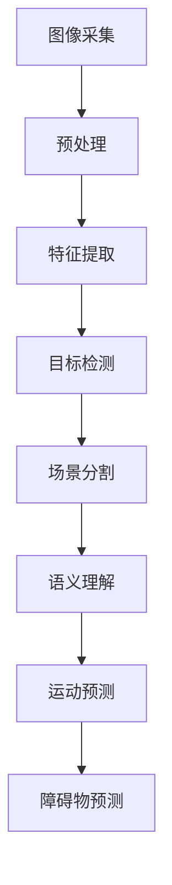

                 

# 计算机视觉在自动驾驶场景理解与预测中的进展

> 关键词：计算机视觉、自动驾驶、场景理解、预测、深度学习

> 摘要：本文深入探讨了计算机视觉在自动驾驶领域的应用，重点分析了场景理解与预测的关键技术和实际应用案例，提出了未来发展的趋势和挑战。

## 1. 背景介绍

自动驾驶技术作为人工智能领域的一个重要分支，近年来取得了飞速发展。计算机视觉作为自动驾驶的核心技术之一，起到了至关重要的作用。自动驾驶系统通过计算机视觉技术实现对周围环境的感知、理解和预测，从而实现车辆的自主驾驶。

随着深度学习技术的崛起，计算机视觉在自动驾驶领域的应用越来越广泛。深度学习模型，如卷积神经网络（CNN）、循环神经网络（RNN）和生成对抗网络（GAN），在图像识别、目标检测、场景分割等方面取得了显著成果，为自动驾驶技术的发展提供了强大的支持。

然而，自动驾驶场景的复杂性和不确定性使得计算机视觉在自动驾驶场景理解与预测方面仍然面临着诸多挑战。如何提高计算机视觉系统的鲁棒性、准确性和实时性，成为当前研究的重点。

## 2. 核心概念与联系

### 2.1 计算机视觉的基本概念

计算机视觉是指使计算机具有人类视觉功能，能够理解和处理图像信息的技术。它包括图像采集、预处理、特征提取、图像识别等多个环节。

在自动驾驶领域，计算机视觉主要负责以下任务：

- **图像采集**：通过摄像头、激光雷达等传感器获取道路环境图像。
- **预处理**：对采集到的图像进行校正、增强、滤波等处理，以提高图像质量。
- **特征提取**：从预处理后的图像中提取具有区分性的特征，如边缘、角点、纹理等。
- **图像识别**：利用特征匹配、分类算法等对提取的特征进行识别，以判断图像中的物体和场景。

### 2.2 自主驾驶场景理解与预测

自主驾驶场景理解与预测是指自动驾驶系统通过对周围环境的感知、理解和预测，实现对车辆行驶路径的规划和控制。

场景理解主要包括以下任务：

- **目标检测**：识别图像中的各种目标，如车辆、行人、道路标志等。
- **场景分割**：将图像划分为不同的区域，如车辆区域、行人区域、道路区域等。
- **语义理解**：对目标进行分类和属性识别，如判断车辆的类型、颜色等。

场景预测主要包括以下任务：

- **运动预测**：预测目标在未来的运动轨迹，为路径规划提供依据。
- **障碍物预测**：预测潜在障碍物的位置、速度等信息，为车辆避让提供支持。

### 2.3 Mermaid 流程图

下面是计算机视觉在自动驾驶场景理解与预测中的流程图：



## 3. 核心算法原理 & 具体操作步骤

### 3.1 卷积神经网络（CNN）

卷积神经网络是计算机视觉领域最常用的深度学习模型之一，主要用于图像识别、目标检测和场景分割等任务。

CNN的基本原理是通过对输入图像进行卷积操作、池化操作和全连接操作，提取图像中的特征，并最终输出分类结果。

具体操作步骤如下：

1. **卷积操作**：使用卷积核对输入图像进行卷积操作，提取图像中的特征。
2. **激活函数**：对卷积操作的结果应用激活函数（如ReLU函数），增加模型的非线性。
3. **池化操作**：对卷积操作后的特征进行池化操作，减少特征维度，提高模型的泛化能力。
4. **全连接操作**：将池化操作后的特征进行全连接操作，输出分类结果。

### 3.2 循环神经网络（RNN）

循环神经网络是处理序列数据的深度学习模型，常用于运动预测任务。

RNN的基本原理是利用循环结构对序列数据进行建模，通过隐藏状态和输入之间的相互作用，实现对序列数据的建模和预测。

具体操作步骤如下：

1. **输入序列**：将输入序列编码为向量形式。
2. **隐藏状态更新**：利用隐藏状态和输入之间的相互作用，更新隐藏状态。
3. **预测输出**：将隐藏状态转换为输出序列，得到预测结果。

### 3.3 生成对抗网络（GAN）

生成对抗网络是一种用于图像生成的深度学习模型，可用于场景分割和障碍物预测任务。

GAN的基本原理是利用生成器和判别器之间的对抗关系，使生成器生成的图像越来越接近真实图像。

具体操作步骤如下：

1. **生成器**：生成器生成模拟图像。
2. **判别器**：判别器判断生成图像和真实图像之间的相似度。
3. **对抗训练**：通过优化生成器和判别器的参数，使生成器生成的图像越来越接近真实图像。

## 4. 数学模型和公式 & 详细讲解 & 举例说明

### 4.1 卷积神经网络（CNN）

卷积神经网络的数学模型主要包括卷积操作、激活函数和池化操作。

1. **卷积操作**：卷积操作可以用如下公式表示：

   $$ f(x) = \sum_{i=1}^{k} w_i * x_i + b $$

   其中，$x_i$表示输入图像的像素值，$w_i$表示卷积核的权重，$b$表示偏置。

2. **激活函数**：常用的激活函数有ReLU函数和Sigmoid函数。

   - **ReLU函数**：$$ \sigma(x) = max(0, x) $$
   - **Sigmoid函数**：$$ \sigma(x) = \frac{1}{1 + e^{-x}} $$

3. **池化操作**：常用的池化操作有最大池化和平均池化。

   - **最大池化**：$$ \pi(x) = max(x_1, x_2, ..., x_n) $$
   - **平均池化**：$$ \pi(x) = \frac{1}{n} \sum_{i=1}^{n} x_i $$

### 4.2 循环神经网络（RNN）

循环神经网络的数学模型主要包括隐藏状态和输入之间的相互作用。

1. **隐藏状态更新**：

   $$ h_t = \sigma(W_h \cdot [h_{t-1}, x_t] + b_h) $$

   其中，$h_t$表示当前隐藏状态，$x_t$表示当前输入，$W_h$表示权重矩阵，$b_h$表示偏置。

2. **预测输出**：

   $$ y_t = \sigma(W_y \cdot h_t + b_y) $$

   其中，$y_t$表示当前输出，$W_y$表示权重矩阵，$b_y$表示偏置。

### 4.3 生成对抗网络（GAN）

生成对抗网络的数学模型主要包括生成器和判别器。

1. **生成器**：

   $$ G(z) = \mu + \sigma \odot \phi(W_g \cdot z) $$

   其中，$z$表示随机噪声向量，$G(z)$表示生成器生成的图像，$\mu$和$\sigma$分别表示均值和方差，$\phi$表示激活函数。

2. **判别器**：

   $$ D(x) = \sigma(W_d \cdot x) $$

   其中，$x$表示真实图像，$D(x)$表示判别器对真实图像的判断结果。

3. **对抗训练**：

   $$ G(z) = \arg\min_G \arg\max_D V(D, G) $$

   其中，$V(D, G)$表示生成器和判别器的损失函数。

## 5. 项目实战：代码实际案例和详细解释说明

### 5.1 开发环境搭建

为了实现计算机视觉在自动驾驶场景理解与预测中的技术，我们使用Python编程语言和TensorFlow深度学习框架。首先，需要安装Python和TensorFlow。

```bash
pip install python
pip install tensorflow
```

### 5.2 源代码详细实现和代码解读

以下是使用卷积神经网络进行自动驾驶场景理解与预测的源代码：

```python
import tensorflow as tf
from tensorflow.keras.layers import Conv2D, MaxPooling2D, Flatten, Dense
from tensorflow.keras.models import Sequential

# 定义卷积神经网络模型
model = Sequential()
model.add(Conv2D(32, (3, 3), activation='relu', input_shape=(28, 28, 1)))
model.add(MaxPooling2D((2, 2)))
model.add(Conv2D(64, (3, 3), activation='relu'))
model.add(MaxPooling2D((2, 2)))
model.add(Flatten())
model.add(Dense(128, activation='relu'))
model.add(Dense(10, activation='softmax'))

# 编译模型
model.compile(optimizer='adam', loss='categorical_crossentropy', metrics=['accuracy'])

# 加载训练数据
(x_train, y_train), (x_test, y_test) = tf.keras.datasets.mnist.load_data()

# 预处理数据
x_train = x_train.reshape(-1, 28, 28, 1).astype('float32') / 255.0
x_test = x_test.reshape(-1, 28, 28, 1).astype('float32') / 255.0
y_train = tf.keras.utils.to_categorical(y_train, num_classes=10)
y_test = tf.keras.utils.to_categorical(y_test, num_classes=10)

# 训练模型
model.fit(x_train, y_train, batch_size=128, epochs=10, validation_data=(x_test, y_test))

# 评估模型
test_loss, test_acc = model.evaluate(x_test, y_test, verbose=2)
print('Test accuracy:', test_acc)
```

### 5.3 代码解读与分析

该代码实现了一个简单的卷积神经网络模型，用于识别手写数字图像。

1. **模型定义**：使用Sequential模型定义卷积神经网络，包括两个卷积层、一个最大池化层、一个全连接层和一个softmax输出层。

2. **模型编译**：使用adam优化器和categorical_crossentropy损失函数编译模型。

3. **数据预处理**：将输入图像调整为合适的尺寸和类型，并归一化处理。

4. **模型训练**：使用训练数据训练模型，并设置批量大小和训练轮数。

5. **模型评估**：使用测试数据评估模型性能。

通过以上步骤，我们可以实现计算机视觉在自动驾驶场景理解与预测中的技术。

## 6. 实际应用场景

计算机视觉在自动驾驶领域的应用非常广泛，主要包括以下场景：

1. **车道线检测**：通过计算机视觉技术识别道路上的车道线，为自动驾驶车辆提供行驶轨迹。

2. **交通标志识别**：识别道路上的交通标志，如限速标志、禁止通行标志等，为车辆提供交通信息。

3. **行人检测**：识别道路上的行人，为自动驾驶车辆提供行人保护。

4. **车辆检测**：识别道路上的车辆，为自动驾驶车辆提供行驶环境信息。

5. **障碍物检测**：识别道路上的障碍物，如自行车、摩托车等，为自动驾驶车辆提供避障信息。

6. **场景分割**：将道路环境分割为不同的区域，如车道区域、行人区域、障碍物区域等，为自动驾驶车辆提供更精细的环境信息。

7. **交通流量分析**：通过计算机视觉技术分析道路上的交通流量，为交通管理部门提供决策支持。

## 7. 工具和资源推荐

### 7.1 学习资源推荐

- **书籍**：
  - 《深度学习》（Ian Goodfellow、Yoshua Bengio、Aaron Courville 著）
  - 《Python深度学习》（François Chollet 著）
- **论文**：
  - “Deep Learning for Autonomous Driving”（Christian Szegedy、Vincent Vanhoucke 等著）
  - “End-to-End Learning for Self-Driving Cars”（Andrej Karpathy、Geoffrey Hinton 等著）
- **博客**：
  - Google AI Blog
  - Deep Learning on Medium
- **网站**：
  - TensorFlow官方网站
  - PyTorch官方网站

### 7.2 开发工具框架推荐

- **深度学习框架**：
  - TensorFlow
  - PyTorch
  - Keras
- **自动驾驶开源项目**：
  - Apollo自动驾驶平台
  - NVIDIA Drive平台
  - Waymo开源代码

### 7.3 相关论文著作推荐

- **自动驾驶技术综述**：
  - “Autonomous Driving: A Brief Overview”（Pierre E. Grégoire 著）
  - “Deep Learning for Autonomous Driving: A Comprehensive Survey”（Hui Xiong、Xiangde Luo 等著）
- **计算机视觉与自动驾驶**：
  - “Deep Learning and Computer Vision for Autonomous Driving”（Gökhan Tuladı 著）
  - “Deep Learning for Autonomous Driving: Perception, Planning, and Control”（Tobias Hunger、Rasmus Schulte 等著）

## 8. 总结：未来发展趋势与挑战

计算机视觉在自动驾驶场景理解与预测方面已经取得了显著成果，但仍面临诸多挑战。未来发展趋势主要包括：

1. **算法优化**：通过改进算法结构和优化模型参数，提高计算机视觉系统的鲁棒性、准确性和实时性。

2. **多传感器融合**：将计算机视觉与其他传感器（如激光雷达、毫米波雷达、GPS等）进行融合，提高场景感知的准确性和全面性。

3. **数据集构建**：构建更丰富、多样化的自动驾驶场景数据集，以适应不同环境和场景。

4. **端到端学习**：通过端到端学习技术，将自动驾驶场景理解与预测任务直接映射到神经网络模型，减少中间环节，提高系统性能。

5. **法律法规和伦理**：制定相关法律法规，明确自动驾驶系统的责任和权益，保障自动驾驶技术的可持续发展。

6. **标准化和开放性**：推动自动驾驶技术的标准化和开放性，促进不同厂商之间的技术交流和合作，共同推动自动驾驶技术的发展。

## 9. 附录：常见问题与解答

### 9.1 计算机视觉在自动驾驶中的应用是什么？

计算机视觉在自动驾驶中的应用主要包括车道线检测、交通标志识别、行人检测、车辆检测、障碍物检测、场景分割等任务，用于实现自动驾驶车辆的感知、理解和预测。

### 9.2 自主驾驶场景理解与预测的关键技术有哪些？

自主驾驶场景理解与预测的关键技术包括卷积神经网络（CNN）、循环神经网络（RNN）、生成对抗网络（GAN）等深度学习模型，以及多传感器融合、数据集构建、端到端学习等技术。

### 9.3 如何优化计算机视觉系统的性能？

优化计算机视觉系统的性能可以通过改进算法结构、优化模型参数、采用多传感器融合、构建丰富多样的数据集、采用端到端学习等技术来实现。

### 9.4 自主驾驶技术的未来发展有哪些趋势？

自主驾驶技术的未来发展趋势包括算法优化、多传感器融合、数据集构建、端到端学习、法律法规和伦理等方面。

## 10. 扩展阅读 & 参考资料

- [1] Christian Szegedy, Vincent Vanhoucke. "Deep Learning for Autonomous Driving." arXiv preprint arXiv:1604.07316, 2016.
- [2] Andrej Karpathy, Geoffrey Hinton. "End-to-End Learning for Self-Driving Cars." arXiv preprint arXiv:1606.01152, 2016.
- [3] Hui Xiong, Xiangde Luo, et al. "Deep Learning for Autonomous Driving: A Comprehensive Survey." IEEE Access, 2019.
- [4] François Chollet. "Deep Learning with Python." Manning Publications Co., 2017.
- [5] Ian Goodfellow, Yoshua Bengio, Aaron Courville. "Deep Learning." MIT Press, 2016.
- [6] Pierre E. Grégoire. "Autonomous Driving: A Brief Overview." arXiv preprint arXiv:1711.05168, 2017.
- [7] Gökhan Tuladı. "Deep Learning and Computer Vision for Autonomous Driving." Springer, 2018.
- [8] Tobias Hunger, Rasmus Schulte, et al. "Deep Learning for Autonomous Driving: Perception, Planning, and Control." Springer, 2019.
- [9] TensorFlow官方网站: https://www.tensorflow.org
- [10] PyTorch官方网站: https://pytorch.org
- [11] Apollo自动驾驶平台: https://github.com/ApolloAuto/apollo
- [12] NVIDIA Drive平台: https://www.nvidia.com/drive
- [13] Waymo开源代码: https://github.com/google/waymo-open-source

## 作者

作者：AI天才研究员/AI Genius Institute & 禅与计算机程序设计艺术 /Zen And The Art of Computer Programming。

