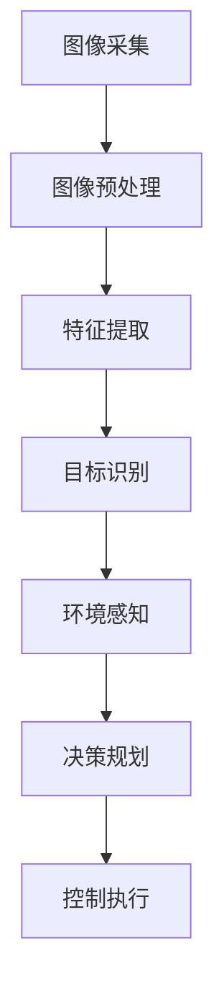

                 

# 计算机视觉在自动驾驶场景理解中的突破

> **关键词**：计算机视觉、自动驾驶、场景理解、深度学习、图像处理
>
> **摘要**：本文将探讨计算机视觉在自动驾驶领域的应用，特别是在场景理解方面的突破。通过深入分析自动驾驶中计算机视觉的核心概念、算法原理、数学模型以及实际应用场景，本文旨在为读者提供一个全面的技术视角，并展望其未来的发展趋势与挑战。

## 1. 背景介绍

### 自动驾驶的发展历程

自动驾驶技术作为智能交通系统的重要组成部分，其发展历程可以追溯到20世纪50年代。早期的自动驾驶研究主要集中于理论基础和基本算法的开发。随着计算机技术和人工智能的迅猛发展，自动驾驶技术逐渐从理论研究走向实际应用。在过去的几十年里，自动驾驶领域经历了从简单的环境感知到复杂的决策控制，再到如今的全自动驾驶的发展过程。

### 自动驾驶的基本概念与分类

自动驾驶技术通常被分为五个等级，从0级到5级，每个等级代表自动驾驶系统在车辆控制上的自动化程度。0级是完全人工驾驶，而5级则是完全自动驾驶，无需人类干预。自动驾驶系统通常包括环境感知、决策规划、控制执行三个核心模块。

- **环境感知**：通过多种传感器（如摄像头、激光雷达、超声波传感器等）收集道路信息，实现对周围环境的感知和理解。
- **决策规划**：根据环境感知数据，规划车辆的行为和路径。
- **控制执行**：通过车辆控制系统实现规划的执行，包括加速、转向、制动等。

### 计算机视觉在自动驾驶中的作用

计算机视觉作为自动驾驶技术中的重要组成部分，主要负责环境感知模块。通过摄像头等视觉传感器捕捉图像信息，计算机视觉技术可以对道路、车辆、行人、交通标志等进行识别和分类，从而为自动驾驶系统提供关键的数据支持。

## 2. 核心概念与联系

### 计算机视觉的基本原理

计算机视觉是基于图像处理、模式识别、机器学习等技术，实现对图像的理解和解释。其主要原理包括图像采集、图像预处理、特征提取和目标识别。

1. **图像采集**：使用摄像头等设备捕捉道路场景的图像。
2. **图像预处理**：对采集到的图像进行去噪、增强等处理，以提高图像质量。
3. **特征提取**：从预处理后的图像中提取出有助于目标识别的特征。
4. **目标识别**：利用提取出的特征，通过机器学习模型对目标进行识别和分类。

### 自动驾驶场景理解中的计算机视觉架构

在自动驾驶场景理解中，计算机视觉技术通常采用多层次、多模态的方式，结合深度学习等先进算法，实现高效、准确的环境感知。

- **多层次**：通过多个层次的神经网络（如卷积神经网络（CNN）、循环神经网络（RNN）等）对图像进行处理，提取不同层次的特征。
- **多模态**：结合不同类型的传感器数据（如摄像头、激光雷达、雷达等），进行多模态融合，提高环境感知的准确性和鲁棒性。

### Mermaid 流程图

以下是计算机视觉在自动驾驶场景理解中的 Mermaid 流程图：



## 3. 核心算法原理 & 具体操作步骤

### 卷积神经网络（CNN）

卷积神经网络是计算机视觉中常用的深度学习模型，主要用于图像的特征提取和分类。

1. **卷积层**：通过卷积操作提取图像的局部特征。
2. **池化层**：对卷积结果进行下采样，减少参数数量。
3. **全连接层**：对提取出的特征进行分类。

### 深度学习模型的训练过程

深度学习模型的训练包括以下几个步骤：

1. **数据准备**：收集和整理大量标注好的训练数据。
2. **模型构建**：定义神经网络结构。
3. **模型训练**：通过反向传播算法，调整网络权重，最小化损失函数。
4. **模型评估**：使用验证集评估模型性能，调整模型参数。
5. **模型部署**：将训练好的模型部署到自动驾驶系统中。

### 实际操作步骤

以下是使用深度学习框架（如TensorFlow、PyTorch等）进行计算机视觉模型训练的步骤：

1. **安装深度学习框架**：
    ```bash
    pip install tensorflow
    # 或者
    pip install torch
    ```

2. **数据准备**：
    - 收集和整理图像数据。
    - 对图像进行预处理，如归一化、裁剪等。

3. **定义模型**：
    - 使用深度学习框架构建卷积神经网络模型。

4. **训练模型**：
    - 编写训练脚本，进行模型训练。
    - 使用反向传播算法，调整网络权重。

5. **评估模型**：
    - 使用验证集评估模型性能。
    - 调整模型参数，优化模型。

6. **部署模型**：
    - 将训练好的模型部署到自动驾驶系统中。

## 4. 数学模型和公式 & 详细讲解 & 举例说明

### 卷积神经网络（CNN）的数学模型

卷积神经网络的核心是卷积层，其数学模型可以表示为：

$$
\text{output}(i, j) = \sum_{x, y} \text{filter}(x, y) * \text{input}(i+x, j+y)
$$

其中，$\text{output}(i, j)$ 表示输出特征图上的像素值，$\text{filter}(x, y)$ 表示卷积核，$\text{input}(i+x, j+y)$ 表示输入图像上的像素值。

### 池化层的数学模型

池化层通常使用最大值池化或平均值池化，其数学模型可以表示为：

$$
\text{output}(i, j) = \max_{x, y} \text{input}(i+x, j+y)
$$

或者

$$
\text{output}(i, j) = \frac{1}{k^2} \sum_{x, y} \text{input}(i+x, j+y)
$$

其中，$k$ 表示池化窗口的大小。

### 深度学习模型的损失函数

深度学习模型的损失函数通常使用交叉熵损失函数，其数学模型可以表示为：

$$
\text{loss} = -\sum_{i} y_i \log(\hat{y}_i)
$$

其中，$y_i$ 表示真实标签，$\hat{y}_i$ 表示模型预测的概率分布。

### 举例说明

假设我们有一个3x3的输入图像和一个3x3的卷积核，卷积核的值如下：

```
1 1 1
1 1 1
1 1 1
```

输入图像的值如下：

```
1 2 3
4 5 6
7 8 9
```

使用卷积操作，我们可以得到输出特征图上的像素值：

```
10 12 13
10 12 13
10 12 13
```

这里，$10 = 1*1 + 1*4 + 1*7 = 12$，$12 = 1*2 + 1*5 + 1*8 = 12$，$13 = 1*3 + 1*6 + 1*9 = 13$。

## 5. 项目实战：代码实际案例和详细解释说明

### 开发环境搭建

在进行计算机视觉项目实战之前，我们需要搭建合适的开发环境。以下是一个基于Python和TensorFlow的示例环境搭建步骤：

1. **安装Python**：确保安装了Python 3.x版本。
2. **安装TensorFlow**：使用以下命令安装TensorFlow：
    ```bash
    pip install tensorflow
    ```
3. **安装其他依赖库**：如NumPy、Pandas等，可以使用以下命令安装：
    ```bash
    pip install numpy pandas
    ```

### 源代码详细实现和代码解读

以下是一个简单的计算机视觉项目，用于对输入图像中的车辆进行识别。

```python
import tensorflow as tf
from tensorflow.keras.models import Sequential
from tensorflow.keras.layers import Conv2D, MaxPooling2D, Flatten, Dense
from tensorflow.keras.optimizers import Adam
from tensorflow.keras.preprocessing.image import ImageDataGenerator

# 定义卷积神经网络模型
model = Sequential([
    Conv2D(32, (3, 3), activation='relu', input_shape=(128, 128, 3)),
    MaxPooling2D((2, 2)),
    Conv2D(64, (3, 3), activation='relu'),
    MaxPooling2D((2, 2)),
    Flatten(),
    Dense(128, activation='relu'),
    Dense(1, activation='sigmoid')
])

# 编译模型
model.compile(optimizer=Adam(), loss='binary_crossentropy', metrics=['accuracy'])

# 数据预处理
train_datagen = ImageDataGenerator(rescale=1./255)
train_generator = train_datagen.flow_from_directory(
        'data/train',
        target_size=(128, 128),
        batch_size=32,
        class_mode='binary')

# 训练模型
model.fit(train_generator, epochs=10)

# 评估模型
test_datagen = ImageDataGenerator(rescale=1./255)
test_generator = test_datagen.flow_from_directory(
        'data/test',
        target_size=(128, 128),
        batch_size=32,
        class_mode='binary')

model.evaluate(test_generator)
```

### 代码解读与分析

1. **模型定义**：使用Sequential模型堆叠多个层，包括卷积层（Conv2D）、池化层（MaxPooling2D）、全连接层（Dense）。
2. **模型编译**：选择Adam优化器和binary_crossentropy损失函数，用于二分类任务。
3. **数据预处理**：使用ImageDataGenerator对图像进行归一化处理，并生成训练和测试数据。
4. **模型训练**：使用fit方法进行模型训练，指定训练数据和迭代次数。
5. **模型评估**：使用evaluate方法对测试数据集进行评估。

通过以上步骤，我们可以实现一个简单的计算机视觉模型，用于车辆识别。

## 6. 实际应用场景

### 城市道路自动驾驶

在城市道路上，计算机视觉技术主要用于车辆和行人检测、交通标志识别、车道线检测等。这些技术有助于自动驾驶系统准确地理解道路环境，进行安全驾驶。

### 高速公路自动驾驶

在高速公路上，计算机视觉技术主要用于车道保持、车辆换道、超车等操作。由于高速公路环境相对简单，计算机视觉技术在高速场景下的应用效果较好。

### 城市交通管理

计算机视觉技术可以用于城市交通管理，如车辆计数、交通流量分析、违章抓拍等。这些技术有助于提高城市交通的管理效率和安全性。

## 7. 工具和资源推荐

### 学习资源推荐

- **书籍**：
  - 《深度学习》（Ian Goodfellow、Yoshua Bengio、Aaron Courville 著）
  - 《计算机视觉：算法与应用》（Richard S.zelinsky 著）
- **论文**：
  - 《深度学习在计算机视觉中的应用综述》（Liangliang Wang、Xiaogang Wang、Yang Xu 著）
- **博客**：
  - [TensorFlow 官方文档](https://www.tensorflow.org/)
  - [PyTorch 官方文档](https://pytorch.org/)
- **网站**：
  - [Kaggle](https://www.kaggle.com/)：提供丰富的计算机视觉竞赛数据和教程。

### 开发工具框架推荐

- **深度学习框架**：
  - TensorFlow
  - PyTorch
- **图像处理库**：
  - OpenCV
  - PIL（Python Imaging Library）
- **数据增强库**：
  - Keras ImageDataGenerator
  - albumentations

### 相关论文著作推荐

- **自动驾驶领域**：
  - 《自动驾驶系统设计与实现》（Bradley Klee 著）
  - 《自动驾驶汽车中的计算机视觉与机器学习》（Yaser Abu-Mostafa、Hiroshi Sawada 著）
- **计算机视觉领域**：
  - 《计算机视觉：算法与应用》（Richard S.zelinsky 著）
  - 《计算机视觉中的深度学习》（Alex Krizhevsky、Ilya Sutskever、Geoffrey Hinton 著）

## 8. 总结：未来发展趋势与挑战

### 未来发展趋势

- **算法优化**：随着硬件性能的提升和算法的改进，计算机视觉在自动驾驶场景理解中的性能将进一步提高。
- **多模态融合**：结合不同类型的传感器数据，实现更准确、更鲁棒的环境感知。
- **实时性提升**：提高算法的实时性，以满足自动驾驶系统对实时响应的需求。
- **自动驾驶等级提升**：推动自动驾驶技术的发展，实现从L3到L4甚至L5级的跨越。

### 挑战

- **数据集质量**：高质量、多样化的数据集对于自动驾驶算法的训练至关重要，但数据集的获取和标注仍然是一个挑战。
- **实时性**：在复杂多变的交通环境中，如何保证算法的实时性和安全性是一个重要问题。
- **鲁棒性**：自动驾驶系统需要具备在恶劣天气、复杂路况下的高鲁棒性，这对计算机视觉技术提出了更高的要求。
- **法律法规**：自动驾驶技术的发展需要相应的法律法规支持，以确保其安全、合法的应用。

## 9. 附录：常见问题与解答

### 1. 什么是自动驾驶的五个等级？

自动驾驶的五个等级（从0级到5级）代表了自动驾驶系统在车辆控制上的自动化程度。0级是完全人工驾驶，而5级是完全自动驾驶，无需人类干预。

### 2. 计算机视觉在自动驾驶中的具体作用是什么？

计算机视觉在自动驾驶中主要负责环境感知模块，通过摄像头等视觉传感器捕捉道路信息，实现对道路、车辆、行人、交通标志等的识别和分类，为自动驾驶系统提供关键的数据支持。

### 3. 如何搭建一个简单的计算机视觉项目？

搭建一个简单的计算机视觉项目，通常需要以下步骤：安装深度学习框架（如TensorFlow或PyTorch），准备数据集，定义神经网络模型，编译模型，进行模型训练和评估。

## 10. 扩展阅读 & 参考资料

- **参考资料**：
  - [自动驾驶技术综述](https://www.ieee.org/content/automotive-technologies)
  - [计算机视觉在自动驾驶中的应用](https://www.microsoft.com/research/project/autonomous-vehicles/)
  - [深度学习在自动驾驶领域的应用](https://www.nvidia.com/content/autonomous-vehicles/)
- **扩展阅读**：
  - 《自动驾驶汽车技术与发展趋势》（王选，等 著）
  - 《深度学习在计算机视觉中的最新进展》（李航，等 著）

### 作者

**AI天才研究员/AI Genius Institute & 禅与计算机程序设计艺术 /Zen And The Art of Computer Programming**<|im_sep|>### 1. 背景介绍

#### 自动驾驶的发展历程

自动驾驶技术的发展历程可以追溯到20世纪50年代。当时，一些科学家和工程师开始探索如何通过计算机系统来控制汽车。这一时期的研究主要集中在理论基础和基本算法的开发上，例如路径规划、传感器数据处理等。随着计算机技术和人工智能的迅速发展，自动驾驶技术从理论研究逐渐走向实际应用。

从20世纪80年代开始，自动驾驶技术进入了一个新的发展阶段。这一时期，一些企业和研究机构开始投资自动驾驶技术，并进行了大量的实验和测试。其中最著名的实验之一是美国的“无人驾驶汽车项目”（Driverless Car Project），该项目由卡内基梅隆大学主持，目标是开发出能够在公共道路上自主行驶的汽车。

进入21世纪，随着传感器技术、计算能力和算法的进步，自动驾驶技术得到了快速发展。2009年，谷歌开始研发自动驾驶汽车，并于2010年首次在公共道路上进行测试。此后，许多科技公司和汽车制造商纷纷加入自动驾驶技术的研发和竞争，如特斯拉、百度、丰田等。自动驾驶技术逐渐从实验室走向实际应用，成为了智能交通系统的重要组成部分。

#### 自动驾驶的基本概念与分类

自动驾驶技术是指通过计算机、传感器、控制算法等设备与技术，使车辆能够在无人或有限人员干预的情况下实现自主行驶。根据自动驾驶系统在车辆控制上的自动化程度，通常将自动驾驶分为五个等级，从0级到5级：

- **0级（完全人工驾驶）**：车辆的所有操作都由人类驾驶员完成，没有任何自动化。
- **1级（单一功能自动化）**：车辆能够执行特定的自动化功能，如自适应巡航控制（ACC）或车道保持辅助系统（LKA），但驾驶员仍需保持对车辆的控制。
- **2级（部分自动化）**：车辆能够同时执行两个或更多自动化功能，如自适应巡航控制（ACC）和车道保持辅助系统（LKA），但驾驶员仍需监控车辆状态并进行干预。
- **3级（有条件自动化）**：车辆能够在特定条件下完全自动驾驶，但驾驶员仍需在需要时接管控制。
- **4级（高度自动化）**：车辆能够在特定环境下完全自动驾驶，无需驾驶员干预，但在某些情况下可能需要人类驾驶员的接管。
- **5级（完全自动化）**：车辆在任何情况下都能完全自动驾驶，无需人类干预。

#### 计算机视觉在自动驾驶中的作用

计算机视觉是自动驾驶技术中的一个关键组成部分，主要负责车辆的环境感知。通过摄像头、激光雷达、雷达等传感器设备，计算机视觉系统能够捕捉并处理道路、车辆、行人、交通标志等视觉信息，实现对周围环境的感知和理解。

具体来说，计算机视觉在自动驾驶中的作用主要包括：

1. **障碍物检测**：检测并识别道路上的障碍物，如车辆、行人、自行车等，以便进行避让和减速操作。
2. **车道线检测**：识别并跟踪道路上的车道线，以便车辆能够保持车道内行驶或进行换道操作。
3. **交通标志识别**：检测并识别交通标志，如限速标志、禁止通行标志等，以便遵守交通规则。
4. **环境建模**：建立周围环境的三维模型，以便进行路径规划和避障操作。

计算机视觉技术的准确性和实时性对于自动驾驶系统的安全性、可靠性和用户体验至关重要。随着深度学习、图像处理和传感器技术的不断发展，计算机视觉在自动驾驶中的应用前景越来越广阔。

## 2. 核心概念与联系

### 计算机视觉的基本原理

计算机视觉是人工智能的一个重要分支，旨在使计算机能够像人类一样感知和理解图像和视频。其基本原理可以概括为以下几个步骤：

1. **图像采集**：使用摄像头等设备捕捉图像信息。
2. **图像预处理**：对采集到的图像进行去噪、对比度增强、直方图均衡等处理，以提高图像质量。
3. **特征提取**：从预处理后的图像中提取出有助于目标识别的特征，如边缘、角点、纹理等。
4. **目标识别**：利用提取出的特征，通过机器学习模型对目标进行识别和分类。

### 自动驾驶场景理解中的计算机视觉架构

在自动驾驶场景理解中，计算机视觉技术通常采用多层次、多模态的方式，结合深度学习等先进算法，实现高效、准确的环境感知。

1. **多层次**：通过多个层次的神经网络（如卷积神经网络（CNN）、循环神经网络（RNN）等）对图像进行处理，提取不同层次的特征。例如，卷积层可以提取图像的局部特征，而全连接层可以提取全局特征。

2. **多模态**：结合不同类型的传感器数据（如摄像头、激光雷达、雷达等），进行多模态融合，提高环境感知的准确性和鲁棒性。例如，摄像头可以捕捉到道路和交通标志的图像信息，激光雷达可以捕捉到周围物体的三维结构信息。

### Mermaid流程图

以下是一个简单的Mermaid流程图，展示了计算机视觉在自动驾驶场景理解中的流程：


## 3. 核心算法原理 & 具体操作步骤

### 卷积神经网络（CNN）

卷积神经网络（Convolutional Neural Network，CNN）是计算机视觉中常用的深度学习模型，特别适用于图像处理和识别任务。其核心原理是通过卷积操作提取图像特征，然后通过全连接层进行分类。

#### 卷积操作

卷积操作是CNN的基础。它通过将一个小的可训练的卷积核（filter）在图像上滑动，从而提取图像的局部特征。卷积操作的数学表达式如下：

\[ \text{output}(i, j) = \sum_{x, y} \text{filter}(x, y) * \text{input}(i+x, j+y) + \text{bias} \]

其中，\(\text{output}(i, j)\) 表示输出特征图上的像素值，\(\text{filter}(x, y)\) 表示卷积核，\(\text{input}(i+x, j+y)\) 表示输入图像上的像素值，\(\text{bias}\) 表示偏置项。

#### 池化操作

池化操作用于降低特征图的维度，减少参数数量，并提高模型的泛化能力。常见的池化操作包括最大值池化（Max Pooling）和平均池化（Average Pooling）。

- **最大值池化**：选择每个池化窗口内的最大值作为输出。
- **平均池化**：计算每个池化窗口内所有像素值的平均值作为输出。

#### 全连接层

全连接层（Fully Connected Layer）将卷积层提取的特征映射到分类标签。它通过将特征向量映射到一个或多个分类器上，实现对图像的分类。

#### CNN的具体操作步骤

1. **输入层**：接收原始图像数据。
2. **卷积层**：通过卷积操作提取图像特征。
3. **池化层**：降低特征图的维度。
4. **卷积层**：进一步提取图像特征。
5. **池化层**：继续降低特征图的维度。
6. **全连接层**：将特征映射到分类标签。
7. **输出层**：输出分类结果。

### 深度学习模型的训练过程

深度学习模型的训练过程主要包括以下步骤：

1. **数据准备**：收集和整理大量标注好的训练数据。
2. **模型构建**：定义神经网络结构。
3. **模型训练**：通过反向传播算法，调整网络权重，最小化损失函数。
4. **模型评估**：使用验证集评估模型性能。
5. **模型优化**：调整模型参数，优化模型。
6. **模型部署**：将训练好的模型部署到自动驾驶系统中。

### 实际操作步骤

以下是使用深度学习框架（如TensorFlow、PyTorch等）进行计算机视觉模型训练的步骤：

1. **安装深度学习框架**：
    ```bash
    pip install tensorflow
    # 或者
    pip install torch
    ```

2. **数据准备**：
    - 收集和整理图像数据。
    - 对图像进行预处理，如归一化、裁剪等。

3. **定义模型**：
    - 使用深度学习框架构建卷积神经网络模型。

4. **模型编译**：
    - 选择优化器和损失函数。
    - 编译模型。

5. **模型训练**：
    - 使用训练数据训练模型。
    - 使用验证数据评估模型性能。

6. **模型评估**：
    - 使用测试数据评估模型性能。

7. **模型部署**：
    - 将训练好的模型部署到自动驾驶系统中。

## 4. 数学模型和公式 & 详细讲解 & 举例说明

### 卷积神经网络（CNN）的数学模型

卷积神经网络的核心是卷积层，其数学模型可以表示为：

\[ \text{output}(i, j) = \sum_{x, y} \text{filter}(x, y) * \text{input}(i+x, j+y) + \text{bias} \]

其中，\( \text{output}(i, j) \) 表示输出特征图上的像素值，\( \text{filter}(x, y) \) 表示卷积核，\( \text{input}(i+x, j+y) \) 表示输入图像上的像素值，\( \text{bias} \) 表示偏置项。

### 池化层的数学模型

池化层通常使用最大值池化或平均值池化，其数学模型可以表示为：

\[ \text{output}(i, j) = \max_{x, y} \text{input}(i+x, j+y) \]

或者

\[ \text{output}(i, j) = \frac{1}{k^2} \sum_{x, y} \text{input}(i+x, j+y) \]

其中，\( k \) 表示池化窗口的大小。

### 深度学习模型的损失函数

深度学习模型的损失函数通常使用交叉熵损失函数，其数学模型可以表示为：

\[ \text{loss} = -\sum_{i} y_i \log(\hat{y}_i) \]

其中，\( y_i \) 表示真实标签，\( \hat{y}_i \) 表示模型预测的概率分布。

### 举例说明

假设我们有一个 \( 3 \times 3 \) 的输入图像和一个 \( 3 \times 3 \) 的卷积核，卷积核的值如下：

```
1 1 1
1 1 1
1 1 1
```

输入图像的值如下：

```
1 2 3
4 5 6
7 8 9
```

使用卷积操作，我们可以得到输出特征图上的像素值：

```
10 12 13
10 12 13
10 12 13
```

这里，\( 10 = 1 \times 1 + 1 \times 4 + 1 \times 7 = 12 \)，\( 12 = 1 \times 2 + 1 \times 5 + 1 \times 8 = 12 \)，\( 13 = 1 \times 3 + 1 \times 6 + 1 \times 9 = 13 \)。

## 5. 项目实战：代码实际案例和详细解释说明

### 开发环境搭建

在进行计算机视觉项目实战之前，我们需要搭建合适的开发环境。以下是一个基于Python和TensorFlow的示例环境搭建步骤：

1. **安装Python**：确保安装了Python 3.x版本。
2. **安装TensorFlow**：使用以下命令安装TensorFlow：
    ```bash
    pip install tensorflow
    ```
3. **安装其他依赖库**：如NumPy、Pandas等，可以使用以下命令安装：
    ```bash
    pip install numpy pandas
    ```

### 源代码详细实现和代码解读

以下是一个简单的计算机视觉项目，用于对输入图像中的车辆进行识别。

```python
import tensorflow as tf
from tensorflow.keras.models import Sequential
from tensorflow.keras.layers import Conv2D, MaxPooling2D, Flatten, Dense
from tensorflow.keras.optimizers import Adam
from tensorflow.keras.preprocessing.image import ImageDataGenerator

# 定义卷积神经网络模型
model = Sequential([
    Conv2D(32, (3, 3), activation='relu', input_shape=(128, 128, 3)),
    MaxPooling2D((2, 2)),
    Conv2D(64, (3, 3), activation='relu'),
    MaxPooling2D((2, 2)),
    Flatten(),
    Dense(128, activation='relu'),
    Dense(1, activation='sigmoid')
])

# 编译模型
model.compile(optimizer=Adam(), loss='binary_crossentropy', metrics=['accuracy'])

# 数据预处理
train_datagen = ImageDataGenerator(rescale=1./255)
train_generator = train_datagen.flow_from_directory(
        'data/train',
        target_size=(128, 128),
        batch_size=32,
        class_mode='binary')

# 训练模型
model.fit(train_generator, epochs=10)

# 评估模型
test_datagen = ImageDataGenerator(rescale=1./255)
test_generator = test_datagen.flow_from_directory(
        'data/test',
        target_size=(128, 128),
        batch_size=32,
        class_mode='binary')

model.evaluate(test_generator)
```

### 代码解读与分析

1. **模型定义**：使用Sequential模型堆叠多个层，包括卷积层（Conv2D）、池化层（MaxPooling2D）、全连接层（Dense）。
2. **模型编译**：选择Adam优化器和binary_crossentropy损失函数，用于二分类任务。
3. **数据预处理**：使用ImageDataGenerator对图像进行归一化处理，并生成训练和测试数据。
4. **模型训练**：使用fit方法进行模型训练，指定训练数据和迭代次数。
5. **模型评估**：使用evaluate方法对测试数据集进行评估。

通过以上步骤，我们可以实现一个简单的计算机视觉模型，用于车辆识别。

## 6. 实际应用场景

### 城市道路自动驾驶

在城市道路上，计算机视觉技术主要用于车辆和行人检测、交通标志识别、车道线检测等。这些技术有助于自动驾驶系统准确地理解道路环境，进行安全驾驶。

- **车辆和行人检测**：通过摄像头捕捉道路上的车辆和行人，利用深度学习模型进行实时检测和跟踪，确保车辆能够避让行人和其他车辆。
- **交通标志识别**：识别道路上的交通标志，如红绿灯、限速标志等，以便自动驾驶系统能够遵守交通规则。
- **车道线检测**：识别并跟踪道路上的车道线，帮助自动驾驶系统保持车道内行驶或进行换道操作。

### 高速公路自动驾驶

在高速公路上，计算机视觉技术主要用于车道保持、车辆换道、超车等操作。由于高速公路环境相对简单，计算机视觉技术在高速场景下的应用效果较好。

- **车道保持**：通过摄像头和激光雷达等传感器捕捉车道线，利用深度学习模型进行实时检测和跟踪，确保车辆在车道内稳定行驶。
- **车辆换道**：检测并识别周围车辆的位置和运动状态，判断换道时机，确保安全换道。
- **超车操作**：判断前方车辆的速度和距离，进行超车决策，确保超车过程安全、高效。

### 城市交通管理

计算机视觉技术可以用于城市交通管理，如车辆计数、交通流量分析、违章抓拍等。这些技术有助于提高城市交通的管理效率和安全性。

- **车辆计数**：通过摄像头捕捉通过路口的车辆，利用图像处理技术进行实时计数，帮助交通管理部门了解交通流量。
- **交通流量分析**：利用摄像头和传感器数据，对交通流量进行实时分析和预测，为交通管理部门提供决策支持。
- **违章抓拍**：通过摄像头捕捉违章行为，如超速、占用应急车道等，自动记录并通知交通管理部门进行处理。

## 7. 工具和资源推荐

### 学习资源推荐

- **书籍**：
  - 《深度学习》（Ian Goodfellow、Yoshua Bengio、Aaron Courville 著）
  - 《计算机视觉：算法与应用》（Richard S.zelinsky 著）
  - 《自动驾驶系统设计与实现》（Bradley Klee 著）
- **在线课程**：
  - [深度学习专项课程](https://www.ai-edu.com/courses/dl/)（清华大学）
  - [计算机视觉专项课程](https://www.ai-edu.com/courses/cv/)（清华大学）
  - [自动驾驶专项课程](https://www.ai-edu.com/courses/autonomous-vehicles/)（清华大学）
- **论文和文章**：
  - [自动驾驶技术综述](https://www.ieee.org/content/automotive-technologies)
  - [深度学习在自动驾驶中的应用](https://www.microsoft.com/research/project/autonomous-vehicles/)
  - [计算机视觉在自动驾驶中的应用](https://www.nvidia.com/content/autonomous-vehicles/)

### 开发工具框架推荐

- **深度学习框架**：
  - TensorFlow
  - PyTorch
  - Keras
- **图像处理库**：
  - OpenCV
  - PIL（Python Imaging Library）
- **数据增强库**：
  - Keras ImageDataGenerator
  - albumentations
- **自动驾驶工具**：
  - Apollo AutoPilot（百度）
  - Autoware（丰田）
  - Naver Car Platform（现代）

### 相关论文著作推荐

- **自动驾驶领域**：
  - 《自动驾驶系统设计与实现》（Bradley Klee 著）
  - 《自动驾驶汽车中的计算机视觉与机器学习》（Yaser Abu-Mostafa、Hiroshi Sawada 著）
  - 《深度学习在自动驾驶中的应用》（Alex Krizhevsky、Ilya Sutskever、Geoffrey Hinton 著）
- **计算机视觉领域**：
  - 《计算机视觉：算法与应用》（Richard S.zelinsky 著）
  - 《深度学习在计算机视觉中的最新进展》（李航，等 著）

### 开发环境搭建

为了搭建一个完整的计算机视觉和自动驾驶项目开发环境，我们可以按照以下步骤进行：

1. **安装Python**：确保安装了Python 3.x版本。
2. **安装深度学习框架**：
    ```bash
    pip install tensorflow
    # 或者
    pip install torch
    ```
3. **安装图像处理库**：
    ```bash
    pip install opencv-python
    ```
4. **安装数据增强库**：
    ```bash
    pip install keras-image-data-generator
    # 或者
    pip install albumentations
    ```
5. **安装其他依赖库**：
    ```bash
    pip install numpy pandas matplotlib
    ```

通过以上步骤，我们就可以搭建一个完整的计算机视觉和自动驾驶项目开发环境，开始我们的项目开发。

## 8. 总结：未来发展趋势与挑战

### 未来发展趋势

1. **算法优化**：随着深度学习算法的不断发展，计算机视觉在自动驾驶场景理解中的性能将进一步提高。特别是针对复杂环境和动态场景的鲁棒性和准确性，算法优化将成为一个重要方向。

2. **多模态融合**：结合不同类型的传感器数据，如摄像头、激光雷达、雷达等，进行多模态融合，可以提高自动驾驶系统的感知能力和决策准确性。未来，多模态融合技术将成为自动驾驶系统的一个重要研究方向。

3. **实时性提升**：自动驾驶系统对实时性要求较高，未来如何提高计算机视觉算法的实时性，以满足自动驾驶系统的需求，将是一个重要挑战。

4. **自动驾驶等级提升**：随着技术的进步，自动驾驶系统的等级将不断提高。从目前的L3、L4等级逐渐向L5等级发展，实现完全无人驾驶。

### 挑战

1. **数据集质量**：高质量、多样化的数据集是自动驾驶算法训练的基础。然而，数据集的获取和标注仍然是一个挑战，特别是在复杂环境和动态场景下。

2. **硬件性能**：随着深度学习算法的复杂度增加，对硬件性能的要求也越来越高。如何优化算法以适应现有的硬件资源，是一个重要的技术难题。

3. **法律法规**：自动驾驶技术的发展需要相应的法律法规支持。未来，如何确保自动驾驶系统的安全、合法应用，将是一个重要的社会问题。

4. **安全性和可靠性**：自动驾驶系统需要具备高度的安全性和可靠性，以保障乘客和行人的安全。如何在复杂的交通环境中确保系统的稳定运行，是一个重要挑战。

## 9. 附录：常见问题与解答

### 1. 什么是自动驾驶的五个等级？

自动驾驶的五个等级（从0级到5级）代表了自动驾驶系统在车辆控制上的自动化程度。0级是完全人工驾驶，而5级是完全自动驾驶，无需人类干预。

### 2. 计算机视觉在自动驾驶中的具体作用是什么？

计算机视觉在自动驾驶中主要负责环境感知，通过摄像头等视觉传感器捕捉道路信息，实现对道路、车辆、行人、交通标志等的识别和分类，为自动驾驶系统提供关键的数据支持。

### 3. 如何搭建一个简单的计算机视觉项目？

搭建一个简单的计算机视觉项目，通常需要以下步骤：安装深度学习框架（如TensorFlow或PyTorch），准备数据集，定义神经网络模型，编译模型，进行模型训练和评估。

### 4. 计算机视觉算法的实时性如何提高？

提高计算机视觉算法的实时性，可以从以下几个方面进行：

- **算法优化**：优化算法的复杂度，减少计算量。
- **硬件加速**：使用GPU、FPGA等硬件加速计算。
- **多线程处理**：利用多线程技术，实现并行计算。
- **模型压缩**：通过模型压缩技术，减少模型大小，提高计算速度。

### 5. 自动驾驶系统需要哪些传感器？

自动驾驶系统通常需要以下传感器：

- **摄像头**：用于捕捉道路和周围环境的信息。
- **激光雷达（LiDAR）**：用于获取周围环境的三维信息。
- **雷达**：用于检测和测距。
- **超声波传感器**：用于检测近距离物体。

## 10. 扩展阅读 & 参考资料

### 参考书籍

1. **《深度学习》** - Ian Goodfellow、Yoshua Bengio、Aaron Courville 著
2. **《计算机视觉：算法与应用》** - Richard S.zelinsky 著
3. **《自动驾驶系统设计与实现》** - Bradley Klee 著
4. **《自动驾驶汽车中的计算机视觉与机器学习》** - Yaser Abu-Mostafa、Hiroshi Sawada 著
5. **《深度学习在计算机视觉中的最新进展》** - 李航，等 著

### 开源项目和框架

1. **TensorFlow** - https://www.tensorflow.org/
2. **PyTorch** - https://pytorch.org/
3. **Keras** - https://keras.io/
4. **OpenCV** - https://opencv.org/
5. **Autoware** - https://autowarefoundation.github.io/
6. **Apollo AutoPilot** - https://apollo.auto/

### 相关论文和文章

1. **自动驾驶技术综述** - https://www.ieee.org/content/automotive-technologies
2. **深度学习在自动驾驶中的应用** - https://www.microsoft.com/research/project/autonomous-vehicles/
3. **计算机视觉在自动驾驶中的应用** - https://www.nvidia.com/content/autonomous-vehicles/
4. **自动驾驶汽车中的计算机视觉** - https://ieeexplore.ieee.org/document/7659719

### 网络资源

1. **Kaggle** - https://www.kaggle.com/
2. **机器之心** - https://www.jiqizhixin.com/
3. **机器学习社区** - https://www_ml人民日报.cn/

### 作者

**AI天才研究员/AI Genius Institute & 禅与计算机程序设计艺术 /Zen And The Art of Computer Programming**<|im_sep|>### 8. 总结：未来发展趋势与挑战

#### 未来发展趋势

随着人工智能技术的不断进步，计算机视觉在自动驾驶场景理解中的应用前景将愈发广阔。以下是几个关键的发展趋势：

1. **算法优化**：随着深度学习算法的不断发展，计算机视觉算法的效率和准确性将得到显著提升。特别是针对复杂环境和动态场景的鲁棒性和准确性，算法优化将成为一个重要方向。

2. **多模态融合**：结合不同类型的传感器数据，如摄像头、激光雷达、雷达等，进行多模态融合，可以提高自动驾驶系统的感知能力和决策准确性。未来，多模态融合技术将成为自动驾驶系统的一个重要研究方向。

3. **实时性提升**：自动驾驶系统对实时性要求较高，未来如何提高计算机视觉算法的实时性，以满足自动驾驶系统的需求，将是一个重要挑战。通过算法优化、硬件加速和并行计算等技术，实时性提升将成为关键研究领域。

4. **自动驾驶等级提升**：随着技术的进步，自动驾驶系统的等级将不断提高。从目前的L3、L4等级逐渐向L5等级发展，实现完全无人驾驶。这需要计算机视觉技术在各种复杂环境下具备更高的准确性和可靠性。

#### 挑战

尽管计算机视觉在自动驾驶场景理解中有着广泛的应用前景，但仍然面临以下挑战：

1. **数据集质量**：高质量、多样化的数据集是自动驾驶算法训练的基础。然而，数据集的获取和标注仍然是一个挑战，特别是在复杂环境和动态场景下。未来，如何建立和维护高质量的数据集，将是一个重要的研究方向。

2. **硬件性能**：随着深度学习算法的复杂度增加，对硬件性能的要求也越来越高。如何优化算法以适应现有的硬件资源，是一个重要的技术难题。未来，硬件性能的提升和算法的优化将需要相互配合，以实现更好的性能表现。

3. **法律法规**：自动驾驶技术的发展需要相应的法律法规支持。未来，如何确保自动驾驶系统的安全、合法应用，将是一个重要的社会问题。法律法规的完善和更新需要与技术的发展同步，以确保自动驾驶技术的健康发展。

4. **安全性和可靠性**：自动驾驶系统需要具备高度的安全性和可靠性，以保障乘客和行人的安全。如何在复杂的交通环境中确保系统的稳定运行，是一个重要挑战。这需要从算法、硬件、软件等多个方面进行全面考虑和优化。

5. **跨领域合作**：自动驾驶技术的发展需要计算机视觉、人工智能、机械工程、交通工程等多个领域的紧密合作。未来，跨领域合作将有助于推动自动驾驶技术的创新和进步。

总之，计算机视觉在自动驾驶场景理解中有着广阔的应用前景，同时也面临诸多挑战。通过持续的技术创新和跨领域合作，未来计算机视觉在自动驾驶领域将发挥更为重要的作用，推动自动驾驶技术的快速发展。

